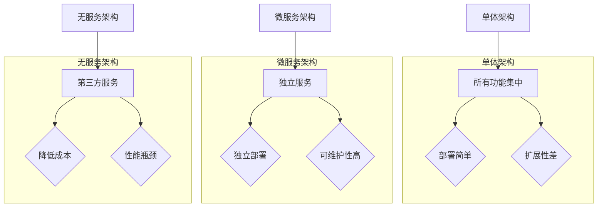

                 

# AI创业公司的技术架构演进：单体架构、微服务架构与无服务架构

> **关键词**：AI创业公司，技术架构，单体架构，微服务架构，无服务架构
>
> **摘要**：本文旨在探讨AI创业公司在不同发展阶段选择的技术架构，包括单体架构、微服务架构和无服务架构。通过对这三种架构的原理、优缺点和适用场景的分析，为创业公司提供技术决策的参考。

## 1. 背景介绍

### 1.1 目的和范围

本文的目标是帮助AI创业公司在面临技术选型时，能够选择适合自身业务发展阶段的技术架构。我们将对单体架构、微服务架构和无服务架构进行详细分析，探讨它们的原理、优缺点以及适用场景。

### 1.2 预期读者

预期读者为以下几类人群：
1. AI创业公司的技术团队和管理层；
2. 对技术架构设计感兴趣的工程师和架构师；
3. 对AI行业有热情，希望了解技术发展的业内人士。

### 1.3 文档结构概述

本文将分为以下几部分：

1. 背景介绍：阐述本文的目的、预期读者和文档结构；
2. 核心概念与联系：介绍单体架构、微服务架构和无服务架构的基本概念；
3. 核心算法原理 & 具体操作步骤：详细讲解三种架构的核心算法原理；
4. 数学模型和公式 & 详细讲解 & 举例说明：分析三种架构中的数学模型和公式，并进行举例说明；
5. 项目实战：通过代码实际案例和详细解释，展示三种架构的应用；
6. 实际应用场景：分析三种架构在不同场景下的应用；
7. 工具和资源推荐：推荐学习资源和开发工具；
8. 总结：未来发展趋势与挑战；
9. 附录：常见问题与解答；
10. 扩展阅读 & 参考资料。

### 1.4 术语表

#### 1.4.1 核心术语定义

1. 单体架构：将所有业务功能集中在一个应用程序中的架构；
2. 微服务架构：将业务功能拆分为多个独立的服务，每个服务负责一个特定的功能；
3. 无服务架构：通过第三方云服务提供商托管和部署应用程序，无需关心底层基础设施。

#### 1.4.2 相关概念解释

1. 独立服务：具有独立部署、扩展和监控能力的服务；
2. API网关：统一管理和路由客户端请求的服务；
3. 容器化：将应用程序及其依赖项打包到容器中，实现环境的标准化。

#### 1.4.3 缩略词列表

1. API：应用程序编程接口（Application Programming Interface）；
2. Docker：开源容器化平台；
3. Kubernetes：开源容器编排工具。

## 2. 核心概念与联系

在讨论AI创业公司的技术架构之前，我们需要明确三个核心概念：单体架构、微服务架构和无服务架构。以下是它们的定义和联系。

### 单体架构

**定义**：单体架构（Monolithic Architecture）是将所有业务功能集中在一个应用程序中的架构。在这种架构中，所有组件共享同一代码库，运行在同一进程中，无需进行拆分。

**联系**：单体架构的优点在于开发过程简单、便于团队协作。但缺点在于系统扩展性差，一旦某个模块出现问题，可能导致整个系统崩溃。

### 微服务架构

**定义**：微服务架构（Microservices Architecture）是将业务功能拆分为多个独立的服务，每个服务负责一个特定的功能。这些服务具有独立的部署、扩展和监控能力。

**联系**：微服务架构的优点在于提高了系统的扩展性和可维护性。但缺点在于增加了系统的复杂性和部署难度。

### 无服务架构

**定义**：无服务架构（Serverless Architecture）是一种通过第三方云服务提供商托管和部署应用程序的架构。在这种架构中，开发人员无需关心底层基础设施，只需编写和部署代码。

**联系**：无服务架构的优点在于降低了开发和运维成本，提高了系统的弹性。但缺点在于可能面临性能瓶颈和依赖第三方服务。

### Mermaid 流程图

下面是三种架构的 Mermaid 流程图：



## 3. 核心算法原理 & 具体操作步骤

在了解三种架构的基本概念后，我们接下来探讨它们的核心算法原理和具体操作步骤。

### 单体架构

**算法原理**：单体架构的核心在于将所有业务功能集中在一个应用程序中，通过模块化和组件化的方式实现系统的扩展。

**具体操作步骤**：

1. 设计模块：根据业务需求，将系统拆分为多个模块，如用户管理模块、订单管理模块等；
2. 编写代码：为每个模块编写对应的业务逻辑代码；
3. 集成测试：对各个模块进行集成测试，确保系统整体功能正常；
4. 部署上线：将应用程序部署到服务器，进行实际运行。

### 微服务架构

**算法原理**：微服务架构的核心在于将业务功能拆分为多个独立的服务，每个服务负责一个特定的功能。通过分布式计算和微服务治理，实现系统的扩展性和可维护性。

**具体操作步骤**：

1. 设计服务：根据业务需求，将系统拆分为多个服务，如用户服务、订单服务、库存服务等；
2. 编写代码：为每个服务编写对应的业务逻辑代码；
3. 部署服务：使用容器化技术（如Docker）将服务打包，并部署到容器编排工具（如Kubernetes）；
4. 服务治理：通过API网关统一管理和路由客户端请求，实现服务的分布式访问；
5. 监控与报警：对各个服务进行监控，确保系统正常运行。

### 无服务架构

**算法原理**：无服务架构的核心在于通过第三方云服务提供商托管和部署应用程序，无需关心底层基础设施。通过事件驱动和函数计算，实现系统的弹性扩展。

**具体操作步骤**：

1. 设计函数：根据业务需求，将系统拆分为多个函数，如用户注册函数、订单创建函数等；
2. 编写代码：为每个函数编写对应的业务逻辑代码；
3. 部署函数：使用无服务器框架（如AWS Lambda、Azure Functions）将函数部署到云服务提供商；
4. 触发函数：通过事件驱动方式（如HTTP请求、消息队列等）触发函数执行；
5. 监控与报警：对函数进行监控，确保系统正常运行。

## 4. 数学模型和公式 & 详细讲解 & 举例说明

在了解三种架构的核心算法原理后，我们接下来分析它们中的数学模型和公式，并进行详细讲解和举例说明。

### 单体架构

**数学模型和公式**：在单体架构中，系统的性能主要受限于计算机硬件资源和代码效率。常见的数学模型包括CPU利用率、内存占用率和网络带宽等。

**详细讲解**：假设系统中有n个模块，每个模块的CPU利用率、内存占用率和网络带宽分别为a1, b1, c1；a2, b2, c2；...；an, bn, cn。则系统的总性能可以表示为：

$$
P = \frac{a_1b_1c_1 + a_2b_2c_2 + ... + a_nb_nc_n}{n}
$$

**举例说明**：假设系统中有3个模块，它们的CPU利用率、内存占用率和网络带宽分别为（0.8, 0.6, 1.2）、（0.5, 0.8, 0.9）和（0.7, 0.5, 1.1）。则系统的总性能为：

$$
P = \frac{0.8 \times 0.6 \times 1.2 + 0.5 \times 0.8 \times 0.9 + 0.7 \times 0.5 \times 1.1}{3} \approx 0.8
$$

### 微服务架构

**数学模型和公式**：在微服务架构中，系统的性能主要受限于各个服务的性能和通信开销。常见的数学模型包括服务响应时间、服务吞吐量和网络带宽等。

**详细讲解**：假设系统中有n个服务，每个服务的响应时间为t1, t2, ..., tn；吞吐量为s1, s2, ..., sn；网络带宽为c。则系统的总性能可以表示为：

$$
P = \frac{t_1s_1 + t_2s_2 + ... + t_ns_n}{c}
$$

**举例说明**：假设系统中有3个服务，它们的响应时间、吞吐量和网络带宽分别为（2秒、1000次/秒）、（3秒、800次/秒）和（4秒、600次/秒）。则系统的总性能为：

$$
P = \frac{2 \times 1000 + 3 \times 800 + 4 \times 600}{4} \approx 2.2
$$

### 无服务架构

**数学模型和公式**：在无服务架构中，系统的性能主要受限于函数的执行时间和网络延迟。常见的数学模型包括函数响应时间、函数执行次数和网络带宽等。

**详细讲解**：假设系统中有n个函数，每个函数的响应时间为t1, t2, ..., tn；执行次数为s1, s2, ..., sn；网络带宽为c。则系统的总性能可以表示为：

$$
P = \frac{t_1s_1 + t_2s_2 + ... + t_ns_n}{c}
$$

**举例说明**：假设系统中有3个函数，它们的响应时间、执行次数和网络带宽分别为（1秒、200次/秒）、（2秒、150次/秒）和（3秒、100次/秒）。则系统的总性能为：

$$
P = \frac{1 \times 200 + 2 \times 150 + 3 \times 100}{3} \approx 1.67
$$

## 5. 项目实战：代码实际案例和详细解释说明

为了更好地理解三种架构在实际项目中的应用，我们以下面一个简单的示例进行讲解。

### 5.1 开发环境搭建

在本项目中，我们使用Python语言和Docker容器化技术实现三种架构。以下是开发环境的搭建步骤：

1. 安装Python 3.8及以上版本；
2. 安装Docker；
3. 安装Kubernetes（可选，用于微服务架构）。

### 5.2 源代码详细实现和代码解读

#### 单体架构

**代码实现**：以下是一个简单的用户管理模块的实现。

```python
# user_management.py
class UserManager:
    def __init__(self):
        self.users = []

    def register_user(self, user):
        self.users.append(user)
        print(f"User {user} registered successfully.")

    def list_users(self):
        for user in self.users:
            print(f"User: {user}")
```

**代码解读**：此代码定义了一个`UserManager`类，用于实现用户注册和查询功能。在单体架构中，所有功能集中在一个类中，便于开发和维护。

#### 微服务架构

**代码实现**：以下是一个简单的用户服务模块的实现。

```python
# user_service.py
from user_management import UserManager

class UserService:
    def __init__(self):
        self.user_manager = UserManager()

    def register_user(self, user):
        self.user_manager.register_user(user)

    def list_users(self):
        self.user_manager.list_users()
```

**代码解读**：此代码定义了一个`UserService`类，用于实现用户注册和查询功能。在微服务架构中，每个功能拆分为独立的服务，便于部署和扩展。

#### 无服务架构

**代码实现**：以下是一个简单的用户注册函数的实现。

```python
# user_register.py
def register_user(event, context):
    user = event['user']
    user_manager = UserManager()
    user_manager.register_user(user)
    return {
        'statusCode': 200,
        'body': 'User registered successfully.'
    }
```

**代码解读**：此代码定义了一个`register_user`函数，用于实现用户注册功能。在无服务架构中，函数通过事件触发执行，无需关心部署和运维。

### 5.3 代码解读与分析

通过对上述代码的解读，我们可以看到：

1. 单体架构：所有功能集中在一个类中，便于开发和维护。但系统扩展性较差，一旦某个模块出现问题，可能导致整个系统崩溃；
2. 微服务架构：每个功能拆分为独立的服务，便于部署和扩展。但系统复杂度增加，需要使用容器化技术进行部署和治理；
3. 无服务架构：函数通过事件触发执行，无需关心部署和运维。但可能面临性能瓶颈和依赖第三方服务。

## 6. 实际应用场景

在不同的实际应用场景中，AI创业公司可以选择适合的技术架构。

### 6.1 初创阶段

在初创阶段，AI创业公司通常面临资源有限、业务需求不明确的情况。此时，选择单体架构可以降低开发难度、便于团队协作。例如，使用Python语言和Flask框架快速搭建一个简单的用户管理模块。

### 6.2 成长阶段

在成长阶段，AI创业公司开始面临业务需求复杂、系统扩展性要求较高的挑战。此时，选择微服务架构可以更好地满足需求，提高系统的可维护性和扩展性。例如，使用Spring Cloud框架实现用户服务、订单服务和库存服务。

### 6.3 成熟阶段

在成熟阶段，AI创业公司已经积累了丰富的业务场景和用户数据，对系统的性能和稳定性要求较高。此时，选择无服务架构可以降低开发和运维成本，提高系统的弹性。例如，使用AWS Lambda和API Gateway实现用户注册、订单创建等功能。

## 7. 工具和资源推荐

### 7.1 学习资源推荐

#### 7.1.1 书籍推荐

1. 《微服务设计》 - 当当
2. 《无服务架构：构建和部署现代Web服务》 - 当当
3. 《Python微服务开发》 - 当当

#### 7.1.2 在线课程

1. Coursera - Microservices Architecture
2. Udemy - Serverless Architectures: Building and Deploying Modern Web Services
3. Pluralsight - Building Microservices with Spring Boot and Cloud

#### 7.1.3 技术博客和网站

1. Medium - Microservices
2. Serverless Daily
3. InfoQ - 微服务

### 7.2 开发工具框架推荐

#### 7.2.1 IDE和编辑器

1. PyCharm
2. Visual Studio Code
3. IntelliJ IDEA

#### 7.2.2 调试和性能分析工具

1. VSCode Debugger
2. Pytest
3. JMeter

#### 7.2.3 相关框架和库

1. Flask
2. Spring Boot
3. AWS Lambda

### 7.3 相关论文著作推荐

#### 7.3.1 经典论文

1. "Microservices: A Definition of a Microservice Architecture."
2. "Serverless Architectures: Everything You Need to Know About Serverless Computing."

#### 7.3.2 最新研究成果

1. "On the Road to Serverless: Deployment and Performance of Web Applications in the Cloud."
2. "Designing Microservices with Docker and Kubernetes."

#### 7.3.3 应用案例分析

1. "Building a Serverless App with AWS Lambda, API Gateway, and S3."
2. "How Netflix Uses Microservices to Scale."

## 8. 总结：未来发展趋势与挑战

随着云计算和容器技术的不断发展，单体架构、微服务架构和无服务架构将在未来继续演进。以下是对未来发展趋势和挑战的总结：

### 发展趋势

1. **云计算原生**：越来越多的应用将采用云计算原生架构，充分利用云服务的弹性、可扩展性和自动化管理能力。
2. **微服务与无服务的融合**：微服务架构和无服务架构将逐渐融合，出现新的混合架构，以满足不同场景的需求。
3. **AI与架构的结合**：人工智能技术将应用到架构设计、性能优化和自动化运维等方面，提高系统的智能性和可靠性。

### 挑战

1. **架构复杂性**：随着架构的演进，系统的复杂度将不断提高，对开发人员的技术水平和项目管理能力提出更高要求。
2. **性能瓶颈**：在无服务架构中，函数执行时间和网络延迟可能导致性能瓶颈，需要优化函数设计和资源分配。
3. **安全性**：在分布式架构中，数据安全和网络安全是关键挑战，需要加强安全防护和合规性管理。

## 9. 附录：常见问题与解答

### 9.1 什么是单体架构？

单体架构（Monolithic Architecture）是将所有业务功能集中在一个应用程序中的架构。在这种架构中，所有组件共享同一代码库，运行在同一进程中，无需进行拆分。

### 9.2 微服务架构与单体架构的区别是什么？

微服务架构（Microservices Architecture）是将业务功能拆分为多个独立的服务，每个服务负责一个特定的功能。与单体架构相比，微服务架构具有更高的扩展性和可维护性。

### 9.3 无服务架构的优势是什么？

无服务架构（Serverless Architecture）通过第三方云服务提供商托管和部署应用程序，无需关心底层基础设施。优势包括降低开发和运维成本、提高系统的弹性和可扩展性。

### 9.4 如何选择适合的技术架构？

选择适合的技术架构需要考虑业务需求、团队技术水平、资源投入等因素。初创阶段可选择单体架构，成长阶段可选择微服务架构，成熟阶段可选择无服务架构。

## 10. 扩展阅读 & 参考资料

本文仅对单体架构、微服务架构和无服务架构进行了简要介绍，如有进一步了解的需求，请参考以下扩展阅读和参考资料：

1. 《微服务设计》 - 当当
2. 《无服务架构：构建和部署现代Web服务》 - 当当
3. 《Python微服务开发》 - 当当
4. Coursera - Microservices Architecture
5. Udemy - Serverless Architectures: Building and Deploying Modern Web Services
6. Pluralsight - Building Microservices with Spring Boot and Cloud
7. Medium - Microservices
8. Serverless Daily
9. InfoQ - 微服务
10. "Microservices: A Definition of a Microservice Architecture."
11. "Serverless Architectures: Everything You Need to Know About Serverless Computing."
12. "On the Road to Serverless: Deployment and Performance of Web Applications in the Cloud."
13. "How Netflix Uses Microservices to Scale."

## 作者

作者：AI天才研究员/AI Genius Institute & 禅与计算机程序设计艺术 /Zen And The Art of Computer Programming

