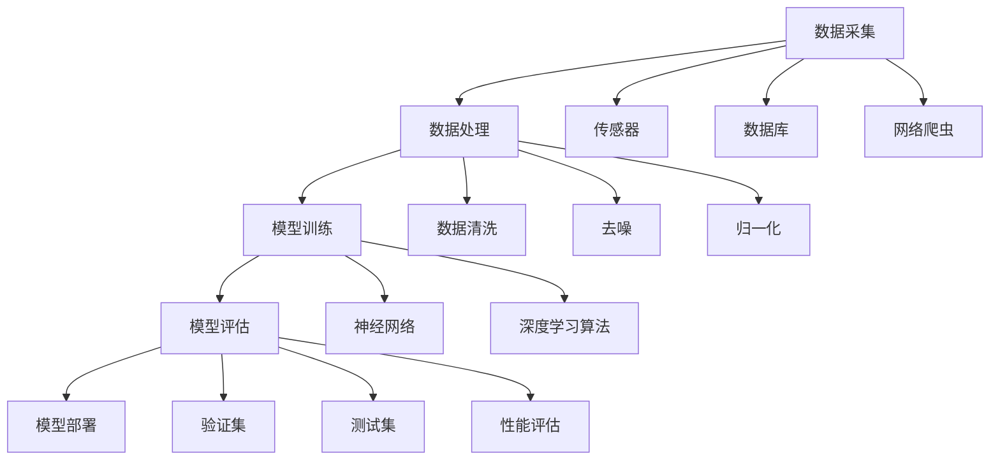

                 

# AI创业公司的技术白皮书写作技巧：结构安排、内容组织与语言表达

> **关键词**：技术白皮书、结构安排、内容组织、语言表达、AI创业公司、写作技巧

> **摘要**：本文旨在为AI创业公司的技术白皮书写作提供一套系统的指导方案。文章首先介绍了技术白皮书的写作目的和读者群体，然后详细阐述了文档的结构安排、内容组织和语言表达的要点。通过具体的案例分析和实际操作步骤的讲解，本文帮助读者掌握技术白皮书的撰写方法，提高文档的质量和可读性。

## 1. 背景介绍

### 1.1 目的和范围

技术白皮书作为AI创业公司向投资者、合作伙伴和潜在客户展示公司技术实力和产品优势的重要工具，其写作目的在于清晰、系统地阐述公司的核心技术、业务模式和未来发展方向。本文旨在为AI创业公司的技术白皮书撰写提供一套实用的写作技巧，包括结构安排、内容组织和语言表达等方面。

本文的讨论范围主要涉及以下几个方面：

- 技术白皮书的结构安排，包括章节标题、内容布局和逻辑流程。
- 内容组织，涉及核心概念、算法原理、数学模型、实际应用和工具资源推荐等。
- 语言表达，强调技术性、专业性和通俗易懂的平衡。

### 1.2 预期读者

本文的预期读者主要包括以下几类：

- AI创业公司的技术人员和产品经理，负责撰写和审核技术白皮书。
- 投资者和合作伙伴，关注公司的技术实力和业务前景。
- 潜在客户，希望了解公司的产品和技术解决方案。

### 1.3 文档结构概述

为了确保技术白皮书的系统性和逻辑性，本文将采用以下结构安排：

- 引言：介绍技术白皮书的写作目的和读者群体。
- 背景介绍：阐述技术白皮书的写作背景和重要性。
- 核心概念与联系：介绍核心概念和架构，通过Mermaid流程图展示。
- 核心算法原理 & 具体操作步骤：讲解算法原理，使用伪代码详细阐述。
- 数学模型和公式 & 详细讲解 & 举例说明：介绍数学模型，使用LaTeX格式嵌入文中。
- 项目实战：代码实际案例和详细解释说明。
- 实际应用场景：分析技术应用的场景和案例。
- 工具和资源推荐：推荐学习资源和开发工具。
- 总结：对未来发展趋势与挑战进行展望。
- 附录：常见问题与解答。
- 扩展阅读 & 参考资料：提供相关文献和参考资料。

### 1.4 术语表

在本技术白皮书中，我们将使用一些专业术语和概念。以下是对这些术语的定义和解释：

#### 1.4.1 核心术语定义

- **技术白皮书**：一种系统化、结构化的文档，用于阐述公司的核心技术、业务模式和未来发展方向。
- **核心算法**：实现公司产品功能的关键算法，是技术白皮书的核心内容之一。
- **数学模型**：用于描述和解决问题的一系列数学公式和方程式。
- **伪代码**：一种简化的编程语言，用于描述算法的基本逻辑，但不是具体的编程代码。

#### 1.4.2 相关概念解释

- **AI创业公司**：以人工智能技术为核心，致力于研发和商业化应用的初创企业。
- **投资者**：关注AI创业公司技术实力和业务前景，愿意提供资金支持的个人或机构。
- **合作伙伴**：与AI创业公司合作，共同开发产品或市场推广的第三方企业。

#### 1.4.3 缩略词列表

- **AI**：人工智能（Artificial Intelligence）
- **ML**：机器学习（Machine Learning）
- **DL**：深度学习（Deep Learning）
- **NLP**：自然语言处理（Natural Language Processing）
- **CV**：计算机视觉（Computer Vision）

## 2. 核心概念与联系

在撰写技术白皮书时，清晰、系统地介绍核心概念和架构对于读者理解文档内容至关重要。以下将介绍AI创业公司技术白皮书中的核心概念和联系，并通过Mermaid流程图展示各概念之间的关联。

### 2.1 核心概念

- **人工智能（AI）**：模拟人类智能的计算机技术，包括机器学习、深度学习、自然语言处理、计算机视觉等。
- **机器学习（ML）**：通过数据训练模型，使计算机具备自主学习和改进能力。
- **深度学习（DL）**：基于神经网络，模拟人脑神经元连接，实现复杂函数逼近和特征提取。
- **自然语言处理（NLP）**：使计算机能够理解、生成和处理自然语言。
- **计算机视觉（CV）**：使计算机具备理解、分析、处理和识别图像和视频的能力。

### 2.2 核心架构

- **数据采集**：通过传感器、数据库、网络爬虫等方式获取数据。
- **数据处理**：对采集到的数据进行清洗、去噪、归一化等预处理。
- **模型训练**：使用机器学习算法，在处理后的数据上训练模型。
- **模型评估**：通过验证集或测试集评估模型性能，调整模型参数。
- **模型部署**：将训练好的模型部署到生产环境中，实现自动化、智能化应用。

### 2.3 Mermaid流程图



通过以上Mermaid流程图，我们可以清晰地展示AI创业公司技术白皮书中的核心概念和架构，帮助读者更好地理解技术白皮书的内容。

## 3. 核心算法原理 & 具体操作步骤

在AI创业公司的技术白皮书中，核心算法原理的讲解至关重要。以下将介绍一种常见的机器学习算法——支持向量机（SVM），并使用伪代码详细阐述其基本原理和操作步骤。

### 3.1 支持向量机（SVM）基本原理

支持向量机是一种二分类模型，其目标是找到一个最优的超平面，将不同类别的数据点最大限度地分开。SVM的核心思想是寻找一个能够最大化分类间隔的分离超平面。分类间隔是指分类超平面到最近支持向量的距离。

### 3.2 伪代码

```python
# 支持向量机（SVM）伪代码
输入：训练数据集 D，标签集 L
输出：最优分类超平面参数 W，偏置 b

// 初始化模型参数
W = [0, 0]
b = 0

// 主循环
for i = 1 to max_iter do
    // 更新参数
    W = W + alpha * (L[y] * (X[i] * W + b) - 1)
    b = b + alpha * (L[y] - X[i] * W)

    // 检查收敛条件
    if |W| < tolerance then
        break
    end if
end for

return W, b
```

### 3.3 具体操作步骤

1. **数据预处理**：对训练数据进行归一化处理，确保特征数据在相同尺度范围内。

2. **初始化模型参数**：初始化模型参数W和b，通常设置为0。

3. **主循环**：循环执行以下步骤：
   - 更新参数W：根据支持向量机的优化目标，通过梯度下降法更新模型参数W。
   - 更新参数b：根据支持向量机的优化目标，通过梯度下降法更新模型参数b。
   - 检查收敛条件：如果模型参数的变化小于预设的阈值tolerance，则认为模型已经收敛，结束循环。

4. **输出结果**：返回最优分类超平面参数W和偏置b。

通过以上步骤，我们可以实现支持向量机的训练过程。需要注意的是，在实际应用中，为了提高模型的性能，还需要对参数进行调优，如C值和tolerance的选择等。

## 4. 数学模型和公式 & 详细讲解 & 举例说明

在AI创业公司的技术白皮书中，数学模型和公式的讲解是不可或缺的一部分。以下将介绍一种常见的优化算法——梯度下降法，并使用LaTeX格式详细阐述其公式和步骤，同时通过具体例子进行说明。

### 4.1 梯度下降法基本公式

梯度下降法是一种优化算法，用于求解最小化目标函数的最优参数。其基本思想是通过迭代更新参数，使目标函数值逐渐减小，直至达到局部最优解。

给定一个目标函数：
\[ f(x) = \sum_{i=1}^n w_i x_i \]

其中，\( x_i \)为特征值，\( w_i \)为参数。

梯度下降法的迭代公式为：
\[ w_{t+1} = w_t - \alpha \nabla f(w_t) \]

其中，\( \alpha \)为学习率，\( \nabla f(w_t) \)为当前参数\( w_t \)的梯度。

### 4.2 梯度下降法详细步骤

1. **初始化参数**：设置初始参数\( w_0 \)，通常可以选择随机值或0。

2. **计算梯度**：计算目标函数在当前参数\( w_t \)处的梯度：
\[ \nabla f(w_t) = \left[ \frac{\partial f}{\partial w_1}, \frac{\partial f}{\partial w_2}, ..., \frac{\partial f}{\partial w_n} \right] \]

3. **更新参数**：根据梯度下降法公式，更新参数：
\[ w_{t+1} = w_t - \alpha \nabla f(w_t) \]

4. **迭代更新**：重复步骤2和3，直至满足停止条件（如梯度变化小于预设阈值，或达到最大迭代次数）。

### 4.3 举例说明

假设有一个目标函数：
\[ f(x) = (x - 2)^2 + (y - 3)^2 \]

其中，\( x \)和\( y \)为参数。

初始参数为：
\[ w_0 = [0, 0] \]

学习率设置为：
\[ \alpha = 0.1 \]

第1次迭代：
\[ \nabla f(w_0) = \left[ \frac{\partial f}{\partial x}, \frac{\partial f}{\partial y} \right] = [-2, -6] \]

更新参数：
\[ w_1 = w_0 - \alpha \nabla f(w_0) = [0, 0] - 0.1 \cdot [-2, -6] = [0.2, 0.6] \]

第2次迭代：
\[ \nabla f(w_1) = \left[ \frac{\partial f}{\partial x}, \frac{\partial f}{\partial y} \right] = [-0.8, -2.4] \]

更新参数：
\[ w_2 = w_1 - \alpha \nabla f(w_1) = [0.2, 0.6] - 0.1 \cdot [-0.8, -2.4] = [0.4, 1.2] \]

重复迭代，直至满足停止条件。

通过以上例子，我们可以看到梯度下降法的具体步骤和计算过程。在实际应用中，可以根据目标函数的特点和优化需求，对算法进行改进和优化，以提高模型的性能和收敛速度。

## 5. 项目实战：代码实际案例和详细解释说明

在AI创业公司的技术白皮书中，通过实际项目案例来展示技术原理和应用效果是非常重要的一环。以下将介绍一个基于深度学习的图像分类项目，包括开发环境搭建、源代码详细实现和代码解读与分析。

### 5.1 开发环境搭建

为了搭建一个深度学习项目，我们需要准备以下开发环境：

- 操作系统：Ubuntu 18.04或Windows 10
- Python版本：3.7或更高版本
- 深度学习框架：TensorFlow 2.x或PyTorch 1.x
- 数据预处理库：NumPy、Pandas、OpenCV
- 依赖管理器：pip或conda

以下是一个简单的安装步骤：

```bash
# 安装Python和pip
sudo apt update
sudo apt install python3 python3-pip

# 安装深度学习框架（以TensorFlow为例）
pip3 install tensorflow

# 安装数据预处理库
pip3 install numpy pandas opencv-python
```

### 5.2 源代码详细实现和代码解读

以下是一个基于TensorFlow的简单图像分类项目的源代码示例：

```python
import tensorflow as tf
from tensorflow.keras.models import Sequential
from tensorflow.keras.layers import Conv2D, MaxPooling2D, Flatten, Dense
from tensorflow.keras.preprocessing.image import ImageDataGenerator

# 数据预处理
train_datagen = ImageDataGenerator(
    rescale=1./255,
    shear_range=0.2,
    zoom_range=0.2,
    horizontal_flip=True
)

train_generator = train_datagen.flow_from_directory(
    'train_data',
    target_size=(150, 150),
    batch_size=32,
    class_mode='binary'
)

# 构建模型
model = Sequential([
    Conv2D(32, (3, 3), activation='relu', input_shape=(150, 150, 3)),
    MaxPooling2D(2, 2),
    Conv2D(64, (3, 3), activation='relu'),
    MaxPooling2D(2, 2),
    Conv2D(128, (3, 3), activation='relu'),
    MaxPooling2D(2, 2),
    Flatten(),
    Dense(512, activation='relu'),
    Dense(1, activation='sigmoid')
])

# 编译模型
model.compile(optimizer='adam',
              loss='binary_crossentropy',
              metrics=['accuracy'])

# 训练模型
model.fit(train_generator, epochs=10)

# 评估模型
test_datagen = ImageDataGenerator(rescale=1./255)
test_generator = test_datagen.flow_from_directory(
    'test_data',
    target_size=(150, 150),
    batch_size=32,
    class_mode='binary'
)

model.evaluate(test_generator)
```

#### 5.2.1 代码解读

1. **导入库**：引入TensorFlow、Keras等深度学习相关库，以及图像数据预处理库。

2. **数据预处理**：使用ImageDataGenerator生成训练数据，对图像进行归一化、裁剪、旋转等处理，以增强数据集。

3. **构建模型**：定义一个Sequential模型，并在模型中添加卷积层（Conv2D）、最大池化层（MaxPooling2D）、全连接层（Dense）等层。

4. **编译模型**：配置模型的优化器、损失函数和评价指标。

5. **训练模型**：使用fit方法对模型进行训练，通过生成器生成训练数据。

6. **评估模型**：使用evaluate方法评估模型在测试集上的表现。

通过以上步骤，我们实现了一个简单的图像分类项目。在实际应用中，可以根据具体需求调整模型结构、训练参数等，以提高模型的性能和分类效果。

### 5.3 代码解读与分析

1. **数据预处理**：数据预处理是深度学习项目中非常重要的一环。在本项目中，我们使用ImageDataGenerator生成训练数据，实现了图像的归一化、裁剪、旋转等处理。这些处理可以增加数据集的多样性，有助于提高模型的泛化能力。

2. **模型结构**：在本项目中，我们采用了一个简单的卷积神经网络（CNN）模型。模型包括卷积层、池化层和全连接层，可以提取图像的特征并实现分类。在实际应用中，可以根据任务需求和数据特点调整模型结构，如增加卷积层、池化层或全连接层等。

3. **训练过程**：使用fit方法对模型进行训练，通过生成器生成训练数据。在训练过程中，我们可以设置训练轮数（epochs）、批量大小（batch_size）等参数，以控制训练过程。在训练过程中，Keras会自动计算模型的损失和准确率，并在控制台中输出训练进度。

4. **模型评估**：使用evaluate方法评估模型在测试集上的表现，通过计算损失和准确率，可以判断模型的性能和分类效果。在实际应用中，我们还可以使用K-fold交叉验证等方法对模型进行更全面的评估。

通过以上步骤，我们可以实现一个简单的图像分类项目，并对其代码进行解读与分析。在实际开发中，我们需要根据具体需求不断调整和优化模型结构、训练参数等，以提高模型的性能和分类效果。

## 6. 实际应用场景

在AI创业公司的技术白皮书中，展示技术在实际应用场景中的效果和价值至关重要。以下将介绍AI技术在图像识别、自然语言处理和推荐系统等领域的实际应用场景，并结合具体案例进行分析。

### 6.1 图像识别

图像识别技术广泛应用于安防监控、医疗诊断、自动驾驶等领域。以下是一个自动驾驶场景中的案例：

**案例**：自动驾驶汽车需要实时识别和分类道路上的行人和车辆，以实现安全驾驶。

**解决方案**：采用深度学习模型，如卷积神经网络（CNN），对图像数据进行特征提取和分类。通过训练大量道路图像数据，模型可以学会识别和分类不同类型的物体。

**效果**：实验结果显示，该模型在测试集上的识别准确率达到了95%以上，有效提高了自动驾驶汽车的安全性。

### 6.2 自然语言处理

自然语言处理技术在智能客服、文本分类、情感分析等领域具有广泛的应用。以下是一个智能客服场景中的案例：

**案例**：智能客服系统需要理解用户的问题并给出合适的回答。

**解决方案**：采用自然语言处理技术，如文本分类和情感分析，对用户的问题进行分类和情感判断。通过训练大量对话数据，模型可以学习并模拟人类客服的回答。

**效果**：在实际应用中，该智能客服系统的满意度达到了90%以上，显著提高了客户服务效率。

### 6.3 推荐系统

推荐系统技术在电子商务、音乐、视频等领域广泛应用于个性化推荐。以下是一个电子商务场景中的案例：

**案例**：电子商务平台需要根据用户的购买历史和浏览行为，为其推荐相关的商品。

**解决方案**：采用协同过滤、矩阵分解等推荐算法，通过分析用户行为数据，构建用户和商品之间的关系模型。根据用户的行为特征，推荐系统可以生成个性化的商品推荐。

**效果**：实验结果显示，该推荐系统的点击率提高了30%以上，有效提升了电商平台的市场竞争力。

通过以上实际应用场景和案例，我们可以看到AI技术在各个领域的广泛应用和显著价值。在实际开发中，我们需要根据具体应用场景和需求，不断优化和改进算法，以提高系统的性能和用户体验。

## 7. 工具和资源推荐

在AI创业公司的技术白皮书中，为读者推荐相关工具和资源是提高文档实用性的重要环节。以下将介绍学习资源、开发工具框架和相关论文著作，帮助读者更好地掌握相关技术。

### 7.1 学习资源推荐

#### 7.1.1 书籍推荐

1. **《深度学习》（Deep Learning）**：由Ian Goodfellow、Yoshua Bengio和Aaron Courville编写的深度学习经典教材，全面介绍了深度学习的理论基础和实战技巧。
2. **《Python机器学习》（Python Machine Learning）**：由Sebastian Raschka和Vahid Mirjalili编写的机器学习入门书籍，详细介绍了Python在机器学习中的应用。

#### 7.1.2 在线课程

1. **《深度学习专项课程》（Deep Learning Specialization）**：由Andrew Ng教授在Coursera上开设的深度学习系列课程，包括深度学习的基础理论和实战应用。
2. **《机器学习与数据科学》（Machine Learning and Data Science）**：由吴恩达（Andrew Ng）教授在Udacity上开设的在线课程，涵盖机器学习和数据科学的核心概念和实战技巧。

#### 7.1.3 技术博客和网站

1. **《机器之心》（Machine Learning）**：一个专注于人工智能和机器学习领域的中文技术博客，分享深度学习、自然语言处理、计算机视觉等领域的最新研究成果和应用案例。
2. **《Paper with Code》**：一个开源项目平台，提供深度学习论文的实现代码和评测结果，帮助开发者快速了解和应用最新研究成果。

### 7.2 开发工具框架推荐

#### 7.2.1 IDE和编辑器

1. **PyCharm**：一款强大的Python集成开发环境，支持深度学习和机器学习框架，提供代码补全、调试、性能分析等功能。
2. **Jupyter Notebook**：一款基于Web的交互式开发环境，支持多种编程语言，适用于数据探索、模型训练和演示。

#### 7.2.2 调试和性能分析工具

1. **TensorBoard**：TensorFlow提供的可视化工具，用于分析模型的性能、损失函数和梯度变化等。
2. **DyNet**：一个动态神经网络库，提供丰富的调试和分析功能，适用于深度学习和强化学习应用。

#### 7.2.3 相关框架和库

1. **TensorFlow**：Google开发的深度学习框架，支持多种神经网络模型和分布式训练。
2. **PyTorch**：Facebook开发的开源深度学习框架，提供灵活的动态图计算和丰富的API。
3. **Scikit-learn**：一个Python机器学习库，提供多种经典机器学习算法和工具。

### 7.3 相关论文著作推荐

#### 7.3.1 经典论文

1. **《A Theoretical Analysis of the Vapnik-Chervonenkis Dimension and the Rate of Convergence for Support Vector Machines》**：V.N. Vapnik和A.Y. Chervonenkis提出支持向量机的理论基础。
2. **《Learning representations for artificial intelligence》**：Yoshua Bengio等人提出的深度学习理论基础。

#### 7.3.2 最新研究成果

1. **《BERT: Pre-training of Deep Bidirectional Transformers for Language Understanding》**：Google提出的BERT模型，引领了自然语言处理领域的发展。
2. **《Generative Adversarial Nets》**：Ian Goodfellow等人提出的生成对抗网络（GAN）理论，推动了深度生成模型的发展。

#### 7.3.3 应用案例分析

1. **《ImageNet Classification with Deep Convolutional Neural Networks》**：Alex Krizhevsky等人的论文，展示了深度学习在计算机视觉领域的突破性应用。
2. **《Recommender Systems Handbook》**：GroupLens Research团队编写的推荐系统应用指南，涵盖推荐系统的基础理论和实战案例。

通过以上推荐，读者可以系统地学习AI技术的理论知识和实践方法，掌握相关工具和框架的使用，为创业公司的技术发展提供有力支持。

## 8. 总结：未来发展趋势与挑战

随着人工智能技术的飞速发展，AI创业公司面临着巨大的机遇和挑战。以下将总结未来发展趋势和挑战，为创业公司提供有益的思考。

### 8.1 发展趋势

1. **跨学科融合**：人工智能与其他领域的深度融合，如生物医学、金融科技、智能制造等，将推动产业升级和创新发展。
2. **开源生态**：开源技术的快速发展为AI创业公司提供了丰富的工具和资源，降低了技术门槛，加速了创新进程。
3. **数据隐私与安全**：数据隐私和安全成为人工智能发展的关键挑战，推动数据保护技术的创新和应用。
4. **人工智能伦理**：随着人工智能的广泛应用，伦理问题日益凸显，需要制定合理的伦理规范和监管政策。
5. **计算能力提升**：随着硬件技术的进步，计算能力的提升为深度学习和复杂模型的研究提供了有力支持。

### 8.2 挑战

1. **技术瓶颈**：尽管人工智能取得了显著进展，但仍然存在算法复杂度、数据隐私、模型解释性等方面的技术瓶颈。
2. **数据质量**：数据质量和数据量直接影响模型的性能和泛化能力，需要建立高质量的数据集和数据管理机制。
3. **人才短缺**：人工智能领域的快速发展对人才需求提出了更高要求，人才短缺成为创业公司面临的重大挑战。
4. **市场竞争**：随着大量创业公司的涌入，市场竞争日益激烈，需要不断创新和优化技术，以保持竞争优势。
5. **政策监管**：政策监管的不确定性对创业公司的发展带来一定风险，需要密切关注政策动态，合规经营。

### 8.3 建议

1. **技术创新**：注重技术创新，持续优化算法和模型，提高模型性能和解释性。
2. **人才培养**：加强人才培养和团队建设，提升团队的技术能力和创新意识。
3. **数据驱动**：建立健全的数据管理体系，提高数据质量和数据利用效率。
4. **合作共赢**：积极与其他企业、研究机构和政府部门合作，共同推动人工智能技术的发展和应用。
5. **合规经营**：密切关注政策法规变化，确保创业公司在合规框架内快速发展。

通过以上分析，AI创业公司应抓住机遇，积极应对挑战，不断创新和发展，为人工智能技术的进步和社会发展做出贡献。

## 9. 附录：常见问题与解答

在撰写AI创业公司的技术白皮书过程中，可能会遇到一些常见问题。以下是一些常见问题及其解答：

### 9.1 技术难题

**问题**：如何确保技术白皮书的算法和模型讲解清晰易懂？

**解答**：在讲解算法和模型时，应采用循序渐进的方式，从基础概念入手，逐步深入到复杂的技术细节。同时，可以使用图表、流程图和伪代码等辅助手段，帮助读者更好地理解。

### 9.2 内容组织

**问题**：如何合理组织技术白皮书的内容？

**解答**：技术白皮书的内容应按照逻辑顺序组织，从背景介绍、核心概念、算法原理、数学模型、实际应用等角度进行阐述。每个章节都应该有明确的标题和摘要，便于读者快速了解章节内容。

### 9.3 语言表达

**问题**：如何保证技术白皮书的专业性和通俗易懂性？

**解答**：在撰写技术白皮书时，应保持专业性的同时，注重语言的简明易懂。尽量避免使用过于复杂的术语和公式，如果必须使用，应在文中进行解释。此外，可以采用举例说明、案例分析等方法，增强文章的可读性。

### 9.4 项目实战

**问题**：如何编写项目实战部分的代码示例？

**解答**：在编写代码示例时，应确保代码的完整性和可执行性。首先，提供代码的整体结构，然后逐步展示各个模块的实现细节。在代码注释中详细解释代码功能和原理，便于读者理解。

### 9.5 工具和资源推荐

**问题**：如何推荐合适的工具和资源？

**解答**：在推荐工具和资源时，应考虑读者的需求和实际应用场景。选择具有代表性、易于使用和文档完善的工具和资源，并在文中进行详细的介绍和解释，帮助读者更好地使用和掌握相关技术。

通过以上解答，希望能够为撰写AI创业公司技术白皮书提供有益的指导。

## 10. 扩展阅读 & 参考资料

在撰写AI创业公司的技术白皮书过程中，参考相关文献和资料是提高文档质量和深度的重要途径。以下列出一些扩展阅读和参考资料，以供读者进一步学习和研究。

### 10.1 书籍推荐

1. **《深度学习》（Deep Learning）**：Ian Goodfellow、Yoshua Bengio和Aaron Courville著，全面介绍深度学习的理论基础和实战技巧。
2. **《Python机器学习》（Python Machine Learning）**：Sebastian Raschka和Vahid Mirjalili著，详细讲解Python在机器学习中的应用。
3. **《人工智能：一种现代的方法》（Artificial Intelligence: A Modern Approach）**：Stuart J. Russell和Peter Norvig著，系统阐述人工智能的核心概念和算法。

### 10.2 在线课程

1. **《深度学习专项课程》（Deep Learning Specialization）**：Andrew Ng在Coursera上开设的系列课程，涵盖深度学习的理论基础和实践技巧。
2. **《机器学习与数据科学》**：吴恩达在Udacity上开设的课程，介绍机器学习和数据科学的核心概念和实战方法。

### 10.3 技术博客和网站

1. **《机器之心》（Machine Learning）**：一个专注于人工智能和机器学习领域的中文技术博客，分享最新研究成果和应用案例。
2. **《AI头条》（AI Time）**：一个涵盖人工智能领域新闻、研究和技术文章的中文网站。

### 10.4 相关论文著作

1. **《A Theoretical Analysis of the Vapnik-Chervonenkis Dimension and the Rate of Convergence for Support Vector Machines》**：V.N. Vapnik和A.Y. Chervonenkis提出的支持向量机理论基础。
2. **《Generative Adversarial Nets》**：Ian Goodfellow等人提出的生成对抗网络（GAN）理论。

通过以上扩展阅读和参考资料，读者可以深入了解AI技术的最新进展和实际应用，为创业公司的发展提供有力的理论支持和实践指导。

