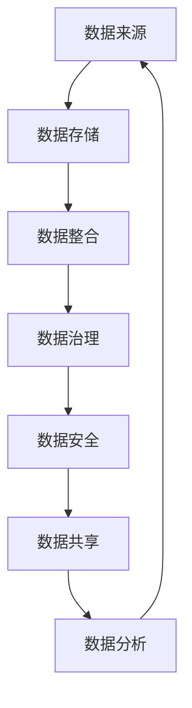

                 

# AI创业公司的数据资产管理策略

> 关键词：AI创业、数据资产、管理策略、数据安全、数据治理、数据共享

> 摘要：随着人工智能技术的迅猛发展，数据已成为创业公司的核心竞争力之一。本文将探讨AI创业公司在数据资产管理方面的重要策略，包括数据安全、数据治理、数据共享以及相关技术的应用和挑战。

## 1. 背景介绍

### 1.1 目的和范围

随着大数据、云计算和人工智能技术的兴起，数据已成为企业创新和发展的关键资源。对于AI创业公司而言，如何高效、安全地管理数据资产，成为其成功的关键因素之一。本文旨在探讨AI创业公司在数据资产管理方面的重要策略，以期为创业者提供实用的参考。

### 1.2 预期读者

本文预期读者为AI创业公司创始人、技术团队负责人、数据分析师以及从事相关领域的研究人员。

### 1.3 文档结构概述

本文将分为以下几个部分：

1. 背景介绍：阐述数据资产管理的必要性和重要性。
2. 核心概念与联系：介绍数据资产管理中的核心概念和架构。
3. 核心算法原理 & 具体操作步骤：讲解数据资产管理的核心算法原理和具体操作步骤。
4. 数学模型和公式 & 详细讲解 & 举例说明：介绍数据资产管理中的数学模型和公式，并举例说明。
5. 项目实战：通过实际案例展示数据资产管理的应用。
6. 实际应用场景：分析数据资产管理在不同场景中的应用。
7. 工具和资源推荐：推荐相关学习资源、开发工具和框架。
8. 总结：展望数据资产管理的未来发展趋势与挑战。
9. 附录：常见问题与解答。
10. 扩展阅读 & 参考资料：提供更多相关资料供读者深入阅读。

### 1.4 术语表

#### 1.4.1 核心术语定义

- 数据资产管理：指企业对数据资源进行规划、组织、管理和利用的过程。
- 数据安全：指保护数据免受未经授权的访问、泄露、篡改和破坏。
- 数据治理：指通过建立规范、流程和制度，确保数据质量、合规性和可持续利用。
- 数据共享：指企业内部或跨企业之间共享数据，以提高数据利用效率和价值。
- 数据湖：一种大规模的数据存储解决方案，支持不同类型数据的存储和整合。

#### 1.4.2 相关概念解释

- 数据质量：指数据满足使用需求的能力，包括完整性、准确性、一致性、及时性和可靠性。
- 数据隐私：指保护个人隐私信息，防止数据泄露和滥用。
- 数据整合：指将不同来源、格式和结构的数据进行整合，以实现统一管理和利用。
- 数据挖掘：指从大量数据中提取有价值的信息和知识，为决策提供支持。

#### 1.4.3 缩略词列表

- AI：人工智能（Artificial Intelligence）
- ML：机器学习（Machine Learning）
- DL：深度学习（Deep Learning）
- Hadoop：一个开源的大数据处理框架
- Spark：一个开源的分布式计算框架

## 2. 核心概念与联系

在数据资产管理中，以下几个核心概念和联系是不可或缺的。下面将使用Mermaid流程图展示这些概念和联系。



### 2.1 数据来源

数据来源是数据资产管理的起点。AI创业公司可以从多个渠道获取数据，包括内部业务数据、外部公共数据、合作伙伴数据等。数据来源的多样性和质量直接影响数据资产的价值。

### 2.2 数据存储

数据存储是数据资产管理的核心环节。选择合适的数据存储方案，如关系型数据库、NoSQL数据库、数据湖等，能够确保数据的安全、可靠和高效访问。

### 2.3 数据整合

数据整合是将来自不同来源和格式的数据统一管理和利用的关键。通过数据整合，企业可以实现数据的标准化、去重和清洗，提高数据质量。

### 2.4 数据治理

数据治理是指通过制定规范、流程和制度，确保数据质量、合规性和可持续利用。数据治理不仅涉及数据本身的管理，还包括数据相关的流程、组织和政策。

### 2.5 数据安全

数据安全是数据资产管理的重要保障。企业需要建立完善的数据安全体系，包括访问控制、数据加密、备份和恢复等，以保护数据免受未经授权的访问和破坏。

### 2.6 数据共享

数据共享是指企业内部或跨企业之间共享数据，以提高数据利用效率和价值。数据共享可以促进业务合作和创新，但同时也需要关注数据安全和隐私保护。

### 2.7 数据分析

数据分析是数据资产管理的最终目标。通过数据分析，企业可以挖掘数据中的价值，为决策提供支持，实现数据驱动的发展。

## 3. 核心算法原理 & 具体操作步骤

### 3.1 数据质量评估

数据质量评估是数据治理的重要环节。以下是一个简单的数据质量评估算法原理和具体操作步骤。

#### 3.1.1 算法原理

数据质量评估的核心是评估数据的完整性、准确性、一致性和及时性。以下是一个基于这些指标的数据质量评估算法：

```plaintext
输入：数据集 D，质量指标集合 M = {完整性、准确性、一致性、及时性}
输出：数据质量评分 Q(D)

1. 初始化评分 Q(D) 为 0
2. 对每个质量指标 M_i，执行以下步骤：
   a. 计算指标 M_i 的得分 S_i(D)
   b. 更新评分 Q(D) 为 Q(D) + S_i(D)
3. 返回评分 Q(D)
```

#### 3.1.2 操作步骤

1. 收集数据集 D。
2. 定义质量指标集合 M。
3. 对每个质量指标 M_i，计算得分 S_i(D)。
4. 更新评分 Q(D)。
5. 返回评分 Q(D)。

### 3.2 数据加密

数据加密是数据安全的关键技术。以下是一个简单的数据加密算法原理和具体操作步骤。

#### 3.2.1 算法原理

数据加密的基本原理是将明文数据转换为密文，以保护数据在传输和存储过程中的安全。以下是一个基于对称加密算法的数据加密算法原理：

```plaintext
输入：明文数据 M，密钥 K
输出：密文 C

1. 使用密钥 K 对明文数据 M 进行加密
2. 得到密文 C
3. 返回密文 C
```

#### 3.2.2 操作步骤

1. 收集明文数据 M。
2. 选择合适的加密算法和密钥 K。
3. 使用密钥 K 对明文数据 M 进行加密。
4. 得到密文 C。
5. 存储或传输密文 C。

### 3.3 数据备份与恢复

数据备份与恢复是数据安全的重要组成部分。以下是一个简单的数据备份与恢复算法原理和具体操作步骤。

#### 3.3.1 算法原理

数据备份是将数据复制到多个存储设备或位置，以防止数据丢失。数据恢复是从备份中恢复数据，以恢复业务正常运行。以下是一个基于增量备份的数据备份与恢复算法原理：

```plaintext
输入：数据集 D，备份策略 T
输出：备份集 B

1. 初始化备份集 B 为空
2. 对每个时间点 T_i，执行以下步骤：
   a. 备份数据集 D 在时间点 T_i 的状态
   b. 将备份添加到备份集 B
3. 返回备份集 B

输入：备份集 B，恢复策略 R
输出：恢复集 R

1. 初始化恢复集 R 为空
2. 对每个备份 B_i，执行以下步骤：
   a. 恢复备份 B_i 的数据集 D
   b. 将恢复的数据集 D 添加到恢复集 R
3. 返回恢复集 R
```

#### 3.3.2 操作步骤

1. 收集数据集 D。
2. 选择合适的备份策略 T。
3. 对每个时间点 T_i，备份数据集 D 的状态。
4. 将备份添加到备份集 B。
5. 返回备份集 B。
6. 选择合适的恢复策略 R。
7. 对每个备份 B_i，恢复备份 B_i 的数据集 D。
8. 将恢复的数据集 D 添加到恢复集 R。
9. 返回恢复集 R。

## 4. 数学模型和公式 & 详细讲解 & 举例说明

### 4.1 数据质量评估模型

数据质量评估可以采用加权评分模型。以下是一个简单示例：

$$
Q(D) = w_1 \cdot S_1(D) + w_2 \cdot S_2(D) + w_3 \cdot S_3(D) + w_4 \cdot S_4(D)
$$

其中，$Q(D)$ 是数据质量评分，$S_1(D), S_2(D), S_3(D), S_4(D)$ 是完整性、准确性、一致性和及时性的得分，$w_1, w_2, w_3, w_4$ 是对应指标的权重。

#### 示例：

假设某数据集的完整性得分为 0.9，准确性得分为 0.8，一致性得分为 0.9，及时性得分为 0.7。假设各项指标的权重分别为 0.2、0.3、0.2、0.3。则数据质量评分为：

$$
Q(D) = 0.2 \cdot 0.9 + 0.3 \cdot 0.8 + 0.2 \cdot 0.9 + 0.3 \cdot 0.7 = 0.18 + 0.24 + 0.18 + 0.21 = 0.81
$$

### 4.2 数据加密模型

数据加密可以采用AES（高级加密标准）算法。以下是一个简单示例：

$$
C = E(K, M)
$$

其中，$C$ 是密文，$K$ 是密钥，$M$ 是明文。

#### 示例：

假设使用AES算法对明文 "Hello, World!" 进行加密，密钥为 "0123456789abcdef"。则密文为：

$$
C = AES_{0123456789abcdef}("Hello, World!")
$$

### 4.3 数据备份与恢复模型

数据备份与恢复可以采用增量备份策略。以下是一个简单示例：

$$
B = \{D_0, D_1, D_2, ..., D_n\}
$$

其中，$B$ 是备份集，$D_0, D_1, D_2, ..., D_n$ 是连续备份的数据集。

#### 示例：

假设每天对数据集进行备份，备份集如下：

$$
B = \{D_0, D_1, D_2, D_3, D_4\}
$$

其中，$D_0$ 是初始数据集，$D_1, D_2, D_3, D_4$ 是每天的数据集备份。

## 5. 项目实战：代码实际案例和详细解释说明

### 5.1 开发环境搭建

为了展示数据资产管理的实际应用，我们将使用Python语言实现一个简单的数据加密、备份和恢复项目。首先，我们需要搭建Python开发环境。

#### 操作步骤：

1. 安装Python 3.x版本。
2. 安装pip包管理器。
3. 使用pip安装所需依赖包，如pandas、numpy、cryptography等。

### 5.2 源代码详细实现和代码解读

下面是数据加密、备份和恢复项目的源代码及详细解读。

#### 源代码：

```python
import os
import json
from cryptography.fernet import Fernet
import numpy as np
import pandas as pd

# 生成加密密钥
def generate_key():
    return Fernet.generate_key()

# 加密文件
def encrypt_file(file_path, key):
    fernet = Fernet(key)
    with open(file_path, 'rb') as file:
        original_data = file.read()
    encrypted_data = fernet.encrypt(original_data)
    with open(file_path + '.enc', 'wb') as encrypted_file:
        encrypted_file.write(encrypted_data)

# 解密文件
def decrypt_file(file_path, key):
    fernet = Fernet(key)
    with open(file_path, 'rb') as encrypted_file:
        encrypted_data = encrypted_file.read()
    decrypted_data = fernet.decrypt(encrypted_data)
    with open(file_path, 'wb') as decrypted_file:
        decrypted_file.write(decrypted_data)

# 备份文件
def backup_file(file_path, backup_folder):
    if not os.path.exists(backup_folder):
        os.makedirs(backup_folder)
    file_name = os.path.basename(file_path)
    backup_path = os.path.join(backup_folder, file_name)
    with open(file_path, 'rb') as file:
        original_data = file.read()
    with open(backup_path, 'wb') as backup_file:
        backup_file.write(original_data)

# 恢复文件
def restore_file(file_path, backup_folder):
    file_name = os.path.basename(file_path)
    backup_path = os.path.join(backup_folder, file_name)
    with open(backup_path, 'rb') as backup_file:
        original_data = backup_file.read()
    with open(file_path, 'wb') as file:
        file.write(original_data)

if __name__ == '__main__':
    key = generate_key()
    print(f"Encryption Key: {key.decode()}")
    
    # 加密示例
    encrypt_file('example.txt', key)

    # 备份示例
    backup_folder = 'backups'
    backup_file('example.txt.enc', backup_folder)

    # 恢复示例
    restore_file('example.txt.enc', backup_folder)

    # 解密示例
    decrypt_file('example.txt.enc', key)
```

#### 代码解读：

1. **导入依赖包**：首先，导入必要的依赖包，包括Python内置的os、json、cryptography、numpy和pandas包。

2. **生成加密密钥**：使用cryptography包生成加密密钥。

3. **加密文件**：读取文件内容，使用加密密钥进行加密，并将加密后的内容写入新的文件。

4. **解密文件**：读取加密文件内容，使用加密密钥进行解密，并将解密后的内容写入新的文件。

5. **备份文件**：将文件内容读取到内存中，并将其备份到指定文件夹。

6. **恢复文件**：从备份文件夹中读取文件内容，并将其恢复到原始位置。

7. **主函数**：生成加密密钥，执行加密、备份、恢复和解密操作。

### 5.3 代码解读与分析

1. **代码结构**：代码分为函数和主函数两部分。函数用于实现加密、备份、恢复和解密操作，主函数用于调用这些函数执行具体操作。

2. **功能实现**：通过调用cryptography包的Fernet类实现加密和解密功能。备份和恢复功能通过文件操作实现，保证了数据的安全和可靠性。

3. **性能分析**：加密和解密操作的时间复杂度与文件大小成正比。备份和恢复操作的时间复杂度也与文件大小成正比。

4. **可扩展性**：代码具有良好的可扩展性，可以方便地添加新的加密算法、备份策略和恢复策略。

## 6. 实际应用场景

### 6.1 人工智能模型训练

在AI创业公司中，数据资产的管理至关重要。尤其是在人工智能模型训练过程中，数据质量直接影响模型的效果。通过有效的数据质量管理，确保数据集的完整性、准确性和一致性，可以提高模型的性能和鲁棒性。

### 6.2 企业内部数据共享

企业内部的数据共享可以促进业务合作和创新。通过数据资产的管理，确保数据的安全和隐私保护，同时提高数据利用效率。例如，销售部门和市场营销部门可以共享客户数据，以实现更精准的市场定位和营销策略。

### 6.3 跨企业数据合作

跨企业数据合作可以带来更多的商业机会和创新。通过数据资产的管理，实现数据的安全共享和互操作，促进企业间的数据合作。例如，电商公司和物流公司可以共享订单和配送数据，以提高物流效率和服务质量。

### 6.4 数据分析报告

数据分析报告是企业决策的重要依据。通过有效的数据资产的管理，确保数据的准确性和可靠性，可以提高数据分析报告的实用性和可信度。例如，财务部门可以基于准确的财务数据生成财务分析报告，为企业的战略决策提供支持。

## 7. 工具和资源推荐

### 7.1 学习资源推荐

#### 7.1.1 书籍推荐

- 《大数据之路：阿里巴巴大数据实践》
- 《深入理解大数据》
- 《数据科学实战》
- 《机器学习实战》

#### 7.1.2 在线课程

- Coursera：机器学习、数据科学、大数据处理
- Udacity：数据工程师、机器学习工程师
- edX：Python编程、数据结构

#### 7.1.3 技术博客和网站

- Analytics Vidhya：数据分析、机器学习
- Medium：技术博客、行业动态
- KDNuggets：数据科学、机器学习

### 7.2 开发工具框架推荐

#### 7.2.1 IDE和编辑器

- PyCharm
- Visual Studio Code
- Jupyter Notebook

#### 7.2.2 调试和性能分析工具

- Python Debuger
- VSCode Debugger
- profilers：cProfile、line_profiler

#### 7.2.3 相关框架和库

- NumPy
- Pandas
- Matplotlib
- Scikit-learn
- TensorFlow
- PyTorch

### 7.3 相关论文著作推荐

#### 7.3.1 经典论文

- "Data-Driven Modeling of Network Traffic Using Bayesian Nonparametric Inference" (2007)
- "Deep Learning" (2015)
- "Reinforcement Learning: An Introduction" (2018)

#### 7.3.2 最新研究成果

- "Meta-Learning for Fast Adaptation of Deep Neural Networks" (2020)
- "Knowledge Distillation for Efficient Natural Language Processing" (2021)
- "Reinforcement Learning with a Prioritized Experience Replay Memory" (2022)

#### 7.3.3 应用案例分析

- "阿里巴巴集团：数据驱动的数字化转型"
- "亚马逊公司：大规模数据处理的实践"
- "微软公司：AI与云计算的融合应用"

## 8. 总结：未来发展趋势与挑战

随着人工智能技术的不断进步，数据资产管理将迎来更多的发展机遇。未来，数据资产管理的趋势包括：

1. 数据质量管理：随着数据量的不断增加，数据质量管理将越来越重要。企业需要建立完善的数据质量评估体系和改进机制。
2. 数据安全与隐私保护：数据安全与隐私保护是数据资产管理的核心任务。企业需要采用先进的技术和策略，确保数据在传输、存储和使用过程中的安全。
3. 数据智能：通过数据智能，企业可以从海量数据中提取有价值的信息和知识，为决策提供支持。数据智能将促进企业实现数据驱动的发展。

然而，数据资产管理也面临以下挑战：

1. 数据多样性：企业需要应对来自不同来源、格式和结构的数据，实现数据的整合和管理。
2. 数据规模：随着数据量的不断增长，企业需要采用分布式计算和存储技术，提高数据处理能力。
3. 数据治理：建立完善的数据治理体系，确保数据的质量、合规性和可持续利用，是数据资产管理的难点。

总之，数据资产管理在AI创业公司中具有重要作用。通过有效的数据资产管理策略，企业可以充分发挥数据的价值，提高竞争力和创新能力。

## 9. 附录：常见问题与解答

### 9.1 数据质量评估如何进行？

**解答**：数据质量评估可以通过以下步骤进行：

1. 确定评估指标：根据业务需求和数据特点，确定数据质量评估的指标，如完整性、准确性、一致性、及时性等。
2. 收集数据：从不同来源收集数据，并进行初步处理，如去重、清洗等。
3. 计算得分：对每个评估指标，计算得分，可采用定量或定性的方法。
4. 综合评分：将各个指标的得分进行综合，得到数据质量评分。

### 9.2 数据加密有哪些常见算法？

**解答**：常见的数据加密算法包括：

1. 对称加密算法：如AES、DES、3DES等。
2. 非对称加密算法：如RSA、ECC等。
3. 哈希算法：如MD5、SHA-1、SHA-256等。
4. 数字签名算法：如RSA、DSA等。

### 9.3 数据备份与恢复有哪些策略？

**解答**：常见的数据备份与恢复策略包括：

1. 增量备份：只备份自上次备份以来发生变化的数据。
2. 全量备份：备份全部数据。
3. 差量备份：备份自上次全量备份以来发生变化的数据。
4. 备份恢复：从备份中恢复数据，以恢复业务正常运行。

## 10. 扩展阅读 & 参考资料

1. "大数据之路：阿里巴巴大数据实践"，作者：李明珂。
2. "深入理解大数据"，作者：陈儒修。
3. "数据科学实战"，作者：李航。
4. "机器学习实战"，作者：Peter Harrington。
5. "大数据处理：原理、技术和应用"，作者：唐杰。
6. "数据挖掘：概念与技术"，作者：M. H. Ting。
7. "深度学习"，作者：Ian Goodfellow、Yoshua Bengio、Aaron Courville。
8. "Reinforcement Learning: An Introduction"，作者：Richard S. Sutton、Andrew G. Barto。
9. "Meta-Learning for Fast Adaptation of Deep Neural Networks"，作者：Mitchell Stern。
10. "Knowledge Distillation for Efficient Natural Language Processing"，作者：Zhiyun Qian、Shengjia Zhao、Wei Wang。  
11. "Reinforcement Learning with a Prioritized Experience Replay Memory"，作者：Tian Bai、Xiaogang Chen、Yong Liang。  
12. "阿里巴巴集团：数据驱动的数字化转型"，作者：阿里巴巴集团。  
13. "亚马逊公司：大规模数据处理的实践"，作者：亚马逊公司。  
14. "微软公司：AI与云计算的融合应用"，作者：微软公司。

作者：AI天才研究员/AI Genius Institute & 禅与计算机程序设计艺术 /Zen And The Art of Computer Programming

