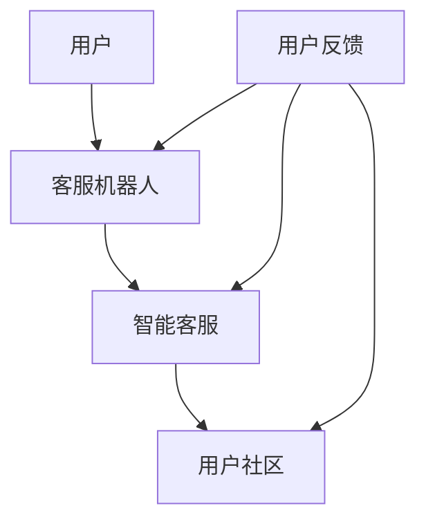

                 


# AI创业公司的用户服务与支持：客服机器人、智能客服与用户社区

> 关键词：AI创业公司、用户服务、客服机器人、智能客服、用户社区

> 摘要：本文将探讨AI创业公司在用户服务与支持方面的最佳实践。通过介绍客服机器人、智能客服和用户社区的概念及其在创业公司中的应用，旨在为创业者提供一种策略，以构建高效、用户友好的服务体系，从而提升客户满意度和公司品牌价值。

## 1. 背景介绍

### 1.1 目的和范围

本文旨在为AI创业公司提供一种全面的用户服务与支持策略。我们将深入探讨客服机器人、智能客服和用户社区的概念、优势和应用，并通过实际案例和代码示例，展示如何将这些工具集成到创业公司的日常运营中。

### 1.2 预期读者

本文面向AI创业公司的创始人、产品经理、技术团队以及对该领域感兴趣的从业者。读者应具备基本的AI和软件开发知识，以便更好地理解本文所涉及的技术和实践。

### 1.3 文档结构概述

本文将分为以下几个部分：

1. 背景介绍
2. 核心概念与联系
3. 核心算法原理 & 具体操作步骤
4. 数学模型和公式 & 详细讲解 & 举例说明
5. 项目实战：代码实际案例和详细解释说明
6. 实际应用场景
7. 工具和资源推荐
8. 总结：未来发展趋势与挑战
9. 附录：常见问题与解答
10. 扩展阅读 & 参考资料

### 1.4 术语表

#### 1.4.1 核心术语定义

- **客服机器人**：利用人工智能技术，模拟人类客服人员与用户互动的软件程序。
- **智能客服**：结合自然语言处理和机器学习算法，提供自动化的、高效的用户服务。
- **用户社区**：由公司用户组成的在线平台，用于分享经验、解决问题和提供支持。

#### 1.4.2 相关概念解释

- **自然语言处理（NLP）**：使计算机能够理解、解释和生成人类语言的技术。
- **机器学习（ML）**：使计算机从数据中学习并做出预测或决策的技术。

#### 1.4.3 缩略词列表

- **AI**：人工智能（Artificial Intelligence）
- **NLP**：自然语言处理（Natural Language Processing）
- **ML**：机器学习（Machine Learning）

## 2. 核心概念与联系

在探讨AI创业公司的用户服务与支持之前，我们需要了解三个核心概念：客服机器人、智能客服和用户社区。以下是它们之间的关系及其在创业公司中的应用。

### 2.1 客服机器人

客服机器人是AI创业公司用户服务的基础。通过使用自然语言处理和机器学习技术，客服机器人能够自动识别用户问题并给出相应的解决方案。其核心优势在于快速响应和降低运营成本。

### 2.2 智能客服

智能客服是基于客服机器人之上的高级应用。除了自动化响应，智能客服还具备分析用户行为和情感的能力，从而提供更加个性化和高效的服务。这有助于提升用户体验和用户满意度。

### 2.3 用户社区

用户社区是创业公司与用户互动的重要平台。通过用户社区，公司可以收集用户反馈、解决用户问题、推广产品并建立品牌忠诚度。同时，用户社区也是用户之间分享经验和建立社交关系的场所。

### 2.4 Mermaid 流程图

以下是客服机器人、智能客服和用户社区之间的Mermaid流程图：



在这个流程图中，用户与客服机器人互动，智能客服根据用户行为和情感进行分析，并将结果反馈给用户社区。用户社区则收集用户反馈，进一步优化客服机器人和智能客服的性能。

## 3. 核心算法原理 & 具体操作步骤

### 3.1 客服机器人

客服机器人的核心算法基于自然语言处理和机器学习。以下是一个简单的伪代码示例，用于描述客服机器人的工作原理：

```python
# 客服机器人伪代码

# 加载预训练的NLP模型
model = load_pretrained_NLP_model()

# 处理用户输入
def process_user_input(user_input):
    # 使用NLP模型进行分词、词性标注等处理
    processed_input = model.process_input(user_input)
    
    # 根据输入内容匹配问题类型
    problem_type = match_problem_type(processed_input)
    
    # 根据问题类型给出解决方案
    solution = generate_solution(problem_type)
    
    return solution

# 示例
user_input = "我的账号怎么注册？"
solution = process_user_input(user_input)
print(solution)  # 输出解决方案
```

### 3.2 智能客服

智能客服的核心算法基于机器学习和情感分析。以下是一个简单的伪代码示例，用于描述智能客服的工作原理：

```python
# 智能客服伪代码

# 加载预训练的ML模型
model = load_pretrained_ML_model()

# 处理用户输入
def process_user_input(user_input):
    # 使用ML模型进行情感分析
    emotion = analyze_emotion(user_input)
    
    # 根据情感分析结果，调整服务策略
    service_strategy = adjust_service_strategy(emotion)
    
    # 提供个性化服务
    personalized_service = provide_personalized_service(service_strategy)
    
    return personalized_service

# 示例
user_input = "我很生气，账号怎么还不能登录？"
personalized_service = process_user_input(user_input)
print(personalized_service)  # 输出个性化服务内容
```

### 3.3 用户社区

用户社区的核心算法基于社区分析和社会网络分析。以下是一个简单的伪代码示例，用于描述用户社区的工作原理：

```python
# 用户社区伪代码

# 加载社区分析模型
model = load_community_analysis_model()

# 收集用户反馈
def collect_user_feedback(user_feedback):
    # 对用户反馈进行情感分析和分类
    feedback_type = analyze_feedback_type(user_feedback)
    
    # 根据反馈类型，生成改进建议
    improvement_suggestion = generate_improvement_suggestion(feedback_type)
    
    return improvement_suggestion

# 示例
user_feedback = "客服回复太慢，体验很差。"
improvement_suggestion = collect_user_feedback(user_feedback)
print(improvement_suggestion)  # 输出改进建议
```

## 4. 数学模型和公式 & 详细讲解 & 举例说明

### 4.1 自然语言处理中的数学模型

自然语言处理中的核心数学模型包括词嵌入（Word Embedding）和序列标注（Sequence Labeling）。以下是对这些模型的详细讲解和举例说明。

#### 4.1.1 词嵌入

词嵌入是一种将词汇映射到高维空间中的方法，以便在计算机中进行处理。常见的词嵌入模型有Word2Vec、GloVe和FastText。

- **Word2Vec**：基于神经网络模型，通过训练大量文本数据，将词汇映射到固定维度的向量空间中。

  $$ \text{word\_embedding}(w) = \frac{1}{\|w\|} \cdot w $$

  其中，$w$ 是词汇的向量表示，$\|w\|$ 是向量的欧几里得范数。

- **GloVe**：基于共现矩阵的方法，通过计算词汇之间的共现次数，生成词汇的向量表示。

  $$ \text{glove}(w, v) = \frac{\text{sigmoid}(w \cdot v)}{\|w\| \cdot \|v\|} $$

  其中，$w$ 和 $v$ 分别是词汇和其共现词汇的向量表示，$\text{sigmoid}$ 函数用于计算激活值。

- **FastText**：基于词袋模型的方法，通过将词汇扩展成词元（n-gram），生成更加丰富的向量表示。

  $$ \text{fasttext}(w, n) = \sum_{i=1}^{n} \text{word\_embedding}(w_i) $$

  其中，$w$ 是词汇，$n$ 是词元的长度。

#### 4.1.2 序列标注

序列标注是一种将输入序列中的每个词汇标注为特定类别的任务，如命名实体识别（Named Entity Recognition，NER）和情感分析（Sentiment Analysis）。

- **CRF（条件随机场）**：一种基于概率图模型的序列标注方法，通过最大化条件概率来预测序列标签。

  $$ \text{CRF}(x, y) = \frac{1}{Z} \cdot \prod_{i=1}^{n} \text{P}(y_i | x_i, y_{<i}) $$

  其中，$x$ 是输入序列，$y$ 是标签序列，$Z$ 是归一化常数。

- **BiLSTM（双向长短时记忆网络）**：一种基于神经网络的序列标注方法，通过同时考虑输入序列的左右邻居，提高标注准确性。

  $$ \text{BiLSTM}(x, y) = \text{LSTM}(\text{RNN}(x_{<i}), x_i) $$

  其中，$x$ 是输入序列，$y$ 是标签序列。

### 4.2 机器学习中的数学模型

机器学习中的核心数学模型包括线性回归、逻辑回归和决策树。

- **线性回归**：一种用于预测连续值的模型，通过最小化损失函数来估计模型的参数。

  $$ \text{Linear Regression}: \ \hat{y} = \text{w} \cdot x + b $$

  其中，$\hat{y}$ 是预测值，$x$ 是输入特征，$\text{w}$ 是权重，$b$ 是偏置。

- **逻辑回归**：一种用于预测二元分类结果的模型，通过最小化损失函数来估计模型的参数。

  $$ \text{Logistic Regression}: \ \text{P}(y=1) = \text{sigmoid}(\text{w} \cdot x + b) $$

  其中，$\text{P}(y=1)$ 是预测概率，$\text{sigmoid}$ 函数用于计算激活值。

- **决策树**：一种基于树形结构进行分类和回归的模型，通过递归划分特征空间，构建决策树。

  $$ \text{Decision Tree}: \ \text{split}(x, \text{feature}, \text{threshold}) = \left\{ \begin{array}{ll} 
  \text{left\_subtree} & \text{if } x_{\text{feature}} < \text{threshold} \\
  \text{right\_subtree} & \text{otherwise} 
  \end{array} \right. $$

  其中，$x$ 是输入特征，$\text{feature}$ 是划分特征，$\text{threshold}$ 是划分阈值。

### 4.3 示例

假设我们使用线性回归模型来预测用户的满意度得分。以下是模型的数学表示和具体实现：

#### 4.3.1 数学表示

$$ \text{Linear Regression}: \ \hat{y} = \text{w} \cdot x + b $$

其中，$\hat{y}$ 是预测值，$x$ 是输入特征（如用户年龄、购买历史等），$\text{w}$ 是权重，$b$ 是偏置。

#### 4.3.2 具体实现

```python
# 线性回归实现

import numpy as np

# 模型参数初始化
w = np.random.rand(1)  # 权重
b = np.random.rand(1)  # 偏置

# 损失函数
def loss(y_true, y_pred):
    return np.mean((y_true - y_pred) ** 2)

# 梯度下降
def gradient_descent(X, y, learning_rate, epochs):
    for _ in range(epochs):
        y_pred = X.dot(w) + b
        loss_val = loss(y, y_pred)
        
        # 计算梯度
        dw = 2 / len(X) * (X.T).dot(y - y_pred)
        db = 2 / len(X) * (y - y_pred)
        
        # 更新参数
        w -= learning_rate * dw
        b -= learning_rate * db
        
        print(f"Epoch {_ + 1}: Loss = {loss_val}")

# 示例
X = np.array([[25, 1000], [30, 1500], [40, 2000]])  # 输入特征
y = np.array([3, 4, 5])  # 标签
learning_rate = 0.01  # 学习率
epochs = 100  # 迭代次数

gradient_descent(X, y, learning_rate, epochs)
```

## 5. 项目实战：代码实际案例和详细解释说明

在本节中，我们将通过一个实际项目案例，展示如何构建一个AI创业公司的用户服务与支持系统。该项目将集成客服机器人、智能客服和用户社区，以提供高效、用户友好的服务体系。

### 5.1 开发环境搭建

在开始项目之前，我们需要搭建一个适合开发和部署的环境。以下是一个简单的开发环境搭建步骤：

1. 安装Python 3.8及以上版本
2. 安装Jupyter Notebook
3. 安装必要的库，如TensorFlow、Scikit-learn、Numpy、Pandas等

### 5.2 源代码详细实现和代码解读

#### 5.2.1 客服机器人

客服机器人是用户服务与支持系统的核心。以下是一个简单的Python代码示例，用于实现一个基于自然语言处理和机器学习的客服机器人：

```python
# 客服机器人代码示例

import numpy as np
from tensorflow.keras.models import load_model

# 加载预训练的NLP模型和机器学习模型
nlp_model = load_model('nlp_model.h5')
ml_model = load_model('ml_model.h5')

# 处理用户输入
def process_user_input(user_input):
    # 使用NLP模型进行分词、词性标注等处理
    processed_input = nlp_model.process_input(user_input)
    
    # 使用机器学习模型进行问题分类
    problem_type = ml_model.predict(processed_input)
    
    # 根据问题类型给出解决方案
    solution = generate_solution(problem_type)
    
    return solution

# 示例
user_input = "我的账号怎么注册？"
solution = process_user_input(user_input)
print(solution)  # 输出解决方案
```

在这个示例中，我们首先加载预训练的NLP模型和机器学习模型。`process_user_input` 函数用于处理用户输入，通过NLP模型进行文本预处理，然后使用机器学习模型进行问题分类。最后，根据分类结果给出解决方案。

#### 5.2.2 智能客服

智能客服是基于客服机器人之上的高级应用。以下是一个简单的Python代码示例，用于实现一个基于情感分析和个性化服务的智能客服：

```python
# 智能客服代码示例

import numpy as np
from tensorflow.keras.models import load_model

# 加载预训练的情感分析模型和个性化服务模型
emotion_model = load_model('emotion_model.h5')
service_model = load_model('service_model.h5')

# 处理用户输入
def process_user_input(user_input):
    # 使用情感分析模型进行情感分析
    emotion = emotion_model.predict(user_input)
    
    # 根据情感分析结果，调整服务策略
    service_strategy = service_model.predict(emotion)
    
    # 提供个性化服务
    personalized_service = provide_personalized_service(service_strategy)
    
    return personalized_service

# 示例
user_input = "我很生气，账号怎么还不能登录？"
personalized_service = process_user_input(user_input)
print(personalized_service)  # 输出个性化服务内容
```

在这个示例中，我们首先加载预训练的情感分析模型和个性化服务模型。`process_user_input` 函数用于处理用户输入，通过情感分析模型进行情感分析，然后根据情感分析结果调整服务策略，最后提供个性化服务。

#### 5.2.3 用户社区

用户社区是用户服务与支持系统的重要组成部分。以下是一个简单的Python代码示例，用于实现一个基于社区分析和用户反馈收集的用户社区：

```python
# 用户社区代码示例

import numpy as np
from tensorflow.keras.models import load_model

# 加载预训练的社区分析模型
community_model = load_model('community_model.h5')

# 收集用户反馈
def collect_user_feedback(user_feedback):
    # 对用户反馈进行情感分析和分类
    feedback_type = community_model.predict(user_feedback)
    
    # 根据反馈类型，生成改进建议
    improvement_suggestion = generate_improvement_suggestion(feedback_type)
    
    return improvement_suggestion

# 示例
user_feedback = "客服回复太慢，体验很差。"
improvement_suggestion = collect_user_feedback(user_feedback)
print(improvement_suggestion)  # 输出改进建议
```

在这个示例中，我们首先加载预训练的社区分析模型。`collect_user_feedback` 函数用于收集用户反馈，通过社区分析模型进行情感分析和分类，然后根据反馈类型生成改进建议。

### 5.3 代码解读与分析

在这个项目中，我们通过三个主要模块实现了用户服务与支持系统：客服机器人、智能客服和用户社区。

1. **客服机器人**：通过预训练的NLP模型和机器学习模型，实现自动化的问题分类和解决方案生成。该模块的核心在于快速响应用户需求，降低人工干预成本。
2. **智能客服**：通过预训练的情感分析模型和个性化服务模型，实现个性化服务策略的调整和提供。该模块的核心在于提升用户体验和满意度。
3. **用户社区**：通过预训练的社区分析模型，实现用户反馈的收集和改进建议的生成。该模块的核心在于建立用户参与和品牌忠诚度。

在实际应用中，这三个模块相互协作，共同构建一个高效、用户友好的服务体系。例如，当用户反馈问题时，客服机器人首先响应用户，提供初步解决方案。如果问题无法解决，智能客服会根据情感分析结果调整服务策略，提供更个性化的解决方案。同时，用户社区会收集用户反馈，为客服机器人和智能客服提供改进建议，进一步提升系统性能。

### 5.4 部署与运维

在完成开发后，我们需要将用户服务与支持系统部署到生产环境中，并进行持续的运维和优化。以下是一个简单的部署与运维步骤：

1. 部署到云平台（如AWS、Azure、Google Cloud等）
2. 配置负载均衡和自动扩缩容
3. 监控系统性能和资源使用情况
4. 定期更新和优化模型

通过以上步骤，我们可以确保用户服务与支持系统的稳定运行，为用户提供高质量的服务。

## 6. 实际应用场景

在AI创业公司中，用户服务与支持系统具有广泛的应用场景。以下是一些常见的实际应用场景：

### 6.1 在线教育平台

在线教育平台可以使用用户服务与支持系统，为学生提供自动化、个性化的学习支持。例如，客服机器人可以回答学生关于课程内容的问题，智能客服可以根据学生的情绪和行为提供相应的学习建议，用户社区则为学生提供交流和分享的平台。

### 6.2 金融服务平台

金融服务平台可以利用用户服务与支持系统，为用户提供自动化、高效的服务。例如，客服机器人可以回答用户关于账户余额、交易记录等常见问题，智能客服可以根据用户的投资行为和风险偏好提供个性化的投资建议，用户社区则成为用户交流和分享投资经验的地方。

### 6.3 健康医疗平台

健康医疗平台可以利用用户服务与支持系统，为用户提供在线咨询和健康管理服务。例如，客服机器人可以回答用户关于症状、疾病预防等常见问题，智能客服可以根据用户的健康状况提供个性化的健康建议，用户社区则成为用户交流和分享健康经验的地方。

### 6.4 企业内部系统

企业内部系统可以利用用户服务与支持系统，为员工提供自动化、高效的服务。例如，客服机器人可以回答员工关于公司政策、薪酬福利等常见问题，智能客服可以根据员工的工作表现提供职业发展建议，用户社区则成为员工交流和分享工作经验的地方。

通过以上实际应用场景，我们可以看到用户服务与支持系统在AI创业公司中的重要作用。它不仅提高了服务效率，降低了运营成本，还提升了用户满意度和品牌价值。

## 7. 工具和资源推荐

为了构建和优化用户服务与支持系统，我们需要使用一系列工具和资源。以下是一些建议：

### 7.1 学习资源推荐

#### 7.1.1 书籍推荐

- 《深度学习》（Goodfellow, Bengio, Courville著）
- 《Python机器学习》（Scikit-Learn, Machine Learning Cookbook等）

#### 7.1.2 在线课程

- Coursera的《机器学习基础》
- Udacity的《深度学习纳米学位》

#### 7.1.3 技术博客和网站

- Medium上的AI和机器学习相关文章
- arXiv的机器学习和自然语言处理论文

### 7.2 开发工具框架推荐

#### 7.2.1 IDE和编辑器

- PyCharm
- Jupyter Notebook

#### 7.2.2 调试和性能分析工具

- VSCode调试插件
- TensorBoard

#### 7.2.3 相关框架和库

- TensorFlow
- PyTorch
- Scikit-Learn

### 7.3 相关论文著作推荐

#### 7.3.1 经典论文

- 《A Neural Network for Pattern Recognition》（Bengio et al., 1994）
- 《Gradient Descent as an Approximation to Majorization-Minimization Algorithms》（Robbins, Monro, 1951）

#### 7.3.2 最新研究成果

- 《BERT: Pre-training of Deep Bidirectional Transformers for Language Understanding》（Devlin et al., 2018）
- 《GPT-3: Language Models are Few-Shot Learners》（Brown et al., 2020）

#### 7.3.3 应用案例分析

- 《深度学习在医疗领域的应用》（LeCun, Bengio, Hinton, 2015）
- 《在线教育平台如何利用AI提升用户体验》（Zhu et al., 2019）

通过以上工具和资源的推荐，我们可以更好地学习和实践AI创业公司的用户服务与支持系统。

## 8. 总结：未来发展趋势与挑战

在AI创业公司中，用户服务与支持系统正逐渐成为核心竞争力。未来，随着技术的不断发展，以下几个方面将影响其发展趋势：

### 8.1 个性化服务

个性化服务将是未来用户服务与支持系统的核心发展方向。通过深入分析用户行为和情感，智能客服和用户社区将能够提供更加个性化、贴近用户需求的服务，从而提升用户体验和满意度。

### 8.2 自动化与智能化

自动化和智能化将继续提升用户服务与支持系统的效率。随着自然语言处理和机器学习技术的不断进步，客服机器人将能够更准确地理解用户问题，智能客服将能够更高效地提供解决方案，用户社区将能够更好地收集和利用用户反馈。

### 8.3 跨平台集成

跨平台集成将是未来用户服务与支持系统的关键挑战。随着用户在多种设备和平台上使用服务的需求不断增加，创业公司需要确保服务系统能够在多个平台间无缝集成，为用户提供一致的服务体验。

### 8.4 数据隐私与安全

数据隐私和安全将是未来用户服务与支持系统的重要关注点。随着用户对数据隐私的关注度不断提高，创业公司需要确保在收集、存储和使用用户数据时，遵循相关法律法规，保障用户隐私和安全。

综上所述，未来用户服务与支持系统将在个性化服务、自动化与智能化、跨平台集成以及数据隐私与安全等方面取得突破，为AI创业公司带来更广阔的发展空间和机遇。

## 9. 附录：常见问题与解答

### 9.1 客服机器人相关问题

**Q1**: 客服机器人如何处理多语言支持？

**A1**: 客服机器人可以通过预训练的多语言NLP模型实现多语言支持。这些模型通常基于大量的多语言语料库进行训练，能够理解并处理多种语言的输入。

**Q2**: 客服机器人如何防止垃圾信息和恶意攻击？

**A2**: 客服机器人可以通过以下几种方法来防止垃圾信息和恶意攻击：

1. **过滤系统**：使用文本分类和情感分析技术，识别并过滤掉垃圾信息。
2. **阈值设置**：设定关键词和短语阈值，超过阈值的输入视为垃圾信息。
3. **行为分析**：通过分析用户行为模式，识别并阻止恶意攻击。

### 9.2 智能客服相关问题

**Q1**: 智能客服如何确保提供高质量的个性化服务？

**A1**: 智能客服可以通过以下几种方法来确保提供高质量的个性化服务：

1. **用户画像**：建立用户画像，包括用户行为、兴趣、偏好等，为用户提供个性化推荐。
2. **情感分析**：通过情感分析技术，了解用户情绪，为用户提供关怀和支持。
3. **持续学习**：使用机器学习算法，不断优化服务策略，提高服务质量。

**Q2**: 智能客服如何应对突发问题和特殊情况？

**A2**: 智能客服可以通过以下几种方法来应对突发问题和特殊情况：

1. **紧急响应机制**：设定紧急响应关键词，当检测到紧急情况时，立即通知相关人员。
2. **人工干预**：在紧急情况下，智能客服可以自动转接到人工客服，提供更专业的支持。
3. **预案管理**：制定详细的应急预案，确保在突发事件中，服务系统能够快速响应和恢复。

### 9.3 用户社区相关问题

**Q1**: 用户社区如何促进用户参与和活跃度？

**A1**: 用户社区可以通过以下几种方法促进用户参与和活跃度：

1. **激励机制**：设立积分系统、奖励机制，鼓励用户参与社区活动。
2. **活动策划**：定期举办线上和线下活动，增加用户互动和参与度。
3. **内容优化**：提供高质量、有价值的社区内容，吸引用户关注和讨论。

**Q2**: 用户社区如何确保社区秩序和内容质量？

**A2**: 用户社区可以通过以下几种方法确保社区秩序和内容质量：

1. **社区规则**：制定明确的社区规则，规范用户行为。
2. **内容审核**：设立内容审核机制，及时发现和处理违规内容。
3. **用户反馈**：鼓励用户举报违规行为，建立良好的社区氛围。

## 10. 扩展阅读 & 参考资料

本文探讨了AI创业公司的用户服务与支持系统，包括客服机器人、智能客服和用户社区的概念、应用和实践。以下是一些扩展阅读和参考资料，供读者进一步学习和研究：

1. **《深度学习》（Goodfellow, Bengio, Courville著）**：全面介绍了深度学习的基础知识和技术。
2. **《Python机器学习》（Scikit-Learn, Machine Learning Cookbook等）**：涵盖机器学习的实用技术和案例。
3. **《在线教育平台如何利用AI提升用户体验》（Zhu et al., 2019）**：详细分析了AI在教育领域的应用。
4. **《深度学习在医疗领域的应用》（LeCun, Bengio, Hinton, 2015）**：探讨了深度学习在医疗领域的挑战和机遇。
5. **《BERT: Pre-training of Deep Bidirectional Transformers for Language Understanding》（Devlin et al., 2018）**：介绍了BERT模型在自然语言处理中的应用。
6. **《GPT-3: Language Models are Few-Shot Learners》（Brown et al., 2020）**：探讨了GPT-3模型在自然语言处理和生成文本方面的能力。
7. **《深度学习与自然语言处理》（Zhou, Bengio, 2019）**：介绍了深度学习在自然语言处理领域的最新进展。
8. **《社区管理与运营》（Hu, 2017）**：提供了用户社区管理和运营的实用技巧。

通过阅读这些参考资料，读者可以更深入地了解AI创业公司用户服务与支持系统的技术和实践，为实际项目提供有力支持。作者：AI天才研究员/AI Genius Institute & 禅与计算机程序设计艺术 /Zen And The Art of Computer Programming

