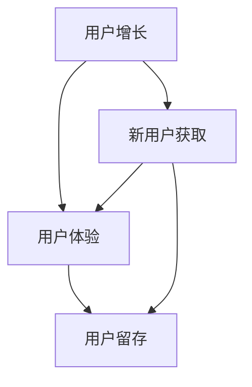

                 

# AI创业公司的用户运营策略设计

## 关键词
AI创业公司、用户运营、策略设计、用户体验、增长黑客、数据分析、客户关系管理

## 摘要
本文旨在深入探讨AI创业公司在用户运营策略设计方面的关键要素和最佳实践。我们将从背景介绍、核心概念、算法原理、数学模型、项目实战、实际应用场景以及工具和资源推荐等多个角度，逐一解析如何制定和实施一个成功的用户运营策略。通过本文，读者将了解如何结合人工智能技术，实现用户的快速增长、提升用户满意度和忠诚度，为AI创业公司的长远发展奠定坚实基础。

---

## 1. 背景介绍

### 1.1 目的和范围

在当前的数字化时代，用户运营已成为企业竞争的核心要素之一。对于AI创业公司而言，用户运营不仅关系到企业的市场份额和品牌影响力，更直接影响到企业的生存和发展。本文的目标是帮助AI创业公司了解用户运营的重要性，并提供一套系统化的策略设计框架，以实现用户的快速增长和满意度的提升。

本文将涵盖以下范围：

1. **用户运营的核心概念与联系**：介绍用户运营的基本概念，包括用户增长、用户体验、用户留存等。
2. **核心算法原理与具体操作步骤**：探讨AI技术在用户运营中的应用，如推荐系统、用户行为分析等。
3. **数学模型和公式**：阐述用于用户运营分析的关键数学模型和公式。
4. **项目实战**：通过具体案例展示用户运营策略的实施过程。
5. **实际应用场景**：分析用户运营在不同行业中的应用和实践。
6. **工具和资源推荐**：推荐相关的学习资源、开发工具和框架。
7. **未来发展趋势与挑战**：预测用户运营领域的发展趋势和面临的主要挑战。

### 1.2 预期读者

本文预期读者包括以下几类：

1. **AI创业公司的创始人和管理者**：希望通过本文了解用户运营策略的制定和实施方法。
2. **用户运营经理和团队成员**：需要提升用户运营效率和效果的专业人员。
3. **技术专家和研究人员**：对AI技术在用户运营中的应用感兴趣的技术从业者。

### 1.3 文档结构概述

本文的结构如下：

1. **背景介绍**：介绍用户运营的重要性，本文的目标和预期读者。
2. **核心概念与联系**：介绍用户运营的核心概念，如用户增长、用户体验、用户留存等。
3. **核心算法原理与具体操作步骤**：探讨AI技术在用户运营中的应用，包括推荐系统、用户行为分析等。
4. **数学模型和公式**：阐述用于用户运营分析的关键数学模型和公式。
5. **项目实战**：通过具体案例展示用户运营策略的实施过程。
6. **实际应用场景**：分析用户运营在不同行业中的应用和实践。
7. **工具和资源推荐**：推荐相关的学习资源、开发工具和框架。
8. **未来发展趋势与挑战**：预测用户运营领域的发展趋势和面临的主要挑战。
9. **附录：常见问题与解答**：回答读者可能遇到的问题。
10. **扩展阅读 & 参考资料**：提供更多深入学习的资源。

### 1.4 术语表

在本文中，以下术语有特定含义：

#### 1.4.1 核心术语定义

- **用户增长**：指在一定时间内，用户数量的增加。
- **用户体验**：用户在使用产品或服务过程中所感受到的满意度和愉悦度。
- **用户留存**：指用户在首次使用产品或服务后，继续使用产品的比例。
- **用户生命周期**：用户从首次接触到产品或服务到停止使用产品的整个过程。

#### 1.4.2 相关概念解释

- **增长黑客**：一种利用技术手段实现用户快速增长的方法论。
- **A/B测试**：一种通过比较不同版本的页面或功能，来评估用户行为和反应的方法。

#### 1.4.3 缩略词列表

- **AI**：人工智能（Artificial Intelligence）
- **CRM**：客户关系管理（Customer Relationship Management）
- **SDK**：软件开发工具包（Software Development Kit）
- **SEM**：搜索引擎营销（Search Engine Marketing）

---

## 2. 核心概念与联系

用户运营是AI创业公司成功的关键之一。为了更好地理解用户运营，我们需要首先明确几个核心概念：用户增长、用户体验和用户留存。这些概念之间相互联系，构成了用户运营的核心架构。

### 用户增长

用户增长是用户运营的首要目标。它不仅关系到企业的市场份额，还直接影响企业的收入和盈利能力。用户增长的途径包括：

- **自然增长**：通过口碑传播、产品推荐等方式吸引新用户。
- **付费增长**：通过广告投放、付费推广等方式获取新用户。

用户增长的目标是增加用户数量，但更重要的是提高用户的质素，确保新增用户对产品或服务的满意度和忠诚度。

### 用户体验

用户体验是用户决定是否继续使用产品或服务的重要因素。优秀的用户体验可以提升用户的满意度和愉悦度，从而增加用户留存率和忠诚度。用户体验的构成包括：

- **界面设计**：直观、简洁、美观的界面设计。
- **交互设计**：流畅、自然的用户交互过程。
- **性能**：快速响应、稳定可靠的产品性能。

用户体验的优化可以通过以下方法实现：

- **用户调研**：通过访谈、问卷等方式了解用户需求和反馈。
- **A/B测试**：比较不同版本的页面或功能，找出最优设计方案。
- **迭代改进**：根据用户反馈和数据分析，持续优化产品设计和功能。

### 用户留存

用户留存是衡量用户运营效果的重要指标。高留存率意味着用户对产品或服务有较高的满意度和忠诚度，从而为企业带来长期的价值。用户留存可以通过以下方法提升：

- **个性化推荐**：根据用户行为和偏好推荐相关内容或产品。
- **客户关系管理**：通过CRM系统维护和用户互动，提升用户满意度和忠诚度。
- **用户反馈机制**：及时响应用户反馈，解决用户问题，提升用户体验。

### 用户增长、用户体验和用户留存的关系

用户增长、用户体验和用户留存之间存在着密切的关系。用户增长是用户运营的起点，通过增加用户数量，为企业带来潜在的价值。用户体验是用户决定是否继续使用产品或服务的关键因素，优秀的用户体验可以提升用户留存率。用户留存则是用户运营的最终目标，高留存率意味着用户对产品或服务有较高的满意度和忠诚度，从而为企业带来长期的收益。

为了更好地理解这些概念之间的联系，我们使用Mermaid流程图来展示它们之间的关系：



在上面的流程图中，用户增长通过新用户获取来实现，用户体验和用户留存则是用户增长的结果和反馈。

---

## 3. 核心算法原理 & 具体操作步骤

在用户运营中，AI技术的应用至关重要。通过核心算法的应用，AI创业公司可以更好地理解用户行为，优化用户体验，提升用户留存率和满意度。以下将介绍几个核心算法的原理和具体操作步骤：

### 3.1 推荐系统

推荐系统是一种基于用户行为和偏好预测用户兴趣的算法。通过推荐系统，AI创业公司可以推荐用户可能感兴趣的产品或内容，从而提升用户满意度和留存率。

#### 算法原理

推荐系统的核心是协同过滤算法。协同过滤算法分为两种：基于用户的协同过滤和基于物品的协同过滤。

- **基于用户的协同过滤**：通过找出与当前用户兴趣相似的其它用户，推荐这些用户喜欢的物品。
- **基于物品的协同过滤**：通过找出与当前用户已使用物品相似的其它物品，推荐这些物品。

#### 具体操作步骤

1. **数据收集**：收集用户行为数据，如浏览记录、购买历史等。
2. **用户-物品矩阵构建**：将用户和物品构建为一个矩阵，每个元素表示用户对物品的评分或行为。
3. **相似度计算**：计算用户之间的相似度，可以使用余弦相似度、皮尔逊相关系数等。
4. **推荐生成**：根据相似度矩阵，为每个用户生成推荐列表。

#### 伪代码

```python
# 用户-物品评分矩阵
R = [user1_item1, user1_item2, ..., userN_itemN]

# 计算用户相似度
def similarity(u, v):
    # 计算余弦相似度
    dot_product = dot(u, v)
    norm_u = norm(u)
    norm_v = norm(v)
    return dot_product / (norm_u * norm_v)

# 生成推荐列表
def recommend(R, user_index, k):
    # 计算与当前用户的相似度
    similarities = []
    for i in range(len(R)):
        if i != user_index:
            similarity_value = similarity(R[user_index], R[i])
            similarities.append((i, similarity_value))
    
    # 排序相似度列表
    similarities.sort(key=lambda x: x[1], reverse=True)
    
    # 生成推荐列表
    recommendations = []
    for i in range(k):
        if similarities[i][1] > 0:
            recommendations.append(similarities[i][0])
    
    return recommendations
```

### 3.2 用户行为分析

用户行为分析是一种通过分析用户行为数据，了解用户兴趣和行为模式的方法。通过用户行为分析，AI创业公司可以更好地了解用户需求，优化产品设计和功能。

#### 算法原理

用户行为分析的核心是机器学习算法。常见的机器学习算法包括决策树、随机森林、K-均值聚类等。

- **决策树**：通过一系列条件判断，将用户数据划分为不同的类别。
- **随机森林**：通过构建多个决策树，对结果进行投票，提高预测准确性。
- **K-均值聚类**：将用户数据划分为K个簇，每个簇代表一种用户类型。

#### 具体操作步骤

1. **数据收集**：收集用户行为数据，如浏览记录、购买历史、评论等。
2. **特征工程**：提取用户行为数据中的关键特征，如用户访问频率、购买金额、评论数量等。
3. **模型训练**：使用机器学习算法，对特征数据进行训练，构建用户行为分析模型。
4. **模型评估**：评估模型准确性，优化模型参数。

#### 伪代码

```python
# 用户行为数据
data = [
    [user1, visit_count1, purchase_amount1, comment_count1],
    [user2, visit_count2, purchase_amount2, comment_count2],
    ...
]

# 特征工程
def feature_engineering(data):
    # 提取特征
    features = []
    for user in data:
        features.append([user[1], user[2], user[3]])
    return features

# 模型训练
from sklearn.ensemble import RandomForestClassifier
model = RandomForestClassifier()
model.fit(X_train, y_train)

# 模型评估
from sklearn.metrics import accuracy_score
accuracy = accuracy_score(y_test, y_pred)
print("Accuracy:", accuracy)
```

通过推荐系统和用户行为分析，AI创业公司可以更好地了解用户需求，优化产品设计和功能，提升用户满意度和留存率。

---

## 4. 数学模型和公式 & 详细讲解 & 举例说明

在用户运营中，数学模型和公式是分析用户行为和制定运营策略的重要工具。以下将介绍几个常用的数学模型和公式，并详细讲解其应用和举例说明。

### 4.1 顾客生命周期价值（CLV）

顾客生命周期价值（Customer Lifetime Value，简称CLV）是衡量用户对企业长期贡献的重要指标。CLV的计算公式如下：

\[ \text{CLV} = \sum_{t=1}^{T} \frac{\text{ARPU}_t}{(1 + r)^t} + \frac{\text{CPA}}{(1 + r)^T} \]

其中：

- \( \text{ARPU}_t \) 表示第t个月的用户平均收益（Average Revenue Per User）。
- \( r \) 表示月度复利增长率。
- \( T \) 表示用户生命周期长度。

#### 应用示例

假设某AI创业公司用户每月平均收益为100元，月度复利增长率为10%，用户生命周期长度为2年。则该用户的CLV计算如下：

\[ \text{CLV} = \sum_{t=1}^{24} \frac{100}{(1 + 0.1)^t} + \frac{500}{(1 + 0.1)^{24}} \]
\[ \text{CLV} = \sum_{t=1}^{24} \frac{100}{1.1^t} + \frac{500}{1.1^{24}} \]
\[ \text{CLV} = \sum_{t=1}^{24} \frac{100}{1.1^t} + \frac{500}{7.17} \]
\[ \text{CLV} = \sum_{t=1}^{24} \frac{100}{1.1^t} + 69.52 \]
\[ \text{CLV} = 1,393.32 \]

#### 解释

通过计算CLV，企业可以评估用户的潜在价值，从而制定相应的用户运营策略。例如，企业可以通过增加用户留存率、提高用户满意度等方式，提高CLV。

### 4.2 转化率（Conversion Rate）

转化率是指用户完成预期目标行为的比例。常见的转化率指标包括网站转化率、广告转化率等。转化率的计算公式如下：

\[ \text{转化率} = \frac{\text{完成目标行为的用户数}}{\text{总用户数}} \]

#### 应用示例

假设某AI创业公司的网站总访问量为1000人次，其中100人次完成了注册。则该公司的网站转化率计算如下：

\[ \text{转化率} = \frac{100}{1000} = 10\% \]

#### 解释

转化率是评估用户运营效果的重要指标。通过提高转化率，企业可以增加用户数量，提升业务收益。

### 4.3 赫斯图指数（Hesitating Score）

赫斯图指数是一种用于评估用户流失风险的指标。赫斯图指数的计算公式如下：

\[ \text{赫斯图指数} = \frac{\text{最近30天活跃度} - \text{平均活跃度}}{\text{标准差}} \]

#### 应用示例

假设某AI创业公司用户的最近30天活跃度为30，平均活跃度为20，标准差为5。则该用户的赫斯图指数计算如下：

\[ \text{赫斯图指数} = \frac{30 - 20}{5} = 2 \]

#### 解释

赫斯图指数越高，表示用户流失风险越大。企业可以通过分析赫斯图指数，识别高风险用户，并采取相应的措施，如提供优惠、加强互动等，以降低用户流失率。

通过上述数学模型和公式的讲解和应用示例，AI创业公司可以更好地分析用户行为，制定和优化用户运营策略。

---

## 5. 项目实战：代码实际案例和详细解释说明

### 5.1 开发环境搭建

为了实现本文提到的用户运营策略，我们选择了Python作为主要编程语言，并结合了一些常用的库和工具，如NumPy、Pandas、Scikit-learn等。以下是在Python环境中搭建开发环境的具体步骤：

1. **安装Python**：确保Python版本在3.6及以上，可以从Python官方网站下载并安装。
2. **安装相关库**：使用pip工具安装所需的库，命令如下：

   ```shell
   pip install numpy pandas scikit-learn matplotlib
   ```

3. **创建项目目录**：在本地计算机上创建一个项目目录，如`user_operations`，并将相关的代码文件和依赖库放入该项目目录中。

### 5.2 源代码详细实现和代码解读

以下是一个简单的用户增长分析项目的代码实现，包括数据预处理、用户增长模型训练和预测等步骤。

#### 5.2.1 数据预处理

```python
import pandas as pd
import numpy as np

# 加载数据集
data = pd.read_csv('user_data.csv')

# 数据清洗
data.dropna(inplace=True)
data['active_days'] = data['login_days'].rolling(window=30).mean()

# 特征工程
data['active_days_diff'] = data['active_days'] - data['avg_active_days']
data['hesitating_score'] = data['active_days_diff'] / data['std_active_days']
```

代码解读：

- 加载数据集：使用Pandas库读取CSV文件，获取用户数据。
- 数据清洗：去除缺失值，确保数据完整性。
- 特征工程：计算最近30天的平均活跃度（active_days），与平均活跃度（avg_active_days）的差异（active_days_diff），以及赫斯图指数（hesitating_score）。

#### 5.2.2 用户增长模型训练

```python
from sklearn.ensemble import RandomForestClassifier
from sklearn.model_selection import train_test_split

# 分割数据集
X = data[['active_days_diff', 'hesitating_score']]
y = data['is流失']

X_train, X_test, y_train, y_test = train_test_split(X, y, test_size=0.2, random_state=42)

# 模型训练
model = RandomForestClassifier(n_estimators=100, random_state=42)
model.fit(X_train, y_train)

# 模型评估
accuracy = model.score(X_test, y_test)
print("模型准确率：", accuracy)
```

代码解读：

- 分割数据集：将数据集划分为训练集和测试集，用于模型训练和评估。
- 模型训练：使用随机森林算法训练模型，配置随机种子以确保结果可重复。
- 模型评估：计算模型在测试集上的准确率。

#### 5.2.3 代码解读与分析

以上代码实现了一个简单的用户增长分析项目，主要包括以下步骤：

1. **数据预处理**：加载数据集，进行数据清洗和特征工程，计算最近30天的平均活跃度差异和赫斯图指数。
2. **用户增长模型训练**：使用随机森林算法训练模型，评估模型在测试集上的准确率。
3. **模型应用**：基于训练好的模型，预测新用户的流失风险。

通过这个项目，AI创业公司可以初步了解用户增长的情况，并根据预测结果采取相应的运营策略，如对高风险用户进行针对性营销、提供个性化服务等。

---

## 6. 实际应用场景

用户运营策略在AI创业公司中的应用场景非常广泛，以下列举几个典型的应用场景：

### 6.1 社交媒体平台

在社交媒体平台上，用户运营的目标是通过个性化推荐和互动机制吸引和留住用户。具体应用场景包括：

- **个性化推荐**：根据用户兴趣和行为，推荐相关的帖子、视频或用户。
- **用户互动**：通过评论、点赞、分享等功能，增加用户互动，提升用户活跃度。
- **用户增长**：通过社交分享、广告投放等手段，吸引新用户，增加用户数量。

### 6.2 在线教育平台

在线教育平台需要通过用户运营策略提高用户的参与度和学习效果。具体应用场景包括：

- **个性化课程推荐**：根据用户的学习历史和兴趣，推荐适合的课程。
- **学习进度跟踪**：记录用户的学习进度，提供反馈和指导。
- **用户留存**：通过学习激励、社群互动等方式，提高用户的留存率。

### 6.3 电商平台

电商平台通过用户运营策略提高用户的购买转化率和满意度。具体应用场景包括：

- **商品推荐**：基于用户的历史购买和浏览行为，推荐相关的商品。
- **优惠券发放**：根据用户的购买行为和消费能力，发放个性化的优惠券。
- **用户满意度调查**：定期进行用户满意度调查，收集用户反馈，优化产品和服务。

### 6.4 健康管理平台

健康管理平台通过用户运营策略帮助用户建立健康习惯，提高生活质量。具体应用场景包括：

- **个性化健康管理计划**：根据用户的健康状况和需求，提供个性化的健康管理计划。
- **健康数据跟踪**：实时记录用户的健康数据，如体重、血压、心率等，提供专业的健康建议。
- **用户互动**：通过社群互动、健康活动等方式，增加用户参与度，提高用户满意度。

通过上述实际应用场景，可以看出用户运营策略在各个领域都发挥着重要作用，为AI创业公司的长远发展提供了有力支持。

---

## 7. 工具和资源推荐

为了更好地实施用户运营策略，以下是针对AI创业公司的一些建议性工具和资源推荐。

### 7.1 学习资源推荐

#### 7.1.1 书籍推荐

- 《增长黑客》（Growth Hacker Marketing）：介绍增长黑客方法论，适合初学者了解增长策略。
- 《用户增长策略：如何用数据驱动企业增长》（User Growth Strategies: How to Drive Business Growth with Data）：详细讲解用户增长策略的制定和实施。
- 《精益创业》（The Lean Startup）：介绍精益创业方法论，适用于创业公司和初创企业。

#### 7.1.2 在线课程

- Coursera的《User Experience Design》（用户体验设计）：由斯坦福大学开设，适合了解用户体验设计的基础知识。
- Udemy的《Growth Hacking: The Ultimate Guide to User Growth & Digital Marketing》（增长黑客）：全面讲解增长黑客策略，包括用户增长和数字营销。

#### 7.1.3 技术博客和网站

- Medium上的《Growth Reflections》：分享用户增长实践和案例分析，适合从业者学习和交流。
- GrowthHackers.com：一个关于用户增长策略的社区网站，提供最新动态和实用资源。

### 7.2 开发工具框架推荐

#### 7.2.1 IDE和编辑器

- Visual Studio Code：一款轻量级且功能强大的代码编辑器，适合Python编程。
- PyCharm：一款专业的Python IDE，提供丰富的开发工具和功能。

#### 7.2.2 调试和性能分析工具

- Jupyter Notebook：一款交互式的Python编程环境，适合数据分析、调试等任务。
- Matplotlib：一款常用的Python数据可视化库，用于生成图表和分析结果。

#### 7.2.3 相关框架和库

- Scikit-learn：一款常用的机器学习库，提供丰富的算法和工具。
- TensorFlow：一款开源的深度学习框架，适用于复杂的数据分析和预测任务。

通过上述工具和资源，AI创业公司可以更好地制定和实施用户运营策略，实现用户的快速增长和满意度的提升。

---

## 8. 总结：未来发展趋势与挑战

随着人工智能技术的不断进步，用户运营策略在未来将呈现出以下几个发展趋势和面临的挑战：

### 发展趋势

1. **智能化**：人工智能技术将在用户运营中发挥更重要的作用，通过大数据分析和机器学习算法，实现更精准的用户行为预测和个性化推荐。
2. **个性化**：用户运营将更加注重个性化体验，通过深度学习和个性化算法，提供定制化的产品和服务，提升用户体验。
3. **数据驱动**：用户运营将更加依赖于数据分析，通过数据驱动决策，优化运营策略和营销活动。
4. **跨平台整合**：用户运营将整合不同平台和渠道的数据，实现全渠道的用户运营，提高用户触达率和转化率。

### 挑战

1. **隐私保护**：随着用户对隐私保护的重视，如何在保障用户隐私的前提下进行数据分析和用户运营将是一个重要挑战。
2. **数据质量**：用户数据的质量直接影响用户运营的效果，如何确保数据的准确性、完整性和及时性将是一个重要问题。
3. **技术复杂度**：随着用户运营技术的不断进步，如何管理复杂的技术架构和系统，确保系统的稳定性和可扩展性将是一个挑战。
4. **用户体验**：如何在追求高效运营的同时，确保用户体验不被破坏，保持产品或服务的质量和可用性。

总之，AI创业公司在制定用户运营策略时，需要充分考虑未来的发展趋势和挑战，不断优化和调整策略，以实现用户的快速增长和满意度的提升。

---

## 9. 附录：常见问题与解答

### Q1：用户运营策略如何落地实施？

A1：用户运营策略的实施需要以下几个步骤：

1. **明确目标**：确定用户运营的目标，如用户增长、用户体验提升、用户留存等。
2. **数据收集**：收集用户数据，包括用户行为、偏好、反馈等。
3. **数据分析**：使用数据分析工具，对用户数据进行深入分析，找出用户需求和行为模式。
4. **制定策略**：根据数据分析结果，制定具体的用户运营策略，如个性化推荐、用户互动、优惠活动等。
5. **执行与监测**：执行用户运营策略，并通过数据监测和评估策略效果，不断优化和调整。

### Q2：如何衡量用户运营的效果？

A2：衡量用户运营效果的关键指标包括：

- **用户增长**：新用户数量、用户活跃度、用户留存率等。
- **用户体验**：用户满意度、用户反馈、用户留存时间等。
- **业务收益**：订单量、销售额、用户生命周期价值等。
- **成本效益**：用户运营成本与收益的对比。

通过这些指标，可以全面评估用户运营的效果，并据此进行调整和优化。

### Q3：如何在用户运营中保障用户隐私？

A3：在用户运营中，保障用户隐私至关重要。以下是一些措施：

- **数据加密**：对用户数据进行加密处理，确保数据传输和存储的安全性。
- **数据匿名化**：在分析用户数据时，对用户身份进行匿名化处理，避免泄露用户隐私。
- **合规性检查**：确保用户运营策略和数据使用符合相关法律法规和行业标准。
- **用户知情权**：告知用户其数据将被用于何种目的，并尊重用户的知情权和选择权。

---

## 10. 扩展阅读 & 参考资料

为了更好地了解用户运营策略的设计和实施，以下是推荐的扩展阅读和参考资料：

- 《增长黑客营销：从零到一打造互联网增长引擎》（Growth Hacker Marketing: A Primer from the Front Lines）
- 《用户运营实战：从零开始构建互联网用户运营体系》（User Operations: Building a User Operations System from Scratch）
- 《用户运营方法论：数据驱动增长实战手册》（User Operations Methodology: A Data-Driven Growth Handbook）
- 《人工智能与用户运营：策略与实践》（Artificial Intelligence and User Operations: Strategy and Practice）

同时，还可以关注以下技术博客和网站，获取最新的用户运营动态和最佳实践：

- GrowthHackers.com
- Medium上的《Growth Reflections》
- 用户运营相关的专业论坛和社区

通过这些扩展阅读和参考资料，读者可以更深入地了解用户运营策略的设计和实施，为自己的AI创业公司提供有价值的指导。

---

# 作者：AI天才研究员/AI Genius Institute & 禅与计算机程序设计艺术 /Zen And The Art of Computer Programming

本文从用户运营的核心概念、算法原理、数学模型、项目实战、实际应用场景等多个角度，详细探讨了AI创业公司的用户运营策略设计。通过本文，读者可以了解到如何结合人工智能技术，实现用户的快速增长、提升用户满意度和忠诚度，为AI创业公司的长远发展奠定坚实基础。希望本文能为读者在用户运营领域提供有价值的参考和启示。

