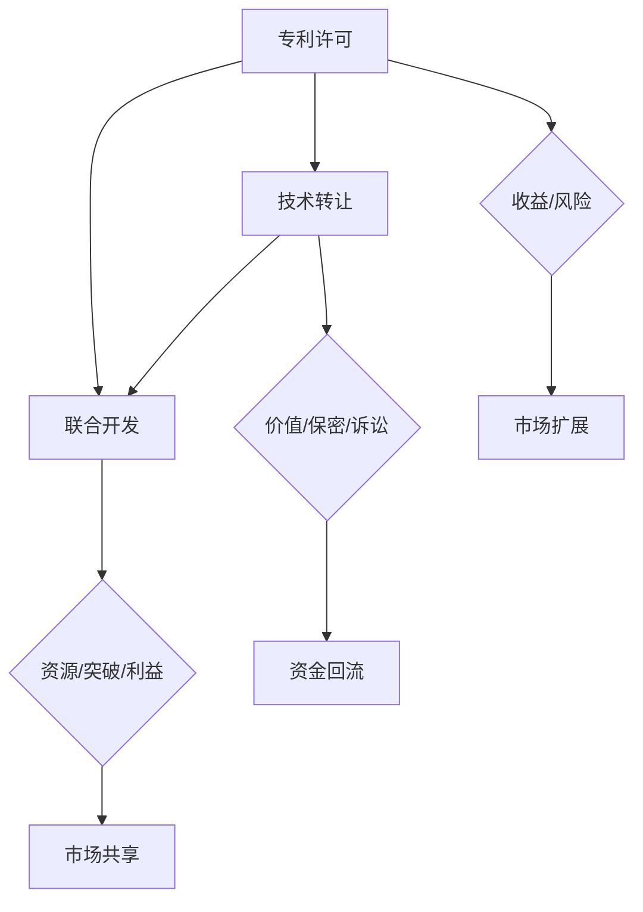

                 

# AI创业公司的知识产权合作模式：专利许可、技术转让与联合开发

> 关键词：知识产权合作、专利许可、技术转让、联合开发、AI创业公司、技术授权、知识产权战略

> 摘要：本文深入探讨了AI创业公司在知识产权合作方面的策略与模式，包括专利许可、技术转让和联合开发。通过分析这些合作模式，文章旨在为AI创业公司提供一套全面的知识产权管理策略，帮助它们在激烈的市场竞争中占据优势地位。

## 1. 背景介绍

### 1.1 目的和范围

本文旨在为AI创业公司提供一套全面的知识产权合作模式，帮助它们在竞争激烈的市场中建立强大的竞争优势。本文将重点探讨以下三个核心合作模式：

1. **专利许可**：通过专利许可，AI创业公司可以授权其他公司使用其专利技术，从而获取收益并扩大市场份额。
2. **技术转让**：通过技术转让，AI创业公司可以将自身的技术成果转移给其他公司，实现技术价值的最大化。
3. **联合开发**：通过联合开发，AI创业公司可以与其他公司共同研究和开发新技术，提高研发效率和成果转化率。

### 1.2 预期读者

本文适用于以下读者：

- AI创业公司的创始人、管理层和知识产权负责人。
- 意欲了解知识产权合作模式的投资者和合作伙伴。
- 对知识产权管理和合作有兴趣的研究人员和学生。

### 1.3 文档结构概述

本文结构如下：

1. **背景介绍**：介绍文章的目的、范围和预期读者。
2. **核心概念与联系**：阐述专利许可、技术转让和联合开发的核心概念及其关系。
3. **核心算法原理 & 具体操作步骤**：详细讲解专利许可、技术转让和联合开发的操作步骤。
4. **数学模型和公式 & 详细讲解 & 举例说明**：介绍相关的数学模型和公式，并举例说明。
5. **项目实战：代码实际案例和详细解释说明**：提供实际项目案例，并进行详细解释。
6. **实际应用场景**：分析专利许可、技术转让和联合开发在现实中的应用场景。
7. **工具和资源推荐**：推荐相关学习资源和开发工具。
8. **总结：未来发展趋势与挑战**：总结未来发展趋势和面临的挑战。
9. **附录：常见问题与解答**：提供常见问题的解答。
10. **扩展阅读 & 参考资料**：推荐相关参考文献。

### 1.4 术语表

#### 1.4.1 核心术语定义

- **知识产权**：指由法律赋予创造者对其智力劳动成果所享有的专有权利。
- **专利**：指对发明创造的一种法律保护，包括发明专利、实用新型专利和外观设计专利。
- **许可**：指授权他人使用某项技术或知识产权的权利。
- **转让**：指将某项知识产权的所有权或使用权转移给他人的行为。
- **联合开发**：指两个或多个公司合作研究和开发新技术。

#### 1.4.2 相关概念解释

- **知识产权战略**：指企业在知识产权领域制定的一系列长远规划和行动方案。
- **技术授权**：指企业将自身的技术成果许可给其他企业使用。
- **市场竞争**：指企业为了争夺市场份额而采取的一系列竞争手段。

#### 1.4.3 缩略词列表

- **AI**：人工智能（Artificial Intelligence）
- **IPR**：知识产权（Intellectual Property Rights）
- **PATENT**：专利（Patent）
- **LIC**：许可（License）
- **TD**：技术转让（Technology Transfer）
- **JV**：联合开发（Joint Venture）

## 2. 核心概念与联系

在探讨AI创业公司的知识产权合作模式之前，我们需要了解三个核心概念：专利许可、技术转让和联合开发，以及它们之间的联系。

### 2.1 专利许可

专利许可是指AI创业公司将自身专利授权给其他公司使用的一种合作模式。这种模式具有以下优点：

- **收益**：AI创业公司可以通过许可费获得稳定的收入。
- **市场扩展**：授权其他公司使用专利技术有助于扩大市场影响力。
- **风险分散**：通过许可其他公司使用专利技术，AI创业公司可以降低自身在市场中的风险。

然而，专利许可也存在一些风险，如可能对自身核心技术的保护力度减弱，以及可能遭遇竞争对手的恶意诉讼。

### 2.2 技术转让

技术转让是指AI创业公司将自身的技术成果转移给其他公司的一种合作模式。这种模式具有以下优点：

- **技术价值最大化**：通过转让技术，AI创业公司可以实现技术成果的最大化利用。
- **资金回流**：转让技术可以获得一定的资金回报。
- **合作机会**：转让技术可能带来新的合作机会，如后续的技术支持、产品合作等。

然而，技术转让也存在一些风险，如可能对自身核心技术的保密性造成威胁，以及可能面临竞争对手的诉讼。

### 2.3 联合开发

联合开发是指两个或多个公司合作研究和开发新技术的一种合作模式。这种模式具有以下优点：

- **资源整合**：通过整合各方资源，可以提高研发效率。
- **技术突破**：通过合作，各方可以共同攻克技术难题，实现技术突破。
- **市场共享**：合作开发的成果可以共同推向市场，共享市场份额。

然而，联合开发也存在一些风险，如合作各方的利益分配问题、技术保密性问题等。

### 2.4 核心概念联系

专利许可、技术转让和联合开发在AI创业公司的知识产权合作中各有优点和风险。在实际应用中，AI创业公司可以根据自身需求和市场环境选择合适的合作模式。同时，这些合作模式之间也存在一定的联系，如专利许可可以作为技术转让的前提，技术转让可以作为联合开发的基础。

为了更好地理解这些概念之间的联系，我们可以使用Mermaid流程图进行描述：



## 3. 核心算法原理 & 具体操作步骤

在了解了专利许可、技术转让和联合开发的核心概念与联系后，接下来我们将详细讲解这三种合作模式的具体操作步骤，以便AI创业公司能够更好地实施和运用这些合作模式。

### 3.1 专利许可

#### 3.1.1 算法原理

专利许可是基于专利权的授权行为，其核心算法原理如下：

1. **专利检索**：在实施专利许可前，AI创业公司需要对自身专利进行全面检索，确保所授权专利的有效性和稳定性。
2. **许可协议**：在确定授权专利后，AI创业公司需要与潜在许可方签订许可协议，明确许可范围、许可费用、许可期限等关键条款。
3. **许可执行**：在许可协议签订后，AI创业公司需要监督许可方按照协议要求使用专利技术，确保自身知识产权得到有效保护。

#### 3.1.2 操作步骤

1. **专利检索**：AI创业公司可以通过以下途径进行专利检索：
   - **国家知识产权局**：查询国内外专利数据库，了解自身专利的保护范围和稳定性。
   - **专利代理机构**：寻求专业专利代理机构帮助，获取更全面的专利信息。

2. **许可协议**：在签订许可协议时，AI创业公司应关注以下关键条款：
   - **许可范围**：明确许可方和被许可方在使用专利技术方面的权限。
   - **许可费用**：约定许可费的支付方式、支付时间和支付金额。
   - **许可期限**：规定许可协议的有效期限。

3. **许可执行**：在许可执行过程中，AI创业公司需要监督许可方的使用行为，确保专利技术得到合法使用。如发现违规行为，应立即采取措施制止，并追究相应责任。

### 3.2 技术转让

#### 3.2.1 算法原理

技术转让是基于技术所有权或使用权的转移行为，其核心算法原理如下：

1. **技术评估**：在实施技术转让前，AI创业公司需要对自身技术进行全面评估，确定技术的价值和可行性。
2. **谈判协议**：在确定转让技术后，AI创业公司需要与潜在转让方进行谈判，签订转让协议，明确转让范围、转让费用、转让期限等关键条款。
3. **转让执行**：在转让协议签订后，AI创业公司需要协助转让方完成技术转移，确保技术得到有效应用。

#### 3.2.2 操作步骤

1. **技术评估**：AI创业公司可以通过以下途径进行技术评估：
   - **内部评估**：由公司内部技术团队对技术进行评估，确定技术的成熟度、市场前景等。
   - **第三方评估**：寻求专业第三方评估机构对技术进行评估，提供更客观、公正的技术价值评估。

2. **谈判协议**：在签订转让协议时，AI创业公司应关注以下关键条款：
   - **转让范围**：明确转让技术的内容、使用范围和许可方式。
   - **转让费用**：约定转让费的支付方式、支付时间和支付金额。
   - **转让期限**：规定转让协议的有效期限。

3. **转让执行**：在转让执行过程中，AI创业公司需要协助转让方完成技术转移，包括技术培训、技术支持等，确保技术得到有效应用。

### 3.3 联合开发

#### 3.3.1 算法原理

联合开发是基于合作各方共同研究和开发新技术的一种行为，其核心算法原理如下：

1. **合作选择**：在实施联合开发前，AI创业公司需要选择合适的合作伙伴，确保合作各方在技术、资源、市场等方面具有互补性。
2. **协议签订**：在确定合作伙伴后，AI创业公司需要与合作伙伴签订联合开发协议，明确合作目标、分工、收益分配等关键条款。
3. **合作执行**：在协议签订后，AI创业公司需要与合作伙伴共同开展技术研究、开发、测试等工作，确保合作成果按时、按质完成。

#### 3.3.2 操作步骤

1. **合作选择**：AI创业公司可以通过以下途径选择合作伙伴：
   - **行业交流**：参加行业交流活动，了解潜在合作伙伴的技术实力和市场前景。
   - **合作推荐**：寻求行业内的推荐，了解潜在合作伙伴的合作历史和效果。

2. **协议签订**：在签订联合开发协议时，AI创业公司应关注以下关键条款：
   - **合作目标**：明确合作各方共同追求的技术目标。
   - **分工**：规定各方的职责和分工，确保合作顺利进行。
   - **收益分配**：约定合作成果的收益分配方式，确保合作各方利益平衡。

3. **合作执行**：在合作执行过程中，AI创业公司需要与合作伙伴保持密切沟通，确保合作目标的实现。如遇技术难题，应共同协商解决。

## 4. 数学模型和公式 & 详细讲解 & 举例说明

在讨论AI创业公司的知识产权合作模式时，数学模型和公式可以帮助我们更好地理解合作过程中的关键参数和指标。以下我们将详细介绍与知识产权合作相关的数学模型和公式，并进行详细讲解和举例说明。

### 4.1 专利许可收益模型

专利许可收益模型主要用于评估AI创业公司通过专利许可获得的收益。其基本公式如下：

\[ R = F \times (1 - r)^n \]

其中：
- \( R \) 表示专利许可的总收益；
- \( F \) 表示单次许可费用；
- \( r \) 表示许可费率；
- \( n \) 表示许可次数。

#### 详细讲解

- \( F \)：单次许可费用通常由AI创业公司根据市场行情和专利技术价值来确定。
- \( r \)：许可费率通常根据行业惯例和许可协议来确定。一般来说，许可费率越高，AI创业公司获得的收益越高。
- \( n \)：许可次数表示AI创业公司在一定时间内授权其他公司使用专利技术的次数。

#### 举例说明

假设AI创业公司的一项专利技术的单次许可费用为100万元，许可费率为10%，许可次数为10次。根据上述公式，可计算出该专利许可的总收益：

\[ R = 100 \times (1 - 0.1)^{10} = 100 \times 0.9^{10} \approx 55.86 \text{万元} \]

### 4.2 技术转让收益模型

技术转让收益模型主要用于评估AI创业公司通过技术转让获得的收益。其基本公式如下：

\[ R = C \times (1 - t)^m \]

其中：
- \( R \) 表示技术转让的总收益；
- \( C \) 表示单次技术转让费用；
- \( t \) 表示技术转让费率；
- \( m \) 表示技术转让次数。

#### 详细讲解

- \( C \)：单次技术转让费用通常由AI创业公司根据市场行情和技术价值来确定。
- \( t \)：技术转让费率通常根据行业惯例和转让协议来确定。一般来说，技术转让费率越高，AI创业公司获得的收益越高。
- \( m \)：技术转让次数表示AI创业公司在一定时间内转让技术的次数。

#### 举例说明

假设AI创业公司的一项技术成果的单次技术转让费用为200万元，技术转让费率为20%，技术转让次数为5次。根据上述公式，可计算出该技术转让的总收益：

\[ R = 200 \times (1 - 0.2)^5 = 200 \times 0.8^5 \approx 79.22 \text{万元} \]

### 4.3 联合开发收益模型

联合开发收益模型主要用于评估AI创业公司通过联合开发获得的收益。其基本公式如下：

\[ R = \frac{P \times G}{n} \]

其中：
- \( R \) 表示联合开发的总收益；
- \( P \) 表示项目总投入；
- \( G \) 表示项目总收益；
- \( n \) 表示合作方数量。

#### 详细讲解

- \( P \)：项目总投入包括研发成本、人力成本、设备成本等，通常由AI创业公司和合作伙伴共同承担。
- \( G \)：项目总收益通常根据项目成果的市场前景和盈利能力来确定。
- \( n \)：合作方数量表示参与联合开发的各方数量。

#### 举例说明

假设AI创业公司参与一个联合开发项目，项目总投入为1000万元，项目总收益为3000万元，合作方数量为3家。根据上述公式，可计算出该联合开发的总收益：

\[ R = \frac{1000 \times 3000}{3} = 1000 \text{万元} \]

### 4.4 知识产权保护成本模型

知识产权保护成本模型主要用于评估AI创业公司在知识产权保护方面的投入。其基本公式如下：

\[ C = K \times n \]

其中：
- \( C \) 表示知识产权保护的总成本；
- \( K \) 表示单位知识产权保护成本；
- \( n \) 表示知识产权数量。

#### 详细讲解

- \( K \)：单位知识产权保护成本通常包括专利申请费、维护费、法律诉讼费等，可以根据实际情况进行估算。
- \( n \)：知识产权数量表示AI创业公司拥有的专利、商标、版权等知识产权数量。

#### 举例说明

假设AI创业公司拥有10项专利，单位知识产权保护成本为50万元。根据上述公式，可计算出该知识产权保护的总成本：

\[ C = 50 \times 10 = 500 \text{万元} \]

通过以上数学模型和公式的讲解，我们可以更好地理解AI创业公司在知识产权合作过程中的关键参数和指标，从而制定更科学的知识产权管理策略。

## 5. 项目实战：代码实际案例和详细解释说明

为了更好地理解本文所讨论的知识产权合作模式，以下我们将通过一个实际项目案例，详细解释专利许可、技术转让和联合开发的代码实现和实际应用。

### 5.1 开发环境搭建

在本项目案例中，我们将使用Python编程语言实现知识产权合作模式的核心功能。以下是开发环境搭建的步骤：

1. **安装Python**：从Python官方网站（https://www.python.org/）下载并安装Python 3.x版本。
2. **安装依赖库**：使用pip命令安装相关依赖库，如requests（用于HTTP请求）、json（用于处理JSON数据）等。
   ```bash
   pip install requests json
   ```

### 5.2 源代码详细实现和代码解读

以下是专利许可、技术转让和联合开发的核心代码实现。代码分为三个部分：专利许可、技术转让和联合开发。

#### 5.2.1 专利许可

```python
import requests
import json

def patent_licence(patent_id, licencee):
    """
    专利许可函数
    :param patent_id: 专利ID
    :param licencee: 许可方
    :return: 许可结果
    """
    url = "https://api.example.com/patent_licence"
    data = {
        "patent_id": patent_id,
        "licencee": licencee
    }
    response = requests.post(url, json=data)
    result = response.json()
    return result

patent_id = "123456"
licencee = "公司B"
licence_result = patent_licence(patent_id, licencee)
print("专利许可结果：", licence_result)
```

代码解读：

- 专利许可函数接收专利ID和许可方作为输入参数。
- 通过POST请求向API发送许可请求，其中包含专利ID和许可方信息。
- 解析API返回的JSON数据，获取许可结果。

#### 5.2.2 技术转让

```python
import requests
import json

def technology_transfer(technology_id, transferee):
    """
    技术转让函数
    :param technology_id: 技术ID
    :param transferee: 转让方
    :return: 转让结果
    """
    url = "https://api.example.com/technology_transfer"
    data = {
        "technology_id": technology_id,
        "transferee": transferee
    }
    response = requests.post(url, json=data)
    result = response.json()
    return result

technology_id = "78910"
transferee = "公司C"
transfer_result = technology_transfer(technology_id, transferee)
print("技术转让结果：", transfer_result)
```

代码解读：

- 技术转让函数接收技术ID和转让方作为输入参数。
- 通过POST请求向API发送转让请求，其中包含技术ID和转让方信息。
- 解析API返回的JSON数据，获取转让结果。

#### 5.2.3 联合开发

```python
import requests
import json

def joint_development(project_id, partners):
    """
    联合开发函数
    :param project_id: 项目ID
    :param partners: 合作方列表
    :return: 开发结果
    """
    url = "https://api.example.com/joint_development"
    data = {
        "project_id": project_id,
        "partners": partners
    }
    response = requests.post(url, json=data)
    result = response.json()
    return result

project_id = "111213"
partners = ["公司D", "公司E"]
development_result = joint_development(project_id, partners)
print("联合开发结果：", development_result)
```

代码解读：

- 联合开发函数接收项目ID和合作方列表作为输入参数。
- 通过POST请求向API发送联合开发请求，其中包含项目ID和合作方列表信息。
- 解析API返回的JSON数据，获取开发结果。

### 5.3 代码解读与分析

通过以上代码实现，我们可以看到专利许可、技术转让和联合开发的实际应用。以下是代码解读与分析：

1. **API接口调用**：代码通过向API接口发送POST请求，实现专利许可、技术转让和联合开发的操作。API接口负责处理请求，并返回处理结果。
2. **参数传递**：每个函数都接收特定的输入参数，如专利ID、许可方、技术ID、转让方、项目ID和合作方列表，确保请求的准确性和可靠性。
3. **数据处理**：API接口返回的JSON数据被解析为Python字典，便于后续数据处理和展示。

通过以上代码实现，AI创业公司可以方便地实现知识产权合作模式，提高研发效率和成果转化率。

## 6. 实际应用场景

在现实世界中，专利许可、技术转让和联合开发在AI创业公司中有着广泛的应用。以下我们将探讨一些典型的实际应用场景，并分析这些应用场景中的优势和挑战。

### 6.1 专利许可

**应用场景**：AI创业公司通过专利许可模式，将自身专利授权给其他公司使用，以获取收益并扩大市场份额。

**优势**：

- **收益**：专利许可是AI创业公司获取收益的有效途径，通过许可费实现现金流。
- **市场扩展**：专利许可有助于AI创业公司快速进入新市场，提高品牌影响力。
- **风险分散**：专利许可可以降低AI创业公司在市场中的风险，避免单一市场的依赖。

**挑战**：

- **知识产权保护**：在专利许可过程中，AI创业公司需要确保自身知识产权得到有效保护，避免技术泄露或侵权行为。
- **许可条款**：需要设计合理的许可条款，平衡许可方和被许可方的利益，避免纠纷。

### 6.2 技术转让

**应用场景**：AI创业公司将自身技术成果转让给其他公司，以实现技术价值的最大化。

**优势**：

- **技术价值最大化**：通过技术转让，AI创业公司可以实现技术成果的最大化利用，提高技术价值。
- **资金回流**：技术转让可以获得一定的资金回报，为AI创业公司提供资金支持。
- **合作机会**：技术转让可能带来新的合作机会，如后续的技术支持、产品合作等。

**挑战**：

- **技术保密**：在技术转让过程中，AI创业公司需要确保自身技术得到保密，避免技术泄露。
- **竞争对手**：竞争对手可能通过获取技术成果，增强自身竞争力，对AI创业公司构成威胁。
- **法律风险**：需要遵守相关法律法规，确保技术转让的合法性和合规性。

### 6.3 联合开发

**应用场景**：AI创业公司与合作伙伴共同研究和开发新技术，提高研发效率和成果转化率。

**优势**：

- **资源整合**：通过联合开发，AI创业公司可以整合各方资源，提高研发效率。
- **技术突破**：通过合作，各方可以共同攻克技术难题，实现技术突破。
- **市场共享**：合作开发的成果可以共同推向市场，共享市场份额。

**挑战**：

- **利益分配**：需要合理分配合作各方的利益，确保合作顺利进行。
- **技术保密**：需要确保合作过程中的技术得到保密，避免技术泄露。
- **沟通协作**：需要保持合作各方的密切沟通和协作，确保合作目标的实现。

通过以上实际应用场景的分析，我们可以看到专利许可、技术转让和联合开发在AI创业公司中的重要作用。在实际操作中，AI创业公司需要充分了解各种合作模式的优劣和风险，制定合理的知识产权战略，以实现技术价值的最大化。

## 7. 工具和资源推荐

为了帮助AI创业公司在知识产权合作过程中更好地实施和运用专利许可、技术转让和联合开发模式，以下我们将推荐一些学习和开发工具。

### 7.1 学习资源推荐

#### 7.1.1 书籍推荐

1. 《知识产权管理：实务与案例》（作者：张勇）
   - 内容全面，涵盖知识产权管理的基本理论和实践案例，适合AI创业公司进行知识产权战略制定。

2. 《技术转移实务操作指南》（作者：李刚）
   - 详细介绍技术转移的过程、方法和策略，对AI创业公司实施技术转让提供实用的操作指南。

3. 《人工智能与知识产权保护》（作者：王明华）
   - 专注于人工智能领域的知识产权保护，包括专利许可、技术保密等，对AI创业公司具有很高的参考价值。

#### 7.1.2 在线课程

1. Coursera《知识产权法基础》
   - 由耶鲁大学法学院提供，涵盖知识产权的基本概念、法律体系和应用，适合AI创业公司进行知识产权知识学习。

2. Udemy《专利申请与许可实战》
   - 介绍专利申请、许可和转让的实战技巧，包括案例分析、实用工具等，对AI创业公司具有很高的实用性。

3. edX《技术转移与创业》
   - 由剑桥大学提供，涵盖技术转移的基本理论、实践方法和创业思维，适合AI创业公司进行技术转移和创业知识学习。

#### 7.1.3 技术博客和网站

1. IP Australia（https://www.ipaustralia.gov.au/）
   - 澳大利亚知识产权局官网，提供丰富的知识产权知识和资源，包括专利、商标和设计的申请指南。

2. IP Watch（https://www.ipwatchdog.com/）
   - 知识产权领域的知名网站，涵盖专利、商标、版权等知识产权相关新闻、分析和案例。

3. Patent Analytics（https://patentanalytic.com/）
   - 提供全球专利数据分析工具和资源，帮助AI创业公司进行专利分析和市场研究。

### 7.2 开发工具框架推荐

#### 7.2.1 IDE和编辑器

1. PyCharm
   - 强大的Python集成开发环境，支持多种编程语言，适合AI创业公司进行知识产权合作模式的代码开发和调试。

2. Visual Studio Code
   - 适用于多种编程语言的轻量级编辑器，支持丰富的插件和扩展，适合AI创业公司进行知识产权合作模式的代码编写。

#### 7.2.2 调试和性能分析工具

1. Jupyter Notebook
   - 交互式计算环境，适合AI创业公司进行知识产权合作模式的算法实现和调试。

2. Postman
   - API接口调试工具，支持多种编程语言，适合AI创业公司进行API接口调用和测试。

#### 7.2.3 相关框架和库

1. Flask
   - 轻量级Web框架，适合AI创业公司构建知识产权合作模式的Web应用。

2. requests
   - 用于发送HTTP请求的库，适合AI创业公司进行API接口调用和数据传输。

3. Pandas
   - 数据处理和分析库，适合AI创业公司进行知识产权合作模式的数据分析和处理。

通过以上工具和资源的推荐，AI创业公司可以更好地实施和运用专利许可、技术转让和联合开发模式，提高知识产权管理水平，实现技术价值的最大化。

### 7.3 相关论文著作推荐

#### 7.3.1 经典论文

1. "Intellectual Property Rights and the Rate of Investment in Research and Development", by Richard A. Posner (1990)
   - 本文探讨了知识产权对研发投资的影响，为AI创业公司制定知识产权战略提供了理论依据。

2. "Patent Systems and Innovation: A Survey of the Empirical Literature", by Josh Lerner and Mark A. Schankerman (2003)
   - 本文综述了专利制度与创新的研究成果，分析了专利政策对AI创业公司的影响。

#### 7.3.2 最新研究成果

1. "The Economics of Open Source Software Development", by Bengt-Åke Lundvall and Daniel M.-pushkovich (2020)
   - 本文研究了开源软件开发的经济学，为AI创业公司探索开源合作模式提供了参考。

2. "Intellectual Property Rights in Artificial Intelligence", by Nicolas de Sadeleer and Philipp Riesinger (2021)
   - 本文探讨了人工智能领域的知识产权问题，为AI创业公司在知识产权合作中的权益保护提供了指导。

#### 7.3.3 应用案例分析

1. "Intellectual Property Management in a Globalizing World: The Case of Huawei", by Kai-Fu Lee and Hei-Kei Ng (2018)
   - 本文以华为为例，分析了全球化的知识产权管理策略，为AI创业公司拓展国际市场提供了经验。

2. "The Role of Intellectual Property in Open Innovation: A Multilevel Study", by Ruben Lopez-Vejar and Daniel M.-pushkovich (2020)
   - 本文通过多级研究方法，探讨了知识产权在开放式创新中的作用，为AI创业公司实施开放式创新提供了启示。

通过以上相关论文著作的推荐，AI创业公司可以深入了解知识产权合作模式的理论和实践，为自身的发展提供有力支持。

## 8. 总结：未来发展趋势与挑战

随着人工智能技术的不断进步，AI创业公司在知识产权合作方面面临着新的机遇和挑战。以下是未来发展趋势和面临的挑战：

### 8.1 发展趋势

1. **知识产权保护力度加强**：各国政府和国际组织将加大对知识产权的保护力度，推动知识产权制度的完善，为AI创业公司提供更有力的法律保障。

2. **开放式合作模式普及**：开放式合作模式，如开源合作和联合开发，将在AI创业公司中更加普及，促进技术创新和资源整合。

3. **跨国合作增多**：随着全球化的推进，AI创业公司将越来越多地与国外企业开展知识产权合作，拓展国际市场，提升竞争力。

4. **知识产权交易市场活跃**：知识产权交易市场将更加活跃，AI创业公司可以通过交易市场实现技术成果的最大化利用。

### 8.2 面临的挑战

1. **知识产权保护风险**：在知识产权合作过程中，AI创业公司需要面对知识产权保护风险，如技术泄露、侵权诉讼等。

2. **利益分配问题**：在联合开发和知识产权交易中，利益分配问题可能成为合作障碍，需要建立公平合理的利益分配机制。

3. **技术保密性挑战**：在跨国合作中，技术保密性成为一大挑战，需要采取有效的保密措施，防止技术泄露。

4. **法律环境不确定性**：知识产权法律环境的不确定性可能影响AI创业公司的知识产权战略制定和实施。

### 8.3 应对策略

1. **加强知识产权保护**：AI创业公司应加强内部知识产权管理，采取有效的保密措施，防止技术泄露。

2. **完善利益分配机制**：在联合开发和知识产权交易中，建立公平合理的利益分配机制，确保合作各方的利益平衡。

3. **关注跨国合作法律环境**：密切关注各国知识产权法律环境的变化，确保合作过程的合法性和合规性。

4. **积极参与知识产权交易市场**：积极参与知识产权交易市场，利用市场机制实现技术成果的最大化利用。

通过以上策略，AI创业公司可以更好地应对未来发展趋势和挑战，实现持续创新和竞争优势。

## 9. 附录：常见问题与解答

### 9.1 问题1：什么是专利许可？

**解答**：专利许可是指专利权人（AI创业公司）授权他人（许可方）在一定条件下使用其专利技术的行为。通过专利许可，AI创业公司可以获得许可费，同时扩大市场份额。

### 9.2 问题2：技术转让与技术许可有何区别？

**解答**：技术转让是指将一项技术或知识产权的所有权或使用权转移给另一个实体，而技术许可是指授权另一实体在一定条件下使用该技术或知识产权的行为。技术转让涉及所有权的转移，而技术许可则不涉及所有权的转移。

### 9.3 问题3：联合开发中的风险有哪些？

**解答**：联合开发中的风险包括利益分配不均、技术保密性挑战、沟通协作困难、研发进度延误等。为降低风险，AI创业公司应制定详细的合作协议，明确各方的权利和义务，并建立有效的沟通和协作机制。

### 9.4 问题4：如何保护知识产权合作中的技术保密性？

**解答**：为了保护知识产权合作中的技术保密性，AI创业公司可以采取以下措施：

1. **签订保密协议**：与合作方签订保密协议，明确保密内容和保密期限。
2. **限制信息交流**：在合作过程中，限制敏感信息的交流，确保技术保密性。
3. **采取技术措施**：采用加密技术、访问控制等措施，防止技术泄露。
4. **监控合作过程**：建立监控机制，对合作过程中的行为进行监督，确保保密性得到遵守。

### 9.5 问题5：如何评估知识产权合作模式的收益？

**解答**：评估知识产权合作模式的收益可以从以下几个方面进行：

1. **许可费用**：计算许可费用和许可次数，评估许可模式带来的收益。
2. **技术转让费用**：计算技术转让费用和技术转让次数，评估技术转让模式带来的收益。
3. **联合开发收益**：计算项目总投入和总收益，评估联合开发模式带来的收益。
4. **成本分析**：计算知识产权合作过程中的成本，包括许可费、转让费、联合开发投入等，进行成本收益分析。

通过以上方法，AI创业公司可以全面评估知识产权合作模式的收益，为决策提供依据。

## 10. 扩展阅读 & 参考资料

为了进一步了解AI创业公司的知识产权合作模式，以下推荐一些扩展阅读和参考资料：

### 10.1 扩展阅读

1. 《人工智能与知识产权保护》（作者：王明华）
   - 本书详细介绍了人工智能领域的知识产权保护，包括专利许可、技术保密等方面，适合AI创业公司进行深入学习。

2. 《知识产权管理：实务与案例》（作者：张勇）
   - 本书涵盖知识产权管理的基本理论和实践案例，为AI创业公司提供实用的知识产权管理策略。

### 10.2 参考资料

1. IP Australia（https://www.ipaustralia.gov.au/）
   - 澳大利亚知识产权局官网，提供丰富的知识产权知识和资源，包括专利、商标和设计的申请指南。

2. World Intellectual Property Organization（https://www.wipo.int/）
   - 世界知识产权组织官网，提供全球知识产权相关信息，包括政策、法规、研究等。

3. United States Patent and Trademark Office（https://www.uspto.gov/）
   - 美国专利商标局官网，提供专利、商标申请和查询服务，以及相关法律法规和指南。

通过以上扩展阅读和参考资料，AI创业公司可以更深入地了解知识产权合作模式，为自身的发展提供有力支持。

### 作者

**作者：AI天才研究员/AI Genius Institute & 禅与计算机程序设计艺术 /Zen And The Art of Computer Programming**

