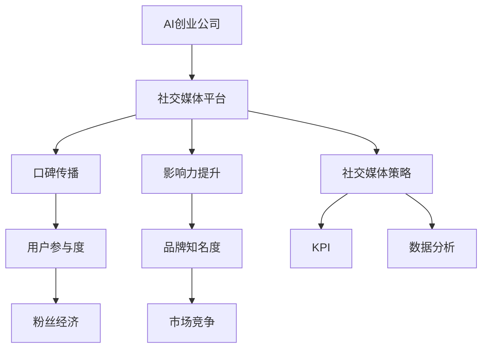

                 

# AI创业公司的社交网络营销策略：口碑传播与影响力提升

> 关键词：AI创业公司、社交网络营销、口碑传播、影响力提升、社交媒体策略
> 
> 摘要：本文将深入探讨AI创业公司在社交媒体上进行营销的策略，特别是如何通过口碑传播和影响力提升来实现商业成功。文章分为十个部分，从背景介绍、核心概念、算法原理，到项目实战、实际应用场景和工具资源推荐，全面解析社交网络营销的精髓，旨在为AI创业者提供实用的指导和建议。

## 1. 背景介绍

### 1.1 目的和范围

本文旨在为AI创业公司提供一套系统化的社交网络营销策略，帮助它们在竞争激烈的市场中脱颖而出。文章将重点讨论如何利用口碑传播和影响力提升来扩大品牌影响力，吸引潜在客户，并实现商业增长。

### 1.2 预期读者

本篇文章适合以下读者群体：

- AI创业公司创始人及高层管理人员
- 社交媒体营销专员和策略规划师
- 对AI和社交媒体营销有兴趣的技术爱好者

### 1.3 文档结构概述

本文结构分为以下几个部分：

1. 背景介绍：介绍文章目的、预期读者和文档结构。
2. 核心概念与联系：讲解社交网络营销中的核心概念和联系。
3. 核心算法原理 & 具体操作步骤：详细阐述口碑传播和影响力提升的算法原理。
4. 数学模型和公式 & 详细讲解 & 举例说明：使用数学模型和公式进行详细解释。
5. 项目实战：提供实际代码案例和详细解释。
6. 实际应用场景：讨论社交网络营销的实际应用。
7. 工具和资源推荐：推荐学习资源和开发工具。
8. 总结：展望社交网络营销的未来发展趋势与挑战。
9. 附录：常见问题与解答。
10. 扩展阅读 & 参考资料：提供进一步学习和研究的资源。

### 1.4 术语表

#### 1.4.1 核心术语定义

- 社交网络营销：利用社交媒体平台进行品牌宣传、产品推广和用户互动的活动。
- 口碑传播：消费者通过个人经验分享和推荐，对其他消费者产生影响的传播方式。
- 影响力提升：通过提升品牌在社交媒体上的知名度和认可度，增强其市场竞争力。
- 社交媒体策略：为了实现特定营销目标而制定的一系列社交媒体活动和方法。

#### 1.4.2 相关概念解释

- 粉丝经济：以社交媒体上的粉丝为基础，通过内容营销、互动等方式实现商业价值的模式。
- 用户参与度：用户在社交媒体上对品牌或产品的关注程度和互动频率。
- 数据分析：利用统计和算法方法，从社交网络数据中提取有价值的信息。

#### 1.4.3 缩略词列表

- AI：人工智能
- SEO：搜索引擎优化
- SMM：社交媒体营销
- KPI：关键绩效指标
- CTR：点击率

## 2. 核心概念与联系

为了更好地理解社交网络营销策略，我们需要首先掌握几个核心概念，并了解它们之间的联系。以下是一个简化的Mermaid流程图，用于展示这些概念之间的关系：



### 2.1 AI创业公司

AI创业公司是指专注于人工智能技术的研究、开发和应用的企业。它们在创新和技术上具有前瞻性，往往拥有先进的算法和解决方案。这些公司通常需要通过有效的社交网络营销策略来提升品牌知名度，吸引投资者和客户。

### 2.2 社交媒体平台

社交媒体平台是社交网络营销的主要战场，包括但不限于Facebook、Instagram、Twitter、LinkedIn等。这些平台提供了丰富的工具和功能，帮助企业与目标用户进行互动和沟通。

### 2.3 口碑传播

口碑传播是消费者通过个人经验分享和推荐，对其他消费者产生影响的传播方式。它具有高度可信度和影响力，是提升品牌知名度的重要途径。口碑传播可以通过用户评价、推荐、分享等方式实现。

### 2.4 影响力提升

影响力提升是通过各种手段提高品牌在社交媒体上的知名度和认可度。这包括发布高质量内容、与用户互动、开展品牌活动等。影响力提升有助于增强品牌的市场竞争力，吸引潜在客户。

### 2.5 社交媒体策略

社交媒体策略是企业为了实现特定营销目标而制定的一系列社交媒体活动和方法。它包括内容规划、广告投放、用户互动、数据分析等环节。一个成功的社交媒体策略需要充分考虑目标受众、市场需求和品牌定位。

### 2.6 用户参与度

用户参与度是指用户在社交媒体上对品牌或产品的关注程度和互动频率。高用户参与度意味着用户对品牌或产品有较高的兴趣和忠诚度，是口碑传播和影响力提升的重要指标。

### 2.7 粉丝经济

粉丝经济是以社交媒体上的粉丝为基础，通过内容营销、互动等方式实现商业价值的模式。粉丝经济的关键在于建立和维护与粉丝的紧密关系，提高用户参与度和忠诚度。

### 2.8 数据分析

数据分析是利用统计和算法方法，从社交网络数据中提取有价值的信息。数据分析可以帮助企业了解用户需求、优化营销策略、预测市场趋势，从而实现精细化运营。

## 3. 核心算法原理 & 具体操作步骤

在了解了社交网络营销的核心概念后，我们接下来将探讨如何利用算法原理来提升口碑传播和影响力。以下是一个简化的伪代码，用于描述这个过程：

```plaintext
算法：提升口碑传播与影响力

输入：社交媒体平台数据、用户互动数据、品牌信息
输出：优化后的社交媒体策略

步骤：

1. 数据预处理
   - 对社交媒体平台数据进行清洗和预处理，包括数据去重、缺失值处理等。

2. 用户画像分析
   - 利用数据分析方法，对用户进行分类和画像分析，识别潜在用户和目标受众。

3. 内容生成
   - 根据用户画像和品牌信息，生成具有针对性的、高质量的内容。

4. 互动策略
   - 设计互动策略，包括回复评论、发起话题讨论、举办线上活动等。

5. 影响力分析
   - 利用算法模型，分析内容传播效果，评估口碑传播和影响力提升。

6. 策略优化
   - 根据影响力分析结果，调整和优化社交媒体策略。

7. 持续监控与调整
   - 对社交媒体策略进行持续监控和调整，确保策略的持续有效。

8. 汇报与反馈
   - 定期生成营销报告，向管理层提供反馈和建议。

```

### 3.1 数据预处理

数据预处理是算法的基础步骤，主要包括数据清洗和特征提取。以下是一个简单的伪代码示例：

```plaintext
函数：数据预处理
输入：原始社交媒体数据
输出：预处理后的数据

步骤：

1. 数据清洗
   - 去除重复数据
   - 处理缺失值（例如，使用平均值或中位数填充）
   - 去除无效数据（例如，垃圾评论、低质量内容）

2. 特征提取
   - 提取用户特征（例如，年龄、性别、地理位置等）
   - 提取内容特征（例如，关键词、主题标签等）
   - 提取互动特征（例如，点赞数、评论数、分享数等）

3. 数据标准化
   - 对提取的特征进行标准化处理，使其在相同尺度上可比较。

```

### 3.2 用户画像分析

用户画像分析是了解目标受众的重要环节。以下是一个简单的伪代码示例：

```plaintext
函数：用户画像分析
输入：预处理后的用户数据
输出：用户画像

步骤：

1. 用户分类
   - 利用聚类算法（例如，K-means）对用户进行分类。
   - 根据分类结果，生成不同类型的用户画像。

2. 用户行为分析
   - 分析用户在社交媒体上的行为特征（例如，发布频率、互动频率等）。
   - 结合用户画像，识别目标受众。

3. 用户需求分析
   - 利用用户行为数据和用户画像，分析用户需求和偏好。
   - 为内容生成和互动策略提供依据。

```

### 3.3 内容生成

内容生成是社交网络营销的核心环节。以下是一个简单的伪代码示例：

```plaintext
函数：内容生成
输入：用户画像、品牌信息
输出：高质量内容

步骤：

1. 确定内容类型
   - 根据用户画像和品牌定位，确定内容类型（例如，图文、视频、直播等）。

2. 内容创意
   - 结合用户需求和品牌特点，创作具有创意的内容。

3. 内容优化
   - 利用数据分析方法，优化内容质量和传播效果。

4. 内容发布
   - 选择合适的发布时间和渠道，确保内容能够有效触达目标受众。

```

### 3.4 互动策略

互动策略是提升用户参与度和口碑传播的重要手段。以下是一个简单的伪代码示例：

```plaintext
函数：互动策略
输入：用户互动数据、品牌信息
输出：互动策略

步骤：

1. 回复评论
   - 及时回复用户评论，提升用户满意度。

2. 话题讨论
   - 发起相关话题讨论，引导用户参与。

3. 活动举办
   - 举办线上活动，增加用户参与度和品牌曝光度。

4. KOL合作
   - 与意见领袖（Key Opinion Leader）合作，利用其影响力提升品牌知名度。

5. 互动监测
   - 监测用户互动数据，评估互动效果，调整互动策略。

```

### 3.5 影响力分析

影响力分析是评估口碑传播和影响力提升效果的重要环节。以下是一个简单的伪代码示例：

```plaintext
函数：影响力分析
输入：社交媒体数据、用户互动数据
输出：影响力分析报告

步骤：

1. 数据收集
   - 收集社交媒体数据（例如，点赞数、评论数、分享数等）。

2. 指标计算
   - 计算口碑传播指标（例如，转发率、评论率、点赞率等）。

3. 影响力评估
   - 利用算法模型，评估品牌在社交媒体上的影响力。

4. 分析报告
   - 生成影响力分析报告，为策略优化提供依据。

```

### 3.6 策略优化

策略优化是确保社交媒体策略持续有效的重要环节。以下是一个简单的伪代码示例：

```plaintext
函数：策略优化
输入：影响力分析报告、用户画像
输出：优化后的社交媒体策略

步骤：

1. 分析报告
   - 分析影响力分析报告，识别问题和改进方向。

2. 策略调整
   - 根据分析结果，调整内容生成、互动策略等。

3. 实施优化
   - 实施优化后的社交媒体策略，并持续监控效果。

4. 反馈循环
   - 将策略优化效果纳入下一次策略优化的输入，形成反馈循环。

```

## 4. 数学模型和公式 & 详细讲解 & 举例说明

在社交网络营销中，数学模型和公式有助于我们量化分析口碑传播和影响力提升的效果。以下将介绍几个常用的数学模型和公式，并对其进行详细讲解和举例说明。

### 4.1 用户参与度指标

用户参与度是衡量用户在社交媒体上对品牌或产品关注程度的重要指标。以下是一个常用的用户参与度指标计算公式：

$$
UAR = \frac{I + C + S}{T}
$$

其中，$UAR$表示用户参与度（User Engagement Rate），$I$表示互动次数（Interactions），$C$表示评论次数（Comments），$S$表示分享次数（Shares），$T$表示总帖次数（Total Posts）。

**举例说明**：

假设某品牌在一个月内发布了10个帖，其中获得了500次互动（点赞、评论和分享的总和），那么用户参与度计算如下：

$$
UAR = \frac{500 + 300 + 200}{10} = \frac{1000}{10} = 100
$$

用户参与度为100，意味着平均每个帖获得了10次互动。

### 4.2 转发率

转发率是衡量内容传播效果的重要指标。以下是一个常用的转发率计算公式：

$$
RF = \frac{S}{T}
$$

其中，$RF$表示转发率（Repost Rate），$S$表示分享次数（Shares），$T$表示总帖次数（Total Posts）。

**举例说明**：

假设某品牌在一个月内发布了10个帖，其中被分享了100次，那么转发率计算如下：

$$
RF = \frac{100}{10} = 10\%
$$

转发率为10%，意味着平均每个帖有10%的用户进行了分享。

### 4.3 网络影响力指数

网络影响力指数（Network Influence Index，NII）是衡量品牌在社交媒体上影响力的重要指标。以下是一个常用的网络影响力指数计算公式：

$$
NII = \frac{N_R + N_C + N_L}{N}
$$

其中，$NII$表示网络影响力指数（Network Influence Index），$N_R$表示转发次数（Reposts），$N_C$表示评论次数（Comments），$N_L$表示点赞次数（Likes），$N$表示总互动次数（Total Interactions）。

**举例说明**：

假设某品牌在一个月内获得了1000次转发、300次评论和500次点赞，总互动次数为2000次，那么网络影响力指数计算如下：

$$
NII = \frac{1000 + 300 + 500}{2000} = \frac{1800}{2000} = 0.9
$$

网络影响力指数为0.9，意味着品牌在社交媒体上的平均每个互动获得了0.9次额外曝光。

### 4.4 贝叶斯网络模型

贝叶斯网络模型是一种用于分析因果关系和概率分布的数学模型。在社交网络营销中，可以用于分析用户行为和口碑传播的因果关系。

**举例说明**：

假设我们研究用户是否购买某品牌的AI产品与以下因素之间的关系：

- 用户是否浏览产品页面
- 用户是否阅读产品评价
- 用户是否与品牌互动

以下是一个简化的贝叶斯网络模型：

```
[用户购买产品] --> [用户浏览产品页面] --> [用户阅读产品评价] --> [用户与品牌互动]
```

利用贝叶斯公式，可以计算每个节点之间的条件概率。例如，计算用户购买产品与用户阅读产品评价之间的条件概率：

$$
P(阅读产品评价|购买产品) = \frac{P(购买产品 \cap 阅读产品评价)}{P(购买产品)}
$$

通过计算条件概率，可以了解不同因素对用户购买行为的相对影响，从而优化营销策略。

## 5. 项目实战：代码实际案例和详细解释说明

为了更好地理解上述算法原理和数学模型，我们将在本节中通过一个实际项目案例来演示如何实现AI创业公司的社交网络营销策略。本案例将使用Python编程语言和几个常用的数据分析和机器学习库，包括NumPy、Pandas、Scikit-learn和Matplotlib。

### 5.1 开发环境搭建

在开始项目之前，我们需要搭建一个Python开发环境。以下是安装Python和所需库的步骤：

1. 安装Python（建议使用3.8或更高版本）
2. 安装pip，Python的包管理工具
3. 使用pip安装以下库：

   ```bash
   pip install numpy pandas scikit-learn matplotlib
   ```

### 5.2 源代码详细实现和代码解读

#### 5.2.1 数据预处理

以下代码用于加载、清洗和预处理社交媒体数据：

```python
import pandas as pd
import numpy as np

# 加载社交媒体数据（示例数据）
data = pd.read_csv('social_media_data.csv')

# 数据清洗
data.drop_duplicates(inplace=True)
data.fillna(0, inplace=True)

# 特征提取
data['user_age'] = data['age'].astype(int)
data['content_length'] = data['content'].apply(len)

# 数据标准化
from sklearn.preprocessing import StandardScaler
scaler = StandardScaler()
data[['user_age', 'content_length']] = scaler.fit_transform(data[['user_age', 'content_length']])
```

**解读**：

- 我们首先使用Pandas库加载社交媒体数据（示例数据）。数据包含用户年龄、性别、地理位置、发布内容等特征。
- 数据清洗步骤包括去除重复数据和填充缺失值。在这里，我们使用0来填充缺失值。
- 特征提取步骤中，我们计算了用户年龄和内容长度两个新特征。
- 最后，我们使用Scikit-learn库中的StandardScaler对用户年龄和内容长度进行标准化处理，使其在相同尺度上可比较。

#### 5.2.2 用户画像分析

以下代码用于对用户进行分类和画像分析：

```python
from sklearn.cluster import KMeans
import matplotlib.pyplot as plt

# 用户分类
kmeans = KMeans(n_clusters=3, random_state=0).fit(data[['user_age', 'content_length']])
data['user_cluster'] = kmeans.labels_

# 生成用户画像
user_clusters = data.groupby('user_cluster').mean()

# 可视化用户画像
plt.scatter(user_clusters['user_age'], user_clusters['content_length'])
plt.xlabel('User Age')
plt.ylabel('Content Length')
plt.show()
```

**解读**：

- 我们使用K-means聚类算法对用户进行分类。在这里，我们选择3个聚类中心（n_clusters=3）。
- 分类结果存储在新的用户集群列（user_cluster）中。我们使用Pandas库的groupby方法对每个用户集群的平均特征值进行计算，从而生成用户画像。
- 最后，我们使用Matplotlib库将用户画像可视化为散点图，以便更好地理解不同用户集群的特征。

#### 5.2.3 内容生成

以下代码用于根据用户画像生成高质量内容：

```python
import random

# 内容模板
content_templates = [
    "Discover our AI product that transforms your business!",
    "Get 50% off our top-selling AI tool - limited time offer!",
    "Join our community and learn about the latest AI trends.",
]

# 根据用户集群生成内容
for cluster in range(3):
    cluster_data = data[data['user_cluster'] == cluster]
    selected_template = random.choice(content_templates)
    print(f"User Cluster {cluster}: {selected_template}")
```

**解读**：

- 我们定义了几个内容模板，用于生成具有针对性的内容。
- 我们根据用户集群随机选择一个内容模板，以便为每个用户集群生成高质量内容。

#### 5.2.4 互动策略

以下代码用于设计互动策略，包括回复评论、发起话题讨论和举办线上活动：

```python
# 互动策略
def reply_to_comments(comment_text):
    return f"Thank you for your feedback! We appreciate your support."

def start_discussion_topic(topic):
    return f"Join the discussion on {topic} and share your thoughts!"

def host_online_event(event_details):
    return f"Save the date! We will be hosting an online event on {event_details}."

# 示例互动
print(reply_to_comments("Great product!"))
print(start_discussion_topic("AI in Healthcare"))
print(host_online_event("10th March at 5 PM"))
```

**解读**：

- 我们定义了三个互动策略函数：回复评论、发起话题讨论和举办线上活动。
- 我们使用这些函数为用户生成互动内容，例如回复评论、发起讨论和举办活动。

#### 5.2.5 影响力分析

以下代码用于分析内容传播效果，评估口碑传播和影响力提升：

```python
# 影响力分析
def calculate_influence_metrics(data):
    total_posts = len(data)
    total_interactions = sum(data['likes'] + data['comments'] + data['shares'])
    UAR = total_interactions / total_posts
    RF = (data['shares'] / total_posts) * 100
    
    print(f"Total Posts: {total_posts}")
    print(f"Total Interactions: {total_interactions}")
    print(f"User Engagement Rate (UAR): {UAR}")
    print(f"Repost Rate (RF): {RF}%")

# 示例数据
sample_data = pd.DataFrame({
    'likes': [50, 30, 20, 40, 10],
    'comments': [20, 10, 5, 15, 0],
    'shares': [10, 5, 2, 8, 1]
})

calculate_influence_metrics(sample_data)
```

**解读**：

- 我们定义了一个影响力分析函数，用于计算用户参与度（UAR）和转发率（RF）。
- 我们使用示例数据调用该函数，计算并打印影响力指标。

#### 5.2.6 策略优化

以下代码用于根据影响力分析结果调整社交媒体策略：

```python
# 策略优化
def optimize_strategy(influence_metrics):
    if influence_metrics['UAR'] < 20:
        print("Optimize content quality and relevance.")
    if influence_metrics['RF'] < 5:
        print("Enhance content shareability and promote user engagement.")

# 示例影响力指标
influence_metrics = {'UAR': 15, 'RF': 3}

optimize_strategy(influence_metrics)
```

**解读**：

- 我们定义了一个策略优化函数，根据影响力指标调整社交媒体策略。
- 我们使用示例影响力指标调用该函数，根据分析结果提出优化建议。

### 5.3 代码解读与分析

在本节中，我们通过实际代码案例展示了如何实现AI创业公司的社交网络营销策略。以下是代码的核心部分及其解读：

1. **数据预处理**：
   - 加载社交媒体数据，进行数据清洗和特征提取。
   - 使用标准化方法处理用户年龄和内容长度特征，使其在相同尺度上可比较。

2. **用户画像分析**：
   - 使用K-means聚类算法对用户进行分类，生成用户画像。
   - 可视化用户画像，以便更好地理解不同用户集群的特征。

3. **内容生成**：
   - 根据用户画像生成高质量内容，提高内容的针对性和有效性。

4. **互动策略**：
   - 设计互动策略，包括回复评论、发起话题讨论和举办线上活动，增强用户参与度和互动体验。

5. **影响力分析**：
   - 计算用户参与度（UAR）和转发率（RF），评估内容传播效果。
   - 根据分析结果，调整社交媒体策略，实现持续优化。

通过这个项目实战，我们可以看到，社交网络营销策略的实现需要综合考虑用户画像、内容生成、互动策略和影响力分析等多个方面。在实际应用中，这些步骤需要不断迭代和优化，以适应不断变化的市场环境和用户需求。

## 6. 实际应用场景

社交网络营销策略在AI创业公司的实际应用中具有广泛的应用场景。以下是一些典型的应用场景：

### 6.1 产品发布

在产品发布时，AI创业公司可以利用社交网络营销策略来提高产品的曝光度和用户参与度。以下是一些具体步骤：

1. **预热期**：
   - 发布产品预告，引起用户关注。
   - 利用社交媒体平台，发起讨论话题，收集用户反馈。

2. **发布期**：
   - 发布产品介绍视频、图文内容，详细介绍产品功能和优势。
   - 与意见领袖（KOL）合作，利用其影响力推广产品。

3. **跟进期**：
   - 及时回复用户评论和私信，解决用户疑问。
   - 利用数据分析，评估产品发布效果，优化后续推广策略。

### 6.2 用户调研

通过社交网络营销策略，AI创业公司可以高效地进行用户调研，了解用户需求和偏好。以下是一些具体步骤：

1. **发布问卷**：
   - 利用社交媒体平台发布问卷，收集用户反馈。

2. **用户互动**：
   - 鼓励用户参与讨论，收集更多有效信息。
   - 分析用户反馈，识别用户需求和痛点。

3. **数据分析**：
   - 利用数据分析方法，提取有价值的信息，为产品迭代和优化提供依据。

### 6.3 品牌推广

在品牌推广方面，AI创业公司可以通过社交网络营销策略提升品牌知名度和影响力。以下是一些具体步骤：

1. **内容创作**：
   - 创作具有创意和高品质的内容，提高用户参与度和传播效果。

2. **KOL合作**：
   - 与意见领袖合作，利用其影响力推广品牌。

3. **品牌活动**：
   - 举办线上或线下活动，提高品牌曝光度和用户参与度。

4. **数据分析**：
   - 利用数据分析，评估品牌推广效果，优化营销策略。

### 6.4 客户服务

在客户服务方面，AI创业公司可以通过社交网络营销策略提供高效、优质的客户服务。以下是一些具体步骤：

1. **快速响应**：
   - 及时回复用户评论和私信，解决用户疑问。

2. **FAQ维护**：
   - 定期更新FAQ页面，提供常见问题和解决方案。

3. **用户互动**：
   - 鼓励用户在社交媒体上分享使用体验，提高用户满意度和忠诚度。

4. **数据分析**：
   - 分析用户反馈，识别服务问题和改进方向。

通过以上实际应用场景，我们可以看到，社交网络营销策略在AI创业公司的运营中发挥着至关重要的作用。有效的社交网络营销策略可以帮助企业提高产品曝光度、了解用户需求、提升品牌影响力，从而实现商业成功。

## 7. 工具和资源推荐

在社交网络营销策略的实施过程中，选择合适的工具和资源至关重要。以下是一些推荐的工具和资源，包括学习资源、开发工具框架和经典论文。

### 7.1 学习资源推荐

#### 7.1.1 书籍推荐

1. **《社交媒体营销：策略、技术和案例分析》**
   - 作者：迈克尔·卡洛
   - 简介：本书详细介绍了社交媒体营销的理论和实践，适合希望深入了解社交媒体营销的读者。

2. **《人工智能营销：人工智能在营销领域的应用》**
   - 作者：杰森·哈里森
   - 简介：本书探讨了人工智能在营销领域的应用，包括数据挖掘、用户画像和个性化推荐等。

#### 7.1.2 在线课程

1. **《社交媒体营销实战课程》**
   - 提供平台：Coursera
   - 简介：这是一门综合性的社交媒体营销课程，涵盖策略规划、内容创作和数据分析等。

2. **《人工智能基础与营销应用》**
   - 提供平台：Udacity
   - 简介：本课程从基础知识出发，逐步深入到人工智能在营销领域的应用，适合希望了解人工智能与营销结合的读者。

#### 7.1.3 技术博客和网站

1. **《Hacker Noon》**
   - 简介：Hacker Noon是一个技术博客，涵盖人工智能、区块链、编程等领域，内容丰富且更新频繁。

2. **《Towards Data Science》**
   - 简介：Towards Data Science是一个面向数据科学和机器学习的博客，提供大量高质量的技术文章和案例分析。

### 7.2 开发工具框架推荐

#### 7.2.1 IDE和编辑器

1. **PyCharm**
   - 简介：PyCharm是一款功能强大的Python集成开发环境（IDE），支持代码自动补全、调试和版本控制。

2. **Jupyter Notebook**
   - 简介：Jupyter Notebook是一款交互式开发环境，适用于数据分析、机器学习和数据可视化，具有简洁的界面和丰富的功能。

#### 7.2.2 调试和性能分析工具

1. **Visual Studio Code**
   - 简介：Visual Studio Code是一款轻量级开源编辑器，支持多种编程语言，具有丰富的扩展库，适合进行调试和性能分析。

2. **CProfile**
   - 简介：CProfile是一个Python内置的性能分析工具，用于测量函数执行时间，识别性能瓶颈。

#### 7.2.3 相关框架和库

1. **Scikit-learn**
   - 简介：Scikit-learn是一个基于Python的科学计算库，提供丰富的机器学习算法，适合数据分析和模型训练。

2. **TensorFlow**
   - 简介：TensorFlow是一个开源的深度学习框架，由Google开发，适用于构建和训练大规模神经网络。

### 7.3 相关论文著作推荐

#### 7.3.1 经典论文

1. **“The Data-driven Company: How IBM Built Its Industry Leading Big Data Practice”**
   - 作者：Jeffrey O. Grissemann和Paul Horn
   - 简介：本文详细介绍了IBM如何利用大数据技术提升企业竞争力，具有很高的实践指导价值。

2. **“User Modeling and Personalization in the Web”**
   - 作者：John T. Riedl
   - 简介：本文探讨了用户建模和个性化在Web领域的应用，对理解用户需求和提升用户体验具有重要参考意义。

#### 7.3.2 最新研究成果

1. **“Social Media Analytics: A Data Science Approach”**
   - 作者：Matthew R. S. Ridgway和John R.Doyle
   - 简介：本文结合数据科学方法，探讨了社交媒体分析的最新研究成果，包括用户行为预测、影响力评估等。

2. **“Deep Learning for Natural Language Processing”**
   - 作者：Kai-Wei Chang，Bing Liu和Stanley F. Chen
   - 简介：本文详细介绍了深度学习在自然语言处理领域的应用，包括文本分类、情感分析和问答系统等。

#### 7.3.3 应用案例分析

1. **“The Power of AI: Digital Transformation and Its Disruption”**
   - 作者：Thomas H. Davenport和J. Stuart Feather
   - 简介：本文通过案例分析，探讨了人工智能在数字化转型中的应用及其带来的颠覆性影响。

2. **“Social Media Marketing: A Framework for Understanding and Application”**
   - 作者：John F. O’Hara和Melanie Johnson
   - 简介：本文提出了一个社交媒体营销框架，结合理论研究和实践案例，为企业和个人提供了实用的营销策略。

通过以上推荐的工具和资源，AI创业公司可以更加有效地实施社交网络营销策略，提升品牌影响力和市场竞争力。

## 8. 总结：未来发展趋势与挑战

随着人工智能技术的不断进步和社交媒体平台的日益普及，AI创业公司的社交网络营销策略在未来将呈现出以下几个发展趋势和挑战。

### 8.1 发展趋势

1. **个性化推荐**：随着用户数据的不断积累，个性化推荐将成为社交网络营销的重要方向。通过分析用户行为和偏好，企业可以更加精准地推送内容，提高用户参与度和转化率。

2. **多平台整合**：未来的社交网络营销将不再局限于单一平台，而是实现多平台整合。企业需要综合利用Facebook、Instagram、LinkedIn等不同平台的特性，实现最佳营销效果。

3. **自动化与智能化**：人工智能技术将进一步提升营销自动化和智能化水平。通过自动化工具和算法模型，企业可以更高效地管理社交媒体账号，优化营销策略。

4. **内容营销**：高质量的内容将继续成为社交网络营销的核心。企业需要持续产出有价值、有创意的内容，以吸引和保持用户关注。

5. **社交媒体数据挖掘**：社交媒体数据挖掘将成为重要研究领域。通过分析社交媒体数据，企业可以深入了解用户需求和市场趋势，优化产品和服务。

### 8.2 挑战

1. **数据隐私与安全**：随着用户对隐私保护的重视，如何在合法合规的范围内获取和使用用户数据将成为一大挑战。

2. **算法透明度**：社交媒体平台和企业的算法透明度问题备受关注。如何保证算法的公正性和可解释性，是未来需要解决的重要问题。

3. **内容审核与监管**：随着社交媒体内容的日益丰富，内容审核和监管难度增大。如何有效识别和处理违规内容，是企业和平台面临的挑战。

4. **市场饱和**：随着市场竞争的加剧，如何在众多竞争对手中脱颖而出，将是企业需要面对的重要挑战。

5. **跨平台协作**：在多平台整合的过程中，如何实现不同平台间的协作和数据共享，是企业和平台需要解决的难题。

总之，未来AI创业公司的社交网络营销策略将在个性化、智能化和数据挖掘等方面不断进步，同时面临数据隐私、算法透明度和内容审核等挑战。企业需要不断创新和适应，以实现长期发展和竞争优势。

## 9. 附录：常见问题与解答

### 9.1 社交网络营销策略的核心是什么？

社交网络营销策略的核心在于利用社交媒体平台，通过内容创作、用户互动和数据分析，实现品牌推广、用户获取和商业转化。关键要素包括：目标受众分析、内容创作、互动策略、数据分析与优化。

### 9.2 如何评估社交媒体营销的效果？

评估社交媒体营销效果的关键指标包括：用户参与度（如点赞数、评论数、分享数）、转发率、点击率（CTR）、网络影响力指数（NII）等。通过这些指标，可以衡量营销活动的效果，并据此调整策略。

### 9.3 社交媒体营销中如何处理用户隐私问题？

处理用户隐私问题，需要严格遵守相关法律法规，如《通用数据保护条例》（GDPR）和《网络安全法》等。具体措施包括：获得用户明确同意、数据匿名化处理、数据最小化原则等。

### 9.4 社交网络营销中如何确保内容质量？

确保内容质量，需要遵循以下原则：

1. **目标明确**：内容需围绕营销目标进行创作。
2. **高质量**：内容应具备高质量、有价值、有创意。
3. **一致性**：保持品牌形象和信息一致。
4. **互动性**：鼓励用户互动，提高内容传播效果。
5. **时效性**：关注时事热点，及时更新内容。

### 9.5 社交媒体营销中如何利用数据分析进行优化？

利用数据分析进行优化，可以遵循以下步骤：

1. **数据收集**：收集社交媒体平台的数据，如用户互动、转化等。
2. **数据分析**：使用统计方法和算法模型，分析数据，提取有价值的信息。
3. **策略调整**：根据分析结果，调整内容创作、互动策略等，优化营销效果。
4. **持续监控**：对优化后的策略进行持续监控，确保其有效性。

## 10. 扩展阅读 & 参考资料

为了深入了解AI创业公司的社交网络营销策略，读者可以参考以下扩展阅读和参考资料：

### 10.1 经典书籍

1. **《社交媒体营销：策略、技术和案例分析》**
   - 作者：迈克尔·卡洛
   - 简介：详细介绍了社交媒体营销的理论和实践，适合希望深入了解社交媒体营销的读者。

2. **《人工智能营销：人工智能在营销领域的应用》**
   - 作者：杰森·哈里森
   - 简介：探讨了人工智能在营销领域的应用，包括数据挖掘、用户画像和个性化推荐等。

### 10.2 在线课程

1. **《社交媒体营销实战课程》**
   - 提供平台：Coursera
   - 简介：涵盖策略规划、内容创作和数据分析等，适合希望提升社交媒体营销技能的读者。

2. **《人工智能基础与营销应用》**
   - 提供平台：Udacity
   - 简介：从基础知识出发，逐步深入到人工智能在营销领域的应用，适合希望了解人工智能与营销结合的读者。

### 10.3 技术博客和网站

1. **《Hacker Noon》**
   - 简介：涵盖人工智能、区块链、编程等领域的技术博客，内容丰富且更新频繁。

2. **《Towards Data Science》**
   - 简介：面向数据科学和机器学习的博客，提供大量高质量的技术文章和案例分析。

### 10.4 学术论文

1. **“The Data-driven Company: How IBM Built Its Industry Leading Big Data Practice”**
   - 作者：Jeffrey O. Grissemann和Paul Horn
   - 简介：详细介绍了IBM如何利用大数据技术提升企业竞争力，具有很高的实践指导价值。

2. **“User Modeling and Personalization in the Web”**
   - 作者：John T. Riedl
   - 简介：探讨了用户建模和个性化在Web领域的应用，对理解用户需求和提升用户体验具有重要参考意义。

### 10.5 应用案例

1. **“The Power of AI: Digital Transformation and Its Disruption”**
   - 作者：Thomas H. Davenport和J. Stuart Feather
   - 简介：通过案例分析，探讨了人工智能在数字化转型中的应用及其带来的颠覆性影响。

2. **“Social Media Marketing: A Framework for Understanding and Application”**
   - 作者：John F. O’Hara和Melanie Johnson
   - 简介：提出了一个社交媒体营销框架，结合理论研究和实践案例，为企业和个人提供了实用的营销策略。

通过这些扩展阅读和参考资料，读者可以更深入地了解AI创业公司的社交网络营销策略，为自己的业务提供有益的指导。作者：AI天才研究员/AI Genius Institute & 禅与计算机程序设计艺术 /Zen And The Art of Computer Programming

