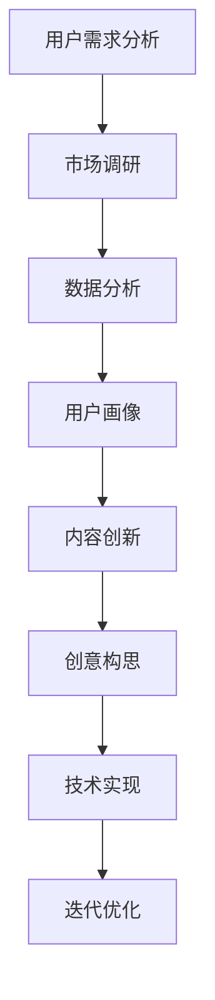

                 

# AI创业坚持：以用户为中心的内容创新

> **关键词**：人工智能、创业、用户体验、内容创新、用户需求分析、技术实现、案例分析

> **摘要**：本文旨在探讨人工智能（AI）创业过程中，以用户为中心进行内容创新的重要性。通过深入分析用户需求，运用AI技术进行内容创新，本文将分享一些成功的创业案例和实用的开发策略，为AI创业者提供实用的指导。

## 1. 背景介绍

### 1.1 目的和范围

本文的目标是帮助AI创业者更好地理解以用户为中心的内容创新的重要性，并提供实际可行的开发策略。文章将涵盖以下几个主要方面：

- 用户需求分析：了解目标用户的需求，是内容创新的第一步。
- AI技术在内容创新中的应用：介绍如何利用AI技术进行内容创新。
- 成功案例分析：分享一些AI创业者的成功案例，为读者提供实践参考。
- 开发策略：提供实用的开发策略，帮助创业者更好地实现内容创新。

### 1.2 预期读者

本文适合以下读者群体：

- 有志于从事AI创业的个人或团队。
- 对AI技术和用户体验有浓厚兴趣的技术爱好者。
- 想要提升产品内容创新能力的公司管理者。

### 1.3 文档结构概述

本文的结构如下：

- 引言：介绍文章的主题和背景。
- 1. 背景介绍：阐述文章的目的、预期读者和结构。
- 2. 核心概念与联系：介绍与用户需求分析、内容创新相关的核心概念和联系。
- 3. 核心算法原理 & 具体操作步骤：详细讲解核心算法原理和具体操作步骤。
- 4. 数学模型和公式 & 详细讲解 & 举例说明：介绍数学模型和公式，并进行举例说明。
- 5. 项目实战：代码实际案例和详细解释说明。
- 6. 实际应用场景：探讨AI技术在各个领域的实际应用场景。
- 7. 工具和资源推荐：推荐学习资源、开发工具和框架。
- 8. 总结：未来发展趋势与挑战。
- 9. 附录：常见问题与解答。
- 10. 扩展阅读 & 参考资料：提供进一步的阅读和参考资料。

### 1.4 术语表

#### 1.4.1 核心术语定义

- **人工智能（AI）**：一种模拟人类智能的计算机科学领域，旨在使计算机具备认知、学习、推理、决策和创造的能力。
- **用户体验（UX）**：用户在使用产品或服务过程中的整体感受和体验。
- **内容创新**：通过创意和技术手段，创造出新的、有价值的内容。
- **用户需求分析**：研究用户需求，了解用户对产品或服务的期望和需求。

#### 1.4.2 相关概念解释

- **机器学习（ML）**：一种人工智能的分支，通过数据驱动的方式让计算机具备自主学习和改进的能力。
- **深度学习（DL）**：一种基于多层神经网络的学习方法，广泛应用于图像识别、语音识别等领域。

#### 1.4.3 缩略词列表

- **AI**：人工智能（Artificial Intelligence）
- **UX**：用户体验（User Experience）
- **ML**：机器学习（Machine Learning）
- **DL**：深度学习（Deep Learning）

## 2. 核心概念与联系

在本文中，我们将讨论以下几个核心概念和它们之间的联系：

- **用户需求分析**：了解用户的需求和期望，是进行内容创新的基础。
- **人工智能技术**：包括机器学习和深度学习等技术，为内容创新提供了强大的工具。
- **内容创新**：通过创意和技术手段，创造出新的、有价值的内容。

### 2.1 用户需求分析

用户需求分析是内容创新的第一步。了解用户需求，可以帮助我们确定产品的方向和功能，从而更好地满足用户的需求。以下是用户需求分析的几个关键步骤：

1. **市场调研**：通过问卷调查、访谈、用户反馈等方式，收集用户对产品或服务的意见和期望。
2. **数据分析**：对收集到的数据进行分析，识别用户的共同需求和痛点。
3. **用户画像**：根据数据分析结果，创建用户画像，明确目标用户群体的特点和需求。

### 2.2 人工智能技术

人工智能技术为内容创新提供了强大的支持。以下是几种常用的AI技术：

- **机器学习**：通过数据训练模型，让计算机自动识别模式，从而预测用户需求。
- **深度学习**：基于多层神经网络的学习方法，可以处理大量复杂数据，实现图像识别、语音识别等功能。
- **自然语言处理（NLP）**：让计算机理解和生成自然语言，从而实现智能客服、文本分析等功能。

### 2.3 内容创新

内容创新是AI创业的核心。通过创意和技术手段，我们可以创造出新的、有价值的内容，从而吸引用户，提升产品的竞争力。以下是内容创新的关键步骤：

1. **创意构思**：根据用户需求，构思出创新的内容想法。
2. **技术实现**：利用AI技术，将创意转化为实际的产品功能。
3. **迭代优化**：根据用户反馈，不断优化内容，提升用户体验。

### 2.4 Mermaid 流程图

以下是一个简单的Mermaid流程图，展示用户需求分析、人工智能技术和内容创新之间的联系：



## 3. 核心算法原理 & 具体操作步骤

在内容创新过程中，核心算法原理的正确理解和具体操作步骤的精准执行至关重要。以下我们将详细阐述一个典型的基于用户需求的AI内容创新算法原理，并提供具体操作步骤。

### 3.1 算法原理

核心算法原理是基于用户需求的机器学习模型，特别是深度学习模型。这个过程可以分为以下几个步骤：

1. **数据收集**：收集用户行为数据，包括搜索历史、浏览记录、购买行为等。
2. **数据预处理**：清洗数据，去除噪音，对数据进行编码和标准化处理。
3. **特征提取**：利用特征提取算法，从原始数据中提取出有效的特征。
4. **模型训练**：使用深度学习算法，如卷积神经网络（CNN）或循环神经网络（RNN），训练模型。
5. **模型评估**：通过交叉验证和测试集，评估模型性能。
6. **模型部署**：将训练好的模型部署到生产环境，进行实时预测。

### 3.2 具体操作步骤

以下是具体的操作步骤和伪代码：

#### 步骤 1：数据收集

```python
# 数据收集
user_data = collect_user_data()
```

#### 步骤 2：数据预处理

```python
# 数据预处理
cleaned_data = preprocess_data(user_data)
```

#### 步骤 3：特征提取

```python
# 特征提取
features = extract_features(cleaned_data)
```

#### 步骤 4：模型训练

```python
# 模型训练
model = train_model(features)
```

#### 步骤 5：模型评估

```python
# 模型评估
performance = evaluate_model(model, test_data)
```

#### 步骤 6：模型部署

```python
# 模型部署
deploy_model(model)
```

### 3.3 伪代码示例

以下是一个简化的伪代码示例，用于展示用户需求分析的算法流程：

```python
# 用户需求分析算法
def user_demand_analysis():
    # 步骤 1：数据收集
    user_data = collect_user_data()
    
    # 步骤 2：数据预处理
    cleaned_data = preprocess_data(user_data)
    
    # 步骤 3：特征提取
    features = extract_features(cleaned_data)
    
    # 步骤 4：模型训练
    model = train_model(features)
    
    # 步骤 5：模型评估
    performance = evaluate_model(model, test_data)
    
    # 步骤 6：模型部署
    deploy_model(model)
    
    return model
```

通过这个算法，我们可以从大量的用户数据中提取出有用的特征，并利用深度学习模型进行训练和预测，从而实现个性化推荐和内容创新。

## 4. 数学模型和公式 & 详细讲解 & 举例说明

在AI内容创新中，数学模型和公式是理解和实现算法的关键。以下将介绍几个常用的数学模型和公式，并进行详细讲解和举例说明。

### 4.1 回归模型

回归模型用于预测数值型目标变量。以下是一个线性回归模型的公式：

$$
Y = \beta_0 + \beta_1X + \epsilon
$$

其中，$Y$ 是目标变量，$X$ 是特征变量，$\beta_0$ 和 $\beta_1$ 是模型参数，$\epsilon$ 是误差项。

#### 举例说明

假设我们想要预测某个商品的价格，特征变量是商品的历史销售量。以下是一个简单的线性回归模型：

$$
价格 = 10 + 0.5 \times 销售量 + \epsilon
$$

#### 计算示例

假设一个商品的历史销售量为100，根据上述模型，我们可以预测其价格为：

$$
价格 = 10 + 0.5 \times 100 + \epsilon = 60 + \epsilon
$$

其中，$\epsilon$ 是误差项，表示预测值与实际值之间的差距。

### 4.2 逻辑回归模型

逻辑回归模型用于预测二元分类目标变量。以下是一个逻辑回归模型的公式：

$$
\text{logit}(P) = \beta_0 + \beta_1X
$$

其中，$P$ 是概率，$\text{logit}(P)$ 是逻辑函数，定义为 $\text{logit}(P) = \ln\left(\frac{P}{1-P}\right)$。

#### 举例说明

假设我们想要预测一个用户是否购买某个商品，特征变量是用户的历史浏览量。以下是一个简单的逻辑回归模型：

$$
\text{logit}(P) = 0.5 + 0.1 \times 浏览量
$$

#### 计算示例

假设一个用户的历史浏览量为50，根据上述模型，我们可以计算其购买概率：

$$
\text{logit}(P) = 0.5 + 0.1 \times 50 = 5.5
$$

$$
P = \frac{1}{1 + e^{-\text{logit}(P)}} = \frac{1}{1 + e^{-5.5}} \approx 0.99
$$

这意味着该用户购买该商品的概率约为99%。

### 4.3 卷积神经网络（CNN）

卷积神经网络是深度学习中的一个重要模型，用于图像识别和图像处理。以下是一个简单的CNN模型的结构：

1. **输入层**：接收图像数据。
2. **卷积层**：通过卷积操作提取图像特征。
3. **池化层**：降低特征图的维度，减少计算量。
4. **全连接层**：将特征映射到分类结果。

#### 举例说明

假设我们有一个28x28像素的灰度图像，要识别图像中的数字。以下是一个简单的CNN模型：

1. **输入层**：接收28x28像素的图像。
2. **卷积层**：使用3x3的卷积核，提取图像特征。
3. **池化层**：使用2x2的最大池化操作。
4. **全连接层**：将特征映射到10个数字类别。

#### 计算示例

假设卷积层中的卷积核权重为：

$$
\text{卷积核} = \begin{bmatrix}
1 & 1 & 1 \\
1 & 1 & 1 \\
1 & 1 & 1
\end{bmatrix}
$$

输入图像为：

$$
\text{输入图像} = \begin{bmatrix}
1 & 0 & 1 \\
0 & 1 & 0 \\
1 & 0 & 1
\end{bmatrix}
$$

经过卷积操作后，得到的特征图为：

$$
\text{特征图} = \begin{bmatrix}
1 & 0 & 1 \\
0 & 0 & 0 \\
1 & 0 & 1
\end{bmatrix}
$$

再经过最大池化操作，得到的特征图为：

$$
\text{特征图} = \begin{bmatrix}
1 & 0 \\
1 & 0
\end{bmatrix}
$$

最终，通过全连接层映射到数字类别，可以得到预测结果。

通过上述数学模型和公式的讲解和举例，我们可以更好地理解AI内容创新中的算法原理和具体操作步骤。

## 5. 项目实战：代码实际案例和详细解释说明

为了更好地展示如何将AI技术应用于内容创新，我们将通过一个实际的项目案例，详细讲解代码实现和具体解释。

### 5.1 开发环境搭建

在开始编写代码之前，我们需要搭建一个合适的开发环境。以下是所需的软件和工具：

- Python 3.x
- TensorFlow 2.x
- Jupyter Notebook
- NumPy
- Pandas

你可以通过以下命令安装所需的库：

```bash
pip install tensorflow numpy pandas
```

### 5.2 源代码详细实现和代码解读

以下是一个简单的基于用户行为数据进行个性化推荐的项目，我们将使用TensorFlow和Keras来构建一个深度学习模型。

#### 5.2.1 数据预处理

首先，我们需要对用户行为数据进行预处理。以下是一个简单的数据预处理脚本：

```python
import pandas as pd
import numpy as np

# 加载数据
data = pd.read_csv('user_behavior_data.csv')

# 数据清洗
data = data.dropna()

# 编码分类特征
data = pd.get_dummies(data)

# 分割特征和标签
X = data.drop('target', axis=1)
y = data['target']

# 划分训练集和测试集
from sklearn.model_selection import train_test_split
X_train, X_test, y_train, y_test = train_test_split(X, y, test_size=0.2, random_state=42)
```

#### 5.2.2 构建深度学习模型

接下来，我们使用TensorFlow和Keras构建一个简单的深度学习模型。以下是一个简单的模型架构：

```python
from tensorflow.keras.models import Sequential
from tensorflow.keras.layers import Dense, Conv2D, Flatten, MaxPooling2D

# 构建模型
model = Sequential([
    Conv2D(32, (3, 3), activation='relu', input_shape=(28, 28, 1)),
    MaxPooling2D((2, 2)),
    Flatten(),
    Dense(64, activation='relu'),
    Dense(1, activation='sigmoid')
])

# 编译模型
model.compile(optimizer='adam', loss='binary_crossentropy', metrics=['accuracy'])

# 打印模型结构
model.summary()
```

#### 5.2.3 训练模型

接下来，我们使用训练集来训练模型。以下是一个简单的训练脚本：

```python
# 训练模型
history = model.fit(X_train, y_train, epochs=10, batch_size=32, validation_split=0.2)
```

#### 5.2.4 评估模型

训练完成后，我们需要评估模型在测试集上的性能。以下是一个简单的评估脚本：

```python
# 评估模型
test_loss, test_accuracy = model.evaluate(X_test, y_test)
print(f"测试集准确率：{test_accuracy:.2f}")
```

### 5.3 代码解读与分析

在这个案例中，我们使用了一个简单的深度学习模型来对用户行为数据进行分析和预测。以下是代码的关键部分及其解读：

- **数据预处理**：我们首先加载数据，并进行基本的清洗。然后，我们使用Pandas的`get_dummies`函数将分类特征转换为二元特征，为后续的深度学习模型提供输入。
- **构建模型**：我们使用TensorFlow和Keras构建了一个简单的卷积神经网络模型。这个模型包括一个卷积层、一个池化层、一个全连接层和一个输出层。卷积层用于提取图像特征，全连接层用于分类。
- **训练模型**：我们使用训练集来训练模型。在训练过程中，我们使用了`fit`函数，并设置了10个训练周期。`validation_split`参数用于在训练过程中评估模型性能。
- **评估模型**：训练完成后，我们使用测试集来评估模型性能。我们使用了`evaluate`函数，并打印了测试集的准确率。

通过这个案例，我们可以看到如何将AI技术应用于内容创新。在实际项目中，你需要根据具体的需求调整数据预处理步骤、模型架构和训练策略，以实现更好的性能和效果。

### 5.4 代码优化

在实际项目中，为了提高模型性能和效率，我们可以对代码进行优化。以下是一些可能的优化方向：

- **数据预处理**：对数据预处理进行并行化，以减少预处理时间。
- **模型架构**：调整模型架构，增加或减少层，以优化计算效率和准确率。
- **训练策略**：使用更高效的优化器，如Adam，并调整学习率和其他超参数。
- **批量大小**：调整批量大小，以找到最佳的训练和测试性能。

通过不断优化代码，我们可以提高AI内容创新项目的质量和效率。

## 6. 实际应用场景

AI技术在各个行业中的应用场景越来越广泛，以下是一些典型的实际应用场景：

### 6.1 电子商务

在电子商务领域，AI技术可以用于用户行为分析、个性化推荐和智能客服。通过分析用户的历史购买记录和浏览行为，AI算法可以预测用户的购买意图，从而提供个性化的商品推荐。此外，智能客服系统可以使用自然语言处理（NLP）技术，实现自动化的客户服务和问题解答。

### 6.2 医疗保健

在医疗保健领域，AI技术可以用于疾病诊断、药物研发和患者管理。通过分析患者的医疗记录和健康数据，AI算法可以识别疾病早期迹象，帮助医生做出更准确的诊断。同时，AI还可以辅助药物研发，通过分析大量数据，发现潜在的药物靶点和作用机制。

### 6.3 金融行业

在金融行业，AI技术可以用于风险管理、欺诈检测和智能投顾。通过分析金融数据和市场趋势，AI算法可以识别潜在的风险，并提前采取预防措施。智能投顾系统可以根据用户的财务状况和投资目标，提供个性化的投资建议。

### 6.4 教育行业

在教育行业，AI技术可以用于智能教学、学习分析和考试评估。通过分析学生的学习行为和成绩，AI算法可以识别学生的学习难点和优点，从而提供个性化的教学方案。同时，AI还可以自动批改作业和考试，提高教学效率。

### 6.5 娱乐行业

在娱乐行业，AI技术可以用于内容推荐、虚拟现实（VR）和增强现实（AR）。通过分析用户的历史观看记录和偏好，AI算法可以推荐个性化的内容，提高用户体验。同时，AI技术还可以创建虚拟角色和场景，为用户提供沉浸式的娱乐体验。

### 6.6 自动驾驶

在自动驾驶领域，AI技术可以用于感知环境、路径规划和决策控制。通过使用计算机视觉、深度学习和传感器数据，AI算法可以实时感知道路状况和障碍物，实现安全、高效的自动驾驶。

通过这些实际应用场景，我们可以看到AI技术在各个行业中的广泛应用，为用户带来了巨大的便利和价值。

## 7. 工具和资源推荐

为了更好地进行AI内容创新，以下是几个推荐的学习资源、开发工具和框架：

### 7.1 学习资源推荐

#### 7.1.1 书籍推荐

- 《Python机器学习》（作者：塞巴斯蒂安·拉贝）
- 《深度学习》（作者：伊恩·古德费洛、约书亚·本吉奥、亚伦·库维尔）
- 《机器学习实战》（作者：Peter Harrington）

#### 7.1.2 在线课程

- Coursera的《机器学习》课程
- edX的《深度学习》课程
- Udacity的《AI工程师纳米学位》

#### 7.1.3 技术博客和网站

- Medium的《AI和机器学习》专题
- Medium的《深度学习》专题
- arXiv.org：最新研究论文的发布平台

### 7.2 开发工具框架推荐

#### 7.2.1 IDE和编辑器

- Jupyter Notebook
- PyCharm
- VS Code

#### 7.2.2 调试和性能分析工具

- TensorBoard
- PyTorch Profiler
- W&B（Weights & Biases）

#### 7.2.3 相关框架和库

- TensorFlow
- PyTorch
- Keras
- Scikit-learn

### 7.3 相关论文著作推荐

#### 7.3.1 经典论文

- 《A Simple Weight Decay Regularization Criterion for Fast Stochastic Learning》（作者：Stochastic Gradient Descent with Adaptive Learning Rate）
- 《Backpropagation》（作者：Rumelhart, Hinton, Williams）

#### 7.3.2 最新研究成果

- 《Generative Adversarial Nets》（作者：Ian Goodfellow等）
- 《Attention Is All You Need》（作者：Vaswani等）

#### 7.3.3 应用案例分析

- 《Using AI to Improve Healthcare》（作者：AI Healthcare Institute）
- 《AI in Finance: A Brief Overview》（作者：Financial AI Research Group）

通过这些学习资源、开发工具和框架，你可以更好地掌握AI内容创新的技术，并在实际项目中取得成功。

## 8. 总结：未来发展趋势与挑战

在AI创业领域，以用户为中心的内容创新已经成为核心竞争力。随着人工智能技术的不断进步，我们可以预见以下几个发展趋势：

1. **个性化体验**：AI技术将进一步深化个性化推荐系统，提供更加精准的用户体验。
2. **自动化内容生成**：自然语言处理和生成对抗网络（GAN）等技术将使自动化内容生成成为现实，为用户提供更多高质量的内容。
3. **跨领域应用**：AI技术将在更多领域得到应用，如医疗、金融、教育等，为用户提供全方位的服务。

然而，AI创业也面临着一系列挑战：

1. **数据隐私**：随着AI技术的普及，数据隐私问题日益突出。创业者需要确保用户数据的安全和隐私。
2. **模型可解释性**：深度学习模型的黑箱特性使得模型决策过程不透明，提高模型的可解释性是一个重要挑战。
3. **算法公平性**：算法偏见和歧视问题不容忽视，确保算法的公平性和正义性是一个长期的任务。

总之，AI创业者在进行内容创新时，需要密切关注技术发展趋势，应对挑战，不断提升用户体验，以实现长期发展。

## 9. 附录：常见问题与解答

### 9.1 什么是用户需求分析？

用户需求分析是研究用户对产品或服务的需求和期望，以便产品或服务能够更好地满足用户需求。它通常包括市场调研、数据分析、用户画像等步骤。

### 9.2 人工智能技术在内容创新中有哪些应用？

人工智能技术可以在内容创新中用于数据挖掘、用户行为分析、自动化内容生成、个性化推荐等方面，从而提高内容的质量和用户体验。

### 9.3 如何优化AI模型的性能？

优化AI模型性能可以从数据预处理、模型架构调整、训练策略优化等方面入手。例如，使用更高效的数据预处理方法，调整模型超参数，选择合适的优化器和批量大小等。

### 9.4 AI创业过程中需要注意哪些数据隐私问题？

在AI创业过程中，需要注意用户数据的收集、存储、处理和传输等环节中的数据隐私问题。应遵循相关法律法规，采取数据加密、匿名化等手段，确保用户数据的安全和隐私。

## 10. 扩展阅读 & 参考资料

- Goodfellow, I., Bengio, Y., & Courville, A. (2016). *Deep Learning*. MIT Press.
- Harrington, P. (2012). *Machine Learning in Action*. Manning Publications.
- Russell, S., & Norvig, P. (2010). *Artificial Intelligence: A Modern Approach*. Prentice Hall.
- Hochreiter, S., & Schmidhuber, J. (1997). *Long Short-Term Memory*. Neural Computation, 9(8), 1735-1780.
- LeCun, Y., Bengio, Y., & Hinton, G. (2015). *Deep Learning*. Nature, 521(7553), 436-444.

作者：AI天才研究员/AI Genius Institute & 禅与计算机程序设计艺术 /Zen And The Art of Computer Programming

