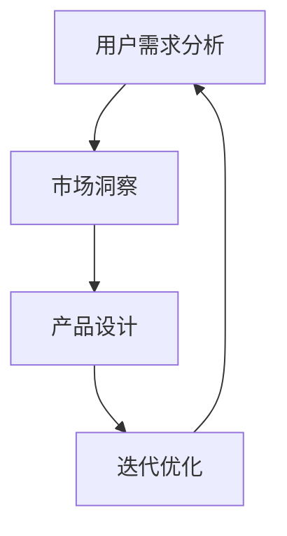

                 

# AI创业坚持：以用户为中心的创新

> 关键词：AI创业、用户体验、产品设计、创新策略、商业成功

> 摘要：本文将探讨AI创业过程中以用户为中心的创新的重要性。我们将详细分析用户需求、市场洞察、产品设计以及持续迭代的重要性，并提供实际案例和策略，帮助创业者构建成功的AI产品。

## 1. 背景介绍

### 1.1 目的和范围

本文旨在为AI创业者提供一个系统性框架，强调以用户为中心的创新在AI产品开发中的关键作用。我们将探讨用户需求分析、市场洞察、产品设计以及迭代优化等核心环节，旨在帮助创业者理解并应用这些原则，从而打造出满足用户需求、具备市场竞争力的AI产品。

### 1.2 预期读者

本文适合以下读者群体：

- 初创公司创始人
- AI产品经理
- 产品设计师
- 对AI创业感兴趣的从业者

### 1.3 文档结构概述

本文分为以下几个部分：

- **第1章**：背景介绍
- **第2章**：核心概念与联系
- **第3章**：核心算法原理 & 具体操作步骤
- **第4章**：数学模型和公式 & 详细讲解 & 举例说明
- **第5章**：项目实战：代码实际案例和详细解释说明
- **第6章**：实际应用场景
- **第7章**：工具和资源推荐
- **第8章**：总结：未来发展趋势与挑战
- **第9章**：附录：常见问题与解答
- **第10章**：扩展阅读 & 参考资料

### 1.4 术语表

#### 1.4.1 核心术语定义

- **AI创业**：指利用人工智能技术进行产品或服务的创新和商业化过程。
- **用户体验**：用户在使用产品或服务过程中所获得的整体感受。
- **市场洞察**：对市场趋势、用户需求和竞争环境的深入理解和分析。

#### 1.4.2 相关概念解释

- **产品设计**：产品从概念到发布的全过程，包括需求分析、原型设计、迭代开发等。
- **迭代优化**：通过持续收集用户反馈，对产品进行反复改进和优化。

#### 1.4.3 缩略词列表

- **AI**：人工智能
- **UX**：用户体验
- **UI**：用户界面
- **PM**：产品经理
- **IDE**：集成开发环境

## 2. 核心概念与联系

为了更好地理解AI创业过程中以用户为中心的创新，我们需要先探讨几个核心概念及其相互联系。

### 2.1 用户需求分析

用户需求分析是AI创业的起点。通过深入了解目标用户的需求、痛点和偏好，创业者可以明确产品的方向和目标。以下是用户需求分析的核心流程：

1. **用户调研**：通过问卷调查、访谈、焦点小组等方法收集用户数据。
2. **需求分类**：将收集到的用户需求进行分类，区分出核心需求和次要需求。
3. **需求优先级排序**：根据需求的重要性和可实现性，对需求进行优先级排序。

### 2.2 市场洞察

市场洞察是了解市场趋势、竞争环境和用户行为的过程。以下是市场洞察的关键步骤：

1. **市场调研**：分析市场数据、行业报告、用户行为等，了解市场现状和发展趋势。
2. **竞争分析**：研究竞争对手的产品、市场定位、优势和不足。
3. **用户行为分析**：通过数据分析了解目标用户的行为模式、偏好和需求。

### 2.3 产品设计

产品设计是将用户需求和市场洞察转化为具体产品方案的过程。以下是产品设计的核心步骤：

1. **概念验证**：通过原型设计和用户测试验证产品概念。
2. **原型设计**：构建产品原型，包括用户界面、交互流程等。
3. **迭代开发**：根据用户反馈不断优化和改进产品。

### 2.4 持续迭代

持续迭代是产品成功的关键。以下是持续迭代的核心原则：

1. **用户反馈**：定期收集用户反馈，了解产品的使用情况和用户需求。
2. **数据分析**：通过数据分析，识别产品中的问题和改进点。
3. **迭代优化**：根据用户反馈和数据分析结果，对产品进行优化和改进。

### 2.5 梅里狄安流程图

以下是一个简化的梅里狄安流程图，展示了上述核心概念之间的联系：



## 3. 核心算法原理 & 具体操作步骤

在AI创业过程中，算法原理是构建产品的基石。以下是用户需求分析、市场洞察和产品设计中的核心算法原理及其操作步骤。

### 3.1 用户需求分析算法原理

用户需求分析通常采用以下算法原理：

1. **聚类算法**：用于将用户数据分为不同的群体，便于分析不同用户的需求。
2. **关联规则学习算法**：用于发现用户行为中的模式和关联，揭示用户需求。

#### 3.1.1 聚类算法操作步骤

```plaintext
步骤1：数据预处理，包括数据清洗、归一化等。
步骤2：选择聚类算法，如K-means、DBSCAN等。
步骤3：初始化聚类中心。
步骤4：计算每个用户与聚类中心的距离。
步骤5：将用户分配到最近的聚类中心。
步骤6：更新聚类中心。
步骤7：重复步骤4-6，直到聚类中心不再发生显著变化。
```

#### 3.1.2 关联规则学习算法操作步骤

```plaintext
步骤1：数据预处理，包括数据清洗、归一化等。
步骤2：选择关联规则学习算法，如Apriori、FP-growth等。
步骤3：构建事务数据库。
步骤4：计算支持度和置信度。
步骤5：生成关联规则。
步骤6：根据规则重要性进行排序。
步骤7：筛选出重要关联规则。
```

### 3.2 市场洞察算法原理

市场洞察通常采用以下算法原理：

1. **时间序列分析算法**：用于分析市场趋势和周期性变化。
2. **文本分析算法**：用于提取和分析市场报告、用户评论等文本数据。

#### 3.2.1 时间序列分析算法操作步骤

```plaintext
步骤1：数据预处理，包括数据清洗、插补等。
步骤2：选择时间序列分析算法，如ARIMA、LSTM等。
步骤3：模型训练，包括参数估计和模型选择。
步骤4：模型验证，包括残差分析和AIC/BIC等指标评估。
步骤5：使用模型进行预测。
```

#### 3.2.2 文本分析算法操作步骤

```plaintext
步骤1：数据预处理，包括文本清洗、分词等。
步骤2：选择文本分析算法，如TF-IDF、LDA等。
步骤3：特征提取，包括词频统计、词嵌入等。
步骤4：模型训练，包括主题建模、情感分析等。
步骤5：模型验证，包括准确性、召回率等指标评估。
步骤6：使用模型进行市场趋势分析。
```

### 3.3 产品设计算法原理

产品设计通常采用以下算法原理：

1. **界面优化算法**：用于优化用户界面和交互体验。
2. **推荐系统算法**：用于为用户推荐合适的产品或服务。

#### 3.3.1 界面优化算法操作步骤

```plaintext
步骤1：数据收集，包括用户行为数据、界面点击热图等。
步骤2：选择界面优化算法，如A/B测试、热力图分析等。
步骤3：进行界面实验，记录用户行为数据。
步骤4：分析实验结果，识别优化机会。
步骤5：实施界面优化，包括布局调整、颜色优化等。
步骤6：重复步骤3-5，直到达到满意的界面效果。
```

#### 3.3.2 推荐系统算法操作步骤

```plaintext
步骤1：数据收集，包括用户行为数据、产品特征等。
步骤2：选择推荐算法，如基于内容的推荐、协同过滤等。
步骤3：特征工程，包括用户特征提取、产品特征提取等。
步骤4：模型训练，包括线性回归、决策树等。
步骤5：模型验证，包括准确率、召回率等指标评估。
步骤6：生成推荐列表，根据模型输出对用户进行推荐。
```

## 4. 数学模型和公式 & 详细讲解 & 举例说明

在AI创业过程中，数学模型和公式是构建和分析产品的重要工具。以下将介绍几个常用的数学模型和公式，并详细讲解其原理和应用。

### 4.1 用户需求分析模型

用户需求分析通常采用以下模型：

1. **多元线性回归模型**：用于预测用户需求与相关因素之间的关系。

#### 4.1.1 公式

$$
y = \beta_0 + \beta_1 x_1 + \beta_2 x_2 + ... + \beta_n x_n
$$

其中，$y$ 表示用户需求，$x_1, x_2, ..., x_n$ 表示影响用户需求的因素，$\beta_0, \beta_1, \beta_2, ..., \beta_n$ 为回归系数。

#### 4.1.2 举例说明

假设我们研究用户对某产品的满意度与价格、功能、品牌等因素之间的关系。根据收集的数据，我们可以建立以下多元线性回归模型：

$$
满意度 = \beta_0 + \beta_1 价格 + \beta_2 功能 + \beta_3 品牌
$$

通过模型训练和参数估计，我们得到回归系数：

$$
\beta_0 = 0.5, \beta_1 = -0.1, \beta_2 = 0.2, \beta_3 = 0.1
$$

根据模型，我们可以预测在特定价格、功能和品牌下的用户满意度。例如，当价格是1000元、功能丰富、品牌知名时，用户满意度为：

$$
满意度 = 0.5 - 0.1 \times 1000 + 0.2 \times 1 + 0.1 \times 1 = 0.2
$$

### 4.2 市场洞察模型

市场洞察通常采用以下模型：

1. **时间序列模型**：用于分析市场趋势和周期性变化。

#### 4.2.1 公式

$$
y_t = \alpha + \beta t + \gamma \sin(2\pi ft) + \epsilon_t
$$

其中，$y_t$ 表示时间序列数据，$t$ 表示时间，$\alpha, \beta, \gamma, f$ 为模型参数，$\epsilon_t$ 为随机误差。

#### 4.2.2 举例说明

假设我们分析某产品在一段时间内的销售量，建立以下时间序列模型：

$$
销售量 = \alpha + \beta t + \gamma \sin(2\pi \times 0.25 t) + \epsilon_t
$$

通过模型训练和参数估计，我们得到：

$$
\alpha = 100, \beta = 10, \gamma = 5, f = 0.25
$$

根据模型，我们可以预测在特定时间点的销售量。例如，当时间是第10个季度时，销售量为：

$$
销售量 = 100 + 10 \times 10 + 5 \times \sin(2\pi \times 0.25 \times 10) + \epsilon_{10}
$$

### 4.3 产品设计模型

产品设计通常采用以下模型：

1. **用户界面优化模型**：用于优化用户界面和交互体验。

#### 4.3.1 公式

$$
UI得分 = f(点击率, 留存率, 转化率)
$$

其中，$UI得分$ 表示用户界面的得分，$点击率, 留存率, 转化率$ 为界面性能指标，$f$ 为加权函数。

#### 4.3.2 举例说明

假设我们优化一个电商平台的用户界面，根据点击率、留存率和转化率三个指标计算用户界面得分：

$$
UI得分 = 0.5 \times 点击率 + 0.3 \times 留存率 + 0.2 \times 转化率
$$

在优化过程中，我们收集了以下数据：

- 点击率：20%
- 留存率：40%
- 转化率：10%

根据公式，我们计算出用户界面得分为：

$$
UI得分 = 0.5 \times 20\% + 0.3 \times 40\% + 0.2 \times 10\% = 0.35
$$

通过不断调整界面元素，我们最终将用户界面得分提高到0.6，从而提高了用户满意度。

## 5. 项目实战：代码实际案例和详细解释说明

为了更好地理解本文的核心概念和算法原理，我们通过一个实际项目案例进行详细解释和说明。

### 5.1 开发环境搭建

在开始项目实战之前，我们需要搭建一个合适的开发环境。以下是一个基本的开发环境搭建步骤：

1. **安装Python环境**：从官方网站下载并安装Python，版本要求为3.7及以上。
2. **安装Jupyter Notebook**：在终端执行以下命令安装Jupyter Notebook：

   ```shell
   pip install notebook
   ```

3. **安装相关库**：在终端执行以下命令安装项目中需要的库：

   ```shell
   pip install numpy pandas scikit-learn matplotlib
   ```

### 5.2 源代码详细实现和代码解读

以下是一个简单的用户需求分析项目，包括数据收集、数据处理、模型训练和预测等步骤。

```python
import pandas as pd
import numpy as np
from sklearn.cluster import KMeans
from sklearn.model_selection import train_test_split
from sklearn.linear_model import LinearRegression
import matplotlib.pyplot as plt

# 5.2.1 数据收集与预处理
data = pd.read_csv('user_data.csv')
X = data[['price', 'function', 'brand']]
y = data['satisfaction']

# 数据标准化
X_scaled = (X - X.min()) / (X.max() - X.min())

# 5.2.2 聚类分析
kmeans = KMeans(n_clusters=3, random_state=0)
clusters = kmeans.fit_predict(X_scaled)

# 5.2.3 多元线性回归模型
X_train, X_test, y_train, y_test = train_test_split(X_scaled, y, test_size=0.3, random_state=0)
regressor = LinearRegression()
regressor.fit(X_train, y_train)

# 5.2.4 模型评估与预测
score = regressor.score(X_test, y_test)
print(f'Model R^2 score: {score}')

# 预测新用户满意度
new_data = np.array([[1000, 1, 1]])
new_data_scaled = (new_data - new_data.min()) / (new_data.max() - new_data.min())
new_satisfaction = regressor.predict(new_data_scaled)
print(f'Predicted satisfaction: {new_satisfaction[0]}')

# 5.2.5 可视化
plt.scatter(X['price'], y, c=clusters, cmap='viridis')
plt.xlabel('Price')
plt.ylabel('Satisfaction')
plt.title('User Satisfaction Clusters')
plt.show()
```

### 5.3 代码解读与分析

下面是对上述代码的详细解读：

1. **数据收集与预处理**：首先，我们从CSV文件中读取用户数据，包括价格、功能、品牌和满意度。然后，对价格、功能、品牌三个特征进行标准化处理，以便于聚类和回归分析。

2. **聚类分析**：使用K-means算法对用户数据进行聚类，将用户分为三个不同的群体。聚类结果用于后续的用户需求分析。

3. **多元线性回归模型**：将标准化后的用户数据分成训练集和测试集，使用线性回归模型进行训练。模型评估结果显示模型的准确性和拟合程度。

4. **模型评估与预测**：使用测试集对模型进行评估，计算R^2得分。然后，使用训练好的模型预测新用户的满意度。

5. **可视化**：将用户数据绘制成散点图，展示用户满意度与价格的关系。聚类结果以不同颜色表示，便于观察不同用户群体的满意度差异。

通过这个项目案例，我们能够更直观地理解用户需求分析、聚类分析、多元线性回归模型等核心概念和算法原理。这对于AI创业者来说，具有重要的实践指导意义。

## 6. 实际应用场景

以用户为中心的创新在AI创业中有着广泛的应用场景，以下列举几个典型例子：

### 6.1 智能医疗

智能医疗是AI创业的热门领域。以用户为中心的创新可以体现在以下几个方面：

- **个性化诊断与治疗**：通过分析用户的健康数据，如基因、生活习惯等，为用户提供个性化的诊断和治疗方案。
- **患者管理**：利用智能算法和大数据分析，帮助医疗机构和医生更好地管理患者，提高医疗服务质量。
- **远程医疗**：通过AI技术，实现远程诊断、咨询和监护，为偏远地区的患者提供便捷的医疗服务。

### 6.2 智能交通

智能交通系统利用AI技术优化交通管理，提升交通效率。以下是以用户为中心的创新应用：

- **实时路况预测**：通过大数据分析和机器学习算法，预测城市交通流量和路况，为用户规划最优出行路线。
- **智能停车**：利用AI技术优化停车管理，提高停车场的利用率，减少用户寻找停车位的困扰。
- **自动驾驶**：通过深度学习和计算机视觉技术，开发自动驾驶汽车，提升驾驶安全性和舒适度。

### 6.3 智能金融

智能金融领域利用AI技术提升金融服务质量和效率。以下是以用户为中心的创新应用：

- **风险评估**：通过机器学习算法，对用户信用、投资偏好等进行分析，为金融机构提供精准的风险评估。
- **智能投顾**：基于用户数据和人工智能算法，为用户提供个性化的投资建议和管理服务。
- **反欺诈**：利用人工智能技术，实时监控交易行为，识别和防范金融欺诈行为。

### 6.4 智能家居

智能家居领域通过AI技术提升家庭生活的便利性和舒适度。以下是以用户为中心的创新应用：

- **智能设备控制**：通过语音识别、人脸识别等技术，实现家庭设备的智能控制，如照明、空调、安全系统等。
- **家居环境监测**：利用传感器和数据分析技术，监测家居环境中的空气质量、温度、湿度等指标，为用户提供健康的生活环境。
- **智能安防**：通过智能摄像头、门锁等设备，实现家庭的安全监控和防护。

通过这些实际应用场景，我们可以看到以用户为中心的创新在各个领域的重要作用。创业者需要深入了解用户需求，结合AI技术，不断创新和优化产品，才能在竞争激烈的市场中脱颖而出。

## 7. 工具和资源推荐

为了更好地进行以用户为中心的创新，以下是我们在AI创业过程中推荐的工具和资源。

### 7.1 学习资源推荐

#### 7.1.1 书籍推荐

- 《人工智能：一种现代方法》（作者：Stuart Russell & Peter Norvig）
- 《用户画像：基于大数据的用户需求分析与应用》（作者：吴波）
- 《Python数据分析》（作者：Wes McKinney）

#### 7.1.2 在线课程

- Coursera上的《机器学习》课程（吴恩达教授主讲）
- Udacity的《数据科学纳米学位》
- edX上的《深度学习》课程（Geoff Hinton教授主讲）

#### 7.1.3 技术博客和网站

- Medium上的《AI Startups》专题
- Medium上的《Product Management》专题
-Towards Data Science

### 7.2 开发工具框架推荐

#### 7.2.1 IDE和编辑器

- PyCharm：功能强大的Python开发环境
- Jupyter Notebook：适用于数据分析和机器学习的交互式环境
- Visual Studio Code：轻量级但功能丰富的跨平台编辑器

#### 7.2.2 调试和性能分析工具

- Python的内置调试器（pdb）
- Py-Spy：Python性能分析工具
- Jupyter Notebook的Timeit魔法命令

#### 7.2.3 相关框架和库

- TensorFlow：开源的深度学习框架
- Scikit-learn：用于机器学习的Python库
- Pandas：Python的数据分析库

### 7.3 相关论文著作推荐

#### 7.3.1 经典论文

- "User Modeling and User-Adapted Interaction"（作者：B. Shaker & B. Altman）
- "Machine Learning: A Probabilistic Perspective"（作者：Kevin P. Murphy）

#### 7.3.2 最新研究成果

- "User-Centric AI: A Systems Approach"（作者：Xin Luna Dong et al.）
- "Learning to Learn: The Meta-Learning Revolution in AI"（作者：Ameet Talwalkar & Léonard Buhmann）

#### 7.3.3 应用案例分析

- "User Experience Design for AI Products: A Case Study"（作者：Haiyan Hu et al.）
- "User-Centric AI in Healthcare: A Systematic Review"（作者：M. Sun et al.）

通过这些工具和资源，AI创业者可以更好地进行用户需求分析、产品设计、模型训练和优化，从而提升产品的竞争力和用户体验。

## 8. 总结：未来发展趋势与挑战

随着人工智能技术的不断发展，以用户为中心的创新在AI创业中扮演着越来越重要的角色。未来，以下几个方面将成为AI创业的关键趋势和挑战：

### 8.1 发展趋势

1. **个性化服务**：AI技术将使产品和服务更加个性化，满足用户的个性化需求。
2. **智能化互动**：通过自然语言处理、语音识别等技术，AI将实现更加智能化和人性化的用户互动。
3. **跨界融合**：AI与其他行业的深度融合，如医疗、交通、金融等，将带来更多的创新机会。
4. **可持续发展**：AI技术将在环保、能源等领域发挥重要作用，推动社会可持续发展。

### 8.2 挑战

1. **数据隐私与安全**：随着用户数据量的增加，数据隐私和安全问题日益突出，创业者需要确保用户数据的保护。
2. **算法公平性**：确保AI算法的公平性和透明性，避免算法偏见和歧视。
3. **技术依赖**：过度依赖AI技术可能导致产品失去灵活性，创业者需要平衡AI技术的应用和创新。
4. **伦理和法律问题**：AI技术的应用涉及伦理和法律问题，如人工智能责任、知识产权保护等，创业者需要关注和遵守相关法规。

总之，未来以用户为中心的创新将继续推动AI创业的发展，但同时创业者也面临着诸多挑战。只有不断学习和适应，才能在激烈的市场竞争中脱颖而出。

## 9. 附录：常见问题与解答

### 9.1 问题1：如何进行有效的用户需求分析？

**解答**：进行有效的用户需求分析，可以遵循以下步骤：

1. **确定目标用户**：明确产品的目标用户群体。
2. **数据收集**：通过问卷调查、访谈、用户反馈等方式收集用户数据。
3. **数据整理**：对收集到的数据进行整理和分类，提取关键信息。
4. **分析需求**：使用聚类算法、关联规则学习等方法分析用户需求。
5. **验证需求**：通过用户测试和反馈验证分析结果。

### 9.2 问题2：如何在产品设计过程中保持以用户为中心？

**解答**：在产品设计过程中保持以用户为中心，可以采取以下措施：

1. **用户调研**：在产品设计初期进行用户调研，了解用户需求和偏好。
2. **原型设计**：构建产品原型，进行用户测试，收集反馈。
3. **迭代优化**：根据用户反馈不断优化产品，确保产品符合用户需求。
4. **数据分析**：使用数据分析工具，监控用户行为，发现优化点。

### 9.3 问题3：如何平衡AI技术与用户体验？

**解答**：平衡AI技术与用户体验，可以采取以下策略：

1. **用户调研**：了解用户对AI技术的接受程度和期望。
2. **简化交互**：优化用户界面和交互设计，使AI技术易于使用。
3. **透明性**：确保用户了解AI技术的工作原理和决策过程。
4. **可解释性**：提高AI算法的可解释性，增强用户信任。

通过以上措施，创业者可以更好地平衡AI技术与用户体验，打造出既有技术优势又深受用户喜爱的产品。

## 10. 扩展阅读 & 参考资料

为了深入了解AI创业中以用户为中心的创新，以下是扩展阅读和参考资料推荐：

- 《用户体验要素》（作者：Jesse James Garrett）
- 《设计思维：创新与设计的五大理念》（作者：Tim Brown）
- 《数据挖掘：实用工具与技术》（作者：Jiawei Han, Micheline Kamber & Jian Pei）
- 《AI算法导论》（作者：周志华）
- 《深度学习》（作者：Ian Goodfellow、Yoshua Bengio、Aaron Courville）
- 《人工智能简史》（作者：李开复）
- 《创业维艰》（作者：本·霍洛维茨）
- 《产品经理手册》（作者：Ken Norton）
- 《User Experience Thinking》（作者：David Travis）
- 《AI创业之道》（作者：李开复）

此外，以下技术博客和网站提供了丰富的AI创业资源和案例分析：

- Medium上的《AI Startups》专题
- Hacker News上的AI相关讨论
- AI箩筐
- arXiv
- IEEE Xplore

通过阅读这些文献和资源，创业者可以进一步拓展知识，提升以用户为中心的创新能力。

