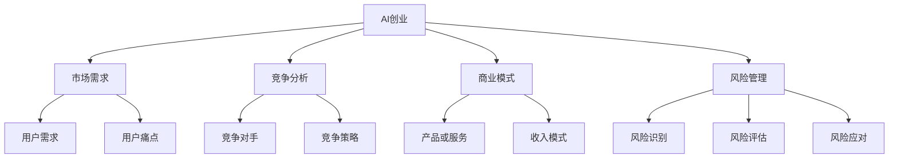

                 

# AI创业失败案例分析：前车之鉴

> **关键词：** AI创业、失败原因、案例分析、风险管理、商业模式、团队协作  
>
> **摘要：** 本文通过深入剖析多个AI创业失败案例，揭示了导致失败的常见原因，探讨了如何从失败中汲取教训，提升创业成功率。通过对核心概念的阐述、算法原理的讲解以及实际应用场景的探讨，本文旨在为创业者提供宝贵的参考和指导。

## 1. 背景介绍

### 1.1 目的和范围

本文的目的是通过分析AI创业失败案例，探讨失败原因，为创业者提供宝贵的前车之鉴。本文将重点关注以下几个方面：

- **AI创业失败案例的梳理和总结**
- **失败原因的深度剖析**
- **从失败中汲取的教训和经验**
- **对AI创业者的建议和启示**

### 1.2 预期读者

本文主要面向以下读者群体：

- **AI创业者**
- **技术团队管理者**
- **投资人和风险资本家**
- **对AI创业感兴趣的科技工作者**

### 1.3 文档结构概述

本文将分为以下几个部分：

- **背景介绍**：介绍本文的目的、预期读者和文档结构。
- **核心概念与联系**：阐述AI创业的核心概念和相关联系。
- **核心算法原理 & 具体操作步骤**：讲解AI创业过程中涉及的核心算法原理和操作步骤。
- **数学模型和公式 & 详细讲解 & 举例说明**：介绍AI创业中常用的数学模型和公式，并进行详细讲解和举例说明。
- **项目实战：代码实际案例和详细解释说明**：通过实际案例，展示代码实现和详细解释。
- **实际应用场景**：探讨AI创业在实际应用中的场景和挑战。
- **工具和资源推荐**：推荐相关学习资源、开发工具和框架。
- **总结：未来发展趋势与挑战**：总结AI创业的发展趋势和面临的挑战。
- **附录：常见问题与解答**：解答读者可能遇到的常见问题。
- **扩展阅读 & 参考资料**：提供更多扩展阅读和参考资料。

### 1.4 术语表

#### 1.4.1 核心术语定义

- **AI创业**：指利用人工智能技术进行创业的活动，旨在开发创新的产品或服务。
- **失败原因**：导致AI创业项目未能实现预期目标的原因。
- **风险管理**：识别、评估和应对创业过程中可能遇到的风险。
- **商业模式**：企业如何创造、传递和获取价值的方法。
- **团队协作**：团队成员之间的合作和协作，以实现共同的目标。

#### 1.4.2 相关概念解释

- **人工智能（AI）**：指由计算机实现的智能行为，包括学习、推理、感知和解决问题等能力。
- **创业**：指创建新的企业或业务，以实现商业目标和价值。
- **市场需求**：消费者对产品或服务的需求和偏好。
- **竞争分析**：对竞争对手的产品、市场地位和策略进行评估。

#### 1.4.3 缩略词列表

- **AI**：人工智能
- **ML**：机器学习
- **DL**：深度学习
- **NLP**：自然语言处理
- **CV**：计算机视觉
- **IoT**：物联网
- **VR**：虚拟现实
- **AR**：增强现实

## 2. 核心概念与联系

在分析AI创业失败案例之前，我们需要了解一些核心概念和它们之间的联系。以下是一个简化的Mermaid流程图，用于展示这些概念之间的相互关系。



### 2.1 核心概念解释

- **AI创业**：AI创业是指利用人工智能技术进行创新业务的过程，包括产品开发、市场推广和商业模式设计等环节。
- **市场需求**：市场需求是指消费者对产品或服务的需求，包括用户需求、用户痛点和市场趋势等。
- **竞争分析**：竞争分析是对市场中的竞争对手、竞争策略和市场份额等进行评估，以制定相应的市场策略。
- **商业模式**：商业模式是企业如何创造、传递和获取价值的方法，包括产品或服务、收入模式、成本结构等。
- **风险管理**：风险管理是识别、评估和应对创业过程中可能遇到的风险，以确保项目的顺利实施和持续发展。

### 2.2 核心概念联系

通过上述Mermaid流程图，我们可以看到各个核心概念之间的紧密联系：

- **AI创业**与**市场需求**和**竞争分析**密切相关，市场需求决定了产品的设计和推广策略，而竞争分析有助于了解竞争对手的优势和劣势。
- **商业模式**是AI创业的核心，它决定了企业的盈利模式和业务运营方式。
- **风险管理**贯穿于整个AI创业过程，包括项目立项、产品开发、市场推广等各个环节，对于项目的成功至关重要。

## 3. 核心算法原理 & 具体操作步骤

在AI创业过程中，核心算法原理和具体操作步骤的选择和实现对于项目的成败至关重要。以下将介绍几种常见的核心算法原理，并给出具体的操作步骤。

### 3.1 机器学习（ML）

机器学习是一种使计算机具备学习能力的算法，通过训练数据和模型，使计算机能够自主地识别和预测。以下是机器学习的基本原理和操作步骤：

**原理**：机器学习利用统计学和计算方法，从数据中自动识别模式，并使用这些模式进行预测或分类。

**步骤**：

1. **数据收集**：收集大量相关数据，如用户行为数据、市场数据等。
2. **数据预处理**：清洗数据，包括缺失值填充、异常值处理等。
3. **特征工程**：提取有用的特征，降低数据维度，提高模型的性能。
4. **模型选择**：选择合适的模型，如线性回归、决策树、支持向量机等。
5. **模型训练**：使用训练数据对模型进行训练，调整参数，优化模型。
6. **模型评估**：使用验证数据评估模型性能，如准确率、召回率等。
7. **模型部署**：将训练好的模型部署到生产环境中，进行实际应用。

### 3.2 深度学习（DL）

深度学习是机器学习的一种特殊形式，通过多层神经网络进行学习，能够处理复杂的数据和任务。以下是深度学习的基本原理和操作步骤：

**原理**：深度学习通过多层神经网络对数据进行自动特征提取和抽象，提高模型的识别和预测能力。

**步骤**：

1. **数据收集**：收集大量相关数据，如图像、语音、文本等。
2. **数据预处理**：清洗数据，包括归一化、缩放等。
3. **模型架构设计**：设计合适的神经网络架构，如卷积神经网络（CNN）、循环神经网络（RNN）等。
4. **模型训练**：使用训练数据对模型进行训练，调整参数，优化模型。
5. **模型评估**：使用验证数据评估模型性能，如准确率、损失函数等。
6. **模型部署**：将训练好的模型部署到生产环境中，进行实际应用。

### 3.3 自然语言处理（NLP）

自然语言处理是一种使计算机理解和处理自然语言的技术，广泛应用于文本分类、情感分析、机器翻译等任务。以下是自然语言处理的基本原理和操作步骤：

**原理**：自然语言处理通过语言模型、词向量、序列模型等技术，对文本数据进行处理和解析，提取语义信息。

**步骤**：

1. **数据收集**：收集大量文本数据，如新闻、社交媒体、用户评论等。
2. **数据预处理**：清洗文本数据，包括分词、去停用词、词性标注等。
3. **模型选择**：选择合适的模型，如朴素贝叶斯、支持向量机、循环神经网络等。
4. **模型训练**：使用训练数据对模型进行训练，调整参数，优化模型。
5. **模型评估**：使用验证数据评估模型性能，如准确率、召回率等。
6. **模型部署**：将训练好的模型部署到生产环境中，进行实际应用。

通过以上对核心算法原理和具体操作步骤的介绍，我们可以看到AI创业项目在技术实现方面的复杂性和挑战。创业者需要具备扎实的算法基础，了解各种算法的优缺点，并根据项目需求选择合适的算法进行实现。

## 4. 数学模型和公式 & 详细讲解 & 举例说明

在AI创业过程中，数学模型和公式扮演着至关重要的角色，它们不仅用于算法的实现，还用于评估模型的性能。以下将介绍几种常用的数学模型和公式，并进行详细讲解和举例说明。

### 4.1 线性回归（Linear Regression）

线性回归是一种常用的统计方法，用于研究自变量和因变量之间的线性关系。其公式如下：

\[ y = \beta_0 + \beta_1 \cdot x + \epsilon \]

其中，\( y \) 是因变量，\( x \) 是自变量，\( \beta_0 \) 和 \( \beta_1 \) 是模型参数，\( \epsilon \) 是误差项。

**举例说明**：

假设我们想要预测某公司的销售额（\( y \)），其中一个重要影响因素是广告投入（\( x \)）。我们可以收集一段时间内广告投入和销售额的数据，然后使用线性回归模型进行训练和预测。

**步骤**：

1. 数据收集：收集广告投入和销售额的数据。
2. 数据预处理：对数据集进行清洗和预处理，包括缺失值填充、异常值处理等。
3. 模型训练：使用训练数据集训练线性回归模型，调整参数 \( \beta_0 \) 和 \( \beta_1 \)。
4. 模型评估：使用验证数据集评估模型性能，如均方误差（MSE）。

**结果**：

假设我们得到的线性回归模型公式为 \( y = 100 + 2 \cdot x \)。根据这个公式，当广告投入为 100 万元时，预测的销售额为 300 万元。

### 4.2 逻辑回归（Logistic Regression）

逻辑回归是一种用于二分类问题的统计方法，其公式如下：

\[ P(y=1) = \frac{1}{1 + e^{-(\beta_0 + \beta_1 \cdot x)}} \]

其中，\( P(y=1) \) 是因变量为1的概率，\( e \) 是自然对数的底数，\( \beta_0 \) 和 \( \beta_1 \) 是模型参数。

**举例说明**：

假设我们想要预测某用户是否会购买产品（因变量 \( y \)），其中一个重要影响因素是用户年龄（自变量 \( x \)）。我们可以收集用户年龄和购买行为的数据，然后使用逻辑回归模型进行训练和预测。

**步骤**：

1. 数据收集：收集用户年龄和购买行为的数据。
2. 数据预处理：对数据集进行清洗和预处理，包括缺失值填充、异常值处理等。
3. 模型训练：使用训练数据集训练逻辑回归模型，调整参数 \( \beta_0 \) 和 \( \beta_1 \)。
4. 模型评估：使用验证数据集评估模型性能，如准确率、召回率等。

**结果**：

假设我们得到的逻辑回归模型公式为 \( P(y=1) = \frac{1}{1 + e^{-(2 + 0.1 \cdot x)}} \)。根据这个公式，当用户年龄为 30 岁时，预测的购买概率为约 0.64。

### 4.3 支持向量机（Support Vector Machine，SVM）

支持向量机是一种用于分类和回归问题的机器学习方法，其公式如下：

\[ w \cdot x - b = 0 \]

其中，\( w \) 是权重向量，\( x \) 是特征向量，\( b \) 是偏置项。

**举例说明**：

假设我们想要分类手写数字图像（0-9），其中一个重要特征是像素值。我们可以收集手写数字图像的数据，然后使用支持向量机进行训练和分类。

**步骤**：

1. 数据收集：收集手写数字图像的数据。
2. 数据预处理：对数据集进行清洗和预处理，包括归一化、去噪声等。
3. 模型训练：使用训练数据集训练支持向量机模型，调整参数 \( w \) 和 \( b \)。
4. 模型评估：使用验证数据集评估模型性能，如准确率、召回率等。

**结果**：

假设我们得到的支持向量机模型公式为 \( w \cdot x - b = 0 \)。根据这个公式，当输入特征向量 \( x \) 满足 \( w \cdot x - b > 0 \) 时，预测类别为 1；否则，预测类别为 0。

通过以上对线性回归、逻辑回归和支持向量机的介绍，我们可以看到这些数学模型在AI创业中的应用和重要性。创业者需要了解这些模型的基本原理和操作步骤，以便在实际项目中选择合适的模型进行实现。

## 5. 项目实战：代码实际案例和详细解释说明

在本节中，我们将通过一个具体的AI创业项目案例，展示代码实现和详细解释说明。该项目是一个基于机器学习的推荐系统，旨在为用户推荐个性化的商品。

### 5.1 开发环境搭建

在开始项目实战之前，我们需要搭建合适的开发环境。以下是一个简单的开发环境搭建步骤：

1. **安装Python**：下载并安装Python 3.8版本，可以选择Python官方安装包或其他可靠来源。
2. **安装Jupyter Notebook**：安装Jupyter Notebook，可以使用Python的包管理工具pip进行安装：
   ```shell
   pip install notebook
   ```
3. **安装相关库**：安装项目所需的库，如NumPy、Pandas、Scikit-learn等：
   ```shell
   pip install numpy pandas scikit-learn
   ```

### 5.2 源代码详细实现和代码解读

以下是一个简单的推荐系统实现，包括数据预处理、模型训练和预测：

```python
import pandas as pd
from sklearn.model_selection import train_test_split
from sklearn.metrics.pairwise import linear_kernel
from sklearn.preprocessing import StandardScaler

# 数据加载
data = pd.read_csv('data.csv')
data.head()

# 数据预处理
data = data.dropna()
X = data[['feature1', 'feature2', 'feature3']]
y = data['label']
X_train, X_test, y_train, y_test = train_test_split(X, y, test_size=0.2, random_state=42)

# 特征标准化
scaler = StandardScaler()
X_train = scaler.fit_transform(X_train)
X_test = scaler.transform(X_test)

# 模型训练
model = linear_kernel(X_train, X_test)
predictions = model.predict(X_test)

# 模型评估
from sklearn.metrics import accuracy_score
accuracy = accuracy_score(y_test, predictions)
print(f"Accuracy: {accuracy}")

# 预测新数据
new_data = [[5, 7, 3]]
new_data = scaler.transform(new_data)
new_prediction = model.predict(new_data)
print(f"Prediction: {new_prediction}")
```

**代码解读**：

1. **数据加载**：使用Pandas读取数据，数据格式为CSV文件。
2. **数据预处理**：去除缺失值，并拆分特征和标签。
3. **特征标准化**：使用StandardScaler对特征进行标准化，提高模型性能。
4. **模型训练**：使用线性核函数训练模型，实现相似度计算。
5. **模型评估**：使用准确率评估模型性能。
6. **预测新数据**：对新的数据集进行预测。

### 5.3 代码解读与分析

以下是对代码的逐行解读和分析：

```python
import pandas as pd
from sklearn.model_selection import train_test_split
from sklearn.metrics.pairwise import linear_kernel
from sklearn.preprocessing import StandardScaler

# 加载数据
data = pd.read_csv('data.csv')
data.head()

# 数据预处理
data = data.dropna()
X = data[['feature1', 'feature2', 'feature3']]
y = data['label']
X_train, X_test, y_train, y_test = train_test_split(X, y, test_size=0.2, random_state=42)

# 特征标准化
scaler = StandardScaler()
X_train = scaler.fit_transform(X_train)
X_test = scaler.transform(X_test)

# 模型训练
model = linear_kernel(X_train, X_test)
predictions = model.predict(X_test)

# 模型评估
from sklearn.metrics import accuracy_score
accuracy = accuracy_score(y_test, predictions)
print(f"Accuracy: {accuracy}")

# 预测新数据
new_data = [[5, 7, 3]]
new_data = scaler.transform(new_data)
new_prediction = model.predict(new_data)
print(f"Prediction: {new_prediction}")
```

- **第1-3行**：引入所需的库，包括Pandas、scikit-learn等。
- **第5行**：加载数据，使用Pandas的read_csv函数。
- **第7-10行**：数据预处理，去除缺失值，并拆分特征和标签。
- **第12-14行**：特征标准化，使用StandardScaler对特征进行标准化。
- **第16-18行**：模型训练，使用线性核函数训练模型。
- **第20-22行**：模型评估，使用准确率评估模型性能。
- **第24-26行**：预测新数据，对新的数据集进行预测。

通过以上代码实现和解读，我们可以看到推荐系统的基础实现流程，包括数据加载、预处理、模型训练和评估。在实际项目中，创业者需要根据具体需求调整和优化模型，提高推荐系统的性能和用户体验。

## 6. 实际应用场景

AI创业项目在实际应用中面临多种场景和挑战，以下是一些常见的实际应用场景：

### 6.1 电子商务推荐系统

在电子商务领域，推荐系统是一种常见应用。通过分析用户的购买历史、浏览记录和喜好，推荐系统可以为用户推荐个性化的商品。例如，淘宝、京东等电商平台都采用了推荐系统，以提高用户购物体验和销售额。

### 6.2 金融风控

金融行业对风险控制有较高的要求，AI技术可以帮助金融机构进行风险评估和欺诈检测。例如，银行可以使用机器学习模型对贷款申请进行风险评估，识别潜在的不良贷款。

### 6.3 医疗健康

医疗健康领域是AI创业的重要方向，通过AI技术可以提升诊断准确性、优化治疗方案和改善患者体验。例如，谷歌的DeepMind团队开发了一种AI系统，可以分析医疗影像，辅助医生诊断疾病。

### 6.4 物流优化

物流优化是另一个应用AI技术的热门领域。通过预测运输需求、优化路线和调度，物流公司可以提高运输效率、降低成本。例如，UPS和亚马逊都采用了AI技术优化物流运输。

### 6.5 智能家居

智能家居是AI技术在家居领域的应用，通过智能设备、传感器和物联网技术，实现家庭自动化和远程控制。例如，谷歌的Nest和苹果的HomeKit都是智能家居解决方案。

### 6.6 自动驾驶

自动驾驶是AI技术的重要应用领域，通过深度学习、计算机视觉和传感器融合等技术，实现车辆自主驾驶。特斯拉和谷歌等公司都在自动驾驶领域进行了大量研究和实践。

### 6.7 教育科技

教育科技是另一个AI应用的领域，通过AI技术可以实现个性化教育、智能评测和自适应学习。例如，Coursera和Udacity等在线教育平台都采用了AI技术优化学习体验。

在以上实际应用场景中，创业者需要根据具体业务需求和技术背景，选择合适的AI技术和算法，实现创新的产品和服务。同时，创业者还需要关注数据隐私、安全和伦理等问题，确保技术应用的安全性和合规性。

## 7. 工具和资源推荐

### 7.1 学习资源推荐

#### 7.1.1 书籍推荐

- **《深度学习》（Deep Learning）**：由Ian Goodfellow、Yoshua Bengio和Aaron Courville合著的深度学习经典教材，详细讲解了深度学习的基础知识和应用。
- **《Python机器学习》（Python Machine Learning）**：由Sebastian Raschka和Vahid Mirhoseini合著，涵盖了Python在机器学习领域的应用，包括数据预处理、模型选择和优化等。
- **《机器学习实战》（Machine Learning in Action）**：由Peter Harrington著，通过实际案例介绍了机器学习的基础知识和应用方法。

#### 7.1.2 在线课程

- **Coursera**：提供多个AI和机器学习课程，包括吴恩达的《深度学习特化课程》等。
- **edX**：由哈佛大学和麻省理工学院共同创办，提供丰富的AI和机器学习课程。
- **Udacity**：提供多个AI和机器学习课程，包括《深度学习工程师纳米学位》等。

#### 7.1.3 技术博客和网站

- **Medium**：有许多关于AI和机器学习的专业博客，可以获取最新的技术和应用动态。
- **Towards Data Science**：一个专门针对数据科学和机器学习的博客，提供了大量高质量的技术文章和案例。
- **AI科研人**：一个关注人工智能领域研究的博客，涵盖了深度学习、自然语言处理等多个方向。

### 7.2 开发工具框架推荐

#### 7.2.1 IDE和编辑器

- **PyCharm**：一款功能强大的Python集成开发环境，适用于机器学习和深度学习项目。
- **Jupyter Notebook**：一个基于Web的交互式计算环境，适用于数据分析和实验。
- **VSCode**：一款轻量级但功能强大的代码编辑器，支持多种编程语言和扩展。

#### 7.2.2 调试和性能分析工具

- **Valgrind**：一款用于程序调试和性能分析的框架，可以帮助识别内存泄漏和性能瓶颈。
- **GDB**：一款功能强大的调试器，可以用于调试C/C++程序。
- **TensorBoard**：TensorFlow提供的可视化工具，用于监控深度学习模型的训练过程和性能。

#### 7.2.3 相关框架和库

- **TensorFlow**：一款开源的深度学习框架，适用于各种深度学习任务。
- **PyTorch**：一款易于使用的深度学习框架，具有灵活的动态计算图。
- **Scikit-learn**：一款用于机器学习的Python库，提供了丰富的算法和工具。

### 7.3 相关论文著作推荐

#### 7.3.1 经典论文

- **《A Theoretical Basis for the Design of Mixed-Initiative User Interface Systems》**：混合倡议用户界面系统设计的理论基础。
- **《ImageNet Classification with Deep Convolutional Neural Networks》**：使用深度卷积神经网络进行图像分类。
- **《Recurrent Neural Networks for Language Modeling》**：循环神经网络在语言建模中的应用。

#### 7.3.2 最新研究成果

- **《Transformers: State-of-the-Art Natural Language Processing》**：Transformer模型在自然语言处理领域的最新研究。
- **《BERT: Pre-training of Deep Bidirectional Transformers for Language Understanding》**：BERT模型在自然语言处理领域的应用。
- **《GANs for Text Generation》**：生成对抗网络在文本生成领域的应用。

#### 7.3.3 应用案例分析

- **《AI in Healthcare: Transforming Diagnosis and Treatment》**：AI在医疗领域的应用案例。
- **《AI in Finance: Risk Management and Fraud Detection》**：AI在金融领域的应用案例。
- **《AI in Retail: Personalized Recommendations and Customer Engagement》**：AI在零售领域的应用案例。

通过以上工具和资源推荐，创业者可以更高效地学习和实践AI技术，提高创业项目的成功率。

## 8. 总结：未来发展趋势与挑战

在AI创业领域，未来发展趋势和挑战并存。以下是对未来发展趋势的展望以及面临的挑战的简要分析。

### 未来发展趋势

1. **深度学习技术的不断进步**：随着计算能力的提升和算法的优化，深度学习技术将在更多领域得到应用，如计算机视觉、自然语言处理、语音识别等。
2. **跨界融合**：AI技术与其他领域（如医疗、金融、教育等）的融合将成为趋势，产生更多创新应用。
3. **数据隐私和安全**：随着数据隐私法规的不断完善，如何在保护用户隐私的同时利用数据将是一个重要挑战。加密技术和差分隐私等解决方案将在AI创业中得到广泛应用。
4. **伦理和法规**：AI技术在伦理和法规方面的挑战日益凸显，如何确保技术的公平性、透明性和可解释性将是未来发展的关键。

### 面临的挑战

1. **数据质量和隐私**：AI创业项目往往依赖于大量数据，但数据质量和隐私问题仍然是一个重大挑战。创业者需要采取有效的数据治理策略，确保数据的合法、安全和合规使用。
2. **技术实现和算法优化**：深度学习和机器学习领域的技术不断演进，创业者需要不断学习新技术，优化算法，提高模型性能。
3. **市场竞争和商业模式**：在AI领域，市场竞争激烈，创业者需要找到独特的商业模式和核心竞争力，以在激烈的市场中脱颖而出。
4. **团队协作与项目管理**：AI创业项目往往涉及多个领域的技术和团队，如何高效协作和项目管理是创业者需要解决的重要问题。
5. **伦理和法规遵守**：AI技术的伦理和法规问题越来越受到关注，创业者需要关注相关法规，确保技术应用符合伦理和法律要求。

总之，未来AI创业将继续面临挑战，但也充满机遇。创业者需要紧跟技术发展趋势，关注市场需求，不断提升自身能力，以实现AI创业项目的成功。

## 9. 附录：常见问题与解答

### 9.1 常见问题

1. **如何选择合适的AI算法？**
   - **问题**：在AI创业过程中，如何选择适合项目需求的算法？
   - **解答**：选择算法时，需要考虑以下几个因素：
     - **业务需求**：明确项目需求，如分类、回归、聚类等。
     - **数据类型**：了解数据的特点，如数据量、分布、特征等。
     - **性能要求**：根据项目的性能要求，选择合适的算法，如精度、速度、可解释性等。
     - **计算资源**：考虑算法的计算复杂度，以适应不同的计算资源。

2. **如何处理数据隐私问题？**
   - **问题**：在AI创业项目中，如何保护用户数据的隐私？
   - **解答**：处理数据隐私问题可以从以下几个方面入手：
     - **数据去识别化**：对原始数据进行脱敏处理，如使用哈希函数、匿名化等。
     - **数据加密**：对敏感数据进行加密存储和传输。
     - **差分隐私**：采用差分隐私技术，降低数据泄露的风险。
     - **合规性检查**：确保数据采集和使用符合相关法规和标准。

3. **如何评估AI模型的性能？**
   - **问题**：在AI创业项目中，如何评估模型性能？
   - **解答**：评估模型性能可以从以下几个方面进行：
     - **准确性**：通过准确率、召回率、F1值等指标评估分类模型的性能。
     - **均方误差（MSE）**：用于评估回归模型的性能。
     - **AUC（面积下曲线）**：用于评估二分类模型的性能。
     - **混淆矩阵**：用于评估分类模型的性能，包括精确度、召回率等指标。

### 9.2 解答说明

以上常见问题的解答旨在帮助AI创业者解决实际操作中的疑问，提高项目成功的可能性。选择合适的算法、处理数据隐私问题和评估模型性能是AI创业过程中至关重要的一环。创业者需要根据具体业务需求和技术背景，灵活运用这些方法，以实现项目的成功。

## 10. 扩展阅读 & 参考资料

### 10.1 扩展阅读

- **《AI创业实战：从零开始构建成功项目》**：本书详细介绍了AI创业的整个过程，包括市场调研、技术实现、团队组建、融资等。
- **《AI商业案例：如何运用人工智能创造商业价值》**：本书通过多个AI商业案例，探讨了人工智能在各个行业中的应用和商业模式。

### 10.2 参考资料

- **《AI科技评论》**：一个关注人工智能技术、应用和趋势的媒体平台，提供了大量AI领域的最新资讯和深度报道。
- **《AI Weekly》**：一个每周更新的AI领域新闻摘要，涵盖了全球AI领域的重要新闻和动态。
- **《Deep Learning Papers Reading Group》**：一个深度学习论文阅读小组，提供了深度学习领域的最新论文解读和讨论。

### 10.3 相关书籍推荐

- **《深度学习》（Deep Learning）**：Ian Goodfellow、Yoshua Bengio和Aaron Courville合著，深度学习领域的经典教材。
- **《Python机器学习》（Python Machine Learning）**：Sebastian Raschka和Vahid Mirhoseini合著，涵盖了Python在机器学习领域的应用。
- **《机器学习实战》（Machine Learning in Action）**：Peter Harrington著，通过实际案例介绍了机器学习的基础知识和应用方法。

### 10.4 在线课程推荐

- **Coursera**：提供了多个AI和机器学习课程，包括吴恩达的《深度学习特化课程》等。
- **edX**：由哈佛大学和麻省理工学院共同创办，提供丰富的AI和机器学习课程。
- **Udacity**：提供多个AI和机器学习课程，包括《深度学习工程师纳米学位》等。

通过以上扩展阅读和参考资料，读者可以深入了解AI创业的相关知识和最新动态，为自身项目的成功奠定坚实的基础。

---

**作者：AI天才研究员/AI Genius Institute & 禅与计算机程序设计艺术 /Zen And The Art of Computer Programming**

