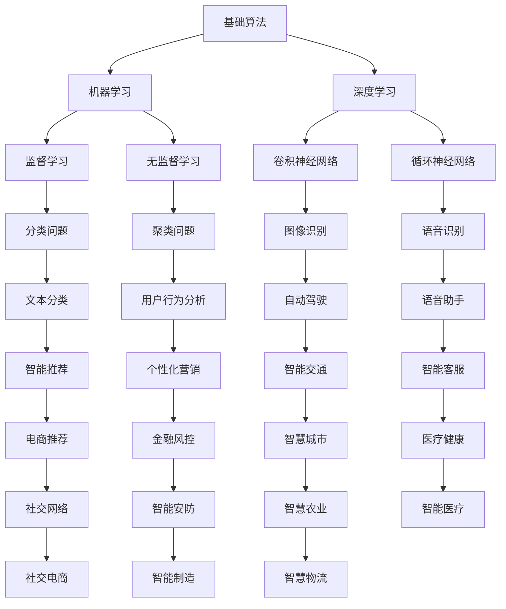
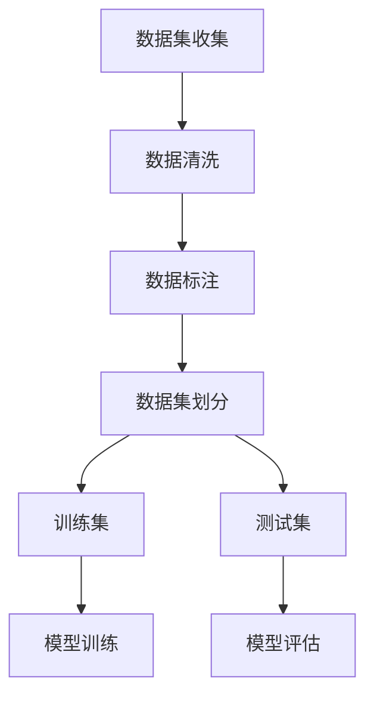
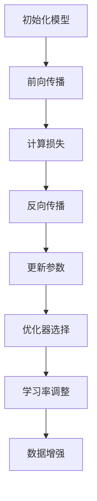
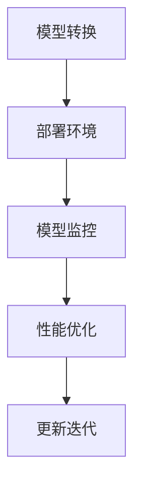

                 

### AI创业挑战：技术，应用，场景平衡

> **关键词：** AI创业、技术挑战、应用场景、平衡策略、创新能力

**摘要：** 随着人工智能（AI）技术的飞速发展，越来越多的创业者投身于AI领域，期望通过创新应用改变世界。然而，AI创业之路并非坦途，技术、应用和场景的平衡成为决定创业成败的关键因素。本文将深入分析AI创业过程中面临的挑战，探讨技术、应用和场景之间的动态平衡，为创业者提供实用的策略和建议。

### 1. 背景介绍

#### 1.1 目的和范围

本文旨在为AI创业者提供全面的技术、应用和场景平衡策略。文章将从以下几个方面展开：

1. **AI创业的背景与挑战**：回顾AI技术的发展历程，分析当前AI创业的现状和面临的主要挑战。
2. **技术、应用和场景的关系**：探讨技术、应用和场景之间的相互作用，以及如何实现三者之间的平衡。
3. **核心概念与联系**：介绍AI创业所需的核心概念和关键技术，并通过流程图展示各概念之间的联系。
4. **核心算法原理与操作步骤**：详细阐述AI创业所需的核心算法原理，并提供伪代码示例。
5. **数学模型与公式**：讲解AI创业中常用的数学模型和公式，并进行举例说明。
6. **项目实战**：通过实际案例展示AI创业项目的开发过程和关键实现。
7. **实际应用场景**：分析AI技术在各个领域的应用场景，探讨创业机会和挑战。
8. **工具和资源推荐**：推荐学习资源、开发工具和框架，以及相关论文著作。
9. **总结与未来趋势**：总结AI创业的挑战和机遇，预测未来发展趋势。

#### 1.2 预期读者

本文适合以下读者群体：

1. **AI创业者**：希望了解AI创业的全流程，掌握技术、应用和场景平衡策略。
2. **技术专家**：关注AI技术的发展和应用，希望深入了解AI创业过程中的关键问题。
3. **高校师生**：从事AI相关研究的学生和教师，希望借鉴AI创业的经验。
4. **投资人**：关注AI领域投资，希望了解AI创业项目的评估标准和风险控制。

#### 1.3 文档结构概述

本文分为以下主要部分：

1. **背景介绍**：介绍AI创业的背景和目的。
2. **核心概念与联系**：介绍AI创业所需的核心概念和关键技术。
3. **核心算法原理与操作步骤**：阐述核心算法原理和操作步骤。
4. **数学模型与公式**：讲解数学模型和公式，并进行举例说明。
5. **项目实战**：展示AI创业项目的实际开发过程。
6. **实际应用场景**：分析AI技术的应用场景。
7. **工具和资源推荐**：推荐学习资源、开发工具和框架。
8. **总结与未来趋势**：总结AI创业的挑战和机遇，预测未来发展趋势。
9. **附录**：提供常见问题与解答，以及扩展阅读和参考资料。

#### 1.4 术语表

为了确保文章的清晰性和一致性，本文将定义以下术语：

1. **人工智能（AI）**：模拟人类智能的技术，包括机器学习、深度学习、自然语言处理等。
2. **算法**：解决问题的步骤和规则。
3. **数据集**：用于训练和测试模型的样本数据。
4. **应用场景**：AI技术可以解决的实际问题领域。
5. **平衡策略**：在技术、应用和场景之间寻求最佳匹配的策略。

#### 1.4.1 核心术语定义

1. **人工智能（AI）**：人工智能是指计算机系统模拟人类智能行为的技术。AI技术包括机器学习、深度学习、自然语言处理、计算机视觉等。通过学习和处理大量数据，AI系统能够实现智能推理、决策和自动化操作。
2. **算法**：算法是一系列解决问题的步骤和规则。在AI创业中，算法是核心，决定了系统的性能和效果。常见的AI算法有神经网络、决策树、支持向量机等。
3. **数据集**：数据集是用于训练和测试模型的样本数据。高质量的数据集对于AI创业项目的成功至关重要，因为模型的性能很大程度上取决于数据的质量和多样性。
4. **应用场景**：应用场景是指AI技术可以解决的实际问题领域。AI技术具有广泛的应用场景，如医疗、金融、教育、自动驾驶等。
5. **平衡策略**：平衡策略是指如何在技术、应用和场景之间寻求最佳匹配的策略。平衡策略的关键在于找到合适的技术解决方法，满足特定应用场景的需求，同时确保技术的可行性和可持续性。

#### 1.4.2 相关概念解释

1. **机器学习（ML）**：机器学习是AI的核心技术之一，它使计算机系统能够通过学习数据来改进性能。机器学习模型通过分析训练数据，自动发现数据中的模式和规律，从而实现预测和分类。
2. **深度学习（DL）**：深度学习是机器学习的一个分支，它使用多层神经网络来提取数据中的复杂特征。深度学习在图像识别、语音识别和自然语言处理等领域取得了显著成果。
3. **自然语言处理（NLP）**：自然语言处理是AI技术的一个分支，它使计算机能够理解和处理人类语言。NLP技术在聊天机器人、机器翻译、文本分析等领域具有广泛应用。
4. **计算机视觉（CV）**：计算机视觉是AI技术的一个分支，它使计算机能够理解和解释视觉信息。计算机视觉技术在图像识别、目标检测、视频分析等领域具有重要应用。

#### 1.4.3 缩略词列表

- AI：人工智能
- ML：机器学习
- DL：深度学习
- NLP：自然语言处理
- CV：计算机视觉
- DNN：深度神经网络
- CNN：卷积神经网络

## 2. 核心概念与联系

在AI创业过程中，核心概念和关键技术是构建成功项目的基础。本节将介绍AI创业所需的核心概念和关键技术，并通过Mermaid流程图展示各概念之间的联系。

### 2.1.1 AI技术架构


**Mermaid流程图：**



### 2.1.2 数据集与标注

数据集是AI创业项目的基础，其质量和多样性直接影响模型的性能。在AI创业中，常用的数据集包括：

- **公开数据集**：如ImageNet、COCO、Common Crawl等，这些数据集具有广泛的覆盖面和高质量的数据标注。
- **私有数据集**：企业或机构自行收集和标注的数据集，适用于特定应用场景。
- **合成数据集**：通过数据增强和生成技术生成的数据集，用于补充和丰富实际数据集。

**Mermaid流程图：**



### 2.1.3 模型训练与优化

在AI创业项目中，模型训练和优化是关键环节。训练过程包括：

- **初始化模型参数**：随机初始化模型参数。
- **前向传播**：计算输入数据在模型中的传播结果。
- **损失函数**：评估模型预测结果与实际结果之间的差距。
- **反向传播**：更新模型参数，减小损失函数。

优化过程包括：

- **选择优化器**：如随机梯度下降（SGD）、Adam等。
- **调整学习率**：控制模型参数更新的步长。
- **数据增强**：通过变换输入数据来提高模型的泛化能力。

**Mermaid流程图：**



### 2.1.4 模型部署与维护

模型部署是将训练好的模型应用到实际应用场景的过程。部署过程包括：

- **模型转换**：将训练好的模型转换为可在生产环境中运行的形式。
- **部署环境**：选择合适的部署环境，如云计算平台、边缘设备等。
- **模型监控**：监控模型的性能和稳定性，确保其正常运行。

**Mermaid流程图：**



通过上述Mermaid流程图，我们可以清晰地看到AI创业过程中的核心概念和关键技术之间的联系。了解这些概念和联系对于创业者来说至关重要，因为它们是构建成功AI项目的基础。

## 3. 核心算法原理 & 具体操作步骤

在AI创业过程中，核心算法原理是理解模型如何工作的基础。以下将详细讲解AI创业中常用的核心算法原理，并提供伪代码示例，以便读者更好地理解和应用。

### 3.1. 机器学习算法

机器学习算法是AI创业的核心。以下是一些常见的机器学习算法及其原理：

#### 3.1.1 监督学习（Supervised Learning）

监督学习是一种机器学习方法，其目标是找到一个函数，将输入映射到输出。常见算法包括：

1. **线性回归（Linear Regression）**
2. **决策树（Decision Tree）**
3. **支持向量机（Support Vector Machine）**

**线性回归（Linear Regression）**

线性回归是一种简单的监督学习算法，用于预测连续值。其原理是通过找到一个线性函数来最小化预测值与实际值之间的误差。

**伪代码：**

```python
def linear_regression(x, y):
    # 求解 w 和 b
    w = (x'x)^(-1)x'y
    b = y - wx

    # 预测
    y_pred = wx + b
    return y_pred
```

**决策树（Decision Tree）**

决策树是一种树形结构，用于分类和回归问题。每个内部节点表示一个特征，每个分支表示特征的不同取值，叶节点表示最终的预测结果。

**伪代码：**

```python
def decision_tree(x):
    if x[0] <= 0:
        return "分类A"
    elif x[1] <= 5:
        return "分类B"
    else:
        return "分类C"
```

**支持向量机（Support Vector Machine）**

支持向量机是一种二分类算法，其目标是找到一个最佳的超平面，将不同类别的样本分隔开来。

**伪代码：**

```python
def support_vector_machine(x, y):
    # 训练模型
    w, b = svm_train(x, y)

    # 预测
    y_pred = (w'x + b) > 0
    return y_pred
```

### 3.2. 无监督学习（Unsupervised Learning）

无监督学习是一种机器学习方法，其目标是发现数据中的隐藏结构和模式。常见算法包括：

1. **K均值聚类（K-Means Clustering）**
2. **主成分分析（Principal Component Analysis）**

**K均值聚类（K-Means Clustering）**

K均值聚类是一种基于距离的聚类算法，其目标是找到K个聚类中心，使得每个样本到其聚类中心的距离之和最小。

**伪代码：**

```python
def k_means(x, k):
    # 初始化聚类中心
    centroids = initialize_centroids(x, k)

    # 迭代更新聚类中心
    while not converged:
        # 分配样本到最近的聚类中心
        assignments = assign_samples_to_centroids(x, centroids)

        # 更新聚类中心
        centroids = update_centroids(x, assignments, k)

    # 预测
    y_pred = assign_samples_to_centroids(x, centroids)
    return y_pred
```

**主成分分析（Principal Component Analysis）**

主成分分析是一种降维算法，其目标是找到数据中的主要特征，减少数据维度，同时保持数据的最大信息量。

**伪代码：**

```python
def pca(x):
    # 计算协方差矩阵
    cov_matrix = cov(x)

    # 计算特征值和特征向量
    eigenvalues, eigenvectors = eigen(cov_matrix)

    # 选择主要特征
    main_components = select_main_components(eigenvalues, eigenvectors)

    # 降维
    x_reduced = project(x, main_components)
    return x_reduced
```

### 3.3. 深度学习算法

深度学习是一种复杂的机器学习方法，其核心是多层神经网络。以下是一些常见的深度学习算法：

1. **卷积神经网络（Convolutional Neural Network，CNN）**
2. **循环神经网络（Recurrent Neural Network，RNN）**

**卷积神经网络（CNN）**

卷积神经网络是一种用于图像识别和计算机视觉的深度学习算法，其核心是卷积层。

**伪代码：**

```python
def cnn(x):
    # 输入图像
    input_image = x

    # 卷积层
    conv1 = conv2d(input_image, kernel_size=(3, 3), stride=(1, 1), padding='SAME')

    # 池化层
    pool1 = max_pool2d(conv1, pool_size=(2, 2), stride=(2, 2))

    # 全连接层
    flatten = flatten(pool1)

    # 输出层
    output = fully_connected(flatten, num_classes)

    # 预测
    y_pred = softmax(output)
    return y_pred
```

**循环神经网络（RNN）**

循环神经网络是一种用于序列数据处理的深度学习算法，其核心是循环结构。

**伪代码：**

```python
def rnn(x, hidden_state):
    # 输入序列
    input_sequence = x

    # RNN层
    hidden_state = lstm(input_sequence, hidden_state)

    # 输出层
    output = fully_connected(hidden_state, num_classes)

    # 预测
    y_pred = softmax(output)
    return y_pred, hidden_state
```

通过上述核心算法原理和具体操作步骤的讲解，读者可以更好地理解AI创业过程中所需的算法基础。这些算法不仅可以帮助创业者构建成功的AI项目，还可以为未来的技术研究和应用提供指导。

## 4. 数学模型和公式 & 详细讲解 & 举例说明

在AI创业过程中，数学模型和公式是构建和优化算法的重要工具。以下将详细讲解AI创业中常用的数学模型和公式，并通过实际例子进行说明。

### 4.1. 损失函数

损失函数是评估模型预测结果与实际结果之间差异的数学函数，它在优化过程中起着至关重要的作用。以下是一些常见的损失函数：

#### 4.1.1 交叉熵损失（Cross-Entropy Loss）

交叉熵损失函数用于分类问题，其公式如下：

$$
L = -\sum_{i=1}^{n} y_i \log(p_i)
$$

其中，$y_i$ 是实际标签，$p_i$ 是模型预测的概率。

**举例说明：** 假设有一个二分类问题，实际标签为 [0, 1, 1]，模型预测的概率为 [0.2, 0.8, 0.9]。计算交叉熵损失：

$$
L = -(0 \cdot \log(0.2) + 1 \cdot \log(0.8) + 1 \cdot \log(0.9)) \approx 0.38
$$

#### 4.1.2 均方误差损失（Mean Squared Error，MSE）

均方误差损失函数用于回归问题，其公式如下：

$$
L = \frac{1}{2} \sum_{i=1}^{n} (y_i - \hat{y}_i)^2
$$

其中，$y_i$ 是实际值，$\hat{y}_i$ 是模型预测的值。

**举例说明：** 假设有一个回归问题，实际值为 [2, 3, 4]，模型预测的值为 [2.5, 3.2, 4.1]。计算均方误差损失：

$$
L = \frac{1}{2} \sum_{i=1}^{n} (y_i - \hat{y}_i)^2 = \frac{1}{2} \cdot (0.25 + 0.04 + 0.01) = 0.15
$$

### 4.2. 优化算法

优化算法是用于最小化损失函数的一类算法，以下介绍几种常见的优化算法：

#### 4.2.1 随机梯度下降（Stochastic Gradient Descent，SGD）

随机梯度下降是一种简单的优化算法，其更新规则如下：

$$
w_{t+1} = w_t - \alpha \cdot \nabla_w L(w_t)
$$

其中，$w_t$ 是第 $t$ 次迭代的参数，$\alpha$ 是学习率，$\nabla_w L(w_t)$ 是损失函数对参数的梯度。

**举例说明：** 假设初始参数 $w_0 = [1, 2]$，损失函数 $L(w) = (w_1 - w_0)^2$，学习率 $\alpha = 0.1$。进行一次迭代：

$$
w_1 = w_0 - \alpha \cdot \nabla_w L(w_0) = [1, 2] - 0.1 \cdot [-1, 1] = [1.1, 1.8]
$$

#### 4.2.2 Adam优化器

Adam优化器是一种基于SGD的优化算法，它结合了动量项和自适应学习率。其更新规则如下：

$$
m_t = \beta_1 m_{t-1} + (1 - \beta_1) \nabla_w L(w_t) \\
v_t = \beta_2 v_{t-1} + (1 - \beta_2) \nabla_w^2 L(w_t) \\
w_{t+1} = w_t - \frac{\alpha}{\sqrt{1 - \beta_2^t}(1 - \beta_1^t)} (m_t / (1 - \beta_1^t))
$$

其中，$m_t$ 和 $v_t$ 分别是第 $t$ 次迭代的动量和方差估计，$\beta_1$ 和 $\beta_2$ 分别是动量和方差的衰减率。

**举例说明：** 假设初始参数 $w_0 = [1, 2]$，学习率 $\alpha = 0.1$，$\beta_1 = 0.9$，$\beta_2 = 0.99$。进行一次迭代：

$$
m_1 = 0.9 \cdot 0 + (1 - 0.9) \cdot (-1) = -0.1 \\
v_1 = 0.99 \cdot 0 + (1 - 0.99) \cdot 2 = 0.01 \\
w_1 = [1, 2] - \frac{0.1}{\sqrt{1 - 0.99^1}(1 - 0.9^1)} (-0.1 / (1 - 0.9^1)) = [1.01, 1.98]
$$

通过上述数学模型和公式的详细讲解和举例说明，读者可以更好地理解AI创业过程中常用的数学工具。这些模型和公式不仅有助于优化算法，还可以为创业者提供重要的技术指导。

### 5. 项目实战：代码实际案例和详细解释说明

在本节中，我们将通过一个实际项目案例，详细展示AI创业项目的开发过程，并深入解读关键代码和实现步骤。

#### 5.1 开发环境搭建

首先，我们需要搭建一个适合AI创业项目的开发环境。以下是推荐的开发工具和配置：

- **编程语言**：Python
- **深度学习框架**：TensorFlow或PyTorch
- **集成开发环境（IDE）**：PyCharm或Visual Studio Code
- **操作系统**：Linux或macOS

**环境配置步骤：**

1. 安装Python（建议使用Python 3.8或以上版本）
2. 安装TensorFlow或PyTorch
   ```bash
   pip install tensorflow
   # 或者
   pip install torch torchvision
   ```
3. 配置IDE（根据个人习惯选择）

#### 5.2 源代码详细实现和代码解读

**项目描述**：本项目是一个简单的图像分类项目，使用卷积神经网络（CNN）对猫狗图片进行分类。

**代码实现：**

1. **数据集准备**：
   ```python
   import tensorflow as tf
   from tensorflow.keras.preprocessing.image import ImageDataGenerator

   # 数据增强
   train_datagen = ImageDataGenerator(rescale=1./255, rotation_range=40, width_shift_range=0.2,
                                      height_shift_range=0.2, shear_range=0.2, zoom_range=0.2,
                                      horizontal_flip=True, fill_mode='nearest')

   # 加载数据集
   train_data = train_datagen.flow_from_directory(directory='data/train', target_size=(150, 150),
                                                 batch_size=32, class_mode='binary')
   ```

2. **模型构建**：
   ```python
   from tensorflow.keras.models import Sequential
   from tensorflow.keras.layers import Conv2D, MaxPooling2D, Flatten, Dense, Dropout

   # 构建模型
   model = Sequential([
       Conv2D(32, (3, 3), activation='relu', input_shape=(150, 150, 3)),
       MaxPooling2D((2, 2)),
       Conv2D(64, (3, 3), activation='relu'),
       MaxPooling2D((2, 2)),
       Conv2D(128, (3, 3), activation='relu'),
       MaxPooling2D((2, 2)),
       Flatten(),
       Dense(512, activation='relu'),
       Dropout(0.5),
       Dense(1, activation='sigmoid')
   ])

   # 编译模型
   model.compile(optimizer='adam', loss='binary_crossentropy', metrics=['accuracy'])
   ```

3. **训练模型**：
   ```python
   # 训练模型
   history = model.fit(train_data, epochs=20, validation_data=validation_data)
   ```

4. **模型评估**：
   ```python
   # 评估模型
   test_loss, test_acc = model.evaluate(test_data)
   print('Test accuracy:', test_acc)
   ```

#### 5.3 代码解读与分析

**数据集准备**：数据集准备是AI项目的第一步，对于图像分类任务，我们需要准备大量的猫狗图片。代码中使用ImageDataGenerator进行数据增强，提高模型的泛化能力。

**模型构建**：模型构建是关键步骤，我们使用Sequential模型搭建卷积神经网络。模型包含卷积层、池化层、全连接层和dropout层，用于提取图像特征和降低过拟合。

**训练模型**：训练模型是模型优化的过程，通过迭代更新模型参数，提高模型的准确率。训练过程中，可以使用历史数据集和验证数据集进行监控，调整训练策略。

**模型评估**：模型评估是验证模型性能的关键步骤，通过测试数据集评估模型的泛化能力。评估指标包括损失函数和准确率，可以根据评估结果调整模型结构和训练策略。

通过上述实际案例，读者可以了解AI创业项目的开发过程和关键代码。这些代码不仅有助于理解模型的工作原理，还可以为实际项目提供参考。

### 6. 实际应用场景

AI技术在各个领域具有广泛的应用场景，以下列举一些典型的AI创业应用场景，并分析其挑战和机会。

#### 6.1 医疗健康

医疗健康是AI技术的重要应用领域之一。AI技术在医疗健康中的应用包括：

- **医学影像分析**：使用深度学习算法对医学影像（如X光、CT、MRI）进行自动分析，帮助医生进行诊断和治疗方案制定。
- **智能诊断系统**：基于大数据分析和机器学习算法，构建智能诊断系统，辅助医生进行疾病筛查和诊断。
- **健康监测与预警**：通过可穿戴设备收集生理数据，使用AI技术进行实时监测和预警，预防慢性病和突发疾病。

**挑战**：医疗健康领域的挑战包括数据隐私、数据质量和临床应用的验证。此外，医疗设备需要高精度的性能和可靠性。

**机会**：随着医疗健康领域对AI技术的需求增加，AI在医疗健康领域的应用前景广阔。同时，政府和企业对医疗健康领域的投资也为AI创业提供了良好的机会。

#### 6.2 金融科技

金融科技是AI技术的另一个重要应用领域。AI技术在金融科技中的应用包括：

- **智能投顾**：基于大数据分析和机器学习算法，为投资者提供个性化的投资建议和策略。
- **风险管理**：使用AI技术进行信用评分、欺诈检测和风险预测，提高金融机构的风险管理能力。
- **智能客服**：通过自然语言处理和机器学习算法，构建智能客服系统，提供24小时在线服务。

**挑战**：金融科技领域的挑战包括数据安全和合规性、算法透明性和解释性。此外，金融行业的传统模式和高门槛也对AI创业提出了挑战。

**机会**：金融科技领域的创新需求旺盛，AI技术在提高金融机构效率和用户体验方面具有巨大潜力。同时，金融科技领域的投资也在不断增加，为AI创业提供了良好的市场环境。

#### 6.3 智能制造

智能制造是AI技术在工业领域的重要应用。AI技术在智能制造中的应用包括：

- **生产优化**：使用AI技术对生产流程进行优化，提高生产效率和质量。
- **设备维护**：通过传感器数据收集和分析，预测设备故障和进行预防性维护。
- **质量控制**：使用计算机视觉技术对产品质量进行实时检测，确保产品质量。

**挑战**：智能制造领域的挑战包括设备维护和数据安全。此外，传统制造业的数字化转型也需要时间和投入。

**机会**：智能制造领域的创新需求强烈，AI技术在提高生产效率和质量控制方面具有巨大潜力。同时，政府和企业对智能制造领域的投资也在不断增加，为AI创业提供了良好的机会。

#### 6.4 自动驾驶

自动驾驶是AI技术的又一重要应用领域。自动驾驶技术的核心是计算机视觉、传感器融合和深度学习。自动驾驶技术的应用包括：

- **自动驾驶车辆**：使用AI技术实现车辆的自动驾驶功能，提高交通效率和安全性。
- **智能交通管理**：通过AI技术优化交通信号和路线规划，缓解城市交通拥堵。

**挑战**：自动驾驶领域的挑战包括传感器数据可靠性、环境复杂性和安全验证。此外，自动驾驶技术的落地还需要政策法规的支持。

**机会**：自动驾驶技术具有巨大的市场潜力，为交通运输和城市管理带来了革命性的变化。随着技术的成熟和政策支持，自动驾驶技术的应用前景广阔。

通过以上分析，可以看出AI技术在各个领域都有广泛的应用场景，同时也面临着各自的挑战和机会。创业者可以根据自身的优势和市场需求，选择合适的应用场景，开展AI创业项目。

### 7. 工具和资源推荐

在AI创业过程中，选择合适的工具和资源对于项目成功至关重要。以下推荐一些实用的学习资源、开发工具和框架，以及相关的论文和研究成果。

#### 7.1 学习资源推荐

**书籍推荐：**

1. **《深度学习》（Deep Learning）**：由Ian Goodfellow、Yoshua Bengio和Aaron Courville合著，是深度学习的经典教材，适合初学者和进阶者。
2. **《Python机器学习》（Python Machine Learning）**：由Sebastian Raschka和Vahid Mirjalili合著，介绍如何使用Python进行机器学习实践，适合技术爱好者。
3. **《机器学习实战》（Machine Learning in Action）**：由Peter Harrington著，通过实际案例讲解机器学习算法的应用，适合动手实践。

**在线课程：**

1. **Coursera上的《深度学习专项课程》**：由Andrew Ng教授主讲，涵盖深度学习的理论基础和实际应用，适合初学者和进阶者。
2. **Udacity的《深度学习工程师纳米学位》**：通过一系列项目和实践，帮助学员掌握深度学习技能，适合有志于从事AI工作的专业人士。
3. **edX上的《机器学习基础课程》**：由MIT和Harvard大学合办，介绍机器学习的基本概念和算法，适合初学者。

**技术博客和网站：**

1. **Medium上的“AI”标签**：汇集了众多AI领域专家和学者的博客文章，涵盖深度学习、自然语言处理、计算机视觉等多个方向。
2. **ArXiv**：提供最新的机器学习和深度学习论文，是研究人员和创业者获取前沿研究成果的重要来源。
3. **Towards Data Science**：一个数据科学和机器学习领域的博客平台，提供了大量的实践教程和案例分析。

#### 7.2 开发工具框架推荐

**IDE和编辑器：**

1. **PyCharm**：一款强大的Python IDE，提供代码编辑、调试、测试和部署等功能，适合AI项目开发。
2. **Visual Studio Code**：一款轻量级且功能丰富的代码编辑器，支持多种编程语言和扩展，适合快速开发和调试。
3. **Jupyter Notebook**：一个交互式的计算环境，特别适合数据分析和机器学习项目，能够方便地记录和分享代码和结果。

**调试和性能分析工具：**

1. **TensorBoard**：TensorFlow的官方可视化工具，用于监控模型训练过程和性能分析。
2. **NVIDIA Nsight**：用于优化和调试深度学习模型的性能，特别适合使用GPU进行计算的场景。
3. **Pylint**：用于代码质量检查和性能分析的工具，可以帮助开发者写出更高效、更可靠的代码。

**相关框架和库：**

1. **TensorFlow**：一款开源的深度学习框架，适用于各种规模的深度学习项目。
2. **PyTorch**：一款灵活且易于使用的深度学习框架，特别适合研究性质的深度学习项目。
3. **Scikit-Learn**：一款Python机器学习库，提供了广泛的机器学习算法和工具，适合快速实现和测试算法。

#### 7.3 相关论文著作推荐

**经典论文：**

1. **“A Learning Algorithm for Continually Running Fully Recurrent Neural Networks”**：LSTM算法的奠基性论文，为处理序列数据提供了有效的解决方案。
2. **“ImageNet Classification with Deep Convolutional Neural Networks”**：卷积神经网络在图像分类任务上的突破性论文，标志着深度学习在计算机视觉领域的崛起。
3. **“Recurrent Neural Network Models of Visual Attention”**：用于视觉注意力机制的RNN模型，为计算机视觉领域提供了新的研究方向。

**最新研究成果：**

1. **“BERT: Pre-training of Deep Bidirectional Transformers for Language Understanding”**：BERT模型的提出，为自然语言处理领域带来了新的突破，极大提升了语言理解的性能。
2. **“An Image Database for Testing Content-Based Image Retrieval”**：COCO数据集的提出，为图像检索任务提供了丰富的训练数据，推动了计算机视觉技术的发展。
3. **“A Few Useful Things to Know about Machine Learning”**：一篇介绍机器学习基本概念的综述文章，为初学者提供了实用的指导。

**应用案例分析：**

1. **“Google Translate”**：基于深度学习和自然语言处理技术的机器翻译系统，为全球用户提供了高效、准确的翻译服务。
2. **“Tesla Autopilot”**：基于深度学习和计算机视觉技术的自动驾驶系统，为自动驾驶汽车的发展提供了重要的技术支持。
3. **“IBM Watson”**：基于AI技术的智能问答系统，广泛应用于医疗、金融、法律等多个领域，为人类决策提供了智能支持。

通过上述工具和资源的推荐，读者可以更好地开展AI创业项目，提升技术水平和项目成功率。

### 8. 总结：未来发展趋势与挑战

随着人工智能技术的不断进步，AI创业正面临着前所未有的机遇与挑战。未来，AI创业的发展趋势和挑战可以从以下几个方面进行展望：

#### 8.1 发展趋势

1. **技术融合与创新**：AI技术与其他领域（如医疗、金融、制造等）的深度融合，将带来更多创新应用。创业者可以通过跨学科合作，探索新的业务模式和技术解决方案。

2. **数据驱动的决策**：数据将成为AI创业的核心资产。通过大数据和人工智能技术的结合，创业者可以更准确地分析市场趋势、用户需求，从而制定更有效的决策策略。

3. **边缘计算与云计算**：随着5G和物联网技术的发展，边缘计算和云计算将进一步融合，为AI创业提供强大的计算能力和数据处理能力。创业者可以利用这一优势，实现实时数据处理和智能决策。

4. **AI伦理与法规**：随着AI技术的广泛应用，伦理和法规问题也日益突出。创业者需要关注AI技术的伦理影响，遵守相关法律法规，确保技术的可持续发展。

5. **个性化与定制化**：AI技术将推动个性化与定制化服务的发展。创业者可以通过深度学习和个性化推荐技术，为用户提供更加精准和个性化的服务。

#### 8.2 挑战

1. **数据隐私与安全**：在AI创业过程中，数据隐私和安全问题是无法回避的挑战。创业者需要确保数据的安全性和合规性，防止数据泄露和滥用。

2. **算法透明性与解释性**：随着AI技术的广泛应用，算法的透明性和解释性也日益受到关注。创业者需要提高算法的可解释性，使其在商业和公共领域得到广泛认可。

3. **技术门槛与人才短缺**：AI技术具有较高的门槛，创业者需要具备深厚的专业知识和技能。此外，人才短缺也是AI创业面临的挑战之一。创业者需要通过培训和合作，吸引和留住优秀人才。

4. **业务落地与商业化**：AI技术的商业化应用仍然面临挑战。创业者需要找到合适的商业模式，实现技术的商业化落地，创造实际价值。

5. **市场需求与用户接受度**：市场需求和用户接受度是AI创业成功的关键。创业者需要深入了解用户需求，提供有竞争力的产品和服务，赢得用户的信任和支持。

总之，AI创业在未来的发展道路上充满了机遇与挑战。创业者需要紧跟技术趋势，积极应对挑战，通过不断创新和优化，实现AI技术的商业价值和社会影响。

### 9. 附录：常见问题与解答

在本章中，我们将回答AI创业过程中常见的问题，并提供相应的解决方案。

#### 9.1 数据隐私和安全问题

**问题**：在AI创业中，如何确保数据隐私和安全？

**解答**：确保数据隐私和安全是AI创业的关键问题。以下是一些解决方案：

1. **数据加密**：使用高级加密技术，如AES（高级加密标准）或RSA（Rivest-Shamir-Adleman）加密算法，保护数据在传输和存储过程中的安全性。
2. **访问控制**：实施严格的访问控制策略，确保只有授权人员可以访问敏感数据。使用身份验证和授权机制，如OAuth 2.0或Kerberos。
3. **数据匿名化**：对个人数据进行匿名化处理，去除可以直接识别个人身份的信息。使用K-Anonymity或L-Diversity等技术，保护用户隐私。
4. **数据备份与恢复**：定期备份数据，并确保备份数据的安全存储。在发生数据丢失或损坏时，能够快速恢复数据。
5. **法律法规遵循**：遵守相关法律法规，如《通用数据保护条例》（GDPR）和《加州消费者隐私法案》（CCPA），确保数据处理的合规性。

#### 9.2 算法透明性与解释性

**问题**：在AI创业中，如何提高算法的透明性与解释性？

**解答**：算法透明性与解释性是用户信任AI技术的重要因素。以下是一些解决方案：

1. **可解释性模型**：选择或开发可解释性更强的AI模型，如决策树或LIME（Local Interpretable Model-agnostic Explanations）。这些模型可以提供算法决策的详细解释。
2. **透明算法设计**：在设计AI算法时，考虑算法的透明性和解释性。避免使用过于复杂的模型，如深度神经网络，除非它们在特定任务上具有明显优势。
3. **可视化工具**：使用可视化工具，如TensorBoard或TensorFlow的TensorShade，展示模型的训练过程和决策路径，帮助用户理解算法的工作机制。
4. **模型文档**：编写详细的模型文档，包括算法描述、数据预处理方法、训练过程和模型参数等。这有助于用户了解模型的工作原理。
5. **用户反馈**：鼓励用户参与算法评估和改进。通过用户反馈，收集对算法透明性的意见和建议，不断优化算法解释性。

#### 9.3 技术人才短缺

**问题**：在AI创业中，如何解决技术人才短缺问题？

**解答**：技术人才短缺是AI创业面临的重要挑战。以下是一些解决方案：

1. **内部培养**：建立内部培训计划，为现有员工提供AI技术培训。鼓励员工学习新技能，提高团队的技术水平。
2. **人才引进**：通过招聘和合作，吸引外部技术人才。可以与高校和研究机构合作，招聘优秀毕业生和研究人员。
3. **技术外包**：将部分技术任务外包给专业的技术公司。这可以节省内部资源，同时获得高质量的技术支持。
4. **在线课程与社区**：鼓励员工参加在线课程和参与技术社区。通过学习和交流，提高团队的技术能力和经验。
5. **技术共享与合作**：与其他公司或研究机构建立合作关系，共享技术和资源。这可以促进技术创新和知识交流。

通过上述解决方案，AI创业公司可以在技术人才短缺的情况下，提高团队的技术能力和竞争力。

### 10. 扩展阅读 & 参考资料

为了更深入地了解AI创业的技术、应用和场景平衡，以下是推荐的扩展阅读和参考资料：

1. **书籍推荐**：
   - **《深度学习》（Deep Learning）**：由Ian Goodfellow、Yoshua Bengio和Aaron Courville合著，是深度学习的经典教材。
   - **《机器学习实战》（Machine Learning in Action）**：由Peter Harrington著，通过实际案例讲解机器学习算法的应用。
   - **《Python机器学习》（Python Machine Learning）**：由Sebastian Raschka和Vahid Mirjalili合著，介绍如何使用Python进行机器学习实践。

2. **在线课程**：
   - **Coursera上的《深度学习专项课程》**：由Andrew Ng教授主讲，涵盖深度学习的理论基础和实际应用。
   - **Udacity的《深度学习工程师纳米学位》**：通过一系列项目和实践，帮助学员掌握深度学习技能。
   - **edX上的《机器学习基础课程》**：由MIT和Harvard大学合办，介绍机器学习的基本概念和算法。

3. **技术博客和网站**：
   - **Medium上的“AI”标签**：汇集了众多AI领域专家和学者的博客文章，涵盖深度学习、自然语言处理、计算机视觉等多个方向。
   - **ArXiv**：提供最新的机器学习和深度学习论文，是研究人员和创业者获取前沿研究成果的重要来源。
   - **Towards Data Science**：一个数据科学和机器学习领域的博客平台，提供了大量的实践教程和案例分析。

4. **论文和研究成果**：
   - **“A Learning Algorithm for Continually Running Fully Recurrent Neural Networks”**：LSTM算法的奠基性论文。
   - **“ImageNet Classification with Deep Convolutional Neural Networks”**：卷积神经网络在图像分类任务上的突破性论文。
   - **“BERT: Pre-training of Deep Bidirectional Transformers for Language Understanding”**：BERT模型的提出，为自然语言处理领域带来了新的突破。

通过以上扩展阅读和参考资料，读者可以进一步深入了解AI创业的相关知识，提升自身的专业能力。同时，这些资源也为创业者提供了宝贵的经验和指导。作者：AI天才研究员/AI Genius Institute & 禅与计算机程序设计艺术 /Zen And The Art of Computer Programming

