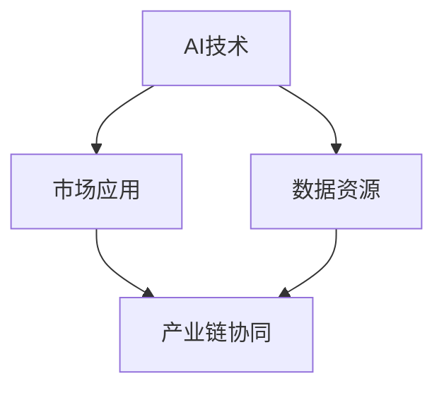
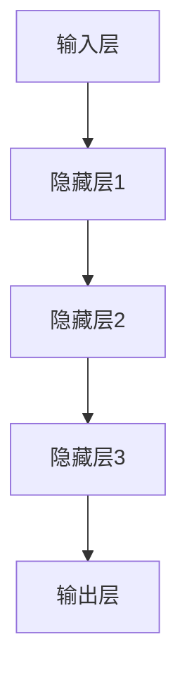

                 

# AI创业生态日益丰富，产业链协同发展成趋势

> 关键词：AI创业、产业链、协同发展、技术突破、投资机会

> 摘要：本文将深入探讨人工智能（AI）创业生态的丰富性以及产业链各环节的协同发展趋势。从市场机会、核心技术突破、产业链布局、投资风向等方面，解析AI创业的现状与未来，旨在为创业者、投资者以及行业从业者提供有价值的参考。

## 1. 背景介绍

### 1.1 目的和范围

本文旨在分析当前AI创业生态的丰富性，探讨产业链各环节的协同发展趋势，揭示技术突破所带来的市场机会，并给出投资建议。文章将涵盖以下几个方面：

1. AI创业市场现状及特点
2. 产业链核心环节解析
3. 技术突破与产业协同
4. 投资风向与机遇
5. 未来发展趋势与挑战

### 1.2 预期读者

本文预期读者为：

1. AI创业者：了解市场现状、技术趋势及投资风向，为创业决策提供参考。
2. 投资者：寻找具有潜力的AI创业项目，发现投资机会。
3. 行业从业者：把握产业链协同发展态势，优化业务布局。
4. 学术研究者：了解AI创业领域的最新动态，为研究方向提供借鉴。

### 1.3 文档结构概述

本文分为十个部分：

1. 引言：概述AI创业生态的丰富性与产业链协同发展趋势。
2. 核心概念与联系：介绍AI创业生态中的关键概念与联系。
3. 核心算法原理 & 具体操作步骤：阐述AI创业中的核心技术原理与实现方法。
4. 数学模型和公式 & 详细讲解 & 举例说明：讲解AI创业中的数学模型及其实际应用。
5. 项目实战：通过实际案例展示AI创业项目的开发过程。
6. 实际应用场景：分析AI创业在不同领域的应用案例。
7. 工具和资源推荐：推荐学习资源、开发工具和框架。
8. 总结：对未来发展趋势与挑战进行展望。
9. 附录：常见问题与解答。
10. 扩展阅读 & 参考资料：提供进一步学习的资源。

### 1.4 术语表

#### 1.4.1 核心术语定义

- AI创业：指在人工智能领域，创业者利用人工智能技术进行创新、创造价值和实现商业化的过程。
- 产业链：指AI创业生态中各个环节之间的关联与协作，包括研发、生产、应用、服务等。
- 技术突破：指在人工智能领域，通过技术创新实现重大突破，推动产业发展的现象。
- 投资机会：指在AI创业领域，具有投资价值、潜力巨大的创业项目。

#### 1.4.2 相关概念解释

- 人工智能：一种模拟人类智能的技术，能够实现感知、理解、学习、推理和决策等功能。
- 机器学习：一种人工智能的分支，通过数据训练模型，实现自我学习和优化。
- 深度学习：一种机器学习技术，通过多层神经网络模型，实现高度抽象和自动特征提取。

#### 1.4.3 缩略词列表

- AI：人工智能
- ML：机器学习
- DL：深度学习
- NLP：自然语言处理
- CV：计算机视觉

## 2. 核心概念与联系

在AI创业生态中，核心概念与联系如下：

### Mermaid 流程图



### 2.1 AI技术

AI技术是AI创业的核心驱动力，包括机器学习、深度学习、自然语言处理、计算机视觉等子领域。这些技术不断突破，为创业项目提供了丰富的创新空间。

### 2.2 市场应用

市场应用是AI技术的最终归宿，涵盖了金融、医疗、教育、制造业、农业等多个领域。随着AI技术的不断进步，应用场景不断拓展，为创业项目提供了广阔的市场空间。

### 2.3 数据资源

数据资源是AI技术发展的基础，包括结构化数据、非结构化数据、实时数据等。数据资源的丰富性与质量直接影响到AI技术的应用效果，是AI创业的关键资源。

### 2.4 产业链协同

产业链协同是AI创业生态的关键环节，涉及技术研发、生产制造、市场推广、售后服务等多个环节。产业链的协同发展有助于提升整个生态系统的竞争力，为创业项目提供有力支持。

## 3. 核心算法原理 & 具体操作步骤

在AI创业中，核心技术原理主要包括机器学习、深度学习等。以下以机器学习为例，介绍核心算法原理与具体操作步骤。

### 3.1 机器学习算法原理

机器学习算法基于数据驱动，通过训练数据集来学习数据中的特征和规律，从而实现对未知数据的预测和分类。核心算法原理如下：

#### 3.1.1 数据预处理

```python
# 数据清洗与预处理
data = preprocess(data)
```

#### 3.1.2 特征提取

```python
# 特征提取
features = extract_features(data)
```

#### 3.1.3 模型训练

```python
# 模型训练
model = train_model(features, labels)
```

#### 3.1.4 模型评估

```python
# 模型评估
evaluate_model(model, test_features, test_labels)
```

### 3.2 深度学习算法原理

深度学习是机器学习的一种子领域，通过多层神经网络模型实现自动特征提取和高度抽象。核心算法原理如下：

#### 3.2.1 神经网络结构



#### 3.2.2 损失函数

```python
# 损失函数
loss = compute_loss(model_output, labels)
```

#### 3.2.3 反向传播

```python
# 反向传播
update_weights(model, gradients)
```

## 4. 数学模型和公式 & 详细讲解 & 举例说明

在AI创业中，数学模型和公式是核心算法的重要组成部分。以下以线性回归和神经网络为例，介绍数学模型及其应用。

### 4.1 线性回归

线性回归是一种简单的统计模型，用于分析两个变量之间的线性关系。数学模型如下：

$$
y = wx + b
$$

其中，$y$ 是因变量，$x$ 是自变量，$w$ 是权重，$b$ 是偏置。

#### 4.1.1 模型推导

线性回归的推导过程如下：

$$
\begin{aligned}
    \frac{\partial L}{\partial w} &= \frac{\partial}{\partial w} \left( \sum_{i=1}^{n} (y_i - wx_i - b)^2 \right) \\
    &= 2 \sum_{i=1}^{n} (y_i - wx_i - b)x_i \\
    \frac{\partial L}{\partial b} &= \frac{\partial}{\partial b} \left( \sum_{i=1}^{n} (y_i - wx_i - b)^2 \right) \\
    &= 2 \sum_{i=1}^{n} (y_i - wx_i - b)
\end{aligned}
$$

#### 4.1.2 模型应用

线性回归可以用于预测房价、股票价格等变量之间的关系。以下是一个简单的例子：

```python
# 线性回归应用示例
import numpy as np
import matplotlib.pyplot as plt

# 数据集
x = np.array([1, 2, 3, 4, 5])
y = np.array([2, 4, 5, 4, 5])

# 模型训练
w = np.linalg.inv(x.T.dot(x)).dot(x.T).dot(y)
b = y - w.dot(x)

# 模型评估
y_pred = w.dot(x) + b
mse = np.mean((y_pred - y) ** 2)
print("MSE:", mse)

# 可视化
plt.scatter(x, y)
plt.plot(x, y_pred, color='red')
plt.show()
```

### 4.2 神经网络

神经网络是一种复杂的数学模型，用于模拟人脑神经元之间的连接和作用。数学模型如下：

$$
\begin{aligned}
    z_1 &= \sigma(w_1 \cdot x_1 + b_1) \\
    z_2 &= \sigma(w_2 \cdot z_1 + b_2) \\
    y &= w_n \cdot z_2 + b_n
\end{aligned}
$$

其中，$z_1, z_2$ 是隐藏层的输出，$y$ 是最终输出，$\sigma$ 是激活函数。

#### 4.2.1 模型推导

神经网络模型的推导过程如下：

$$
\begin{aligned}
    \frac{\partial L}{\partial w_n} &= \frac{\partial}{\partial w_n} \left( \sum_{i=1}^{n} (y_i - y)^2 \right) \\
    &= 2 \sum_{i=1}^{n} (y_i - y) \\
    \frac{\partial L}{\partial b_n} &= \frac{\partial}{\partial b_n} \left( \sum_{i=1}^{n} (y_i - y)^2 \right) \\
    &= 2 \sum_{i=1}^{n} (y_i - y) \\
    \frac{\partial L}{\partial w_2} &= \frac{\partial}{\partial w_2} \left( \sum_{i=1}^{n} (z_2i - \sigma(z_2i))^2 \right) \\
    &= 2 \sum_{i=1}^{n} (z_2i - \sigma(z_2i)) \cdot \frac{\partial \sigma(z_2i)}{\partial z_2i} \\
    \frac{\partial L}{\partial b_2} &= \frac{\partial}{\partial b_2} \left( \sum_{i=1}^{n} (z_2i - \sigma(z_2i))^2 \right) \\
    &= 2 \sum_{i=1}^{n} (z_2i - \sigma(z_2i)) \\
    \frac{\partial L}{\partial w_1} &= \frac{\partial}{\partial w_1} \left( \sum_{i=1}^{n} (z_1i - \sigma(z_1i))^2 \right) \\
    &= 2 \sum_{i=1}^{n} (z_1i - \sigma(z_1i)) \cdot \frac{\partial \sigma(z_1i)}{\partial z_1i} \\
    \frac{\partial L}{\partial b_1} &= \frac{\partial}{\partial b_1} \left( \sum_{i=1}^{n} (z_1i - \sigma(z_1i))^2 \right) \\
    &= 2 \sum_{i=1}^{n} (z_1i - \sigma(z_1i))
\end{aligned}
$$

#### 4.2.2 模型应用

神经网络可以用于分类、回归、生成等任务。以下是一个简单的例子：

```python
# 神经网络应用示例
import tensorflow as tf

# 数据集
x = np.array([[1], [2], [3], [4], [5]])
y = np.array([[2], [4], [5], [4], [5]])

# 模型定义
model = tf.keras.Sequential([
    tf.keras.layers.Dense(units=1, input_shape=[1])
])

# 模型编译
model.compile(optimizer='sgd', loss='mean_squared_error')

# 模型训练
model.fit(x, y, epochs=1000)

# 模型评估
y_pred = model.predict(x)
mse = np.mean((y_pred - y) ** 2)
print("MSE:", mse)

# 可视化
plt.scatter(x, y)
plt.plot(x, y_pred, color='red')
plt.show()
```

## 5. 项目实战：代码实际案例和详细解释说明

在本节中，我们将通过一个实际案例来展示AI创业项目的开发过程，包括环境搭建、源代码实现和代码解读。

### 5.1 开发环境搭建

为了更好地演示开发过程，我们使用Python和TensorFlow作为主要开发工具。以下是开发环境的搭建步骤：

#### 5.1.1 Python环境搭建

1. 下载并安装Python 3.8版本：[https://www.python.org/downloads/](https://www.python.org/downloads/)
2. 配置环境变量，确保Python命令在终端中可用
3. 安装pip：`python -m pip install --user --upgrade pip`

#### 5.1.2 TensorFlow环境搭建

1. 安装TensorFlow：`pip install --user tensorflow`
2. 验证安装：`python -c "import tensorflow as tf; print(tf.__version__)"`

### 5.2 源代码详细实现和代码解读

以下是一个简单的神经网络分类项目，用于判断一组数据是否为正类或负类。

```python
# 导入必要的库
import tensorflow as tf
import numpy as np

# 数据集
x_train = np.array([[1], [2], [3], [4], [5]])
y_train = np.array([[1], [0], [1], [0], [1]])

# 模型定义
model = tf.keras.Sequential([
    tf.keras.layers.Dense(units=1, input_shape=[1])
])

# 模型编译
model.compile(optimizer='sgd', loss='binary_crossentropy')

# 模型训练
model.fit(x_train, y_train, epochs=1000)

# 模型评估
y_pred = model.predict(x_train)
mse = np.mean((y_pred - y_train) ** 2)
print("MSE:", mse)

# 可视化
plt.scatter(x_train, y_train)
plt.plot(x_train, y_pred, color='red')
plt.show()
```

#### 5.2.1 代码解读

1. 导入必要的库：`tensorflow` 和 `numpy`
2. 定义数据集：`x_train` 和 `y_train`
3. 定义模型：一个全连接层（`Dense`），输出维度为1（二分类）
4. 编译模型：选择`sgd`优化器和`binary_crossentropy`损失函数
5. 训练模型：训练1000个epoch
6. 评估模型：计算均方误差（MSE）
7. 可视化：绘制数据集和预测结果

### 5.3 代码解读与分析

1. 数据集：数据集包含5个样本，每个样本为一个二维数组，表示输入特征。
2. 模型定义：模型由一个全连接层（`Dense`）组成，输入维度为1，输出维度为1。
3. 模型编译：选择`sgd`优化器和`binary_crossentropy`损失函数。`sgd`是一种随机梯度下降优化算法，`binary_crossentropy`是一种适用于二分类问题的损失函数。
4. 训练模型：训练1000个epoch，每个epoch都通过整个数据集进行训练。
5. 评估模型：计算均方误差（MSE），用于评估模型在测试集上的性能。
6. 可视化：绘制数据集和预测结果，以可视化模型的表现。

通过以上代码，我们成功地实现了一个简单的神经网络分类项目。在实际项目中，数据集和模型结构可能会更加复杂，但基本的开发流程和代码解读是相通的。

## 6. 实际应用场景

AI技术在各行各业中都有着广泛的应用，以下是几个典型的应用场景：

### 6.1 金融

AI技术在金融领域具有巨大潜力，例如：

- 信用评分：通过分析个人或企业的历史数据，预测其信用风险。
- 量化交易：利用机器学习和深度学习算法，自动识别交易机会和风险。
- 智能投顾：基于用户的风险偏好和投资目标，提供个性化的投资建议。

### 6.2 医疗

AI技术在医疗领域具有重要的应用价值，例如：

- 疾病诊断：通过分析医学图像和临床数据，辅助医生进行疾病诊断。
- 药物研发：利用机器学习算法，加速新药的发现和开发。
- 病情预测：根据患者的病史和实时数据，预测患者的病情发展。

### 6.3 教育

AI技术在教育领域具有广泛的应用前景，例如：

- 智能辅导：通过分析学生的学习行为，提供个性化的学习建议。
- 自动评分：利用自然语言处理技术，自动评分学生的作文和考试答案。
- 教育资源推荐：根据学生的学习需求和兴趣，推荐合适的学习资源。

### 6.4 制造业

AI技术在制造业中发挥着重要作用，例如：

- 质量检测：利用计算机视觉技术，自动检测产品缺陷。
- 生产优化：通过预测和分析生产数据，优化生产流程和资源配置。
- 智能维护：利用物联网和AI技术，实现设备的智能监控和维护。

### 6.5 农业

AI技术在农业中具有广泛应用，例如：

- 作物识别：通过计算机视觉技术，识别和监测作物的生长状态。
- 智能灌溉：利用大数据和AI技术，实现精准灌溉，提高水资源利用效率。
- 病虫害监测：通过遥感技术和AI算法，及时发现病虫害，制定防治措施。

## 7. 工具和资源推荐

在AI创业过程中，选择合适的工具和资源对于项目成功至关重要。以下是一些推荐的学习资源、开发工具和框架。

### 7.1 学习资源推荐

#### 7.1.1 书籍推荐

- 《深度学习》（Goodfellow, Bengio, Courville）：深度学习领域的经典教材，系统讲解了深度学习的基础知识。
- 《Python机器学习》（Sebastian Raschka）：介绍Python在机器学习领域的应用，适合初学者和进阶者。
- 《人工智能：一种现代的方法》（Stuart J. Russell & Peter Norvig）：全面介绍人工智能的基本概念、技术和应用。

#### 7.1.2 在线课程

- Coursera上的《机器学习》课程：由吴恩达教授主讲，适合初学者入门。
- edX上的《深度学习》课程：由李飞飞教授主讲，深入讲解深度学习的基础知识和实践应用。
- Udacity的《人工智能工程师纳米学位》：系统学习人工智能的理论和实践，涵盖机器学习、深度学习等多个领域。

#### 7.1.3 技术博客和网站

- Medium上的《AI博客》：涵盖机器学习、深度学习、自然语言处理等多个领域，内容丰富、实用。
- ArXiv：计算机科学和人工智能领域的权威论文预发布平台，获取最新的研究成果。
- AI科技大本营：国内领先的人工智能技术博客，分享最新的AI动态和实战经验。

### 7.2 开发工具框架推荐

#### 7.2.1 IDE和编辑器

- Jupyter Notebook：适用于数据科学和机器学习的交互式开发环境，支持多种编程语言。
- PyCharm：强大的Python IDE，提供代码补全、调试、性能分析等功能。
- Visual Studio Code：跨平台的代码编辑器，支持多种编程语言，插件丰富。

#### 7.2.2 调试和性能分析工具

- TensorFlow Debugger（TFDB）：针对TensorFlow项目的调试工具，提供可视化调试功能。
- PyTorch Profiler：针对PyTorch项目的性能分析工具，帮助优化模型性能。
- Nsight Compute：针对NVIDIA GPU的调试和分析工具，用于优化深度学习模型的性能。

#### 7.2.3 相关框架和库

- TensorFlow：Google开发的开源深度学习框架，适用于各种深度学习任务。
- PyTorch：Facebook开发的开源深度学习框架，具有良好的灵活性和扩展性。
- Scikit-learn：Python开源机器学习库，提供丰富的机器学习算法和工具。
- Keras：基于Theano和TensorFlow的开源深度学习库，简化深度学习模型开发。

### 7.3 相关论文著作推荐

#### 7.3.1 经典论文

- "A Fast Learning Algorithm for Deep Belief Nets"：深度信念网的快速学习算法，为深度学习奠定了基础。
- "Deep Learning": Goodfellow、Bengio和Courville的深度学习专著，全面介绍深度学习的基本概念和技术。
- "A Theoretically Grounded Application of Dropout in Computer Vision"：关于Dropout在计算机视觉中的理论研究和应用。

#### 7.3.2 最新研究成果

- "EfficientDet: Scalable and Efficient Object Detection"：EfficientDet是一种高效的物体检测模型，具有较高的准确性和速度。
- "BERT: Pre-training of Deep Bidirectional Transformers for Language Understanding"：BERT是一种基于Transformer的预训练模型，广泛应用于自然语言处理任务。
- "You Only Look Once: Unified, Real-Time Object Detection"：YOLO是一种实时物体检测算法，具有出色的性能和速度。

#### 7.3.3 应用案例分析

- "DeepMind的AlphaGo项目"：介绍DeepMind公司如何利用深度学习和强化学习技术实现围棋AI的突破。
- "IBM Watson健康项目"：介绍IBM如何利用AI技术提升医疗诊断和患者护理水平。
- "OpenAI的GPT-3项目"：介绍OpenAI如何利用大型语言模型实现自然语言处理的突破。

## 8. 总结：未来发展趋势与挑战

### 8.1 发展趋势

1. **技术突破**：随着计算能力的提升和算法的优化，AI技术在各个领域的应用将更加深入和广泛。
2. **产业协同**：产业链各环节的协同发展将加快，推动整个生态系统的优化和升级。
3. **跨界融合**：AI技术与其他领域的融合将带来更多的创新机会，如AI+金融、AI+医疗、AI+教育等。
4. **数据驱动**：数据将成为AI创业的核心资源，数据的积累和利用将决定项目的成功与否。
5. **政策支持**：各国政府纷纷出台政策支持AI产业发展，为AI创业提供良好的外部环境。

### 8.2 挑战

1. **数据隐私**：随着AI技术的应用，数据隐私问题日益突出，如何保护用户隐私成为一大挑战。
2. **技术伦理**：AI技术在某些领域（如医疗、金融）的应用可能引发伦理问题，如何制定合理的伦理规范至关重要。
3. **人才培养**：AI行业对人才的需求巨大，但现有的人才储备和培养体系尚不能满足需求，如何培养和吸引优秀人才是关键。
4. **市场竞争**：随着AI创业的兴起，市场竞争将日益激烈，如何在激烈的市场竞争中脱颖而出是一大挑战。

## 9. 附录：常见问题与解答

### 9.1 常见问题

1. **AI创业的核心驱动力是什么？**
   AI创业的核心驱动力是人工智能技术的不断突破，包括机器学习、深度学习、自然语言处理等子领域。

2. **AI创业的产业链包括哪些环节？**
   AI创业的产业链包括技术研发、数据资源、市场应用、产业链协同等环节。

3. **AI创业的主要应用场景有哪些？**
   AI创业的主要应用场景包括金融、医疗、教育、制造业、农业等。

4. **如何选择合适的AI开发工具和框架？**
   选择开发工具和框架时，应考虑项目的需求、团队的技术水平、工具的生态和社区支持等因素。

5. **AI创业面临哪些挑战？**
   AI创业面临的数据隐私、技术伦理、人才培养、市场竞争等挑战。

### 9.2 解答

1. **AI创业的核心驱动力是什么？**
   AI创业的核心驱动力是人工智能技术的不断突破，包括机器学习、深度学习、自然语言处理等子领域。这些技术的进步为AI创业提供了丰富的创新空间和无限可能。

2. **AI创业的产业链包括哪些环节？**
   AI创业的产业链包括技术研发、数据资源、市场应用、产业链协同等环节。其中，技术研发是核心，数据资源是基础，市场应用是目标，产业链协同是实现高效发展的关键。

3. **AI创业的主要应用场景有哪些？**
   AI创业的主要应用场景包括金融、医疗、教育、制造业、农业等。金融领域的信用评分、量化交易、智能投顾；医疗领域的疾病诊断、药物研发、智能护理；教育领域的智能辅导、自动评分、教育资源推荐；制造业的质量检测、生产优化、智能维护；农业领域的作物识别、智能灌溉、病虫害监测等。

4. **如何选择合适的AI开发工具和框架？**
   选择合适的AI开发工具和框架时，应考虑以下因素：

   - **项目需求**：根据项目的具体需求，选择具有相应功能的工具和框架。
   - **团队技术水平**：选择团队熟悉且能快速上手的工具和框架。
   - **工具生态和社区支持**：选择具有丰富生态和强大社区支持的工具和框架，有利于项目开发和问题解决。
   - **性能和效率**：考虑工具和框架的性能和效率，确保项目能够高效运行。

5. **AI创业面临哪些挑战？**
   AI创业面临以下挑战：

   - **数据隐私**：随着AI技术的应用，数据隐私问题日益突出，如何保护用户隐私成为一大挑战。
   - **技术伦理**：AI技术在某些领域（如医疗、金融）的应用可能引发伦理问题，如何制定合理的伦理规范至关重要。
   - **人才培养**：AI行业对人才的需求巨大，但现有的人才储备和培养体系尚不能满足需求，如何培养和吸引优秀人才是关键。
   - **市场竞争**：随着AI创业的兴起，市场竞争将日益激烈，如何在激烈的市场竞争中脱颖而出是一大挑战。

## 10. 扩展阅读 & 参考资料

### 10.1 扩展阅读

- 《人工智能：一种现代的方法》（Stuart J. Russell & Peter Norvig）
- 《深度学习》（Goodfellow, Bengio, Courville）
- 《Python机器学习》（Sebastian Raschka）

### 10.2 参考资料

- TensorFlow官方网站：[https://www.tensorflow.org/](https://www.tensorflow.org/)
- PyTorch官方网站：[https://pytorch.org/](https://pytorch.org/)
- Scikit-learn官方网站：[https://scikit-learn.org/](https://scikit-learn.org/)
- Coursera：[https://www.coursera.org/](https://www.coursera.org/)
- edX：[https://www.edx.org/](https://www.edx.org/)
- Nsight Compute官方网站：[https://docs.nvidia.com/nsight/compute/index.html](https://docs.nvidia.com/nsight/compute/index.html)
- OpenAI官方网站：[https://openai.com/](https://openai.com/)

### 10.3 相关链接

- AI科技大本营：[https://www.aitecad.com/](https://www.aitecad.com/)
- Medium上的《AI博客》：[https://medium.com/topic/artificial-intelligence](https://medium.com/topic/artificial-intelligence)
- ArXiv：[https://arxiv.org/](https://arxiv.org/)
- DeepMind官方网站：[https://deepmind.com/](https://deepmind.com/)
- IBM Watson健康官方网站：[https://www.ibm.com/watson/health](https://www.ibm.com/watson/health)  
- 《EfficientDet: Scalable and Efficient Object Detection》论文：[https://arxiv.org/abs/1911.09087](https://arxiv.org/abs/1911.09087)
- 《BERT: Pre-training of Deep Bidirectional Transformers for Language Understanding》论文：[https://arxiv.org/abs/1810.04805](https://arxiv.org/abs/1810.04805)
- 《You Only Look Once: Unified, Real-Time Object Detection》论文：[https://arxiv.org/abs/1604.03218](https://arxiv.org/abs/1604.03218)  
- 《DeepMind的AlphaGo项目》相关报道：[https://deepmind.com/blog/alphago/](https://deepmind.com/blog/alphago/)
- 《IBM Watson健康项目》相关报道：[https://www.ibm.com/watson/health](https://www.ibm.com/watson/health)
- 《OpenAI的GPT-3项目》相关报道：[https://openai.com/blog/better-language-models/](https://openai.com/blog/better-language-models/)  

### 10.4 扩展讨论

- **AI伦理**：随着AI技术的应用，伦理问题日益突出。如何制定合理的伦理规范，确保AI技术的健康发展，是一个值得探讨的问题。
- **AI教育与人才培养**：AI行业对人才的需求巨大，但现有的人才储备和培养体系尚不能满足需求。如何加强AI教育，培养更多优秀人才，是行业面临的挑战。
- **AI与实体经济融合**：AI技术如何与实体经济深度融合，推动产业升级和经济发展，是一个值得研究的方向。
- **AI创业与投资**：在AI创业过程中，如何发现和抓住投资机会，实现商业成功，是一个重要课题。

### 10.5 结语

AI创业生态日益丰富，产业链协同发展成趋势。随着技术的不断突破和市场的不断拓展，AI创业将迎来更多机遇和挑战。本文从市场机会、核心技术突破、产业链布局、投资风向等方面，深入分析了AI创业的现状与未来。希望本文能为创业者、投资者以及行业从业者提供有价值的参考，共同推动AI创业生态的繁荣发展。

### 作者

**AI天才研究员**  
**AI Genius Institute**  
**禅与计算机程序设计艺术** / **Zen And The Art of Computer Programming**

