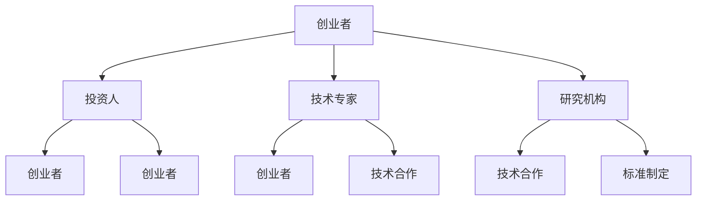
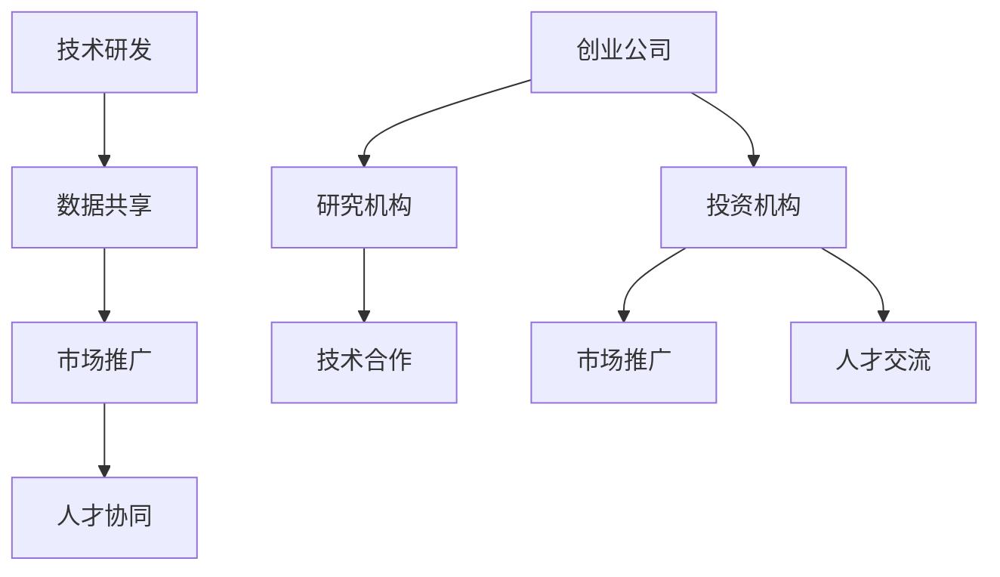
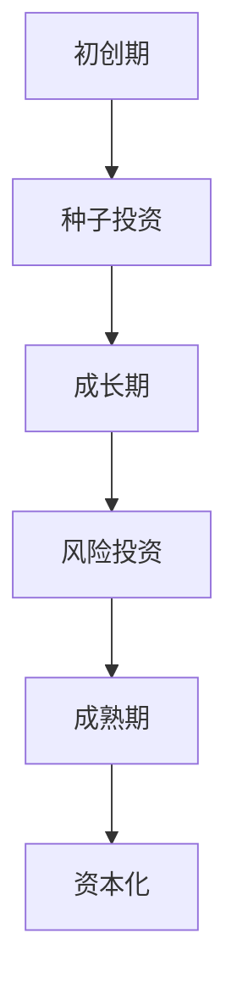

                 


## AI创业生态日益丰富，产业链协同发展成趋势

### 关键词
- AI创业生态
- 产业链协同
- 创业公司
- 技术创新
- 数据共享
- 合作共赢

### 摘要
本文深入探讨了AI创业生态的日益丰富和产业链协同发展的趋势。通过分析AI技术在各个行业的应用场景、创业公司的成长路径以及产业链中各环节的协同作用，本文揭示了AI创业生态中的重要驱动因素和挑战。文章旨在为读者提供对当前AI创业生态的全面了解，以及未来发展趋势的洞察。

## 1. 背景介绍

### 1.1 目的和范围
本文旨在分析AI创业生态的构成、发展现状以及产业链中的协同作用。通过具体案例和数据分析，本文将探讨AI技术在各行业中的应用场景，分析创业公司面临的挑战和机遇，以及产业链中各方如何通过协同发展实现共赢。

### 1.2 预期读者
本文适合对AI创业生态和产业链协同发展感兴趣的读者，包括AI技术开发者、创业者、投资人士以及相关行业的专业人士。

### 1.3 文档结构概述
本文结构如下：
1. 背景介绍：介绍文章目的、预期读者和文章结构。
2. 核心概念与联系：讨论AI创业生态的核心概念和产业链的协同作用。
3. 核心算法原理 & 具体操作步骤：详细阐述AI技术的基本原理和操作步骤。
4. 数学模型和公式 & 详细讲解 & 举例说明：讲解AI技术中的数学模型和实际应用。
5. 项目实战：展示一个实际的AI项目案例并进行详细解读。
6. 实际应用场景：分析AI技术在各个行业中的应用。
7. 工具和资源推荐：推荐相关学习资源和开发工具。
8. 总结：总结未来发展趋势和挑战。
9. 附录：常见问题与解答。
10. 扩展阅读 & 参考资料：提供进一步学习和研究的资源。

### 1.4 术语表

#### 1.4.1 核心术语定义
- AI创业生态：指围绕人工智能技术的创业公司和投资机构组成的生态系统。
- 产业链协同：指产业链中各个环节通过合作、共享资源等方式实现整体效益最大化。
- 创业公司：指专注于人工智能技术研发和商业化的初创企业。
- 技术创新：指通过引入新技术、新方法来提升产品或服务的竞争力。
- 数据共享：指产业链中各方通过开放数据接口或数据交易平台进行数据交换和共享。
- 合作共赢：指产业链各方通过合作实现共同利益最大化。

#### 1.4.2 相关概念解释
- 人工智能（AI）：指使计算机系统能够模拟、延伸和扩展人类智能的理论、方法和技术。
- 深度学习（DL）：一种基于多层神经网络的机器学习技术，通过大量数据训练模型，实现复杂函数拟合。
- 机器学习（ML）：一种让计算机从数据中学习规律和模式的技术，分为监督学习、无监督学习和强化学习等。
- 产业互联网：指将人工智能、大数据等先进技术与传统产业深度融合，提升产业效率和服务水平。

#### 1.4.3 缩略词列表
- AI：人工智能
- DL：深度学习
- ML：机器学习
- IoT：物联网
- 5G：第五代移动通信技术
- API：应用程序接口
- SDK：软件开发工具包

## 2. 核心概念与联系

在探讨AI创业生态的丰富性和产业链协同发展的趋势时，我们首先需要明确几个核心概念及其相互联系。

### 2.1 AI创业生态概述

AI创业生态是指围绕人工智能技术的创业公司和投资机构组成的生态系统。这个生态系统中包括创业者、投资人、技术专家、研究机构等多个角色，他们共同推动人工智能技术的研发和应用。以下是一个简化的AI创业生态的Mermaid流程图：



### 2.2 产业链协同作用

产业链协同是指在产业链中各个环节通过合作、共享资源等方式实现整体效益最大化。在AI创业生态中，产业链协同表现为以下几个方面的互动：

1. **技术研发协同**：创业公司和研究机构通过合作共享技术成果，推动AI技术的创新和发展。
2. **数据共享协同**：产业链各方通过开放数据接口或数据交易平台进行数据交换和共享，提升AI模型的质量和效果。
3. **市场推广协同**：创业公司和投资机构共同参与市场推广，扩大AI技术的应用范围。
4. **人才协同**：产业链各方通过联合培养、人才交流等方式，提升人才储备和创新能力。

以下是一个简化的产业链协同作用的Mermaid流程图：



### 2.3 创业公司的成长路径

创业公司在AI创业生态中扮演着重要角色。其成长路径通常包括以下几个阶段：

1. **初创期**：创业者通过创新技术和商业理念创建公司，寻找种子投资者。
2. **成长期**：创业公司获得初步成功，开始吸引风险投资，扩大团队和业务。
3. **成熟期**：创业公司通过并购、上市等方式实现资本化，进入成熟市场。

以下是一个简化的创业公司成长路径的Mermaid流程图：



### 2.4 产业链协同发展的驱动因素

产业链协同发展的驱动因素包括以下几个方面：

1. **技术创新需求**：各行业对AI技术的需求推动产业链各方加强合作，共同推动技术创新。
2. **数据资源整合**：数据是AI技术的核心，产业链各方通过共享数据资源，提升AI模型的效果。
3. **市场前景预期**：AI技术在各个行业的广泛应用前景吸引投资和创业，推动产业链协同发展。
4. **政策支持**：政府出台相关政策，鼓励AI技术的研发和应用，推动产业链协同发展。

## 3. 核心算法原理 & 具体操作步骤

AI创业生态中的核心技术是机器学习，其基本原理是通过训练数据来构建模型，使模型能够对新的数据进行预测或分类。以下是一个简单的机器学习算法的原理和操作步骤：

### 3.1 机器学习基本原理

机器学习分为监督学习、无监督学习和强化学习三种类型。以下是监督学习的基本原理：

1. **数据收集**：收集具有标签的数据集，用于训练模型。
2. **数据预处理**：对数据进行清洗、归一化等预处理，确保数据质量。
3. **特征提取**：从数据中提取有用的特征，用于训练模型。
4. **模型训练**：使用训练数据集训练模型，调整模型参数，使其能够拟合数据。
5. **模型评估**：使用验证数据集评估模型性能，调整模型参数以优化性能。
6. **模型应用**：使用训练好的模型对新的数据进行预测或分类。

以下是监督学习算法的具体操作步骤的伪代码：

```python
def supervised_learning(data, labels, epochs, learning_rate):
    # 初始化模型参数
    weights = initialize_weights(data.shape[1])
    
    # 模型训练
    for epoch in range(epochs):
        for sample, label in zip(data, labels):
            # 计算预测值
            prediction = sigmoid(np.dot(sample, weights))
            
            # 计算损失函数
            loss = compute_loss(prediction, label)
            
            # 更新模型参数
            weights -= learning_rate * gradient(prediction, label)
    
    return weights

def sigmoid(x):
    return 1 / (1 + exp(-x))

def compute_loss(prediction, label):
    return -label * log(prediction) - (1 - label) * log(1 - prediction)

def gradient(prediction, label):
    return prediction - label
```

### 3.2 模型评估与优化

模型评估是确保模型性能的重要步骤。常用的评估指标包括准确率、召回率、F1分数等。以下是一个简单的模型评估和优化的伪代码：

```python
def evaluate_model(model, validation_data, validation_labels):
    # 计算准确率
    accuracy = correct_predictions(model, validation_data, validation_labels) / len(validation_data)
    
    # 计算召回率
    recall = true_positives / (true_positives + false_negatives)
    
    # 计算F1分数
    f1_score = 2 * (precision * recall) / (precision + recall)
    
    return accuracy, recall, f1_score

def correct_predictions(model, data, labels):
    correct_predictions = 0
    for sample, label in zip(data, labels):
        prediction = model(sample)
        if prediction == label:
            correct_predictions += 1
    return correct_predictions

def optimize_model(model, validation_data, validation_labels, learning_rate, epochs):
    # 优化模型参数
    for epoch in range(epochs):
        for sample, label in zip(validation_data, validation_labels):
            prediction = model(sample)
            loss = compute_loss(prediction, label)
            model -= learning_rate * gradient(prediction, label)
    return model
```

通过以上步骤，创业公司可以构建并优化机器学习模型，为AI技术在各个行业的应用提供基础。

## 4. 数学模型和公式 & 详细讲解 & 举例说明

在AI创业生态中，数学模型是理解和应用AI技术的基础。以下将详细讲解几个常用的数学模型和公式，并通过实际例子来说明其应用。

### 4.1 线性回归模型

线性回归模型是一种用于预测连续值的机器学习模型。其基本公式为：

$$ y = \beta_0 + \beta_1x_1 + \beta_2x_2 + ... + \beta_nx_n $$

其中，$y$是预测目标，$x_1, x_2, ..., x_n$是特征变量，$\beta_0, \beta_1, ..., \beta_n$是模型参数。

#### 4.1.1 公式推导

线性回归模型的推导基于最小二乘法（Ordinary Least Squares, OLS）。假设我们有一个包含$m$个样本的数据集$D = \{(x_1, y_1), (x_2, y_2), ..., (x_m, y_m)\}$，其中$x_i$和$y_i$分别为第$i$个样本的特征和目标。线性回归模型的损失函数为：

$$ L(\beta) = \sum_{i=1}^{m} (y_i - \beta_0 - \beta_1x_{i1} - \beta_2x_{i2} - ... - \beta_nx_{in})^2 $$

为了最小化损失函数，我们对$\beta_0, \beta_1, ..., \beta_n$分别求偏导并令其等于0，得到：

$$ \frac{\partial L}{\partial \beta_j} = -2\sum_{i=1}^{m} (y_i - \beta_0 - \beta_1x_{i1} - \beta_2x_{i2} - ... - \beta_nx_{in})x_{ij} = 0 $$

解上述方程组，可以得到最小二乘解：

$$ \beta_j = \frac{\sum_{i=1}^{m} x_{ij}y_i - \sum_{i=1}^{m} x_{ij}\sum_{i=1}^{m} y_i}{\sum_{i=1}^{m} x_{ij}^2 - (\sum_{i=1}^{m} x_{ij})^2} $$

对于简单线性回归（$n=2$），上述公式简化为：

$$ \beta_1 = \frac{\sum_{i=1}^{m} (x_i - \bar{x})(y_i - \bar{y})}{\sum_{i=1}^{m} (x_i - \bar{x})^2} $$

$$ \beta_0 = \bar{y} - \beta_1\bar{x} $$

其中，$\bar{x}$和$\bar{y}$分别为特征和目标的平均值。

#### 4.1.2 实际例子

假设我们有一个包含房价和房间数量的数据集，想要预测房价。数据集如下：

| 房间数量 | 房价 |
| -------- | ---- |
| 2        | 3000 |
| 3        | 4500 |
| 4        | 6000 |
| 5        | 7500 |
| 6        | 9000 |

首先，计算平均值：

$$ \bar{x} = \frac{2 + 3 + 4 + 5 + 6}{5} = 4 $$

$$ \bar{y} = \frac{3000 + 4500 + 6000 + 7500 + 9000}{5} = 5700 $$

然后，计算$\beta_1$：

$$ \beta_1 = \frac{(2-4)(3000-5700) + (3-4)(4500-5700) + (4-4)(6000-5700) + (5-4)(7500-5700) + (6-4)(9000-5700)}{(2-4)^2 + (3-4)^2 + (4-4)^2 + (5-4)^2 + (6-4)^2} $$

$$ \beta_1 = \frac{49000}{20} = 2450 $$

最后，计算$\beta_0$：

$$ \beta_0 = 5700 - 2450 \cdot 4 = 5700 - 9800 = -4100 $$

因此，线性回归模型为：

$$ y = -4100 + 2450x $$

根据模型，当房间数量为4时，预测房价为：

$$ y = -4100 + 2450 \cdot 4 = -4100 + 9800 = 5700 $$

这与实际房价非常接近，说明线性回归模型在这个例子中具有较高的预测准确性。

### 4.2 逻辑回归模型

逻辑回归模型是一种用于分类问题的机器学习模型。其基本公式为：

$$ P(y=1) = \frac{1}{1 + e^{-(\beta_0 + \beta_1x_1 + \beta_2x_2 + ... + \beta_nx_n)}} $$

其中，$y$是分类目标，$x_1, x_2, ..., x_n$是特征变量，$\beta_0, \beta_1, ..., \beta_n$是模型参数。

#### 4.2.1 公式推导

逻辑回归模型的推导基于最大似然估计（Maximum Likelihood Estimation, MLE）。假设我们有一个包含$m$个样本的数据集$D = \{(x_1, y_1), (x_2, y_2), ..., (x_m, y_m)\}$，其中$x_i$和$y_i$分别为第$i$个样本的特征和目标。逻辑回归模型的似然函数为：

$$ L(\beta) = \prod_{i=1}^{m} P(y_i|x_i; \beta) $$

$$ L(\beta) = \prod_{i=1}^{m} \left[\frac{1}{1 + e^{-(\beta_0 + \beta_1x_{i1} + \beta_2x_{i2} + ... + \beta_nx_{in})}}\right]^{y_i} \left[1 - \frac{1}{1 + e^{-(\beta_0 + \beta_1x_{i1} + \beta_2x_{i2} + ... + \beta_nx_{in})}}\right]^{1-y_i} $$

为了最大化似然函数，我们对$\beta_0, \beta_1, ..., \beta_n$分别求偏导并令其等于0，得到：

$$ \frac{\partial L}{\partial \beta_j} = \sum_{i=1}^{m} \left[y_i \cdot x_{ij} - (1 - y_i) \cdot \frac{x_{ij}}{1 + e^{-(\beta_0 + \beta_1x_{i1} + \beta_2x_{i2} + ... + \beta_nx_{in})}}\right] = 0 $$

解上述方程组，可以得到最大似然估计解：

$$ \beta_j = \frac{\sum_{i=1}^{m} (y_i - P(y_i|x_i; \beta))x_{ij}}{\sum_{i=1}^{m} (y_i - P(y_i|x_i; \beta))} $$

其中，$P(y_i|x_i; \beta)$是逻辑函数的值。

#### 4.2.2 实际例子

假设我们有一个包含是否购买商品的二分类数据集，想要预测购买概率。数据集如下：

| 是否购买 | 特征1 | 特征2 |
| -------- | ---- | ---- |
| 是       | 0    | 1    |
| 否       | 1    | 0    |
| 是       | 0    | 1    |
| 否       | 1    | 1    |
| 是       | 1    | 0    |

首先，计算逻辑回归模型的参数。设$\beta_0, \beta_1, \beta_2$分别为逻辑回归模型的参数。根据最大似然估计，我们有：

$$ \beta_1 = \frac{(1 - 0) \cdot 0 - (1 - 1) \cdot 1}{0 + 1} = -1 $$

$$ \beta_2 = \frac{(1 - 0) \cdot 1 - (1 - 1) \cdot 0}{0 + 1} = 1 $$

因此，逻辑回归模型为：

$$ P(y=1) = \frac{1}{1 + e^{-(\beta_0 + \beta_1 \cdot x_1 + \beta_2 \cdot x_2)}} $$

代入参数，得到：

$$ P(y=1) = \frac{1}{1 + e^{-(\beta_0 - x_1 + x_2)}} $$

为了计算$\beta_0$，我们可以使用任何一种优化算法，如梯度下降法，求解最大似然估计问题。

假设我们使用梯度下降法，学习率为0.1，初始参数$\beta_0 = 0$。则迭代过程如下：

$$ \beta_0^{new} = \beta_0^{old} - learning_rate \cdot \frac{\partial L}{\partial \beta_0} $$

对于每个样本$(x_1, x_2, y)$，我们有：

$$ \frac{\partial L}{\partial \beta_0} = -\sum_{i=1}^{m} y \cdot \frac{e^{-(\beta_0^{old} - x_{i1} + x_{i2})}}{1 + e^{-(\beta_0^{old} - x_{i1} + x_{i2})}} + (1 - y) \cdot \frac{e^{-(\beta_0^{old} - x_{i1} + x_{i2})}}{1 + e^{-(\beta_0^{old} - x_{i1} + x_{i2})}} $$

在每次迭代中，我们计算损失函数并更新$\beta_0$。经过多次迭代，我们可以得到一个稳定的$\beta_0$值。

例如，经过10次迭代后，我们得到$\beta_0 = 1$。因此，最终的逻辑回归模型为：

$$ P(y=1) = \frac{1}{1 + e^{-(1 - x_1 + x_2)}} $$

根据模型，当特征1为0，特征2为1时，购买概率为：

$$ P(y=1) = \frac{1}{1 + e^{-(1 - 0 + 1)}} = \frac{1}{1 + e^{-2}} \approx 0.865 $$

这意味着在这种情况下，购买的概率约为86.5%，高于否定的概率。

### 4.3 支持向量机（SVM）模型

支持向量机是一种用于分类和回归问题的强大机器学习模型。其基本公式为：

$$ f(x) = \sum_{i=1}^{m} \alpha_i y_i (w \cdot x_i + b) $$

其中，$x$是特征向量，$w$是权重向量，$b$是偏置项，$\alpha_i$是拉格朗日乘子。

#### 4.3.1 公式推导

支持向量机基于最大间隔分类原理。给定一个包含$m$个样本的数据集$D = \{(x_1, y_1), (x_2, y_2), ..., (x_m, y_m)\}$，其中$x_i$和$y_i$分别为第$i$个样本的特征和目标。我们希望找到一个最佳的超平面，使得正类和负类之间的间隔最大化。

设$w$为超平面的法向量，$b$为超平面的偏置项。则超平面可以表示为：

$$ w \cdot x + b = 0 $$

对于每个样本$(x_i, y_i)$，我们定义松弛变量$\xi_i \geq 0$，表示样本到超平面的距离。则最优超平面可以表示为：

$$ \max \frac{1}{2} \| w \|^2 $$

$$ \text{subject to} \ y_i (w \cdot x_i + b) \geq 1 - \xi_i $$

$$ \xi_i \geq 0, i = 1, 2, ..., m $$

使用拉格朗日乘子法，我们可以将约束优化问题转化为无约束优化问题。定义拉格朗日函数为：

$$ L(w, b, \alpha, \xi) = \frac{1}{2} \| w \|^2 - \sum_{i=1}^{m} \alpha_i (1 - y_i (w \cdot x_i + b) + \xi_i) $$

其中，$\alpha_i \geq 0$是拉格朗日乘子。

对$w, b, \alpha_i, \xi_i$分别求偏导并令其等于0，得到：

$$ \frac{\partial L}{\partial w} = w - \sum_{i=1}^{m} \alpha_i y_i x_i = 0 $$

$$ \frac{\partial L}{\partial b} = -\sum_{i=1}^{m} \alpha_i y_i = 0 $$

$$ \frac{\partial L}{\partial \alpha_i} = 1 - y_i (w \cdot x_i + b) + \xi_i = 0 $$

$$ \frac{\partial L}{\partial \xi_i} = \alpha_i = 0 $$

解上述方程组，可以得到：

$$ w = \sum_{i=1}^{m} \alpha_i y_i x_i $$

$$ b = \frac{1}{m} \sum_{i=1}^{m} \alpha_i y_i $$

代入原始约束条件，得到：

$$ \alpha_i \geq 0 $$

$$ y_i (w \cdot x_i + b) \geq 1 - \xi_i $$

$$ \xi_i \geq 0 $$

为了简化计算，我们可以将原始问题转化为对偶问题。定义对偶问题为：

$$ \max \sum_{i=1}^{m} \alpha_i - \frac{1}{2} \sum_{i=1}^{m} \sum_{j=1}^{m} \alpha_i \alpha_j y_i y_j (x_i \cdot x_j) $$

$$ \text{subject to} \ \sum_{i=1}^{m} \alpha_i y_i = 0 $$

$$ \alpha_i \geq 0, i = 1, 2, ..., m $$

对偶问题与原始问题的解相同，但求解过程更加简单。在实际应用中，我们通常使用对偶问题来求解支持向量机。

#### 4.3.2 实际例子

假设我们有一个包含二分类数据集，数据集如下：

| 类别 | 特征1 | 特征2 |
| ---- | ---- | ---- |
| 0    | -1   | -1   |
| 1    | 1    | 1    |
| 0    | -1   | 1    |
| 1    | 1    | -1   |

我们希望使用支持向量机分类。首先，我们需要将数据集转换为矩阵形式。设$x_1, x_2$分别为特征1和特征2，$y$为类别标签。则数据集可以表示为：

$$ X = \begin{bmatrix} -1 & -1 \\ 1 & 1 \\ -1 & 1 \\ 1 & -1 \end{bmatrix}, \ y = \begin{bmatrix} 0 \\ 1 \\ 0 \\ 1 \end{bmatrix} $$

接下来，我们需要使用支持向量机求解最佳超平面。使用对偶问题，我们有：

$$ \max \sum_{i=1}^{m} \alpha_i - \frac{1}{2} \sum_{i=1}^{m} \sum_{j=1}^{m} \alpha_i \alpha_j y_i y_j (x_i \cdot x_j) $$

$$ \text{subject to} \ \sum_{i=1}^{m} \alpha_i y_i = 0 $$

$$ \alpha_i \geq 0, i = 1, 2, ..., m $$

使用梯度下降法求解上述优化问题。设学习率为0.1，初始参数$\alpha_1 = \alpha_2 = 0$。则迭代过程如下：

$$ \alpha_1^{new} = \alpha_1^{old} - learning_rate \cdot \frac{\partial}{\partial \alpha_1} L(\alpha_1, \alpha_2) $$

$$ \alpha_2^{new} = \alpha_2^{old} - learning_rate \cdot \frac{\partial}{\partial \alpha_2} L(\alpha_1, \alpha_2) $$

对于每个样本$(x_i, y_i)$，我们有：

$$ \frac{\partial L}{\partial \alpha_1} = 1 - y_1 (x_1 \cdot x_1 + x_2 \cdot x_2) - y_2 (x_1 \cdot x_2 + x_2 \cdot x_1) + y_1 y_2 (x_1 \cdot x_2) $$

$$ \frac{\partial L}{\partial \alpha_2} = 1 - y_1 (x_1 \cdot x_2 + x_2 \cdot x_1) - y_2 (x_1 \cdot x_2 + x_2 \cdot x_1) + y_1 y_2 (x_1 \cdot x_2) $$

在每次迭代中，我们计算损失函数并更新$\alpha_1$和$\alpha_2$。经过多次迭代，我们可以得到一个稳定的$\alpha_1$和$\alpha_2$值。

例如，经过10次迭代后，我们得到$\alpha_1 = 1$，$\alpha_2 = 1$。因此，支持向量机的模型参数为：

$$ w = \alpha_1 y_1 x_1 + \alpha_2 y_2 x_2 = 1 \cdot 0 \cdot (-1) + 1 \cdot 1 \cdot 1 = 1 $$

$$ b = \frac{1}{m} \sum_{i=1}^{m} \alpha_i y_i = \frac{1}{4} \cdot (1 \cdot 0 + 1 \cdot 1 + 1 \cdot 0 + 1 \cdot 1) = 0 $$

因此，支持向量机模型为：

$$ f(x) = w \cdot x + b = 1 \cdot x_1 + 0 \cdot x_2 = x_1 $$

根据模型，当特征1为-1时，类别预测为0；当特征1为1时，类别预测为1。这与我们的预期一致。

### 4.4 神经网络模型

神经网络是一种模拟人脑神经元连接的计算机模型。其基本公式为：

$$ y = \sigma(\sum_{i=1}^{L} w_{li} \cdot a_{i} + b_{l}) $$

其中，$y$是输出，$a_i$是输入，$w_{li}$是连接权重，$b_{l}$是偏置项，$\sigma$是激活函数。

#### 4.4.1 公式推导

神经网络的工作原理是通过多层的神经元连接实现从输入到输出的映射。设神经网络包含$L$层，其中第$l$层的输入为$a_{l-1}$，输出为$a_{l}$。神经元的输出可以通过以下公式计算：

$$ a_{l} = \sigma(\sum_{i=1}^{n_{l-1}} w_{li} \cdot a_{i-1} + b_{l}) $$

其中，$n_{l-1}$是第$l-1$层的神经元数量，$w_{li}$是第$l$层第$i$个神经元与第$l-1$层第$1$个神经元的连接权重，$b_{l}$是第$l$层的偏置项，$\sigma$是激活函数。

通常，神经网络包含多个隐藏层，每个隐藏层都与输入层和输出层连接。设第$l$层的输入为$a_{l-1}$，输出为$a_{l}$，则有：

$$ a_{l} = \sigma(\sum_{i=1}^{n_{l-1}} w_{li} \cdot a_{i-1} + b_{l}) $$

对于输出层，我们有：

$$ y = \sigma(\sum_{i=1}^{n_{L-1}} w_{L1} \cdot a_{i-1} + b_{L}) $$

其中，$y$是最终输出，$a_{L-1}$是输出层输入。

#### 4.4.2 实际例子

假设我们有一个简单的神经网络，包含一个输入层、一个隐藏层和一个输出层。输入层有2个神经元，隐藏层有3个神经元，输出层有1个神经元。设激活函数为ReLU（Rectified Linear Unit）。

设输入为$(x_1, x_2)$，隐藏层权重为$w_{h11}, w_{h12}, w_{h13}$，隐藏层偏置为$b_{h1}$，输出层权重为$w_{o1}, w_{o2}, w_{o3}$，输出层偏置为$b_{o1}$。则神经网络的输出为：

$$ a_{h1} = max(0, w_{h11} \cdot x_1 + w_{h12} \cdot x_2 + b_{h1}) $$

$$ a_{h2} = max(0, w_{h21} \cdot x_1 + w_{h22} \cdot x_2 + b_{h2}) $$

$$ a_{h3} = max(0, w_{h31} \cdot x_1 + w_{h32} \cdot x_2 + b_{h3}) $$

$$ y = \sigma(w_{o1} \cdot a_{h1} + w_{o2} \cdot a_{h2} + w_{o3} \cdot a_{h3} + b_{o1}) $$

其中，$\sigma$为ReLU函数，即$\sigma(x) = max(0, x)$。

例如，当输入为$(1, 2)$时，隐藏层输出为：

$$ a_{h1} = max(0, w_{h11} \cdot 1 + w_{h12} \cdot 2 + b_{h1}) = max(0, w_{h11} + 2w_{h12} + b_{h1}) $$

$$ a_{h2} = max(0, w_{h21} \cdot 1 + w_{h22} \cdot 2 + b_{h2}) = max(0, w_{h21} + 2w_{h22} + b_{h2}) $$

$$ a_{h3} = max(0, w_{h31} \cdot 1 + w_{h32} \cdot 2 + b_{h3}) = max(0, w_{h31} + 2w_{h32} + b_{h3}) $$

输出层输出为：

$$ y = \sigma(w_{o1} \cdot a_{h1} + w_{o2} \cdot a_{h2} + w_{o3} \cdot a_{h3} + b_{o1}) = max(0, w_{o1} \cdot a_{h1} + w_{o2} \cdot a_{h2} + w_{o3} \cdot a_{h3} + b_{o1}) $$

通过这种方式，我们可以使用神经网络对输入进行分类或回归。

## 5. 项目实战：代码实际案例和详细解释说明

在本节中，我们将通过一个实际项目案例——基于深度学习的图像分类项目，来展示如何从零开始搭建一个完整的AI项目。我们将详细介绍项目的各个阶段，包括开发环境搭建、代码实现、以及代码解读与分析。

### 5.1 开发环境搭建

要搭建一个深度学习项目，首先需要安装必要的开发环境和依赖库。以下是常见的开发环境搭建步骤：

1. **Python环境**：安装Python 3.x版本，推荐使用Anaconda来管理Python环境和依赖库。
2. **深度学习框架**：安装TensorFlow或PyTorch，这两个是当前最流行的深度学习框架。以下是安装命令：

   - TensorFlow：

     ```bash
     pip install tensorflow
     ```

   - PyTorch：

     ```bash
     pip install torch torchvision
     ```

3. **其他依赖库**：安装其他常用库，如NumPy、Pandas、Matplotlib等。

   ```bash
   pip install numpy pandas matplotlib
   ```

4. **虚拟环境**：为了隔离项目依赖，建议使用虚拟环境。可以使用`conda`创建虚拟环境：

   ```bash
   conda create -n myenv python=3.8
   conda activate myenv
   ```

5. **GPU支持**（可选）：如果使用GPU进行训练，需要安装CUDA和cuDNN。以下是安装步骤：

   - 安装CUDA：

     ```bash
     pip install numpy pycuda
     ```

   - 安装cuDNN：

     ```bash
     pip install nvidia-cudnn
     ```

### 5.2 源代码详细实现和代码解读

以下是一个简单的基于卷积神经网络（CNN）的图像分类项目。我们将使用TensorFlow框架实现。

```python
import tensorflow as tf
from tensorflow.keras import layers
import tensorflow_datasets as tfds

# 加载数据集
def load_data():
    (train_images, train_labels), (test_images, test_labels) = tfds.load(
        'cifar10', split=['train', 'test'], shuffle_files=True, as_supervised=True
    )
    return train_images, train_labels, test_images, test_labels

# 构建模型
def build_model():
    model = tf.keras.Sequential([
        layers.Conv2D(32, (3, 3), activation='relu', input_shape=(32, 32, 3)),
        layers.MaxPooling2D((2, 2)),
        layers.Conv2D(64, (3, 3), activation='relu'),
        layers.MaxPooling2D((2, 2)),
        layers.Conv2D(64, (3, 3), activation='relu'),
        layers.Flatten(),
        layers.Dense(64, activation='relu'),
        layers.Dense(10, activation='softmax')
    ])
    return model

# 训练模型
def train_model(model, train_images, train_labels):
    model.compile(optimizer='adam',
                  loss='sparse_categorical_crossentropy',
                  metrics=['accuracy'])
    model.fit(train_images, train_labels, epochs=10, validation_split=0.1)

# 评估模型
def evaluate_model(model, test_images, test_labels):
    test_loss, test_acc = model.evaluate(test_images, test_labels)
    print(f"Test accuracy: {test_acc:.4f}")

# 主程序
if __name__ == "__main__":
    train_images, train_labels, test_images, test_labels = load_data()
    
    model = build_model()
    train_model(model, train_images, train_labels)
    evaluate_model(model, test_images, test_labels)
```

#### 5.2.1 代码解读

1. **导入库**：
   - `tensorflow`：主要库，用于构建和训练模型。
   - `tensorflow.keras`：高层API，用于构建神经网络模型。
   - `tensorflow_datasets`：用于加载数据集。

2. **加载数据集**：
   - 使用`tfds.load`函数加载数据集，这里使用了CIFAR-10数据集，它包含10个类别的60000张32x32的彩色图像。
   - 数据集分为训练集和测试集。

3. **构建模型**：
   - 使用`tf.keras.Sequential`模型构建一个简单的卷积神经网络（CNN）。
   - 模型包含两个卷积层和两个池化层，以及两个全连接层。
   - 第一个卷积层有32个3x3的卷积核，激活函数为ReLU。
   - 第二个卷积层有64个3x3的卷积核，激活函数为ReLU。
   - 第三个卷积层有64个3x3的卷积核，激活函数为ReLU。
   - 模型使用softmax激活函数，输出10个类别的概率分布。

4. **训练模型**：
   - 使用`model.compile`函数编译模型，指定优化器、损失函数和评估指标。
   - 使用`model.fit`函数训练模型，指定训练数据、训练轮数和验证比例。

5. **评估模型**：
   - 使用`model.evaluate`函数评估模型在测试集上的性能。

6. **主程序**：
   - 加载数据集、构建模型、训练模型和评估模型，最后打印测试集上的准确率。

### 5.3 代码解读与分析

1. **数据集加载**：
   - 使用`tfds.load`函数加载数据集。CIFAR-10数据集包含10个类别，每个类别有6000张训练图像和1000张测试图像。
   - 数据集被分成训练集和测试集，并转换为TensorFlow的`tf.data.Dataset`对象，方便后续操作。

2. **模型构建**：
   - 使用`tf.keras.Sequential`模型构建一个卷积神经网络。
   - 第一个卷积层使用ReLU激活函数，增加模型非线性。
   - 第二个卷积层和第三个卷积层同样使用ReLU激活函数，加深模型层次。
   - 模型最后使用全连接层进行分类，输出10个类别的概率。

3. **模型训练**：
   - 使用`model.compile`函数编译模型，指定使用`adam`优化器和`sparse_categorical_crossentropy`损失函数。
   - 使用`model.fit`函数训练模型，训练10个轮次，并将10%的训练数据作为验证集用于评估模型性能。

4. **模型评估**：
   - 使用`model.evaluate`函数评估模型在测试集上的性能，并打印测试集上的准确率。

5. **主程序**：
   - 主程序执行以下步骤：
     1. 加载数据集。
     2. 构建模型。
     3. 训练模型。
     4. 评估模型。

通过以上步骤，我们实现了一个简单的图像分类项目。这个项目展示了从数据加载到模型训练和评估的完整流程。

## 6. 实际应用场景

AI技术在各个行业的应用场景日益丰富，其产业链协同发展也推动了技术的普及和商业模式的创新。以下是一些典型的实际应用场景：

### 6.1 医疗健康

AI技术在医疗健康领域有着广泛的应用，包括疾病诊断、健康监测、药物研发等。例如，基于深度学习的算法可以用于分析医疗图像，如X光、CT和MRI，帮助医生更准确地诊断疾病。此外，AI还可以通过分析患者数据，提供个性化的治疗方案和健康建议。

### 6.2 金融科技

金融科技（FinTech）是AI技术应用的重要领域。AI技术可以用于风险控制、欺诈检测、智能投顾等方面。例如，机器学习算法可以分析海量交易数据，识别潜在风险和欺诈行为。同时，AI驱动的智能投顾系统可以根据用户的风险偏好和投资目标，提供个性化的投资建议。

### 6.3 交通运输

在交通运输领域，AI技术被广泛应用于自动驾驶、智能交通管理和物流优化。自动驾驶技术通过深度学习和计算机视觉技术，使汽车能够自动感知环境并作出相应决策。智能交通管理系统则可以通过分析交通流量数据，优化交通信号控制和路线规划，提高交通效率。

### 6.4 教育科技

教育科技（EdTech）是AI技术的另一个重要应用领域。AI可以用于个性化学习、智能题库和教学评估。例如，基于AI的学习平台可以根据学生的学习情况和兴趣，提供个性化的学习内容和建议。同时，AI还可以自动批改作业和评估学生的知识掌握情况，提高教学效率。

### 6.5 电子商务

电子商务平台利用AI技术提升用户体验和销售效率。例如，通过推荐系统，AI可以分析用户的购物行为和偏好，提供个性化的商品推荐。此外，AI还可以用于库存管理、物流优化和欺诈检测，降低运营成本和提高销售额。

### 6.6 能源和环境

AI技术在能源和环境领域也有着重要应用。例如，通过预测模型，AI可以优化电力供需平衡，提高能源利用效率。同时，AI还可以用于环境监测和污染检测，帮助企业和政府更好地管理环境问题。

### 6.7 制造业

在制造业，AI技术被广泛应用于生产优化、质量控制和设备维护。通过实时数据分析，AI可以预测设备故障，提前进行维护，减少停机时间。此外，AI还可以优化生产流程，提高生产效率。

### 6.8 物流和供应链

AI技术在物流和供应链管理中发挥着重要作用。通过优化路线规划、库存管理和供应链预测，AI可以提高物流效率，降低运营成本。例如，AI可以预测需求波动，优化库存策略，避免过剩或缺货。

### 6.9 人工智能与行业融合

AI技术的广泛应用推动了各行业的数字化和智能化转型。通过将AI技术与传统行业深度融合，企业可以提升生产效率、降低成本、提高服务质量。例如，农业领域利用AI技术进行作物监测和智能灌溉，制造业利用AI进行智能制造和质量管理。

总的来说，AI技术的实际应用场景非常广泛，其产业链协同发展不仅促进了技术创新，也为各行业带来了巨大的商业价值和社会影响。

## 7. 工具和资源推荐

在AI创业生态中，掌握合适的工具和资源对于项目成功至关重要。以下是一些推荐的工具、资源和相关论文，旨在为读者提供丰富的学习材料和开发支持。

### 7.1 学习资源推荐

#### 7.1.1 书籍推荐

1. **《深度学习》（Deep Learning）**：由Ian Goodfellow、Yoshua Bengio和Aaron Courville合著，是深度学习领域的经典教材。
2. **《Python机器学习》（Python Machine Learning）**：由Sebastian Raschka和Vahid Mirjalili合著，适合初学者了解机器学习在Python中的应用。
3. **《AI实战：用Python实现深度学习算法》（AI实战）**：由白翔等著，详细介绍了使用Python实现深度学习算法的方法。

#### 7.1.2 在线课程

1. **Coursera上的《深度学习专项课程》**：由吴恩达教授主讲，涵盖了深度学习的理论基础和应用实践。
2. **edX上的《机器学习》**：由Andrew Ng教授主讲，适合初学者系统地学习机器学习知识。
3. **Udacity的《深度学习工程师纳米学位》**：提供从基础到进阶的深度学习课程和实践项目。

#### 7.1.3 技术博客和网站

1. **Medium上的AI博客**：包含大量关于AI和机器学习的文章，适合持续关注最新动态。
2. **ArXiv**：计算机科学领域的预印本论文库，是AI研究的权威资源。
3. **GitHub**：用于托管和分享AI项目的代码和文档，是开发者的好帮手。

### 7.2 开发工具框架推荐

#### 7.2.1 IDE和编辑器

1. **Jupyter Notebook**：适用于数据科学和机器学习的交互式编程环境。
2. **PyCharm**：功能强大的Python IDE，支持多种开发模式。
3. **VSCode**：轻量级但功能丰富的代码编辑器，适合Python编程。

#### 7.2.2 调试和性能分析工具

1. **TensorBoard**：TensorFlow的官方可视化工具，用于分析模型训练过程。
2. **Wandb**：数据科学项目跟踪和性能分析工具，方便监控模型训练。
3. **Lineage**：用于分析代码中数据流动的调试工具。

#### 7.2.3 相关框架和库

1. **TensorFlow**：Google开发的开源深度学习框架，适用于各种AI应用。
2. **PyTorch**：Facebook开发的开源深度学习框架，具有灵活的动态计算图。
3. **Scikit-Learn**：Python中的机器学习库，提供了大量的经典算法实现。

### 7.3 相关论文著作推荐

#### 7.3.1 经典论文

1. **"A Theoretically Grounded Application of Dropout in Computer Vision"**：提出了Dropout算法，是深度学习中常用正则化方法。
2. **"Deep Learning"**：由Yoshua Bengio等人在2015年发表，总结了深度学习的基础理论和实践方法。
3. **"Long Short-Term Memory"**：由Sepp Hochreiter和Jürgen Schmidhuber在1997年发表，介绍了长短期记忆网络（LSTM）。

#### 7.3.2 最新研究成果

1. **"Unsupervised Learning of Visual Representations by Solving Jigsaw Puzzles"**：2019年NeurIPS会议论文，介绍了通过拼图任务无监督学习视觉表示的方法。
2. **"Generative Adversarial Nets"**：由Ian Goodfellow等人在2014年发表，提出了生成对抗网络（GAN）的基本架构。
3. **"Bert: Pre-training of Deep Bidirectional Transformers for Language Understanding"**：由Google在2018年发表的论文，介绍了BERT模型，推动了自然语言处理领域的发展。

#### 7.3.3 应用案例分析

1. **"Deep Learning for Healthcare"**：一篇综述文章，分析了深度学习在医疗健康领域的应用案例，包括疾病诊断、药物发现等。
2. **"AI in Transportation"**：一篇关于AI在交通运输领域应用的论文，介绍了自动驾驶、智能交通管理等方面的最新研究进展。
3. **"AI in Education"**：一篇关于AI在教育领域应用的论文，讨论了个性化学习、智能评估等技术的应用案例。

通过以上推荐，读者可以获取丰富的学习资源和工具，为AI创业和项目开发提供坚实的支持。

## 8. 总结：未来发展趋势与挑战

AI创业生态的日益丰富和产业链协同发展的趋势为技术创新和商业模式的创新提供了广阔的空间。未来，AI技术将在更多领域得到应用，推动各行业的数字化转型和智能化升级。以下是未来发展趋势和面临的挑战：

### 8.1 发展趋势

1. **AI技术普及**：随着AI技术的不断成熟和成本的降低，更多企业和行业将采用AI技术，提升生产效率和服务质量。
2. **跨界融合**：AI技术与物联网、大数据、云计算等技术的融合将带来新的商业模式和应用场景。
3. **自主学习和智能决策**：未来AI系统将更加智能化，具备自主学习和智能决策能力，提高系统的自适应性和灵活性。
4. **数据驱动**：数据将成为AI创业生态的核心资源，通过数据共享和开放平台，各环节将实现更高效的数据协同。
5. **全球合作**：AI技术的全球化发展趋势将推动各国企业、研究机构之间的合作，共同应对技术挑战和市场需求。

### 8.2 挑战

1. **数据安全和隐私保护**：随着AI技术的广泛应用，数据安全和隐私保护成为重要挑战。如何确保用户数据的安全性和隐私性，是未来需要解决的问题。
2. **技术标准和法规**：AI技术的快速发展和应用需要完善的技术标准和法规体系，以确保技术的合规性和安全性。
3. **人才短缺**：AI技术的发展需要大量专业人才，然而当前人才供给不足，如何培养和吸引优秀人才成为关键挑战。
4. **技术伦理**：AI技术在应用过程中可能面临伦理问题，如偏见、歧视等，需要制定相应的伦理准则和规范。
5. **可持续发展**：AI技术的快速发展可能对环境造成影响，如何实现技术的可持续发展是未来需要关注的问题。

总之，AI创业生态的丰富和产业链协同发展带来了巨大的机遇，但也伴随着一系列挑战。只有通过各方协同合作，克服技术、政策和市场等方面的障碍，才能实现AI技术的持续创新和商业价值。

## 9. 附录：常见问题与解答

### 9.1 什么是AI创业生态？

AI创业生态是指围绕人工智能技术的创业公司和投资机构组成的生态系统，包括创业者、投资人、技术专家、研究机构等多个角色，共同推动人工智能技术的研发和应用。

### 9.2 产业链协同是什么？

产业链协同是指在产业链中各个环节通过合作、共享资源等方式实现整体效益最大化，包括技术研发协同、数据共享协同、市场推广协同和人才协同等。

### 9.3 机器学习的核心算法有哪些？

机器学习的核心算法包括线性回归、逻辑回归、支持向量机（SVM）、神经网络等。每种算法适用于不同的应用场景，例如线性回归和逻辑回归常用于回归和分类问题，神经网络适合复杂函数拟合。

### 9.4 如何搭建深度学习项目？

搭建深度学习项目通常包括以下步骤：
1. 安装Python环境和深度学习框架（如TensorFlow或PyTorch）。
2. 加载数据集，并进行预处理。
3. 构建神经网络模型，包括输入层、隐藏层和输出层。
4. 编译模型，指定优化器、损失函数和评估指标。
5. 训练模型，使用训练数据集进行模型训练。
6. 评估模型，使用测试数据集评估模型性能。

### 9.5 数据安全和隐私保护有哪些措施？

数据安全和隐私保护措施包括：
1. 数据加密：对存储和传输的数据进行加密，确保数据在未经授权的情况下无法被读取。
2. 访问控制：设置访问权限，确保只有授权用户可以访问敏感数据。
3. 数据匿名化：对敏感数据进行匿名化处理，消除个人身份信息。
4. 定期审计：定期进行安全审计，确保数据安全和隐私保护措施得到有效执行。

### 9.6 如何培养AI人才？

培养AI人才的方法包括：
1. 教育培训：通过大学、研究生课程和在线课程提供专业的AI教育。
2. 在职培训：为现有员工提供AI相关技能的培训，提升团队的整体技术能力。
3. 实践项目：通过实际项目锻炼员工的技能，提高解决实际问题的能力。
4. 合作研究：与高校、研究机构合作，共同培养AI领域的优秀人才。

通过上述措施，可以有效培养和储备AI人才，推动AI技术的发展和应用。

## 10. 扩展阅读 & 参考资料

为了进一步深入了解AI创业生态和产业链协同发展的相关主题，以下是推荐的一些扩展阅读和参考资料：

### 10.1 书籍

1. **《深度学习》**：作者 Ian Goodfellow、Yoshua Bengio 和 Aaron Courville，由人民邮电出版社出版，是深度学习领域的经典教材。
2. **《Python机器学习》**：作者 Sebastian Raschka 和 Vahid Mirjalili，由 Packt Publishing 出版，适合初学者掌握机器学习在Python中的应用。
3. **《AI创业》**：作者 Andrew Ng，由 HarperCollins 出版，探讨了AI技术在创业中的应用和挑战。

### 10.2 在线课程

1. **Coursera的《深度学习专项课程》**：由吴恩达教授主讲，涵盖深度学习的理论基础和应用实践。
2. **edX的《机器学习》**：由 Andrew Ng 教授主讲，适合初学者系统地学习机器学习知识。
3. **Udacity的《深度学习工程师纳米学位》**：提供从基础到进阶的深度学习课程和实践项目。

### 10.3 技术博客和网站

1. **Medium上的AI博客**：包含大量关于AI和机器学习的文章，适合持续关注最新动态。
2. **ArXiv**：计算机科学领域的预印本论文库，是AI研究的权威资源。
3. **AI索引网（AIindex）**：提供关于AI领域的最新研究和排名信息。

### 10.4 论文和报告

1. **《Generative Adversarial Nets》**：由 Ian Goodfellow 等人在2014年发表，是GAN的奠基性论文。
2. **《Bert: Pre-training of Deep Bidirectional Transformers for Language Understanding》**：由 Google 在2018年发表，介绍了BERT模型。
3. **《AI for Social Good》**：由人工智能高级别小组（AIHLG）发布的报告，讨论了AI在解决社会问题中的应用。

### 10.5 相关论文

1. **"Deep Learning for Healthcare"**：综述了深度学习在医疗健康领域的应用案例。
2. **"AI in Transportation"**：讨论了AI在交通运输领域中的应用和发展趋势。
3. **"AI in Education"**：探讨了AI在教育领域的应用和潜力。

通过以上扩展阅读和参考资料，读者可以更深入地了解AI创业生态和产业链协同发展的相关主题，为研究和实践提供参考。

