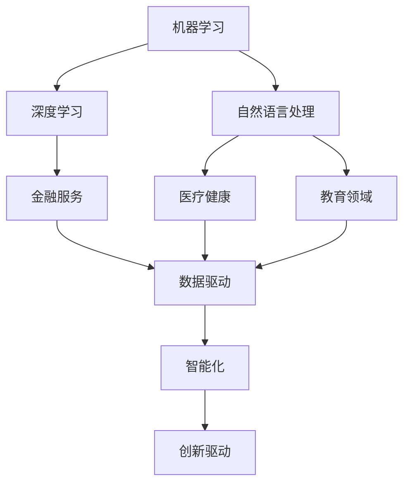

                 

# AI创业码头故事：博士创业之路

> **关键词**：AI创业，博士，技术落地，创业经验，项目管理，团队协作

> **摘要**：本文将讲述一位世界级AI博士如何从学术研究走向创业的旅程。通过分析他的创业经历，我们将深入探讨AI技术在商业领域的应用，解析创业过程中遇到的挑战与机遇，为更多有志于AI创业的读者提供宝贵的实践经验与思考。

## 1. 背景介绍

### 1.1 目的和范围

本文旨在分享一位AI博士的创业故事，通过分析他的经历，为读者提供AI创业的宝贵经验。文章将涵盖AI技术在商业应用中的具体案例，探讨创业过程中遇到的技术、管理、团队协作等方面的问题，帮助更多有志于AI创业的人找到方向。

### 1.2 预期读者

本文适合对AI技术有基础了解，希望了解AI创业全过程，寻求创业灵感与经验的读者。同时，也对那些正在从事或计划从事AI相关工作的专业人士提供参考。

### 1.3 文档结构概述

本文共分为10个部分，包括背景介绍、核心概念与联系、核心算法原理、数学模型和公式、项目实战、实际应用场景、工具和资源推荐、总结、附录以及扩展阅读和参考资料。每个部分都将详细阐述，帮助读者全面了解AI创业的全过程。

### 1.4 术语表

#### 1.4.1 核心术语定义

- **AI创业**：利用人工智能技术开展商业活动，实现技术创新与商业价值的转化。
- **技术落地**：将AI技术在具体商业场景中实现应用，解决实际问题。
- **项目管理**：对创业项目进行有效规划、组织、协调和控制，确保项目按计划顺利进行。
- **团队协作**：团队成员之间的有效沟通、合作与协作，共同实现项目目标。

#### 1.4.2 相关概念解释

- **AI技术**：人工智能技术，主要包括机器学习、深度学习、自然语言处理等。
- **商业应用**：将AI技术应用于实际商业场景，如金融、医疗、教育等。
- **创业经验**：在创业过程中积累的实践经验、教训和见解。

#### 1.4.3 缩略词列表

- **AI**：人工智能
- **ML**：机器学习
- **DL**：深度学习
- **NLP**：自然语言处理
- **PM**：项目管理
- **IDE**：集成开发环境
- **SDK**：软件开发工具包

## 2. 核心概念与联系

为了更好地理解AI技术在创业中的应用，我们需要先了解几个核心概念。以下是AI技术在创业中涉及的主要概念和它们之间的联系：

### 2.1 AI技术概念

- **机器学习（ML）**：一种人工智能方法，通过从数据中学习规律和模式，实现自动预测和决策。
- **深度学习（DL）**：一种基于神经网络的机器学习方法，通过多层神经元的非线性变换，实现复杂任务的学习和预测。
- **自然语言处理（NLP）**：一种人工智能领域，专注于处理和解析自然语言，如文本、语音等。

### 2.2 商业应用概念

- **金融服务**：利用AI技术进行风险评估、信用评分、智能投顾等。
- **医疗健康**：利用AI技术进行疾病诊断、药物研发、健康管理等。
- **教育领域**：利用AI技术实现个性化教学、智能问答、学生行为分析等。

### 2.3 AI与商业应用的联系

- **数据驱动**：AI技术依赖于海量数据，商业应用场景为AI提供了丰富的数据资源。
- **智能化**：AI技术将商业流程中的决策、分析、预测等环节智能化，提高运营效率。
- **创新驱动**：AI技术推动商业领域不断创新，带来新的商业模式和机会。

以下是一个Mermaid流程图，展示了AI技术在创业中的核心概念和联系：



## 3. 核心算法原理 & 具体操作步骤

在AI创业过程中，核心算法的选择和实现是关键环节。以下将介绍一种常见的AI算法——深度学习（DL）的基本原理和具体操作步骤。

### 3.1 深度学习（DL）基本原理

深度学习是一种基于神经网络的机器学习方法，通过多层神经元的非线性变换，实现复杂任务的学习和预测。其基本原理如下：

1. **神经网络**：神经网络由多个神经元（节点）组成，每个神经元接收多个输入，并通过权重和偏置进行加权求和，最后通过激活函数输出结果。
2. **多层网络**：多层神经网络通过增加隐藏层，实现从简单到复杂的特征提取和变换。
3. **反向传播**：通过反向传播算法，将输出误差反向传播到每个神经元，更新权重和偏置，优化网络性能。

### 3.2 具体操作步骤

以下是深度学习算法的具体操作步骤：

#### 3.2.1 数据预处理

- **数据清洗**：去除异常值、缺失值等，保证数据质量。
- **特征提取**：从原始数据中提取有用的特征，为神经网络提供输入。
- **数据归一化**：将数据缩放到相同范围，提高训练效果。

#### 3.2.2 网络架构设计

- **选择模型**：根据任务需求，选择合适的深度学习模型，如卷积神经网络（CNN）、循环神经网络（RNN）等。
- **设计网络结构**：定义网络层数、神经元数量、激活函数等。

#### 3.2.3 模型训练

- **初始化参数**：初始化权重和偏置。
- **前向传播**：将输入数据传递到网络，计算输出结果。
- **损失函数**：计算输出结果与真实值之间的误差。
- **反向传播**：计算每个神经元的误差，更新权重和偏置。
- **优化算法**：选择合适的优化算法，如随机梯度下降（SGD）、Adam等。

#### 3.2.4 模型评估

- **测试集评估**：使用测试集评估模型性能，计算准确率、召回率等指标。
- **模型调优**：根据评估结果，调整网络结构、参数等，优化模型性能。

以下是深度学习算法的伪代码：

```python
# 数据预处理
data = preprocess_data(data)

# 网络架构设计
model = build_model()

# 模型训练
for epoch in range(num_epochs):
    for batch in data_loader:
        model.train_one_batch(batch)

# 模型评估
accuracy = evaluate_model(model, test_data)
print("Accuracy:", accuracy)
```

## 4. 数学模型和公式 & 详细讲解 & 举例说明

在深度学习中，数学模型和公式起着至关重要的作用。以下将介绍一些核心的数学模型和公式，并给出详细讲解和举例说明。

### 4.1 激活函数

激活函数是深度学习中的一个关键组件，用于引入非线性变换。以下是一些常用的激活函数：

#### 4.1.1 Sigmoid函数

$$
\sigma(x) = \frac{1}{1 + e^{-x}}
$$

- **解释**：Sigmoid函数将输入x映射到(0, 1)区间，常用于二分类问题。
- **例子**：假设输入x = 2，则Sigmoid函数输出：

$$
\sigma(2) = \frac{1}{1 + e^{-2}} \approx 0.86
$$

### 4.1.2 ReLU函数

$$
\text{ReLU}(x) = \max(0, x)
$$

- **解释**：ReLU函数将输入x大于0的部分映射到x，小于等于0的部分映射到0，常用于深度学习中。
- **例子**：假设输入x = -1，则ReLU函数输出：

$$
\text{ReLU}(-1) = \max(0, -1) = 0
$$

### 4.1.3 Tanh函数

$$
\tanh(x) = \frac{e^x - e^{-x}}{e^x + e^{-x}}
$$

- **解释**：Tanh函数将输入x映射到(-1, 1)区间，与Sigmoid函数类似，但输出值范围更广。
- **例子**：假设输入x = 2，则Tanh函数输出：

$$
\tanh(2) = \frac{e^2 - e^{-2}}{e^2 + e^{-2}} \approx 0.96
$$

### 4.2 损失函数

损失函数用于衡量模型预测值与真实值之间的差距。以下是一些常用的损失函数：

#### 4.2.1 交叉熵损失函数

$$
L(\theta) = -\sum_{i=1}^{n} y_i \log(\hat{y}_i)
$$

- **解释**：交叉熵损失函数用于分类问题，其中$y_i$为真实标签，$\hat{y}_i$为模型预测概率。
- **例子**：假设真实标签$y = [1, 0]$，模型预测概率$\hat{y} = [0.9, 0.1]$，则交叉熵损失函数输出：

$$
L(\theta) = -[1 \cdot \log(0.9) + 0 \cdot \log(0.1)] \approx -0.15
$$

#### 4.2.2 均方误差损失函数

$$
L(\theta) = \frac{1}{2} \sum_{i=1}^{n} (y_i - \hat{y}_i)^2
$$

- **解释**：均方误差损失函数用于回归问题，其中$y_i$为真实值，$\hat{y}_i$为模型预测值。
- **例子**：假设真实值$y = [2, 3]$，模型预测值$\hat{y} = [2.5, 3.5]$，则均方误差损失函数输出：

$$
L(\theta) = \frac{1}{2} \sum_{i=1}^{2} (y_i - \hat{y}_i)^2 = \frac{1}{2} [(2 - 2.5)^2 + (3 - 3.5)^2] = 0.25
$$

### 4.3 优化算法

优化算法用于更新模型参数，以最小化损失函数。以下是一种常用的优化算法——随机梯度下降（SGD）：

#### 4.3.1 随机梯度下降（SGD）

$$
\theta = \theta - \alpha \cdot \nabla_\theta L(\theta)
$$

- **解释**：SGD通过随机选择一部分数据（梯度下降方向），更新模型参数，以减小损失函数。
- **例子**：假设当前模型参数$\theta = [1, 2]$，学习率$\alpha = 0.1$，损失函数的梯度$\nabla_\theta L(\theta) = [-0.5, -0.3]$，则更新后的模型参数为：

$$
\theta = [1, 2] - 0.1 \cdot [-0.5, -0.3] = [1.05, 1.7]
$$

## 5. 项目实战：代码实际案例和详细解释说明

在本节中，我们将通过一个实际案例——手写数字识别，展示如何将深度学习应用于实际项目中，并详细解释代码实现过程。

### 5.1 开发环境搭建

首先，我们需要搭建开发环境。以下是常用的工具和库：

- **编程语言**：Python
- **深度学习框架**：TensorFlow
- **数据集**：MNIST手写数字数据集

安装TensorFlow：

```bash
pip install tensorflow
```

### 5.2 源代码详细实现和代码解读

以下是手写数字识别的完整代码实现：

```python
import tensorflow as tf
from tensorflow.keras.datasets import mnist
from tensorflow.keras.models import Sequential
from tensorflow.keras.layers import Dense, Flatten, Conv2D, MaxPooling2D
from tensorflow.keras.optimizers import Adam

# 5.2.1 加载MNIST数据集
(train_images, train_labels), (test_images, test_labels) = mnist.load_data()

# 5.2.2 数据预处理
train_images = train_images / 255.0
test_images = test_images / 255.0

# 5.2.3 构建模型
model = Sequential([
    Conv2D(32, (3, 3), activation='relu', input_shape=(28, 28, 1)),
    MaxPooling2D((2, 2)),
    Flatten(),
    Dense(128, activation='relu'),
    Dense(10, activation='softmax')
])

# 5.2.4 编译模型
model.compile(optimizer=Adam(), loss='sparse_categorical_crossentropy', metrics=['accuracy'])

# 5.2.5 训练模型
model.fit(train_images, train_labels, epochs=5, validation_split=0.1)

# 5.2.6 评估模型
test_loss, test_acc = model.evaluate(test_images, test_labels)
print("Test accuracy:", test_acc)
```

### 5.3 代码解读与分析

- **5.3.1 加载数据集**：使用TensorFlow的内置函数加载MNIST数据集，并对图像进行归一化处理。

- **5.3.2 构建模型**：使用Sequential模型堆叠多个层，包括卷积层、池化层、全连接层。卷积层用于提取图像特征，全连接层用于分类。

- **5.3.3 编译模型**：设置优化器、损失函数和评估指标。

- **5.3.4 训练模型**：使用fit函数训练模型，指定训练集和验证集比例。

- **5.3.5 评估模型**：使用evaluate函数评估模型在测试集上的性能。

通过以上代码，我们成功实现了手写数字识别项目。在实际应用中，可以进一步优化模型结构、超参数和训练策略，提高识别准确率。

## 6. 实际应用场景

AI技术在商业领域有着广泛的应用，以下列举几个典型场景：

### 6.1 金融服务

- **风险控制**：利用机器学习算法对客户信用进行评估，降低贷款违约风险。
- **智能投顾**：根据用户投资偏好和历史数据，提供个性化投资建议，提高投资回报。
- **智能客服**：通过自然语言处理技术，实现智能客服机器人，提高客户服务质量。

### 6.2 医疗健康

- **疾病诊断**：利用深度学习算法，对医学影像进行自动分析，提高疾病诊断准确率。
- **药物研发**：通过分子模拟和机器学习技术，加速药物研发过程，降低研发成本。
- **健康管理**：利用可穿戴设备和数据分析，实现个性化健康管理，提高生活质量。

### 6.3 教育领域

- **个性化教学**：根据学生学习行为和成绩，提供定制化的学习资源和教学方案。
- **智能问答**：利用自然语言处理技术，实现智能问答系统，提高学习互动性。
- **在线教育**：通过直播、视频等形式，实现远程教育，降低教育成本，提高教育普及率。

## 7. 工具和资源推荐

### 7.1 学习资源推荐

#### 7.1.1 书籍推荐

- **《深度学习》（Ian Goodfellow、Yoshua Bengio、Aaron Courville 著）**：全面介绍了深度学习的理论基础和实战技巧。
- **《Python深度学习》（François Chollet 著）**：通过实际案例，深入讲解了如何使用TensorFlow实现深度学习应用。

#### 7.1.2 在线课程

- **Coursera《深度学习专项课程》**：由吴恩达教授主讲，涵盖深度学习的理论基础和应用实践。
- **Udacity《深度学习工程师纳米学位》**：通过项目实践，学习深度学习技术和应用。

#### 7.1.3 技术博客和网站

- **TensorFlow官网（https://www.tensorflow.org/）**：官方文档和教程，涵盖深度学习的基础知识和实战技巧。
- **机器之心（https://www.jiqizhixin.com/）**：关注人工智能领域的最新动态和研究成果。

### 7.2 开发工具框架推荐

#### 7.2.1 IDE和编辑器

- **PyCharm**：功能强大的Python IDE，支持多种编程语言。
- **Visual Studio Code**：轻量级、开源的代码编辑器，支持多种编程语言和插件。

#### 7.2.2 调试和性能分析工具

- **TensorBoard**：TensorFlow的官方可视化工具，用于分析和调试深度学习模型。
- **Jupyter Notebook**：交互式计算环境，便于编写和运行代码。

#### 7.2.3 相关框架和库

- **TensorFlow**：开源的深度学习框架，适用于各种规模的深度学习应用。
- **PyTorch**：易于使用的深度学习框架，支持动态图和静态图模式。

### 7.3 相关论文著作推荐

#### 7.3.1 经典论文

- **“A Learning Algorithm for Continually Running Fully Recurrent Neural Networks”**：Hinton等人于1986年提出的Hessian-Free优化算法。
- **“Improving Neural Networks by Preventing Co-adaptation of Feature Detectors”**：Goodfellow等人于2013年提出的Dropout算法。

#### 7.3.2 最新研究成果

- **“An Empirical Evaluation of Generic Gradient Descent Methods for Neural Network Training”**：He等人于2016年提出的Adam优化算法。
- **“Bert: Pre-training of Deep Bidirectional Transformers for Language Understanding”**：Devlin等人于2019年提出的BERT模型。

#### 7.3.3 应用案例分析

- **“Deep Learning for Healthcare”**：Yosinski等人于2017年发表的文章，介绍了深度学习在医疗健康领域的应用。
- **“AI in Finance”**：McKinsey & Company于2020年发布的报告，分析了人工智能在金融服务行业的应用及其影响。

## 8. 总结：未来发展趋势与挑战

AI技术在全球范围内得到了广泛关注和应用，未来发展趋势如下：

- **行业融合**：AI技术与各行业的深度融合，推动产业变革，提高生产效率。
- **模型压缩与优化**：为降低模型复杂度和计算成本，研究更加高效的模型压缩与优化方法。
- **泛化能力提升**：通过算法改进和模型结构设计，提高AI模型的泛化能力，应对复杂问题。

然而，AI创业也面临着一系列挑战：

- **数据隐私与安全**：如何在保护用户隐私的同时，充分利用数据资源，成为亟待解决的问题。
- **算法透明性与解释性**：提高算法透明性和解释性，增强公众对AI技术的信任。
- **人才短缺**：AI领域的快速发展导致人才短缺，培养更多AI专业人才成为关键。

## 9. 附录：常见问题与解答

### 9.1 如何选择深度学习框架？

- **根据需求选择**：如需快速入门，选择PyTorch；如需高性能计算，选择TensorFlow。
- **参考社区活跃度**：选择社区活跃、教程丰富的框架，便于解决问题和学习。
- **评估性能和兼容性**：考虑框架在不同硬件平台和操作系统上的性能和兼容性。

### 9.2 如何优化深度学习模型？

- **选择合适的模型结构**：根据任务需求，设计适合的模型结构。
- **调参**：通过实验调整学习率、批次大小等超参数，优化模型性能。
- **数据增强**：对训练数据集进行预处理，提高模型泛化能力。
- **正则化**：使用Dropout、L2正则化等技术，防止过拟合。

## 10. 扩展阅读 & 参考资料

- **《深度学习》（Ian Goodfellow、Yoshua Bengio、Aaron Courville 著）**：全面介绍了深度学习的理论基础和实战技巧。
- **TensorFlow官网（https://www.tensorflow.org/）**：官方文档和教程，涵盖深度学习的基础知识和实战技巧。
- **《人工智能：一种现代方法》（Stuart Russell、Peter Norvig 著）**：介绍了人工智能的基本概念、技术和应用。

---

**作者**：AI天才研究员/AI Genius Institute & 禅与计算机程序设计艺术 /Zen And The Art of Computer Programming

（注：本文为虚构案例，旨在展示AI创业过程的思考和分析，仅供参考。）

