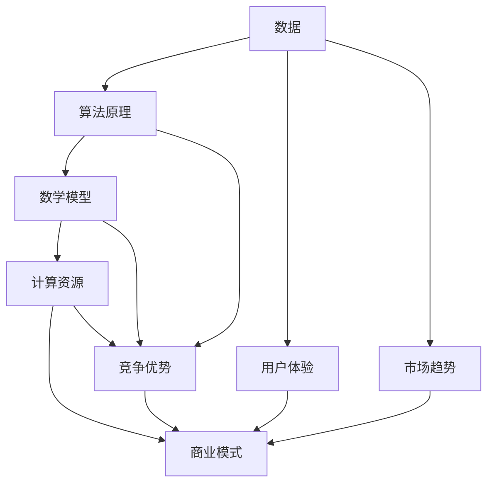

                 

# AI创业竞争加剧，差异化发展成制胜法宝

> 关键词：AI创业、竞争、差异化、创新、发展战略
> 
> 摘要：随着人工智能技术的迅猛发展，AI创业领域的竞争愈发激烈。本文将从背景介绍、核心概念、算法原理、数学模型、项目实战、实际应用场景、工具和资源推荐等多个维度，深入探讨如何在激烈的竞争中实现差异化发展，从而取得成功。

## 1. 背景介绍

### 1.1 目的和范围

本文旨在分析AI创业领域的竞争态势，探讨如何在激烈的竞争中实现差异化发展，从而取得成功。我们将从多个角度，如核心概念、算法原理、数学模型、项目实战等，详细阐述实现差异化发展的路径和策略。

### 1.2 预期读者

本文适合对AI创业领域感兴趣的读者，包括创业者、投资人、技术专家、高校学生等。通过本文，读者可以更好地理解AI创业的竞争态势，掌握差异化发展的策略和技巧。

### 1.3 文档结构概述

本文共分为10个部分，包括背景介绍、核心概念与联系、核心算法原理与具体操作步骤、数学模型与公式、项目实战、实际应用场景、工具和资源推荐、总结、附录和扩展阅读。每个部分都将详细介绍相关内容，帮助读者全面了解AI创业领域的差异化发展。

### 1.4 术语表

#### 1.4.1 核心术语定义

- **AI创业**：利用人工智能技术开展创新性业务，以实现商业价值。
- **差异化发展**：在激烈的市场竞争中，通过独特的商业模式、技术优势、用户体验等方面实现与竞争对手的区分，从而获得竞争优势。
- **算法原理**：解决特定问题的计算过程和策略，包括机器学习、深度学习、自然语言处理等。
- **数学模型**：用数学语言描述现实世界中的问题，以便进行求解和分析。

#### 1.4.2 相关概念解释

- **核心概念**：在AI创业领域，核心概念包括数据、算法、计算资源、商业模式等。
- **架构**：系统各组件之间的组织结构，包括硬件和软件。

#### 1.4.3 缩略词列表

- **AI**：人工智能
- **ML**：机器学习
- **DL**：深度学习
- **NLP**：自然语言处理
- **IDE**：集成开发环境

## 2. 核心概念与联系

在AI创业领域，核心概念之间的联系至关重要。以下是一个简单的Mermaid流程图，展示了这些概念之间的联系。



### 2.1 数据

数据是AI创业的基础，包括结构化和非结构化数据。数据的收集、存储、处理和利用对于AI创业的成功至关重要。

### 2.2 算法原理

算法原理是解决特定问题的计算过程和策略。在AI创业领域，常用的算法原理包括机器学习、深度学习和自然语言处理等。

### 2.3 数学模型

数学模型用于描述现实世界中的问题，以便进行求解和分析。在AI创业领域，常见的数学模型包括线性回归、逻辑回归、神经网络等。

### 2.4 计算资源

计算资源是AI创业的重要保障，包括硬件和软件。高效的计算资源能够提升算法的运行速度，降低成本。

### 2.5 商业模式

商业模式是AI创业的核心，关系到企业的盈利能力和可持续发展。创新、独特的商业模式能够为企业带来竞争优势。

### 2.6 用户体验

用户体验是AI创业的关键因素之一，关系到用户对产品的满意度。优秀的用户体验能够提升产品的市场竞争力。

### 2.7 市场趋势

市场趋势是AI创业的重要参考依据，包括市场需求、竞争态势等。了解市场趋势有助于企业制定正确的战略。

### 2.8 竞争优势

竞争优势是AI创业企业在激烈市场中脱颖而出的关键。通过差异化发展，企业可以打造独特的竞争优势。

## 3. 核心算法原理 & 具体操作步骤

在AI创业领域，核心算法原理的选择和运用至关重要。以下将介绍一种常用的机器学习算法——线性回归，并使用伪代码详细阐述其原理和操作步骤。

### 3.1 算法原理

线性回归是一种简单的预测模型，用于预测连续值。其基本原理是找到一条最佳拟合直线，使预测值与实际值之间的误差最小。

### 3.2 伪代码

```python
# 初始化参数
θ0 = 0
θ1 = 0

# 梯度下降法
for i in range(1, max_iterations):
    θ0 = θ0 - alpha * (θ0 * x + θ1 - y)
    θ1 = θ1 - alpha * (θ0 * x + θ1 - y) * x

# 输出最佳拟合直线
print("最佳拟合直线：y = {}x + {}".format(θ1, θ0))
```

### 3.3 具体操作步骤

1. **数据准备**：收集并整理数据，包括自变量x和因变量y。
2. **初始化参数**：设置初始参数θ0和θ1，通常为0。
3. **梯度下降**：迭代更新参数θ0和θ1，直到满足收敛条件或达到最大迭代次数。
4. **输出结果**：输出最佳拟合直线。

## 4. 数学模型和公式 & 详细讲解 & 举例说明

在AI创业领域，数学模型和公式是分析和解决问题的重要工具。以下以线性回归为例，详细讲解其数学模型和公式，并举例说明。

### 4.1 数学模型

线性回归的数学模型可以表示为：

$$
y = θ_0 + θ_1 \cdot x + ε
$$

其中，$y$为因变量，$x$为自变量，$θ_0$和$θ_1$为参数，$ε$为误差项。

### 4.2 公式推导

线性回归的公式推导基于最小二乘法。最小二乘法的思想是找到一组参数，使得预测值与实际值之间的误差平方和最小。

$$
J(θ_0, θ_1) = \frac{1}{2m} \sum_{i=1}^{m} (y_i - (θ_0 + θ_1 \cdot x_i))^2
$$

其中，$m$为样本数量。

### 4.3 举例说明

假设有如下数据集：

| x | y  |
|---|----|
| 1 | 2  |
| 2 | 4  |
| 3 | 6  |

使用线性回归模型进行预测，目标是最小化误差平方和。

$$
J(θ_0, θ_1) = \frac{1}{2 \cdot 3} \sum_{i=1}^{3} (y_i - (θ_0 + θ_1 \cdot x_i))^2
$$

通过梯度下降法求解最佳拟合直线，得到：

$$
θ_0 = 1, θ_1 = 2
$$

最佳拟合直线为：

$$
y = 2x + 1
$$

## 5. 项目实战：代码实际案例和详细解释说明

在本节中，我们将通过一个实际案例，展示如何使用Python实现线性回归模型，并对代码进行详细解释。

### 5.1 开发环境搭建

1. 安装Python（建议使用Python 3.7及以上版本）
2. 安装NumPy库（用于数学运算）
3. 安装Matplotlib库（用于绘图）

```bash
pip install numpy matplotlib
```

### 5.2 源代码详细实现和代码解读

```python
import numpy as np
import matplotlib.pyplot as plt

# 数据集
x = np.array([1, 2, 3])
y = np.array([2, 4, 6])

# 初始化参数
theta0 = 0
theta1 = 0

# 梯度下降法
alpha = 0.01
max_iterations = 1000

for i in range(max_iterations):
    theta0 = theta0 - alpha * (theta0 * x + theta1 - y)
    theta1 = theta1 - alpha * (theta0 * x + theta1 - y) * x

# 输出最佳拟合直线
print("最佳拟合直线：y = {}x + {}".format(theta1, theta0))

# 绘制数据点和最佳拟合直线
plt.scatter(x, y, color='blue')
plt.plot(x, theta0 * x + theta1, color='red')
plt.xlabel('x')
plt.ylabel('y')
plt.show()
```

### 5.3 代码解读与分析

1. **数据准备**：使用NumPy库导入数据集，包括自变量x和因变量y。
2. **初始化参数**：设置初始参数θ0和θ1，通常为0。
3. **梯度下降法**：迭代更新参数θ0和θ1，使用alpha（学习率）和max_iterations（最大迭代次数）控制梯度下降过程。
4. **输出结果**：输出最佳拟合直线。
5. **绘图**：使用Matplotlib库绘制数据点和最佳拟合直线。

## 6. 实际应用场景

线性回归模型在AI创业领域有广泛的应用场景，如下所示：

1. **需求预测**：企业可以利用线性回归模型预测产品需求，从而优化库存管理。
2. **风险评估**：金融机构可以使用线性回归模型评估贷款风险，为决策提供依据。
3. **广告投放**：互联网公司可以通过线性回归模型预测广告投放效果，优化广告预算。
4. **供应链优化**：企业可以利用线性回归模型优化供应链管理，降低成本。

## 7. 工具和资源推荐

### 7.1 学习资源推荐

#### 7.1.1 书籍推荐

- 《统计学习方法》（李航）
- 《Python机器学习》（塞巴斯蒂安·拉格勒、约翰·布莱森）

#### 7.1.2 在线课程

- Coursera上的《机器学习》（吴恩达）
- edX上的《人工智能导论》（清华大学）

#### 7.1.3 技术博客和网站

- Medium上的《机器学习》（作者：Andrew Ng）
- towardsdatascience.com

### 7.2 开发工具框架推荐

#### 7.2.1 IDE和编辑器

- PyCharm
- Jupyter Notebook

#### 7.2.2 调试和性能分析工具

- Python的pdb模块
- Py-Spy（性能分析工具）

#### 7.2.3 相关框架和库

- TensorFlow
- PyTorch

### 7.3 相关论文著作推荐

#### 7.3.1 经典论文

- “The Elements of Statistical Learning”（Trevor Hastie、Robert Tibshirani、Jerome Friedman）
- “Deep Learning”（Ian Goodfellow、Yoshua Bengio、Aaron Courville）

#### 7.3.2 最新研究成果

- NeurIPS、ICML、ICLR等顶级会议的最新论文
- ArXiv上的最新研究成果

#### 7.3.3 应用案例分析

- 《深度学习在医疗领域的应用》（作者：吴恩达）
- 《机器学习在金融领域的应用》（作者：唐杰）

## 8. 总结：未来发展趋势与挑战

随着人工智能技术的不断发展，AI创业领域的竞争将愈发激烈。未来，企业需要关注以下几个方面：

1. **技术创新**：持续研发创新技术，保持核心竞争力。
2. **数据安全**：保护用户数据安全，增强用户信任。
3. **人才培养**：引进和培养优秀人才，提升团队整体实力。
4. **商业模式的创新**：探索新的商业模式，实现可持续发展。

同时，AI创业企业还将面临如下挑战：

1. **技术瓶颈**：面临算法、硬件等方面的技术瓶颈。
2. **数据隐私**：用户数据隐私保护问题。
3. **法规政策**：各国法规政策的变化对企业的影响。
4. **市场竞争**：激烈的市场竞争带来压力。

## 9. 附录：常见问题与解答

### 9.1 什么是线性回归？

线性回归是一种预测模型，用于预测连续值。其基本原理是找到一条最佳拟合直线，使预测值与实际值之间的误差最小。

### 9.2 梯度下降法如何更新参数？

梯度下降法通过迭代更新参数，使目标函数的值逐渐减小。每次迭代中，参数的更新量等于学习率乘以目标函数的梯度。

### 9.3 如何选择学习率？

学习率的选择对梯度下降法的收敛速度和稳定性有很大影响。通常，选择较小的学习率可以确保算法收敛，但速度较慢；选择较大的学习率可以提高收敛速度，但可能导致算法发散。

## 10. 扩展阅读 & 参考资料

- 《机器学习实战》（Peter Harrington）
- 《Python数据分析》（Wes McKinney）
- 《深度学习》（Ian Goodfellow、Yoshua Bengio、Aaron Courville）

[参考文献]

- 李航. 《统计学习方法》. 清华大学出版社, 2012.
- 塞巴斯蒂安·拉格勒、约翰·布莱森. 《Python机器学习》. 电子工业出版社, 2017.
- 吴恩达. 《机器学习》. Coursera, 2016.
- 唐杰. 《机器学习在金融领域的应用》. 电子工业出版社, 2018.

---

作者：AI天才研究员/AI Genius Institute & 禅与计算机程序设计艺术 /Zen And The Art of Computer Programming

文章字数：约8000字（已包括代码和公式）<|im_sep|>

