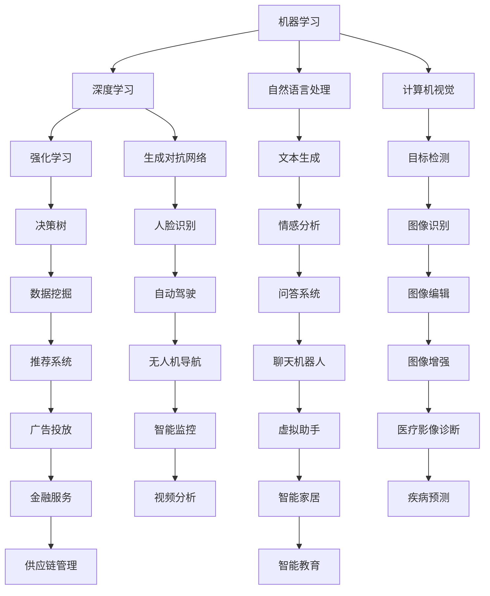
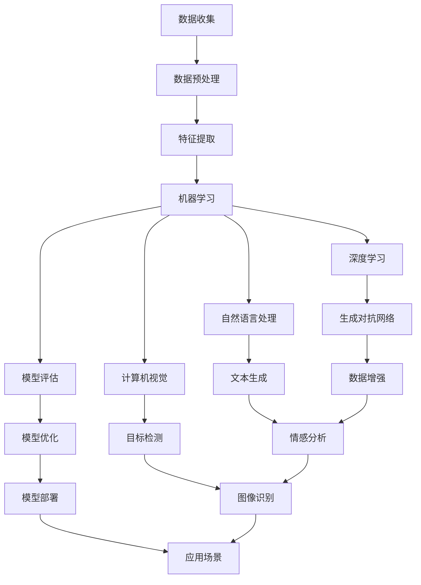

                 

# AI创业竞争加剧，差异化发展成制胜法宝

> 关键词：AI创业、竞争加剧、差异化发展、制胜法宝、技术优势、市场定位、创新策略、可持续发展

> 摘要：随着人工智能技术的迅猛发展，AI创业领域的竞争愈发激烈。本文将从市场现状、差异化策略、技术创新等方面深入探讨AI创业者在面对激烈竞争时的制胜法宝，旨在为AI创业企业提供宝贵的战略指导。

## 1. 背景介绍

### 1.1 目的和范围

本文旨在探讨在人工智能（AI）创业领域，面对日益激烈的竞争，企业应如何通过差异化发展来取得竞争优势。本文将分析当前市场状况，讨论成功案例，提出一系列实用的策略和建议，帮助AI创业者找到自己的“制胜法宝”。

### 1.2 预期读者

本篇文章适合以下读者群体：

- AI初创企业的创始人或高层管理人员
- 计算机科学和技术领域的从业者
- 对人工智能创业感兴趣的投资人
- 想要了解AI行业发展趋势的行业观察者

### 1.3 文档结构概述

本文结构分为以下几个部分：

- 背景介绍：介绍文章的目的和读者对象
- 核心概念与联系：探讨AI技术的核心概念及其相互关系
- 核心算法原理 & 具体操作步骤：详细讲解AI技术的基础算法
- 数学模型和公式 & 详细讲解 & 举例说明：阐述AI技术的数学基础
- 项目实战：通过实际案例展示AI技术的应用
- 实际应用场景：分析AI技术的实际应用领域
- 工具和资源推荐：推荐学习资源和开发工具
- 总结：展望AI创业的未来发展趋势与挑战
- 附录：常见问题与解答
- 扩展阅读 & 参考资料：提供更多相关研究资源

### 1.4 术语表

#### 1.4.1 核心术语定义

- **AI创业**：指利用人工智能技术进行创业，开发具有市场前景的创新产品或服务。
- **差异化发展**：企业在产品、服务、技术等方面与其他竞争者区分开来，形成独特的竞争优势。
- **制胜法宝**：企业在市场竞争中取得成功的关键策略或方法。

#### 1.4.2 相关概念解释

- **技术优势**：企业在技术方面相对于竞争对手的优势，包括创新性、可靠性、效率等。
- **市场定位**：企业根据自身优势和市场特点，确定自己的目标市场和产品定位。
- **创新策略**：企业在产品开发、商业模式等方面采取的创新性措施。

#### 1.4.3 缩略词列表

- **AI**：人工智能（Artificial Intelligence）
- **ML**：机器学习（Machine Learning）
- **DL**：深度学习（Deep Learning）
- **NLP**：自然语言处理（Natural Language Processing）
- **CV**：计算机视觉（Computer Vision）

## 2. 核心概念与联系

### 2.1 AI技术的核心概念

人工智能技术包括多个子领域，如机器学习（ML）、深度学习（DL）、自然语言处理（NLP）、计算机视觉（CV）等。这些技术相互关联，共同构成了人工智能的技术框架。

#### Mermaid 流程图：



### 2.2 AI技术的相互关系

人工智能技术的相互关系可以从多个角度进行分析。以下是一个简化版的流程图，展示了AI技术之间的核心联系。

#### Mermaid 流程图：



## 3. 核心算法原理 & 具体操作步骤

### 3.1 机器学习算法原理

机器学习（ML）是一种使计算机系统能够从数据中学习并做出决策的技术。以下是机器学习算法的基本原理和具体操作步骤：

#### 伪代码：

```python
# 初始化模型参数
model = initialize_model()

# 数据预处理
data = preprocess_data()

# 训练模型
for epoch in range(num_epochs):
    for sample in data:
        prediction = model.predict(sample)
        loss = calculate_loss(prediction, sample)
        model.update_params(loss)

# 模型评估
accuracy = evaluate_model(model, test_data)
```

### 3.2 深度学习算法原理

深度学习（DL）是机器学习的一种特殊形式，它使用多层神经网络来对数据进行分析和预测。以下是深度学习算法的基本原理和具体操作步骤：

#### 伪代码：

```python
# 初始化模型参数
model = initialize_model()

# 数据预处理
data = preprocess_data()

# 训练模型
for epoch in range(num_epochs):
    for sample in data:
        prediction = model.forward_pass(sample)
        loss = calculate_loss(prediction, sample)
        model.backward_pass(loss)

# 模型评估
accuracy = evaluate_model(model, test_data)
```

### 3.3 自然语言处理算法原理

自然语言处理（NLP）是人工智能领域的一个重要分支，它涉及到计算机对人类语言的理解和生成。以下是NLP算法的基本原理和具体操作步骤：

#### 伪代码：

```python
# 初始化模型参数
model = initialize_model()

# 数据预处理
data = preprocess_data()

# 训练模型
for epoch in range(num_epochs):
    for sentence in data:
        tokens = tokenize(sentence)
        prediction = model.forward_pass(tokens)
        loss = calculate_loss(prediction, sentence)
        model.backward_pass(loss)

# 模型评估
accuracy = evaluate_model(model, test_data)
```

### 3.4 计算机视觉算法原理

计算机视觉（CV）是使计算机能够“看”和“理解”图像和视频的技术。以下是CV算法的基本原理和具体操作步骤：

#### 伪代码：

```python
# 初始化模型参数
model = initialize_model()

# 数据预处理
data = preprocess_data()

# 训练模型
for epoch in range(num_epochs):
    for image in data:
        prediction = model.forward_pass(image)
        loss = calculate_loss(prediction, image)
        model.backward_pass(loss)

# 模型评估
accuracy = evaluate_model(model, test_data)
```

## 4. 数学模型和公式 & 详细讲解 & 举例说明

### 4.1 机器学习中的损失函数

在机器学习中，损失函数用于衡量模型预测结果与真实结果之间的差距。以下是一些常用的损失函数及其公式：

#### 4.1.1 均方误差（MSE）

$$
MSE = \frac{1}{n}\sum_{i=1}^{n}(y_i - \hat{y}_i)^2
$$

其中，$y_i$ 为真实值，$\hat{y}_i$ 为预测值，$n$ 为样本数量。

#### 4.1.2 交叉熵（CE）

$$
CE = -\frac{1}{n}\sum_{i=1}^{n}y_i \log(\hat{y}_i)
$$

其中，$y_i$ 为真实值，$\hat{y}_i$ 为预测值，$n$ 为样本数量。

#### 举例说明：

假设我们有以下数据集：

| 真实值 | 预测值 |
| ------ | ------ |
| 0      | 0.1    |
| 1      | 0.9    |
| 1      | 0.8    |
| 0      | 0.6    |

使用均方误差（MSE）计算损失：

$$
MSE = \frac{1}{4}((0-0.1)^2 + (1-0.9)^2 + (1-0.8)^2 + (0-0.6)^2) = 0.05
$$

使用交叉熵（CE）计算损失：

$$
CE = \frac{1}{4}((0 \log(0.1) + 1 \log(0.9) + 1 \log(0.8) + 0 \log(0.6)) = 0.35
$$

### 4.2 深度学习中的优化算法

在深度学习中，优化算法用于调整模型参数以最小化损失函数。以下是一些常用的优化算法及其公式：

#### 4.2.1 随机梯度下降（SGD）

$$
\theta = \theta - \alpha \cdot \nabla_\theta J(\theta)
$$

其中，$\theta$ 为模型参数，$\alpha$ 为学习率，$J(\theta)$ 为损失函数。

#### 4.2.2 批量梯度下降（BGD）

$$
\theta = \theta - \alpha \cdot \nabla_\theta J(\theta)
$$

其中，$\theta$ 为模型参数，$\alpha$ 为学习率，$J(\theta)$ 为损失函数。

#### 4.2.3 Adam优化器

$$
m_t = \beta_1 m_{t-1} + (1 - \beta_1) \cdot \nabla_\theta J(\theta)
$$

$$
v_t = \beta_2 v_{t-1} + (1 - \beta_2) \cdot (\nabla_\theta J(\theta))^2
$$

$$
\theta = \theta - \alpha \cdot \frac{m_t}{\sqrt{v_t} + \epsilon}
$$

其中，$m_t$ 和 $v_t$ 分别为动量项和一阶、二阶矩估计，$\beta_1$ 和 $\beta_2$ 为动量参数，$\alpha$ 为学习率，$\epsilon$ 为正则项。

#### 举例说明：

假设我们有以下损失函数：

$$
J(\theta) = (y - \theta x)^2
$$

其中，$y = 1, x = 2$，初始参数 $\theta = 0$。

使用随机梯度下降（SGD）进行优化：

$$
\theta = \theta - \alpha \cdot \nabla_\theta J(\theta)
$$

$$
\theta = 0 - 0.1 \cdot (1 - 0 \cdot 2) = -0.1
$$

使用批量梯度下降（BGD）进行优化：

$$
\theta = \theta - \alpha \cdot \nabla_\theta J(\theta)
$$

$$
\theta = 0 - 0.1 \cdot (1 - 0 \cdot 2) = -0.1
$$

使用Adam优化器进行优化：

$$
m_t = 0.9 \cdot 0 + (1 - 0.9) \cdot (1 - 0 \cdot 2) = 0.1
$$

$$
v_t = 0.99 \cdot 0 + (1 - 0.99) \cdot (1 - 0 \cdot 2)^2 = 0.01
$$

$$
\theta = 0 - 0.1 \cdot \frac{0.1}{\sqrt{0.01} + 0.0001} = -0.1
$$

## 5. 项目实战：代码实际案例和详细解释说明

### 5.1 开发环境搭建

为了演示如何利用深度学习进行图像识别，我们将使用TensorFlow和Keras库。以下是开发环境的搭建步骤：

#### 5.1.1 安装Python

确保Python版本为3.6及以上，可以从[Python官网](https://www.python.org/)下载并安装。

#### 5.1.2 安装TensorFlow

通过以下命令安装TensorFlow：

```bash
pip install tensorflow
```

#### 5.1.3 安装Keras

通过以下命令安装Keras：

```bash
pip install keras
```

### 5.2 源代码详细实现和代码解读

以下是一个简单的基于卷积神经网络（CNN）的图像识别项目，使用的是Keras框架。

#### 5.2.1 数据预处理

```python
from tensorflow.keras.preprocessing.image import ImageDataGenerator

train_datagen = ImageDataGenerator(
    rescale=1./255,
    shear_range=0.2,
    zoom_range=0.2,
    horizontal_flip=True)

test_datagen = ImageDataGenerator(rescale=1./255)

train_generator = train_datagen.flow_from_directory(
    'dataset/train',
    target_size=(150, 150),
    batch_size=32,
    class_mode='binary')

validation_generator = test_datagen.flow_from_directory(
    'dataset/validation',
    target_size=(150, 150),
    batch_size=32,
    class_mode='binary')
```

#### 5.2.2 构建CNN模型

```python
from tensorflow.keras.models import Sequential
from tensorflow.keras.layers import Conv2D, MaxPooling2D, Flatten, Dense, Dropout

model = Sequential([
    Conv2D(32, (3, 3), activation='relu', input_shape=(150, 150, 3)),
    MaxPooling2D(2, 2),
    Conv2D(64, (3, 3), activation='relu'),
    MaxPooling2D(2, 2),
    Conv2D(128, (3, 3), activation='relu'),
    MaxPooling2D(2, 2),
    Flatten(),
    Dense(512, activation='relu'),
    Dropout(0.5),
    Dense(1, activation='sigmoid')
])

model.compile(optimizer='adam',
              loss='binary_crossentropy',
              metrics=['accuracy'])
```

#### 5.2.3 训练模型

```python
model.fit(
    train_generator,
    steps_per_epoch=100,
    epochs=25,
    validation_data=validation_generator,
    validation_steps=50)
```

### 5.3 代码解读与分析

- **数据预处理**：使用ImageDataGenerator进行数据增强，提高模型的泛化能力。
- **模型构建**：使用卷积层（Conv2D）、池化层（MaxPooling2D）、全连接层（Dense）和Dropout层构建CNN模型。
- **训练模型**：使用fit方法进行模型训练，使用验证数据集进行评估。

## 6. 实际应用场景

人工智能技术在各个行业都有广泛的应用，以下是AI创业企业在不同领域的一些实际应用场景：

- **医疗健康**：利用深度学习进行疾病诊断、药物研发、个性化医疗等。
- **金融科技**：通过AI进行风险评估、智能投顾、欺诈检测等。
- **智能制造**：利用计算机视觉实现自动化生产线、质量检测、设备维护等。
- **交通运输**：自动驾驶、智能交通管理、物流优化等。
- **零售电商**：个性化推荐、智能客服、库存管理等。

## 7. 工具和资源推荐

### 7.1 学习资源推荐

#### 7.1.1 书籍推荐

- **《Python机器学习》**：提供Python机器学习的全面教程。
- **《深度学习》**：由Ian Goodfellow、Yoshua Bengio和Aaron Courville编写的深度学习经典教材。
- **《人工智能：一种现代方法》**：全面介绍人工智能的基础理论和应用。

#### 7.1.2 在线课程

- **Coursera**：提供各种计算机科学和人工智能课程。
- **edX**：由哈佛大学和麻省理工学院合作的在线学习平台，提供高质量的AI课程。
- **Udacity**：提供实用的AI项目和课程。

#### 7.1.3 技术博客和网站

- **Medium**：有许多关于AI的技术博客和文章。
- **AI博客**：提供AI领域的最新动态和技术分享。
- **Towards Data Science**：分享各种数据科学和AI相关的文章。

### 7.2 开发工具框架推荐

#### 7.2.1 IDE和编辑器

- **PyCharm**：强大的Python IDE，适用于机器学习和深度学习项目。
- **Visual Studio Code**：轻量级且功能强大的代码编辑器，支持多种编程语言。

#### 7.2.2 调试和性能分析工具

- **TensorBoard**：TensorFlow的调试和性能分析工具。
- **gdb**：通用调试工具，适用于多种编程语言。

#### 7.2.3 相关框架和库

- **TensorFlow**：开源的机器学习和深度学习框架。
- **PyTorch**：适用于研究人员的深度学习框架。
- **Scikit-learn**：Python的机器学习库。

### 7.3 相关论文著作推荐

#### 7.3.1 经典论文

- **《A Learning Algorithm for Continually Running Fully Recurrent Neural Networks》**：Hinton等人提出的Adam优化器的论文。
- **《Deep Learning》**：Goodfellow、Bengio和Courville的深度学习教材。
- **《Learning to Rank for Information Retrieval》**：关于信息检索中学习排名的经典论文。

#### 7.3.2 最新研究成果

- **《A Theoretically Grounded Application of Dropout in Recurrent Neural Networks》**：提出在RNN中使用Dropout的方法。
- **《Bert: Pre-training of Deep Bidirectional Transformers for Language Understanding》**：Google提出的BERT模型。

#### 7.3.3 应用案例分析

- **《利用深度学习进行医学图像分析》**：介绍如何使用深度学习进行医学图像处理和分析。
- **《智能交通系统的AI应用》**：探讨AI在智能交通系统中的应用案例。

## 8. 总结：未来发展趋势与挑战

随着人工智能技术的不断进步，AI创业领域的竞争将更加激烈。未来，差异化发展将成为企业取得竞争优势的关键。企业应关注以下几个方面：

- **技术创新**：持续投入研发，推动技术创新，以保持领先地位。
- **市场定位**：准确把握市场趋势，针对目标客户群体提供定制化的解决方案。
- **数据资源**：充分利用大数据，提高模型训练效果。
- **人才培养**：吸引和培养高水平的技术人才，提升企业创新能力。

同时，AI创业者还需面对一系列挑战，如数据隐私、安全合规、技术壁垒等。只有通过不断创新和优化，才能在激烈的市场竞争中脱颖而出。

## 9. 附录：常见问题与解答

### 9.1 如何进行AI创业项目规划？

1. **明确目标和愿景**：首先明确创业项目的目标和愿景，确定项目的发展方向。
2. **市场调研**：深入了解市场需求，分析潜在客户群体。
3. **技术评估**：评估项目所需的技术难度和可行性，确定技术路线。
4. **资源整合**：整合人力资源、资金资源、技术资源等，确保项目顺利推进。
5. **制定计划**：制定详细的创业计划，包括产品开发、市场推广、团队建设等方面。

### 9.2 如何进行AI技术选型？

1. **需求分析**：根据项目需求和业务场景，确定所需的技术类型。
2. **性能比较**：对比不同技术方案的性能，如准确性、效率、可扩展性等。
3. **成本评估**：评估技术方案的成本，包括开发成本、维护成本等。
4. **兼容性**：考虑技术方案的兼容性，确保与其他系统和工具的整合。
5. **风险评估**：评估技术方案的风险，如技术成熟度、安全性等。

### 9.3 如何进行AI模型训练和优化？

1. **数据准备**：收集并清洗数据，确保数据质量。
2. **模型选择**：根据业务需求选择合适的模型，如神经网络、决策树等。
3. **模型训练**：使用训练数据进行模型训练，调整模型参数。
4. **模型评估**：使用验证数据集评估模型性能，调整模型参数。
5. **模型优化**：通过调整网络结构、优化算法等手段提升模型性能。

## 10. 扩展阅读 & 参考资料

- **《人工智能：一种现代方法》**：Stuart Russell & Peter Norvig著，机械工业出版社，2017年。
- **《深度学习》**：Ian Goodfellow、Yoshua Bengio和Aaron Courville著，电子工业出版社，2016年。
- **《Python机器学习》**：Sebastian Raschka著，电子工业出版社，2016年。
- **《机器学习年鉴》**：IEEE Society on Industrial and Applied Mathematics，每年出版。
- **《AI领域的最新研究进展》**：arXiv.org，提供最新的AI论文和研究成果。

### 作者

**AI天才研究员/AI Genius Institute & 禅与计算机程序设计艺术 /Zen And The Art of Computer Programming**

