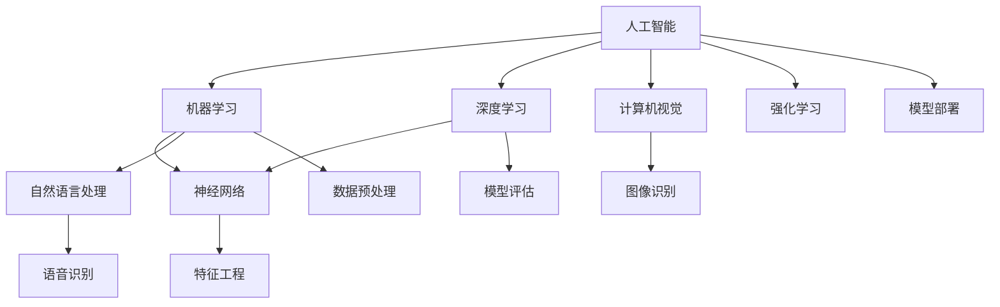

                 

# AI创业者的码头愿景：AI助力美好生活

> **关键词：** AI创业，智能应用，生活改善，技术创新，行业挑战
> 
> **摘要：** 本文将深入探讨AI技术在创业领域的应用潜力，探讨如何利用AI技术改善人们的生活质量，并提供具体的实施路径和技术框架。我们将从背景介绍、核心概念、算法原理、数学模型、实战案例、应用场景、资源推荐等多个角度进行全面分析，为AI创业者和从业者提供宝贵的指导。

## 1. 背景介绍

### 1.1 目的和范围

本文旨在为AI创业者提供一个全方位的技术视角，以理解AI技术在改善人们生活方面的潜力。我们将探讨以下内容：

- AI技术在各个行业中的应用现状和趋势。
- AI技术的核心概念、原理及其实施步骤。
- 数学模型和算法在AI应用中的具体作用。
- 实际项目中的代码实现和案例分析。
- AI技术在不同领域的应用场景和挑战。

### 1.2 预期读者

本文适合以下读者群体：

- 有志于从事AI创业的个人和团队。
- 对AI技术感兴趣的技术从业者。
- 对智能应用和生活改善有研究需求的学者和专家。
- 对AI行业有深刻洞察的投资人和政策制定者。

### 1.3 文档结构概述

本文结构如下：

1. **背景介绍**：介绍文章目的、预期读者和文档结构。
2. **核心概念与联系**：介绍AI技术的核心概念及其关联。
3. **核心算法原理 & 具体操作步骤**：讲解AI算法的原理和操作步骤。
4. **数学模型和公式 & 详细讲解 & 举例说明**：介绍数学模型在AI中的应用。
5. **项目实战：代码实际案例和详细解释说明**：通过实际案例展示AI技术应用。
6. **实际应用场景**：探讨AI技术在各个领域的应用。
7. **工具和资源推荐**：推荐相关学习资源和开发工具。
8. **总结：未来发展趋势与挑战**：分析AI技术的未来趋势和面临的挑战。
9. **附录：常见问题与解答**：解答读者可能遇到的常见问题。
10. **扩展阅读 & 参考资料**：提供扩展阅读资源。

### 1.4 术语表

#### 1.4.1 核心术语定义

- **人工智能（AI）**：模拟人类智能行为的计算机系统。
- **机器学习（ML）**：利用数据训练模型以实现特定任务的技术。
- **深度学习（DL）**：一种特殊的机器学习技术，使用多层神经网络。
- **神经网络（NN）**：模仿生物神经元的计算模型。
- **自然语言处理（NLP）**：使计算机能够理解、解释和生成人类语言的技术。
- **计算机视觉（CV）**：使计算机能够理解和解释图像或视频的技术。

#### 1.4.2 相关概念解释

- **监督学习（SL）**：使用标注数据进行模型训练。
- **无监督学习（USL）**：在没有标注数据的情况下训练模型。
- **强化学习（RL）**：通过奖励和惩罚来训练模型。
- **特征工程（FE）**：选择和构建有助于模型训练的特征。
- **模型评估（ME）**：评估模型性能的指标和方法。

#### 1.4.3 缩略词列表

- **AI**：人工智能
- **ML**：机器学习
- **DL**：深度学习
- **NN**：神经网络
- **NLP**：自然语言处理
- **CV**：计算机视觉
- **SL**：监督学习
- **USL**：无监督学习
- **RL**：强化学习
- **FE**：特征工程
- **ME**：模型评估

## 2. 核心概念与联系

在探讨AI技术在创业领域的应用之前，我们需要先了解一些核心概念和其相互之间的联系。以下是一个简化的Mermaid流程图，展示了AI技术中的几个关键概念及其关联。



### 2.1 人工智能（AI）

人工智能是一种模拟人类智能行为的计算机技术，包括学习、推理、规划、感知、理解和通信等多个方面。AI技术可以应用于各种领域，如医疗、金融、教育、制造等。

### 2.2 机器学习（ML）

机器学习是AI的一个分支，通过利用数据来训练模型以实现特定任务。机器学习模型可以识别模式、预测结果、分类数据等。

### 2.3 深度学习（DL）

深度学习是一种特殊的机器学习技术，使用多层神经网络（NN）来模拟人类大脑的学习过程。深度学习在图像识别、语音识别和自然语言处理等领域表现出色。

### 2.4 神经网络（NN）

神经网络是一种模仿生物神经元的计算模型。每个神经元都与其他神经元相连，并基于输入数据进行加权求和处理。

### 2.5 自然语言处理（NLP）

自然语言处理是一种使计算机能够理解、解释和生成人类语言的技术。NLP在智能客服、文本分类和机器翻译等领域有广泛应用。

### 2.6 计算机视觉（CV）

计算机视觉是一种使计算机能够理解和解释图像或视频的技术。CV在图像识别、物体检测和视频分析等领域有重要应用。

### 2.7 强化学习（RL）

强化学习是一种通过奖励和惩罚来训练模型的技术。RL在游戏、机器人控制和自动驾驶等领域表现出色。

### 2.8 特征工程（FE）

特征工程是选择和构建有助于模型训练的特征的过程。特征工程是机器学习模型成功的关键。

### 2.9 模型评估（ME）

模型评估是评估模型性能的指标和方法。常用的评估指标包括准确率、召回率、F1分数等。

### 2.10 模型部署（M）

模型部署是将训练好的模型部署到实际应用环境中的过程。模型部署是实现AI应用的关键步骤。

通过上述核心概念及其相互关系的理解，我们可以更好地把握AI技术在创业领域的应用潜力。

## 3. 核心算法原理 & 具体操作步骤

### 3.1 机器学习算法原理

机器学习算法的核心目标是根据训练数据来学习一个函数，以便在未知数据上进行预测或分类。这个过程主要包括以下几个步骤：

#### 3.1.1 数据收集

首先，我们需要收集大量的数据作为训练集。这些数据可以是结构化的表格数据，也可以是非结构化的文本、图像或音频。

#### 3.1.2 数据预处理

数据预处理是机器学习过程中的重要步骤，包括数据清洗、归一化、缺失值处理等。数据预处理有助于提高模型的训练效率和性能。

#### 3.1.3 特征选择与构建

特征选择与构建是选择和构造有助于模型训练的特征的过程。特征选择可以去除冗余特征，提高模型训练速度；特征构建可以提取新的特征，增强模型的预测能力。

#### 3.1.4 模型选择与训练

在选择合适的模型之后，我们需要使用训练数据来训练模型。训练过程包括优化模型参数、更新模型权重等，直到模型达到预定的性能指标。

#### 3.1.5 模型评估与调整

在模型训练完成后，我们需要使用验证集或测试集来评估模型性能。根据评估结果，我们可以调整模型参数或重新选择模型。

### 3.2 深度学习算法原理

深度学习算法是机器学习的一个分支，它通过多层神经网络来模拟人类大脑的学习过程。以下是深度学习算法的主要步骤：

#### 3.2.1 神经网络架构设计

设计神经网络架构，包括输入层、隐藏层和输出层。每层包含多个神经元，神经元之间通过权重相连。

#### 3.2.2 激活函数选择

选择合适的激活函数，如ReLU、Sigmoid、Tanh等，用于引入非线性变换，使神经网络能够学习复杂的函数。

#### 3.2.3 前向传播与反向传播

在训练过程中，神经网络通过前向传播将输入数据传递到输出层，计算预测结果；然后通过反向传播更新模型参数，以减少预测误差。

#### 3.2.4 损失函数选择

选择合适的损失函数，如均方误差（MSE）、交叉熵（Cross Entropy）等，用于评估预测结果与真实结果之间的差距。

#### 3.2.5 优化器选择

选择合适的优化器，如随机梯度下降（SGD）、Adam等，用于更新模型参数，以最小化损失函数。

### 3.3 自然语言处理算法原理

自然语言处理算法是使计算机能够理解、解释和生成人类语言的技术。以下是NLP算法的主要步骤：

#### 3.3.1 文本预处理

文本预处理包括分词、去停用词、词性标注等步骤，以将原始文本转换为适合模型处理的格式。

#### 3.3.2 词向量表示

使用词向量模型，如Word2Vec、GloVe等，将文本中的单词转换为高维向量表示，以捕获单词的语义信息。

#### 3.3.3 模型训练

使用训练数据训练语言模型或序列标注模型，如循环神经网络（RNN）、长短时记忆网络（LSTM）、变换器（Transformer）等。

#### 3.3.4 生成与解释

利用训练好的模型进行文本生成或解释，如机器翻译、文本分类、情感分析等。

### 3.4 计算机视觉算法原理

计算机视觉算法是使计算机能够理解和解释图像或视频的技术。以下是CV算法的主要步骤：

#### 3.4.1 图像预处理

图像预处理包括图像去噪、缩放、增强等步骤，以提高模型训练效果。

#### 3.4.2 特征提取

使用特征提取算法，如卷积神经网络（CNN）、池化层等，从图像中提取具有区分性的特征。

#### 3.4.3 目标检测

使用目标检测算法，如YOLO、SSD、Faster R-CNN等，识别图像中的目标并定位其位置。

#### 3.4.4 语义分割

使用语义分割算法，如U-Net、DeepLab V3+、PSPNet等，对图像中的每个像素进行分类。

#### 3.4.5 视频分析

使用视频分析算法，如光流、动作识别等，对视频中的动作进行识别和分析。

通过上述核心算法原理和具体操作步骤的介绍，我们可以更好地理解AI技术的实现过程，为创业项目的成功奠定基础。

## 4. 数学模型和公式 & 详细讲解 & 举例说明

### 4.1 机器学习中的损失函数

在机器学习中，损失函数用于评估模型预测结果与真实结果之间的差距。以下是几种常见的损失函数及其公式：

#### 4.1.1 均方误差（MSE）

均方误差是衡量回归模型预测结果误差的一种常用损失函数，其公式为：

$$
MSE = \frac{1}{n} \sum_{i=1}^{n} (y_i - \hat{y_i})^2
$$

其中，$y_i$ 是真实值，$\hat{y_i}$ 是预测值，$n$ 是数据点的总数。

#### 4.1.2 交叉熵（Cross Entropy）

交叉熵是衡量分类模型预测结果误差的一种常用损失函数，其公式为：

$$
CrossEntropy = -\frac{1}{n} \sum_{i=1}^{n} y_i \log(\hat{y_i})
$$

其中，$y_i$ 是真实标签，$\hat{y_i}$ 是预测概率。

#### 4.1.3 Hinge损失（Hinge Loss）

Hinge损失常用于支持向量机（SVM）分类问题，其公式为：

$$
HingeLoss = \max(0, 1 - y_i \cdot \hat{y_i})
$$

其中，$y_i$ 是真实标签，$\hat{y_i}$ 是预测值。

### 4.2 深度学习中的激活函数

激活函数是深度学习模型中的关键组成部分，用于引入非线性变换。以下是几种常见的激活函数及其公式：

#### 4.2.1 ReLU（Rectified Linear Unit）

ReLU函数是最常用的激活函数之一，其公式为：

$$
ReLU(x) = \max(0, x)
$$

#### 4.2.2 Sigmoid

Sigmoid函数将输入映射到$(0, 1)$区间，其公式为：

$$
Sigmoid(x) = \frac{1}{1 + e^{-x}}
$$

#### 4.2.3 Tanh

Tanh函数将输入映射到$(-1, 1)$区间，其公式为：

$$
Tanh(x) = \frac{e^{2x} - 1}{e^{2x} + 1}
$$

#### 4.2.4 Leaky ReLU

Leaky ReLU是对ReLU函数的改进，其公式为：

$$
LeakyReLU(x) = \begin{cases}
x, & \text{if } x > 0 \\
\alpha x, & \text{if } x \leq 0
\end{cases}
$$

其中，$\alpha$ 是一个较小的常数。

### 4.3 自然语言处理中的词向量模型

词向量模型用于将文本中的单词转换为高维向量表示，以下是几种常见的词向量模型及其公式：

#### 4.3.1 Word2Vec

Word2Vec是一种基于神经网络的词向量模型，其公式为：

$$
\hat{y_i} = \text{softmax}(W \cdot \vec{v}_i)
$$

其中，$\vec{v}_i$ 是单词$i$的词向量，$W$ 是权重矩阵。

#### 4.3.2 GloVe

GloVe是一种基于全局上下文的词向量模型，其公式为：

$$
\vec{v}_i = \frac{f(\vec{v}_j)}{\sqrt{d_j} \cdot \sqrt{d_i}}
$$

其中，$f(\vec{v}_j)$ 是单词$i$和单词$j$的共现矩阵，$d_j$ 和 $d_i$ 分别是单词$i$和单词$j$的文档频次。

### 4.4 计算机视觉中的卷积神经网络

卷积神经网络（CNN）是计算机视觉中的核心模型，以下是CNN中的关键组件及其公式：

#### 4.4.1 卷积层（Convolutional Layer）

卷积层用于提取图像中的特征，其公式为：

$$
\vec{h}_{ij} = \sum_{k=1}^{K} w_{ik} \cdot \vec{f}_{kj} + b_j
$$

其中，$\vec{h}_{ij}$ 是输出特征图，$w_{ik}$ 是卷积核，$\vec{f}_{kj}$ 是输入特征图，$b_j$ 是偏置项。

#### 4.4.2 池化层（Pooling Layer）

池化层用于降低特征图的维度，其公式为：

$$
\hat{h}_{ij} = \max(\vec{h}_{ij})
$$

其中，$\hat{h}_{ij}$ 是输出特征图，$\vec{h}_{ij}$ 是输入特征图。

#### 4.4.3 全连接层（Fully Connected Layer）

全连接层用于分类任务，其公式为：

$$
\hat{y}_i = \text{softmax}(W \cdot \vec{h})
$$

其中，$\hat{y}_i$ 是输出概率，$\vec{h}$ 是输入特征图，$W$ 是权重矩阵。

通过以上数学模型和公式的讲解，我们可以更深入地理解AI技术的实现原理，为实际项目中的应用提供理论基础。

### 5. 项目实战：代码实际案例和详细解释说明

为了更好地展示AI技术在创业领域的应用，我们将通过一个实际案例来介绍如何实现一个基于深度学习的图像分类项目。该案例将涵盖以下步骤：

- **开发环境搭建**
- **源代码详细实现和代码解读**
- **代码解读与分析**

#### 5.1 开发环境搭建

在开始项目之前，我们需要搭建一个合适的开发环境。以下是所需的主要工具和库：

- **操作系统**：Ubuntu 20.04
- **编程语言**：Python 3.8
- **深度学习框架**：TensorFlow 2.6
- **数据预处理库**：NumPy 1.21
- **可视化库**：Matplotlib 3.5.0

安装这些工具和库的命令如下：

```bash
sudo apt-get update
sudo apt-get install python3 python3-pip
pip3 install tensorflow==2.6 numpy matplotlib
```

#### 5.2 源代码详细实现和代码解读

以下是一个简单的图像分类项目的代码示例。该示例使用TensorFlow和Keras实现一个基于卷积神经网络（CNN）的分类模型，用于识别手写数字（MNIST）数据集。

```python
import tensorflow as tf
from tensorflow.keras import layers, models
import numpy as np
from tensorflow.keras.datasets import mnist

# 加载MNIST数据集
(train_images, train_labels), (test_images, test_labels) = mnist.load_data()

# 数据预处理
train_images = train_images.reshape((60000, 28, 28, 1)).astype('float32') / 255
test_images = test_images.reshape((10000, 28, 28, 1)).astype('float32') / 255

train_labels = tf.keras.utils.to_categorical(train_labels)
test_labels = tf.keras.utils.to_categorical(test_labels)

# 构建CNN模型
model = models.Sequential()
model.add(layers.Conv2D(32, (3, 3), activation='relu', input_shape=(28, 28, 1)))
model.add(layers.MaxPooling2D((2, 2)))
model.add(layers.Conv2D(64, (3, 3), activation='relu'))
model.add(layers.MaxPooling2D((2, 2)))
model.add(layers.Conv2D(64, (3, 3), activation='relu'))
model.add(layers.Flatten())
model.add(layers.Dense(64, activation='relu'))
model.add(layers.Dense(10, activation='softmax'))

# 编译模型
model.compile(optimizer='adam',
              loss='categorical_crossentropy',
              metrics=['accuracy'])

# 训练模型
model.fit(train_images, train_labels, epochs=5, batch_size=64)

# 评估模型
test_loss, test_acc = model.evaluate(test_images, test_labels)
print(f"Test accuracy: {test_acc:.4f}")

# 预测新样本
predictions = model.predict(test_images)
predicted_labels = np.argmax(predictions, axis=1)

# 结果可视化
import matplotlib.pyplot as plt

plt.figure(figsize=(10, 10))
for i in range(25):
    plt.subplot(5, 5, i+1)
    plt.imshow(test_images[i], cmap=plt.cm.binary)
    plt.xticks([])
    plt.yticks([])
    plt.grid(False)
    plt.xlabel(str(predicted_labels[i]))
plt.show()
```

#### 5.3 代码解读与分析

1. **数据加载与预处理**：

    首先，我们使用Keras的`mnist.load_data()`函数加载MNIST数据集。然后，我们将图像数据转换为浮点数，并归一化到$(0, 1)$区间。标签数据则被转换为one-hot编码。

2. **模型构建**：

    我们使用`models.Sequential()`创建一个序列模型，并添加以下层：

    - **卷积层（Conv2D）**：第一个卷积层使用32个3x3的卷积核，并使用ReLU激活函数。该层用于提取图像中的低级特征。
    - **池化层（MaxPooling2D）**：第一个池化层使用2x2的窗口，用于降低特征图的维度。
    - **卷积层**：第二个卷积层使用64个3x3的卷积核，并使用ReLU激活函数。该层用于提取图像中的中级特征。
    - **池化层**：第二个池化层同样使用2x2的窗口。
    - **卷积层**：第三个卷积层使用64个3x3的卷积核，并使用ReLU激活函数。该层用于提取图像中的高级特征。
    - **平坦层（Flatten）**：平坦层将特征图展平为一维数组，以便传递给全连接层。
    - **全连接层（Dense）**：第一个全连接层使用64个神经元，并使用ReLU激活函数。该层用于进一步处理提取到的特征。
    - **全连接层**：第二个全连接层使用10个神经元，并使用softmax激活函数。该层用于输出分类概率。

3. **模型编译**：

    我们使用`model.compile()`方法编译模型，指定优化器、损失函数和评估指标。在这个例子中，我们使用Adam优化器和categorical_crossentropy损失函数。

4. **模型训练**：

    我们使用`model.fit()`方法训练模型，指定训练数据、迭代次数和批量大小。在这个例子中，我们训练模型5个周期，每个周期使用64个样本。

5. **模型评估**：

    我们使用`model.evaluate()`方法评估模型在测试数据集上的性能，并打印测试准确率。

6. **预测新样本**：

    我们使用`model.predict()`方法预测测试数据集的标签，并使用`np.argmax()`函数获取每个样本的最可能的类别。

7. **结果可视化**：

    我们使用`matplotlib`库将预测结果可视化，展示前25个测试样本的预测标签和实际标签。

通过这个简单的案例，我们可以看到如何使用深度学习技术实现一个图像分类项目。类似的技术可以应用于更复杂的任务，如人脸识别、物体检测等。

## 6. 实际应用场景

AI技术在创业领域有着广泛的应用场景，以下是一些典型的应用案例：

### 6.1 智能医疗

智能医疗是AI技术在创业领域的重要应用方向之一。通过自然语言处理（NLP）、计算机视觉（CV）和深度学习（DL）等技术，AI可以在医疗影像分析、药物研发、健康监测等方面提供有力支持。

- **医疗影像分析**：AI技术可以辅助医生进行X光片、CT扫描、MRI等影像的分析，提高诊断的准确性和效率。
- **药物研发**：通过深度学习和分子模拟技术，AI可以帮助科学家发现新的药物分子，加速新药的研发过程。
- **健康监测**：AI技术可以用于健康数据的实时监测和分析，为用户提供个性化的健康建议和预警服务。

### 6.2 智能金融

智能金融是AI技术在创业领域的重要应用领域，通过机器学习（ML）、深度学习和大数据分析，AI可以在风险管理、投资顾问、信用评估等方面发挥重要作用。

- **风险管理**：AI技术可以帮助金融机构识别潜在的风险，预测市场走势，制定合适的投资策略。
- **投资顾问**：通过大数据分析和机器学习算法，AI可以为投资者提供个性化的投资建议，提高投资收益。
- **信用评估**：AI技术可以基于用户的历史交易数据和行为特征，快速、准确地评估用户的信用等级。

### 6.3 智能制造

智能制造是AI技术在创业领域的重要应用方向，通过计算机视觉、机器学习和物联网（IoT）技术，AI可以帮助企业实现生产过程的自动化和智能化。

- **生产流程优化**：AI技术可以实时监测生产线上的数据，识别生产过程中的瓶颈，优化生产流程。
- **设备维护**：通过计算机视觉技术，AI可以检测设备的故障和磨损情况，提前进行维护，减少停机时间。
- **质量检测**：AI技术可以自动化质量检测过程，识别产品缺陷，提高产品质量。

### 6.4 智能交通

智能交通是AI技术在创业领域的重要应用领域，通过计算机视觉、深度学习和物联网技术，AI可以在自动驾驶、交通流量管理和交通安全等方面发挥重要作用。

- **自动驾驶**：AI技术可以用于自动驾驶车辆的感知、规划和控制，提高行驶安全性和效率。
- **交通流量管理**：通过实时监测交通流量数据，AI技术可以优化交通信号配置，减少交通拥堵。
- **交通安全**：AI技术可以用于车辆之间的通信和协作，提高行驶安全，减少交通事故。

### 6.5 智能家居

智能家居是AI技术在创业领域的热门应用方向，通过自然语言处理、计算机视觉和物联网技术，AI可以帮助家庭实现自动化、智能化和便捷化。

- **智能家电控制**：通过语音识别和智能终端，AI可以实现对家电的远程控制，提高生活便利性。
- **智能安防监控**：通过计算机视觉技术，AI可以实时监控家庭安全，识别异常情况并自动报警。
- **智能环境控制**：通过传感器和机器学习算法，AI可以实时监测家庭环境，自动调节温度、湿度等参数，提供舒适的生活环境。

通过以上实际应用场景的介绍，我们可以看到AI技术在创业领域的广泛应用和巨大潜力。创业者在选择AI技术应用方向时，需要结合自身业务需求和资源条件，充分发挥AI技术的优势，实现商业价值。

## 7. 工具和资源推荐

为了更好地开展AI创业项目，以下是一些建议的学习资源、开发工具和框架，以及相关的论文和研究报告。

### 7.1 学习资源推荐

#### 7.1.1 书籍推荐

1. **《Python机器学习》（Python Machine Learning）**
   - 作者：Sebastian Raschka, Vahid Mirjalili
   - 简介：本书详细介绍了Python在机器学习中的应用，包括数据预处理、算法实现、模型评估等内容。

2. **《深度学习》（Deep Learning）**
   - 作者：Ian Goodfellow, Yoshua Bengio, Aaron Courville
   - 简介：本书是深度学习领域的经典教材，涵盖了深度学习的基础理论、算法实现和应用案例。

3. **《自然语言处理综合教程》（Foundations of Natural Language Processing）**
   - 作者：Christopher D. Manning, Hinrich Schütze
   - 简介：本书全面介绍了自然语言处理的基础知识，包括文本预处理、词向量、语言模型等。

#### 7.1.2 在线课程

1. **Coursera上的《机器学习》（Machine Learning）**
   - 授课教师：Andrew Ng
   - 简介：这门课程由深度学习领域的知名专家Andrew Ng讲授，涵盖了机器学习的基础理论和实践方法。

2. **Udacity上的《深度学习纳米学位》（Deep Learning Nanodegree）**
   - 简介：这个纳米学位项目由Udacity和Google合作开发，包括深度学习的基础知识和实际应用案例。

3. **edX上的《自然语言处理》（Natural Language Processing with Python）**
   - 授课教师：Chris Dyer, nitrogen, and Matthew Honnibal
   - 简介：这门课程介绍了使用Python进行自然语言处理的方法和技术。

#### 7.1.3 技术博客和网站

1. **Medium上的AI博客（AI Blog）**
   - 简介：这个博客汇集了关于人工智能的最新研究和应用案例，包括机器学习、深度学习和自然语言处理等内容。

2. **arXiv.org**
   - 简介：这是人工智能和机器学习的顶级学术预印本数据库，可以获取最新的研究成果和论文。

3. **AI Daily**
   - 简介：这是一个提供人工智能新闻、教程和文章的博客，涵盖了各种AI领域的前沿技术。

### 7.2 开发工具框架推荐

#### 7.2.1 IDE和编辑器

1. **Jupyter Notebook**
   - 简介：这是一个强大的交互式开发环境，特别适合数据分析和机器学习项目的实验和演示。

2. **PyCharm**
   - 简介：这是一个功能丰富的Python IDE，支持多种编程语言，适用于开发复杂的机器学习和深度学习项目。

3. **VS Code**
   - 简介：这是一个轻量级但功能强大的代码编辑器，支持多种语言和插件，特别适合开发深度学习和机器学习项目。

#### 7.2.2 调试和性能分析工具

1. **TensorBoard**
   - 简介：这是一个基于Web的图形界面工具，用于可视化TensorFlow训练过程中的数据，如损失函数、准确率、图形等。

2. **Wandb**
   - 简介：这是一个用于实验跟踪和性能分析的云平台，可以帮助研究人员和工程师管理实验、可视化结果并优化模型。

3. **Docker**
   - 简介：这是一个开源的应用容器引擎，可以用于封装和运行机器学习模型，便于部署和迁移。

#### 7.2.3 相关框架和库

1. **TensorFlow**
   - 简介：这是一个开源的机器学习和深度学习框架，适用于各种应用场景，包括图像识别、自然语言处理等。

2. **PyTorch**
   - 简介：这是一个流行的深度学习框架，以动态计算图和易用性著称，特别适合研究和新模型的开发。

3. **Keras**
   - 简介：这是一个高级神经网络API，用于构建和训练深度学习模型，与TensorFlow和Theano兼容。

### 7.3 相关论文著作推荐

#### 7.3.1 经典论文

1. **"A Learning Algorithm for Continually Running Fully Recurrent Neural Networks"**
   - 作者：Sepp Hochreiter, Jürgen Schmidhuber
   - 简介：这篇论文提出了长短期记忆网络（LSTM），解决了传统RNN在长序列学习中的梯度消失问题。

2. **"Deep Learning"**
   - 作者：Ian Goodfellow, Yoshua Bengio, Aaron Courville
   - 简介：这本书全面介绍了深度学习的基础理论、算法和实现，是深度学习领域的经典教材。

3. **"Natural Language Processing with Deep Learning"**
   - 作者：Dzmitry Bahdanau, Kyunghyun Cho, Yoshua Bengio
   - 简介：这篇论文介绍了深度学习在自然语言处理中的应用，包括编码器-解码器模型等。

#### 7.3.2 最新研究成果

1. **"BERT: Pre-training of Deep Bidirectional Transformers for Language Understanding"**
   - 作者：Jacob Devlin, Ming-Wei Chang, Kenton Lee, Kristina Toutanova
   - 简介：这篇论文介绍了BERT模型，它是基于Transformer的预训练语言模型，在多个NLP任务中取得了显著成绩。

2. **"GPT-3: Language Models are Few-Shot Learners"**
   - 作者：Tom B. Brown, Benjamin Mann, Nick Ryder, Melanie Subbiah, Jared Kaplan, Prafulla Dhariwal, Arvind Neelakantan, Pranav Shyam, Girish Sastry, Amanda Askell, Sandhini Agarwal, Ariel Herbert-Voss, Gretchen Krueger, Tom Henighan, Rewon Child, Aditya Ramesh, Daniel M. Ziegler, Jeffrey Wu, Clemens Winter, Christopher Hesse, Mark Chen, Eric Sigler, Mateusz Litwin, Scott Gray, Benjamin Chess, Jack Clark, Christopher Berner, Sam McCandlish, Alec Radford, Ilya Sutskever, Dario Amodei
   - 简介：这篇论文介绍了GPT-3模型，它是目前最大的语言模型，展示了在少量样本下实现强泛化能力的潜力。

3. **"An Image Database for Solving Jigsaw Puzzles"**
   - 作者：Seungyong Kim, Vladimir Ivanov, Christian Theis, Wulfram Gerlach, and Hans-Peter Seifert
   - 简介：这篇论文介绍了一个用于解决拼图问题的大型图像数据库，展示了计算机视觉技术在图像重构中的应用。

#### 7.3.3 应用案例分析

1. **"How We Built a COVID-19 Prediction Model"**
   - 作者：Bobby Fong, Greg Detre
   - 简介：这篇文章详细介绍了如何使用机器学习技术构建COVID-19疫情预测模型，包括数据收集、模型训练和结果验证等步骤。

2. **"AI in Action: Revolutionizing Manufacturing with Deep Learning"**
   - 作者：Daniel Gutierrez
   - 简介：这篇文章探讨了深度学习在制造业中的应用，包括生产流程优化、设备维护和质量检测等具体案例。

3. **"Building a Conversational AI for Customer Service"**
   - 作者：Srinivas Vasista
   - 简介：这篇文章介绍了如何构建一个用于客户服务的对话式AI系统，包括自然语言处理、语音识别和智能推荐等技术。

通过这些工具和资源的推荐，AI创业者和从业者可以更好地掌握相关技术和方法，加速项目开发和商业落地。

## 8. 总结：未来发展趋势与挑战

AI技术作为当前科技发展的热点，正在不断推动各个行业的创新与变革。在未来，AI技术将继续向以下几个方向发展，并面临一系列挑战：

### 8.1 发展趋势

1. **深度学习和强化学习的深度融合**：随着计算能力的提升和算法的改进，深度学习和强化学习将在更多领域实现深度融合，提高模型的自适应能力和决策能力。

2. **跨学科融合**：AI技术将与其他学科（如生物学、心理学、经济学等）进行深度融合，推动跨学科研究的发展，为解决复杂问题提供新的思路和方法。

3. **边缘计算和物联网（IoT）的整合**：随着边缘计算技术的发展，AI将在物联网环境中发挥更大的作用，实现实时数据处理和智能决策。

4. **泛化能力和少样本学习**：提高AI模型的泛化能力和少样本学习能力，是实现AI技术大规模应用的关键。未来将出现更多具有强泛化能力的模型和算法。

5. **隐私保护和数据安全**：随着AI技术的普及，隐私保护和数据安全问题将日益凸显。如何确保用户数据的安全和隐私，将成为技术发展的重中之重。

### 8.2 挑战

1. **算法透明性和可解释性**：当前的AI模型，尤其是深度学习模型，往往缺乏透明性和可解释性。如何提高算法的可解释性，使其符合人们的期望和需求，是一个重大挑战。

2. **数据质量和数据获取**：高质量的数据是训练强大AI模型的基础。然而，数据获取和清洗过程复杂，且数据标注成本高昂，这对AI技术的发展提出了挑战。

3. **算法偏见和歧视**：AI模型可能会在训练过程中学习到偏见，导致决策结果不公平。如何避免算法偏见和歧视，确保模型的公平性，是一个亟待解决的问题。

4. **计算资源和能源消耗**：深度学习模型的训练和部署需要大量的计算资源和能源消耗。如何降低计算资源和能源消耗，提高AI模型的效率，是一个关键挑战。

5. **法律法规和伦理问题**：随着AI技术的广泛应用，相关的法律法规和伦理问题亟待解决。如何制定合理的法律法规，确保AI技术的合规性和伦理性，是一个重要的课题。

总之，AI技术的未来充满机遇和挑战。只有通过不断的创新和改进，才能实现AI技术的可持续发展，为人类社会带来更大的福祉。

## 9. 附录：常见问题与解答

### 9.1 问题1：如何选择合适的机器学习模型？

**解答**：选择合适的机器学习模型通常需要考虑以下因素：

1. **数据类型**：根据数据的类型（如回归、分类、聚类等）选择相应的模型。
2. **数据量**：对于小数据集，可以选择简单模型，如线性回归、逻辑回归；对于大数据集，可以选择复杂模型，如决策树、随机森林、神经网络。
3. **数据分布**：了解数据分布特性，如线性、非线性等，有助于选择合适的模型。
4. **模型性能**：根据模型在验证集上的表现选择最佳模型。
5. **计算资源**：考虑模型的计算复杂度，选择在现有计算资源下能够训练和部署的模型。

### 9.2 问题2：如何处理不平衡的数据集？

**解答**：处理不平衡的数据集通常可以采用以下策略：

1. **重采样**：通过增加少数类样本或减少多数类样本，使数据集达到平衡。常见的方法有过采样（oversampling）和欠采样（undersampling）。
2. **权重调整**：在训练过程中为不同类别的样本赋予不同的权重，使模型更加关注少数类样本。
3. **集成方法**：使用集成方法，如随机森林、梯度提升树等，可以减轻数据不平衡带来的影响。
4. **阈值调整**：对于分类问题，通过调整分类器的阈值，可以调整分类结果，使模型在少数类样本上达到更好的性能。

### 9.3 问题3：如何提高神经网络模型的泛化能力？

**解答**：提高神经网络模型的泛化能力通常可以采用以下策略：

1. **数据增强**：通过数据增强技术，如旋转、缩放、裁剪等，增加训练数据的多样性。
2. **正则化**：使用正则化技术，如L1正则化、L2正则化，减少模型过拟合。
3. **Dropout**：在训练过程中随机丢弃部分神经元，提高模型的鲁棒性。
4. **集成方法**：使用集成方法，如模型堆叠、集成学习等，提高模型的泛化能力。
5. **数据预处理**：通过数据预处理技术，如特征缩放、缺失值处理等，提高模型的训练效果。

### 9.4 问题4：如何评估机器学习模型的性能？

**解答**：评估机器学习模型的性能通常可以采用以下指标：

1. **准确率（Accuracy）**：分类问题中正确分类的样本数占总样本数的比例。
2. **召回率（Recall）**：分类问题中正确分类的少数类样本数占少数类样本总数的比例。
3. **精确率（Precision）**：分类问题中正确分类的多数类样本数占预测为多数类的样本总数的比例。
4. **F1分数（F1 Score）**：精确率和召回率的调和平均，综合考虑模型的分类效果。
5. **ROC曲线和AUC（Area Under Curve）**：用于评估分类器的性能，AUC值越大，模型越好。

通过以上常见问题的解答，我们可以更好地理解AI技术的实际应用和优化策略。

## 10. 扩展阅读 & 参考资料

在探索AI技术的广泛应用和未来发展趋势的过程中，以下是一些推荐的扩展阅读和参考资料，以供进一步学习和深入研究：

### 10.1 扩展阅读

1. **《深度学习》（Deep Learning）** - 作者：Ian Goodfellow, Yoshua Bengio, Aaron Courville
   - 简介：本书是深度学习领域的经典教材，详细介绍了深度学习的基础理论、算法和实现。

2. **《Python机器学习》（Python Machine Learning）** - 作者：Sebastian Raschka, Vahid Mirjalili
   - 简介：本书通过Python编程语言，深入探讨了机器学习的基础知识和实践应用。

3. **《强化学习》（Reinforcement Learning: An Introduction）** - 作者：Richard S. Sutton, Andrew G. Barto
   - 简介：本书介绍了强化学习的基本概念、算法和实现，是强化学习领域的权威教材。

4. **《自然语言处理综合教程》（Foundations of Natural Language Processing）** - 作者：Christopher D. Manning, Hinrich Schütze
   - 简介：本书全面介绍了自然语言处理的基础知识，包括文本处理、语言模型和语言理解。

### 10.2 参考资料

1. **arXiv.org**
   - 简介：这是一个顶级学术预印本数据库，涵盖人工智能和机器学习的最新研究成果。

2. **Google Research**
   - 简介：谷歌的研究部门发布了大量关于深度学习和机器学习的研究论文和项目。

3. **AI Journal（AI Magazine）**
   - 简介：这是由美国人工智能协会（AAAI）出版的官方期刊，专注于人工智能领域的最新进展和趋势。

4. **ACM Transactions on Machine Learning Research（TMLR）**
   - 简介：这是计算机协会（ACM）出版的机器学习研究期刊，涵盖了机器学习领域的深度研究论文。

通过阅读上述扩展阅读和参考书籍，以及访问顶级学术资源和期刊，读者可以深入了解AI技术的最新研究动态和未来发展方向。这不仅有助于提升个人的技术水平，也能为AI创业项目提供宝贵的理论支持和实践经验。

