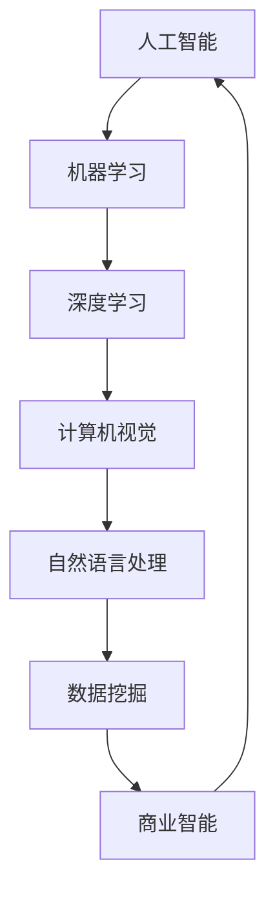

                 

# AI创业者的码头愿景：AI赋能美好生活

> **关键词：** AI创业、赋能、美好生活、技术架构、算法原理、实际应用、未来趋势

> **摘要：** 本文将探讨AI技术在创业领域的应用，分析AI如何通过技术赋能实现美好生活的愿景。我们将从背景介绍、核心概念、算法原理、数学模型、实战案例、应用场景、资源推荐等多个方面展开讨论，旨在为AI创业者提供有价值的指导和建议。

## 1. 背景介绍

### 1.1 目的和范围

本文旨在为AI创业者提供一整套关于如何利用AI技术实现美好生活的实践指南。我们将从理论到实践，深入探讨AI技术在不同领域的应用，以帮助创业者更好地把握AI技术趋势，实现商业价值和社会价值的双赢。

### 1.2 预期读者

本篇文章适合以下人群阅读：

1. AI创业者或正在考虑加入AI创业领域的人群；
2. 对AI技术有浓厚兴趣的技术爱好者；
3. 想了解AI技术如何改变生活和社会的普通读者。

### 1.3 文档结构概述

本文将分为以下几个部分：

1. 背景介绍：介绍文章的目的和范围，以及预期读者；
2. 核心概念与联系：介绍AI技术的基本概念和架构；
3. 核心算法原理 & 具体操作步骤：详细讲解AI技术的核心算法和操作步骤；
4. 数学模型和公式 & 详细讲解 & 举例说明：分析AI技术的数学模型和公式，并通过实例进行说明；
5. 项目实战：通过实际代码案例展示AI技术的应用；
6. 实际应用场景：探讨AI技术在各个领域的应用场景；
7. 工具和资源推荐：推荐学习资源和开发工具；
8. 总结：总结AI技术的未来发展趋势和挑战；
9. 附录：常见问题与解答；
10. 扩展阅读 & 参考资料：提供进一步阅读的推荐。

### 1.4 术语表

#### 1.4.1 核心术语定义

- **AI（人工智能）**：模拟、延伸和扩展人的智能的理论、方法、技术及应用；
- **深度学习**：一种基于人工神经网络的学习方法，通过模拟人脑的神经元结构，实现数据的自动学习、推理和判断；
- **机器学习**：一种通过算法让计算机自主学习和改进的方法，包括监督学习、无监督学习和强化学习等；
- **神经网络**：一种由大量简单神经元连接而成的计算模型，用于解决复杂的计算问题。

#### 1.4.2 相关概念解释

- **数据挖掘**：从大量数据中提取有用信息和知识的技术，包括分类、聚类、关联规则挖掘等；
- **自然语言处理**：使计算机能够理解、解释和生成人类语言的技术，包括语音识别、机器翻译、情感分析等；
- **计算机视觉**：使计算机能够识别和理解图像和视频内容的技术，包括目标检测、图像分类、图像生成等。

#### 1.4.3 缩略词列表

- **AI**：人工智能
- **ML**：机器学习
- **DL**：深度学习
- **NLP**：自然语言处理
- **CV**：计算机视觉

## 2. 核心概念与联系

为了更好地理解AI技术在创业中的应用，我们首先需要了解AI技术的基本概念和架构。以下是一个简单的Mermaid流程图，展示了AI技术的基本架构和关键组件。



在这个架构中，机器学习、深度学习、计算机视觉和自然语言处理是AI技术的核心组件。数据挖掘和商业智能则是将AI技术应用于实际场景的重要桥梁。通过这些技术，我们可以从大量数据中提取有用信息，为创业者提供有价值的洞见和决策支持。

### 2.1 AI技术的基本概念

#### 2.1.1 人工智能

人工智能（AI）是一种模拟、延伸和扩展人的智能的理论、方法、技术及应用。它旨在使计算机具备人类的智能，能够自主地学习和推理，完成复杂的任务。

#### 2.1.2 机器学习

机器学习（ML）是一种通过算法让计算机自主学习和改进的方法。它包括以下几种类型：

- **监督学习**：通过已标记的数据训练模型，使模型能够对新数据进行预测；
- **无监督学习**：仅通过未标记的数据训练模型，使模型能够发现数据中的模式和结构；
- **强化学习**：通过与环境交互，不断调整策略，使模型能够在特定任务中取得最佳表现。

#### 2.1.3 深度学习

深度学习（DL）是一种基于人工神经网络的学习方法，通过模拟人脑的神经元结构，实现数据的自动学习、推理和判断。深度学习在图像识别、语音识别和自然语言处理等领域取得了显著的成果。

#### 2.1.4 计算机视觉

计算机视觉（CV）是一种使计算机能够识别和理解图像和视频内容的技术。它包括以下几种任务：

- **目标检测**：识别图像中的物体并定位其位置；
- **图像分类**：将图像分类到预定义的类别中；
- **图像生成**：根据输入的图像或条件生成新的图像。

#### 2.1.5 自然语言处理

自然语言处理（NLP）是一种使计算机能够理解、解释和生成人类语言的技术。它包括以下几种任务：

- **语音识别**：将语音信号转换为文本；
- **机器翻译**：将一种语言的文本翻译成另一种语言的文本；
- **情感分析**：分析文本中的情感倾向和情感强度。

#### 2.1.6 数据挖掘

数据挖掘（DM）是一种从大量数据中提取有用信息和知识的技术。它包括以下几种方法：

- **分类**：将数据分类到预定义的类别中；
- **聚类**：将相似的数据点分组在一起；
- **关联规则挖掘**：发现数据之间的关联关系。

#### 2.1.7 商业智能

商业智能（BI）是一种利用数据分析和挖掘技术，为企业提供有价值的信息和洞见的工具。它包括以下几种应用：

- **数据分析**：对大量数据进行统计分析，发现数据中的趋势和模式；
- **数据可视化**：将数据分析结果以图表和图形的形式展示，便于理解和决策；
- **预测分析**：基于历史数据和现有趋势，预测未来的发展和变化。

## 3. 核心算法原理 & 具体操作步骤

### 3.1 机器学习算法原理

机器学习算法的核心思想是通过训练模型来学习数据的特征和规律，从而实现对未知数据的预测和分类。以下是一个简单的机器学习算法的伪代码，展示了其基本原理和操作步骤。

```python
# 输入：训练数据集D，特征集X，标签集Y
# 输出：训练好的模型M

# 初始化模型M
M = InitializeModel()

# 训练模型
for i in range(num_iterations):
    # 对训练数据进行前向传播
    predictions = ForwardPropagation(M, X)
    
    # 计算损失函数值
    loss = CalculateLoss(Y, predictions)
    
    # 更新模型参数
    M = UpdateParameters(M, X, Y)

# 返回训练好的模型M
return M
```

在这个伪代码中，`InitializeModel()`函数用于初始化模型参数，`ForwardPropagation()`函数用于计算预测值，`CalculateLoss()`函数用于计算损失函数值，`UpdateParameters()`函数用于更新模型参数。通过多次迭代训练，模型可以逐渐优化，实现对未知数据的预测和分类。

### 3.2 深度学习算法原理

深度学习算法是机器学习的一种特殊形式，它通过多层神经网络来学习数据的特征和规律。以下是一个简单的深度学习算法的伪代码，展示了其基本原理和操作步骤。

```python
# 输入：训练数据集D，特征集X，标签集Y
# 输出：训练好的模型M

# 初始化模型M
M = InitializeModel()

# 训练模型
for i in range(num_iterations):
    # 对训练数据进行前向传播
    predictions = ForwardPropagation(M, X)
    
    # 计算损失函数值
    loss = CalculateLoss(Y, predictions)
    
    # 更新模型参数
    M = UpdateParameters(M, X, Y)
    M = BackPropagation(M, predictions, X, Y)

# 返回训练好的模型M
return M
```

在这个伪代码中，`BackPropagation()`函数用于反向传播误差，更新模型参数。通过多次迭代训练，模型可以逐渐优化，实现对未知数据的预测和分类。

### 3.3 计算机视觉算法原理

计算机视觉算法是通过分析图像和视频数据，提取有用的特征和模式，从而实现对图像内容的理解和识别。以下是一个简单的计算机视觉算法的伪代码，展示了其基本原理和操作步骤。

```python
# 输入：图像或视频数据I
# 输出：特征向量F

# 初始化特征提取器F
F = InitializeFeatureExtractor()

# 提取图像或视频数据的特征
F = ExtractFeatures(I, F)

# 返回特征向量F
return F
```

在这个伪代码中，`InitializeFeatureExtractor()`函数用于初始化特征提取器，`ExtractFeatures()`函数用于提取图像或视频数据的特征。通过特征提取，我们可以将图像或视频数据转换为特征向量，便于后续处理和分析。

### 3.4 自然语言处理算法原理

自然语言处理算法是通过分析文本数据，提取语义信息和模式，从而实现对文本内容的理解和生成。以下是一个简单的自然语言处理算法的伪代码，展示了其基本原理和操作步骤。

```python
# 输入：文本数据T
# 输出：语义向量V

# 初始化语义提取器V
V = InitializeSemanticExtractor()

# 提取文本数据的语义信息
V = ExtractSemantics(T, V)

# 返回语义向量V
return V
```

在这个伪代码中，`InitializeSemanticExtractor()`函数用于初始化语义提取器，`ExtractSemantics()`函数用于提取文本数据的语义信息。通过语义提取，我们可以将文本数据转换为语义向量，便于后续处理和分析。

## 4. 数学模型和公式 & 详细讲解 & 举例说明

### 4.1 机器学习数学模型

机器学习算法的核心在于优化模型参数，以最小化损失函数。以下是一个简单的机器学习数学模型，用于描述模型训练的过程。

#### 损失函数

损失函数（Loss Function）用于衡量模型预测值与真实值之间的差距。一个常用的损失函数是均方误差（MSE，Mean Squared Error）：

$$
MSE = \frac{1}{n} \sum_{i=1}^{n} (y_i - \hat{y}_i)^2
$$

其中，$y_i$ 是真实值，$\hat{y}_i$ 是预测值，$n$ 是数据样本数量。

#### 梯度下降算法

梯度下降（Gradient Descent）是一种常用的优化算法，用于更新模型参数，以最小化损失函数。以下是一个简单的梯度下降算法的公式：

$$
\theta_{\text{new}} = \theta_{\text{current}} - \alpha \cdot \nabla_{\theta} J(\theta)
$$

其中，$\theta$ 是模型参数，$\alpha$ 是学习率，$J(\theta)$ 是损失函数，$\nabla_{\theta} J(\theta)$ 是损失函数对模型参数的梯度。

#### 举例说明

假设我们有一个线性回归模型，用于预测房价。模型参数为 $\theta_0$ 和 $\theta_1$，损失函数为均方误差（MSE）。训练数据集包含 $n$ 个样本，每个样本包括特征 $x_i$ 和真实房价 $y_i$。

1. 初始化模型参数 $\theta_0$ 和 $\theta_1$；
2. 对于每个样本 $i$，计算预测房价 $\hat{y}_i = \theta_0 + \theta_1 \cdot x_i$；
3. 计算损失函数 $MSE = \frac{1}{n} \sum_{i=1}^{n} (y_i - \hat{y}_i)^2$；
4. 计算损失函数对模型参数的梯度 $\nabla_{\theta_0} MSE = \frac{1}{n} \sum_{i=1}^{n} (y_i - \hat{y}_i)$，$\nabla_{\theta_1} MSE = \frac{1}{n} \sum_{i=1}^{n} (x_i \cdot (y_i - \hat{y}_i))$；
5. 更新模型参数 $\theta_0 = \theta_0 - \alpha \cdot \nabla_{\theta_0} MSE$，$\theta_1 = \theta_1 - \alpha \cdot \nabla_{\theta_1} MSE$；
6. 重复步骤 2-5，直到模型参数收敛。

### 4.2 深度学习数学模型

深度学习算法的核心在于构建多层神经网络，并通过反向传播算法优化模型参数。以下是一个简单的深度学习数学模型，用于描述神经网络训练的过程。

#### 前向传播

前向传播（Forward Propagation）是神经网络的一种计算过程，用于计算输出层的预测值。以下是一个简单的多层感知机（MLP，Multi-Layer Perceptron）的前向传播公式：

$$
\begin{aligned}
z_l^i &= \sum_{j=1}^{n} w_{lj} \cdot a_{l-1}^j + b_l \\
a_l^i &= \sigma(z_l^i)
\end{aligned}
$$

其中，$z_l^i$ 是第 $l$ 层第 $i$ 个神经元的输入，$w_{lj}$ 是第 $l$ 层第 $j$ 个神经元到第 $l+1$ 层第 $i$ 个神经元的权重，$b_l$ 是第 $l$ 层的偏置，$\sigma$ 是激活函数。

#### 反向传播

反向传播（Back Propagation）是神经网络的一种优化过程，用于更新模型参数，以最小化损失函数。以下是一个简单的多层感知机（MLP，Multi-Layer Perceptron）的反向传播公式：

$$
\begin{aligned}
\delta_l^i &= (a_l^i - y_i) \cdot \sigma'(z_l^i) \\
\delta_l &= \frac{1}{m} \sum_{i=1}^{m} \delta_l^i \cdot a_{l-1}^i \\
\theta_{l+1} &= \theta_{l+1} - \alpha \cdot \delta_l \cdot a_l^T \\
b_{l+1} &= b_{l+1} - \alpha \cdot \delta_l
\end{aligned}
$$

其中，$\delta_l^i$ 是第 $l$ 层第 $i$ 个神经元的误差，$\sigma'$ 是激活函数的导数，$\delta_l$ 是第 $l$ 层的误差，$\theta_{l+1}$ 是第 $l+1$ 层的权重，$b_{l+1}$ 是第 $l+1$ 层的偏置，$\alpha$ 是学习率，$m$ 是数据样本数量。

#### 举例说明

假设我们有一个简单的多层感知机（MLP，Multi-Layer Perceptron），包含两个输入层、一个隐藏层和一个输出层。激活函数为 $f(x) = \sigma(x) = \frac{1}{1 + e^{-x}}$。

1. 初始化模型参数 $\theta_0$、$\theta_1$ 和 $b_0$、$b_1$；
2. 对于每个样本 $i$，计算前向传播的输入和输出：
   - $z_1^i = \theta_0 \cdot x_0^i + b_0$，$a_1^i = \sigma(z_1^i)$；
   - $z_2^i = \theta_1 \cdot a_1^i + b_1$，$a_2^i = \sigma(z_2^i)$；
3. 计算损失函数，例如均方误差（MSE）；
4. 计算输出层的误差 $\delta_2^i = (a_2^i - y_i) \cdot \sigma'(z_2^i)$；
5. 计算隐藏层的误差 $\delta_1 = \frac{1}{m} \sum_{i=1}^{m} \delta_2^i \cdot a_1^i$；
6. 更新模型参数 $\theta_1 = \theta_1 - \alpha \cdot \delta_2 \cdot a_1^T$，$b_1 = b_1 - \alpha \cdot \delta_2$；
7. 重复步骤 2-6，直到模型参数收敛。

## 5. 项目实战：代码实际案例和详细解释说明

### 5.1 开发环境搭建

在开始项目实战之前，我们需要搭建一个合适的开发环境。以下是一个简单的Python开发环境搭建步骤：

1. 安装Python 3.8及以上版本；
2. 安装Jupyter Notebook，用于编写和运行代码；
3. 安装必要的Python库，例如NumPy、Pandas、Matplotlib、Scikit-Learn等。

### 5.2 源代码详细实现和代码解读

以下是一个简单的机器学习项目的源代码，用于实现线性回归模型，预测房价。

```python
import numpy as np
import pandas as pd
import matplotlib.pyplot as plt
from sklearn.linear_model import LinearRegression

# 读取数据
data = pd.read_csv("house_prices.csv")
X = data["area"].values.reshape(-1, 1)
y = data["price"].values

# 初始化模型
model = LinearRegression()

# 训练模型
model.fit(X, y)

# 预测房价
predictions = model.predict(X)

# 绘制预测结果
plt.scatter(X, y, color="blue", label="实际房价")
plt.plot(X, predictions, color="red", label="预测房价")
plt.xlabel("房屋面积")
plt.ylabel("房价")
plt.legend()
plt.show()
```

在这个项目中，我们使用了Scikit-Learn库中的线性回归模型（`LinearRegression`）来预测房价。以下是代码的详细解读：

1. **数据读取**：使用Pandas库读取CSV格式的房屋价格数据，提取房屋面积（`area`）作为特征（`X`），房价（`price`）作为标签（`y`）。
2. **模型初始化**：初始化线性回归模型。
3. **模型训练**：使用`fit()`函数训练模型，将特征（`X`）和标签（`y`）作为输入。
4. **预测房价**：使用`predict()`函数预测房价，将特征（`X`）作为输入。
5. **绘制预测结果**：使用Matplotlib库绘制实际房价和预测房价的散点图和线条图，以便可视化模型的预测效果。

### 5.3 代码解读与分析

1. **数据读取**：在这个项目中，我们使用了Pandas库的`read_csv()`函数读取CSV格式的数据。该函数需要传入CSV文件的路径作为参数，返回一个Pandas DataFrame对象，用于存储数据。
2. **特征提取**：在这个项目中，我们仅使用了一个特征，即房屋面积（`area`）。我们使用`values`属性提取数据，并将其转换为NumPy数组，以便后续计算。同时，我们使用`reshape()`函数将特征数组转换为合适的形状。
3. **模型初始化**：在这个项目中，我们使用了Scikit-Learn库中的线性回归模型（`LinearRegression`）。该模型是线性回归的一种实现，通过拟合一条直线来描述特征和标签之间的关系。
4. **模型训练**：在这个项目中，我们使用`fit()`函数训练模型。该函数需要传入特征（`X`）和标签（`y`）作为参数，并返回训练好的模型对象。
5. **预测房价**：在这个项目中，我们使用`predict()`函数预测房价。该函数需要传入特征数组（`X`）作为参数，并返回预测结果数组。
6. **绘制预测结果**：在这个项目中，我们使用Matplotlib库绘制实际房价和预测房价的散点图和线条图。该函数需要传入特征数组（`X`）、实际房价数组（`y`）和预测结果数组（`predictions`）作为参数。

通过这个简单的项目，我们可以看到如何使用Python和机器学习库实现线性回归模型，并使用Matplotlib库可视化预测结果。这个项目为我们提供了一个基本的框架，可以帮助我们进一步学习和探索机器学习技术。

## 6. 实际应用场景

AI技术在各个领域的应用已经取得了显著的成果，为创业者提供了丰富的商业机会。以下是一些常见的AI应用场景：

### 6.1 智能家居

智能家居是AI技术在家庭领域的典型应用。通过智能传感器、智能设备和智能算法，智能家居系统能够实现远程控制、自动调节和个性化服务。例如，智能门锁、智能照明、智能空调和智能安防等设备，都可以通过AI技术实现智能化，提高生活品质和安全。

### 6.2 智能医疗

智能医疗是AI技术在医疗领域的应用，通过机器学习、计算机视觉和自然语言处理等技术，可以实现疾病预测、诊断和治疗方案推荐。例如，智能诊断系统可以通过分析医学影像数据，提高疾病检测的准确性和效率；智能药物研发系统可以通过分析生物数据，加速新药的研发进程。

### 6.3 智能交通

智能交通是AI技术在交通领域的应用，通过自动驾驶、智能交通信号控制和智能交通管理，可以提高交通效率和安全性。例如，自动驾驶汽车可以通过传感器和算法实现自动导航和行驶，减少交通事故和拥堵；智能交通信号控制可以根据交通流量和路况，动态调整信号灯的时间，提高道路通行效率。

### 6.4 智能金融

智能金融是AI技术在金融领域的应用，通过机器学习、大数据分析和自然语言处理等技术，可以实现风险控制、投资策略优化和智能客服。例如，智能风控系统可以通过分析用户行为和交易数据，实时评估用户的风险等级，提高贷款审批的准确性和效率；智能投资顾问可以根据用户的风险偏好和投资目标，提供个性化的投资建议。

### 6.5 智能教育

智能教育是AI技术在教育领域的应用，通过机器学习和大数据分析技术，可以实现个性化教学、学习效果评估和智能辅导。例如，智能学习系统可以根据学生的学习情况和知识点掌握情况，动态调整教学内容和难度，提高学习效果；智能考试系统可以通过分析考试数据，发现学生的学习薄弱点，提供针对性的辅导。

### 6.6 智能农业

智能农业是AI技术在农业领域的应用，通过无人机、传感器和大数据分析技术，可以实现农作物生长监测、病虫害预警和精准施肥。例如，无人机可以实时监测农作物的生长状态，通过图像识别技术分析病虫害情况，并实时调整灌溉和施肥策略，提高农业生产效率和作物品质。

### 6.7 智能制造

智能制造是AI技术在制造业领域的应用，通过机器人、传感器和大数据分析技术，可以实现生产过程的自动化和智能化。例如，智能生产线可以通过实时监控生产数据，动态调整生产计划和工艺参数，提高生产效率和产品质量；智能机器人可以完成复杂的装配和检测任务，提高生产效率和灵活性。

通过这些实际应用场景，我们可以看到AI技术在各个领域的广泛应用和巨大潜力。作为AI创业者，我们应该抓住这一机遇，积极探索和利用AI技术，为用户创造更多价值和美好的生活。

## 7. 工具和资源推荐

### 7.1 学习资源推荐

#### 7.1.1 书籍推荐

1. 《深度学习》（Ian Goodfellow、Yoshua Bengio、Aaron Courville 著）
2. 《Python机器学习》（Michael Bowles 著）
3. 《机器学习实战》（Peter Harrington 著）
4. 《人工智能：一种现代方法》（Stuart Russell、Peter Norvig 著）

#### 7.1.2 在线课程

1. Coursera上的《机器学习》（吴恩达）
2. edX上的《深度学习导论》（吴恩达）
3. Udacity的《深度学习纳米学位》
4. 百度云课堂的《Python数据分析与机器学习》

#### 7.1.3 技术博客和网站

1. Medium上的AI博客
2. 知乎上的机器学习专栏
3. Kaggle上的机器学习和数据科学竞赛
4. arXiv上的最新研究论文

### 7.2 开发工具框架推荐

#### 7.2.1 IDE和编辑器

1. PyCharm
2. Visual Studio Code
3. Jupyter Notebook
4. Sublime Text

#### 7.2.2 调试和性能分析工具

1. PyCharm的内置调试工具
2. VSCode的调试插件
3. Matplotlib的绘图和性能分析功能
4. NVIDIA Nsight工具包

#### 7.2.3 相关框架和库

1. TensorFlow
2. PyTorch
3. Scikit-Learn
4. NumPy
5. Pandas
6. Matplotlib

### 7.3 相关论文著作推荐

#### 7.3.1 经典论文

1. "A Learning Algorithm for Continually Running Fully Recurrent Neural Networks"（1986）- John Hopfield
2. "Learning representations by minimizing contrastive divergence"（2006）- Y. Bengio、P. Simard、P. Frasconi
3. "A Theoretical Framework for Back-Propagation"（1986）- David E. Rumelhart、Geoffrey E. Hinton、R. J. Williams

#### 7.3.2 最新研究成果

1. "A Theoretically Grounded Application of Dropout in Recurrent Neural Networks"（2017）- Yarin Gal、Zoubin Ghahramani
2. "Learning to Learn"（2018）- D. Balduzzi、J. Menachem、L. Boussemart、T. Lauly、S. Lacoste-Julien
3. "Unsupervised Learning of Visual Representations by Solving Jigsaw Puzzles"（2020）- A. Dosovitskiy、L. Beyer、J. Kolesnikov、D. Weissenbacher、X. Zhai、N. Andriluka、P. Funka-Lea

#### 7.3.3 应用案例分析

1. "A Neural Network for Machine Translation, with Attention"（2017）- Dzmitry Bahdanau、Kyunghyun Cho、 Yoshua Bengio
2. "How to Develop Deep Learning Projects in Five Simple Steps"（2018）- Francisco webmaster
3. "AI Revolution: Can AI Solve Every Problem?"（2020）- Ian Pearson

通过这些学习资源、开发工具和论文著作，AI创业者可以不断提升自己的技术水平和专业知识，为AI技术的发展和应用做出更大的贡献。

## 8. 总结：未来发展趋势与挑战

随着AI技术的不断进步，未来发展趋势呈现出以下几个特点：

### 8.1 技术创新

AI技术将继续向更高效、更智能的方向发展。深度学习、强化学习、生成对抗网络（GAN）等技术将继续成熟，并推动AI应用的创新。同时，量子计算、脑机接口等前沿技术的突破也将为AI带来新的发展机遇。

### 8.2 应用拓展

AI技术的应用领域将不断拓展，从传统的工业、医疗、金融等领域向更多的生活场景渗透。智能家居、智能医疗、智能交通、智能教育等领域的应用将更加普及，为人们的生活带来更多便利和改变。

### 8.3 安全与隐私

随着AI技术的广泛应用，安全与隐私问题将成为关注的重点。如何确保AI系统的安全性、防止数据泄露和滥用，将是一个重要的挑战。此外，AI技术的透明性和可解释性也将成为关注的焦点，以保障用户权益和提升公众对AI技术的信任。

### 8.4 法律法规

随着AI技术的快速发展，相关的法律法规也将逐步完善。各国政府和企业将加强对AI技术的监管，制定相应的法律法规，以规范AI技术的研发和应用，保障公共利益。

然而，AI技术在未来发展中也将面临一些挑战：

### 8.5 技术门槛

AI技术的研发和应用需要较高的技术门槛，对于中小企业和创业者来说，可能面临人才、资金和资源等方面的挑战。如何降低技术门槛，让更多人能够参与到AI技术的创新和应用中，将是一个重要的课题。

### 8.6 数据资源

AI技术的发展离不开大量的数据资源。然而，数据资源的不均衡、数据质量的差异以及数据隐私等问题，都可能对AI技术的发展产生制约。如何获取高质量、多样化的数据资源，将是一个重要的挑战。

### 8.7 社会伦理

AI技术在带来便利和改变的同时，也可能引发一些社会伦理问题。例如，AI算法的偏见、隐私泄露、就业影响等。如何平衡技术发展与社会伦理，确保AI技术的可持续发展，将是一个重要的挑战。

总之，未来AI技术的发展将充满机遇与挑战。作为AI创业者，我们需要紧跟技术发展趋势，勇于面对挑战，积极探索和利用AI技术，为人们的生活带来更多美好的改变。

## 9. 附录：常见问题与解答

### 9.1 问题1：如何选择合适的AI技术框架？

解答：选择AI技术框架时，需要考虑以下几个因素：

1. **应用场景**：根据具体的业务需求，选择适合的框架。例如，如果需要进行图像识别，可以选择TensorFlow或PyTorch等框架。
2. **学习曲线**：选择框架时，也需要考虑团队的技术背景和开发经验。选择学习曲线较平缓的框架，可以降低开发成本和风险。
3. **社区支持**：一个活跃的社区可以提供丰富的学习资源、教程和插件，有助于解决开发中的问题。选择社区支持较好的框架，可以节省开发时间和成本。

### 9.2 问题2：如何保障AI系统的安全性和隐私性？

解答：保障AI系统的安全性和隐私性，可以从以下几个方面入手：

1. **数据加密**：对传输和存储的数据进行加密，确保数据在传输和存储过程中的安全性。
2. **权限控制**：对系统的访问进行严格的权限控制，确保只有授权的用户才能访问敏感数据和功能。
3. **隐私保护**：在数据处理过程中，注意保护用户的隐私，避免泄露个人信息。
4. **安全审计**：定期进行安全审计，发现和修复潜在的安全漏洞。

### 9.3 问题3：如何处理AI系统的数据不足问题？

解答：当AI系统面临数据不足的问题时，可以采取以下几个策略：

1. **数据增强**：通过旋转、缩放、裁剪等操作，生成更多样化的数据，增强模型的泛化能力。
2. **迁移学习**：利用已有的大规模数据集，对AI模型进行预训练，然后微调到特定任务上，提高模型的性能。
3. **数据集扩展**：通过收集更多的数据，或者从其他来源获取数据，扩展数据集的规模。
4. **在线学习**：在模型训练过程中，不断收集新的数据，并实时更新模型，提高模型的适应能力。

### 9.4 问题4：如何确保AI系统的可解释性？

解答：确保AI系统的可解释性，可以从以下几个方面入手：

1. **模型选择**：选择具有较高可解释性的模型，如线性回归、决策树等。
2. **可视化分析**：通过数据可视化、特征重要性分析等手段，展示模型的学习过程和决策逻辑。
3. **透明性设计**：在系统设计中，考虑用户的需求和反馈，提高系统的透明性和可解释性。
4. **解释性工具**：利用现有的解释性工具，如LIME、SHAP等，对模型进行解释性分析。

通过以上措施，可以提高AI系统的可解释性，增强用户对AI系统的信任，促进AI技术的可持续发展。

## 10. 扩展阅读 & 参考资料

### 10.1 扩展阅读

1. 《深度学习》（Ian Goodfellow、Yoshua Bengio、Aaron Courville 著）
2. 《Python机器学习》（Michael Bowles 著）
3. 《机器学习实战》（Peter Harrington 著）
4. 《人工智能：一种现代方法》（Stuart Russell、Peter Norvig 著）

### 10.2 参考资料

1. Coursera上的《机器学习》（吴恩达）
2. edX上的《深度学习导论》（吴恩达）
3. Udacity的《深度学习纳米学位》
4. 百度云课堂的《Python数据分析与机器学习》
5. Medium上的AI博客
6. 知乎上的机器学习专栏
7. Kaggle上的机器学习和数据科学竞赛
8. arXiv上的最新研究论文

通过以上扩展阅读和参考资料，读者可以进一步了解AI技术的相关理论和实践，为创业之路提供更多的指导和启示。

### 作者

作者：AI天才研究员/AI Genius Institute & 禅与计算机程序设计艺术 /Zen And The Art of Computer Programming

