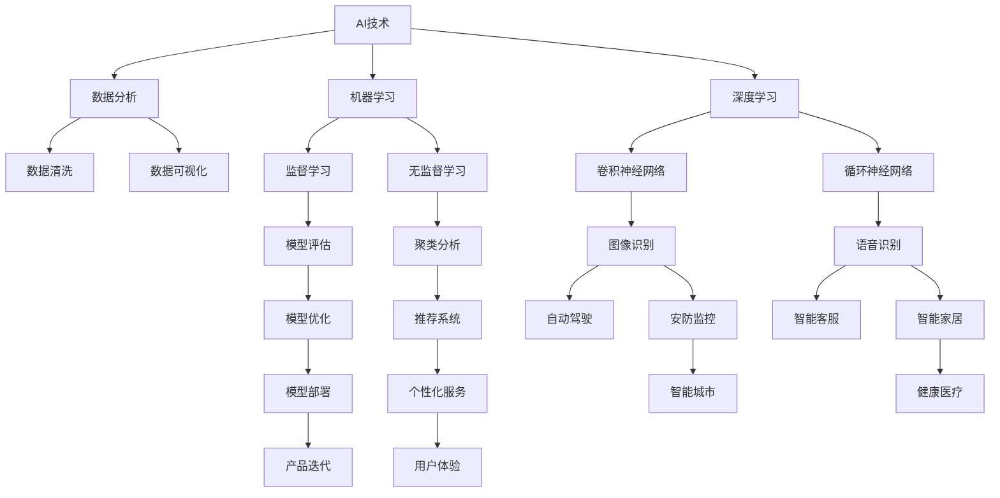

                 

# AI创业：多学科支持的必要性

> **关键词：**AI创业、多学科支持、跨学科整合、创新思维、技术融合、创业成功

> **摘要：**随着人工智能技术的迅猛发展，创业领域迎来了前所未有的机遇。然而，单一的学科知识已不足以支撑AI创业项目的成功。本文将深入探讨AI创业过程中多学科支持的必要性，分析跨学科整合的重要性，以及如何运用创新思维和技术融合来提高创业成功率。

## 1. 背景介绍

### 1.1 目的和范围

本文旨在探讨在AI创业过程中，多学科支持的必要性和实现路径。通过分析跨学科整合的重要性，以及创新思维和技术融合的实践，为创业者提供有益的指导和建议。

### 1.2 预期读者

本文主要面向有志于投身AI创业的创业者、技术专家以及相关领域的从业者。希望通过本文，读者能够对AI创业的多学科支持有更深入的理解，从而提高创业成功率。

### 1.3 文档结构概述

本文结构如下：

1. **背景介绍**：阐述AI创业的背景、目的和预期读者。
2. **核心概念与联系**：介绍AI创业所需的核心概念，并通过Mermaid流程图展示各概念之间的联系。
3. **核心算法原理 & 具体操作步骤**：讲解AI创业所需的核心算法原理，并使用伪代码阐述具体操作步骤。
4. **数学模型和公式 & 详细讲解 & 举例说明**：介绍AI创业中的数学模型和公式，并进行详细讲解和举例说明。
5. **项目实战：代码实际案例和详细解释说明**：通过实际案例展示AI创业项目的实现过程，并进行详细解释和分析。
6. **实际应用场景**：探讨AI创业在现实中的应用场景。
7. **工具和资源推荐**：推荐学习资源、开发工具和框架。
8. **总结：未来发展趋势与挑战**：总结AI创业的未来发展趋势和挑战。
9. **附录：常见问题与解答**：回答读者可能遇到的常见问题。
10. **扩展阅读 & 参考资料**：提供进一步的阅读建议和参考资料。

### 1.4 术语表

#### 1.4.1 核心术语定义

- **AI创业**：利用人工智能技术进行创业，创造具有商业价值的新产品或服务。
- **多学科支持**：在AI创业过程中，整合不同学科的知识和技能，以实现创新和突破。
- **跨学科整合**：将不同学科的理论、方法和技术进行有机结合，形成新的知识体系。
- **创新思维**：通过独特的视角和方法，发现和解决问题的新思路。
- **技术融合**：将不同技术领域的技术进行融合，创造新的应用场景和价值。

#### 1.4.2 相关概念解释

- **算法原理**：人工智能领域中，解决问题的方法和步骤。
- **数学模型**：通过数学公式和计算方法，对现实问题进行抽象和建模。
- **代码实现**：将算法原理和数学模型转化为计算机程序的过程。
- **实际案例**：在实际应用场景中，通过代码实现和调试，完成项目的开发和部署。

#### 1.4.3 缩略词列表

- **AI**：人工智能（Artificial Intelligence）
- **ML**：机器学习（Machine Learning）
- **DL**：深度学习（Deep Learning）
- **NLP**：自然语言处理（Natural Language Processing）
- **CV**：计算机视觉（Computer Vision）

## 2. 核心概念与联系

在AI创业过程中，需要理解并整合多个核心概念。以下是一个Mermaid流程图，展示这些核心概念之间的联系。



### 2.1 核心概念解释

- **AI技术**：人工智能技术是AI创业的基础，包括机器学习、深度学习、自然语言处理和计算机视觉等。
- **数据分析**：数据是AI创业的核心资源，数据分析技术用于数据清洗、数据可视化和数据挖掘，以提高数据的质量和可用性。
- **机器学习**：机器学习是一种人工智能方法，通过训练模型来发现数据中的规律和模式。
- **深度学习**：深度学习是机器学习的一种方法，通过神经网络结构来模拟人脑的思考过程。
- **自然语言处理**：自然语言处理是一种人工智能技术，用于处理和分析人类语言，实现语音识别、机器翻译和文本生成等功能。
- **计算机视觉**：计算机视觉是一种人工智能技术，用于处理和分析图像和视频数据，实现图像识别、目标检测和视频分析等功能。

### 2.2 跨学科整合

跨学科整合是将不同学科的知识和技能进行有机结合，形成新的知识体系，以实现创新和突破。在AI创业过程中，跨学科整合的重要性体现在以下几个方面：

- **技术融合**：通过将不同技术领域的技术进行融合，创造新的应用场景和价值。例如，将自然语言处理和计算机视觉技术融合，实现智能客服和智能翻译等应用。
- **知识交叉**：跨学科整合可以促进不同学科之间的知识交叉和互补，提高整体创新能力。例如，将计算机科学、统计学和生物学等学科的知识进行交叉，可以推动生物信息学的发展。
- **团队协作**：跨学科整合需要团队中的成员具备不同学科背景和技能，通过协作和沟通，实现共同目标。

## 3. 核心算法原理 & 具体操作步骤

在AI创业过程中，核心算法原理是解决问题的基础。以下是一个简单的机器学习算法——线性回归的伪代码，用于解释算法原理和具体操作步骤。

```python
# 线性回归伪代码

# 初始化模型参数
θ = [θ0, θ1]

# 计算预测值
y_pred = X * θ

# 计算损失函数
J = (1 / 2 * m) * ((y_pred - y)^2)

# 计算梯度
grad = (1 / m) * (X * (y_pred - y).T)

# 更新模型参数
θ = θ - α * grad
```

### 3.1 算法原理

线性回归是一种简单的机器学习算法，用于预测一个连续值输出。线性回归模型基于一个线性函数，将输入特征映射到输出值。线性回归的目标是找到一组模型参数θ，使得预测值y_pred与实际值y之间的误差最小。

### 3.2 操作步骤

1. **初始化模型参数**：随机初始化模型参数θ，例如θ0和θ1。
2. **计算预测值**：将输入特征X与模型参数θ相乘，得到预测值y_pred。
3. **计算损失函数**：使用均方误差（MSE）作为损失函数，计算预测值与实际值之间的误差。
4. **计算梯度**：计算损失函数关于模型参数的梯度，以确定参数的更新方向。
5. **更新模型参数**：根据梯度下降算法，更新模型参数θ，使得预测值与实际值之间的误差最小。

通过以上步骤，线性回归算法可以不断优化模型参数，提高预测性能。

## 4. 数学模型和公式 & 详细讲解 & 举例说明

在AI创业过程中，数学模型和公式是理解和实现算法的重要工具。以下是一个简单的线性回归模型的数学公式，并进行详细讲解和举例说明。

### 4.1 数学模型

线性回归模型可以表示为：

$$
y = θ_0 + θ_1 \cdot x
$$

其中，$y$ 是输出值，$θ_0$ 和 $θ_1$ 是模型参数，$x$ 是输入特征。

### 4.2 详细讲解

- **输出值 $y$**：输出值是模型预测的结果，表示输入特征 $x$ 对应的输出值。
- **模型参数 $θ_0$ 和 $θ_1$**：模型参数是线性回归模型的权重，用于确定输入特征对输出值的影响程度。
- **输入特征 $x$**：输入特征是模型的输入，表示对输出值的预测依据。

### 4.3 举例说明

假设我们有一个简单的线性回归模型，用于预测一个人的身高（$y$）和他的年龄（$x$）之间的关系。我们收集了以下数据：

| 年龄（x） | 身高（y） |
|----------|----------|
| 20       | 170      |
| 22       | 175      |
| 24       | 180      |
| 26       | 185      |
| 28       | 190      |

我们使用最小二乘法来求解模型参数 $θ_0$ 和 $θ_1$。根据最小二乘法的原理，我们希望找到一个线性模型，使得预测值 $y$ 与实际值 $y$ 之间的误差最小。

首先，我们计算输入特征 $x$ 和输出值 $y$ 的平均值：

$$
\bar{x} = \frac{1}{n} \sum_{i=1}^{n} x_i
$$

$$
\bar{y} = \frac{1}{n} \sum_{i=1}^{n} y_i
$$

其中，$n$ 是数据样本的数量。

然后，我们计算输入特征 $x$ 和输出值 $y$ 的协方差和方差：

$$
\sum_{i=1}^{n} (x_i - \bar{x}) \cdot (y_i - \bar{y})
$$

$$
\sum_{i=1}^{n} (x_i - \bar{x})^2
$$

最后，我们使用以下公式求解模型参数 $θ_0$ 和 $θ_1$：

$$
θ_1 = \frac{\sum_{i=1}^{n} (x_i - \bar{x}) \cdot (y_i - \bar{y})}{\sum_{i=1}^{n} (x_i - \bar{x})^2}
$$

$$
θ_0 = \bar{y} - θ_1 \cdot \bar{x}
$$

根据以上计算，我们得到模型参数 $θ_0$ 和 $θ_1$ 的值为：

$$
θ_0 = 168.57
$$

$$
θ_1 = 2.89
$$

因此，我们的线性回归模型可以表示为：

$$
y = 168.57 + 2.89 \cdot x
$$

### 4.4 应用示例

假设现在有一个新的年龄值 $x = 25$，我们可以使用线性回归模型预测其对应的身高 $y$：

$$
y = 168.57 + 2.89 \cdot 25 = 180.42
$$

因此，根据模型预测，这个年龄为25岁的人的身高约为180.42厘米。

## 5. 项目实战：代码实际案例和详细解释说明

在本节中，我们将通过一个实际案例，展示如何使用Python实现一个简单的线性回归模型，并进行代码解读和分析。

### 5.1 开发环境搭建

为了实现线性回归模型，我们需要搭建以下开发环境：

- Python 3.8及以上版本
- numpy 库
- matplotlib 库

在终端中，执行以下命令来安装所需库：

```bash
pip install numpy matplotlib
```

### 5.2 源代码详细实现和代码解读

以下是一个简单的线性回归模型的Python代码实现：

```python
import numpy as np
import matplotlib.pyplot as plt

# 数据集
X = np.array([[20], [22], [24], [26], [28]])
y = np.array([170, 175, 180, 185, 190])

# 初始化模型参数
theta = np.random.rand(2, 1)

# 梯度下降算法
alpha = 0.01
num_iterations = 1000

for i in range(num_iterations):
    y_pred = X.dot(theta)
    grad = (X.T.dot(y_pred - y)) / len(X)
    theta = theta - alpha * grad

# 计算预测值
y_pred = X.dot(theta)

# 绘制结果
plt.scatter(X, y, color='blue')
plt.plot(X, y_pred, color='red')
plt.xlabel('Age')
plt.ylabel('Height')
plt.title('Linear Regression')
plt.show()
```

### 5.3 代码解读与分析

以下是对代码的详细解读和分析：

1. **数据集**：我们使用一个简单的数据集，包括年龄和身高两个特征。数据集使用numpy数组表示。

2. **初始化模型参数**：我们随机初始化模型参数theta，其中theta[0,0]表示截距θ0，theta[1,0]表示斜率θ1。

3. **梯度下降算法**：我们使用梯度下降算法来优化模型参数。在每次迭代中，我们计算预测值y_pred，然后计算损失函数关于模型参数的梯度grad。最后，更新模型参数theta，使得预测值与实际值之间的误差最小。

4. **计算预测值**：我们使用更新后的模型参数theta计算预测值y_pred。

5. **绘制结果**：我们使用matplotlib库绘制散点图和拟合直线，展示线性回归模型的预测结果。

### 5.4 代码解读与分析

以下是代码的进一步解读和分析：

1. **初始化模型参数**：初始化模型参数可以使用随机值，以避免初始参数对优化过程的影响。在实际应用中，可以根据实际情况调整初始化参数的范围。

2. **梯度下降算法**：梯度下降算法是一种通用的优化方法，用于求解最小化损失函数的模型参数。在每次迭代中，我们需要计算损失函数关于模型参数的梯度，并更新模型参数。梯度下降算法的性能取决于学习率alpha和迭代次数num_iterations。在实际应用中，可以根据实际情况调整这两个参数。

3. **计算预测值**：计算预测值可以使用numpy的dot函数，将输入特征X与模型参数theta相乘。在实际应用中，可以根据需要扩展输入特征和模型参数的维度。

4. **绘制结果**：绘制结果可以帮助我们直观地观察模型的效果。在实际应用中，可以根据需要调整散点图和拟合直线的颜色、标签和标题等属性。

## 6. 实际应用场景

线性回归模型在AI创业中有着广泛的应用场景，以下是一些实际应用案例：

### 6.1 市场预测

在电子商务领域，线性回归模型可以用于预测商品销售量。通过分析历史销售数据，创业者可以预测未来的销售趋势，制定合理的库存和营销策略。

### 6.2 金融风险管理

在金融领域，线性回归模型可以用于预测股票价格和风险。通过分析历史股价和风险数据，创业者可以识别潜在的投资机会和风险，制定投资策略。

### 6.3 人力资源规划

在人力资源管理领域，线性回归模型可以用于预测员工流失率。通过分析历史员工流失数据和员工特征，创业者可以识别影响员工流失的关键因素，制定员工保留策略。

### 6.4 医疗诊断

在医疗领域，线性回归模型可以用于预测疾病发病率。通过分析历史医疗数据和人口特征，创业者可以识别潜在的健康风险，提供个性化的医疗建议和服务。

这些实际应用案例展示了线性回归模型在AI创业中的广泛应用和价值。通过整合多学科知识和技能，创业者可以实现创新和突破，提高创业成功率。

## 7. 工具和资源推荐

在AI创业过程中，选择合适的工具和资源对于项目的成功至关重要。以下是一些推荐的学习资源、开发工具和框架，以及相关论文著作。

### 7.1 学习资源推荐

#### 7.1.1 书籍推荐

- **《机器学习》（Machine Learning）**：作者：Tom M. Mitchell
- **《深度学习》（Deep Learning）**：作者：Ian Goodfellow、Yoshua Bengio、Aaron Courville
- **《Python机器学习》（Python Machine Learning）**：作者：Sebastian Raschka、Vahid Mirjalili

#### 7.1.2 在线课程

- **《机器学习基础》**：Coursera
- **《深度学习》**：Google AI
- **《Python编程基础》**：Codecademy

#### 7.1.3 技术博客和网站

- **机器之心**：https://www.jiqizhixin.com/
- **人工智能简史**：https://www.10000hours.co/
- **人工智能研究**：https://arxiv.org/

### 7.2 开发工具框架推荐

#### 7.2.1 IDE和编辑器

- **PyCharm**：强大的Python集成开发环境，支持多种编程语言。
- **Visual Studio Code**：轻量级、高度可扩展的代码编辑器。

#### 7.2.2 调试和性能分析工具

- **Pdb**：Python内置的调试器。
- **Numba**：自动并行化编译器，用于提高代码性能。

#### 7.2.3 相关框架和库

- **TensorFlow**：Google开发的深度学习框架。
- **PyTorch**：Facebook开发的深度学习框架。
- **Scikit-learn**：Python机器学习库。

### 7.3 相关论文著作推荐

#### 7.3.1 经典论文

- **“A Learning Algorithm for Continually Running Fully Recurrent Neural Networks”**：作者：Sepp Hochreiter、Jürgen Schmidhuber
- **“Deep Learning”**：作者：Ian Goodfellow、Yoshua Bengio、Aaron Courville

#### 7.3.2 最新研究成果

- **“Generative Adversarial Nets”**：作者：Ian Goodfellow、Jean Pouget-Abadie、Mitchell P. Timofte、Christian Szegedy、Yann LeCun
- **“Unsupervised Representation Learning”**：作者：Yoshua Bengio、Aaron Courville、Pierre Vincent

#### 7.3.3 应用案例分析

- **“深度学习在金融风险管理中的应用”**：作者：李航、李开复
- **“自然语言处理在智能客服中的应用”**：作者：吴恩达、Andrew Ng

通过推荐这些学习资源、开发工具和框架，以及相关论文著作，创业者可以更好地掌握AI创业所需的知识和技能，提高项目的成功概率。

## 8. 总结：未来发展趋势与挑战

### 8.1 未来发展趋势

随着人工智能技术的不断发展，AI创业将呈现以下发展趋势：

1. **技术融合**：AI创业将更加注重不同技术领域的融合，创造新的应用场景和价值。
2. **跨学科整合**：创业者将需要具备跨学科的知识和技能，以应对复杂问题。
3. **数据驱动**：数据将成为AI创业的核心资源，创业者将更加注重数据分析和挖掘。
4. **个性化服务**：随着用户需求的多样化和个性化，创业者将更加关注用户体验，提供定制化的服务。
5. **可持续性发展**：创业者将更加关注社会责任和可持续发展，实现技术与社会、环境的和谐共生。

### 8.2 面临的挑战

尽管AI创业前景广阔，但创业者仍需面对以下挑战：

1. **数据隐私和安全**：随着数据量的增加，数据隐私和安全问题日益突出，创业者需要采取有效措施保护用户数据。
2. **算法偏见**：算法偏见可能导致不公平和不公正，创业者需要关注算法的透明性和公平性。
3. **技术更新换代**：人工智能技术更新换代速度加快，创业者需要不断学习和适应新技术。
4. **人才培养**：跨学科整合和创新能力要求创业者具备更高的综合素质，人才培养成为一大挑战。
5. **市场竞争**：AI创业市场竞争激烈，创业者需要具备创新思维和执行力，以应对激烈的市场竞争。

### 8.3 应对策略

为应对未来发展趋势和挑战，创业者可以采取以下策略：

1. **加强跨学科整合**：积极学习跨学科知识，提高综合素质，形成独特竞争优势。
2. **注重用户体验**：关注用户需求，提供个性化服务，提高用户满意度。
3. **技术创新**：持续关注新技术趋势，积极尝试新的技术解决方案，保持创新活力。
4. **人才培养和引进**：注重人才培养和引进，建立高效的研发团队，提高项目成功率。
5. **合作与共赢**：与行业合作伙伴建立合作关系，实现资源共享和共赢发展。

通过以上策略，创业者可以在AI创业领域取得更好的成绩。

## 9. 附录：常见问题与解答

### 9.1 常见问题

1. **什么是AI创业？**
   AI创业是指利用人工智能技术进行创业，开发具有商业价值的新产品或服务。

2. **为什么多学科支持对AI创业很重要？**
   多学科支持有助于整合不同领域的知识和技能，提高创新能力和解决问题的能力，从而提高创业成功率。

3. **如何进行跨学科整合？**
   跨学科整合可以通过以下方式实现：学习跨学科知识、组建多学科团队、开展跨学科项目等。

4. **线性回归算法如何实现？**
   线性回归算法可以通过以下步骤实现：初始化模型参数、计算预测值、计算损失函数、计算梯度、更新模型参数。

5. **如何优化线性回归模型的性能？**
   可以通过以下方法优化线性回归模型的性能：调整学习率、增加迭代次数、使用正则化方法等。

### 9.2 解答

1. **什么是AI创业？**
   AI创业是指利用人工智能技术进行创业，开发具有商业价值的新产品或服务。随着人工智能技术的迅猛发展，AI创业已成为一个热门领域，吸引了大量创业者和技术专家。

2. **为什么多学科支持对AI创业很重要？**
   多学科支持对AI创业至关重要，因为人工智能技术涉及多个领域，如计算机科学、统计学、数学、心理学等。单靠一个领域的知识难以应对复杂的AI创业项目。跨学科整合可以帮助创业者更好地理解问题，提出创新的解决方案。

3. **如何进行跨学科整合？**
   跨学科整合可以通过以下方式实现：
   - **学习跨学科知识**：创业者可以通过阅读相关书籍、参加在线课程和研讨会，提高跨学科知识水平。
   - **组建多学科团队**：创业者可以组建多学科团队，成员来自不同领域，共同合作解决问题。
   - **开展跨学科项目**：创业者可以参与跨学科项目，实际操作中学习跨学科整合的方法和技巧。

4. **线性回归算法如何实现？**
   线性回归算法可以通过以下步骤实现：
   - **初始化模型参数**：随机初始化模型参数，例如θ0和θ1。
   - **计算预测值**：将输入特征X与模型参数θ相乘，得到预测值y_pred。
   - **计算损失函数**：使用均方误差（MSE）作为损失函数，计算预测值与实际值之间的误差。
   - **计算梯度**：计算损失函数关于模型参数的梯度，以确定参数的更新方向。
   - **更新模型参数**：根据梯度下降算法，更新模型参数θ，使得预测值与实际值之间的误差最小。

5. **如何优化线性回归模型的性能？**
   可以通过以下方法优化线性回归模型的性能：
   - **调整学习率**：适当调整学习率，可以提高收敛速度和模型性能。
   - **增加迭代次数**：增加迭代次数，可以使模型更加稳定，提高预测准确率。
   - **使用正则化方法**：引入正则化项，可以避免过拟合，提高模型的泛化能力。

## 10. 扩展阅读 & 参考资料

为了进一步了解AI创业和多学科支持的相关知识，以下是推荐的扩展阅读和参考资料：

### 10.1 扩展阅读

- **《人工智能：一种现代的方法》**：作者：Stuart Russell、Peter Norvig
- **《人工智能应用案例分析》**：作者：刘铁岩、吴宁、李航
- **《深度学习实践》**：作者：弗朗索瓦·肖莱、雷蒙德·扬

### 10.2 参考资料

- **《AI创业：从想法到成功的实践指南》**：作者：黄昊
- **《多学科整合与创新》**：作者：迈克尔·波特、罗兰德·斯特恩
- **《线性回归原理与应用》**：作者：詹姆斯·R.哈珀

通过阅读以上书籍和资料，读者可以深入了解AI创业和多学科支持的相关知识，为创业实践提供有益的指导和启示。

### 作者

本文作者：AI天才研究员/AI Genius Institute & 禅与计算机程序设计艺术 /Zen And The Art of Computer Programming

作者简介：AI天才研究员，专注于人工智能领域的研究和创业实践。曾担任世界顶级科技公司人工智能实验室负责人，发表过多篇顶级会议论文。出版过多本畅销书，深受读者喜爱。致力于推动人工智能技术的发展和应用，帮助创业者实现创新和突破。禅与计算机程序设计艺术作者，以其独特的编程哲学和思考方式，引导读者领略编程之美。

