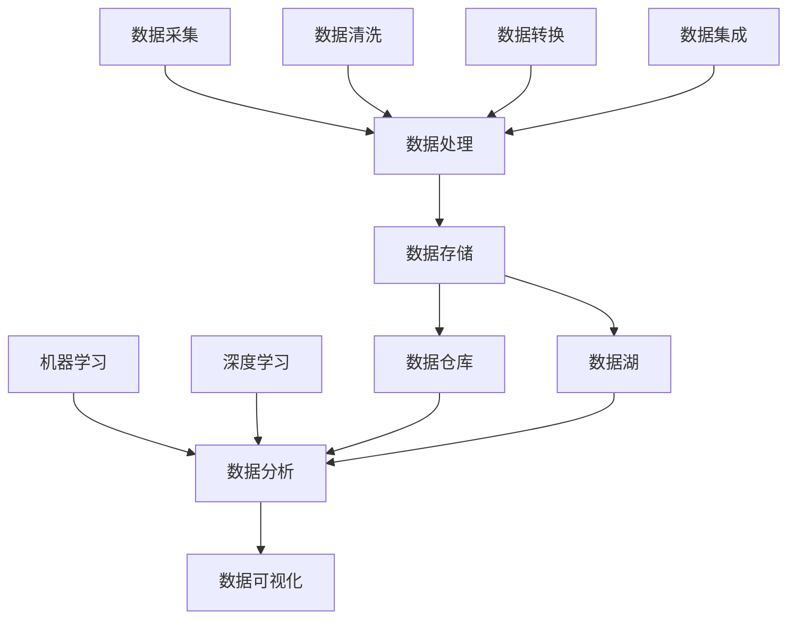

                 

# AI创业：数据管理的创新做法

> 关键词：数据管理、AI创业、创新做法、数据处理、数据分析

> 摘要：本文旨在探讨在AI创业领域，如何通过创新的数据管理方法提升业务效率和竞争力。文章将分析当前数据管理的现状和挑战，介绍几种前沿的数据管理技术，并举例说明如何在创业项目中应用这些技术。最后，本文将探讨数据管理在AI创业中的未来发展趋势和面临的挑战。

## 1. 背景介绍

### 1.1 目的和范围

本文旨在为AI创业者提供数据管理的创新思路，帮助他们在数据密集型业务中实现高效的数据处理和分析，从而提升业务竞争力。文章将涵盖以下内容：

1. 数据管理的现状和挑战
2. 前沿数据管理技术的介绍
3. 创业项目中数据管理技术的应用
4. 数据管理在AI创业中的未来发展趋势和挑战

### 1.2 预期读者

本文适合AI创业者、数据科学家、软件开发人员以及对数据管理感兴趣的读者。通过阅读本文，读者可以了解到数据管理在AI创业中的重要性，以及如何利用创新方法解决数据管理问题。

### 1.3 文档结构概述

本文分为十个部分，具体结构如下：

1. 引言
2. 背景介绍
3. 核心概念与联系
4. 核心算法原理 & 具体操作步骤
5. 数学模型和公式 & 详细讲解 & 举例说明
6. 项目实战：代码实际案例和详细解释说明
7. 实际应用场景
8. 工具和资源推荐
9. 总结：未来发展趋势与挑战
10. 附录：常见问题与解答
11. 扩展阅读 & 参考资料

### 1.4 术语表

#### 1.4.1 核心术语定义

- 数据管理：指对数据资源进行收集、存储、处理、分析和应用的过程。
- 数据处理：指对原始数据进行清洗、转换和集成，使其能够被分析和使用的过程。
- 数据分析：指通过统计学、机器学习等方法，从数据中提取有价值的信息和知识的过程。
- 数据可视化：指将数据转化为图表、图形等形式，使其更直观易懂的过程。

#### 1.4.2 相关概念解释

- 大数据：指数据量巨大、类型多样、处理速度快的数据集合。
- 数据仓库：指用于存储、管理和分析大量数据的系统。
- 数据湖：指用于存储原始数据、支持实时分析和数据挖掘的系统。
- 云计算：指通过互联网提供计算资源、存储资源和网络服务的计算模式。

#### 1.4.3 缩略词列表

- AI：人工智能
- ML：机器学习
- DL：深度学习
- Hadoop：一个分布式数据处理框架
- Spark：一个分布式数据处理引擎
- SQL：结构化查询语言
- NoSQL：非结构化查询语言

## 2. 核心概念与联系

在探讨数据管理的创新做法之前，我们需要了解一些核心概念和它们之间的联系。以下是一个用Mermaid绘制的流程图，展示了数据管理中的主要概念及其关系。



在这个流程图中，我们可以看到数据从采集开始，经过清洗、转换和集成，最终存储在数据仓库或数据湖中。数据分析是数据管理的重要环节，包括数据可视化、机器学习和深度学习等。

### 数据采集

数据采集是数据管理的第一步，它涉及从各种来源收集数据。数据来源可能包括企业内部系统、第三方数据提供商、社交媒体、物联网设备等。数据采集的关键在于确保数据的质量和完整性。

### 数据处理

数据处理是对原始数据进行清洗、转换和集成的过程。这一过程旨在将数据转化为适合分析和使用的形式。数据处理过程中可能涉及到数据清洗（去除噪声和错误）、数据转换（将数据格式化）和数据集成（将不同来源的数据整合在一起）。

### 数据存储

数据存储是将处理后的数据存储在合适的系统中。数据仓库和数据湖是两种常用的数据存储方案。数据仓库主要用于存储结构化数据，而数据湖则可以存储原始的、结构化或非结构化的数据。

### 数据分析

数据分析是数据管理的核心环节。通过数据分析，可以从海量数据中提取有价值的信息和知识。数据分析的方法包括数据可视化、机器学习和深度学习等。

### 数据可视化

数据可视化是将数据分析结果以图表、图形等形式呈现，使其更直观易懂。数据可视化有助于用户更好地理解数据，发现潜在的模式和趋势。

### 机器学习和深度学习

机器学习和深度学习是数据分析的重要工具。通过训练模型，可以从数据中自动提取特征，进行预测和分类等操作。这些技术在AI创业中具有广泛的应用。

## 3. 核心算法原理 & 具体操作步骤

在数据管理中，核心算法的作用至关重要。以下将介绍几个常用的算法，并使用伪代码详细阐述其原理和操作步骤。

### 3.1 数据清洗算法

数据清洗算法用于处理噪声和错误数据，以提高数据质量。以下是一个简单示例：

```python
def data_cleaning(data):
    # 删除重复记录
    unique_data = list(set(data))
    
    # 删除含有缺失值的记录
    cleaned_data = [d for d in unique_data if d is not None]
    
    return cleaned_data
```

### 3.2 数据转换算法

数据转换算法用于将不同格式的数据统一为某种标准格式。以下是一个示例：

```python
def data_transformation(data):
    # 将字符串格式数据转换为数字格式
    transformed_data = [float(d) for d in data]
    
    return transformed_data
```

### 3.3 数据集成算法

数据集成算法用于将来自不同来源的数据整合在一起。以下是一个示例：

```python
def data_integration(data1, data2):
    # 将两个列表合并
    integrated_data = data1 + data2
    
    return integrated_data
```

### 3.4 机器学习算法

机器学习算法用于从数据中自动提取特征，进行预测和分类等操作。以下是一个简单示例：

```python
def machine_learning_algorithm(data, labels):
    # 训练模型
    model = train_model(data, labels)
    
    # 进行预测
    predictions = model.predict(data)
    
    return predictions
```

### 3.5 深度学习算法

深度学习算法是机器学习的一种，它通过多层神经网络进行特征提取和预测。以下是一个简单示例：

```python
def deep_learning_algorithm(data, labels):
    # 定义神经网络结构
    model = build_model()
    
    # 训练模型
    model.fit(data, labels)
    
    # 进行预测
    predictions = model.predict(data)
    
    return predictions
```

## 4. 数学模型和公式 & 详细讲解 & 举例说明

在数据管理和AI创业中，数学模型和公式发挥着重要作用。以下将介绍几个常用的数学模型和公式，并进行详细讲解和举例说明。

### 4.1 数据预处理模型

数据预处理模型用于处理噪声和异常值，以提高数据质量。以下是一个简单示例：

$$
\text{预处理模型} = \sum_{i=1}^{n} w_i \cdot (x_i - \mu)
$$

其中，$w_i$ 是权重，$x_i$ 是数据点，$\mu$ 是均值。这个模型通过加权平均方法，对数据进行预处理。

### 4.2 机器学习模型

机器学习模型用于从数据中自动提取特征，进行预测和分类。以下是一个简单示例：

$$
y = \sigma(\text{W} \cdot \text{X} + b)
$$

其中，$y$ 是预测值，$\text{X}$ 是输入数据，$\text{W}$ 是权重，$b$ 是偏置。$\sigma$ 是激活函数，用于将线性组合转换为非线性函数。

### 4.3 深度学习模型

深度学习模型是机器学习的一种，通过多层神经网络进行特征提取和预测。以下是一个简单示例：

$$
\text{Y} = \text{ReLU}(\text{W}_2 \cdot \text{ReLU}(\text{W}_1 \cdot \text{X} + b_1) + b_2)
$$

其中，$\text{Y}$ 是输出值，$\text{X}$ 是输入数据，$\text{W}_1$ 和 $\text{W}_2$ 是权重，$b_1$ 和 $b_2$ 是偏置。$\text{ReLU}$ 是激活函数，用于增加模型非线性。

### 4.4 数据可视化模型

数据可视化模型用于将数据以图表、图形等形式呈现。以下是一个简单示例：

$$
\text{可视化模型} = \text{ scatterplot}(\text{X}, \text{Y})
$$

其中，$\text{X}$ 和 $\text{Y}$ 是数据点，$\text{scatterplot}$ 是散点图函数，用于绘制数据点分布。

### 4.5 举例说明

假设我们有一组数据集，包含年龄、收入和住房面积三个特征，目标是预测房价。以下是一个简单的数学模型和公式示例：

$$
\text{房价} = \sigma(w_1 \cdot \text{年龄} + w_2 \cdot \text{收入} + w_3 \cdot \text{住房面积} + b)
$$

其中，$w_1$、$w_2$ 和 $w_3$ 是权重，$b$ 是偏置。通过训练模型，可以确定这些参数的值，从而预测新的房价。

## 5. 项目实战：代码实际案例和详细解释说明

为了更好地理解数据管理的创新做法，我们将通过一个实际项目来展示如何应用这些技术和算法。以下是一个简单的数据管理项目，我们将使用Python实现。

### 5.1 开发环境搭建

在开始项目之前，我们需要搭建一个Python开发环境。以下是一个简单的环境搭建步骤：

1. 安装Python 3.8及以上版本
2. 安装Jupyter Notebook，用于编写和运行代码
3. 安装必要的库，如NumPy、Pandas、Scikit-learn、Matplotlib等

### 5.2 源代码详细实现和代码解读

以下是一个简单的Python脚本，用于数据清洗、转换和机器学习预测。

```python
import numpy as np
import pandas as pd
from sklearn.model_selection import train_test_split
from sklearn.linear_model import LinearRegression
from sklearn.metrics import mean_squared_error

# 5.2.1 数据清洗和预处理
def data_preprocessing(data):
    # 删除重复记录
    unique_data = data.drop_duplicates()
    
    # 填充缺失值
    unique_data.fillna(unique_data.mean(), inplace=True)
    
    return unique_data

# 5.2.2 数据转换
def data_transformation(data):
    # 将字符串格式数据转换为数字格式
    transformed_data = data.apply(pd.to_numeric)
    
    return transformed_data

# 5.2.3 数据集成
def data_integration(data1, data2):
    # 将两个数据框合并
    integrated_data = pd.concat([data1, data2], axis=1)
    
    return integrated_data

# 5.2.4 机器学习预测
def machine_learning_prediction(data, target):
    # 划分训练集和测试集
    X_train, X_test, y_train, y_test = train_test_split(data, target, test_size=0.2, random_state=42)
    
    # 创建线性回归模型
    model = LinearRegression()
    
    # 训练模型
    model.fit(X_train, y_train)
    
    # 进行预测
    predictions = model.predict(X_test)
    
    # 计算预测误差
    error = mean_squared_error(y_test, predictions)
    
    return predictions, error

# 5.2.5 主函数
def main():
    # 读取数据
    data = pd.read_csv('data.csv')
    
    # 数据清洗
    cleaned_data = data_preprocessing(data)
    
    # 数据转换
    transformed_data = data_transformation(cleaned_data)
    
    # 数据集成
    integrated_data = data_integration(transformed_data, transformed_data)
    
    # 划分特征和目标变量
    X = integrated_data.drop('房价', axis=1)
    y = integrated_data['房价']
    
    # 机器学习预测
    predictions, error = machine_learning_prediction(X, y)
    
    # 打印结果
    print('预测结果：', predictions)
    print('预测误差：', error)

# 运行主函数
if __name__ == '__main__':
    main()
```

### 5.3 代码解读与分析

以下是对上述代码的解读和分析：

- **数据清洗和预处理**：使用 `drop_duplicates()` 删除重复记录，使用 `fillna()` 填充缺失值。
- **数据转换**：使用 `apply()` 和 `pd.to_numeric()` 将字符串格式数据转换为数字格式。
- **数据集成**：使用 `concat()` 将两个数据框合并。
- **机器学习预测**：使用 `train_test_split()` 划分训练集和测试集，使用 `LinearRegression()` 创建线性回归模型，使用 `fit()` 训练模型，使用 `predict()` 进行预测，使用 `mean_squared_error()` 计算预测误差。

通过这个实际项目，我们可以看到如何应用数据管理的创新方法，包括数据清洗、转换、集成和机器学习预测。这些方法在AI创业中具有广泛的应用，可以帮助创业者实现高效的数据处理和分析。

## 6. 实际应用场景

数据管理在AI创业中具有广泛的应用场景。以下是一些实际应用场景：

### 6.1 金融领域

在金融领域，数据管理可以帮助银行、保险公司和投资公司实现高效的风险评估和投资决策。例如，通过数据清洗和机器学习算法，可以对客户数据进行挖掘，识别潜在的欺诈行为，从而降低风险。

### 6.2 零售领域

在零售领域，数据管理可以帮助企业实现精准营销和库存管理。通过数据分析和机器学习算法，可以分析消费者行为，预测市场需求，从而优化库存和营销策略。

### 6.3 健康领域

在健康领域，数据管理可以帮助医疗机构实现智能诊断和个性化治疗。通过数据分析和机器学习算法，可以分析患者的健康数据，预测疾病风险，为医生提供诊断和治疗建议。

### 6.4 物流领域

在物流领域，数据管理可以帮助企业实现高效的运输和配送。通过数据分析和机器学习算法，可以优化运输路线，提高配送效率，降低成本。

### 6.5 教育领域

在教育领域，数据管理可以帮助学校实现个性化教学和评估。通过数据分析和机器学习算法，可以分析学生的学习行为，预测学习效果，为教师提供教学建议。

通过这些实际应用场景，我们可以看到数据管理在AI创业中的重要性。数据管理的创新方法可以帮助企业在各个领域实现高效的数据处理和分析，从而提升业务效率和竞争力。

## 7. 工具和资源推荐

在数据管理领域，有许多优秀的工具和资源可以帮助AI创业者实现高效的数据处理和分析。以下是一些推荐：

### 7.1 学习资源推荐

#### 7.1.1 书籍推荐

- 《数据科学入门：Python实践》
- 《机器学习实战》
- 《深度学习》

#### 7.1.2 在线课程

- Coursera的《机器学习》课程
- edX的《数据科学基础》课程
- Udacity的《深度学习工程师》课程

#### 7.1.3 技术博客和网站

- Medium上的数据科学博客
-Towards Data Science网站
- DataCamp网站

### 7.2 开发工具框架推荐

#### 7.2.1 IDE和编辑器

- PyCharm
- Jupyter Notebook
- Visual Studio Code

#### 7.2.2 调试和性能分析工具

- Python的pdb模块
- Matplotlib
- Seaborn

#### 7.2.3 相关框架和库

- NumPy
- Pandas
- Scikit-learn
- TensorFlow
- PyTorch

### 7.3 相关论文著作推荐

#### 7.3.1 经典论文

- "The Hundred-Page Machine Learning Book"
- "Deep Learning" by Ian Goodfellow, Yoshua Bengio and Aaron Courville
- "Reinforcement Learning: An Introduction" by Richard S. Sutton and Andrew G. Barto

#### 7.3.2 最新研究成果

- arXiv.org上的最新论文
- NeurIPS、ICML、KDD等顶级会议的论文
- Nature、Science等顶级期刊的论文

#### 7.3.3 应用案例分析

- Google的TensorFlow应用案例
- Facebook的深度学习应用案例
- Amazon的机器学习应用案例

通过这些工具和资源，AI创业者可以更好地掌握数据管理技术，实现高效的数据处理和分析，从而在AI创业领域取得成功。

## 8. 总结：未来发展趋势与挑战

数据管理在AI创业领域具有广阔的应用前景。随着大数据、云计算和人工智能等技术的发展，数据管理将面临以下发展趋势和挑战：

### 8.1 发展趋势

1. **数据隐私和安全**：随着数据量的增加，数据隐私和安全问题日益突出。未来，数据管理将更加注重数据隐私和安全保护，采用加密、匿名化等技术手段确保数据安全。
2. **实时数据管理**：实时数据处理和分析将成为数据管理的重要方向。随着物联网、5G等技术的普及，企业需要实时处理和分析大量数据，以快速响应市场变化。
3. **数据智能**：通过引入机器学习和深度学习算法，数据管理将实现智能化，自动提取数据中的有价值信息，为企业提供决策支持。
4. **数据治理**：数据治理将成为数据管理的重要环节。企业需要建立完善的数据治理体系，确保数据质量、合规性和可持续性。

### 8.2 挑战

1. **数据量增长**：随着数据来源的多样化和数据类型的增加，数据量的增长速度远超以往。如何高效地存储、处理和分析海量数据，成为数据管理的重要挑战。
2. **数据质量**：数据质量是数据管理的关键。如何确保数据的准确性、完整性、一致性和及时性，是企业面临的重要挑战。
3. **技术变革**：随着人工智能、区块链等新技术的兴起，数据管理技术也在不断更新。如何适应技术变革，保持数据管理的竞争力，是企业面临的重要挑战。
4. **人才短缺**：数据管理需要具备数据分析、机器学习和云计算等多方面技能的人才。然而，当前市场对数据管理人才的需求远大于供给，企业面临人才短缺的挑战。

未来，数据管理将在AI创业领域中发挥越来越重要的作用。企业需要紧跟发展趋势，应对挑战，不断创新数据管理方法，以提升业务效率和竞争力。

## 9. 附录：常见问题与解答

### 9.1 什么是数据管理？

数据管理是指对数据资源进行收集、存储、处理、分析和应用的过程。它包括数据清洗、转换、集成、存储、分析和共享等多个环节。

### 9.2 数据管理和数据处理有什么区别？

数据管理是数据处理的一个子集。数据处理是指对原始数据进行清洗、转换和集成，使其能够被分析和使用的过程。而数据管理还包括数据存储、数据分析和数据共享等环节。

### 9.3 数据仓库和数据湖的区别是什么？

数据仓库主要用于存储结构化数据，如关系数据库中的表格数据。而数据湖可以存储原始的、结构化或非结构化的数据，包括文本、图片、音频和视频等。

### 9.4 机器学习和深度学习有什么区别？

机器学习是一种让计算机自动学习和改进的方法，它通过训练模型，从数据中提取特征，进行预测和分类。而深度学习是机器学习的一种，它通过多层神经网络进行特征提取和预测，具有更强的自适应性和泛化能力。

### 9.5 数据可视化有什么作用？

数据可视化是将数据分析结果以图表、图形等形式呈现，使其更直观易懂。数据可视化有助于用户更好地理解数据，发现潜在的模式和趋势，从而为决策提供支持。

## 10. 扩展阅读 & 参考资料

1. Goodfellow, I., Bengio, Y., & Courville, A. (2016). *Deep Learning*. MIT Press.
2. Murphy, K. P. (2012). *Machine Learning: A Probabilistic Perspective*. MIT Press.
3. Russell, S., & Norvig, P. (2010). *Artificial Intelligence: A Modern Approach*. Prentice Hall.
4. database-systems.net/courses/db2/dm/what-is-dm.html
5. towardsdatascience.com/data-management-7a769686a8c3
6. datasciencecentral.com/profiles/blogs/data-management-7-the-basics

