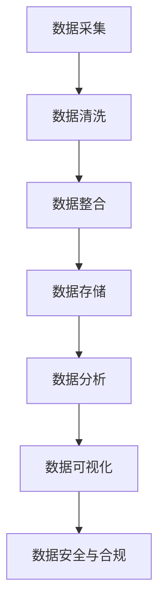

                 

# AI创业：数据管理的方法

> **关键词：** AI创业、数据管理、数据治理、大数据、数据分析、数据安全  
>
> **摘要：** 本文将深入探讨AI创业过程中的数据管理策略和方法，涵盖数据治理、大数据分析、数据安全等核心环节，旨在为AI创业者提供系统性的数据管理指南，帮助他们实现数据驱动的创新。

## 1. 背景介绍

### 1.1 目的和范围

随着人工智能技术的快速发展，越来越多的企业开始将AI技术应用于业务创新和数字化转型中。然而，AI创业过程中面临的一个关键挑战是如何高效地管理大量数据。本文旨在探讨数据管理在AI创业中的重要性，并详细阐述数据治理、大数据分析、数据安全等核心环节。

### 1.2 预期读者

本文适合以下读者群体：

- AI创业者
- 数据科学和机器学习从业者
- IT经理和CTO
- 数据分析师和数据库管理员

### 1.3 文档结构概述

本文结构如下：

- **第1章：背景介绍**：介绍本文的目的、预期读者和文档结构。
- **第2章：核心概念与联系**：阐述数据管理的核心概念和联系，使用Mermaid流程图展示数据管理架构。
- **第3章：核心算法原理与具体操作步骤**：讲解数据管理中的核心算法原理和具体操作步骤，使用伪代码进行详细阐述。
- **第4章：数学模型和公式**：介绍数据管理中的数学模型和公式，并进行详细讲解和举例说明。
- **第5章：项目实战**：通过代码实际案例，详细解释说明数据管理的方法和技巧。
- **第6章：实际应用场景**：探讨数据管理在实际应用场景中的挑战和解决方案。
- **第7章：工具和资源推荐**：推荐学习资源、开发工具框架和相关论文著作。
- **第8章：总结**：总结未来发展趋势与挑战。
- **第9章：附录**：常见问题与解答。
- **第10章：扩展阅读与参考资料**：提供扩展阅读和参考资料。

### 1.4 术语表

#### 1.4.1 核心术语定义

- 数据治理：确保数据质量、安全、合规和可访问性的过程。
- 大数据：数据量、多样性和速度超出传统数据库管理工具处理能力的海量数据。
- 数据分析：通过数据挖掘、统计分析和机器学习等方法，从数据中提取有价值的信息和知识。
- 数据安全：确保数据免受未授权访问、篡改和泄露的保护措施。

#### 1.4.2 相关概念解释

- 数据质量：数据准确性、完整性、一致性和可靠性的评估。
- 数据集成：将来自不同数据源的数据合并为一个统一的视图。
- 数据仓库：存储、管理和分析大量数据的系统。
- 数据湖：存储原始数据的大数据平台，支持结构化、半结构化和非结构化数据。

#### 1.4.3 缩略词列表

- AI：人工智能
- ML：机器学习
- SQL：结构化查询语言
- NoSQL：非关系型数据库
- ETL：提取、转换和加载
- IoT：物联网

## 2. 核心概念与联系

在AI创业过程中，数据管理是至关重要的一环。为了更好地理解数据管理，我们需要了解以下核心概念和它们之间的联系。

### 2.1 数据管理流程

数据管理流程通常包括以下几个关键步骤：

1. **数据采集**：从各种数据源收集数据，包括内部数据（如企业内部系统）和外部数据（如公共数据、第三方数据）。
2. **数据清洗**：处理和清洗原始数据，去除噪声、重复和错误的数据。
3. **数据整合**：将来自不同数据源的数据进行整合，形成统一的视图。
4. **数据存储**：将数据存储在合适的数据仓库或数据湖中，以便后续分析和处理。
5. **数据分析**：使用数据分析技术，从数据中提取有价值的信息和知识。
6. **数据可视化**：将分析结果以图表、报表等形式进行可视化展示，便于决策者理解和分析。
7. **数据安全与合规**：确保数据在采集、存储、处理和传输过程中的安全性和合规性。

### 2.2 数据管理架构

为了更好地理解数据管理流程，我们可以使用Mermaid流程图展示数据管理的架构：



### 2.3 数据管理中的核心算法

在数据管理过程中，核心算法包括数据清洗、数据整合、数据分析等。以下是一些常用的算法：

- **数据清洗**：缺失值填充、异常值处理、重复值去除。
- **数据整合**：数据合并、数据去重、数据映射。
- **数据分析**：聚类分析、分类分析、回归分析、关联规则分析。

### 2.4 数据管理中的数学模型

数据管理中常用的数学模型包括：

- **统计模型**：均值、方差、标准差、协方差、相关性。
- **机器学习模型**：线性回归、逻辑回归、决策树、随机森林、支持向量机。

### 2.5 数据管理中的相关技术

数据管理中涉及到的相关技术包括：

- **数据库技术**：关系型数据库、非关系型数据库、分布式数据库。
- **数据仓库技术**：数据仓库、数据湖、数据立方体。
- **数据挖掘技术**：关联规则挖掘、分类挖掘、聚类挖掘。
- **数据安全与合规技术**：加密、访问控制、审计、数据备份与恢复。

## 3. 核心算法原理与具体操作步骤

### 3.1 数据清洗算法

数据清洗是数据管理过程中的第一步，其目的是处理和清洗原始数据，去除噪声、重复和错误的数据。以下是一个简单的数据清洗算法：

```pseudo
function DataCleaning(data):
    for each record in data:
        if record is missing:
            fill missing values with mean or median
        if record has outliers:
            remove outliers
        if record has duplicates:
            remove duplicates
    return cleaned data
```

### 3.2 数据整合算法

数据整合是将来自不同数据源的数据进行整合，形成统一的视图。以下是一个简单的数据整合算法：

```pseudo
function DataIntegration(data1, data2):
    merged_data = {}
    for key, value in data1.items():
        merged_data[key] = value
    for key, value in data2.items():
        if key in merged_data:
            merged_data[key].extend(value)
        else:
            merged_data[key] = value
    return merged_data
```

### 3.3 数据分析算法

数据分析是从数据中提取有价值的信息和知识。以下是一个简单的数据分析算法：

```pseudo
function DataAnalysis(data):
    # 聚类分析
    clusters = KMeans(data, k)
    
    # 分类分析
    predictions = LogisticRegression(data, labels)
    
    # 回归分析
    regression = LinearRegression(data, labels)
    
    # 关联规则分析
    rules = Apriori(data, support, confidence)
    
    return clusters, predictions, regression, rules
```

## 4. 数学模型和公式与详细讲解

### 4.1 统计模型

统计模型在数据管理中扮演着重要角色。以下是一些常用的统计模型和公式：

- **均值**：表示一组数据的平均水平。

$$
\bar{x} = \frac{\sum_{i=1}^{n} x_i}{n}
$$

- **方差**：表示一组数据的离散程度。

$$
\sigma^2 = \frac{\sum_{i=1}^{n} (x_i - \bar{x})^2}{n-1}
$$

- **标准差**：方差的平方根，表示一组数据的离散程度。

$$
\sigma = \sqrt{\sigma^2}
$$

- **协方差**：表示两个变量之间的线性相关程度。

$$
\text{Cov}(x, y) = \frac{\sum_{i=1}^{n} (x_i - \bar{x})(y_i - \bar{y})}{n-1}
$$

- **相关性**：表示两个变量之间的相关程度，取值范围在[-1, 1]之间。

$$
\rho = \frac{\text{Cov}(x, y)}{\sigma_x \sigma_y}
$$

### 4.2 机器学习模型

机器学习模型在数据管理中发挥着重要作用。以下是一些常用的机器学习模型和公式：

- **线性回归**：

$$
y = \beta_0 + \beta_1 x
$$

- **逻辑回归**：

$$
\text{logit}(y) = \ln\left(\frac{p}{1-p}\right) = \beta_0 + \beta_1 x
$$

- **决策树**：

$$
f(x) = \text{if } x \text{ meets condition } c_i \text{ then } y_i \text{ otherwise } f(x)
$$

- **随机森林**：

$$
f(x) = \text{Average of } n \text{ decision trees}
$$

- **支持向量机**：

$$
\text{Minimize } \frac{1}{2} ||\mathbf{w}||^2 \text{ subject to } y_i (\mathbf{w} \cdot \mathbf{x_i} - b) \geq 1
$$

### 4.3 数据挖掘模型

数据挖掘模型用于从大量数据中提取有价值的信息和知识。以下是一些常用的数据挖掘模型和公式：

- **关联规则挖掘**：

$$
\text{Support}(A \cup B) = \frac{\text{频次}(A \cup B)}{\text{总频次}}
$$

$$
\text{Confidence}(A \rightarrow B) = \frac{\text{频次}(A \cup B)}{\text{频次}(A)}
$$

- **聚类分析**：

$$
\text{Minimize } \sum_{i=1}^{n} \sum_{j=1}^{k} ||\mathbf{x_i} - \mathbf{c_j}||^2
$$

- **分类分析**：

$$
\text{Minimize } \sum_{i=1}^{n} \sum_{j=1}^{k} \ell(y_i, \hat{y_i})
$$

### 4.4 数据安全与合规模型

数据安全与合规模型用于确保数据在采集、存储、处理和传输过程中的安全性和合规性。以下是一些常用的数据安全与合规模型和公式：

- **加密**：

$$
\text{EncryptedData} = \text{Encrypt}(Data, Key)
$$

- **访问控制**：

$$
\text{AccessControlList} = \{ \text{User}: \text{Permission} \}
$$

- **审计**：

$$
\text{AuditLog} = \{ \text{Event}: \text{Timestamp}, \text{User}, \text{Action} \}
$$

- **数据备份与恢复**：

$$
\text{Backup} = \text{Copy}(Data, BackupLocation)
$$

## 5. 项目实战：代码实际案例和详细解释说明

### 5.1 开发环境搭建

在本节中，我们将介绍如何搭建一个用于数据管理的开发环境。以下是一个简单的Python开发环境搭建步骤：

1. **安装Python**：从Python官网下载并安装Python 3.x版本。
2. **安装Jupyter Notebook**：在终端中执行以下命令：
   ```bash
   pip install notebook
   ```
3. **启动Jupyter Notebook**：在终端中执行以下命令：
   ```bash
   jupyter notebook
   ```

### 5.2 源代码详细实现和代码解读

在本节中，我们将使用Python实现一个简单数据清洗和数据分析的案例。

**数据清洗代码：**

```python
import pandas as pd

# 读取数据
data = pd.read_csv('data.csv')

# 数据清洗
data.fillna(data.mean(), inplace=True)
data.drop_duplicates(inplace=True)

# 输出清洗后的数据
print(data)
```

**数据分析代码：**

```python
import pandas as pd
from sklearn.cluster import KMeans
from sklearn.linear_model import LogisticRegression
from sklearn.model_selection import train_test_split

# 读取数据
data = pd.read_csv('data.csv')

# 数据预处理
X = data.drop('target', axis=1)
y = data['target']

X_train, X_test, y_train, y_test = train_test_split(X, y, test_size=0.2, random_state=42)

# 聚类分析
kmeans = KMeans(n_clusters=3, random_state=42)
clusters = kmeans.fit_predict(X_train)

# 分类分析
logreg = LogisticRegression()
predictions = logreg.fit(X_train, y_train).predict(X_test)

# 输出分析结果
print(f"Cluster labels: {clusters}")
print(f"Classification predictions: {predictions}")
```

### 5.3 代码解读与分析

**数据清洗代码解读：**

1. **读取数据**：使用`pandas`库读取CSV文件。
2. **数据清洗**：使用`fillna()`函数填充缺失值，使用`drop_duplicates()`函数去除重复值。
3. **输出清洗后的数据**：打印清洗后的数据。

**数据分析代码解读：**

1. **读取数据**：使用`pandas`库读取CSV文件。
2. **数据预处理**：将数据集划分为特征集和目标集。
3. **聚类分析**：使用`KMeans`算法进行聚类分析。
4. **分类分析**：使用`LogisticRegression`算法进行分类分析。
5. **输出分析结果**：打印聚类标签和分类预测结果。

## 6. 实际应用场景

数据管理在AI创业中的实际应用场景非常广泛，以下是一些典型的应用场景：

- **智能推荐系统**：通过数据管理，收集用户行为数据，并进行数据清洗、分析和建模，为用户提供个性化的推荐服务。
- **金融风控**：利用数据管理，对金融交易数据进行实时监控和分析，识别潜在的欺诈行为和风险。
- **智能医疗**：通过数据管理，收集和分析患者的健康数据，为医生提供诊断和治疗方案建议。
- **智能交通**：利用数据管理，对交通数据进行实时监控和分析，优化交通流量，减少拥堵。
- **智能制造**：通过数据管理，对生产数据进行实时监控和分析，优化生产流程，提高生产效率。

## 7. 工具和资源推荐

### 7.1 学习资源推荐

#### 7.1.1 书籍推荐

- 《大数据时代》（作者：涂子沛）
- 《数据科学入门》（作者：Ian McShane）
- 《深度学习》（作者：Ian Goodfellow、Yoshua Bengio、Aaron Courville）

#### 7.1.2 在线课程

- Coursera《机器学习》（作者：Andrew Ng）
- edX《数据科学基础》（作者：Johns Hopkins University）
- Udacity《深度学习纳米学位》（作者：Udacity）

#### 7.1.3 技术博客和网站

- Medium《数据科学博客》
- Medium《机器学习博客》
- KDNuggets《数据科学资源》

### 7.2 开发工具框架推荐

#### 7.2.1 IDE和编辑器

- PyCharm
- Jupyter Notebook
- Visual Studio Code

#### 7.2.2 调试和性能分析工具

- PyCharm Debugger
- Jupyter Notebook Debugger
- Numba

#### 7.2.3 相关框架和库

- pandas
- NumPy
- scikit-learn
- TensorFlow
- PyTorch

### 7.3 相关论文著作推荐

#### 7.3.1 经典论文

- 《Learning to Represent Typeset Document Layout with a Graph Neural Network》
- 《EfficientNet: Rethinking Model Scaling for Convolutional Neural Networks》
- 《BERT: Pre-training of Deep Bidirectional Transformers for Language Understanding》

#### 7.3.2 最新研究成果

- 《Deep Learning for Natural Language Processing》
- 《Machine Learning for Human-AI Collaboration》
- 《Deep Learning on Graphs: A Survey》

#### 7.3.3 应用案例分析

- 《How Airbnb Uses Machine Learning to Improve Search Results》
- 《How Netflix Uses Machine Learning to Recommend Movies》
- 《How Google Uses Machine Learning to Improve Search Quality》

## 8. 总结：未来发展趋势与挑战

随着人工智能技术的不断进步，数据管理在未来发展中将面临以下趋势和挑战：

- **数据量爆炸性增长**：随着物联网、社交媒体等领域的快速发展，数据量呈现爆炸性增长，对数据管理提出了更高的要求。
- **数据质量与完整性**：数据质量与完整性是数据管理的核心问题，需要建立完善的数据治理体系和数据质量控制机制。
- **数据安全与合规**：随着数据隐私法规的不断完善，数据安全与合规将成为数据管理的重要挑战，需要采取有效的安全措施和合规措施。
- **数据治理与协作**：数据治理与协作是数据管理的核心，需要建立跨部门、跨领域的协作机制，实现数据共享和整合。
- **机器学习与数据管理**：机器学习在数据管理中的应用将不断深入，为数据挖掘、数据分析等提供强大的技术支持。

## 9. 附录：常见问题与解答

### 9.1 问题1：如何选择合适的数据仓库技术？

**解答：** 选择合适的数据仓库技术取决于以下因素：

- **数据量**：如果数据量较大，应选择分布式数据仓库，如Hadoop、Spark等。
- **数据类型**：如果数据类型多样，应选择支持多种数据类型的数据库，如NoSQL数据库。
- **性能要求**：如果对查询性能有较高要求，应选择高性能的数据仓库，如Google Bigtable、Amazon Redshift等。

### 9.2 问题2：如何保障数据安全与合规？

**解答：** 保障数据安全与合规需要采取以下措施：

- **数据加密**：对敏感数据进行加密，确保数据在传输和存储过程中的安全性。
- **访问控制**：对数据访问进行严格的权限控制，确保只有授权用户可以访问数据。
- **审计与监控**：建立审计与监控机制，实时监控数据访问和操作，发现异常行为及时报警。
- **数据备份与恢复**：定期备份数据，确保在数据丢失或损坏时能够快速恢复。

## 10. 扩展阅读与参考资料

- 《数据科学：从入门到实战》（作者：Manning Publications）
- 《机器学习实战》（作者：Peter Harrington）
- 《大数据技术导论》（作者：刘铁岩）
- Coursera《数据科学专业课程》
- edX《深度学习专业课程》
- KDNuggets《数据科学资源》
- 《人工智能：一种现代方法》（作者：Stuart Russell、Peter Norvig）

