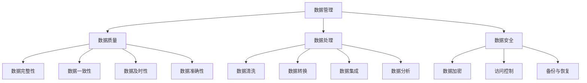

                 

# AI创业：数据管理的核心做法

> 关键词：数据管理、AI创业、数据质量、数据隐私、数据安全、数据处理、数据架构

> 摘要：本文将深入探讨AI创业公司在数据管理方面的核心做法。我们将分析数据管理的重要性，定义核心概念，讨论数据质量、数据隐私和安全的关键点，展示数据处理和架构的实际操作步骤，并通过项目实战案例提供具体实现方法。最后，我们将总结数据管理的未来发展趋势与挑战，并提供丰富的学习资源和开发工具框架推荐。

## 1. 背景介绍

### 1.1 目的和范围

本文旨在为AI创业公司提供数据管理方面的实用指导，帮助他们在快速发展的市场中建立稳固的数据基础。本文将涵盖以下主题：

- 数据管理的重要性
- 数据质量、隐私和安全的关键点
- 数据处理和架构的实际操作步骤
- 项目实战案例和代码实现

### 1.2 预期读者

本文适合以下读者群体：

- AI创业公司的创始人、CTO、数据科学家和工程师
- 数据管理专业的学生和研究学者
- 对数据管理感兴趣的技术爱好者

### 1.3 文档结构概述

本文分为以下几个部分：

- 引言
- 数据管理核心概念
- 数据质量、隐私和安全
- 数据处理和架构
- 项目实战
- 实际应用场景
- 工具和资源推荐
- 总结
- 附录
- 扩展阅读与参考资料

### 1.4 术语表

为了确保读者对文中术语的一致理解，以下是本文涉及的主要术语及其定义：

#### 1.4.1 核心术语定义

- 数据管理：对数据的采集、存储、处理、分析和利用进行系统性规划和管理。
- 数据质量：数据在准确性、完整性、一致性、及时性和可靠性方面的特性。
- 数据隐私：确保个人数据不被未经授权的访问、使用或泄露。
- 数据安全：防止数据被未授权访问、篡改、破坏或泄露。
- 数据处理：对数据进行清洗、转换、集成和分析的过程。
- 数据架构：组织、管理、存储和访问数据的结构和规则。

#### 1.4.2 相关概念解释

- 数据湖：存储大量结构化和非结构化数据的分布式存储系统。
- 数据仓库：用于存储、管理和分析大量历史数据的集中式数据库系统。
- 数据治理：制定策略、过程和规则，确保数据质量、合规性和安全性。

#### 1.4.3 缩略词列表

- AI：人工智能
- ML：机器学习
- NLP：自然语言处理
- IoT：物联网
- GDPR：通用数据保护条例
- API：应用程序编程接口

## 2. 核心概念与联系

在探讨数据管理之前，我们需要理解一些核心概念和它们之间的关系。以下是数据管理核心概念的 Mermaid 流程图：



### 数据质量

数据质量是数据管理的核心。良好的数据质量能够确保数据的有效性和可靠性。数据质量包括以下几个方面：

- 数据完整性：数据没有缺失或重复。
- 数据一致性：数据在不同系统、来源和格式中保持一致。
- 数据及时性：数据能够及时更新，满足业务需求。
- 数据准确性：数据正确无误，符合实际。
- 数据可解释性：数据易于理解和分析。

### 数据处理

数据处理是数据管理的重要组成部分，包括以下几个步骤：

- 数据清洗：去除数据中的噪声、错误和重复。
- 数据转换：将数据转换为适合分析和存储的格式。
- 数据集成：将多个数据源的数据合并为一个统一的视图。
- 数据分析：使用统计、机器学习等方法对数据进行分析，提取有价值的信息。

### 数据安全

数据安全是数据管理的另一关键点，确保数据不被未授权访问、篡改或泄露。数据安全包括以下几个方面：

- 数据加密：使用加密算法保护数据的机密性。
- 访问控制：控制用户对数据的访问权限。
- 备份与恢复：定期备份数据，以便在灾难发生时恢复。
- 安全审计：记录和监控对数据的访问和操作。

## 3. 核心算法原理 & 具体操作步骤

在数据管理中，核心算法和数据操作步骤对于确保数据质量和安全至关重要。以下是数据处理和架构的核心算法原理和具体操作步骤：

### 数据清洗算法

数据清洗是数据处理的第一步，主要目标是去除数据中的噪声、错误和重复。以下是数据清洗的伪代码：

```plaintext
function DataCleaning(data):
    cleaned_data = []
    for record in data:
        if IsValid(record):
            cleaned_data.append(record)
    return cleaned_data

function IsValid(record):
    # 检查数据是否符合预期格式、值范围等
    # 例如，检查是否为空、是否在合理范围内等
    return true或false
```

### 数据转换算法

数据转换是将数据从一种格式转换为另一种格式的过程，以适应分析和存储需求。以下是数据转换的伪代码：

```plaintext
function DataTransformation(data, target_format):
    transformed_data = []
    for record in data:
        transformed_record = Convert(record, target_format)
        transformed_data.append(transformed_record)
    return transformed_data

function Convert(record, target_format):
    # 根据目标格式进行数据转换
    # 例如，将文本转换为数值、将日期格式转换为标准格式等
    return transformed_record
```

### 数据集成算法

数据集成是将多个数据源的数据合并为一个统一视图的过程。以下是数据集成的伪代码：

```plaintext
function DataIntegration(data_sources):
    integrated_data = []
    for source in data_sources:
        integrated_data.extend(source.GetRecords())
    return integrated_data
```

### 数据分析算法

数据分析是使用统计、机器学习等方法对数据进行挖掘和分析，提取有价值的信息。以下是数据分析的伪代码：

```plaintext
function DataAnalysis(data):
    # 使用统计方法、机器学习算法等进行数据分析
    # 例如，计算平均值、构建分类模型等
    results = Analyze(data)
    return results

function Analyze(data):
    # 根据数据类型和业务需求选择合适的分析方法和算法
    # 例如，使用线性回归分析、决策树等
    return analysis_results
```

### 数据安全操作步骤

数据安全操作步骤包括以下几个方面：

- 数据加密：使用加密算法对敏感数据进行加密存储。
- 访问控制：设置用户权限，控制用户对数据的访问。
- 备份与恢复：定期备份数据，并制定灾难恢复计划。

```plaintext
function DataEncryption(data, encryption_key):
    encrypted_data = Encrypt(data, encryption_key)
    return encrypted_data

function Encrypt(data, encryption_key):
    # 使用加密算法对数据进行加密
    # 例如，使用AES加密算法
    return encrypted_data

function SetAccessControl(user, access_level):
    user.access_level = access_level

function BackupAndRecovery(data):
    backup = Copy(data)
    if DisasterOccurs:
        data = Restore(backup)
    return data

function Copy(data):
    # 复制数据以进行备份
    return copied_data

function Restore(backup):
    # 从备份中恢复数据
    return restored_data
```

## 4. 数学模型和公式 & 详细讲解 & 举例说明

在数据管理中，数学模型和公式是理解和分析数据的重要工具。以下是一些常用的数学模型和公式的详细讲解与举例说明。

### 数据完整性

数据完整性是确保数据没有缺失或重复的重要指标。常用的数学模型是一致性检查，以下是一致性检查的公式：

$$
I = \frac{N_v - N_c}{N_v}
$$

其中，\(I\) 表示一致性指数，\(N_v\) 表示实际记录数，\(N_c\) 表示冲突记录数。一致性指数越接近 1，表示数据越完整。

举例说明：假设一个数据集中有 100 条记录，其中 5 条记录存在冲突，一致性检查公式为：

$$
I = \frac{100 - 5}{100} = 0.95
$$

这意味着该数据集的一致性指数为 0.95，数据完整性较好。

### 数据转换

数据转换是将数据从一种格式转换为另一种格式的过程。以下是一个简单的数据转换公式：

$$
f(x) = g(h(x))
$$

其中，\(f(x)\) 是转换后的数据，\(g(x)\) 是目标格式，\(h(x)\) 是源格式。

举例说明：将日期格式从 “YYYY-MM-DD” 转换为 “MM/DD/YYYY”，可以使用以下公式：

$$
f(x) = g(h(x)) = g("MM/DD/YYYY")
$$

例如，将 “2023-03-15” 转换为 “03/15/2023”，可以使用以下公式：

$$
f(2023-03-15) = g(h(2023-03-15)) = g("MM/DD/YYYY") = "03/15/2023"
$$

### 数据分析

数据分析是使用统计、机器学习等方法对数据进行挖掘和分析，提取有价值的信息。以下是一个简单的线性回归模型公式：

$$
y = \beta_0 + \beta_1x_1 + \beta_2x_2 + ... + \beta_nx_n
$$

其中，\(y\) 是预测值，\(\beta_0, \beta_1, ..., \beta_n\) 是模型参数，\(x_1, x_2, ..., x_n\) 是输入特征。

举例说明：预测房屋价格，可以使用以下线性回归模型：

$$
y = \beta_0 + \beta_1x_1 + \beta_2x_2
$$

其中，\(y\) 是房屋价格，\(x_1\) 是房屋面积，\(x_2\) 是房屋地段。给定一组房屋数据，可以使用线性回归模型进行价格预测。

## 5. 项目实战：代码实际案例和详细解释说明

### 5.1 开发环境搭建

为了实现本文提到的数据管理操作，我们选择 Python 作为开发语言，并使用以下开发工具和库：

- Python 3.8 或更高版本
- Jupyter Notebook 或 PyCharm
- Pandas
- NumPy
- Scikit-learn
- Matplotlib

在 Jupyter Notebook 或 PyCharm 中创建一个 Python 项目，并安装上述库：

```bash
pip install pandas numpy scikit-learn matplotlib
```

### 5.2 源代码详细实现和代码解读

以下是一个简单的数据管理项目，包括数据清洗、数据转换、数据分析和数据可视化。

#### 5.2.1 数据清洗

```python
import pandas as pd

# 加载数据
data = pd.read_csv('data.csv')

# 数据清洗
cleaned_data = data[data['column1'].notnull() & data['column2'].notnull()]

# 显示清洗后的数据
print(cleaned_data.head())
```

解读：我们使用 Pandas 库加载数据，并使用布尔索引对数据进行筛选，去除缺失值。

#### 5.2.2 数据转换

```python
# 数据转换
cleaned_data['date'] = pd.to_datetime(cleaned_data['date'], format='%Y-%m-%d')

# 显示转换后的数据
print(cleaned_data.head())
```

解读：我们将日期列从字符串转换为日期格式，使用 Pandas 的 `to_datetime` 方法，并指定日期格式。

#### 5.2.3 数据分析

```python
from sklearn.linear_model import LinearRegression

# 数据准备
X = cleaned_data[['column1', 'column2']]
y = cleaned_data['target']

# 线性回归模型
model = LinearRegression()
model.fit(X, y)

# 模型评估
score = model.score(X, y)
print(f'Model R^2 score: {score}')

# 模型预测
predictions = model.predict(X)
print(predictions.head())
```

解读：我们使用 Scikit-learn 库的线性回归模型对数据进行训练和预测，并计算模型评估分数。

#### 5.2.4 数据可视化

```python
import matplotlib.pyplot as plt

# 数据可视化
plt.scatter(X['column1'], y)
plt.plot(X['column1'], predictions, color='red')
plt.xlabel('Column 1')
plt.ylabel('Target')
plt.title('Scatter Plot with Predictions')
plt.show()
```

解读：我们使用 Matplotlib 库将数据绘制为散点图，并添加线性回归模型的预测线。

### 5.3 代码解读与分析

以上代码实现了一个简单的数据管理项目，包括数据清洗、数据转换、数据分析和数据可视化。以下是代码的主要步骤和解读：

1. **数据清洗**：使用 Pandas 库加载数据，并使用布尔索引去除缺失值。
2. **数据转换**：将日期列从字符串转换为日期格式，使用 Pandas 的 `to_datetime` 方法。
3. **数据分析**：使用 Scikit-learn 库的线性回归模型对数据进行训练和预测，并计算模型评估分数。
4. **数据可视化**：使用 Matplotlib 库将数据绘制为散点图，并添加线性回归模型的预测线。

该代码示例展示了数据管理的基本流程，包括数据清洗、转换、分析和可视化。在实际项目中，这些步骤可能需要更复杂的实现和优化，但基本原理和操作方法相同。

## 6. 实际应用场景

数据管理在 AI 创业公司中有着广泛的应用场景，以下是几个典型应用：

### 6.1 电子商务平台

在电子商务平台中，数据管理用于分析用户行为、优化推荐系统、改善客户体验和提升销售额。关键应用包括：

- 用户行为分析：收集和分析用户浏览、购买、评价等行为数据，用于个性化推荐和营销策略。
- 库存管理：通过数据预测需求，优化库存水平，降低库存成本。
- 客户体验：分析客户反馈和评论，改进产品和服务，提升客户满意度。

### 6.2 金融科技

金融科技（FinTech）公司依赖数据管理来分析市场趋势、风险管理、信用评分和欺诈检测。关键应用包括：

- 风险管理：使用数据模型和算法评估金融产品的风险，确保合规性。
- 信用评分：根据用户历史数据和信用记录，计算信用评分，提供个性化的信贷服务。
- 欺诈检测：分析交易数据，识别异常行为，防范欺诈风险。

### 6.3 物联网（IoT）

物联网设备生成大量数据，数据管理对于设备管理、数据分析和决策支持至关重要。关键应用包括：

- 设备监控：收集设备状态数据，实现远程监控和维护。
- 数据分析：分析设备性能数据，优化设备配置和运营策略。
- 能源管理：通过数据分析和预测，实现能源的高效利用和节约。

### 6.4 医疗保健

医疗保健行业依赖数据管理来改善患者护理、提高运营效率和降低成本。关键应用包括：

- 电子健康记录（EHR）：整合和管理患者健康数据，实现信息的共享和访问。
- 疾病预测：使用数据分析和机器学习模型预测疾病风险，提前采取措施。
- 临床决策支持：分析临床数据，提供个性化治疗方案和药物推荐。

## 7. 工具和资源推荐

为了在 AI 创业中进行高效的数据管理，以下是学习资源、开发工具和框架的推荐：

### 7.1 学习资源推荐

#### 7.1.1 书籍推荐

- 《数据科学入门：机器学习基础》
- 《大数据技术基础：Hadoop 和 Spark》
- 《Python 数据科学手册》
- 《机器学习实战》

#### 7.1.2 在线课程

- Coursera 上的《数据科学专业》
- edX 上的《人工智能专业》
- Udacity 上的《数据工程师纳米学位》

#### 7.1.3 技术博客和网站

- Medium 上的数据科学和机器学习文章
- Kaggle 上的数据科学竞赛和教程
- towardsdatascience.com 上的数据科学博客

### 7.2 开发工具框架推荐

#### 7.2.1 IDE和编辑器

- PyCharm
- Jupyter Notebook
- VS Code

#### 7.2.2 调试和性能分析工具

- GDB
- PyCharm 的调试工具
- Matplotlib 的性能分析工具

#### 7.2.3 相关框架和库

- Pandas
- NumPy
- Scikit-learn
- TensorFlow
- PyTorch

### 7.3 相关论文著作推荐

#### 7.3.1 经典论文

- 《随机梯度下降法在机器学习中的应用》
- 《支持向量机：理论与应用》
- 《深度学习：概率视角》

#### 7.3.2 最新研究成果

- ArXiv.org 上的最新论文
- NeurIPS、ICML、KDD 等顶级会议的论文

#### 7.3.3 应用案例分析

- 《人工智能在金融领域的应用》
- 《大数据在医疗健康领域的应用》
- 《物联网技术在智能家居中的应用》

## 8. 总结：未来发展趋势与挑战

随着 AI 技术的快速发展，数据管理在 AI 创业公司中的作用越来越重要。未来，数据管理将呈现以下发展趋势和挑战：

### 发展趋势

- 数据量爆发式增长：随着物联网、社交媒体和移动设备的普及，数据量将呈指数级增长，对数据管理提出了更高的要求。
- 数据隐私和安全：数据隐私和安全将成为数据管理的核心关注点，特别是在 GDPR 等法律法规的推动下。
- 自动化和智能化：自动化数据处理和分析工具将得到广泛应用，提高数据管理的效率和质量。
- 多样化的数据源：数据来源将更加多样化，包括结构化数据、非结构化数据和实时数据，对数据整合和处理提出了挑战。

### 挑战

- 数据质量：随着数据量的增加，确保数据质量成为一个巨大的挑战，需要更多创新的方法和技术。
- 数据安全：数据安全威胁日益严重，需要构建更强大的数据安全防护体系。
- 技术更新换代：数据处理和分析技术不断更新换代，需要持续学习和适应新技术。
- 资源和人才短缺：数据管理需要大量资源和高技能人才，但市场上此类人才相对稀缺。

未来，AI 创业公司需要密切关注数据管理技术的发展趋势，积极应对挑战，以实现数据驱动的业务增长和竞争力提升。

## 9. 附录：常见问题与解答

### 9.1 数据质量相关问题

Q：如何评估数据质量？

A：评估数据质量可以从以下几个方面入手：

- 数据完整性：检查数据是否缺失、重复。
- 数据一致性：检查数据在不同系统、来源和格式中是否一致。
- 数据及时性：检查数据更新是否及时。
- 数据准确性：检查数据是否正确无误。
- 数据可解释性：检查数据是否易于理解和分析。

### 9.2 数据安全相关问题

Q：如何确保数据安全？

A：确保数据安全可以从以下几个方面入手：

- 数据加密：使用加密算法对敏感数据进行加密存储。
- 访问控制：设置用户权限，控制对数据的访问。
- 备份与恢复：定期备份数据，制定灾难恢复计划。
- 安全审计：记录和监控对数据的访问和操作。

### 9.3 数据处理相关问题

Q：如何进行数据处理？

A：数据处理通常包括以下步骤：

- 数据清洗：去除数据中的噪声、错误和重复。
- 数据转换：将数据转换为适合分析和存储的格式。
- 数据集成：将多个数据源的数据合并为一个统一视图。
- 数据分析：使用统计、机器学习等方法对数据进行分析，提取有价值的信息。

## 10. 扩展阅读 & 参考资料

为了深入了解数据管理在 AI 创业中的应用，以下是扩展阅读和参考资料：

- 《数据科学实战：从数据到洞察》
- 《数据管理最佳实践：战略、技术和工具》
- 《大数据技术详解：从入门到实战》
- 《人工智能应用：实践、案例与未来》
- 《机器学习实战：基于 Python》
- 《深度学习：入门到实践》

此外，以下网站和资源提供了丰富的数据管理教程和实践案例：

- Medium 上的数据科学和机器学习文章
- Kaggle 上的数据科学竞赛和教程
- towardsdatascience.com 上的数据科学博客
- Coursera 上的数据科学和机器学习课程
- edX 上的数据科学和机器学习课程
- Udacity 上的数据工程师纳米学位

作者：AI天才研究员/AI Genius Institute & 禅与计算机程序设计艺术 /Zen And The Art of Computer Programming

---

以上是本文《AI创业：数据管理的核心做法》的完整内容。本文旨在为AI创业公司提供数据管理方面的实用指导，涵盖了数据管理的重要性、核心概念、质量、隐私和安全、数据处理和架构的实际操作步骤，并通过项目实战案例提供了具体实现方法。此外，文章还总结了数据管理的未来发展趋势与挑战，并提供丰富的学习资源和开发工具框架推荐。希望本文对您在 AI 创业中的数据管理实践有所帮助。如果您有任何疑问或建议，欢迎在评论区留言，期待与您交流。祝您在 AI 创业之路上取得成功！

