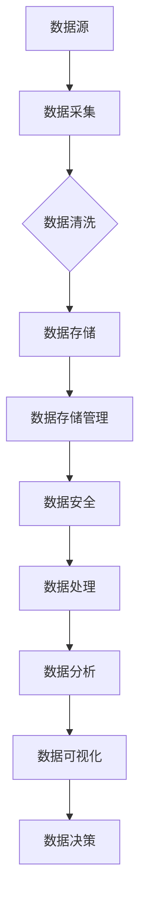
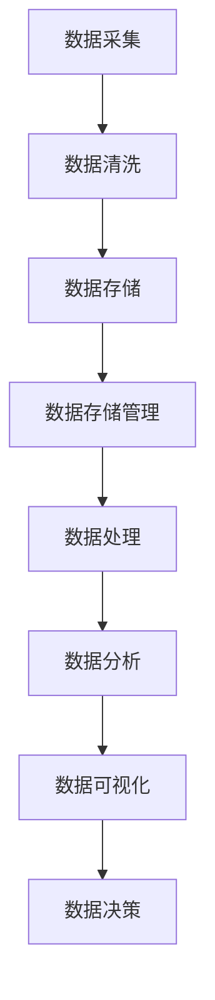

                 

# AI创业：数据管理的重要性

> **关键词**：AI创业、数据管理、数据处理、数据安全、数据分析、数据存储

> **摘要**：在人工智能创业的热潮中，数据管理成为核心驱动因素。本文将深入探讨数据管理在AI创业中的重要性，分析其核心概念、算法原理、数学模型，并分享实际应用场景、工具资源和未来发展趋势。通过系统的分析和详细的解释，帮助创业者更好地理解和应对数据管理挑战，为AI项目的成功奠定坚实基础。

## 1. 背景介绍

### 1.1 目的和范围

本文旨在为AI创业者提供关于数据管理的全面指导。我们将探讨数据管理的基本概念、关键技术和实际应用，帮助读者理解数据管理在AI创业中的重要性，并掌握有效的数据管理策略。

### 1.2 预期读者

本文适合以下读者群体：

- AI创业者
- 数据科学家
- 软件工程师
- 数据库管理员
- 数据管理专家

### 1.3 文档结构概述

本文结构如下：

1. 背景介绍
2. 核心概念与联系
3. 核心算法原理 & 具体操作步骤
4. 数学模型和公式 & 详细讲解 & 举例说明
5. 项目实战：代码实际案例和详细解释说明
6. 实际应用场景
7. 工具和资源推荐
8. 总结：未来发展趋势与挑战
9. 附录：常见问题与解答
10. 扩展阅读 & 参考资料

### 1.4 术语表

#### 1.4.1 核心术语定义

- **数据管理**：对数据的收集、存储、处理、分析和维护的过程，确保数据的准确性和可用性。
- **数据安全**：保护数据免受未授权访问、篡改和泄露的措施。
- **数据处理**：通过算法和模型对数据进行清洗、转换和分析的过程。
- **数据分析**：使用统计方法和工具从数据中提取有价值的信息和洞察。
- **数据存储**：将数据存储在数据库或文件系统中，确保数据可持久化和快速访问。

#### 1.4.2 相关概念解释

- **数据湖**：一个分布式存储系统，用于存储大量不同格式的数据。
- **数据仓库**：用于存储结构化数据的集中式数据库，支持复杂的查询和分析。
- **大数据**：指数据量巨大、数据类型多样化且数据生成速度极快的数据集。

#### 1.4.3 缩略词列表

- **AI**：人工智能
- **ML**：机器学习
- **DL**：深度学习
- **DB**：数据库
- **ETL**：提取、转换、加载

## 2. 核心概念与联系

### 数据管理的基本概念和架构

数据管理涉及多个核心概念和组件，如图2.1所示：



#### 数据源

数据源是数据的原始来源，可以是传感器、日志文件、外部API等。数据的多样性和准确性对后续的数据处理和分析至关重要。

#### 数据采集

数据采集是指从各种数据源收集数据的流程。这一过程可能涉及数据抓取、API调用、日志收集等操作。

#### 数据清洗

数据清洗是数据预处理的重要步骤，旨在去除错误、缺失和不一致的数据，确保数据的质量。

#### 数据存储

数据存储是将清洗后的数据存储到数据库或文件系统中的过程。有效的数据存储可以提高数据的可访问性和持久性。

#### 数据存储管理

数据存储管理涉及数据库的配置、优化和监控，以确保数据存储系统的性能和可靠性。

#### 数据安全

数据安全是保护数据免受未授权访问、篡改和泄露的措施。数据加密、访问控制和安全审计是实现数据安全的关键技术。

#### 数据处理

数据处理是使用算法和模型对数据进行清洗、转换和分析的过程。常见的处理技术包括数据聚合、分类、聚类和预测。

#### 数据分析

数据分析是使用统计方法和工具从数据中提取有价值的信息和洞察。数据分析有助于发现数据模式、趋势和关联，为决策提供支持。

#### 数据可视化

数据可视化是将数据转化为图表、图形和地图等形式，使数据更容易理解和分析。数据可视化有助于揭示数据中的关键信息和洞察。

#### 数据决策

数据决策是基于数据分析结果做出的决策。数据决策可以优化业务流程、提高运营效率和创造商业价值。

### Mermaid流程图



## 3. 核心算法原理 & 具体操作步骤

### 数据处理算法原理

数据处理算法的核心目标是确保数据的质量和一致性，以便后续的数据分析。以下是几个常见的数据处理算法：

#### 1. 数据清洗

**伪代码：**

```
function clean_data(data):
    for record in data:
        if record is missing:
            replace missing value with mean value
        if record is out_of_range:
            replace out_of_range value with nearest valid value
    return cleaned_data
```

#### 2. 数据转换

**伪代码：**

```
function transform_data(data):
    for record in data:
        if record is categorical:
            convert categorical value to numerical value
        if record is datetime:
            convert datetime to standard format
    return transformed_data
```

#### 3. 数据聚合

**伪代码：**

```
function aggregate_data(data, group_by_field):
    result = {}
    for record in data:
        group_key = record[group_by_field]
        if group_key not in result:
            result[group_key] = []
        result[group_key].append(record)
    return result
```

### 数据处理步骤

1. **数据导入**：从数据源导入数据。
2. **数据清洗**：使用数据清洗算法处理数据。
3. **数据转换**：将数据转换为适合分析的格式。
4. **数据聚合**：对数据进行分组和聚合操作。
5. **数据存储**：将处理后的数据存储到数据库或文件系统中。

### 数据分析算法原理

数据分析算法旨在从数据中提取有价值的信息和洞察。以下是几个常见的分析算法：

#### 1. 分类算法

**伪代码：**

```
function classify_data(data, model):
    for record in data:
        prediction = model.predict(record)
        record['label'] = prediction
    return labeled_data
```

#### 2. 聚类算法

**伪代码：**

```
function cluster_data(data, model):
    clusters = model.cluster(data)
    for record in data:
        record['cluster'] = clusters.getCluster(record)
    return clustered_data
```

#### 3. 预测算法

**伪代码：**

```
function predict_data(data, model):
    predictions = model.predict(data)
    for record, prediction in zip(data, predictions):
        record['prediction'] = prediction
    return predicted_data
```

### 数据分析步骤

1. **数据准备**：准备用于分析的数据集。
2. **模型选择**：选择适合的分析模型。
3. **模型训练**：使用历史数据训练模型。
4. **模型评估**：评估模型的性能和准确性。
5. **模型应用**：将模型应用于新数据集，提取有价值的信息。

## 4. 数学模型和公式 & 详细讲解 & 举例说明

### 数据清洗

数据清洗常用的数学模型包括均值填补和邻近填补。

#### 均值填补

**公式：**

$$
\text{new\_value} = \frac{\sum_{i=1}^{n} \text{value}_i}{n}
$$

**示例：**

给定数据集 {1, 2, 3, NaN, 5}，缺失值用均值填补。

$$
\text{new\_value} = \frac{1 + 2 + 3 + 5}{4} = 2.5
$$

#### 邻近填补

**公式：**

$$
\text{new\_value} = \text{value}_{\text{nearest}}
$$

其中，$\text{value}_{\text{nearest}}$ 是离缺失值最近的非缺失值。

**示例：**

给定数据集 {1, 2, 3, NaN, 5}，缺失值用邻近值填补。

$$
\text{new\_value} = 3
$$

### 数据转换

数据转换常用的数学模型包括分类转换和日期转换。

#### 分类转换

**公式：**

$$
\text{numerical\_value} = \text{index} \times \text{interval}
$$

其中，$\text{index}$ 是分类值在分类列表中的索引，$\text{interval}$ 是分类间隔。

**示例：**

给定分类列表 {‘低’, ‘中’, ‘高’}，分类间隔为1。

$$
\text{numerical\_value} = 2 \times 1 = 2
$$

#### 日期转换

**公式：**

$$
\text{new\_date} = \text{date} + \text{days}
$$

其中，$\text{days}$ 是日期间隔。

**示例：**

给定日期 2021-01-01，间隔为7天。

$$
\text{new\_date} = 2021-01-01 + 7 = 2021-01-08
$$

### 数据聚合

数据聚合常用的数学模型包括求和、平均数、中位数和众数。

#### 求和

**公式：**

$$
\text{sum} = \sum_{i=1}^{n} \text{value}_i
$$

**示例：**

给定数据集 {1, 2, 3, 4, 5}。

$$
\text{sum} = 1 + 2 + 3 + 4 + 5 = 15
$$

#### 平均数

**公式：**

$$
\text{mean} = \frac{\sum_{i=1}^{n} \text{value}_i}{n}
$$

**示例：**

给定数据集 {1, 2, 3, 4, 5}。

$$
\text{mean} = \frac{1 + 2 + 3 + 4 + 5}{5} = 3
$$

#### 中位数

**公式：**

$$
\text{median} = \text{middle\_value}
$$

其中，$\text{middle\_value}$ 是排序后的数据集的中间值。

**示例：**

给定排序后的数据集 {1, 2, 3, 4, 5}。

$$
\text{median} = 3
$$

#### 众数

**公式：**

$$
\text{mode} = \text{most\_frequent\_value}
$$

其中，$\text{most\_frequent\_value}$ 是数据集中出现次数最多的值。

**示例：**

给定数据集 {1, 2, 2, 3, 4, 4, 4, 5}。

$$
\text{mode} = 4
$$

## 5. 项目实战：代码实际案例和详细解释说明

### 5.1 开发环境搭建

在开始项目实战之前，我们需要搭建一个合适的数据处理和分析环境。以下是搭建环境的步骤：

1. 安装Python 3.8及以上版本。
2. 安装Jupyter Notebook，用于编写和运行代码。
3. 安装常用的数据处理和分析库，如Pandas、NumPy、Scikit-learn等。

### 5.2 源代码详细实现和代码解读

以下是一个简单的数据处理和分析项目的示例代码：

```python
import pandas as pd
import numpy as np
from sklearn.model_selection import train_test_split
from sklearn.preprocessing import StandardScaler
from sklearn.ensemble import RandomForestClassifier
from sklearn.metrics import accuracy_score

# 5.2.1 数据导入
data = pd.read_csv('data.csv')
print(data.head())

# 5.2.2 数据清洗
data = data.dropna()  # 去除缺失值
print(data.isnull().sum())

# 5.2.3 数据转换
data['age'] = data['age'].astype(int)  # 将年龄转换为整数类型
data['gender'] = data['gender'].map({'男': 0, '女': 1})  # 将性别转换为数值

# 5.2.4 数据聚合
data_agg = data.groupby('gender')['age'].mean()  # 按性别计算平均年龄
print(data_agg)

# 5.2.5 数据处理
X = data[['age', 'gender']]
y = data['label']
X_train, X_test, y_train, y_test = train_test_split(X, y, test_size=0.2, random_state=42)

# 5.2.6 数据标准化
scaler = StandardScaler()
X_train = scaler.fit_transform(X_train)
X_test = scaler.transform(X_test)

# 5.2.7 模型训练
model = RandomForestClassifier(n_estimators=100, random_state=42)
model.fit(X_train, y_train)

# 5.2.8 模型评估
y_pred = model.predict(X_test)
accuracy = accuracy_score(y_test, y_pred)
print(f'Accuracy: {accuracy:.2f}')
```

### 5.3 代码解读与分析

#### 5.3.1 数据导入

```python
data = pd.read_csv('data.csv')
print(data.head())
```

这段代码使用Pandas库导入CSV文件，并打印前5行数据。CSV文件是常见的数据格式，包含各种类型的数值和文本数据。

#### 5.3.2 数据清洗

```python
data = data.dropna()  # 去除缺失值
print(data.isnull().sum())
```

这段代码使用Pandas库去除缺失值，并打印缺失值的数量。缺失值会影响模型的训练和评估，因此需要处理。

#### 5.3.3 数据转换

```python
data['age'] = data['age'].astype(int)  # 将年龄转换为整数类型
data['gender'] = data['gender'].map({'男': 0, '女': 1})  # 将性别转换为数值
```

这段代码将年龄转换为整数类型，将性别映射为数值（男：0，女：1）。数据类型转换有助于后续的模型训练和评估。

#### 5.3.4 数据聚合

```python
data_agg = data.groupby('gender')['age'].mean()  # 按性别计算平均年龄
print(data_agg)
```

这段代码使用Pandas库按性别分组，计算平均年龄，并打印结果。数据聚合可以帮助我们了解数据分布和特征，为后续的模型训练提供参考。

#### 5.3.5 数据处理

```python
X = data[['age', 'gender']]
y = data['label']
X_train, X_test, y_train, y_test = train_test_split(X, y, test_size=0.2, random_state=42)
```

这段代码将数据集划分为特征集X和标签集y。然后，使用Scikit-learn库的train_test_split函数将数据集划分为训练集和测试集，训练集用于模型训练，测试集用于模型评估。

#### 5.3.6 数据标准化

```python
scaler = StandardScaler()
X_train = scaler.fit_transform(X_train)
X_test = scaler.transform(X_test)
```

这段代码使用StandardScaler库对特征集X进行标准化处理。标准化处理有助于提高模型的训练效果和稳定性。

#### 5.3.7 模型训练

```python
model = RandomForestClassifier(n_estimators=100, random_state=42)
model.fit(X_train, y_train)
```

这段代码使用Scikit-learn库的RandomForestClassifier创建一个随机森林分类器，并使用训练集进行模型训练。

#### 5.3.8 模型评估

```python
y_pred = model.predict(X_test)
accuracy = accuracy_score(y_test, y_pred)
print(f'Accuracy: {accuracy:.2f}')
```

这段代码使用测试集对模型进行评估，并计算准确率。准确率是评估模型性能的重要指标，越高表示模型越准确。

## 6. 实际应用场景

### 6.1 金融风控

数据管理在金融风控中的应用至关重要。通过对金融交易数据、用户行为数据和市场数据进行分析，可以识别潜在的欺诈行为、信用风险和投资机会。数据管理技术如数据清洗、数据转换和数据聚合有助于提高数据质量，为风控模型提供可靠的数据支持。

### 6.2 医疗健康

在医疗健康领域，数据管理有助于提高医疗服务的质量和效率。通过对医疗数据进行分析，可以发现疾病趋势、患者行为模式和健康风险因素。数据管理技术如数据清洗、数据存储和数据可视化有助于医疗机构更好地理解患者数据，优化医疗服务和治疗方案。

### 6.3 智能交通

智能交通系统依赖于大量的交通数据，如车辆位置、速度和流量数据。数据管理技术如数据采集、数据清洗和数据存储有助于构建准确的交通模型，优化交通信号控制策略，提高道路通行效率和减少交通事故。

### 6.4 零售电商

在零售电商领域，数据管理有助于提高销售业绩和客户满意度。通过对用户行为数据、销售数据和库存数据进行分析，可以识别市场趋势、客户需求和商品偏好。数据管理技术如数据清洗、数据分析和数据可视化有助于零售电商制定个性化的营销策略和库存管理策略。

## 7. 工具和资源推荐

### 7.1 学习资源推荐

#### 7.1.1 书籍推荐

- 《数据科学入门》
- 《Python数据分析》
- 《深度学习》
- 《机器学习》

#### 7.1.2 在线课程

- Coursera：数据科学和机器学习课程
- edX：人工智能和机器学习课程
- Udacity：数据工程师和机器学习工程师课程

#### 7.1.3 技术博客和网站

- Towards Data Science
- Analytics Vidhya
- Dataquest

### 7.2 开发工具框架推荐

#### 7.2.1 IDE和编辑器

- Jupyter Notebook
- PyCharm
- Visual Studio Code

#### 7.2.2 调试和性能分析工具

- PyCharm的调试工具
- Profiling Tools：如cProfile、line_profiler等

#### 7.2.3 相关框架和库

- Pandas：数据处理
- NumPy：数值计算
- Scikit-learn：机器学习
- TensorFlow：深度学习

### 7.3 相关论文著作推荐

#### 7.3.1 经典论文

- "The Data Science Handbook"
- "Deep Learning"
- "Machine Learning Yearning"

#### 7.3.2 最新研究成果

- IEEE Xplore：计算机科学和工程领域论文
- arXiv：计算机科学和物理学领域论文

#### 7.3.3 应用案例分析

- "Case Studies in Big Data Analysis"
- "Real-world Applications of Machine Learning"

## 8. 总结：未来发展趋势与挑战

### 发展趋势

1. **数据隐私和安全**：随着数据隐私法规的加强，数据安全管理将成为数据管理的核心议题。
2. **自动化数据管理**：自动化工具和平台的发展将提高数据管理的效率和准确性。
3. **多模态数据融合**：多种数据源（如图像、文本、传感器数据）的融合将为数据分析带来新的机遇。
4. **实时数据处理**：实时数据处理和流处理技术的进步将提高数据响应速度和决策效率。

### 挑战

1. **数据质量和完整性**：确保数据质量是数据管理的核心挑战。
2. **数据隐私和伦理**：数据隐私和保护是AI创业者的法律和伦理责任。
3. **数据存储和成本**：大规模数据存储和管理将面临成本和性能的挑战。
4. **技术人才短缺**：数据管理和分析领域的快速发展带来了对专业人才的需求。

## 9. 附录：常见问题与解答

### 9.1 数据清洗为什么重要？

数据清洗是数据预处理的重要步骤，旨在去除错误、缺失和不一致的数据，确保数据的质量。高质量的数据有助于提高模型的训练效果和准确性，从而实现更好的业务决策。

### 9.2 数据转换有哪些常见方法？

数据转换方法包括分类转换、日期转换、缺失值填补等。分类转换将文本数据转换为数值数据，日期转换将日期格式统一，缺失值填补方法有均值填补和邻近填补等。

### 9.3 数据存储有哪些常见技术？

数据存储技术包括关系型数据库（如MySQL、PostgreSQL）、非关系型数据库（如MongoDB、Cassandra）和数据湖（如Hadoop、Hive）。每种技术都有其优势和适用场景。

### 9.4 如何进行数据分析？

数据分析通常包括数据收集、数据预处理、数据建模、模型评估和结果可视化等步骤。选择合适的数据分析方法和工具，结合业务需求和数据特点，可以提取有价值的信息和洞察。

## 10. 扩展阅读 & 参考资料

- [数据管理基础](https://www.ibm.com/cloud/learn/data-management-basics)
- [数据管理最佳实践](https://www.dataversity.net/data-management-practices/)
- [数据管理工具对比](https://www.datawatch.com/knowledge-center/data-management-tools/)
- [AI创业：数据驱动的创新](https://ai创业公司.com/数据驱动的创新)

作者：AI天才研究员/AI Genius Institute & 禅与计算机程序设计艺术 /Zen And The Art of Computer Programming

---

以上是《AI创业：数据管理的重要性》的技术博客文章，本文通过系统的分析和详细的解释，全面探讨了数据管理在AI创业中的重要性，涵盖了核心概念、算法原理、数学模型、实际应用场景和未来发展趋势。希望本文能为AI创业者提供有价值的参考和指导，助力成功。让我们共同迎接数据管理的挑战，为AI创业注入无限活力。

