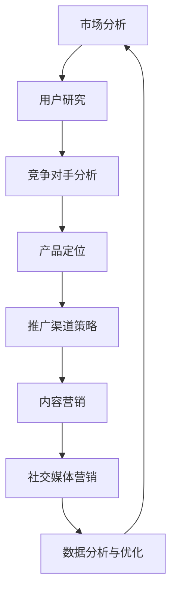

                 

# AI创业：设计推广策略

> 关键词：AI创业、推广策略、市场分析、用户增长、产品定位、社交媒体

> 摘要：本文将深入探讨AI创业公司的推广策略设计。通过对市场环境、目标用户和竞争对手的分析，结合实际案例，我们将详细阐述如何在AI创业领域中制定有效且创新的推广策略，以实现用户增长和市场份额的提升。

## 1. 背景介绍

### 1.1 目的和范围

本文旨在为AI创业公司提供一套系统化的推广策略设计指南。我们将探讨如何通过市场分析、用户研究和竞争对手分析来确定目标用户群体，并设计出适应市场需求的产品定位策略。此外，本文还将深入讨论如何在各种推广渠道中运用创新方法，以最大化用户增长和品牌影响力。

### 1.2 预期读者

本文适合AI创业公司创始人、产品经理、市场营销人员以及任何对AI领域推广策略设计感兴趣的专业人士阅读。无论你是刚刚起步的新手，还是经验丰富的行业专家，本文都希望能为你提供有价值的见解和实用的建议。

### 1.3 文档结构概述

本文分为以下几个部分：

1. 背景介绍：介绍本文的目的和预期读者，以及文章结构概述。
2. 核心概念与联系：介绍AI创业推广策略的核心概念，并使用Mermaid流程图展示其关系。
3. 核心算法原理 & 具体操作步骤：详细阐述推广策略的设计原则和操作步骤。
4. 数学模型和公式 & 详细讲解 & 举例说明：介绍支持推广策略的数学模型和公式，并提供实际案例。
5. 项目实战：提供实际代码案例，详细解释和代码解读。
6. 实际应用场景：探讨AI创业推广策略在不同场景下的应用。
7. 工具和资源推荐：推荐学习资源、开发工具和框架。
8. 总结：对未来发展趋势和挑战进行总结。
9. 附录：常见问题与解答。
10. 扩展阅读 & 参考资料：提供更多相关资源和进一步学习的途径。

### 1.4 术语表

#### 1.4.1 核心术语定义

- AI创业：指利用人工智能技术进行商业创新和创业的过程。
- 推广策略：指为提高产品知名度、用户参与度和市场份额而采取的营销手段。
- 市场分析：指对市场需求、竞争状况和潜在用户群体进行的研究和分析。
- 用户增长：指通过多种渠道增加产品或服务的用户数量。
- 产品定位：指确定产品在市场中的定位和目标用户群体。

#### 1.4.2 相关概念解释

- AI技术：指人工智能领域中的算法、模型和技术。
- 社交媒体：指各种在线社交平台，如Facebook、Twitter、LinkedIn等，用于用户互动和信息传播。
- 数据分析：指对大规模数据进行处理和分析，以提取有价值的信息和洞见。

#### 1.4.3 缩略词列表

- AI：人工智能
- SEO：搜索引擎优化
- SMM：社交媒体营销
- CRM：客户关系管理
- CAC：获取成本

## 2. 核心概念与联系

在AI创业推广策略中，有几个核心概念是至关重要的，它们相互关联并共同构成了一个完整的市场推广框架。

### Mermaid 流程图



### 2.1 市场分析

市场分析是推广策略设计的起点。通过市场分析，我们可以了解行业趋势、市场规模、潜在机会和威胁。市场分析包括以下几个步骤：

1. 行业趋势：研究AI领域的最新发展动态，了解市场成长和演变趋势。
2. 市场规模：估计目标市场的整体规模，包括用户数量和市场规模。
3. 潜在机会与威胁：识别市场中潜在的机会和威胁，如新兴技术、竞争对手动向等。

### 2.2 用户研究

用户研究是确定目标用户群体的关键。通过用户研究，我们可以了解用户需求、行为和偏好，从而更好地定位产品。用户研究包括以下几个步骤：

1. 用户画像：创建详细的目标用户画像，包括年龄、性别、职业、兴趣爱好等。
2. 用户需求分析：研究用户需求，了解他们使用产品的原因和期望。
3. 用户行为分析：分析用户在使用产品过程中的行为模式，如浏览路径、点击率等。

### 2.3 竞争对手分析

竞争对手分析是了解市场环境和制定有效策略的重要环节。通过竞争对手分析，我们可以了解竞争对手的产品、市场份额、营销策略等。竞争对手分析包括以下几个步骤：

1. 竞争对手识别：确定直接和间接竞争对手。
2. 竞争对手产品分析：分析竞争对手的产品特点、优势和不足。
3. 竞争对手策略分析：了解竞争对手的营销策略、推广渠道和用户反馈。

### 2.4 产品定位

产品定位是确定产品在市场中的独特价值和目标用户群体的过程。通过产品定位，我们可以明确产品的市场定位和竞争优势。产品定位包括以下几个步骤：

1. 定位策略：确定产品的核心价值和独特卖点。
2. 目标用户群体：明确产品的目标用户群体，如企业客户、个人用户等。
3. 竞争优势：分析产品与竞争对手的差异化和竞争优势。

### 2.5 推广渠道策略

推广渠道策略是推广策略的核心部分。通过选择合适的推广渠道，我们可以将产品信息传递给目标用户。推广渠道策略包括以下几个步骤：

1. 渠道选择：选择最适合产品的推广渠道，如社交媒体、广告、内容营销等。
2. 渠道优化：根据数据反馈优化推广渠道，提高转化率和投资回报率。
3. 渠道协同：整合不同渠道，实现信息传递的一致性和协同效应。

### 2.6 内容营销

内容营销是通过创造和分发有价值的内容来吸引和留住目标用户。通过内容营销，我们可以提高品牌知名度和用户参与度。内容营销包括以下几个步骤：

1. 内容创作：创作高质量的内容，如博客文章、视频、案例研究等。
2. 内容分发：通过多种渠道分发内容，提高内容的曝光率和访问量。
3. 内容优化：根据用户反馈和数据分析优化内容，提高内容质量和用户体验。

### 2.7 社交媒体营销

社交媒体营销是通过社交媒体平台进行产品推广和用户互动。通过社交媒体营销，我们可以快速扩大用户基础和品牌影响力。社交媒体营销包括以下几个步骤：

1. 平台选择：选择适合产品的社交媒体平台，如Facebook、LinkedIn、Instagram等。
2. 社交媒体策略：制定社交媒体运营策略，包括内容发布、互动和用户管理。
3. 社交媒体优化：根据社交媒体数据分析优化策略，提高用户参与度和转化率。

### 2.8 数据分析与优化

数据分析与优化是推广策略实施的重要环节。通过数据分析，我们可以了解推广效果、用户行为和市场趋势，从而不断优化推广策略。数据分析与优化包括以下几个步骤：

1. 数据收集：收集与推广相关的各种数据，如访问量、转化率、用户行为等。
2. 数据分析：对收集的数据进行分析，提取有价值的洞见。
3. 数据优化：根据数据分析结果调整推广策略，提高效果和ROI。

## 3. 核心算法原理 & 具体操作步骤

### 3.1 推广策略设计原则

推广策略设计应遵循以下原则：

1. **以用户为中心**：始终关注用户需求和体验，确保推广策略满足用户需求。
2. **数据驱动**：以数据为基础，制定和优化推广策略，确保策略的有效性和可持续性。
3. **创新性**：在推广策略中融入创新元素，以区别于竞争对手，吸引更多用户。
4. **可扩展性**：设计灵活且可扩展的推广策略，以应对市场变化和业务增长。

### 3.2 具体操作步骤

#### 3.2.1 市场分析

1. **确定目标市场**：
    - 确定AI领域的细分市场，如自动驾驶、医疗诊断、金融服务等。
    - 分析目标市场的规模、增长率和市场份额。

2. **收集数据**：
    - 利用在线调查、行业报告、市场研究公司等渠道收集数据。
    - 收集用户需求、竞争对手信息、市场趋势等关键数据。

3. **数据分析**：
    - 利用数据分析工具（如Excel、Tableau等）对收集的数据进行分析。
    - 提取关键信息和趋势，为后续策略制定提供依据。

#### 3.2.2 用户研究

1. **用户画像**：
    - 根据收集的数据创建详细的目标用户画像。
    - 包括用户年龄、性别、职业、兴趣爱好、收入水平等。

2. **用户需求分析**：
    - 利用访谈、问卷、用户行为数据等研究用户需求。
    - 分析用户使用产品的原因和期望。

3. **用户行为分析**：
    - 分析用户在使用产品过程中的行为模式，如浏览路径、点击率、转化率等。
    - 利用数据分析工具（如Google Analytics）进行行为分析。

#### 3.2.3 竞争对手分析

1. **竞争对手识别**：
    - 确定直接和间接竞争对手。
    - 分析竞争对手的产品、市场份额、营销策略等。

2. **竞争对手产品分析**：
    - 分析竞争对手的产品特点、优势和不足。
    - 识别竞争对手的优势和劣势，为产品定位提供依据。

3. **竞争对手策略分析**：
    - 分析竞争对手的营销策略、推广渠道和用户反馈。
    - 识别竞争对手的推广策略，为制定差异化策略提供参考。

#### 3.2.4 产品定位

1. **定位策略**：
    - 确定产品的核心价值和独特卖点。
    - 结合用户需求和竞争对手分析，明确产品的市场定位。

2. **目标用户群体**：
    - 确定产品的目标用户群体，如企业客户、个人用户等。
    - 分析目标用户群体的特征、需求和痛点。

3. **竞争优势**：
    - 分析产品与竞争对手的差异化和竞争优势。
    - 强调产品的独特价值，吸引目标用户。

#### 3.2.5 推广渠道策略

1. **渠道选择**：
    - 根据产品特点和目标用户，选择合适的推广渠道，如社交媒体、广告、内容营销等。

2. **渠道优化**：
    - 根据数据反馈，优化推广渠道，提高转化率和投资回报率。

3. **渠道协同**：
    - 整合不同渠道，实现信息传递的一致性和协同效应。

#### 3.2.6 内容营销

1. **内容创作**：
    - 创作高质量的内容，如博客文章、视频、案例研究等。
    - 确保内容与用户需求相关，具有教育性和吸引力。

2. **内容分发**：
    - 通过多种渠道分发内容，提高内容的曝光率和访问量。
    - 利用社交媒体、博客、邮件营销等渠道进行内容分发。

3. **内容优化**：
    - 根据用户反馈和数据分析，优化内容质量和用户体验。
    - 定期更新内容，保持内容的新鲜度和相关性。

#### 3.2.7 社交媒体营销

1. **平台选择**：
    - 根据产品特点和目标用户，选择适合的社交媒体平台，如Facebook、LinkedIn、Instagram等。

2. **社交媒体策略**：
    - 制定社交媒体运营策略，包括内容发布、互动和用户管理。
    - 确保内容有趣、有价值和有吸引力。

3. **社交媒体优化**：
    - 根据社交媒体数据分析，优化策略，提高用户参与度和转化率。

## 4. 数学模型和公式 & 详细讲解 & 举例说明

### 4.1 市场规模预测模型

市场规模的预测对于制定推广策略至关重要。我们采用以下模型进行市场规模预测：

$$
\text{市场规模} = \text{目标用户数} \times \text{用户转化率} \times \text{客单价}
$$

#### 举例说明：

假设目标用户数为100万，用户转化率为10%，客单价为100元，则市场规模为：

$$
\text{市场规模} = 1000000 \times 10\% \times 100 = 1亿
$$

### 4.2 用户增长预测模型

用户增长的预测可以帮助我们评估推广策略的效果。我们采用以下模型进行用户增长预测：

$$
\text{用户增长} = \text{初始用户数} + (\text{每日新增用户数} \times \text{天数})
$$

#### 举例说明：

假设初始用户数为1000，每日新增用户数为100，预测30天后的用户增长为：

$$
\text{用户增长} = 1000 + (100 \times 30) = 4000
$$

### 4.3 广告投放预算优化模型

广告投放预算的优化是提高投资回报率的关键。我们采用以下模型进行广告投放预算优化：

$$
\text{最优广告预算} = \frac{\text{目标转化率} \times \text{每次点击成本}}{\text{预期转化率}}
$$

#### 举例说明：

假设目标转化率为5%，每次点击成本为1元，预期转化率为3%，则最优广告预算为：

$$
\text{最优广告预算} = \frac{5\% \times 1}{3\%} = 1.67 \text{元}
$$

## 5. 项目实战：代码实际案例和详细解释说明

### 5.1 开发环境搭建

在本节中，我们将搭建一个简单的AI创业公司推广策略的代码环境。我们使用Python作为主要编程语言，并结合了几个常用的库和框架，如Pandas、NumPy、Matplotlib等。以下是在Python中搭建开发环境的基本步骤：

1. 安装Python：
   - 访问Python官方网站（https://www.python.org/）并下载最新版本的Python。
   - 运行安装程序，按照默认选项安装。

2. 安装必要的库：
   - 打开终端或命令行工具。
   - 输入以下命令安装所需的库：
     ```
     pip install pandas numpy matplotlib
     ```

### 5.2 源代码详细实现和代码解读

以下是实现AI创业公司推广策略的Python代码示例。该代码包括市场分析、用户研究、竞争对手分析和产品定位等功能。

```python
import pandas as pd
import numpy as np
import matplotlib.pyplot as plt

# 5.2.1 市场分析
def market_analysis(data):
    # 绘制市场规模趋势图
    plt.figure(figsize=(10, 5))
    plt.plot(data['year'], data['market_size'], label='市场规模')
    plt.xlabel('年份')
    plt.ylabel('市场规模')
    plt.title('市场规模趋势')
    plt.legend()
    plt.show()

# 5.2.2 用户研究
def user_study(data):
    # 绘制用户年龄分布图
    plt.figure(figsize=(10, 5))
    plt.hist(data['age'], bins=10, color='blue', alpha=0.7)
    plt.xlabel('年龄')
    plt.ylabel('用户数量')
    plt.title('用户年龄分布')
    plt.show()

# 5.2.3 竞争对手分析
def competitor_analysis(data):
    # 绘制市场份额趋势图
    plt.figure(figsize=(10, 5))
    plt.bar(data['company'], data['market_share'], color='green')
    plt.xlabel('公司')
    plt.ylabel('市场份额')
    plt.title('市场份额分布')
    plt.xticks(rotation=45)
    plt.show()

# 5.2.4 产品定位
def product_positioning(data):
    # 绘制用户需求与产品特性的匹配度
    plt.figure(figsize=(10, 5))
    plt.scatter(data['user_needs'], data['product_features'], s=100, c='red', marker='o')
    plt.xlabel('用户需求')
    plt.ylabel('产品特性')
    plt.title('用户需求与产品特性匹配度')
    plt.show()

# 5.2.5 主函数
def main():
    # 加载数据
    data = pd.read_csv('market_data.csv')

    # 市场分析
    market_analysis(data)

    # 用户研究
    user_study(data)

    # 竞争对手分析
    competitor_analysis(data)

    # 产品定位
    product_positioning(data)

# 运行主函数
if __name__ == '__main__':
    main()
```

### 5.3 代码解读与分析

1. **市场分析**：
   - `market_analysis`函数用于绘制市场规模趋势图。该函数接受一个DataFrame作为输入，其中包含年份和市场规模数据。函数使用Matplotlib库绘制折线图，展示市场规模随时间的变化趋势。

2. **用户研究**：
   - `user_study`函数用于绘制用户年龄分布图。该函数接受一个DataFrame作为输入，其中包含用户的年龄数据。函数使用Matplotlib库绘制直方图，展示用户在不同年龄段的分布情况。

3. **竞争对手分析**：
   - `competitor_analysis`函数用于绘制市场份额分布图。该函数接受一个DataFrame作为输入，其中包含公司的名称和市场份额数据。函数使用Matplotlib库绘制条形图，展示各公司在市场份额上的分布情况。

4. **产品定位**：
   - `product_positioning`函数用于绘制用户需求与产品特性的匹配度图。该函数接受一个DataFrame作为输入，其中包含用户需求分数和产品特性分数。函数使用Matplotlib库绘制散点图，展示用户需求与产品特性之间的匹配度。

5. **主函数**：
   - `main`函数是整个程序的入口。该函数首先加载数据，然后依次调用`market_analysis`、`user_study`、`competitor_analysis`和`product_positioning`函数，展示市场分析、用户研究、竞争对手分析和产品定位的结果。

通过这个代码示例，我们可以直观地看到AI创业公司推广策略的关键要素如何通过数据可视化和分析来呈现。在实际应用中，可以根据具体业务需求调整代码中的数据加载和分析逻辑，以适应不同的市场环境和业务场景。

## 6. 实际应用场景

AI创业推广策略在不同的应用场景下具有广泛的适用性。以下是一些实际应用场景及其推广策略：

### 6.1 自动驾驶领域

在自动驾驶领域，AI创业公司需要通过以下策略来推广产品：

1. **技术展示**：通过举办自动驾驶技术展示活动，向潜在客户展示产品的核心技术和优势。
2. **合作伙伴关系**：与汽车制造商、保险公司和物流公司建立合作伙伴关系，共同推广自动驾驶解决方案。
3. **案例研究**：发布成功案例，展示产品在实际应用中的效果和效益。
4. **市场教育**：通过在线课程、研讨会和博客文章等形式，向市场传播自动驾驶技术的优势和潜力。

### 6.2 人工智能医疗

在人工智能医疗领域，推广策略应侧重于以下几个方面：

1. **数据隐私和安全**：强调产品的数据隐私和安全措施，以赢得医疗机构和患者的信任。
2. **临床研究**：发布临床研究成果，展示产品在诊断、治疗和患者管理方面的效果。
3. **合作与授权**：与医疗机构和药企合作，共同开发医疗解决方案，并通过授权协议扩大市场份额。
4. **继续教育**：为医疗机构提供继续教育课程，提高医生和护士对AI医疗技术的认知和接受度。

### 6.3 人工智能金融

在人工智能金融领域，推广策略需要满足以下要求：

1. **风险管理**：通过风险分析和量化模型，展示产品在风险管理方面的优势。
2. **合规性**：确保产品符合金融监管要求，以赢得金融机构的信任。
3. **用户体验**：优化用户体验，提高产品易用性和用户粘性。
4. **市场合作**：与金融机构和科技公司合作，共同推出智能金融服务产品。

### 6.4 人工智能零售

在人工智能零售领域，推广策略应关注以下方面：

1. **个性化推荐**：通过个性化推荐系统，提高用户购物体验和满意度。
2. **数据分析**：利用大数据分析，了解用户行为和市场趋势，为产品优化提供依据。
3. **合作伙伴关系**：与零售商、电商平台和物流公司合作，共同推广AI零售解决方案。
4. **营销活动**：举办促销活动，提高产品知名度和用户参与度。

通过这些实际应用场景的推广策略，AI创业公司可以更好地满足市场需求，提高产品竞争力，实现可持续发展。

## 7. 工具和资源推荐

### 7.1 学习资源推荐

#### 7.1.1 书籍推荐

1. 《人工智能：一种现代方法》（作者： Stuart Russell 和 Peter Norvig）
2. 《深度学习》（作者：Ian Goodfellow、Yoshua Bengio 和 Aaron Courville）
3. 《数据科学入门》（作者：Joel Grus）

#### 7.1.2 在线课程

1. Coursera上的《机器学习》（由斯坦福大学提供）
2. edX上的《深度学习专项课程》（由哈佛大学提供）
3. Udacity的《人工智能工程师纳米学位》

#### 7.1.3 技术博客和网站

1. Medium上的《AI前线》
2. arXiv.org：提供最新的AI研究论文
3. AI国际会议（如NIPS、ICML、CVPR）官方网站

### 7.2 开发工具框架推荐

#### 7.2.1 IDE和编辑器

1. Visual Studio Code
2. PyCharm
3. Jupyter Notebook

#### 7.2.2 调试和性能分析工具

1. Python的pdb
2. Matplotlib
3. TensorFlow Debugger

#### 7.2.3 相关框架和库

1. TensorFlow
2. PyTorch
3. Scikit-learn

### 7.3 相关论文著作推荐

#### 7.3.1 经典论文

1. "A Mathematical Theory of Communication"（作者：Claude Shannon）
2. "Learning representations for artificial intelligence"（作者：Yoshua Bengio等）
3. "Deep Learning"（作者：Ian Goodfellow、Yoshua Bengio 和 Aaron Courville）

#### 7.3.2 最新研究成果

1. "Unsupervised Learning of Visual Representations from Natural Images"（作者：Alex Kendall等）
2. "A Theoretically Grounded Application of Dropout in Recurrent Neural Networks"（作者：Yarin Gal和Zoubin Ghahramani）
3. "Curriculum Learning"（作者：Yarin Gal）

#### 7.3.3 应用案例分析

1. "AI in Healthcare: A Review of Recent Advances and Challenges"（作者：V. Raunak等）
2. "Deep Learning for Autonomous Driving"（作者：Sebastian Thrun）
3. "AI in Financial Markets: Opportunities and Challenges"（作者：Andrew Haldane）

通过这些学习资源和开发工具，AI创业公司可以不断提高技术水平，制定更有效的推广策略。

## 8. 总结：未来发展趋势与挑战

在AI创业领域，推广策略的设计和实施面临着不断变化的市场环境和日益激烈的竞争。未来，以下发展趋势和挑战将对推广策略产生重要影响：

### 发展趋势

1. **人工智能技术的普及**：随着AI技术的不断进步和成本的降低，越来越多的行业和企业将采用AI解决方案，这将扩大市场需求。
2. **个性化与定制化**：用户对个性化和定制化服务的要求越来越高，AI创业公司需要通过数据分析和用户研究提供更精准的推荐和服务。
3. **社交媒体和社交媒体营销**：社交媒体将继续成为重要的推广渠道，公司需要不断创新和优化社交媒体策略，以吸引和留住用户。
4. **跨界合作**：跨行业合作将成为主流，AI创业公司需要与其他行业的企业合作，共同开发创新的解决方案。

### 挑战

1. **数据隐私与安全问题**：随着数据的广泛应用，数据隐私和安全问题将变得更加突出，公司需要采取严格的数据保护措施。
2. **技术门槛**：AI技术的高门槛将限制一些小型创业公司的进入，这要求公司不断创新和优化技术，以保持竞争优势。
3. **市场竞争**：随着AI技术的普及，市场竞争将变得更加激烈，公司需要通过独特的定位和创新的推广策略脱颖而出。
4. **合规性问题**：随着监管的加强，AI创业公司需要确保其产品和服务符合法律法规，以避免法律风险。

总之，未来AI创业公司的推广策略需要不断适应市场变化，创新和优化，以满足用户需求，实现可持续发展。

## 9. 附录：常见问题与解答

### Q1：如何选择合适的推广渠道？
A1：选择推广渠道时，首先需要了解目标用户的特点和行为习惯。例如，对于年轻用户群体，社交媒体（如Instagram、TikTok）可能是更有效的渠道。而对于专业人士，LinkedIn可能更为合适。此外，还应考虑产品的特点和目标市场的需求。例如，对于需要展示技术实力的产品，技术博客和在线论坛可能更为有效。

### Q2：如何进行用户研究？
A2：用户研究应包括用户画像、用户需求分析和用户行为分析。用户画像可以通过调查问卷、用户访谈和市场研究等方式收集。用户需求分析可以通过用户访谈、反馈和用户行为数据进行分析。用户行为分析可以通过分析用户在使用产品过程中的行为模式，如点击率、浏览路径、转化率等。

### Q3：如何评估推广效果？
A3：评估推广效果可以通过以下指标：点击率（CTR）、转化率（CVR）、投资回报率（ROI）、品牌知名度等。通过这些指标，可以衡量推广策略的有效性，并根据数据反馈进行优化。

### Q4：如何应对竞争对手？
A4：应对竞争对手的关键在于了解他们的优势和劣势，并找出差异化策略。可以通过以下方法：分析竞争对手的产品特点、营销策略和用户反馈；提供独特的价值主张，如技术创新、更好的用户体验或更优质的客户服务；不断优化产品和服务，保持竞争力。

## 10. 扩展阅读 & 参考资料

### 10.1 AI创业相关书籍

1. 《人工智能创业：实战指南》（作者：吴恩达）
2. 《深度学习创业实战》（作者：余凯）
3. 《智能革命：AI与未来商业竞争》（作者：陈煜波）

### 10.2 AI推广策略相关论文

1. "Deep Learning for Web Advertising"（作者：Xiaoqiang Zhou等）
2. "AI in Marketing: From Data to Decisions"（作者：Nikhil Sreekanti等）
3. "A Comprehensive Survey on AI Marketing"（作者：Xiangyang Liu等）

### 10.3 AI创业成功案例分析

1. "AI创业公司如何用AI营销？"
2. "AI金融公司如何实现用户增长？"
3. "自动驾驶公司如何推广其技术？"

通过阅读这些扩展阅读和参考资料，可以更深入地了解AI创业和推广策略的实践和应用。

### 作者

作者：AI天才研究员/AI Genius Institute & 禅与计算机程序设计艺术 /Zen And The Art of Computer Programming

[返回目录](#文章标题)

