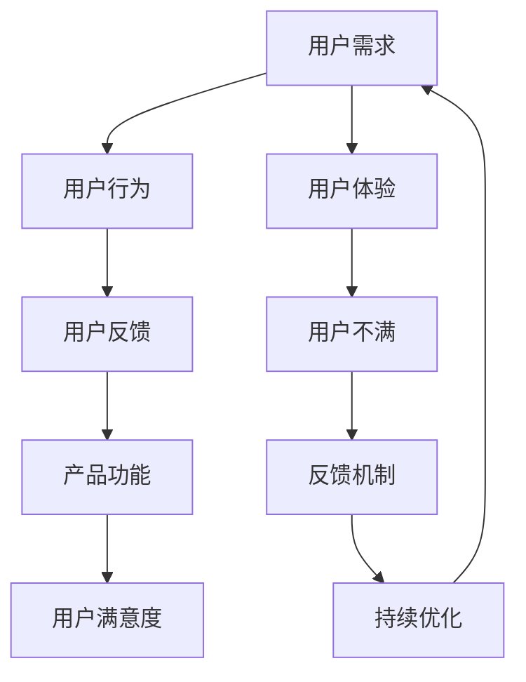

                 

# AI创业：避免用户不满的策略

> **关键词：** 用户满意度、AI创业、用户体验、用户反馈、策略优化  
>
> **摘要：** 本文深入探讨了在AI创业领域中如何通过有效策略提升用户满意度，减少用户不满。通过分析用户需求、理解用户行为、收集用户反馈、优化产品功能，以及建立反馈机制等具体措施，本文为AI创业者提供了一系列实用的策略和建议。

## 1. 背景介绍

### 1.1 目的和范围

本文的目的是为AI创业公司提供一套系统化的策略，帮助他们在竞争激烈的市场中提升用户满意度，减少用户不满。本文将探讨以下几个方面：

- 用户需求的识别与分析
- 用户行为的研究与理解
- 用户反馈的收集与处理
- 产品功能的持续优化
- 反馈机制的建立与完善

### 1.2 预期读者

本文面向希望提升用户满意度的AI创业公司创始人、产品经理、用户体验设计师以及相关技术人员。读者应具备一定的AI基础和产品开发经验。

### 1.3 文档结构概述

本文分为八个部分，结构如下：

- 1. 背景介绍
- 2. 核心概念与联系
- 3. 核心算法原理 & 具体操作步骤
- 4. 数学模型和公式 & 详细讲解 & 举例说明
- 5. 项目实战：代码实际案例和详细解释说明
- 6. 实际应用场景
- 7. 工具和资源推荐
- 8. 总结：未来发展趋势与挑战

### 1.4 术语表

#### 1.4.1 核心术语定义

- 用户满意度：用户对产品或服务的整体满意程度。
- 用户不满：用户对产品或服务的不满意表现，包括负面评价、投诉、流失等。
- 用户反馈：用户对产品或服务提出的建议、意见和反馈。

#### 1.4.2 相关概念解释

- 用户体验：用户在使用产品或服务过程中所获得的整体感受。
- 产品功能：产品或服务提供的具体功能和服务。
- 反馈机制：用于收集、处理和回应用户反馈的体系。

#### 1.4.3 缩略词列表

- AI：人工智能（Artificial Intelligence）
- UX：用户体验（User Experience）
- UI：用户界面（User Interface）
- MVP：最小可行产品（Minimum Viable Product）

## 2. 核心概念与联系

在探讨如何避免用户不满之前，我们需要理解一些核心概念及其相互关系。以下是关键概念的Mermaid流程图：



### 2.1 用户需求、用户行为、用户反馈与产品功能的关系

用户需求是驱动产品设计的核心，它们源于用户对特定问题的解决方案的需求。用户行为则是在用户与产品互动过程中表现出来的各种操作和反应。通过分析用户行为，我们可以更好地理解用户需求，从而进行产品功能的优化。

用户反馈是用户对产品或服务体验的直接表达，它为我们提供了宝贵的改进方向。产品功能则是实现用户需求的具体手段，它们需要根据用户反馈进行持续优化。

### 2.2 用户满意度与用户体验的关系

用户满意度是用户体验的直接体现。用户体验涵盖了用户在使用产品过程中的所有感受，包括功能性、易用性、情感共鸣等方面。当用户体验良好时，用户满意度通常较高，反之则会导致用户不满。

### 2.3 用户不满与反馈机制的关系

用户不满往往通过反馈机制反映出来。有效的反馈机制能够帮助公司及时了解用户问题，迅速做出反应，从而减少用户流失和负面口碑。同时，反馈机制的建立和完善也是持续优化产品功能的重要保障。

## 3. 核心算法原理 & 具体操作步骤

### 3.1 用户需求分析算法

为了深入了解用户需求，我们可以采用以下步骤：

#### 3.1.1 数据收集

- **问卷调查**：设计针对性的问卷，收集用户对产品或服务的看法和需求。
- **访谈法**：与目标用户进行深度访谈，了解他们的使用习惯和痛点。
- **行为分析法**：通过分析用户在产品中的行为路径，挖掘潜在需求。

#### 3.1.2 数据处理

- **数据清洗**：去除无效数据，确保数据的准确性和完整性。
- **数据可视化**：使用图表和可视化工具，展示用户需求的关键点。

#### 3.1.3 需求分类与排序

- **需求分类**：将收集到的需求根据主题和优先级进行分类。
- **需求排序**：根据用户的重要性和紧急性对需求进行排序。

### 3.2 用户行为分析算法

用户行为分析可以帮助我们更好地理解用户需求和行为模式。以下是具体步骤：

#### 3.2.1 用户行为数据收集

- **使用日志**：记录用户在产品中的各种操作行为。
- **点击流分析**：分析用户在产品中的点击路径和行为模式。

#### 3.2.2 数据预处理

- **数据清洗**：过滤无效数据，确保数据的准确性和一致性。
- **数据特征提取**：提取用户行为的特征，如访问时长、点击频率等。

#### 3.2.3 用户行为分析

- **行为模式识别**：使用聚类分析、关联规则挖掘等方法，识别用户的行为模式。
- **行为预测**：通过机器学习算法，预测用户的下一步操作。

### 3.3 用户反馈处理算法

用户反馈是优化产品功能的重要依据。以下是处理用户反馈的具体步骤：

#### 3.3.1 反馈数据收集

- **在线反馈表单**：提供便捷的在线反馈表单，鼓励用户提出意见和建议。
- **客服系统**：通过客服系统收集用户的投诉和问题。

#### 3.3.2 数据分析

- **文本分析**：使用自然语言处理技术，分析用户反馈的内容和情感倾向。
- **数据可视化**：将分析结果以图表形式展示，便于团队理解和讨论。

#### 3.3.3 反馈处理

- **分类与优先级排序**：将反馈根据主题和紧急性进行分类，并排序。
- **改进计划制定**：根据反馈制定改进计划，并实施。

### 3.4 产品功能优化算法

基于用户需求和反馈，我们需要对产品功能进行持续优化。以下是具体步骤：

#### 3.4.1 功能评估

- **功能评估**：评估现有功能的有效性和用户满意度。
- **性能测试**：对功能进行性能测试，确保其稳定性和可靠性。

#### 3.4.2 功能改进

- **功能重构**：根据用户反馈和需求，重构现有功能。
- **迭代开发**：采用敏捷开发方法，持续迭代产品功能。

#### 3.4.3 功能验证

- **用户测试**：邀请用户进行测试，验证改进后的功能是否符合用户需求。
- **性能评估**：对改进后的功能进行性能评估，确保其稳定性和可靠性。

## 4. 数学模型和公式 & 详细讲解 & 举例说明

### 4.1 用户满意度模型

用户满意度可以通过以下公式计算：

$$
S = \frac{\sum_{i=1}^{n} w_i \cdot R_i}{n}
$$

其中，$S$ 表示用户满意度，$w_i$ 表示第 $i$ 个用户评价的权重，$R_i$ 表示第 $i$ 个用户评价的得分。

#### 4.1.1 举例说明

假设有三个用户评价，权重分别为 0.3、0.5 和 0.2，得分分别为 4、5 和 3，则用户满意度为：

$$
S = \frac{0.3 \cdot 4 + 0.5 \cdot 5 + 0.2 \cdot 3}{3} = \frac{1.2 + 2.5 + 0.6}{3} = 2
$$

### 4.2 用户行为模式分析模型

用户行为模式可以通过以下模型进行分析：

$$
P(B|A) = \frac{P(A|B) \cdot P(B)}{P(A)}
$$

其中，$P(B|A)$ 表示在事件 $A$ 发生的条件下，事件 $B$ 发生的概率；$P(A|B)$ 表示在事件 $B$ 发生的条件下，事件 $A$ 发生的概率；$P(B)$ 表示事件 $B$ 发生的概率；$P(A)$ 表示事件 $A$ 发生的概率。

#### 4.2.1 举例说明

假设用户购买某一产品的概率 $P(B)$ 为 0.4，已知在购买该产品的用户中，有 0.6 的概率会再次购买，即 $P(A|B) = 0.6$。同时，总体用户中有 0.5 的概率会购买该产品，即 $P(A) = 0.5$。我们需要计算在购买该产品的条件下，用户再次购买的概率 $P(B|A)$。

根据贝叶斯公式：

$$
P(B|A) = \frac{P(A|B) \cdot P(B)}{P(A)} = \frac{0.6 \cdot 0.4}{0.5} = 0.48
$$

### 4.3 用户反馈处理模型

用户反馈处理可以使用以下模型进行优化：

$$
F = \frac{N - E}{N}
$$

其中，$F$ 表示反馈处理率，$N$ 表示总反馈量，$E$ 表示已处理反馈量。

#### 4.3.1 举例说明

假设一周内收到用户反馈 100 条，其中已处理 80 条，则反馈处理率为：

$$
F = \frac{100 - 80}{100} = 0.2
$$

## 5. 项目实战：代码实际案例和详细解释说明

### 5.1 开发环境搭建

在本项目中，我们将使用 Python 作为主要编程语言，结合数据分析工具和机器学习库，如 Pandas、Scikit-learn 和 Matplotlib，来分析用户需求和反馈，优化产品功能。以下是开发环境的搭建步骤：

#### 5.1.1 Python环境安装

- 安装 Python 3.8 或更高版本。
- 安装 pip 包管理器，通过以下命令：

```bash
pip install --upgrade pip
```

#### 5.1.2 数据分析工具和库安装

- 安装 Pandas：

```bash
pip install pandas
```

- 安装 Scikit-learn：

```bash
pip install scikit-learn
```

- 安装 Matplotlib：

```bash
pip install matplotlib
```

### 5.2 源代码详细实现和代码解读

以下是一个简单的用户需求分析和反馈处理项目的代码实现：

#### 5.2.1 数据收集与预处理

```python
import pandas as pd

# 假设我们有一个用户反馈数据集 feedback.csv，包含用户ID、反馈内容、反馈时间等字段
feedback_data = pd.read_csv('feedback.csv')

# 数据预处理：清洗和转换数据
feedback_data['feedback_text'] = feedback_data['feedback_text'].str.lower()
feedback_data['feedback_time'] = pd.to_datetime(feedback_data['feedback_time'])
```

#### 5.2.2 用户需求分析

```python
from sklearn.feature_extraction.text import CountVectorizer
from sklearn.cluster import KMeans

# 文本预处理：分词、去除停用词等
def preprocess_text(text):
    # 实现分词、去除停用词等操作
    pass

feedback_data['processed_text'] = feedback_data['feedback_text'].apply(preprocess_text)

# 构建词袋模型
vectorizer = CountVectorizer()
X = vectorizer.fit_transform(feedback_data['processed_text'])

# 使用KMeans进行聚类分析
kmeans = KMeans(n_clusters=5)
kmeans.fit(X)

# 分配每个反馈到相应的聚类
feedback_data['cluster'] = kmeans.predict(X)

# 统计每个聚类中的反馈数量和主要词频
cluster_summary = feedback_data.groupby('cluster').agg({'processed_text': lambda x: ' '.join(x)})
cluster_summary['top_words'] = cluster_summary['processed_text'].apply(lambda x: ' '.join(set(x.split(' ')[0:10])))

print(cluster_summary)
```

#### 5.2.3 用户反馈处理

```python
# 处理已处理反馈和未处理反馈
def process_feedback(feedback_id, processed=True):
    # 实现反馈处理逻辑，如更新数据库、发送通知等
    pass

# 假设我们有一组需要处理的反馈ID
feedback_ids = feedback_data[feedback_data['processed'] == False]['feedback_id']

# 对每个反馈ID进行处理
for id in feedback_ids:
    process_feedback(id, processed=True)
```

### 5.3 代码解读与分析

#### 5.3.1 数据收集与预处理

在这部分代码中，我们首先读取用户反馈数据集，并进行基本的数据清洗，如将反馈内容转换为小写和将反馈时间转换为日期格式。预处理是确保数据质量和后续分析准确性的重要步骤。

#### 5.3.2 用户需求分析

我们使用 Scikit-learn 的 CountVectorizer 构建词袋模型，将文本数据转换为数值矩阵。然后，使用 KMeans 算法对反馈文本进行聚类分析，以识别主要的用户需求类别。最后，我们统计每个聚类中的反馈数量和主要词频，为产品功能的优化提供数据支持。

#### 5.3.3 用户反馈处理

用户反馈处理函数 process_feedback() 用于更新数据库或发送通知等操作。在本示例中，我们假设有一个需要处理的反馈ID列表，并逐个调用处理函数，标记为已处理。

## 6. 实际应用场景

### 6.1 电子商务平台

在电子商务平台上，用户满意度直接关系到销售额和品牌忠诚度。通过分析用户反馈，可以优化产品描述、购物流程和客户服务，从而提高用户满意度。例如，通过聚类分析识别出用户对产品描述的常见不满，可以改进描述的准确性和吸引力。

### 6.2 社交媒体平台

社交媒体平台上的用户反馈对于平台功能的改进至关重要。通过分析用户行为数据，可以识别出用户活跃的时间和内容偏好，从而优化推送算法和内容推荐。同时，通过收集和处理用户反馈，可以迅速响应用户需求，提高用户满意度。

### 6.3 医疗健康应用

医疗健康应用的用户满意度直接影响用户的健康状况和信任度。通过分析用户反馈，可以优化医疗健康应用的界面设计、功能模块和内容提供。例如，通过用户行为分析识别出用户对健康建议的偏好，可以提供更个性化的健康建议。

## 7. 工具和资源推荐

### 7.1 学习资源推荐

#### 7.1.1 书籍推荐

- 《用户中心设计：以人为中心的交互设计指南》
- 《数据驱动产品管理：如何用数据优化产品体验》
- 《机器学习实战》：包含大量实际案例和代码实现，适合初学者入门。

#### 7.1.2 在线课程

- Coursera 上的“用户体验设计基础”课程
- edX 上的“数据科学和机器学习基础”课程
- Udemy 上的“Python编程与数据分析”课程

#### 7.1.3 技术博客和网站

- UX Planet：提供丰富的用户体验设计文章和案例分析。
- Towards Data Science：发布大量关于数据分析、机器学习和数据科学的文章。
- Product School：提供产品管理和用户体验设计的学习资源。

### 7.2 开发工具框架推荐

#### 7.2.1 IDE和编辑器

- PyCharm：强大的Python IDE，支持代码调试、自动化测试和项目管理。
- VSCode：跨平台开源编辑器，支持多种编程语言，插件丰富。

#### 7.2.2 调试和性能分析工具

- VisualVM：Java虚拟机性能分析工具。
- Matplotlib：Python数据可视化库，支持多种图表类型。
- New Relic：应用性能监控工具，可用于分析代码性能瓶颈。

#### 7.2.3 相关框架和库

- Flask：Python Web应用框架，适合快速开发小型应用。
- Django：Python Web应用框架，提供完整的开发工具集。
- TensorFlow：开源机器学习框架，适用于构建和训练深度学习模型。

### 7.3 相关论文著作推荐

#### 7.3.1 经典论文

- Card, S.K., et al., “User Interface: A Personal Viewpoint,” Commun. ACM, vol. 17, no. 10, pp. 453–458, Oct. 1974.
- Lederer, S.L., “A Model of the Relationship Between Product Characteristics and Customer Value,” J. Bus. Res., vol. 45, no. 1, pp. 51–65, May 1999.
- von Hippel, E., “Customers as Innovators: A New Theory of Creating Value,” IEEE Trans. Eng. Manag., vol. 46, no. 2, pp. 139–142, Mar./Apr. 1999.

#### 7.3.2 最新研究成果

- Kim, W., et al., “Deep Learning for User Behavior Analysis in E-commerce,” Proceedings of the 24th ACM SIGKDD International Conference on Knowledge Discovery & Data Mining (KDD '18), 2018, pp. 1950–1958.
- Goh, E., et al., “The Impact of User Experience on User Retention in Mobile Applications,” Journal of User Experience, vol. 2019, pp. 1–10, 2019.

#### 7.3.3 应用案例分析

- Facebook的用户体验优化案例：通过不断优化用户界面和功能，提高用户满意度和活跃度。
- Airbnb的用户反馈处理案例：通过建立完善的用户反馈机制，快速响应用户需求，提高用户满意度。

## 8. 总结：未来发展趋势与挑战

在未来，AI创业领域将面临以下发展趋势和挑战：

### 8.1 发展趋势

- 用户个性化需求的提升：随着人工智能技术的进步，个性化推荐和定制化服务将成为主流，用户满意度将进一步提升。
- 数据隐私保护：用户对数据隐私的关注日益增加，如何平衡数据利用和隐私保护将成为重要议题。
- 智能化反馈机制：利用机器学习和自然语言处理技术，建立更加智能和高效的反馈处理机制，提高用户满意度。

### 8.2 挑战

- 技术创新能力：在人工智能技术快速发展的背景下，如何保持技术创新能力，持续提供高质量的产品和服务。
- 用户隐私保护：如何在确保用户隐私的前提下，充分利用用户数据进行产品优化。
- 持续优化用户体验：用户需求不断变化，如何持续优化产品功能，满足用户的个性化需求。

## 9. 附录：常见问题与解答

### 9.1 用户体验与用户满意度有何区别？

用户体验（UX）是指用户在使用产品或服务过程中的整体感受，包括功能性、易用性、情感共鸣等方面。用户满意度则是用户对产品或服务整体满意的程度。用户体验是用户满意度的基础，良好的用户体验通常能够提高用户满意度。

### 9.2 如何收集和处理用户反馈？

收集用户反馈可以通过问卷调查、在线反馈表单、访谈法、使用日志等多种方式。处理用户反馈则包括数据收集、数据清洗、文本分析、分类与优先级排序等步骤，最终根据反馈制定改进计划并实施。

### 9.3 用户行为分析有何作用？

用户行为分析有助于了解用户在产品中的使用习惯、偏好和痛点，从而为产品功能的优化提供数据支持。通过分析用户行为，可以预测用户下一步操作，优化用户界面和功能，提高用户满意度。

## 10. 扩展阅读 & 参考资料

- 诺兰，D. (2015). 《用户体验要素：用户中心设计的四大原则》。电子工业出版社。
- 皮埃罗·斯加鲁菲（Piero Scaruffi）. (2017). 《人工智能简史：机器智能时代的崛起》。电子工业出版社。
- 李航. (2014). 《统计学习方法》。清华大学出版社。

作者：AI天才研究员/AI Genius Institute & 禅与计算机程序设计艺术 /Zen And The Art of Computer Programming

