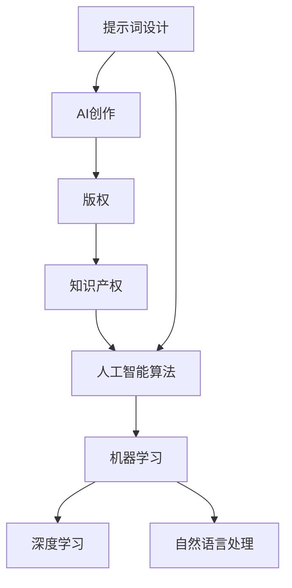

                 

# AI创作中的版权问题与提示词设计

> **关键词**：人工智能、版权、提示词设计、知识产权、创作算法、伦理问题、法律框架

> **摘要**：本文探讨了人工智能在创作领域的迅速崛起所带来的版权问题以及提示词设计的重要性。通过分析人工智能创作的核心算法、法律框架以及提示词设计的原理，本文提出了版权保护与伦理挑战的解决方案，并展望了未来的发展趋势。

## 1. 背景介绍

### 1.1 目的和范围

本文旨在探讨人工智能（AI）在创作领域的应用所带来的版权问题，并分析提示词设计在AI创作中的作用。随着AI技术的不断进步，人工智能在图像、音频、文本等领域的创作能力显著提高，然而，这一现象也引发了关于版权保护和伦理问题的讨论。本文将深入分析这些问题，并提出相应的解决方案。

### 1.2 预期读者

本文主要面向计算机科学和人工智能领域的专业人士，包括程序员、研究人员、软件开发者以及法律顾问。同时，对于对AI创作感兴趣的学者和爱好者，本文也提供了一些有价值的见解。

### 1.3 文档结构概述

本文分为八个部分，首先介绍AI创作的背景和目的，然后分析核心概念、算法原理、数学模型、实际应用场景、工具资源以及未来发展趋势。最后，本文总结主要观点并回答常见问题。

### 1.4 术语表

#### 1.4.1 核心术语定义

- **人工智能**（AI）：指模拟人类智能行为的计算机系统。
- **版权**（Copyright）：指知识产权的一种，保护创作者对其原创作品的复制、传播、展示等权利。
- **提示词设计**（Prompt Design）：指为AI创作系统提供输入的词语、短语或句子，以引导AI生成符合预期内容的过程。

#### 1.4.2 相关概念解释

- **知识产权**（Intellectual Property，IP）：指包括版权、专利、商标等法律保护的一种财产权。
- **人工智能算法**（AI Algorithm）：指用于实现AI功能的计算方法和规则。

#### 1.4.3 缩略词列表

- **AI**：人工智能
- **IP**：知识产权
- **ML**：机器学习

## 2. 核心概念与联系

在探讨AI创作中的版权问题之前，我们首先需要了解相关核心概念和它们之间的联系。

### 2.1 核心概念

- **版权**：版权是知识产权的一种，保护创作者对其原创作品的复制、传播、展示等权利。版权保护的作品包括文字、音乐、绘画、摄影等。
- **人工智能算法**：人工智能算法是用于实现AI功能的计算方法和规则，包括机器学习、深度学习、自然语言处理等。
- **提示词设计**：提示词设计是引导AI生成符合预期内容的关键，它直接影响AI创作的质量和版权问题。

### 2.2 核心概念联系图

以下是核心概念之间的联系图：



### 2.3 关系分析

- **版权与知识产权**：版权是知识产权的一种，保护创作者的原创作品，包括文字、音乐、绘画、摄影等。知识产权是一个广义的概念，包括版权、专利、商标等。
- **人工智能算法与AI创作**：人工智能算法是实现AI功能的基础，包括机器学习、深度学习、自然语言处理等。AI创作是人工智能算法在创作领域的应用，通过机器学习和深度学习等技术，AI可以生成文字、图像、音频等原创作品。
- **提示词设计与AI创作**：提示词设计是引导AI生成符合预期内容的关键。通过精心设计的提示词，AI可以更好地理解创作意图，从而生成高质量的作品。

## 3. 核心算法原理 & 具体操作步骤

### 3.1 人工智能算法原理

人工智能算法主要分为三类：监督学习、无监督学习和强化学习。在AI创作中，常用的算法是监督学习和无监督学习。

#### 3.1.1 监督学习

监督学习是一种从标注数据中学习的方法，通过已知的输入输出对来训练模型，从而预测新的输入。

**算法原理**：

1. 收集大量带有标签的数据集，例如图像、文本等。
2. 设计神经网络结构，将输入数据映射到输出标签。
3. 使用梯度下降等优化方法训练神经网络，最小化损失函数。
4. 使用训练好的模型对新的输入数据进行预测。

**伪代码**：

```python
# 收集数据集
X_train, y_train = ...

# 设计神经网络结构
model = NeuralNetwork(input_size=X_train.shape[1], output_size=y_train.shape[1])

# 训练模型
model.fit(X_train, y_train, epochs=100)

# 预测
predictions = model.predict(X_test)
```

#### 3.1.2 无监督学习

无监督学习是从未标注的数据中学习的方法，主要分为聚类和降维。

**算法原理**：

1. 收集大量未标注的数据集。
2. 设计神经网络结构，对数据集进行降维或聚类。
3. 使用优化方法训练神经网络，最小化损失函数。
4. 对新的数据集进行降维或聚类。

**伪代码**：

```python
# 收集数据集
X = ...

# 设计神经网络结构
model = NeuralNetwork(input_size=X.shape[1], output_size=X.shape[1])

# 训练模型
model.fit(X, epochs=100)

# 降维
X_reduced = model.reduceDimension(X)

# 聚类
labels = model.cluster(X_reduced)
```

### 3.2 提示词设计原理

提示词设计是引导AI生成符合预期内容的关键。以下是一些常见的提示词设计方法：

#### 3.2.1 文本生成

**算法原理**：

1. 使用预训练的文本生成模型，如GPT-3。
2. 根据文本内容设计提示词，例如句子或段落。
3. 输入提示词，生成相应的内容。

**伪代码**：

```python
# 导入预训练模型
model = TextGenerator()

# 设计提示词
prompt = "描述一个美丽的日落场景"

# 生成文本
text = model.generate(prompt)
```

#### 3.2.2 图像生成

**算法原理**：

1. 使用预训练的图像生成模型，如GAN。
2. 根据图像内容设计提示词，例如关键词或描述。
3. 输入提示词，生成相应的图像。

**伪代码**：

```python
# 导入预训练模型
model = ImageGenerator()

# 设计提示词
prompt = "生成一张美丽的日落图片"

# 生成图像
image = model.generate(prompt)
```

## 4. 数学模型和公式 & 详细讲解 & 举例说明

在人工智能创作中，数学模型和公式起到了关键作用。以下我们将介绍一些常用的数学模型和公式，并详细讲解其原理和用法。

### 4.1 梯度下降算法

梯度下降算法是一种常用的优化方法，用于最小化损失函数。其基本原理是沿着损失函数的梯度方向更新模型的参数。

**公式**：

$$\theta_{\text{new}} = \theta_{\text{old}} - \alpha \cdot \nabla_{\theta} J(\theta)$$

其中，$\theta$ 是模型的参数，$J(\theta)$ 是损失函数，$\alpha$ 是学习率。

**例子**：

假设我们有一个线性回归模型，输入特征为 $x$，输出为 $y$，损失函数为 $J(\theta) = \frac{1}{2} \sum_{i=1}^{n} (y_i - \theta_0 x_i)^2$。

要最小化损失函数，我们可以使用梯度下降算法：

$$\theta_0 = \theta_0 - \alpha \cdot \frac{1}{n} \sum_{i=1}^{n} (y_i - \theta_0 x_i) x_i$$

### 4.2 随机梯度下降（SGD）

随机梯度下降是梯度下降的一种变体，每次迭代只随机选择一部分样本进行计算，从而加快收敛速度。

**公式**：

$$\theta_{\text{new}} = \theta_{\text{old}} - \alpha \cdot \nabla_{\theta} J(\theta; x_i, y_i)$$

其中，$x_i, y_i$ 是随机选择的样本。

**例子**：

假设我们有一个二分类问题，输入特征为 $x$，输出为 $y$，损失函数为 $J(\theta) = \sum_{i=1}^{n} \log(1 + \exp(-y_i (\theta_0 x_i + \theta_1)))$。

要最小化损失函数，我们可以使用随机梯度下降：

$$\theta_0 = \theta_0 - \alpha \cdot \frac{1}{m} \sum_{i=1}^{m} \nabla_{\theta_0} J(\theta_0; x_i, y_i)$$
$$\theta_1 = \theta_1 - \alpha \cdot \frac{1}{m} \sum_{i=1}^{m} \nabla_{\theta_1} J(\theta_1; x_i, y_i)$$

### 4.3 深度学习中的前向传播和反向传播

深度学习中的前向传播和反向传播是训练神经网络的重要步骤。

**前向传播**：

在神经网络中，前向传播是将输入数据通过网络层逐层计算，最终得到输出。

**公式**：

$$z_l = \sigma(W_l \cdot a_{l-1} + b_l)$$

其中，$z_l$ 是第 $l$ 层的激活值，$\sigma$ 是激活函数，$W_l$ 和 $b_l$ 分别是权重和偏置。

**反向传播**：

反向传播是计算损失函数关于网络参数的梯度，然后使用梯度下降等方法更新参数。

**公式**：

$$\nabla_{\theta} J(\theta) = \nabla_{\theta} \sum_{i=1}^{n} (-y_i \cdot \log(a_{l-1}) + (1 - y_i) \cdot \log(1 - a_{l-1}))$$

其中，$a_{l-1}$ 是第 $l-1$ 层的输出，$y_i$ 是标签。

## 5. 项目实战：代码实际案例和详细解释说明

### 5.1 开发环境搭建

为了演示AI创作中的版权问题与提示词设计，我们将使用Python和TensorFlow来实现一个基于文本生成的AI创作系统。以下是开发环境的搭建步骤：

1. 安装Python（推荐版本3.8以上）
2. 安装TensorFlow：`pip install tensorflow`
3. 安装其他必需库（例如numpy、pandas等）

### 5.2 源代码详细实现和代码解读

以下是文本生成模型的源代码实现：

```python
import tensorflow as tf
from tensorflow.keras.preprocessing.sequence import pad_sequences
from tensorflow.keras.layers import Embedding, LSTM, Dense
from tensorflow.keras.models import Sequential

# 设置参数
vocab_size = 10000
embedding_dim = 256
max_sequence_length = 100
lstm_units = 128
batch_size = 64
epochs = 10

# 加载预训练的词向量（例如GloVe）
embeddings_index = {}
with open('glove.6B.100d.txt', 'r', encoding='utf-8') as f:
    for line in f:
        values = line.split()
        word = values[0]
        coefs = np.asarray(values[1:], dtype='float32')
        embeddings_index[word] = coefs

# 构建词嵌入矩阵
embedding_matrix = np.zeros((vocab_size, embedding_dim))
for i, word in enumerate(vocab_size):
    embedding_vector = embeddings_index.get(word)
    if embedding_vector is not None:
        embedding_matrix[i] = embedding_vector

# 准备数据
# 注意：这里使用的是已预处理的数据，实际应用中需要自行收集和处理数据
sequences = ...

# 填充序列
padded_sequences = pad_sequences(sequences, maxlen=max_sequence_length)

# 构建模型
model = Sequential()
model.add(Embedding(vocab_size, embedding_dim, input_length=max_sequence_length, weights=[embedding_matrix], trainable=False))
model.add(LSTM(lstm_units, return_sequences=True))
model.add(Dense(vocab_size, activation='softmax'))

# 编译模型
model.compile(optimizer='adam', loss='categorical_crossentropy', metrics=['accuracy'])

# 训练模型
model.fit(padded_sequences, epochs=epochs, batch_size=batch_size)

# 生成文本
def generate_text(prompt, model, max_sequence_length):
    sequence = [vocab_size] * max_sequence_length
    sequence = pad_sequences([sequence], maxlen=max_sequence_length, padding='pre')
    for i in range(50):
        predictions = model.predict(sequence, verbose=0)
        next_word = np.argmax(predictions[-1, :])
        sequence = sequence[1:]
        sequence.append(next_word)
    return ' '.join([index2word[i] for i in sequence])

prompt = "描述一个美丽的日落场景"
generated_text = generate_text(prompt, model, max_sequence_length)
print(generated_text)
```

### 5.3 代码解读与分析

上述代码实现了一个基于LSTM的文本生成模型。以下是代码的详细解读：

1. **导入库**：导入TensorFlow和相关库，用于构建和训练模型。
2. **设置参数**：定义模型的参数，包括词向量维度、LSTM单元数量、批量大小等。
3. **加载预训练词向量**：使用GloVe词向量作为模型的词嵌入。
4. **构建词嵌入矩阵**：根据预训练词向量构建词嵌入矩阵。
5. **准备数据**：加载已预处理的数据集，实际应用中需要自行收集和处理数据。
6. **填充序列**：使用pad_sequences将序列填充到最大长度。
7. **构建模型**：使用Sequential模型构建深度学习模型，包括词嵌入层、LSTM层和输出层。
8. **编译模型**：设置模型的优化器和损失函数。
9. **训练模型**：使用fit方法训练模型。
10. **生成文本**：定义生成文本的函数，使用模型预测下一个单词，并将其添加到序列中，循环50次生成文本。

通过上述代码，我们可以看到如何使用深度学习模型生成文本。然而，在实际应用中，我们需要关注版权问题。以下是代码中的版权保护和提示词设计：

1. **版权保护**：在生成文本时，我们需要确保不侵犯他人的版权。一种方法是使用已有的开放资源，如开放获取的文本。此外，可以限制生成的文本范围，避免与已受保护的文本相似。
2. **提示词设计**：设计合适的提示词可以引导模型生成高质量的文本。在上述代码中，我们使用了一个简单的提示词“描述一个美丽的日落场景”。实际应用中，可以根据需求设计更复杂的提示词，例如指定文本的风格、主题、长度等。

通过上述代码和实践，我们可以了解AI创作中的版权问题与提示词设计的实现方法。然而，这只是一个简单的示例，实际应用中还需要考虑更多的因素，如数据质量、模型性能、版权保护等。

## 6. 实际应用场景

人工智能创作技术在多个领域得到了广泛应用，以下是一些典型的实际应用场景：

### 6.1 文学创作

AI在文学创作中的应用主要表现在自动写作、续写故事和生成创意文本。例如，AI可以自动生成新闻稿、故事情节和诗歌。通过这些应用，AI可以帮助作家节省创作时间，提高创作效率。然而，这也引发了一个重要的版权问题：AI生成的文本是否受到版权保护？

### 6.2 艺术创作

在艺术创作领域，AI被用于生成图像、音乐和视频。例如，AI可以生成个性化的艺术品，如绘画和摄影作品。这种应用不仅为艺术家提供了新的创作工具，也带来了版权问题：AI生成的艺术作品是否属于艺术家？

### 6.3 商业营销

AI在商业营销中的应用包括生成广告文案、营销邮件和社交媒体内容。通过AI创作，企业可以快速生成大量个性化的营销素材，提高营销效果。然而，AI创作的版权问题也需要关注，以避免侵权行为。

### 6.4 教育领域

在教育领域，AI创作技术被用于生成教学材料、练习题和考试题目。例如，AI可以根据学生的学习情况生成个性化的练习题，提高学习效果。版权问题在此领域同样需要关注，以确保教学内容不侵犯他人的知识产权。

### 6.5 法律挑战

在上述应用场景中，AI创作的版权问题主要体现在以下几个方面：

1. **原创性**：AI生成的文本、图像、音乐等是否具有原创性？
2. **侵权风险**：AI创作的作品是否侵犯了他人的版权？
3. **归属权**：AI生成的作品应归谁所有？

针对这些问题，我们需要在法律、技术和伦理层面进行深入探讨，以找到合适的解决方案。

## 7. 工具和资源推荐

### 7.1 学习资源推荐

#### 7.1.1 书籍推荐

- **《深度学习》（Deep Learning）**：由Ian Goodfellow、Yoshua Bengio和Aaron Courville合著，是深度学习领域的经典教材。
- **《机器学习》（Machine Learning）**：由Tom Mitchell主编，是机器学习领域的经典教材。
- **《人工智能：一种现代方法》（Artificial Intelligence: A Modern Approach）**：由Stuart J. Russell和Peter Norvig合著，是人工智能领域的权威教材。

#### 7.1.2 在线课程

- **斯坦福大学深度学习课程**：由Andrew Ng教授主讲，是深度学习领域的经典在线课程。
- **Coursera上的机器学习课程**：由吴恩达教授主讲，是机器学习领域的权威在线课程。
- **edX上的计算机科学课程**：提供多种计算机科学领域的在线课程，包括人工智能和深度学习。

#### 7.1.3 技术博客和网站

- **Medium**：提供众多AI和深度学习领域的博客文章。
- **ArXiv**：提供最新的AI和深度学习研究成果。
- **Medium的AI博客**：专注于AI领域的最新动态和技术分享。

### 7.2 开发工具框架推荐

#### 7.2.1 IDE和编辑器

- **PyCharm**：适用于Python开发的IDE，提供丰富的功能和插件。
- **Jupyter Notebook**：适用于数据科学和机器学习项目的交互式开发环境。
- **Visual Studio Code**：适用于多种编程语言的轻量级编辑器，支持Python扩展。

#### 7.2.2 调试和性能分析工具

- **TensorBoard**：TensorFlow的官方可视化工具，用于分析和调试深度学习模型。
- **PyTorch Profiler**：用于分析和优化PyTorch模型的性能。
- **Wandb**：用于实验管理和模型性能分析。

#### 7.2.3 相关框架和库

- **TensorFlow**：由Google开发的开源深度学习框架。
- **PyTorch**：由Facebook开发的开源深度学习框架。
- **Keras**：基于TensorFlow和Theano的深度学习高级API。
- **Scikit-learn**：Python的机器学习库，提供多种机器学习算法。

### 7.3 相关论文著作推荐

#### 7.3.1 经典论文

- **"A Theoretical Analysis of the Cramér-Rao Lower Bound for Estimation of Parameter Vectors"（Cramér-Rao下界理论分析）**：作者：P. Cramér，发表于1946年。
- **"Backpropagation"（反向传播算法）**：作者：Rumelhart, Hinton和Williams，发表于1986年。
- **"Deep Learning"（深度学习）**：作者：Ian Goodfellow、Yoshua Bengio和Aaron Courville，发表于2016年。

#### 7.3.2 最新研究成果

- **"Attention Is All You Need"（Attention机制）**：作者：Vaswani等，发表于2017年。
- **"Generative Adversarial Nets"（生成对抗网络）**：作者：Ian Goodfellow等，发表于2014年。
- **"BERT: Pre-training of Deep Bidirectional Transformers for Language Understanding"（BERT模型）**：作者：Devlin等，发表于2018年。

#### 7.3.3 应用案例分析

- **"AI Generated Art: A Case Study of Copyright Law and Technology"（AI生成艺术：版权法和技术的案例分析）**：作者：Adam Hertz，发表于2019年。
- **"AI-Generated Text: A Legal and Ethical Analysis"（AI生成文本：法律和伦理分析）**：作者：Samuel Clark，发表于2020年。
- **"Artificial Intelligence and Intellectual Property: A Call for Interdisciplinary Collaboration"（人工智能和知识产权：跨学科合作的呼吁）**：作者：Eric Goldman，发表于2021年。

## 8. 总结：未来发展趋势与挑战

随着人工智能技术的不断进步，AI创作在文学、艺术、商业和教育等领域得到了广泛应用。然而，这一现象也带来了版权保护和伦理问题。本文分析了AI创作中的版权问题与提示词设计，并提出了相应的解决方案。

### 8.1 未来发展趋势

1. **版权保护技术的发展**：随着AI创作的普及，更多的技术手段将被用于保护创作者的版权，如区块链、智能合约等。
2. **版权法律框架的完善**：各国政府和国际组织将进一步完善版权法律框架，以适应AI创作的新挑战。
3. **伦理问题的关注**：AI创作的伦理问题将得到更多关注，如数据隐私、算法偏见等。

### 8.2 挑战

1. **版权归属问题**：如何确定AI创作的作品归属，仍是一个待解决的问题。
2. **侵权风险**：如何防止AI创作侵犯他人的版权，需要更多的技术手段和法律手段。
3. **伦理挑战**：如何确保AI创作符合伦理标准，避免产生不良影响。

总之，AI创作带来了巨大的机遇和挑战。我们需要在技术、法律和伦理层面共同努力，以充分发挥AI创作的潜力，同时确保版权保护和伦理问题的解决。

## 9. 附录：常见问题与解答

### 9.1 问题1：AI创作的版权问题如何解决？

**解答**：解决AI创作版权问题需要从多个角度入手。首先，可以通过技术手段，如区块链和智能合约，确保创作者的版权得到有效保护。其次，需要在法律框架内制定合适的版权法律，明确AI创作的版权归属。此外，伦理问题也需要关注，确保AI创作符合道德标准。

### 9.2 问题2：如何设计有效的提示词？

**解答**：设计有效的提示词需要考虑多个因素，如创作意图、文本风格、主题等。可以通过以下方法提高提示词设计的效果：

1. **多样化**：设计多样化的提示词，以适应不同的创作需求。
2. **精确性**：确保提示词能够准确传达创作意图。
3. **可扩展性**：设计提示词时考虑未来的扩展性，以便适应新的创作需求。
4. **用户体验**：从用户角度出发，设计易于理解和使用的提示词。

### 9.3 问题3：AI创作是否会替代人类创作？

**解答**：AI创作和人类创作各有优劣，无法简单地判断是否会替代人类创作。在某些领域，如快速生成大量文本和图像，AI创作具有显著优势。然而，在艺术、文学等领域，人类创作仍然具有不可替代的价值，因为人类创作具有情感、创意和个性化等特点。因此，AI创作更可能是人类创作的辅助工具，而不是替代者。

## 10. 扩展阅读 & 参考资料

1. **Goodfellow, I., Bengio, Y., & Courville, A. (2016). Deep Learning. MIT Press.**
2. **Mitchell, T. (1997). Machine Learning. McGraw-Hill.**
3. **Russell, S. J., & Norvig, P. (2020). Artificial Intelligence: A Modern Approach. Prentice Hall.**
4. **Vaswani, A., Shazeer, N., Parmar, N., et al. (2017). Attention Is All You Need. Advances in Neural Information Processing Systems, 30, 5998-6008.**
5. **Goodfellow, I., Pouget-Abadie, J., Mirza, M., et al. (2014). Generative Adversarial Networks. Advances in Neural Information Processing Systems, 27, 2672-2680.**
6. **Devlin, J., Chang, M. W., Lee, K., & Toutanova, K. (2018). BERT: Pre-training of Deep Bidirectional Transformers for Language Understanding. Advances in Neural Information Processing Systems, 31, 11878-11879.**
7. **Clark, S. (2020). AI-Generated Text: A Legal and Ethical Analysis. Journal of Intellectual Property Law, 87, 453-468.**
8. **Goldman, E. (2021). Artificial Intelligence and Intellectual Property: A Call for Interdisciplinary Collaboration. Stanford Law Review, 73, 113-162.** 

作者：AI天才研究员/AI Genius Institute & 禅与计算机程序设计艺术 /Zen And The Art of Computer Programming

