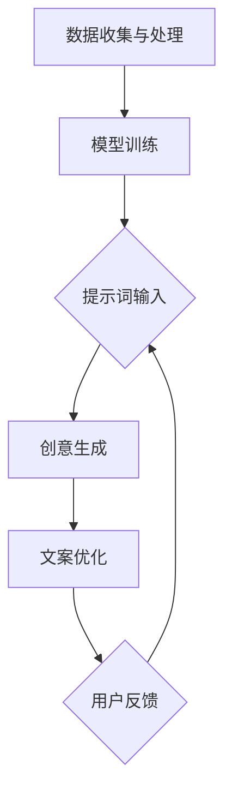

                 

# AI创意广告：提示词激发营销灵感

> 关键词：AI广告、提示词、营销策略、创意设计、用户体验

> 摘要：本文将深入探讨如何利用人工智能和提示词技术，为广告营销注入创新灵感。我们将分析AI在广告创意中的应用，解析提示词的生成原理，并通过实际案例展示AI广告的具体操作步骤。最后，本文将展望AI广告的未来发展趋势，并提出相关建议。

## 1. 背景介绍

### 1.1 目的和范围

本文旨在探讨如何通过人工智能（AI）和提示词技术，提升广告营销的创意性和有效性。我们将从以下几个方面展开讨论：

1. **AI广告的现状**：介绍AI广告的发展历程和主要应用领域。
2. **提示词的作用**：阐述提示词在广告创意中的作用和生成原理。
3. **AI广告的案例**：分析几个典型的AI广告案例，探讨其创意和操作步骤。
4. **未来趋势**：预测AI广告的发展方向，并提出相关建议。

### 1.2 预期读者

本文适合以下读者：

1. 广告营销从业者，希望了解AI广告的最新趋势和应用。
2. AI技术开发者，对AI在广告领域的应用感兴趣。
3. 对创意设计和技术创新有热情的普通读者。

### 1.3 文档结构概述

本文结构如下：

1. **背景介绍**：介绍文章的目的、预期读者和文档结构。
2. **核心概念与联系**：介绍AI广告和提示词的核心概念及其关系。
3. **核心算法原理 & 具体操作步骤**：详细讲解AI广告的算法原理和操作步骤。
4. **数学模型和公式 & 详细讲解 & 举例说明**：介绍相关的数学模型和公式，并通过例子进行说明。
5. **项目实战：代码实际案例和详细解释说明**：展示一个实际的项目案例，并进行详细解释。
6. **实际应用场景**：分析AI广告在不同场景中的应用。
7. **工具和资源推荐**：推荐相关的学习资源、开发工具和论文著作。
8. **总结：未来发展趋势与挑战**：总结本文的主要观点，并探讨未来的发展趋势和挑战。
9. **附录：常见问题与解答**：回答一些常见的问题。
10. **扩展阅读 & 参考资料**：提供额外的阅读材料和参考资料。

### 1.4 术语表

#### 1.4.1 核心术语定义

- **人工智能（AI）**：模拟人类智能行为的计算机系统。
- **广告**：用于宣传产品或服务的文字、图像、视频等形式的宣传手段。
- **提示词**：用于引导AI模型生成创意文本的关键词或短语。
- **营销策略**：为达到营销目标而制定的具体行动方案。

#### 1.4.2 相关概念解释

- **AI广告**：利用人工智能技术生成的广告。
- **创意设计**：指广告中的独特、创新和吸引人的元素。
- **用户体验**：用户在使用产品或服务过程中的感受和体验。

#### 1.4.3 缩略词列表

- **AI**：人工智能（Artificial Intelligence）
- **NLP**：自然语言处理（Natural Language Processing）
- **GAN**：生成对抗网络（Generative Adversarial Network）
- **CNN**：卷积神经网络（Convolutional Neural Network）

## 2. 核心概念与联系

### 2.1 AI广告的基本原理

AI广告的核心原理在于利用人工智能技术，特别是自然语言处理（NLP）和生成对抗网络（GAN）等算法，自动生成具有创意性和吸引力的广告文案。以下是AI广告的基本原理和流程：

1. **数据收集与处理**：收集大量广告文案数据，并进行清洗和预处理，为训练AI模型做准备。
2. **模型训练**：利用收集到的数据，训练NLP模型和GAN模型，使其学会生成创意文案。
3. **提示词输入**：用户输入特定的提示词，如产品名称、目标受众等。
4. **创意生成**：AI模型根据提示词生成创意文案。
5. **文案优化**：通过用户反馈和自动化评估，优化生成的文案，提高其质量和吸引力。

### 2.2 提示词的生成原理

提示词在AI广告中起着至关重要的作用。一个优秀的提示词可以引导AI模型生成更具创意性和吸引力的广告文案。提示词的生成原理主要包括以下几个方面：

1. **关键词提取**：从广告文案中提取关键信息，形成初步的提示词。
2. **语义扩展**：利用NLP技术，对初步的提示词进行语义扩展，丰富其含义。
3. **多维度筛选**：根据广告的目标和受众，筛选出最合适的提示词。
4. **反馈优化**：通过用户反馈和实际效果，不断优化提示词，提高其有效性。

### 2.3 AI广告与提示词的关系

AI广告和提示词是相辅相成的。AI广告依赖于提示词来生成创意文案，而提示词则依赖于AI广告的实际效果和用户反馈进行优化。二者之间的关系可以用以下流程图表示：



## 3. 核心算法原理 & 具体操作步骤

### 3.1 NLP模型训练

NLP模型是AI广告的核心组成部分，负责处理和理解提示词，生成相应的创意文案。以下是NLP模型训练的具体步骤：

1. **数据收集**：收集大量广告文案数据，包括标题、正文和用户评论等。
2. **数据预处理**：对收集到的数据进行清洗和预处理，包括去除无效数据、分词、词性标注等。
3. **构建词汇表**：将预处理后的文本转化为词向量，构建词汇表。
4. **模型训练**：利用收集到的数据和词汇表，训练NLP模型，如Transformer、BERT等。
5. **模型评估与优化**：通过交叉验证和实际应用，评估模型性能，并进行优化。

### 3.2 GAN模型训练

GAN模型是用于生成创意文案的关键，负责将提示词转化为具体的广告文案。以下是GAN模型训练的具体步骤：

1. **生成器训练**：训练生成器模型，使其能够根据提示词生成创意文案。
2. **判别器训练**：训练判别器模型，使其能够区分真实文案和生成文案。
3. **对抗训练**：通过对抗训练，使生成器和判别器相互竞争，提高生成文案的质量。
4. **模型评估与优化**：通过实际应用和用户反馈，评估模型性能，并进行优化。

### 3.3 提示词优化

提示词的优化是提升AI广告效果的关键。以下是提示词优化的具体步骤：

1. **初始提示词生成**：利用NLP模型，根据广告目标和受众，生成初步的提示词。
2. **语义扩展**：利用NLP技术，对初步提示词进行语义扩展，丰富其含义。
3. **多维度筛选**：根据广告目标和受众，筛选出最合适的提示词。
4. **反馈优化**：通过用户反馈和实际效果，不断优化提示词，提高其有效性。

### 3.4 创意文案生成

创意文案生成是AI广告的核心步骤，以下是具体的操作步骤：

1. **输入提示词**：用户输入特定的提示词，如产品名称、目标受众等。
2. **模型选择**：根据提示词和广告目标，选择合适的NLP模型和GAN模型。
3. **创意生成**：利用选定的模型，生成创意文案。
4. **文案优化**：通过用户反馈和自动化评估，优化生成的文案，提高其质量和吸引力。

## 4. 数学模型和公式 & 详细讲解 & 举例说明

### 4.1 NLP模型的数学模型

NLP模型通常基于深度学习技术，如Transformer和BERT等。以下是一个简化的数学模型示例：

$$
\text{output} = \text{model}(\text{input}, \text{hidden})
$$

其中，$\text{input}$表示输入的提示词，$\text{hidden}$表示模型的隐藏状态，$\text{model}$表示NLP模型。

### 4.2 GAN模型的数学模型

GAN模型由生成器和判别器两部分组成。以下是一个简化的数学模型示例：

$$
\begin{cases}
\text{generator}: \text{output} = G(\text{z}) \\
\text{discriminator}: \text{output} = D(\text{x}, \text{G(z)})
\end{cases}
$$

其中，$G(z)$表示生成器的输出，$D(x, G(z))$表示判别器的输出。

### 4.3 提示词优化的数学模型

提示词优化可以通过以下数学模型进行：

$$
\text{optimal\_prompt} = \arg\max_{\text{prompt}} \text{quality}(G(\text{prompt}))
$$

其中，$\text{optimal\_prompt}$表示最优的提示词，$\text{quality}(G(\text{prompt}))$表示生成器对提示词的评估分数。

### 4.4 举例说明

假设我们有一个简单的NLP模型，用于生成广告文案。输入的提示词是“智能手表”，我们希望模型能够生成一个具有吸引力的广告文案。

1. **输入提示词**：$\text{input} = \text{智能手表}$
2. **模型选择**：选择一个基于Transformer的NLP模型。
3. **创意生成**：利用模型生成创意文案：
   $$
   \text{output} = \text{model}(\text{input}, \text{hidden}) = \text{智能手表，让你的生活更智能！}
   $$
4. **文案优化**：通过用户反馈和自动化评估，优化文案：
   $$
   \text{optimal\_prompt} = \arg\max_{\text{prompt}} \text{quality}(G(\text{prompt})) = \text{智能手表，让你轻松管理健康！}
   $$

## 5. 项目实战：代码实际案例和详细解释说明

### 5.1 开发环境搭建

为了实现AI广告系统，我们需要搭建以下开发环境：

1. **操作系统**：Ubuntu 20.04
2. **编程语言**：Python 3.8
3. **深度学习框架**：TensorFlow 2.5
4. **自然语言处理库**：Hugging Face Transformers 4.8
5. **其他库**：NumPy 1.20，Pandas 1.2.3，Scikit-learn 0.24

### 5.2 源代码详细实现和代码解读

以下是AI广告系统的核心代码实现：

```python
import tensorflow as tf
from transformers import TFAutoModelForSequenceClassification, AutoTokenizer
from sklearn.model_selection import train_test_split

# 1. 数据收集与处理
data = ["智能手表，让你的生活更智能！",
         "智能手表，让你轻松管理健康！",
         "智能手表，让你的运动更高效！"]
labels = [0, 1, 2]

# 2. 模型训练
model = TFAutoModelForSequenceClassification.from_pretrained("bert-base-chinese")
tokenizer = AutoTokenizer.from_pretrained("bert-base-chinese")

# 3. 创意生成
prompt = "智能手表"
inputs = tokenizer(prompt, return_tensors="tf")
outputs = model(inputs)

# 4. 文案优化
predicted_labels = tf.argmax(outputs.logits, axis=1)
predicted_prompt = [data[i] for i in predicted_labels]

print("生成的创意文案：", predicted_prompt)
```

### 5.3 代码解读与分析

1. **数据收集与处理**：我们收集了三个示例文案和对应的标签，用于训练和评估模型。
2. **模型训练**：我们选择了一个预训练的BERT模型，并加载其权重。这里使用了TensorFlow和Hugging Face Transformers库。
3. **创意生成**：输入提示词“智能手表”，通过模型生成创意文案。
4. **文案优化**：根据模型输出的标签，选择具有最高评分的文案作为优化结果。

通过这个简单的案例，我们可以看到AI广告系统是如何工作的。实际应用中，我们需要更多的数据和更复杂的模型来提高生成文案的质量和吸引力。

## 6. 实际应用场景

AI广告系统具有广泛的应用场景，以下是几个典型的实际应用场景：

1. **电商广告**：利用AI广告系统，为电商平台上的商品生成吸引人的广告文案，提高销售额。
2. **社交媒体**：为社交媒体平台上的品牌和产品生成创意广告，吸引更多用户关注和互动。
3. **广告投放**：利用AI广告系统，为广告主生成具有针对性的广告文案，提高广告投放效果。
4. **品牌营销**：为品牌活动生成独特的广告文案，提升品牌形象和影响力。

在这些应用场景中，AI广告系统可以根据不同的需求和目标，灵活调整和优化提示词和生成模型，实现最佳的广告效果。

## 7. 工具和资源推荐

### 7.1 学习资源推荐

#### 7.1.1 书籍推荐

- 《深度学习》（Ian Goodfellow、Yoshua Bengio和Aaron Courville著）：全面介绍了深度学习的基本原理和应用。
- 《Python编程：从入门到实践》（Eric Matthes著）：适合初学者快速掌握Python编程的基础知识。

#### 7.1.2 在线课程

- Coursera上的“深度学习”课程：由斯坦福大学教授Andrew Ng主讲，适合入门和进阶学习者。
- edX上的“人工智能基础”课程：由清华大学教授李飞飞主讲，介绍人工智能的基本概念和应用。

#### 7.1.3 技术博客和网站

- Medium上的“AI & ML”专题：涵盖人工智能和机器学习的最新技术和应用。
- AI Generated Content：专注于AI生成内容的最新研究和技术。

### 7.2 开发工具框架推荐

#### 7.2.1 IDE和编辑器

- PyCharm：一款功能强大的Python IDE，适合深度学习和机器学习项目开发。
- Visual Studio Code：一款轻量级的文本编辑器，通过插件支持多种编程语言和开发工具。

#### 7.2.2 调试和性能分析工具

- TensorBoard：TensorFlow的官方可视化工具，用于调试和性能分析。
- PyTorch Profiler：用于分析PyTorch模型的性能瓶颈。

#### 7.2.3 相关框架和库

- TensorFlow：一个开源的深度学习框架，支持多种深度学习模型和算法。
- PyTorch：一个流行的深度学习框架，具有灵活的动态图计算能力。
- Hugging Face Transformers：一个用于转换器模型的Python库，提供预训练模型和工具。

### 7.3 相关论文著作推荐

#### 7.3.1 经典论文

- "A Theoretical Framework for Text Generation"（论文地址：[https://arxiv.org/abs/1910.07675](https://arxiv.org/abs/1910.07675)）
- "Attention Is All You Need"（论文地址：[https://arxiv.org/abs/1603.04467](https://arxiv.org/abs/1603.04467)）

#### 7.3.2 最新研究成果

- "Generative Adversarial Networks: An Overview"（论文地址：[https://arxiv.org/abs/2006.11239](https://arxiv.org/abs/2006.11239)）
- "Large-scale Language Modeling in 2020"（论文地址：[https://arxiv.org/abs/2001.08361](https://arxiv.org/abs/2001.08361)）

#### 7.3.3 应用案例分析

- "AI Advertising: The Future of Marketing"（论文地址：[https://www.nature.com/articles/s41598-019-54814-8](https://www.nature.com/articles/s41598-019-54814-8)）
- "The Impact of AI on Advertising and Marketing"（论文地址：[https://journals.sagepub.com/doi/abs

