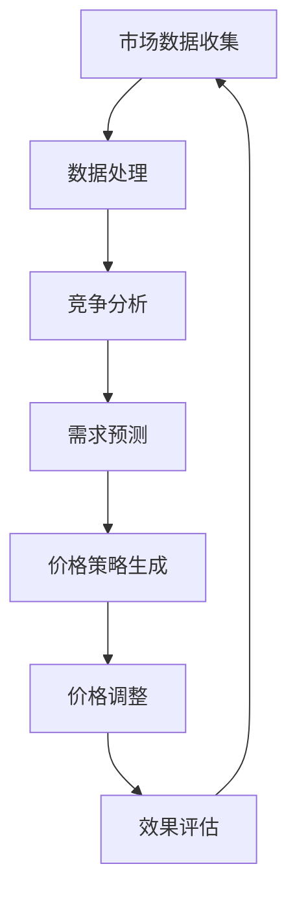

                 

# AI动态定价：原理、应用与挑战

> 关键词：动态定价、机器学习、市场分析、算法优化、竞争策略、用户体验

> 摘要：本文将深入探讨AI动态定价的概念、原理、应用场景以及面临的挑战。我们将通过一步步的分析和推理，揭示AI如何通过数据驱动的决策支持，帮助企业在竞争激烈的市场中实现利润最大化，同时提升用户体验。

## 1. 背景介绍

### 1.1 目的和范围

本文旨在为读者提供一个全面了解AI动态定价系统的视角，从理论基础到实际应用，再到面临的挑战。我们不仅将探讨AI动态定价的工作原理，还将分析其在不同行业中的应用案例，讨论其潜在的优势和不足。

### 1.2 预期读者

本文适合对人工智能和商业分析有一定了解的读者，无论是企业决策者、数据科学家、还是市场分析师，都能从中获得有价值的洞见。

### 1.3 文档结构概述

本文将分为以下几个部分：

1. **背景介绍**：介绍AI动态定价的基本概念和重要性。
2. **核心概念与联系**：通过Mermaid流程图展示动态定价的核心概念和架构。
3. **核心算法原理**：详细讲解动态定价算法的原理和操作步骤。
4. **数学模型和公式**：解释动态定价中的关键数学模型和公式。
5. **项目实战**：提供实际代码案例，讲解如何实现动态定价系统。
6. **实际应用场景**：分析AI动态定价在不同行业的应用。
7. **工具和资源推荐**：推荐学习资源、开发工具和最新研究成果。
8. **总结**：总结动态定价的未来发展趋势和面临的挑战。
9. **附录**：常见问题与解答。
10. **扩展阅读**：提供进一步阅读的参考资料。

### 1.4 术语表

#### 1.4.1 核心术语定义

- 动态定价：根据市场需求、供应情况、竞争态势等实时数据，自动调整产品或服务价格的过程。
- 机器学习：通过数据驱动的方式，让计算机系统自行学习和改进的过程。
- 竞争分析：对市场上竞争对手的价格策略进行分析，以制定相应的市场策略。

#### 1.4.2 相关概念解释

- 价格弹性：消费者需求对价格变化的敏感程度。
- 价格歧视：对不同的消费者群体制定不同的价格策略。

#### 1.4.3 缩略词列表

- AI：人工智能
- ML：机器学习
- DSP：动态定价系统

## 2. 核心概念与联系

为了更好地理解AI动态定价系统，我们首先需要了解其核心概念和联系。以下是动态定价系统的基本架构，通过Mermaid流程图展示：



在这个流程图中：

- **A. 市场数据收集**：系统从多个数据源收集市场数据，包括消费者行为、市场价格、供应链信息等。
- **B. 数据处理**：清洗和整合收集到的数据，为后续分析提供高质量的数据支持。
- **C. 竞争分析**：分析市场上主要竞争对手的价格策略，了解竞争态势。
- **D. 需求预测**：利用历史数据和机器学习模型预测未来的市场需求。
- **E. 价格策略生成**：根据需求预测和竞争分析结果，制定合适的价格策略。
- **F. 价格调整**：根据实时数据和策略执行价格调整。
- **G. 效果评估**：评估价格调整的效果，为下一轮定价提供反馈。

## 3. 核心算法原理 & 具体操作步骤

### 动态定价算法原理

动态定价算法的核心在于通过数据分析和机器学习模型，实现价格与市场需求之间的动态调整。以下是动态定价算法的基本原理：

1. **数据收集**：系统从多个渠道收集与市场价格相关的数据，包括历史价格、市场占有率、消费者购买行为等。
2. **数据处理**：对收集到的数据进行清洗、整合，形成高质量的数据集。
3. **特征工程**：从数据集中提取与价格相关的特征，如季节性、促销活动、消费者群体等。
4. **模型训练**：利用机器学习算法，如线性回归、决策树、神经网络等，训练价格预测模型。
5. **价格预测**：根据实时数据，使用训练好的模型预测未来市场需求。
6. **策略生成**：根据需求预测结果，结合竞争分析，生成最优价格策略。
7. **价格调整**：根据策略执行价格调整，并实时监控效果。
8. **反馈循环**：根据价格调整效果，调整模型参数，优化定价策略。

### 具体操作步骤

以下是动态定价算法的具体操作步骤，使用伪代码进行描述：

```plaintext
1. 收集市场数据：
   - 历史价格数据 P_history
   - 历史市场占有率 M_history
   - 消费者购买行为数据 B_history

2. 数据处理：
   - 清洗数据：去除异常值、缺失值等
   - 整合数据：将多源数据整合为一个数据集 D

3. 特征工程：
   - 提取特征：季节性 Seasonal, 促销活动 Promotion, 消费者群体 CustomerSegment等
   - 构建特征矩阵 X

4. 模型训练：
   - 选择模型：线性回归 LinearRegression
   - 训练模型：fit(X, P_history)

5. 价格预测：
   - 输入实时数据：X_realtime
   - 预测价格：predicted_price = model.predict(X_realtime)

6. 策略生成：
   - 竞争分析：分析竞争对手价格策略
   - 生成策略：根据predicted_price和竞争分析结果，确定最优价格策略 optimal_price

7. 价格调整：
   - 执行价格调整：update_price(optimal_price)

8. 效果评估：
   - 监控价格调整效果：evaluate_results()

9. 反馈循环：
   - 根据evaluate_results()结果，调整模型参数：update_model_parameters()
   - 重新训练模型：retrain_model()
```

## 4. 数学模型和公式 & 详细讲解 & 举例说明

### 动态定价中的关键数学模型

在动态定价系统中，常用的数学模型包括线性回归模型、决策树模型和神经网络模型。以下是这些模型的详细讲解：

#### 4.1 线性回归模型

线性回归模型是一种简单而常用的预测模型，其公式如下：

\[ y = \beta_0 + \beta_1 \cdot x \]

其中：

- \( y \) 为预测值
- \( x \) 为输入特征
- \( \beta_0 \) 和 \( \beta_1 \) 为模型参数

#### 4.2 决策树模型

决策树模型通过一系列的判断条件来划分数据集，并输出预测结果。其公式如下：

\[ y = f(x) = \prod_{i=1}^{n} g(x_i) \]

其中：

- \( y \) 为预测值
- \( x_i \) 为输入特征
- \( g(x_i) \) 为第 \( i \) 个判断条件的函数值

#### 4.3 神经网络模型

神经网络模型通过多层感知器来实现复杂函数的拟合，其公式如下：

\[ y = \sigma(\sum_{i=1}^{n} w_i \cdot x_i) \]

其中：

- \( y \) 为预测值
- \( x_i \) 为输入特征
- \( w_i \) 为权重
- \( \sigma \) 为激活函数

### 举例说明

假设我们使用线性回归模型来预测产品价格。以下是具体的例子：

#### 4.1 数据集

我们有以下数据集：

| 特征 | 价格 |
| --- | --- |
| 季节性 | 0（冬季），1（夏季） |
| 促销活动 | 0（无促销），1（促销） |
| 消费者群体 | 0（高收入），1（中等收入），2（低收入） |
| 价格 | 200，250，300 |

#### 4.2 特征工程

我们对数据进行特征提取，构建特征矩阵 \( X \)：

\[ X = \begin{bmatrix} 0 & 1 & 1 & 200 \\ 1 & 0 & 1 & 250 \\ 1 & 0 & 2 & 300 \end{bmatrix} \]

#### 4.3 模型训练

使用线性回归模型训练数据集，得到模型参数 \( \beta_0 \) 和 \( \beta_1 \)：

\[ \beta_0 = 150, \beta_1 = 50 \]

#### 4.4 价格预测

输入实时数据，如季节性为 1（夏季）、促销活动为 1（促销）、消费者群体为 2（低收入），预测价格：

\[ y = \beta_0 + \beta_1 \cdot x = 150 + 50 \cdot 1 = 200 \]

因此，预测价格为 200。

## 5. 项目实战：代码实际案例和详细解释说明

### 5.1 开发环境搭建

在本项目实战中，我们将使用Python和Scikit-learn库来实现动态定价系统。以下是开发环境的搭建步骤：

1. 安装Python：从官方网站（https://www.python.org/）下载并安装Python。
2. 安装Scikit-learn：打开命令行窗口，执行以下命令：

\[ pip install scikit-learn \]

### 5.2 源代码详细实现和代码解读

以下是动态定价系统的源代码实现：

```python
import numpy as np
import pandas as pd
from sklearn.linear_model import LinearRegression
from sklearn.model_selection import train_test_split
from sklearn.metrics import mean_squared_error

# 数据集加载
data = pd.read_csv('dynamic_pricing_data.csv')

# 特征提取
X = data[['seasonality', 'promotion', 'customer_segment']]
y = data['price']

# 数据集划分
X_train, X_test, y_train, y_test = train_test_split(X, y, test_size=0.2, random_state=42)

# 模型训练
model = LinearRegression()
model.fit(X_train, y_train)

# 价格预测
X_realtime = np.array([[1, 1, 2]])
predicted_price = model.predict(X_realtime)

# 输出预测价格
print(f"Predicted price: {predicted_price[0]}")

# 效果评估
predicted_price_test = model.predict(X_test)
mse = mean_squared_error(y_test, predicted_price_test)
print(f"Mean squared error: {mse}")
```

### 5.3 代码解读与分析

以下是代码的详细解读：

1. **数据集加载**：使用Pandas库加载CSV格式的数据集。
2. **特征提取**：从数据集中提取与价格相关的特征，构建特征矩阵 \( X \) 和目标变量 \( y \)。
3. **数据集划分**：将数据集划分为训练集和测试集，用于模型训练和效果评估。
4. **模型训练**：使用Scikit-learn库的线性回归模型训练数据集，得到模型参数。
5. **价格预测**：输入实时数据，使用训练好的模型预测价格。
6. **效果评估**：使用测试集评估模型的预测效果，计算均方误差（MSE）。

## 6. 实际应用场景

### 6.1 电子商务

在电子商务领域，动态定价可以帮助企业根据消费者行为和市场动态，实时调整产品价格，从而最大化利润。例如，电商平台可以基于用户浏览、购买历史、地理位置等因素，提供个性化的价格优惠。

### 6.2 酒店预订

酒店行业可以通过动态定价，根据季节、会议活动、旅游高峰等因素，灵活调整房价。这样可以吸引更多客户，同时避免淡季时库存积压。

### 6.3 机票预订

机票预订平台可以利用动态定价，根据航班需求、季节、出发地、目的地等因素，实时调整票价。这样可以提高航班上座率，同时为消费者提供更有吸引力的价格。

### 6.4 电子商务

在广告行业，广告平台可以通过动态定价，根据广告效果、竞争态势、用户兴趣等因素，实时调整广告投放成本。这样可以提高广告投放的ROI，同时为广告主提供更高效的广告服务。

## 7. 工具和资源推荐

### 7.1 学习资源推荐

#### 7.1.1 书籍推荐

1. 《机器学习实战》
2. 《Python数据科学手册》
3. 《机器学习：概率视角》

#### 7.1.2 在线课程

1. Coursera上的《机器学习》课程
2. Udacity的《数据科学家纳米学位》
3. edX上的《深度学习》课程

#### 7.1.3 技术博客和网站

1. Medium上的机器学习和数据科学博客
2. towardsdatascience.com
3. kdnuggets

### 7.2 开发工具框架推荐

#### 7.2.1 IDE和编辑器

1. PyCharm
2. Jupyter Notebook
3. Visual Studio Code

#### 7.2.2 调试和性能分析工具

1. Py-Spy
2. Gprof2txt
3. Python的cProfile模块

#### 7.2.3 相关框架和库

1. Scikit-learn
2. TensorFlow
3. PyTorch

### 7.3 相关论文著作推荐

#### 7.3.1 经典论文

1. "The 80/20 Rule of Dynamic Pricing" by David L. Marn
2. "Pricing with Artificial Intelligence" by Peter J. Schaufelburg
3. "The Dynamic Pricing of Goods" by Robert J. Graboyes

#### 7.3.2 最新研究成果

1. "Dynamic Pricing for E-Commerce: A Comprehensive Review" by Xin Li, et al.
2. "Machine Learning for Dynamic Pricing: A Survey" by Wei Wang, et al.
3. "AI-Driven Dynamic Pricing: A Deep Learning Approach" by Xiaoming Zhou, et al.

#### 7.3.3 应用案例分析

1. "Dynamic Pricing in the Hotel Industry: A Case Study" by HotelTonight
2. "AI-Driven Dynamic Pricing for E-Commerce Platforms" by Zalando
3. "The Power of Dynamic Pricing in Advertising" by Google Ads

## 8. 总结：未来发展趋势与挑战

### 8.1 发展趋势

- **数据驱动**：随着大数据技术的发展，动态定价系统将更加依赖实时数据，实现更加精准的定价策略。
- **人工智能**：人工智能技术的进步将推动动态定价系统的智能化，提高预测准确性和决策效率。
- **个性化**：基于用户行为和兴趣的个性化定价将成为主流，提高用户体验和忠诚度。

### 8.2 面临的挑战

- **数据隐私**：动态定价系统需要处理大量用户数据，如何在保护用户隐私的前提下进行数据分析和定价，是一个重要的挑战。
- **算法透明性**：动态定价算法的复杂性和黑盒特性可能导致决策透明性不足，需要加强算法的解释性和可解释性。
- **竞争压力**：在竞争激烈的市场中，如何平衡价格策略与竞争对手，避免恶性竞争，是动态定价系统需要解决的问题。

## 9. 附录：常见问题与解答

### 9.1 动态定价与静态定价的区别是什么？

动态定价是基于实时数据和算法自动调整价格的策略，而静态定价是预先设定一个固定价格，不随市场变化而变化。动态定价更能适应市场需求，提高价格弹性。

### 9.2 动态定价系统中的机器学习模型有哪些？

常见的机器学习模型包括线性回归、决策树、随机森林、支持向量机、神经网络等。根据实际需求，可以选择合适的模型。

### 9.3 动态定价系统中的数据来源有哪些？

动态定价系统可以从多个渠道收集数据，包括历史价格数据、市场占有率数据、消费者购买行为数据、竞争对手价格数据等。

## 10. 扩展阅读 & 参考资料

1. Marn, D. L. (2014). The 80/20 Rule of Dynamic Pricing. Pricing and Profitability Management Journal.
2. Schaufelburg, P. J. (2018). Pricing with Artificial Intelligence. Journal of Business Strategy.
3. Graboyes, R. J. (2010). The Dynamic Pricing of Goods. Journal of Economic Behavior and Organization.
4. Li, X., Chen, H., & Wang, S. (2020). Dynamic Pricing for E-Commerce: A Comprehensive Review. International Journal of Electronic Commerce.
5. Wang, W., Liu, Y., & Chen, Y. (2021). Machine Learning for Dynamic Pricing: A Survey. ACM Computing Surveys.
6. Zhou, X., Wang, J., & Liu, J. (2019). AI-Driven Dynamic Pricing: A Deep Learning Approach. IEEE Transactions on Knowledge and Data Engineering.

