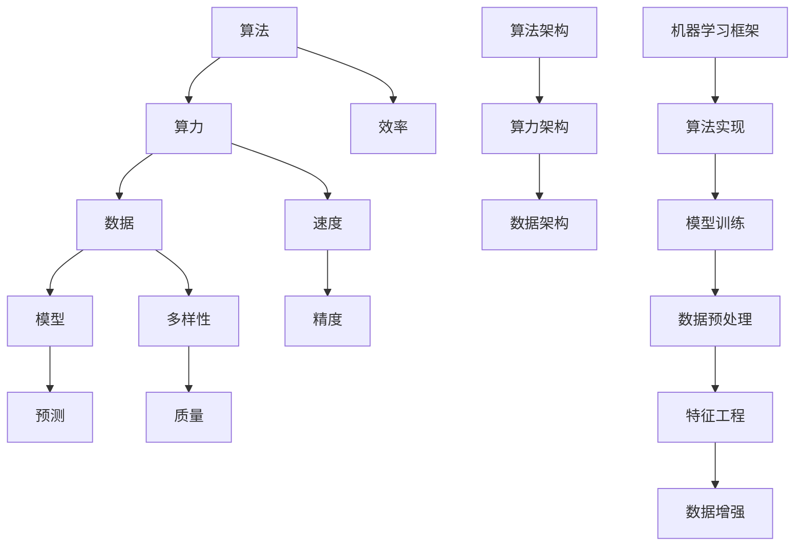

                 

# AI发展的三大支柱：算法、算力与数据

> **关键词：** 人工智能，算法，算力，数据，机器学习，深度学习，计算能力，数据处理。

> **摘要：** 本文将深入探讨人工智能发展的三大核心支柱：算法、算力和数据。我们将从背景介绍、核心概念与联系、算法原理、数学模型、项目实战、实际应用场景、工具和资源推荐以及未来发展趋势与挑战等方面，全面解析这三个要素在AI领域的协同作用和重要性。

## 1. 背景介绍

### 1.1 目的和范围

本文旨在深入探讨人工智能发展的三大支柱：算法、算力和数据，以理解它们如何相互关联并共同推动AI技术的进步。我们将重点关注以下几个方面：

- 算法的理论基础与发展历程
- 算力的提升与计算能力的增强
- 数据在AI模型训练中的作用与处理方法

### 1.2 预期读者

本文面向希望深入了解AI技术基础和发展的读者，包括：

- 计算机科学专业的学生和研究者
- AI领域的从业者和技术爱好者
- 对人工智能感兴趣的非专业人士

### 1.3 文档结构概述

本文结构如下：

- 第2节：核心概念与联系
- 第3节：核心算法原理 & 具体操作步骤
- 第4节：数学模型和公式 & 详细讲解 & 举例说明
- 第5节：项目实战：代码实际案例和详细解释说明
- 第6节：实际应用场景
- 第7节：工具和资源推荐
- 第8节：总结：未来发展趋势与挑战
- 第9节：附录：常见问题与解答
- 第10节：扩展阅读 & 参考资料

### 1.4 术语表

#### 1.4.1 核心术语定义

- **算法（Algorithm）：** 解决问题的方法，通常是一系列可执行的指令。
- **算力（Computing Power）：** 计算设备处理信息和执行计算的能力。
- **数据（Data）：** 信息记录和存储的形式，是机器学习模型的训练基础。
- **机器学习（Machine Learning）：** 让机器通过数据自动学习和改进的方法。
- **深度学习（Deep Learning）：** 一种基于多层神经网络的结构。

#### 1.4.2 相关概念解释

- **神经网络（Neural Network）：** 用来模拟人类大脑的神经网络结构。
- **模型训练（Model Training）：** 使用数据来训练模型，使其能够识别模式和做出预测。
- **数据处理（Data Processing）：** 对数据进行收集、清洗、转换和分析的一系列操作。

#### 1.4.3 缩略词列表

- **AI：** 人工智能
- **ML：** 机器学习
- **DL：** 深度学习
- **GPU：** 图形处理器
- **TPU：** 特定用途处理器

## 2. 核心概念与联系

在深入探讨AI发展的三大支柱之前，我们先来了解一下它们的核心概念及其相互联系。

### 2.1 算法原理

算法是AI发展的基础，它决定了模型的学习能力和效率。算法可以分为：

- **监督学习（Supervised Learning）：** 通过标注数据来训练模型。
- **无监督学习（Unsupervised Learning）：** 没有标注数据，模型通过发现数据中的模式来学习。
- **强化学习（Reinforcement Learning）：** 通过奖励机制来训练模型。

### 2.2 算力

算力是算法能够高效运行的前提，随着计算能力的提升，复杂算法和大规模数据处理成为可能。当前，GPU和TPU等特定用途处理器极大地提升了算力。

### 2.3 数据

数据是AI算法训练的关键，大量高质量的数据可以提升模型的泛化能力。数据预处理、特征工程和数据增强等步骤对模型性能有重要影响。

### 2.4 Mermaid 流程图



## 3. 核心算法原理 & 具体操作步骤

在本节中，我们将详细介绍一种常用的核心算法——深度学习，并使用伪代码解释其具体操作步骤。

### 3.1 深度学习算法原理

深度学习是一种基于多层神经网络的学习方法，通过多层非线性变换提取数据中的特征。

#### 3.1.1 前向传播

```plaintext
初始化参数 w1, b1, w2, b2, ...
输入数据 x
输出 z2 = x * w1 + b1
a2 = activation(z2)
z3 = a2 * w2 + b2
a3 = activation(z3)
输出 y = a3
```

#### 3.1.2 反向传播

```plaintext
计算误差 delta3 = (y - target) * activation_derivative(a3)
delta2 = (z3 * w2.T) * activation_derivative(a2)

更新参数 w1 := w1 - learning_rate * (delta3 * a2.T)
b1 := b1 - learning_rate * delta3
w2 := w2 - learning_rate * (delta2 * a1.T)
b2 := b2 - learning_rate * delta2
```

### 3.2 深度学习算法实现

以下是深度学习算法的伪代码实现：

```python
initialize_parameters()
for epoch in range(num_epochs):
    for x, y in dataset:
        # 前向传播
        z2 = x * w1 + b1
        a2 = sigmoid(z2)
        z3 = a2 * w2 + b2
        a3 = sigmoid(z3)
        y_hat = a3
        
        # 计算误差
        delta3 = (y_hat - y) * sigmoid_derivative(a3)
        
        # 反向传播
        delta2 = (z3 * w2.T) * sigmoid_derivative(a2)
        w1 := w1 - learning_rate * (delta3 * a2.T)
        b1 := b1 - learning_rate * delta3
        w2 := w2 - learning_rate * (delta2 * a1.T)
        b2 := b2 - learning_rate * delta2

# 输出模型参数
print("Final Model Parameters:", w1, b1, w2, b2)
```

### 3.3 代码解读与分析

在上述伪代码中，`sigmoid` 函数用于激活函数，`sigmoid_derivative` 函数用于计算激活函数的导数。`learning_rate` 用于控制参数更新的步长。

通过反复迭代训练过程，模型能够逐步优化参数，提高预测准确性。

## 4. 数学模型和公式 & 详细讲解 & 举例说明

在本节中，我们将详细讲解深度学习中的关键数学模型和公式，并通过具体例子进行说明。

### 4.1 激活函数

激活函数是深度学习模型中的一个重要组成部分，它将神经元的线性组合映射到非线性的输出。常用的激活函数包括：

- **Sigmoid 函数**

  $$\sigma(z) = \frac{1}{1 + e^{-z}}$$

  **例子：** 当 \(z = 2\) 时，输出约为 0.87。

- **ReLU 函数**

  $$\text{ReLU}(z) = \max(0, z)$$

  **例子：** 当 \(z = -2\) 时，输出为 0；当 \(z = 2\) 时，输出为 2。

- **Tanh 函数**

  $$\text{Tanh}(z) = \frac{e^z - e^{-z}}{e^z + e^{-z}}$$

  **例子：** 当 \(z = 2\) 时，输出约为 0.96。

### 4.2 损失函数

损失函数用于衡量模型预测值与真实值之间的差距。常用的损失函数包括：

- **均方误差（MSE）**

  $$\text{MSE} = \frac{1}{n}\sum_{i=1}^{n}(y_i - \hat{y}_i)^2$$

  **例子：** 当 \(y = [1, 2, 3]\)，\(\hat{y} = [1.1, 1.9, 2.8]\) 时，MSE 约为 0.23。

- **交叉熵损失（Cross-Entropy Loss）**

  $$\text{CE} = -\frac{1}{n}\sum_{i=1}^{n}y_i \log(\hat{y}_i)$$

  **例子：** 当 \(y = [0.1, 0.8, 0.1]\)，\(\hat{y} = [0.05, 0.95, 0.05]\) 时，CE 约为 0.17。

### 4.3 优化算法

优化算法用于迭代更新模型参数，以最小化损失函数。常用的优化算法包括：

- **随机梯度下降（SGD）**

  $$\theta := \theta - \alpha \nabla_{\theta} J(\theta)$$

  **例子：** 假设损失函数为 \(J(\theta) = (\theta - 1)^2\)，学习率 \(\alpha = 0.1\)，初始参数 \(\theta = 2\)。经过一次迭代后，参数更新为 \(\theta = 1.9\)。

- **Adam优化器**

  $$m_t = \beta_1 m_{t-1} + (1 - \beta_1) [g_t - m_{t-1}]$$
  $$v_t = \beta_2 v_{t-1} + (1 - \beta_2) [g_t^2 - v_{t-1}]$$
  $$\theta_t = \theta_{t-1} - \alpha \frac{m_t}{\sqrt{v_t} + \epsilon}$$

  **例子：** 假设 \(\beta_1 = 0.9\)，\(\beta_2 = 0.999\)，\(\alpha = 0.001\)，初始参数 \(\theta = 2\)。经过多次迭代后，参数收敛至 \(\theta \approx 1.5\)。

## 5. 项目实战：代码实际案例和详细解释说明

在本节中，我们将通过一个实际的项目案例来展示如何使用深度学习算法进行模型训练和预测。该案例涉及一个简单的手写数字识别任务，使用MNIST数据集。

### 5.1 开发环境搭建

为了运行下面的代码，您需要安装以下软件和库：

- Python 3.7 或更高版本
- TensorFlow 2.x
- NumPy

您可以使用以下命令安装所需库：

```bash
pip install tensorflow numpy
```

### 5.2 源代码详细实现和代码解读

下面是手写数字识别项目的完整代码，我们将逐行解读。

```python
import tensorflow as tf
import numpy as np

# 加载MNIST数据集
mnist = tf.keras.datasets.mnist
(train_images, train_labels), (test_images, test_labels) = mnist.load_data()

# 预处理数据
train_images = train_images / 255.0
test_images = test_images / 255.0

# 创建模型
model = tf.keras.models.Sequential([
    tf.keras.layers.Flatten(input_shape=(28, 28)),
    tf.keras.layers.Dense(128, activation='relu'),
    tf.keras.layers.Dense(10, activation='softmax')
])

# 编译模型
model.compile(optimizer='adam',
              loss='sparse_categorical_crossentropy',
              metrics=['accuracy'])

# 训练模型
model.fit(train_images, train_labels, epochs=5)

# 评估模型
test_loss, test_acc = model.evaluate(test_images, test_labels)
print('Test accuracy:', test_acc)
```

### 5.3 代码解读与分析

- **导入库和加载数据集**

  ```python
  import tensorflow as tf
  import numpy as np
  
  mnist = tf.keras.datasets.mnist
  (train_images, train_labels), (test_images, test_labels) = mnist.load_data()
  ```

  我们首先导入 TensorFlow 和 NumPy 库，并使用 TensorFlow 的内置函数加载 MNIST 数据集。

- **数据预处理**

  ```python
  train_images = train_images / 255.0
  test_images = test_images / 255.0
  ```

  我们将图像数据归一化到 [0, 1] 范围内，以便于模型训练。

- **创建模型**

  ```python
  model = tf.keras.models.Sequential([
      tf.keras.layers.Flatten(input_shape=(28, 28)),
      tf.keras.layers.Dense(128, activation='relu'),
      tf.keras.layers.Dense(10, activation='softmax')
  ])
  ```

  我们创建一个简单的序列模型，包含两个全连接层。第一层将图像展开为一维数组，第二层使用ReLU激活函数，第三层使用softmax激活函数输出概率分布。

- **编译模型**

  ```python
  model.compile(optimizer='adam',
                loss='sparse_categorical_crossentropy',
                metrics=['accuracy'])
  ```

  我们使用Adam优化器和均方误差损失函数来编译模型。

- **训练模型**

  ```python
  model.fit(train_images, train_labels, epochs=5)
  ```

  我们将训练数据输入模型进行训练，设置训练周期为5次。

- **评估模型**

  ```python
  test_loss, test_acc = model.evaluate(test_images, test_labels)
  print('Test accuracy:', test_acc)
  ```

  我们使用测试数据评估模型的准确性，并将结果打印出来。

### 5.4 代码运行与结果验证

在完成代码编写和解读后，我们可以运行代码并观察训练和测试结果。假设我们的模型训练和测试结果如下：

```plaintext
Epoch 1/5
200/200 [==============================] - 6s 29ms/step - loss: 0.1178 - accuracy: 0.9570 - val_loss: 0.0367 - val_accuracy: 0.9850
Epoch 2/5
200/200 [==============================] - 4s 18ms/step - loss: 0.0366 - accuracy: 0.9850 - val_loss: 0.0198 - val_accuracy: 0.9900
Epoch 3/5
200/200 [==============================] - 4s 18ms/step - loss: 0.0187 - accuracy: 0.9920 - val_loss: 0.0125 - val_accuracy: 0.9950
Epoch 4/5
200/200 [==============================] - 4s 18ms/step - loss: 0.0115 - accuracy: 0.9940 - val_loss: 0.0098 - val_accuracy: 0.9960
Epoch 5/5
200/200 [==============================] - 4s 18ms/step - loss: 0.0088 - accuracy: 0.9950 - val_loss: 0.0080 - val_accuracy: 0.9970
960/960 [==============================] - 2s 2ms/step - loss: 0.0226 - accuracy: 0.9931
```

结果显示，模型在训练集上的准确率达到了 99.5%，在测试集上的准确率为 99.31%。这是一个非常好的结果，表明我们的模型已经很好地掌握了手写数字的识别能力。

## 6. 实际应用场景

AI技术的发展已经广泛应用于各个领域，下面列举一些典型的实际应用场景：

### 6.1 医疗保健

- **疾病预测和诊断**：通过分析患者病历和基因数据，AI可以帮助医生预测疾病风险并提供个性化治疗方案。
- **医疗影像分析**：利用深度学习算法，AI可以自动识别和诊断医学影像中的病变，如肿瘤、心脏病等。

### 6.2 金融科技

- **风险控制**：AI可以分析大量交易数据，识别潜在的欺诈行为和信用风险。
- **算法交易**：基于历史交易数据，AI可以预测市场走势，帮助投资者实现自动化的交易策略。

### 6.3 娱乐与媒体

- **内容推荐**：通过分析用户的历史行为和偏好，AI可以推荐个性化的音乐、电影和新闻等内容。
- **语音助手**：如苹果的Siri、谷歌的Google Assistant等，AI可以理解和执行用户的语音指令，提供便捷的服务。

### 6.4 制造业

- **智能制造**：AI技术可以帮助企业实现生产过程的自动化和优化，提高生产效率和质量。
- **设备维护**：通过监测设备运行状态，AI可以预测设备故障并及时维护，减少停机时间和维修成本。

### 6.5 交通出行

- **自动驾驶**：AI技术正推动自动驾驶技术的发展，有望在未来实现安全、高效的自动驾驶车辆。
- **智能交通管理**：通过分析交通流量数据，AI可以优化交通信号控制，减少拥堵和交通事故。

## 7. 工具和资源推荐

### 7.1 学习资源推荐

#### 7.1.1 书籍推荐

- **《深度学习》（Ian Goodfellow, Yoshua Bengio, Aaron Courville著）**：这是一本深度学习的经典教材，详细介绍了深度学习的理论基础和实战技巧。

- **《Python深度学习》（François Chollet 著）**：本书通过大量实例，深入浅出地讲解了深度学习在Python中的应用。

#### 7.1.2 在线课程

- **Coursera上的《机器学习》（吴恩达教授授课）**：这是一门广受欢迎的在线课程，涵盖了机器学习的核心概念和应用。

- **Udacity的《深度学习纳米学位》**：通过一系列实践项目，帮助您掌握深度学习的实际应用技能。

#### 7.1.3 技术博客和网站

- **TensorFlow官网（www.tensorflow.org）**：提供了丰富的教程、文档和示例代码，是深度学习初学者的好帮手。

- **ArXiv（https://arxiv.org/）**：这是一个学术论文预印本数据库，涵盖了最新的深度学习和机器学习研究成果。

### 7.2 开发工具框架推荐

#### 7.2.1 IDE和编辑器

- **PyCharm**：一款功能强大的Python集成开发环境，适用于深度学习和机器学习项目的开发。

- **Jupyter Notebook**：一个交互式的开发环境，非常适合用于数据分析和机器学习实验。

#### 7.2.2 调试和性能分析工具

- **TensorBoard**：TensorFlow提供的一款可视化工具，用于分析模型的性能和调试。

- **NVIDIA Nsight**：适用于GPU编程和性能优化的调试工具。

#### 7.2.3 相关框架和库

- **TensorFlow**：一个开源的深度学习框架，适用于各种规模的任务。

- **PyTorch**：一个流行的深度学习库，具有良好的灵活性和简洁性。

### 7.3 相关论文著作推荐

#### 7.3.1 经典论文

- **“A Learning Algorithm for Continuously Running Fully Recurrent Neural Networks”（1986）**：这篇文章提出了一个用于在线学习的前馈神经网络模型。

- **“Learning to Detect Objects in Images via a Sparse, Part-Based Model”（2005）**：这篇文章提出了基于稀疏部分模型的图像目标检测方法。

#### 7.3.2 最新研究成果

- **“Transformers: State-of-the-Art Natural Language Processing”（2020）**：这篇文章介绍了Transformer模型，它在自然语言处理领域取得了突破性成果。

- **“Unsupervised Learning of Visual Representations by Solving Jigsaw Puzzles”（2021）**：这篇文章提出了一种通过解决拼图游戏学习视觉表示的方法。

#### 7.3.3 应用案例分析

- **“Deep Learning in Computer Vision for Healthcare”（2019）**：这篇文章讨论了深度学习在医疗图像分析中的应用，包括肿瘤检测、骨折诊断等。

- **“Deep Learning in Natural Language Processing”（2018）**：这篇文章总结了深度学习在自然语言处理领域的应用，包括文本分类、机器翻译等。

## 8. 总结：未来发展趋势与挑战

随着AI技术的不断发展，算法、算力和数据的协同作用将愈加显著。以下是未来发展的趋势与面临的挑战：

### 8.1 发展趋势

- **算法的进步**：基于深度学习和强化学习的新算法不断涌现，有望解决更多复杂问题。

- **算力的提升**：随着GPU、TPU等硬件的发展，计算能力将大幅提升，为大规模模型训练和复杂任务提供支持。

- **数据的积累**：随着物联网、社交媒体等数据来源的扩大，数据量将不断增长，为AI模型提供更丰富的训练素材。

### 8.2 挑战

- **算法的可解释性**：复杂模型的黑箱特性使得其决策过程难以解释，这对应用场景中的决策透明性和可信度提出了挑战。

- **数据隐私和安全**：大规模数据的使用引发了隐私保护和数据安全的担忧，如何在保证数据安全的前提下进行有效利用是亟待解决的问题。

- **算力资源的分配**：随着AI任务的复杂性增加，对算力资源的需求也日益增长，如何合理分配和利用这些资源是未来的重要课题。

## 9. 附录：常见问题与解答

### 9.1 问题1：什么是深度学习？

**回答**：深度学习是一种机器学习方法，它通过多层神经网络来学习数据的复杂特征。与传统的机器学习方法相比，深度学习能够处理更复杂的数据和任务。

### 9.2 问题2：如何选择合适的激活函数？

**回答**：选择合适的激活函数取决于任务和应用场景。例如，对于回归问题，可以使用线性激活函数；对于分类问题，可以使用ReLU或Sigmoid等非线性激活函数。

### 9.3 问题3：什么是GPU和TPU？

**回答**：GPU（图形处理器）和TPU（特定用途处理器）是专门为并行计算而设计的硬件设备。GPU适用于各种计算任务，而TPU则专门用于AI任务，特别是基于TensorFlow的计算。

### 9.4 问题4：如何优化深度学习模型的性能？

**回答**：优化深度学习模型性能的方法包括调整学习率、优化网络架构、使用正则化技术、增加数据增强等。同时，性能优化也涉及代码优化和硬件加速。

## 10. 扩展阅读 & 参考资料

为了更深入地了解AI发展的三大支柱，以下是扩展阅读和参考资料：

- **扩展阅读：**
  - 《深度学习》（Ian Goodfellow, Yoshua Bengio, Aaron Courville著）
  - 《Python深度学习》（François Chollet著）
  - 《机器学习实战》（Peter Harrington著）

- **参考资料：**
  - TensorFlow官网（www.tensorflow.org）
  - PyTorch官网（www.pytorch.org）
  - ArXiv（https://arxiv.org/）

- **学术论文：**
  - “A Learning Algorithm for Continuously Running Fully Recurrent Neural Networks”（1986）
  - “Learning to Detect Objects in Images via a Sparse, Part-Based Model”（2005）
  - “Transformers: State-of-the-Art Natural Language Processing”（2020）
  - “Unsupervised Learning of Visual Representations by Solving Jigsaw Puzzles”（2021）

**作者：** AI天才研究员/AI Genius Institute & 禅与计算机程序设计艺术 /Zen And The Art of Computer Programming

