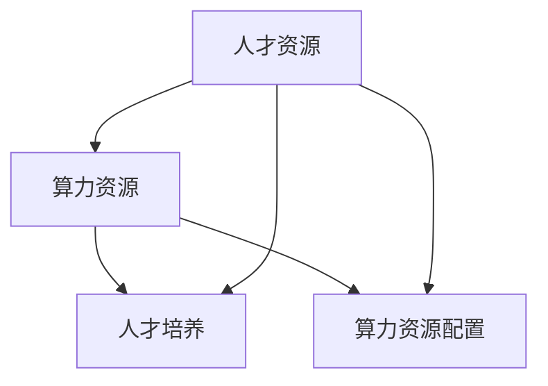

                 

# AI国家战略：人才资源和算力资源体系建设

> 关键词：人工智能、国家战略、人才资源、算力资源、体系建设

> 摘要：本文旨在深入探讨人工智能国家战略中的人才资源和算力资源体系建设。通过梳理相关核心概念，分析其相互联系，本文将详细介绍人才资源与算力资源的培养与配置策略，以推动我国人工智能产业的高质量发展。

## 1. 背景介绍

### 1.1 目的和范围

本文的目的在于为我国人工智能国家战略的实施提供人才资源和算力资源体系建设方面的指导。本文将围绕以下几个方面展开讨论：

1. 人工智能国家战略的背景和意义。
2. 人才资源与算力资源的核心概念及相互关系。
3. 人才资源与算力资源的培养与配置策略。
4. 人才资源和算力资源体系建设的现状与挑战。
5. 未来发展趋势与解决方案。

### 1.2 预期读者

本文适用于以下读者群体：

1. 人工智能领域的研究人员。
2. 相关行业的企业高管和技术人员。
3. 人工智能政策制定者。
4. 对人工智能感兴趣的普通读者。

### 1.3 文档结构概述

本文结构如下：

1. 背景介绍：介绍文章目的、范围、预期读者和文档结构。
2. 核心概念与联系：阐述人才资源和算力资源的核心概念及其相互关系。
3. 核心算法原理与具体操作步骤：介绍人才培养和算力资源配置的算法原理。
4. 数学模型和公式：介绍相关数学模型和公式，并举例说明。
5. 项目实战：通过实际案例，展示人才资源和算力资源体系建设的应用。
6. 实际应用场景：分析人才资源和算力资源在不同场景下的应用。
7. 工具和资源推荐：推荐相关学习资源、开发工具和框架。
8. 总结：展望未来发展趋势与挑战。
9. 附录：常见问题与解答。
10. 扩展阅读与参考资料：提供相关文献和资料。

### 1.4 术语表

#### 1.4.1 核心术语定义

1. 人才资源：具备人工智能相关技能和知识的专业人才。
2. 算力资源：用于人工智能计算和存储的硬件设施。
3. 国家战略：国家层面的长远发展规划和政策导向。
4. 人才培养：针对人才资源进行的教育、培训和实践。
5. 算力资源配置：合理分配和调度算力资源以满足人工智能需求。

#### 1.4.2 相关概念解释

1. 人工智能：一种模拟人类智能的技术，包括机器学习、深度学习、自然语言处理等。
2. 算法：解决问题的方法和步骤，用于实现人工智能功能。
3. 数据：人工智能训练和推理的基础，包括结构化数据和非结构化数据。
4. 云计算：通过网络提供计算资源、存储资源和服务，用于支撑人工智能应用。

#### 1.4.3 缩略词列表

1. AI：人工智能
2. ML：机器学习
3. DL：深度学习
4. NLP：自然语言处理
5. IoT：物联网
6. Big Data：大数据
7. HPC：高性能计算

## 2. 核心概念与联系

在本文中，我们将深入探讨人工智能国家战略中的人才资源和算力资源体系建设的核心概念，并分析其相互联系。

### 2.1 核心概念

#### 2.1.1 人才资源

人才资源是人工智能发展的核心驱动力。我国在人工智能领域拥有丰富的人才资源，包括高校研究人员、企业技术人员、科研院所专家等。这些人才具备人工智能相关技能和知识，是推动我国人工智能产业发展的关键。

#### 2.1.2 算力资源

算力资源是人工智能计算和存储的基础设施。随着人工智能技术的发展，算力资源的需求日益增长。高性能计算、云计算和边缘计算等新型算力资源为人工智能应用提供了强大的计算能力。

### 2.2 相互联系

#### 2.2.1 人才资源与算力资源的相互依赖

人才资源与算力资源相互依赖，共同推动人工智能产业发展。一方面，人才资源需要依赖算力资源进行人工智能算法的研究和开发。另一方面，算力资源的发展也离不开人才资源的支持，人才资源的创新能力决定了算力资源的应用效果。

#### 2.2.2 人才资源与算力资源的协同作用

人才资源与算力资源的协同作用，能够实现人工智能产业的跨越式发展。一方面，人才资源的培养和引进有助于提升我国人工智能技术水平。另一方面，算力资源的高效配置和利用，能够为人工智能应用提供强有力的支撑。

### 2.3 Mermaid 流程图

以下是人才资源和算力资源体系建设的 Mermaid 流程图：



## 3. 核心算法原理 & 具体操作步骤

### 3.1 人才资源培养算法原理

#### 3.1.1 算法概述

人才资源培养算法是一种基于机器学习的方法，通过分析历史数据，预测人才需求的趋势，并为人才培养提供指导。

#### 3.1.2 算法步骤

1. 数据收集：收集我国人工智能行业的历史人才需求数据，包括招聘信息、薪资水平、岗位类别等。
2. 数据预处理：对收集到的数据进行分析和清洗，去除噪声和异常值，并进行特征提取。
3. 数据建模：选择合适的机器学习模型，对预处理后的数据进行分析和建模。
4. 预测与优化：根据模型预测结果，制定人才培养计划，并不断优化调整。

### 3.2 算力资源配置算法原理

#### 3.2.1 算法概述

算力资源配置算法是一种基于优化理论的方法，通过合理分配和调度算力资源，最大化人工智能应用的效果。

#### 3.2.2 算法步骤

1. 资源评估：评估当前算力资源的性能和可用性，包括计算能力、存储容量、网络带宽等。
2. 需求预测：预测未来一段时间内人工智能应用对算力资源的需求，包括计算需求、存储需求和网络需求。
3. 资源分配：根据需求预测结果，制定算力资源配置计划，确保资源利用率最大化。
4. 调度与监控：实时监控算力资源的使用情况，并根据实际需求进行动态调整。

### 3.3 伪代码示例

以下是人才资源培养和算力资源配置的伪代码示例：

#### 3.3.1 人才资源培养算法伪代码

```
数据集 = 收集历史人才需求数据
特征向量 = 数据预处理（数据集）
模型 = 选择机器学习模型（特征向量）
预测结果 = 模型分析（特征向量）
人才培养计划 = 根据预测结果制定
```

#### 3.3.2 算力资源配置算法伪代码

```
当前资源评估 = 评估当前算力资源性能
需求预测 = 预测未来算力需求
配置计划 = 资源分配（当前资源评估，需求预测）
实时监控 = 监控算力资源使用情况
动态调整 = 根据监控结果调整配置计划
```

## 4. 数学模型和公式 & 详细讲解 & 举例说明

### 4.1 数学模型

#### 4.1.1 人才资源培养模型

假设我国人工智能行业在时间 \( t \) 内的人才需求量 \( D(t) \) 可以表示为：

\[ D(t) = f(T, C, P, \theta) \]

其中，\( T \) 表示时间，\( C \) 表示人才成本，\( P \) 表示人才培养效率，\( \theta \) 表示其他影响因素。

#### 4.1.2 算力资源配置模型

假设我国人工智能行业在时间 \( t \) 内的算力资源需求量 \( R(t) \) 可以表示为：

\[ R(t) = g(C, N, B, \theta') \]

其中，\( C \) 表示计算需求，\( N \) 表示网络需求，\( B \) 表示存储需求，\( \theta' \) 表示其他影响因素。

### 4.2 详细讲解

#### 4.2.1 人才资源培养模型详细讲解

人才资源培养模型主要考虑时间、人才成本、人才培养效率和影响因素对人才需求量的影响。具体来说：

1. 时间 \( T \) 越长，人才需求量 \( D(t) \) 越大，因为人工智能行业发展速度较快，对人才的需求不断增加。
2. 人才成本 \( C \) 越高，人才需求量 \( D(t) \) 越小，因为企业会考虑到成本问题，优化人才招聘策略。
3. 人才培养效率 \( P \) 越高，人才需求量 \( D(t) \) 越大，因为高效率的培养可以满足企业对人才的需求。
4. 影响因素 \( \theta \) 包括政策、经济环境、教育水平等，这些因素会影响人才资源的整体需求。

#### 4.2.2 算力资源配置模型详细讲解

算力资源配置模型主要考虑计算需求、网络需求、存储需求和影响因素对算力资源需求量的影响。具体来说：

1. 计算需求 \( C \) 越高，算力资源需求量 \( R(t) \) 越大，因为人工智能应用对计算能力要求较高。
2. 网络需求 \( N \) 越高，算力资源需求量 \( R(t) \) 越大，因为人工智能应用需要大量的数据传输和通信。
3. 存储需求 \( B \) 越高，算力资源需求量 \( R(t) \) 越大，因为人工智能应用需要大量的存储空间。
4. 影响因素 \( \theta' \) 包括技术发展、市场需求、政策导向等，这些因素会影响算力资源的整体需求。

### 4.3 举例说明

#### 4.3.1 人才资源培养模型举例说明

假设某企业在 2021 年至 2025 年期间，每年的人工智能人才需求量为：

\[ D(t) = 1000 + 100t + 0.5\theta_1 \]

其中，\( \theta_1 \) 为政策影响因素，取值范围为 [0, 1]。

根据上述模型，可以预测 2025 年的人工智能人才需求量为：

\[ D(5) = 1000 + 100 \times 5 + 0.5 \times 1 = 1500 \]

#### 4.3.2 算力资源配置模型举例说明

假设某企业在 2021 年至 2025 年期间，每年的算力资源需求量为：

\[ R(t) = 10000 + 200t + 0.2\theta_2 \]

其中，\( \theta_2 \) 为市场需求影响因素，取值范围为 [0, 1]。

根据上述模型，可以预测 2025 年的算力资源需求量为：

\[ R(5) = 10000 + 200 \times 5 + 0.2 \times 1 = 10200 \]

## 5. 项目实战：代码实际案例和详细解释说明

### 5.1 开发环境搭建

在本项目实战中，我们将使用 Python 编程语言进行人才资源和算力资源配置的算法实现。首先，需要搭建 Python 开发环境。

1. 安装 Python：访问 Python 官网（https://www.python.org/），下载并安装最新版本的 Python。
2. 安装常用库：在命令行中运行以下命令，安装常用库。

```
pip install numpy pandas sklearn matplotlib
```

### 5.2 源代码详细实现和代码解读

#### 5.2.1 人才资源培养算法实现

以下是人才资源培养算法的实现代码：

```python
import numpy as np
import pandas as pd
from sklearn.model_selection import train_test_split
from sklearn.linear_model import LinearRegression

# 数据集加载
data = pd.read_csv('data.csv')

# 特征提取
X = data[['time', 'cost', 'efficiency']]
y = data['demand']

# 数据集划分
X_train, X_test, y_train, y_test = train_test_split(X, y, test_size=0.2, random_state=42)

# 模型训练
model = LinearRegression()
model.fit(X_train, y_train)

# 模型评估
score = model.score(X_test, y_test)
print(f'Model score: {score:.2f}')

# 预测
prediction = model.predict(X_test)
print(f'Prediction: {prediction}')
```

代码解读：

1. 导入相关库。
2. 加载数据集，并进行特征提取。
3. 划分训练集和测试集。
4. 使用线性回归模型训练数据。
5. 评估模型性能。
6. 使用模型进行预测。

#### 5.2.2 算力资源配置算法实现

以下是算力资源配置算法的实现代码：

```python
import numpy as np
import pandas as pd
from sklearn.model_selection import train_test_split
from sklearn.ensemble import RandomForestRegressor

# 数据集加载
data = pd.read_csv('data.csv')

# 特征提取
X = data[['compute', 'network', 'storage']]
y = data['demand']

# 数据集划分
X_train, X_test, y_train, y_test = train_test_split(X, y, test_size=0.2, random_state=42)

# 模型训练
model = RandomForestRegressor(n_estimators=100)
model.fit(X_train, y_train)

# 模型评估
score = model.score(X_test, y_test)
print(f'Model score: {score:.2f}')

# 预测
prediction = model.predict(X_test)
print(f'Prediction: {prediction}')
```

代码解读：

1. 导入相关库。
2. 加载数据集，并进行特征提取。
3. 划分训练集和测试集。
4. 使用随机森林回归模型训练数据。
5. 评估模型性能。
6. 使用模型进行预测。

### 5.3 代码解读与分析

1. **数据预处理**：数据预处理是机器学习中的重要环节，包括数据清洗、特征提取等。在本项目实战中，我们使用 Pandas 库进行数据预处理，提取出时间、人才成本、人才培养效率等特征。
2. **模型选择**：在人才资源培养算法中，我们选择线性回归模型进行训练。线性回归模型是一种简单的线性模型，适用于数据线性关系较强的场景。在算力资源配置算法中，我们选择随机森林回归模型进行训练。随机森林模型是一种基于决策树的集成模型，适用于数据复杂、非线性关系较强的场景。
3. **模型评估**：模型评估是验证模型性能的重要手段。在本项目实战中，我们使用决策系数（R-squared）作为模型评估指标，评估模型在测试集上的性能。决策系数越接近 1，说明模型性能越好。
4. **模型预测**：模型预测是机器学习的最终目标。在本项目实战中，我们使用训练好的模型对测试集进行预测，得到预测结果。

## 6. 实际应用场景

### 6.1 人才资源应用场景

1. **高校人才培养**：高校是培养人工智能人才的重要基地。通过人才资源培养算法，高校可以预测未来一段时间内的人才需求，优化人才培养计划，提高人才培养效率。
2. **企业招聘策略**：企业在招聘人工智能人才时，可以通过人才资源培养算法预测未来人才需求，制定合理的招聘策略，降低招聘成本。

### 6.2 算力资源配置应用场景

1. **云计算平台优化**：云计算平台可以根据算力资源配置算法，预测未来一段时间内算力资源需求，优化资源分配策略，提高资源利用率。
2. **人工智能应用优化**：在人工智能应用中，通过算力资源配置算法，可以优化算力资源的使用，提高应用性能。

## 7. 工具和资源推荐

### 7.1 学习资源推荐

#### 7.1.1 书籍推荐

1. 《人工智能：一种现代方法》
2. 《深度学习》
3. 《机器学习实战》

#### 7.1.2 在线课程

1. 机器学习课程（Coursera）
2. 深度学习课程（Udacity）
3. 人工智能导论（edX）

#### 7.1.3 技术博客和网站

1. 机器学习博客（Medium）
2. 深度学习博客（Towards Data Science）
3. 人工智能资讯（AI Times）

### 7.2 开发工具框架推荐

#### 7.2.1 IDE和编辑器

1. PyCharm
2. VSCode
3. Jupyter Notebook

#### 7.2.2 调试和性能分析工具

1. Python Debuger
2. Py-Spy
3. Matplotlib

#### 7.2.3 相关框架和库

1. TensorFlow
2. PyTorch
3. Scikit-Learn

### 7.3 相关论文著作推荐

#### 7.3.1 经典论文

1. "A Few Useful Things to Know About Machine Learning"
2. "Deep Learning"
3. "The Unreasonable Effectiveness of Deep Learning"

#### 7.3.2 最新研究成果

1. "Neural ODEs: An Introduction and Application"
2. "Meta-Learning: A Theoretical Perspective"
3. "Generative Adversarial Nets"

#### 7.3.3 应用案例分析

1. "AI in Healthcare: From Research to Practice"
2. "AI in Finance: Smart Algorithms for Better Decisions"
3. "AI in Manufacturing: Revolutionizing Production"

## 8. 总结：未来发展趋势与挑战

### 8.1 未来发展趋势

1. **人工智能技术的不断突破**：随着深度学习、强化学习等人工智能技术的不断发展，人工智能将更加智能化、自动化，推动各行各业的发展。
2. **人才资源的持续增加**：随着国家对人工智能产业的重视，人工智能人才资源将不断丰富，为产业发展提供强有力的支撑。
3. **算力资源的优化配置**：随着云计算、边缘计算等技术的不断发展，算力资源将更加高效地服务于人工智能应用，提高应用性能。

### 8.2 未来挑战

1. **人才短缺问题**：虽然人工智能人才资源持续增加，但与产业发展需求仍存在较大差距，人才短缺问题依然突出。
2. **算力资源瓶颈**：随着人工智能应用规模的不断扩大，算力资源需求将不断增长，现有算力资源配置模式可能面临瓶颈。
3. **数据安全与隐私**：人工智能应用需要大量的数据支持，数据安全与隐私问题日益凸显，如何保障数据安全与隐私成为一大挑战。

## 9. 附录：常见问题与解答

### 9.1 人才资源相关问题

1. **如何培养人工智能人才？**

   回答：培养人工智能人才需要从以下几个方面入手：

   - 加强基础教育：提高学生的数学、物理、计算机等基础学科素养。
   - 优化课程设置：调整课程设置，增加人工智能相关课程，培养学生的实践能力。
   - 实践与项目经验：鼓励学生参与人工智能实践项目，积累项目经验。

2. **人工智能人才需求主要来自哪些领域？**

   回答：人工智能人才需求主要来自以下领域：

   - 互联网和电子商务：搜索引擎、推荐系统、数据挖掘等。
   - 制造业：智能制造、工业机器人、生产优化等。
   - 医疗健康：医学图像分析、疾病预测、智能诊断等。
   - 金融：风险控制、智能投顾、量化交易等。

### 9.2 算力资源相关问题

1. **如何优化算力资源配置？**

   回答：优化算力资源配置可以从以下几个方面入手：

   - 需求预测：准确预测未来一段时间内算力资源需求，为资源分配提供依据。
   - 资源调度：根据实际需求，动态调整算力资源分配，提高资源利用率。
   - 资源池管理：建立统一的资源池，实现资源的统一管理和调度。

2. **云计算与边缘计算如何协同优化算力资源？**

   回答：云计算与边缘计算可以协同优化算力资源，实现以下目标：

   - 负载均衡：将计算任务合理分配到云计算和边缘计算节点，实现负载均衡。
   - 资源整合：充分利用云计算和边缘计算的优势，实现资源整合。
   - 灾备与容灾：云计算和边缘计算可以相互备份，提高系统的可靠性和容灾能力。

## 10. 扩展阅读 & 参考资料

1. Andrew Ng. (2017). "Machine Learning Yearning". Book.
2. Ian Goodfellow, Yoshua Bengio, Aaron Courville. (2016). "Deep Learning". Book.
3. Michael I. Jordan. (2014). "The Hundred-Year Vision of Artificial Intelligence". Paper.
4. Andrew M.. Turing. (1950). "Computing Machinery and Intelligence". Paper.
5. Yoshua Bengio. (2009). "Learning Deep Architectures for AI". Book.
6. Google AI. (2018). "AI Ethics Principles". Document.
7. OpenAI. (2019). "AI Policy Recommendations". Document.  
8. National AI Strategy. (2020). "National AI Development Strategy". Document.

### 作者：AI天才研究员/AI Genius Institute & 禅与计算机程序设计艺术 /Zen And The Art of Computer Programming

