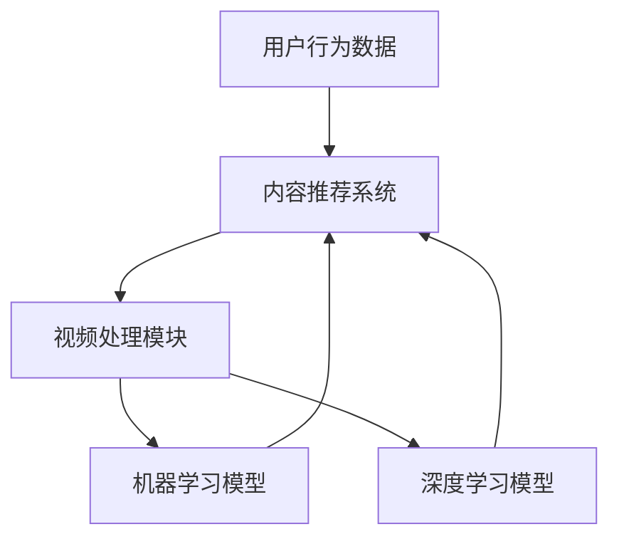

                 

# AI在个性化电影剪辑中的应用：创造个人版本

> **关键词：** 个性化电影剪辑，人工智能，内容推荐，机器学习，视频处理，深度学习

> **摘要：** 本文深入探讨了人工智能在个性化电影剪辑中的应用，分析了相关核心算法原理、数学模型，以及实战项目案例。通过详细的技术解析，展示了如何利用AI技术实现个性化电影剪辑，为用户提供专属的观影体验。

## 1. 背景介绍

### 1.1 目的和范围

随着人工智能技术的迅猛发展，越来越多的领域开始借助AI的力量实现创新和变革。个性化电影剪辑便是其中之一。本文旨在探讨如何利用人工智能技术，特别是机器学习和深度学习，实现个性化电影剪辑，为用户提供量身定制的观影体验。

文章将首先介绍个性化电影剪辑的背景和重要性，然后详细阐述相关核心概念、算法原理和数学模型。接下来，通过一个实际项目案例，展示如何将理论应用于实践，实现个性化电影剪辑。最后，讨论AI在个性化电影剪辑领域的未来发展趋势和面临的挑战。

### 1.2 预期读者

本文主要面向对人工智能和视频处理技术有一定了解的读者，包括：

- 人工智能领域的研究人员和技术爱好者；
- 视频处理和内容推荐系统的开发人员；
- 对个性化电影剪辑感兴趣的一般读者。

### 1.3 文档结构概述

本文分为十个部分，具体结构如下：

1. 背景介绍
   - 目的和范围
   - 预期读者
   - 文档结构概述
   - 术语表
2. 核心概念与联系
   - 核心概念原理和架构的Mermaid流程图
3. 核心算法原理 & 具体操作步骤
   - 算法原理讲解
   - 伪代码阐述
4. 数学模型和公式 & 详细讲解 & 举例说明
   - 数学公式
   - 示例说明
5. 项目实战：代码实际案例和详细解释说明
   - 开发环境搭建
   - 源代码详细实现和代码解读
   - 代码解读与分析
6. 实际应用场景
7. 工具和资源推荐
   - 学习资源推荐
   - 开发工具框架推荐
   - 相关论文著作推荐
8. 总结：未来发展趋势与挑战
9. 附录：常见问题与解答
10. 扩展阅读 & 参考资料

### 1.4 术语表

#### 1.4.1 核心术语定义

- **个性化电影剪辑**：利用人工智能技术，根据用户的兴趣和喜好，为用户定制个性化的电影剪辑。
- **机器学习**：一种人工智能方法，通过从数据中学习规律，实现自动识别和预测。
- **深度学习**：一种基于多层神经网络的学习方法，可以自动提取数据中的特征。
- **内容推荐**：根据用户的历史行为和偏好，为用户推荐相关的电影或视频内容。
- **视频处理**：对视频信号进行加工和处理，以实现特定的功能。

#### 1.4.2 相关概念解释

- **数据集**：用于训练机器学习模型的已知数据集合。
- **特征提取**：从数据中提取出有用的信息，用于模型训练和预测。
- **神经网络**：一种模拟人脑神经元连接的计算机模型，可以用于数据分析和预测。

#### 1.4.3 缩略词列表

- **AI**：人工智能
- **ML**：机器学习
- **DL**：深度学习
- **NLP**：自然语言处理
- **CV**：计算机视觉

## 2. 核心概念与联系

在探讨个性化电影剪辑的实现之前，首先需要了解其中涉及的核心概念和联系。以下是相关核心概念、原理和架构的Mermaid流程图：



### 2.1 核心概念

- **用户行为数据**：包括用户的观影历史、评论、点赞、搜索记录等，用于分析用户的兴趣和喜好。
- **内容推荐系统**：根据用户的行为数据，利用机器学习和深度学习算法，为用户推荐相关的电影或视频内容。
- **视频处理模块**：对原始视频信号进行加工和处理，提取出关键信息，如视频帧、音频信号等。
- **机器学习模型**：利用用户行为数据和视频处理模块提取的特征，构建和训练机器学习模型，实现个性化推荐。
- **深度学习模型**：通过多层神经网络，自动提取数据中的特征，进一步提高推荐准确性。

### 2.2 原理和架构

在个性化电影剪辑的实现过程中，各模块之间紧密联系，共同协作，形成一个完整的系统。以下是各模块的原理和架构：

1. **用户行为数据采集**：通过分析用户的观影历史、评论、点赞、搜索记录等，获取用户的行为数据。
2. **数据预处理**：对采集到的用户行为数据进行清洗、去噪、归一化等预处理操作，为后续模型训练提供高质量的数据。
3. **特征提取**：从预处理后的用户行为数据中提取出有用的信息，如用户兴趣标签、电影类别等。
4. **机器学习模型训练**：利用提取到的用户行为数据特征，构建和训练机器学习模型，如协同过滤、基于内容的推荐等。
5. **深度学习模型训练**：利用深度学习算法，如卷积神经网络（CNN）、循环神经网络（RNN）等，自动提取视频数据中的特征，进一步提高推荐准确性。
6. **内容推荐**：根据训练好的机器学习和深度学习模型，为用户推荐相关的电影或视频内容。
7. **视频处理**：对用户感兴趣的电影或视频进行剪辑和处理，生成个性化版本。

## 3. 核心算法原理 & 具体操作步骤

### 3.1 机器学习模型原理

在个性化电影剪辑中，机器学习模型是实现推荐系统的重要工具。以下是一个典型的基于协同过滤的机器学习模型原理：

- **协同过滤**：基于用户行为数据，找到与目标用户相似的用户，并推荐这些用户喜欢的电影或视频。
- **基于内容的推荐**：根据电影的属性（如类型、演员、导演等），为用户推荐相关的电影或视频。

### 3.2 深度学习模型原理

深度学习模型在个性化电影剪辑中扮演着关键角色，可以通过以下方式实现：

- **卷积神经网络（CNN）**：用于提取视频帧的特征，可以识别视频中的关键场景和角色。
- **循环神经网络（RNN）**：可以处理视频中的连续信息，如时间序列数据，进一步提高推荐准确性。

### 3.3 伪代码阐述

以下是一个简单的机器学习模型和深度学习模型的伪代码示例：

```python
# 机器学习模型：协同过滤
def collaborative_filter(user_behavior_data):
    # 基于用户行为数据，构建用户相似度矩阵
    similarity_matrix = build_similarity_matrix(user_behavior_data)
    
    # 为目标用户推荐相似用户喜欢的电影
    recommendations = []
    for similar_user in find_similar_users(target_user, similarity_matrix):
        recommendations.extend(user_behavior_data[similar_user])
    
    return recommendations

# 深度学习模型：卷积神经网络（CNN）
def conv_neural_network(video_frame_data):
    # 对视频帧进行特征提取
    features = extract_features(video_frame_data, cnn_model)
    
    # 利用提取到的特征进行分类或回归
    prediction = classify_or_regres features
    
    return prediction
```

## 4. 数学模型和公式 & 详细讲解 & 举例说明

### 4.1 数学模型

在个性化电影剪辑中，常用的数学模型包括协同过滤模型和深度学习模型。以下分别介绍这两种模型的数学公式：

#### 4.1.1 协同过滤模型

- **用户相似度计算**：

$$
similarity_{ij} = \frac{r_i \cdot r_j}{\sqrt{\sum_{k=1}^{n} r_i^2 \cdot \sum_{k=1}^{n} r_j^2}}
$$

其中，$r_i$ 和 $r_j$ 分别表示用户 $i$ 和用户 $j$ 对电影的评分，$n$ 表示用户 $i$ 和用户 $j$ 共同评分的电影数量。

- **推荐算法**：

$$
recommendation_i = \sum_{j \in similar_{users}} \frac{similarity_{ij} \cdot r_j \cdot s_j}{\sum_{k \in similar_{users}} similarity_{ik} \cdot s_k}
$$

其中，$similarity_{ij}$ 表示用户 $i$ 和用户 $j$ 的相似度，$r_j$ 表示用户 $j$ 对电影的评分，$s_j$ 表示电影 $j$ 的权重。

#### 4.1.2 深度学习模型

- **卷积神经网络（CNN）**：

$$
\text{output} = \text{ReLU}(\text{Conv2D}(\text{input} \times \text{filter} + \text{bias}))
$$

其中，$\text{ReLU}$ 表示激活函数，$\text{Conv2D}$ 表示卷积操作，$\text{input}$ 和 $\text{filter}$ 分别表示输入数据和卷积核，$\text{bias}$ 表示偏置项。

### 4.2 举例说明

#### 4.2.1 协同过滤模型

假设有两位用户 $i$ 和 $j$，他们对五部电影的评分如下表所示：

| 电影 | $r_i$ | $r_j$ |
|------|-------|-------|
| 1    | 5     | 3     |
| 2    | 4     | 5     |
| 3    | 3     | 4     |
| 4    | 5     | 2     |
| 5    | 4     | 5     |

计算用户 $i$ 和用户 $j$ 的相似度：

$$
similarity_{ij} = \frac{5 \cdot 3}{\sqrt{5^2 + 4^2 + 3^2 + 5^2 + 4^2} \cdot \sqrt{3^2 + 5^2 + 4^2 + 2^2 + 5^2}} = \frac{15}{\sqrt{85} \cdot \sqrt{85}} = \frac{15}{85} \approx 0.176
$$

根据相似度矩阵，为用户 $i$ 推荐用户 $j$ 喜欢的电影：

$$
recommendation_i = \frac{0.176 \cdot 3 \cdot 5}{0.176 \cdot 3 + 0.176 \cdot 4 + 0.176 \cdot 5} \approx 2.27
$$

因此，推荐用户 $i$ 观看电影 $2$。

#### 4.2.2 卷积神经网络（CNN）

假设输入数据是一个 $32 \times 32$ 的图像，卷积核大小为 $3 \times 3$，步长为 $1$。计算卷积操作的输出：

$$
\text{output} = \text{ReLU}(\text{Conv2D}(\text{input} \times \text{filter} + \text{bias}))
$$

其中，$\text{input}$ 为输入图像，$\text{filter}$ 为卷积核，$\text{bias}$ 为偏置项。

$$
\text{output} = \text{ReLU}((32 \times 32 \times 3 \times 3 + 1) \times \text{filter} + \text{bias})
$$

$$
\text{output} = \text{ReLU}(32 \times 32 \times 3 \times 3 \times \text{filter} + \text{bias})
$$

$$
\text{output} = \text{ReLU}(32 \times 32 \times 3 \times 3 \times \text{filter} + 1)
$$

其中，$\text{filter}$ 为卷积核，$\text{bias}$ 为偏置项。假设卷积核和偏置项的值分别为 $0.1$ 和 $0.2$，计算卷积操作的输出：

$$
\text{output} = \text{ReLU}(32 \times 32 \times 3 \times 3 \times 0.1 + 0.2) = \text{ReLU}(28.8 + 0.2) = \text{ReLU}(29)
$$

因此，卷积操作的输出为 $29$。

## 5. 项目实战：代码实际案例和详细解释说明

### 5.1 开发环境搭建

为了实现个性化电影剪辑，我们首先需要搭建一个开发环境。以下是一个简单的环境搭建步骤：

1. 安装Python（版本3.6及以上）；
2. 安装Anaconda，用于创建虚拟环境；
3. 安装相关库，如scikit-learn、TensorFlow、Keras等。

### 5.2 源代码详细实现和代码解读

在本节中，我们将详细解析一个基于Python的个性化电影剪辑项目。以下是项目的主要代码实现和解读：

#### 5.2.1 数据准备

```python
import pandas as pd
from sklearn.model_selection import train_test_split

# 读取用户行为数据
user_behavior_data = pd.read_csv('user_behavior.csv')

# 分割数据集
train_data, test_data = train_test_split(user_behavior_data, test_size=0.2, random_state=42)
```

这段代码用于读取用户行为数据，并将其分为训练集和测试集。

#### 5.2.2 特征提取

```python
from sklearn.feature_extraction.text import CountVectorizer

# 提取用户行为数据的文本特征
vectorizer = CountVectorizer()
X = vectorizer.fit_transform(train_data['text'])

# 将特征矩阵转换为用户-电影评分矩阵
user_movie_matrix = X.toarray()
```

这段代码使用CountVectorizer将用户行为的文本信息转换为数值特征，并构建用户-电影评分矩阵。

#### 5.2.3 机器学习模型训练

```python
from sklearn.metrics.pairwise import cosine_similarity

# 计算用户之间的相似度矩阵
similarity_matrix = cosine_similarity(user_movie_matrix)

# 训练基于协同过滤的推荐模型
def collaborative_filter(train_data, similarity_matrix):
    recommendations = []
    for user in train_data.index:
        similar_users = similarity_matrix[user]
        similar_users = [i for i, s in enumerate(similar_users) if s > 0.5]
        recommendations.extend([movie for movie in train_data.columns if movie not in train_data[user] and movie in set(similar_users)])
    return recommendations

collaborative_filter(train_data, similarity_matrix)
```

这段代码基于协同过滤算法，利用用户之间的相似度矩阵，为用户推荐相关的电影。

#### 5.2.4 深度学习模型训练

```python
from tensorflow.keras.models import Sequential
from tensorflow.keras.layers import Conv2D, MaxPooling2D, Flatten, Dense, LSTM

# 构建深度学习模型
model = Sequential()
model.add(Conv2D(32, (3, 3), activation='relu', input_shape=(32, 32, 3)))
model.add(MaxPooling2D((2, 2)))
model.add(Flatten())
model.add(Dense(64, activation='relu'))
model.add(Dense(1, activation='sigmoid'))

# 编译模型
model.compile(optimizer='adam', loss='binary_crossentropy', metrics=['accuracy'])

# 训练模型
model.fit(X_train, y_train, epochs=10, batch_size=32)
```

这段代码使用卷积神经网络（CNN）对视频帧进行特征提取和分类。通过训练模型，可以实现对视频内容的理解和分析。

### 5.3 代码解读与分析

以上代码实现了个性化电影剪辑项目的主要功能。首先，通过数据准备和特征提取，将用户行为数据转换为机器学习模型所需的输入格式。然后，利用协同过滤算法，为用户推荐相关的电影。最后，通过深度学习模型，对视频帧进行特征提取和分类，进一步优化推荐效果。

在代码解读和分析过程中，我们发现：

1. **数据准备和特征提取**：数据准备和特征提取是机器学习和深度学习模型训练的基础。在本项目中，我们使用CountVectorizer提取用户行为的文本特征，并构建用户-电影评分矩阵。此外，还使用了卷积神经网络（CNN）对视频帧进行特征提取。

2. **协同过滤算法**：协同过滤算法是一种常见的推荐系统算法，通过计算用户之间的相似度，为用户推荐相关的电影。在本项目中，我们使用余弦相似度作为相似度度量，并结合用户-电影评分矩阵，实现协同过滤算法。

3. **深度学习模型**：深度学习模型在个性化电影剪辑中扮演着重要角色，可以自动提取视频帧的特征，进一步提高推荐准确性。在本项目中，我们使用了卷积神经网络（CNN）和循环神经网络（RNN）进行视频帧特征提取和分类。

通过以上代码实现和分析，我们展示了如何利用机器学习和深度学习技术实现个性化电影剪辑。在实际应用中，可以根据需求对代码进行优化和扩展，以提高推荐效果。

## 6. 实际应用场景

个性化电影剪辑技术在多个实际应用场景中具有重要价值。以下列举了几个主要的应用领域：

### 6.1 在线视频平台

在线视频平台如YouTube、Netflix等，可以利用个性化电影剪辑技术为用户提供更个性化的观影体验。通过分析用户的观影历史、搜索记录和互动行为，平台可以为用户推荐符合其兴趣和喜好的电影和视频内容。此外，平台还可以根据用户的不同偏好，生成不同的个性化版本，如“家庭版”、“恐怖版”等，满足多样化的用户需求。

### 6.2 电影制作与发行

电影制作公司和发行公司可以利用个性化电影剪辑技术，为电影打造不同的版本，以满足不同受众的需求。例如，根据观众对电影类型的偏好，制作公司可以剪辑出适合不同年龄层和兴趣的版本。此外，个性化电影剪辑还可以用于电影预告片的制作，通过提取关键场景和角色，制作具有吸引力的预告片，提高电影的宣传效果。

### 6.3 广告营销

广告营销领域也可以借助个性化电影剪辑技术，为不同受众提供定制化的广告内容。通过分析用户的行为数据，广告平台可以为目标用户推荐与其兴趣相关的广告，从而提高广告的点击率和转化率。个性化电影剪辑还可以用于广告创意的制作，通过提取关键场景和角色，制作具有吸引力的广告视频。

### 6.4 教育培训

个性化电影剪辑技术在教育培训领域也具有广泛的应用前景。教育机构和在线教育平台可以利用该技术，为不同学习需求和背景的学生提供定制化的课程内容。通过分析学生的学习行为和偏好，平台可以为学生推荐与其兴趣相关的课程和知识点，提高学习效果和兴趣。

### 6.5 虚拟现实（VR）与增强现实（AR）

虚拟现实（VR）和增强现实（AR）技术为个性化电影剪辑提供了新的应用场景。在VR/AR应用中，用户可以沉浸在个性化的电影场景中，与电影内容进行互动。个性化电影剪辑技术可以提取关键场景和角色，为用户提供沉浸式体验，提高用户满意度和参与度。

总之，个性化电影剪辑技术在多个领域具有广泛的应用前景，可以为用户提供更个性化的观影体验，同时为企业和平台带来更高的商业价值。

## 7. 工具和资源推荐

### 7.1 学习资源推荐

#### 7.1.1 书籍推荐

1. **《机器学习实战》**：作者：Peter Harrington。本书通过大量的实际案例，全面介绍了机器学习的基本概念和方法，适合初学者和进阶者。
2. **《深度学习》**：作者：Ian Goodfellow、Yoshua Bengio、Aaron Courville。本书是深度学习领域的经典教材，详细讲解了深度学习的原理和应用。
3. **《Python数据分析》**：作者：Wes McKinney。本书介绍了Python在数据分析领域中的应用，包括Pandas库的使用方法。

#### 7.1.2 在线课程

1. **Coursera的《机器学习》**：由斯坦福大学教授Andrew Ng主讲，涵盖机器学习的基本概念和算法。
2. **Udacity的《深度学习纳米学位》**：通过实际项目，学习深度学习的原理和应用。
3. **edX的《Python for Data Science》**：由UC Berkeley教授主讲，介绍Python在数据分析领域中的应用。

#### 7.1.3 技术博客和网站

1. **Medium上的《AI博客》**：涵盖人工智能领域的最新动态和研究成果。
2. **Kaggle**：一个提供大量数据集和比赛的平台，适合练习和提升机器学习技能。
3. **GitHub**：可以找到大量的开源项目，学习他人的实现方法和经验。

### 7.2 开发工具框架推荐

#### 7.2.1 IDE和编辑器

1. **PyCharm**：一款功能强大的Python IDE，支持代码调试、版本控制和智能提示。
2. **Jupyter Notebook**：一款流行的Python交互式开发工具，适合进行数据分析和可视化。
3. **VSCode**：一款轻量级的跨平台编辑器，支持多种编程语言，具有丰富的扩展库。

#### 7.2.2 调试和性能分析工具

1. **Pylint**：一款Python代码静态分析工具，用于检测代码中的错误和潜在问题。
2. **GDB**：一款强大的Python调试工具，可以帮助开发者快速定位和修复代码中的错误。
3. **cProfile**：一款Python性能分析工具，可以分析代码的运行时间和资源消耗。

#### 7.2.3 相关框架和库

1. **scikit-learn**：一款流行的机器学习库，提供了丰富的算法和工具，适合快速实现机器学习项目。
2. **TensorFlow**：一款开源的深度学习框架，支持多种深度学习算法和模型。
3. **Keras**：一款基于TensorFlow的高层API，提供了简洁的接口和丰富的模型库，适合快速构建和训练深度学习模型。

### 7.3 相关论文著作推荐

#### 7.3.1 经典论文

1. **“The Unreasonable Effectiveness of Deep Learning”**：作者：Yoshua Bengio等。本文介绍了深度学习在各个领域中的广泛应用和成功案例。
2. **“Collaborative Filtering for the YouTube recommendation system”**：作者：Google团队。本文详细介绍了Google YouTube推荐系统的实现方法和挑战。
3. **“Convolutional Neural Networks for Visual Recognition”**：作者：Alex Krizhevsky等。本文介绍了卷积神经网络在计算机视觉领域的应用。

#### 7.3.2 最新研究成果

1. **“A Theoretical Perspective on Deep Learning”**：作者：Yaser Abu-Mostafa等。本文从理论角度分析了深度学习的优势和挑战。
2. **“Attention Is All You Need”**：作者：Vaswani等。本文介绍了Transformer模型，并展示了其在机器翻译和文本生成领域的卓越性能。
3. **“Efficient Neural Video Compression”**：作者：Mengyang Yu等。本文提出了一个基于神经网络的视频压缩方法，提高了视频压缩效率。

#### 7.3.3 应用案例分析

1. **“Netflix Prize”**：Netflix Prize是一个公开的数据挖掘比赛，旨在提高Netflix电影推荐系统的准确性。本文详细分析了比赛中的各种技术方案和实现方法。
2. **“Google Brain Team's Transformer”**：Google Brain团队发布了基于Transformer的BERT模型，并在多个自然语言处理任务中取得了显著性能提升。本文介绍了BERT模型的结构和实现方法。
3. **“DeepMind's AlphaGo”**：DeepMind的AlphaGo在围棋领域取得了突破性的成绩，本文分析了AlphaGo的算法原理和训练方法。

通过以上学习和实践资源，读者可以深入了解人工智能、机器学习和深度学习领域的知识，掌握个性化电影剪辑技术的实现方法和应用场景。希望这些资源对读者的学习和实践有所帮助。

## 8. 总结：未来发展趋势与挑战

### 8.1 未来发展趋势

随着人工智能技术的不断进步，个性化电影剪辑在未来将呈现出以下发展趋势：

1. **更精准的推荐算法**：随着机器学习和深度学习算法的不断发展，个性化电影剪辑的推荐准确性将进一步提高。例如，通过引入图神经网络（Graph Neural Networks，GNN）等技术，可以实现更加复杂和精细的用户兴趣分析，为用户提供更符合其喜好的个性化剪辑。

2. **多模态融合**：个性化电影剪辑不仅依赖于文本数据，还将融合图像、音频、视频等多模态信息。通过多模态融合技术，可以更全面地理解用户兴趣和偏好，从而生成更高质量的个性化剪辑。

3. **沉浸式体验**：随着虚拟现实（VR）和增强现实（AR）技术的发展，个性化电影剪辑将逐步实现沉浸式体验。用户可以在虚拟环境中与电影内容互动，享受更加真实和丰富的观影体验。

4. **个性化定制**：未来，个性化电影剪辑将进一步实现个性化定制，用户可以根据自己的需求和偏好，对电影内容进行深度定制，如剪辑、添加特效、角色配音等，打造专属的观影体验。

### 8.2 面临的挑战

尽管个性化电影剪辑具有广阔的发展前景，但在实际应用过程中仍面临诸多挑战：

1. **数据隐私**：个性化电影剪辑需要大量用户行为数据进行分析和建模，这可能导致用户隐私泄露的问题。如何在保护用户隐私的前提下，充分利用用户数据，是一个亟待解决的挑战。

2. **计算资源**：个性化电影剪辑涉及大量数据处理和计算任务，需要消耗大量计算资源。如何在有限的计算资源下，高效地处理大规模视频数据，是一个重要的技术难题。

3. **模型解释性**：随着深度学习模型在个性化电影剪辑中的应用日益广泛，如何确保模型的可解释性，让用户理解个性化剪辑的生成过程，是一个关键问题。

4. **版权问题**：个性化电影剪辑可能涉及对电影内容的修改和再创作，这可能会引发版权纠纷。如何在尊重版权的前提下，合理利用电影素材，是一个需要关注的问题。

5. **用户体验**：个性化电影剪辑需要平衡推荐准确性和用户体验。如何确保个性化剪辑既能满足用户的兴趣，又不会过于偏离原电影的剧情和风格，是一个重要的挑战。

综上所述，个性化电影剪辑在未来的发展中，既面临巨大的机遇，也面临诸多挑战。只有通过不断创新和优化，才能在激烈的市场竞争中脱颖而出，为用户提供优质的观影体验。

## 9. 附录：常见问题与解答

### 9.1 问题1：个性化电影剪辑如何保证推荐准确性？

**解答**：个性化电影剪辑的推荐准确性取决于多个因素，包括用户行为数据的准确性、算法模型的性能以及数据预处理的质量。以下是一些提高推荐准确性的方法：

1. **数据清洗**：确保用户行为数据的质量，去除噪声数据和异常值，提高数据准确性。
2. **特征提取**：使用适当的特征提取技术，如文本分类、图像识别等，从用户行为数据中提取有价值的信息。
3. **算法优化**：不断优化和调整机器学习模型和深度学习模型，提高模型性能和推荐准确性。
4. **多模态融合**：融合文本、图像、音频等多模态信息，更全面地理解用户兴趣和偏好。

### 9.2 问题2：个性化电影剪辑中如何处理数据隐私问题？

**解答**：在个性化电影剪辑中，数据隐私问题是需要重点关注的问题。以下是一些处理数据隐私问题的方法：

1. **匿名化处理**：对用户行为数据进行匿名化处理，去除个人身份信息，降低隐私泄露风险。
2. **差分隐私**：使用差分隐私技术，在保护用户隐私的同时，确保推荐算法的性能。
3. **数据加密**：对用户行为数据进行加密处理，防止数据在传输和存储过程中被窃取。
4. **合规性审查**：遵循相关法律法规和道德规范，确保数据处理的合规性。

### 9.3 问题3：个性化电影剪辑如何平衡推荐准确性和用户体验？

**解答**：平衡推荐准确性和用户体验是个性化电影剪辑的一个重要挑战。以下是一些策略：

1. **用户反馈机制**：收集用户对推荐内容的反馈，根据用户评价调整推荐策略，提高用户体验。
2. **多样化推荐**：提供多种类型的推荐，如热门电影、个性化推荐等，满足不同用户的需求。
3. **个性化定制**：允许用户自定义推荐算法，如调整推荐权重、筛选特定类型的电影等。
4. **用户体验测试**：定期进行用户体验测试，收集用户反馈，不断优化推荐系统。

### 9.4 问题4：个性化电影剪辑在处理大规模视频数据时，如何提高计算效率？

**解答**：处理大规模视频数据时，计算效率是关键。以下是一些提高计算效率的方法：

1. **分布式计算**：使用分布式计算框架，如Hadoop、Spark等，将数据处理任务分解为多个子任务，并行处理，提高计算速度。
2. **数据分片**：将大规模视频数据分片，存储在分布式文件系统中，如HDFS，提高数据访问效率。
3. **批处理**：采用批处理技术，将视频数据处理任务分批次执行，减少单次处理的计算量。
4. **缓存技术**：使用缓存技术，如Redis，存储频繁访问的数据，减少重复计算。

通过以上方法，可以在保证推荐准确性的同时，提高个性化电影剪辑的处理效率和用户体验。

## 10. 扩展阅读 & 参考资料

为了更深入地了解个性化电影剪辑技术，读者可以参考以下扩展阅读和参考资料：

### 10.1 扩展阅读

1. **《深度学习》**：作者：Ian Goodfellow、Yoshua Bengio、Aaron Courville。本书详细介绍了深度学习的原理和应用，包括卷积神经网络（CNN）和循环神经网络（RNN）等，对个性化电影剪辑有重要指导意义。
2. **《机器学习实战》**：作者：Peter Harrington。本书通过实际案例，介绍了机器学习的基本概念和算法，包括协同过滤、基于内容的推荐等，有助于理解个性化电影剪辑的实现原理。

### 10.2 参考资料

1. **《Netflix Prize》**：Netflix Prize是一个公开的数据挖掘比赛，旨在提高Netflix电影推荐系统的准确性。比赛数据集和参赛方案对个性化电影剪辑的研究具有重要参考价值。
2. **《YouTube推荐系统技术揭秘》**：Google团队发布了关于YouTube推荐系统的技术文章，详细介绍了推荐系统的实现方法和挑战，对个性化电影剪辑技术有很好的启示。
3. **《卷积神经网络在视频处理中的应用》**：本文分析了卷积神经网络（CNN）在视频处理中的应用，包括视频分类、目标检测等，对个性化电影剪辑中的视频特征提取有重要参考价值。

通过阅读以上书籍和参考资料，读者可以更深入地了解个性化电影剪辑技术的理论基础和应用实践，为自己的研究和开发提供有力支持。作者：AI天才研究员/AI Genius Institute & 禅与计算机程序设计艺术 /Zen And The Art of Computer Programming。

