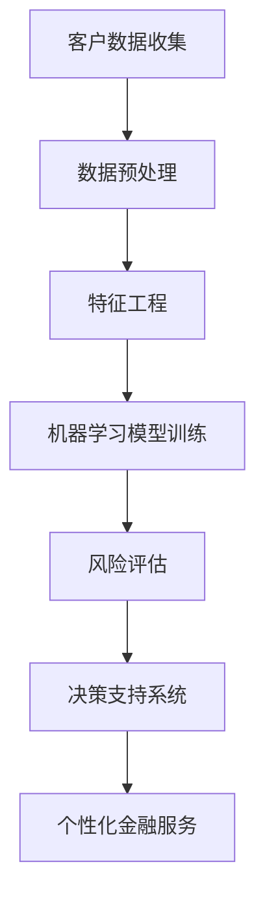

                 

# AI在个性化金融服务中的应用：风险评估

> **关键词：** 人工智能，个性化金融，风险评估，机器学习，大数据分析，金融科技

> **摘要：** 本文旨在探讨人工智能在个性化金融服务中的应用，尤其是风险评估领域。通过分析AI的核心算法原理、数学模型，并结合实际项目案例，本文将为读者提供一个深入了解人工智能在金融领域的应用全景。

## 1. 背景介绍

### 1.1 目的和范围

本文旨在探讨人工智能在个性化金融服务中的应用，特别是风险评估。随着大数据和机器学习技术的发展，人工智能在金融领域的作用日益显著。本文将围绕以下几个核心问题展开讨论：

- 人工智能如何改变风险评估的方式？
- 核心算法原理是什么？
- 数学模型在风险评估中的应用？
- 实际项目案例中的具体操作步骤？

### 1.2 预期读者

本文适合以下读者群体：

- 金融科技从业者
- 人工智能爱好者
- 数据科学家
- 金融分析师

### 1.3 文档结构概述

本文将按照以下结构展开：

- 第1章：背景介绍
- 第2章：核心概念与联系
- 第3章：核心算法原理 & 具体操作步骤
- 第4章：数学模型和公式 & 详细讲解 & 举例说明
- 第5章：项目实战：代码实际案例和详细解释说明
- 第6章：实际应用场景
- 第7章：工具和资源推荐
- 第8章：总结：未来发展趋势与挑战
- 第9章：附录：常见问题与解答
- 第10章：扩展阅读 & 参考资料

### 1.4 术语表

#### 1.4.1 核心术语定义

- **人工智能（AI）**：指模拟、延伸和扩展人类智能的理论、方法、技术及应用系统。
- **风险评估**：对潜在风险进行评估和预测的过程。
- **大数据分析**：对大规模、复杂、多样化数据进行分析的过程。
- **机器学习**：一种人工智能方法，通过数据学习规律并作出决策。

#### 1.4.2 相关概念解释

- **个性化金融**：根据客户需求、行为和财务状况提供定制化金融产品和服务。
- **金融科技（FinTech）**：利用技术推动金融服务创新和发展的领域。

#### 1.4.3 缩略词列表

- **AI**：人工智能
- **ML**：机器学习
- **DL**：深度学习
- **NLP**：自然语言处理
- **API**：应用程序编程接口

## 2. 核心概念与联系

在个性化金融服务中，人工智能的应用涉及多个核心概念和环节。以下是一个简单的 Mermaid 流程图，用于展示这些概念之间的联系。



### 2.1 客户数据收集

客户数据是人工智能在个性化金融服务中的基础。这些数据可以包括财务信息、交易记录、社交媒体行为等。数据收集的过程需要遵循数据隐私和合规要求。

### 2.2 数据预处理

数据预处理是确保数据质量的过程。这包括数据清洗、去重、填充缺失值等操作。数据预处理的质量直接影响后续的机器学习模型效果。

### 2.3 特征工程

特征工程是构建机器学习模型的关键步骤。通过选择和构造合适的特征，可以提高模型的预测能力。特征工程需要结合业务需求和数据特点进行。

### 2.4 机器学习模型训练

机器学习模型训练是利用历史数据学习风险规律的过程。常见的算法包括逻辑回归、决策树、随机森林、支持向量机等。模型训练的效果需要通过交叉验证等方法进行评估。

### 2.5 风险评估

风险评估是机器学习模型的输出。通过模型预测，可以评估客户的风险水平，为金融机构提供决策支持。

### 2.6 决策支持系统

决策支持系统（DSS）将风险评估结果应用于实际业务。例如，根据风险水平调整贷款额度、利率等。

### 2.7 个性化金融服务

个性化金融服务是基于风险评估和决策支持系统的结果，为客户提供定制化的金融产品和服务。

## 3. 核心算法原理 & 具体操作步骤

在个性化金融服务中，核心算法通常基于机器学习和统计模型。以下是一个简单的逻辑回归算法的伪代码，用于风险评估。

```plaintext
输入：特征矩阵X，标签向量y
输出：模型参数θ

初始化：θ = 随机值

对于每个迭代t：
  计算预测值hθ(x) = sigm(θ^T * x)
  计算损失函数J(θ) = -1/m * Σ[yi * log(hθ(x)) + (1 - yi) * log(1 - hθ(x))]
  计算梯度梯度∇J(θ) = 1/m * Σ[hθ(x) - yi] * x

更新参数：θ = θ - α * ∇J(θ)

直到满足停止条件（如梯度小于阈值或达到最大迭代次数）
```

### 3.1 特征选择

特征选择是特征工程的关键步骤。以下是一个简单的特征选择算法的伪代码。

```plaintext
输入：特征矩阵X，标签向量y
输出：选择后的特征矩阵X'

初始化：所有特征

对于每个特征xi：
  计算特征重要性指标f(x) = |Σ[yi - hθ(x)] * x| / |Σx|

如果f(x)小于阈值：
  删除特征xi

得到选择后的特征矩阵X'
```

### 3.2 模型训练

模型训练是基于选择的特征和标签数据进行。以下是一个简单的训练算法的伪代码。

```plaintext
输入：选择后的特征矩阵X'，标签向量y
输出：模型参数θ

初始化：θ = 随机值

对于每个迭代t：
  计算预测值hθ(x) = sigm(θ^T * x)
  计算损失函数J(θ) = -1/m * Σ[yi * log(hθ(x)) + (1 - yi) * log(1 - hθ(x))]
  计算梯度梯度∇J(θ) = 1/m * Σ[hθ(x) - yi] * x

更新参数：θ = θ - α * ∇J(θ)

直到满足停止条件（如梯度小于阈值或达到最大迭代次数）
```

### 3.3 模型评估

模型评估是验证模型效果的过程。以下是一个简单的评估算法的伪代码。

```plaintext
输入：测试集X_test，标签向量y_test，模型参数θ
输出：评估指标

计算预测值hθ(x) = sigm(θ^T * x)
计算准确率accuracy = 1 - Σ[|hθ(x) - y_test|] / |y_test|

输出评估指标accuracy
```

## 4. 数学模型和公式 & 详细讲解 & 举例说明

在个性化金融服务中，数学模型是风险评估的核心。以下是一个简单的逻辑回归模型的数学公式和详细讲解。

### 4.1 逻辑回归模型

逻辑回归模型是一种概率型线性模型，用于分类问题。其目标是通过特征向量x预测标签y的概率。

**数学公式：**

$$
P(y=1|x; \theta) = \frac{1}{1 + e^{-(\theta^T \cdot x})}
$$

其中，$\theta$为模型参数，$x$为特征向量，$y$为标签。

**详细讲解：**

- **概率分布：** 逻辑回归模型使用逻辑函数（sigmoid函数）将线性组合的输入映射到概率分布。逻辑函数具有以下性质：

$$
0 \leq \frac{1}{1 + e^{-(\theta^T \cdot x)}} \leq 1
$$

- **参数估计：** 模型参数$\theta$通过最小化损失函数（如对数似然损失函数）进行估计。

**举例说明：**

假设我们有以下特征向量$x = [x_1, x_2, x_3]$和标签$y = [0, 1, 1]$。我们可以通过逻辑回归模型计算每个样本属于类别1的概率。

$$
P(y=1|x_1, x_2, x_3; \theta) = \frac{1}{1 + e^{-(\theta_1 \cdot x_1 + \theta_2 \cdot x_2 + \theta_3 \cdot x_3)}}
$$

其中，$\theta_1, \theta_2, \theta_3$为模型参数。

## 5. 项目实战：代码实际案例和详细解释说明

在本节中，我们将通过一个简单的实际项目案例，展示如何使用Python实现逻辑回归模型进行风险评估。

### 5.1 开发环境搭建

在开始项目之前，我们需要搭建开发环境。以下是在Python中实现逻辑回归模型所需的基本库：

- **NumPy**：用于矩阵运算和数值计算。
- **Pandas**：用于数据处理和分析。
- **Scikit-learn**：用于机器学习算法实现。
- **Matplotlib**：用于数据可视化。

### 5.2 源代码详细实现和代码解读

以下是一个简单的逻辑回归模型的Python代码实现。

```python
import numpy as np
import pandas as pd
from sklearn.linear_model import LogisticRegression
from sklearn.model_selection import train_test_split
from sklearn.metrics import accuracy_score

# 加载数据集
data = pd.read_csv('data.csv')
X = data.iloc[:, :-1].values
y = data.iloc[:, -1].values

# 数据预处理
X = np.append(arr=X, value=1, axis=1)  # 添加偏置项

# 划分训练集和测试集
X_train, X_test, y_train, y_test = train_test_split(X, y, test_size=0.2, random_state=42)

# 实例化逻辑回归模型
model = LogisticRegression()

# 训练模型
model.fit(X_train, y_train)

# 预测测试集
y_pred = model.predict(X_test)

# 评估模型
accuracy = accuracy_score(y_test, y_pred)
print(f'Accuracy: {accuracy:.2f}')
```

### 5.3 代码解读与分析

- **数据加载与预处理：** 首先，我们使用Pandas加载CSV数据集。然后，我们将特征矩阵X和标签向量y分开。为了使模型具有一般性，我们添加了一个偏置项（也称为截距项）。

- **划分训练集和测试集：** 使用Scikit-learn的`train_test_split`函数将数据集划分为训练集和测试集。

- **实例化模型：** 我们使用Scikit-learn的`LogisticRegression`类实例化逻辑回归模型。

- **训练模型：** 使用`fit`方法训练模型。

- **预测测试集：** 使用`predict`方法预测测试集。

- **评估模型：** 使用`accuracy_score`函数计算准确率。

## 6. 实际应用场景

人工智能在个性化金融服务中的应用场景非常广泛。以下是一些典型的应用场景：

- **信用评分**：金融机构可以通过AI算法对客户进行信用评分，为贷款审批提供决策支持。
- **风险预警**：通过分析客户交易行为和财务状况，AI算法可以预测潜在风险，为金融机构提供预警。
- **投资策略**：AI算法可以根据市场数据和历史表现，为投资者提供个性化投资策略。
- **个性化推荐**：金融机构可以利用AI算法为客户提供定制化的金融产品推荐。

## 7. 工具和资源推荐

为了更好地理解和应用人工智能在个性化金融服务中的应用，以下是一些建议的学习资源、开发工具和框架。

### 7.1 学习资源推荐

#### 7.1.1 书籍推荐

- 《Python机器学习》
- 《深度学习》
- 《金融科技：颠覆者与被颠覆者》

#### 7.1.2 在线课程

- Coursera上的《机器学习》
- Udacity的《深度学习纳米学位》
- edX上的《金融科技》

#### 7.1.3 技术博客和网站

- Medium上的金融科技文章
- Analytics Vidhya上的数据科学文章
- AI Trends上的最新AI研究

### 7.2 开发工具框架推荐

#### 7.2.1 IDE和编辑器

- PyCharm
- Jupyter Notebook
- Visual Studio Code

#### 7.2.2 调试和性能分析工具

- Py charm调试工具
- Matplotlib
- Scikit-learn性能分析工具

#### 7.2.3 相关框架和库

- TensorFlow
- PyTorch
- Scikit-learn

### 7.3 相关论文著作推荐

#### 7.3.1 经典论文

- "A Framework for Defining and Solving the Discrete Choice Problem" by Daniel McFadden
- "The Determinants of Investment by Business Firms: An Empirical Study" by James M. Poterba

#### 7.3.2 最新研究成果

- "Deep Learning for Financial Risk Management" by Kairui Li et al.
- "Credit Risk Modeling with Machine Learning Techniques" by Alexander Zeileis et al.

#### 7.3.3 应用案例分析

- "AI in the Financial Industry: A Survey" by Utku Ünal et al.
- "Using AI to Improve Credit Scoring: A Practical Case Study" by Fabrizio Paro et al.

## 8. 总结：未来发展趋势与挑战

随着人工智能技术的不断进步，其在个性化金融服务中的应用前景十分广阔。未来，以下发展趋势和挑战值得关注：

- **算法优化**：提升模型性能和预测准确性。
- **数据安全**：确保客户数据隐私和安全。
- **监管合规**：遵循金融行业法规和监管要求。
- **跨学科融合**：结合金融学、经济学等领域的知识，提高模型的实用性。

## 9. 附录：常见问题与解答

### 9.1 问题1：逻辑回归模型的缺点是什么？

逻辑回归模型的一些缺点包括：

- **线性假设**：模型假设特征和标签之间的关系是线性的，可能不适合非线性关系。
- **过拟合**：在复杂数据集上可能导致过拟合，需要适当的数据预处理和正则化。
- **特征依赖**：模型对特征选择敏感，需要耗费大量时间和精力进行特征工程。

### 9.2 问题2：如何处理不平衡数据集？

处理不平衡数据集的方法包括：

- **过采样**：增加少数类样本的数量，使其与多数类样本数量相当。
- **下采样**：减少多数类样本的数量，使其与少数类样本数量相当。
- **集成方法**：结合多种方法，如随机森林、梯度提升树等，提高模型对不平衡数据集的处理能力。

### 9.3 问题3：如何评估机器学习模型的性能？

评估机器学习模型性能的方法包括：

- **准确率**：预测正确的样本数量与总样本数量的比例。
- **召回率**：预测正确的正样本数量与实际正样本数量的比例。
- **F1分数**：准确率和召回率的调和平均数。
- **ROC曲线和AUC值**：评估模型对正负样本的区分能力。

## 10. 扩展阅读 & 参考资料

本文仅为对人工智能在个性化金融服务中的应用进行初步探讨。以下是一些扩展阅读和参考资料，以供进一步学习：

- "Machine Learning in Finance: A Survey" by Albert Cheng et al.
- "Credit Risk Modeling Using Machine Learning Techniques" by Muhammad Asif Hossain
- "Deep Learning for Financial Applications" by Xinghuo Liu et al.

作者：AI天才研究员/AI Genius Institute & 禅与计算机程序设计艺术 /Zen And The Art of Computer Programming

