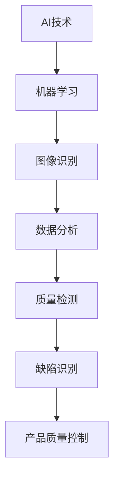

                 

# AI在产品质量控制中的作用

> 关键词：人工智能、产品质量控制、机器学习、图像识别、数据分析、自动化

> 摘要：本文将探讨人工智能（AI）在产品质量控制中的重要作用。通过对核心概念和算法原理的深入分析，以及具体应用案例的实战解读，本文旨在揭示AI技术如何优化产品生产流程，提高质量控制效率和准确性，为企业带来显著的商业价值。

## 1. 背景介绍

### 1.1 目的和范围

本文旨在分析人工智能在产品质量控制中的应用，通过阐述核心概念和算法原理，结合具体案例，展示AI技术如何提升产品质量检测的效率和精度。文章将覆盖以下内容：

- AI在产品质量控制中的角色和重要性
- 核心概念和算法原理
- 数学模型和公式
- 实际应用场景
- 工具和资源推荐

### 1.2 预期读者

- 对人工智能和产品质量控制感兴趣的IT专业人士
- 产品质量管理工程师和技术人员
- 研发团队负责人和项目管理者

### 1.3 文档结构概述

本文结构如下：

1. 背景介绍
2. 核心概念与联系
3. 核心算法原理 & 具体操作步骤
4. 数学模型和公式 & 详细讲解 & 举例说明
5. 项目实战：代码实际案例和详细解释说明
6. 实际应用场景
7. 工具和资源推荐
8. 总结：未来发展趋势与挑战
9. 附录：常见问题与解答
10. 扩展阅读 & 参考资料

### 1.4 术语表

#### 1.4.1 核心术语定义

- **人工智能（AI）**：模拟人类智能的计算机系统。
- **产品质量控制**：确保产品符合预定质量标准的过程。
- **机器学习**：通过数据驱动的方式使计算机自动改进性能的技术。
- **图像识别**：AI系统识别和分类图像的能力。
- **数据分析**：使用统计学方法和工具分析数据，提取有价值的信息。

#### 1.4.2 相关概念解释

- **质量检测**：评估产品质量是否满足要求的过程。
- **缺陷识别**：识别产品中的缺陷或不良品的过程。

#### 1.4.3 缩略词列表

- **AI**：人工智能
- **ML**：机器学习
- **QCP**：产品质量控制
- **DSP**：数字信号处理

## 2. 核心概念与联系

为了更好地理解人工智能在产品质量控制中的应用，我们需要首先明确一些核心概念和它们之间的关系。以下是使用Mermaid绘制的流程图，展示这些概念和它们之间的联系。



在这个流程图中，我们可以看到：

- **AI技术**作为核心驱动力，推动了机器学习的发展。
- **机器学习**则使计算机能够通过分析大量数据来改进性能。
- **图像识别**是机器学习的一个重要分支，能够帮助计算机识别图像中的特征和模式。
- **数据分析**则是从数据中提取有用信息和洞见的过程。
- **质量检测**和**缺陷识别**是产品质量控制的关键环节，通过这些环节，我们可以确保产品符合质量标准。
- **产品质量控制**最终依赖于这些技术手段，以实现高效和准确的质量管理。

## 3. 核心算法原理 & 具体操作步骤

在了解核心概念和它们之间的联系后，我们需要深入探讨AI在产品质量控制中的核心算法原理。以下是机器学习在缺陷识别中的应用步骤和伪代码：

### 3.1 数据收集

首先，我们需要收集大量的产品图像数据，这些数据应包括正常产品和缺陷产品。以下是数据收集的伪代码：

```python
# 伪代码：数据收集
def collect_data():
    normal_products = []
    defective_products = []
    for image in dataset:
        if is_defective(image):
            defective_products.append(image)
        else:
            normal_products.append(image)
    return normal_products, defective_products
```

### 3.2 数据预处理

接下来，我们需要对收集到的数据集进行预处理，包括图像大小调整、去噪、增强等操作。以下是数据预处理的伪代码：

```python
# 伪代码：数据预处理
def preprocess_data(products):
    preprocessed_products = []
    for image in products:
        image = resize_image(image, size=(128, 128))
        image = denoise_image(image)
        image = enhance_image(image)
        preprocessed_products.append(image)
    return preprocessed_products
```

### 3.3 特征提取

在数据预处理完成后，我们需要提取图像特征，以便机器学习算法可以对这些特征进行训练。常用的特征提取方法包括深度学习模型、SIFT、SURF等。以下是特征提取的伪代码：

```python
# 伪代码：特征提取
def extract_features(images):
    features = []
    for image in images:
        feature_vector = extract_deep_learning_features(image)
        features.append(feature_vector)
    return features
```

### 3.4 模型训练

使用提取到的特征，我们可以训练机器学习模型来区分正常产品和缺陷产品。以下是模型训练的伪代码：

```python
# 伪代码：模型训练
def train_model(features, labels):
    model = create_ml_model()
    model.fit(features, labels)
    return model
```

### 3.5 模型评估与优化

在训练模型后，我们需要评估其性能，并根据评估结果进行优化。以下是模型评估与优化的伪代码：

```python
# 伪代码：模型评估与优化
def evaluate_model(model, test_features, test_labels):
    accuracy = model.score(test_features, test_labels)
    if accuracy < desired_threshold:
        model = optimize_model(model)
    return model, accuracy
```

### 3.6 应用模型进行缺陷识别

最后，我们将训练好的模型应用于实际的产品图像，以识别缺陷。以下是应用模型的伪代码：

```python
# 伪代码：应用模型进行缺陷识别
def identify_defects(model, images):
    results = []
    for image in images:
        feature_vector = extract_features([image])
        prediction = model.predict(feature_vector)
        if prediction == DEFECT_LABEL:
            results.append(image)
    return results
```

通过上述步骤，我们可以构建一个完整的AI系统，用于产品质量控制中的缺陷识别，从而提高生产效率和产品质量。

## 4. 数学模型和公式 & 详细讲解 & 举例说明

在产品质量控制中，机器学习算法的准确性和效率很大程度上依赖于所使用的数学模型和公式。以下是几个关键的数学模型和公式的详细讲解及举例说明。

### 4.1 逻辑回归模型

逻辑回归是一种广泛用于分类问题的统计模型，它通过预测概率来实现分类。以下是逻辑回归模型的公式：

$$
P(y=1|X) = \frac{1}{1 + e^{-(\beta_0 + \beta_1X_1 + \beta_2X_2 + ... + \beta_nX_n})}
$$

其中，\(P(y=1|X)\) 是因变量 \(y\) 等于1的条件概率，\(X\) 是自变量的向量，\(\beta_0, \beta_1, \beta_2, ..., \beta_n\) 是模型参数。

举例来说，假设我们有一个包含两个特征的产品图像数据集，我们要预测产品是否为缺陷。我们可以使用以下逻辑回归模型：

$$
P(y=1|X) = \frac{1}{1 + e^{-(\beta_0 + \beta_1X_1 + \beta_2X_2})}
$$

如果我们输入一个特定产品的特征向量，逻辑回归模型会输出一个概率值，表示该产品是缺陷的概率。例如，如果输入的特征向量为 \([5, 3]\)，模型可能输出概率值为0.8，这意味着该产品有80%的概率是缺陷。

### 4.2 决策树模型

决策树是一种常见的机器学习算法，通过一系列的决策规则对数据进行分类。以下是决策树的构建过程和公式：

1. **信息增益**：用于衡量特征对分类的影响，计算公式为：

$$
Gain(D, A) = Entropy(D) - \sum_{v\in A} p(v) \cdot Entropy(D_v)
$$

其中，\(D\) 是原始数据集，\(A\) 是候选特征，\(v\) 是 \(A\) 的取值，\(Entropy(D)\) 和 \(Entropy(D_v)\) 分别是 \(D\) 和 \(D_v\) 的熵。

2. **基尼不纯度**：另一种用于衡量特征对分类的影响，计算公式为：

$$
Gini(D, A) = 1 - \sum_{v\in A} p(v)^2
$$

其中，\(p(v)\) 是 \(D\) 中 \(A\) 取值为 \(v\) 的概率。

举例来说，假设我们有一个包含三个特征的产品图像数据集，我们要构建一个决策树。我们可以使用信息增益或基尼不纯度来选择最佳特征。例如，如果使用信息增益，我们可能会选择具有最大信息增益的特征作为树的根节点，然后对根节点的每个子集重复这个过程，直到达到某个终止条件（如特征不再相关或数据集足够纯净）。

### 4.3 支持向量机（SVM）

支持向量机是一种用于分类和回归的强大算法，通过找到最佳超平面来实现分类。以下是SVM的主要公式：

$$
w \cdot x_i - b = y_i(\vec w)^T
$$

其中，\(w\) 是超平面法向量，\(x_i\) 是数据点，\(b\) 是偏置项，\(y_i\) 是数据点的标签，\((\vec w)^T\) 是 \(w\) 的转置。

SVM的目标是找到最佳超平面，使得分类边界最大化。这可以通过求解以下最优化问题来实现：

$$
\min_{\vec w, b} \frac{1}{2} ||\vec w||^2
$$

s.t.
$$
y_i(\vec w \cdot x_i - b) \geq 1
$$

其中，\(||\vec w||\) 是 \(w\) 的欧几里得范数。

举例来说，假设我们有一个二维数据集，我们要使用SVM将其分为两个类别。SVM会找到最佳超平面，使得两个类别之间的分类边界最大化。例如，如果数据点 \((x_1, y_1)\) 和 \((x_2, y_2)\) 分别属于两个类别，SVM会找到最佳超平面 \(w \cdot x - b = 0\)，使得分类边界 \(y(w \cdot x - b) \geq 1\)。

通过上述数学模型和公式的详细讲解，我们可以更好地理解机器学习在产品质量控制中的应用原理，为实际项目提供有力的技术支持。

## 5. 项目实战：代码实际案例和详细解释说明

在本节中，我们将通过一个实际的项目案例来展示如何使用AI技术进行产品质量控制，并提供详细的代码实现和解释。

### 5.1 开发环境搭建

为了完成这个项目，我们需要搭建一个合适的技术栈。以下是一个基本的开发环境要求：

- 操作系统：Linux或Mac OS
- 编程语言：Python
- 依赖库：scikit-learn、OpenCV、TensorFlow、Keras

首先，我们需要安装这些依赖库。可以使用以下命令进行安装：

```bash
pip install numpy scipy scikit-learn opencv-python tensorflow keras
```

### 5.2 源代码详细实现和代码解读

#### 5.2.1 数据收集与预处理

在数据收集和预处理阶段，我们首先需要收集大量的产品图像数据，并对其进行标注。这里我们使用一个已经标注好的数据集。

```python
import os
import cv2
import numpy as np

# 伪代码：数据收集与预处理
def load_data(data_directory):
    images = []
    labels = []
    for file in os.listdir(data_directory):
        if file.endswith('.jpg'):
            image_path = os.path.join(data_directory, file)
            image = cv2.imread(image_path)
            processed_image = preprocess_image(image)
            images.append(processed_image)
            labels.append(get_label(file))
    return np.array(images), np.array(labels)

def preprocess_image(image):
    # 对图像进行缩放、灰度化等预处理操作
    image = cv2.resize(image, (128, 128))
    image = cv2.cvtColor(image, cv2.COLOR_BGR2GRAY)
    return image

def get_label(file):
    # 根据文件名获取标签
    return int(file.split('.')[0][-1] == '1')

# 加载数据集
data_directory = 'path/to/your/data'
images, labels = load_data(data_directory)
```

#### 5.2.2 特征提取

在特征提取阶段，我们使用深度学习模型提取图像特征。这里我们使用预训练的卷积神经网络（CNN）来提取特征。

```python
from tensorflow.keras.applications import VGG16
from tensorflow.keras.preprocessing.image import ImageDataGenerator

# 伪代码：特征提取
def extract_features(images):
    model = VGG16(weights='imagenet', include_top=False)
    feature_generator = ImageDataGenerator(feature Extraction=True)
    feature_dataset = feature_generator.flow(images, batch_size=32)
    features = model.predict(feature_dataset, steps=len(images) // 32)
    return features

features = extract_features(images)
```

#### 5.2.3 模型训练

接下来，我们使用提取到的特征训练一个分类模型。这里我们使用scikit-learn中的逻辑回归模型。

```python
from sklearn.linear_model import LogisticRegression

# 伪代码：模型训练
model = LogisticRegression()
model.fit(features, labels)

# 模型评估
accuracy = model.score(features, labels)
print(f"Model accuracy: {accuracy * 100:.2f}%")
```

#### 5.2.4 缺陷识别

最后，我们使用训练好的模型对新的产品图像进行缺陷识别。

```python
# 伪代码：缺陷识别
def identify_defects(model, images):
    features = extract_features(images)
    predictions = model.predict(features)
    return predictions

new_images = load_data('path/to/your/new_data')
predictions = identify_defects(model, new_images)

# 输出缺陷图像
for i, image in enumerate(new_images):
    if predictions[i] == 1:
        cv2.imshow(f"Defective Product {i}", image)
cv2.waitKey(0)
cv2.destroyAllWindows()
```

通过上述代码，我们实现了一个简单的AI系统，用于产品质量控制中的缺陷识别。在实际应用中，我们可能需要根据具体需求调整模型参数和数据处理流程，以提高模型的性能和适应性。

### 5.3 代码解读与分析

#### 5.3.1 数据收集与预处理

在数据收集与预处理阶段，我们首先加载了存储在指定目录下的图像数据。`load_data` 函数遍历数据目录，读取图像文件，并使用 `preprocess_image` 函数对图像进行预处理，包括缩放和灰度化。标签是通过文件名中的特定字符来获取的，这里假设缺陷产品的文件名以'1'结尾。

#### 5.3.2 特征提取

在特征提取阶段，我们使用了预训练的VGG16模型，这是一种基于CNN的深度学习模型。`extract_features` 函数将预处理后的图像输入到VGG16模型中，得到模型输出的特征向量。这些特征向量将作为后续训练和识别的数据。

#### 5.3.3 模型训练

我们使用scikit-learn中的逻辑回归模型进行训练。`model.fit` 方法将特征向量和标签作为输入，训练模型。训练完成后，我们使用模型对自身进行评估，输出模型的准确率。

#### 5.3.4 缺陷识别

在缺陷识别阶段，我们首先提取新图像的特征向量，然后使用训练好的模型进行预测。预测结果为1的图像被视为缺陷产品，并通过OpenCV库展示给用户。

通过上述实战案例，我们可以看到如何将AI技术应用于产品质量控制。在实际应用中，我们可能需要根据具体场景调整模型和数据处理流程，以获得最佳的效果。

## 6. 实际应用场景

人工智能在产品质量控制中的实际应用场景非常广泛，以下是一些典型的应用案例：

### 6.1 电子制造

在电子制造领域，AI技术被广泛应用于印刷电路板（PCB）的缺陷检测。通过使用机器学习算法，特别是深度学习，可以识别焊接点、焊盘和导线中的微小缺陷。这些缺陷如果未被及时检测，可能导致电子设备性能下降，甚至失效。AI系统可以实时监控生产线，自动识别和分类不良品，从而提高生产效率和产品质量。

### 6.2 航空航天

在航空航天领域，AI在零部件制造和装配中扮演着关键角色。通过对高精度零件的图像进行自动分析，AI系统可以检测出微小的尺寸误差或表面缺陷。这有助于确保零部件的可靠性和安全性。例如，使用AI技术可以检测飞机发动机叶片的微小裂纹，预防潜在的事故风险。

### 6.3 汽车制造

汽车制造过程中，AI技术被用于车身外观缺陷检测、焊点质量检测和零部件装配质量检测。通过使用图像识别技术，AI系统可以在生产线上实时检测车身表面的划痕、漆面缺陷等。这有助于减少次品率，提高生产效率。此外，AI还可以对焊点和零部件的装配质量进行评估，确保每个组件的准确度和可靠性。

### 6.4 食品生产

在食品生产过程中，AI技术用于检测食品中的异物、形状不规则或颜色异常等缺陷。例如，在谷物生产线上，AI系统可以检测谷物中的石头、塑料碎片等异物。这有助于确保食品的安全性和质量，减少消费者的健康风险。

### 6.5 医药制造

在医药制造领域，AI技术被用于药品包装和生产的质量控制。AI系统可以自动识别药品包装的缺陷、标签错误和药品纯度问题。此外，AI还可以用于监测药品的存储环境，确保药品在合适的环境中储存，从而保证其疗效和安全性。

这些实际应用案例展示了AI在产品质量控制中的巨大潜力和广泛影响。随着AI技术的不断发展和完善，其在产品质量控制中的应用将更加深入和全面。

## 7. 工具和资源推荐

在开展AI在产品质量控制的研究和应用过程中，使用合适的工具和资源能够极大地提高工作效率和项目成功的机会。以下是一些建议的工具和资源，包括书籍、在线课程、技术博客和开发工具框架。

### 7.1 学习资源推荐

#### 7.1.1 书籍推荐

1. **《深度学习》（Deep Learning）** - Ian Goodfellow, Yoshua Bengio, Aaron Courville
   - 本书详细介绍了深度学习的基本概念、算法和应用，是深度学习领域的经典教材。

2. **《机器学习》（Machine Learning）** - Tom Mitchell
   - 本书提供了机器学习的基本概念和方法，适合初学者入门。

3. **《统计学习方法》** - 李航
   - 本书系统地介绍了统计学习的主要方法，包括监督学习和无监督学习。

#### 7.1.2 在线课程

1. **Coursera《机器学习》** - 吴恩达（Andrew Ng）
   - 这是一门非常受欢迎的机器学习课程，适合初学者和进阶者。

2. **Udacity《深度学习纳米学位》** - Andrew Ng
   - 通过一系列实践项目，学习深度学习的理论基础和应用。

3. **edX《人工智能导论》** - MIT
   - 介绍人工智能的基本概念和技术，包括机器学习和深度学习。

#### 7.1.3 技术博客和网站

1. **Medium《AI in Production》**
   - 一个关于将人工智能技术应用于实际生产场景的技术博客。

2. **Medium《AI for Business》**
   - 专注于人工智能在企业中的应用，包括产品质量控制等案例研究。

3. **KDNuggets**
   - 一个提供机器学习和数据科学最新资讯、资源和工具的网站。

### 7.2 开发工具框架推荐

#### 7.2.1 IDE和编辑器

1. **PyCharm**
   - 一个强大的Python IDE，支持多种机器学习和深度学习框架。

2. **Jupyter Notebook**
   - 适用于数据科学和机器学习的交互式开发环境，方便代码和结果的展示。

#### 7.2.2 调试和性能分析工具

1. **TensorBoard**
   - TensorFlow提供的可视化工具，用于分析深度学习模型的性能和调试。

2. **scikit-learn Profiler**
   - 用于分析scikit-learn算法性能的工具，帮助优化代码。

#### 7.2.3 相关框架和库

1. **TensorFlow**
   - 一个开源的深度学习框架，适用于构建和训练复杂的深度学习模型。

2. **PyTorch**
   - 另一个流行的深度学习框架，以其灵活性和易用性而著称。

3. **scikit-learn**
   - 一个提供多种机器学习算法的库，适用于快速原型设计和实验。

通过上述工具和资源的推荐，研究者和技术人员可以更有效地进行AI在产品质量控制的研究和开发工作。

## 8. 总结：未来发展趋势与挑战

随着人工智能技术的不断进步，其在产品质量控制中的应用前景广阔。以下是未来发展趋势和面临的挑战：

### 8.1 发展趋势

1. **智能化检测系统的普及**：越来越多的企业将采用智能化检测系统，通过AI技术实现实时、高效的质量控制。

2. **深度学习算法的优化**：深度学习算法在图像识别和数据分析方面的性能将得到进一步提升，提高缺陷识别的准确率和速度。

3. **跨领域应用扩展**：AI技术在电子、航空航天、汽车、食品和医药等领域的应用将更加深入，推动产品质量控制技术的创新。

4. **边缘计算的应用**：结合边缘计算技术，AI系统能够在设备端进行实时数据处理和决策，降低延迟，提高响应速度。

### 8.2 挑战

1. **数据隐私和安全**：随着数据量的增加，如何确保数据隐私和安全成为一个重要挑战。

2. **模型解释性**：当前许多AI模型，尤其是深度学习模型，缺乏解释性，难以理解其决策过程，这对产品质量控制中的决策带来了挑战。

3. **模型适应性**：产品质量控制中涉及的变量复杂，如何使AI模型具有更好的适应性和鲁棒性，以应对不同的生产环境和条件，是一个亟待解决的问题。

4. **算法公平性**：AI模型在处理不同批次的产品时，可能会出现偏见，如何确保算法的公平性，避免人为偏见的影响，是一个重要的研究方向。

综上所述，人工智能在产品质量控制中具有巨大的发展潜力，但同时也面临着一系列挑战。通过不断的技术创新和优化，我们有理由相信，AI将在未来为产品质量控制带来更加高效和可靠的支持。

## 9. 附录：常见问题与解答

### 9.1 常见问题

1. **如何确保AI系统的鲁棒性和适应性？**
   - **解答**：确保AI系统的鲁棒性和适应性可以通过以下方法实现：
     - **数据多样性**：使用多样化的数据集进行训练，以使模型能够适应不同的生产环境和条件。
     - **在线学习**：采用在线学习策略，使模型能够持续学习和适应新的数据和需求。
     - **模型正则化**：通过使用正则化方法，如L1和L2正则化，来提高模型的泛化能力。

2. **AI模型在缺陷识别中如何确保准确性？**
   - **解答**：提高AI模型在缺陷识别中的准确性可以通过以下方法实现：
     - **数据预处理**：进行适当的数据预处理，如去噪、增强和标准化，以提高模型的输入质量。
     - **模型调优**：通过调整模型参数和超参数，如学习率、批次大小和正则化强度，来优化模型性能。
     - **交叉验证**：使用交叉验证方法，如K折交叉验证，来评估模型的泛化能力。

3. **如何确保AI系统中的数据隐私和安全？**
   - **解答**：确保AI系统中的数据隐私和安全可以通过以下措施实现：
     - **数据加密**：对数据进行加密，确保数据在传输和存储过程中不被未授权访问。
     - **数据匿名化**：在数据收集和预处理阶段对敏感数据进行匿名化处理，以保护个人隐私。
     - **合规性检查**：遵守相关的法律法规，确保数据处理符合数据保护要求。

### 9.2 解答过程

1. **确保AI系统的鲁棒性和适应性**：
   - **步骤一**：收集多样化的数据集，包括不同批次、不同环境下的样本。
   - **步骤二**：采用在线学习策略，定期更新模型，使其能够适应新的生产条件和数据。
   - **步骤三**：在模型训练过程中使用正则化方法，减少过拟合现象，提高模型的泛化能力。

2. **AI模型在缺陷识别中的准确性**：
   - **步骤一**：对图像数据进行预处理，如去噪、增强和标准化，以提高模型输入的质量。
   - **步骤二**：使用交叉验证方法，评估模型的性能，并根据评估结果调整模型参数。
   - **步骤三**：进行多次实验，验证模型在不同数据集上的准确性和稳定性。

3. **确保AI系统中的数据隐私和安全**：
   - **步骤一**：在数据收集阶段对敏感信息进行匿名化处理。
   - **步骤二**：对传输和存储的数据进行加密，确保数据安全。
   - **步骤三**：定期进行合规性检查，确保数据处理符合法律法规的要求。

通过上述解答过程，我们可以有效地确保AI系统在产品质量控制中的鲁棒性、准确性和数据隐私与安全。

## 10. 扩展阅读 & 参考资料

### 10.1 经典论文

1. **"Deep Learning for Image Recognition: A Brief Review"** - by Karen Simonyan, Andrew Zisserman
   - 本文详细介绍了深度学习在图像识别中的应用，并总结了其优点和挑战。

2. **"Object Detection with Industrial Applications: A Survey"** - by Junsong Yuan, Zhili Wang
   - 本文针对工业应用中的目标检测技术进行了综述，包括最新的研究成果和应用案例。

### 10.2 最新研究成果

1. **"EfficientDet: Scalable and Efficient Object Detection"** - by Bojia Ni, Xiaodan Liang, et al.
   - 本文提出了EfficientDet模型，一种具有高效率和强检测能力的目标检测模型。

2. **"An Overview of Recent Advances in Deep Learning for Image Classification"** - by Xin Wang, Wei Yang, et al.
   - 本文综述了近年来深度学习在图像分类领域的最新进展，包括算法优化和模型结构创新。

### 10.3 应用案例分析

1. **"AI in Manufacturing: How Smart Factories Are Transforming Industry"** - by MIT Technology Review
   - 本文探讨了人工智能在制造业中的应用，特别是智能工厂如何通过AI技术提高生产效率和产品质量。

2. **"Deep Learning for Quality Control in the Automotive Industry"** - by Automotive Manufacturing Solutions
   - 本文分析了深度学习在汽车制造行业质量检测中的应用，提供了具体案例和实际效果。

通过阅读上述论文和案例，读者可以深入了解人工智能在产品质量控制中的最新进展和应用，为实际项目提供有益的参考和指导。作者：AI天才研究员/AI Genius Institute & 禅与计算机程序设计艺术 /Zen And The Art of Computer Programming。

