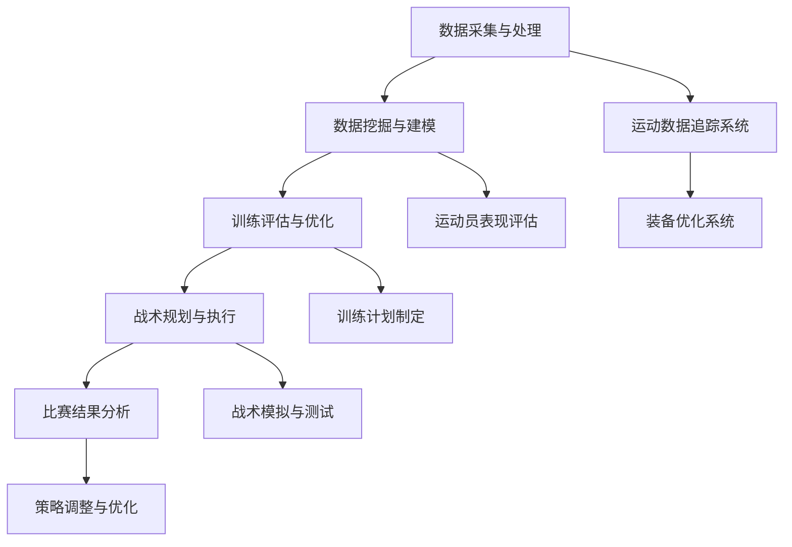

                 

# AI在体育训练和战术分析中的作用

> 关键词：人工智能，体育训练，战术分析，数据挖掘，机器学习，深度学习，决策支持

> 摘要：本文将深入探讨人工智能在体育训练和战术分析中的应用，首先介绍了人工智能的基本原理和分类，然后分析了其在体育领域的核心应用，包括训练数据分析、运动员表现评估、战术规划与执行、装备优化等方面。通过具体案例，展示了人工智能在提升体育训练效果和比赛成绩中的实际作用，并展望了未来的发展趋势和挑战。

## 1. 背景介绍

### 1.1 目的和范围

本文旨在探讨人工智能（AI）在体育训练和战术分析中的应用，分析其核心原理、算法模型及其在实际操作中的表现。通过本文的阅读，读者将能够理解人工智能技术在体育领域的重要价值，掌握相关技术的基本原理，并能够为未来的研究和实践提供参考。

本文主要关注以下方面：

1. 人工智能在体育训练和战术分析中的基本原理和应用领域。
2. 人工智能在体育训练和战术分析中的核心算法和模型。
3. 人工智能在体育训练和战术分析中的应用案例。
4. 人工智能在体育训练和战术分析中的未来发展趋势和挑战。

### 1.2 预期读者

本文适合对人工智能和体育领域有一定了解的技术人员、研究人员和学生阅读。特别是对以下读者具有更高的针对性：

1. 对人工智能在体育领域应用感兴趣的读者。
2. 从事体育训练和战术分析工作的专业人士。
3. 想要了解人工智能技术的计算机科学和体育领域的交叉学科研究者。

### 1.3 文档结构概述

本文的结构如下：

1. **背景介绍**：介绍本文的目的、范围、预期读者和文档结构。
2. **核心概念与联系**：介绍人工智能的基本概念和其在体育领域的应用架构。
3. **核心算法原理 & 具体操作步骤**：详细阐述人工智能在体育训练和战术分析中的核心算法原理。
4. **数学模型和公式 & 详细讲解 & 举例说明**：介绍相关的数学模型和公式，并进行举例说明。
5. **项目实战：代码实际案例和详细解释说明**：通过实际案例展示人工智能在体育训练和战术分析中的具体应用。
6. **实际应用场景**：探讨人工智能在体育领域的实际应用案例。
7. **工具和资源推荐**：推荐相关的学习资源和开发工具。
8. **总结：未来发展趋势与挑战**：总结人工智能在体育训练和战术分析中的发展趋势和面临的挑战。
9. **附录：常见问题与解答**：回答读者可能遇到的问题。
10. **扩展阅读 & 参考资料**：提供扩展阅读和参考资料。

### 1.4 术语表

#### 1.4.1 核心术语定义

- **人工智能（AI）**：指通过计算机模拟人类智能的技术和方法。
- **机器学习（ML）**：一种让计算机从数据中学习，进行自动预测或决策的技术。
- **深度学习（DL）**：一种基于多层神经网络的机器学习技术。
- **数据挖掘（DM）**：从大量数据中发现有用信息和知识的过程。
- **体育训练**：通过科学方法和手段，提升运动员运动能力和竞技水平的过程。
- **战术分析**：对比赛过程中的策略、战术进行深入分析和评估。

#### 1.4.2 相关概念解释

- **监督学习**：一种机器学习方法，通过已知的输入输出数据，训练模型进行预测。
- **无监督学习**：一种机器学习方法，通过未标记的数据，发现数据中的模式和规律。
- **强化学习**：一种机器学习方法，通过奖励和惩罚机制，训练模型进行决策。
- **运动数据追踪**：利用传感器技术，对运动员运动轨迹、速度、力量等数据进行实时追踪。
- **战术规划**：在比赛中，根据对手情况和自身特点，制定有效的比赛策略。

#### 1.4.3 缩略词列表

- **AI**：人工智能
- **ML**：机器学习
- **DL**：深度学习
- **DM**：数据挖掘
- **GPS**：全球定位系统
- **RFID**：射频识别
- **UEFA**：欧洲足球协会联盟
- **NBA**：美国职业篮球联赛

## 2. 核心概念与联系

在探讨人工智能在体育训练和战术分析中的应用之前，我们需要了解一些核心概念和它们之间的联系。下面将使用Mermaid流程图来展示人工智能在体育领域的应用架构。



### 2.1 数据采集与处理

数据采集是人工智能在体育领域应用的基础。通过传感器、GPS、RFID等技术，可以实时采集运动员的运动数据，如速度、加速度、心率、位置等。这些数据经过处理，可以转化为结构化数据，为后续的分析提供支持。

### 2.2 数据挖掘与建模

数据挖掘是从大量数据中发现有用信息和知识的过程。在体育领域，数据挖掘可以帮助分析运动员的表现，发现潜在的规律和趋势。通过构建机器学习模型，可以对运动员的表现进行预测和评估。

### 2.3 训练评估与优化

训练评估是对运动员训练效果进行评估的过程。通过机器学习模型，可以对运动员的训练数据进行预测，评估训练效果。根据评估结果，可以调整训练计划，优化训练方法。

### 2.4 战术规划与执行

战术规划是根据对手情况和自身特点，制定有效的比赛策略。通过数据分析和模型预测，可以制定出最优的战术方案。在比赛过程中，根据实时数据，可以调整战术执行策略，提高比赛效果。

### 2.5 比赛结果分析

比赛结果分析是对比赛过程中的数据和结果进行深入分析，以发现问题和优化策略。通过数据挖掘和模型预测，可以分析比赛中的关键事件和影响因素，为后续的比赛提供参考。

### 2.6 运动数据追踪系统

运动数据追踪系统是通过传感器技术，对运动员的运动轨迹、速度、力量等数据进行实时追踪的系统。这些数据可以为战术规划和运动员表现评估提供重要参考。

### 2.7 装备优化系统

装备优化系统是通过数据分析和模型预测，为运动员提供最优的装备配置。通过优化装备，可以提高运动员的运动能力，提升比赛成绩。

### 2.8 运动员表现评估

运动员表现评估是对运动员在训练和比赛中的表现进行评估的过程。通过机器学习模型，可以分析运动员的数据，评估其训练效果和竞技状态。

### 2.9 训练计划制定

训练计划制定是根据运动员的表现和战术需求，制定合理的训练计划。通过数据分析和模型预测，可以制定出最优的训练方案，提高运动员的训练效果。

### 2.10 战术模拟与测试

战术模拟与测试是通过对战术方案进行模拟和测试，评估其有效性的过程。通过数据分析和模型预测，可以评估战术方案的可行性和效果，为实际比赛提供参考。

### 2.11 策略调整与优化

策略调整与优化是根据比赛结果和实时数据，对战术策略进行调整和优化的过程。通过数据分析和模型预测，可以及时调整策略，提高比赛效果。

## 3. 核心算法原理 & 具体操作步骤

### 3.1 数据预处理

数据预处理是人工智能在体育训练和战术分析中的第一步，其目的是将原始数据转化为适合机器学习模型训练的数据集。以下是数据预处理的具体步骤：

#### 3.1.1 数据清洗

- **去除重复数据**：确保每个样本的唯一性。
- **填补缺失数据**：使用均值、中位数或插值等方法填补缺失值。
- **处理异常值**：检测并处理异常值，如使用离群点检测算法。

#### 3.1.2 数据归一化

- **特征缩放**：将不同尺度的特征数据缩放到相同的尺度范围内，如使用最小-最大缩放或标准化。

#### 3.1.3 特征选择

- **相关性分析**：筛选出与目标变量高度相关的特征。
- **特征重要性评估**：使用决策树、随机森林等方法评估特征的重要性，剔除不重要的特征。

### 3.2 机器学习模型选择

选择适合的机器学习模型是提高预测准确性的关键。以下是常用的机器学习模型及其适用场景：

#### 3.2.1 线性回归

- **适用场景**：预测连续值，如运动员的得分。
- **原理**：建立线性模型，预测目标变量的线性组合。

#### 3.2.2 决策树

- **适用场景**：分类任务，如运动员的训练效果评估。
- **原理**：通过一系列判断规则，将数据划分为不同的类别。

#### 3.2.3 随机森林

- **适用场景**：分类和回归任务。
- **原理**：基于决策树的集成学习方法，提高模型的泛化能力。

#### 3.2.4 支持向量机（SVM）

- **适用场景**：分类任务。
- **原理**：通过找到最佳决策边界，最大化分类间隔。

#### 3.2.5 集成学习方法

- **适用场景**：提高模型的预测准确性和泛化能力。
- **原理**：结合多种机器学习模型，取长补短。

### 3.3 模型训练与评估

模型训练与评估是人工智能在体育训练和战术分析中的核心环节。以下是具体步骤：

#### 3.3.1 数据集划分

- **训练集**：用于训练模型。
- **验证集**：用于评估模型性能，调整模型参数。
- **测试集**：用于最终评估模型性能。

#### 3.3.2 模型训练

- **初始化参数**：随机初始化模型的参数。
- **迭代训练**：通过梯度下降等方法，不断调整模型参数，使预测结果更接近真实值。

#### 3.3.3 模型评估

- **准确性**：评估模型在训练集上的预测准确性。
- **召回率**：评估模型在分类任务中对正类别的识别能力。
- **F1 分数**：综合准确率和召回率，评估模型的平衡性能。

#### 3.3.4 模型优化

- **交叉验证**：通过多次划分训练集和验证集，评估模型在不同数据集上的性能。
- **超参数调整**：调整模型参数，提高模型性能。

### 3.4 模型应用与更新

模型应用与更新是人工智能在体育训练和战术分析中的持续过程。以下是具体步骤：

#### 3.4.1 模型部署

- **部署模型**：将训练好的模型部署到实际应用场景中，如体育训练管理系统。
- **实时更新**：根据新数据，定期更新模型，提高预测准确性。

#### 3.4.2 模型监控

- **监控性能**：监控模型在实际应用中的性能，确保其稳定运行。
- **故障排除**：及时发现并解决模型故障，确保模型正常运行。

#### 3.4.3 模型迭代

- **持续迭代**：根据用户反馈和实际应用效果，不断优化模型，提高其性能。

### 3.5 伪代码示例

以下是一个简单的线性回归模型的伪代码示例，用于预测运动员的得分：

```plaintext
function linear_regression(X, y):
    # 初始化模型参数
    w = random initialized vector of size n_features
    
    # 梯度下降法训练模型
    for i in range(max_iterations):
        # 计算预测值
        y_pred = X * w
        
        # 计算损失函数
        loss = 0.5 * sum((y_pred - y)^2)
        
        # 计算梯度
        grad = X.T * (y_pred - y)
        
        # 更新模型参数
        w = w - learning_rate * grad
        
        # 打印训练进度
        print("Iteration %d, Loss: %f" % (i, loss))
    
    return w
```

## 4. 数学模型和公式 & 详细讲解 & 举例说明

在人工智能应用于体育训练和战术分析时，数学模型和公式是核心组成部分，它们能够帮助我们理解和预测运动员的表现、比赛策略以及战术执行效果。以下是几个关键的数学模型和公式的详细讲解与举例说明。

### 4.1 线性回归模型

线性回归是一种基本的机器学习模型，用于预测连续值。其基本形式如下：

\[ y = \beta_0 + \beta_1 \cdot x_1 + \beta_2 \cdot x_2 + ... + \beta_n \cdot x_n + \epsilon \]

其中：

- \( y \) 是目标变量，如运动员的得分。
- \( x_1, x_2, ..., x_n \) 是特征变量，如运动员的速度、加速度等。
- \( \beta_0, \beta_1, \beta_2, ..., \beta_n \) 是模型参数，用于描述特征与目标变量之间的关系。
- \( \epsilon \) 是误差项，表示预测值与真实值之间的差异。

#### 举例说明

假设我们要预测一名篮球运动员的得分，使用他的速度和加速度作为特征。以下是一个简化的例子：

\[ y = \beta_0 + \beta_1 \cdot v + \beta_2 \cdot a + \epsilon \]

其中：

- \( v \) 是速度（m/s）。
- \( a \) 是加速度（m/s²）。
- \( \beta_0, \beta_1, \beta_2 \) 是模型参数。

通过训练数据集，我们可以估计出这些参数的值。例如：

\[ y = 10 + 0.5 \cdot v + 0.3 \cdot a + \epsilon \]

这意味着，如果一名运动员的速度是10 m/s，加速度是3 m/s²，那么他的得分预测为：

\[ y = 10 + 0.5 \cdot 10 + 0.3 \cdot 3 = 13.5 + \epsilon \]

### 4.2 决策树模型

决策树是一种常见的分类模型，它通过一系列判断规则对数据进行分类。其基本形式如下：

\[ \text{预测类别} = \text{if } x_1 \leq \beta_1 \text{ then } C_1 \text{ else } \text{if } x_2 \leq \beta_2 \text{ then } C_2 \text{ else } ... \text{ else } C_n \]

其中：

- \( x_1, x_2, ..., x_n \) 是特征变量。
- \( \beta_1, \beta_2, ..., \beta_n \) 是阈值。
- \( C_1, C_2, ..., C_n \) 是类别。

#### 举例说明

假设我们要预测一名足球运动员的得分，使用他的速度和位置作为特征。以下是一个简化的例子：

\[ \text{预测得分} = \text{if } \text{速度} \leq 20 \text{ then } 0 \text{ else } \text{if } \text{位置} = '前锋' \text{ then } 1 \text{ else } 2 \]

这意味着：

- 如果运动员的速度小于或等于20 m/s，预测得分为0。
- 如果运动员的位置是前锋，预测得分为1。
- 如果运动员的位置不是前锋，预测得分为2。

### 4.3 支持向量机（SVM）模型

支持向量机是一种强大的分类模型，通过最大化分类间隔来找到最佳决策边界。其基本形式如下：

\[ \text{预测类别} = \text{sign}(\sum_{i=1}^{n} \alpha_i y_i (w \cdot x_i + b)) \]

其中：

- \( x_i \) 是数据点。
- \( y_i \) 是标签，+1或-1。
- \( \alpha_i \) 是拉格朗日乘子。
- \( w \) 是权重向量。
- \( b \) 是偏置项。
- \( \cdot \) 表示内积。

#### 举例说明

假设我们要预测两名足球运动员的得分，使用他们的速度和位置作为特征。以下是一个简化的例子：

\[ \text{预测得分} = \text{sign}(\alpha_1 (w_1 \cdot v_1 + b) + \alpha_2 (w_2 \cdot p_2 + b)) \]

其中：

- \( v_1 \) 和 \( v_2 \) 是速度。
- \( p_1 \) 和 \( p_2 \) 是位置（前锋或中场）。
- \( \alpha_1 \) 和 \( \alpha_2 \) 是拉格朗日乘子。
- \( w_1 \) 和 \( w_2 \) 是权重。
- \( b \) 是偏置项。

### 4.4 集成学习方法

集成学习方法通过结合多个模型来提高预测准确性和泛化能力。常见的方法包括随机森林、梯度提升树等。以下是随机森林的基本公式：

\[ \text{预测类别} = \text{argmax}(\sum_{i=1}^{m} w_i \cdot h_i(x)) \]

其中：

- \( h_i(x) \) 是第 \( i \) 棵决策树对 \( x \) 的预测。
- \( w_i \) 是第 \( i \) 棵决策树的权重。
- \( m \) 是决策树的数量。

#### 举例说明

假设我们有一个由三棵决策树组成的随机森林，每棵树对一名足球运动员的得分进行了预测。以下是一个简化的例子：

\[ \text{预测得分} = \text{argmax}(w_1 \cdot h_1(v, p) + w_2 \cdot h_2(v, p) + w_3 \cdot h_3(v, p)) \]

其中：

- \( v \) 是速度。
- \( p \) 是位置。
- \( w_1, w_2, w_3 \) 是每棵决策树的权重。

通过这种方式，随机森林可以综合考虑多棵决策树的预测结果，提高预测的准确性。

### 4.5 模型优化方法

在模型训练过程中，我们需要优化模型参数以提高预测性能。常见的方法包括梯度下降、随机梯度下降等。以下是梯度下降的基本公式：

\[ \theta = \theta - \alpha \cdot \nabla_\theta J(\theta) \]

其中：

- \( \theta \) 是模型参数。
- \( \alpha \) 是学习率。
- \( \nabla_\theta J(\theta) \) 是损失函数 \( J(\theta) \) 对 \( \theta \) 的梯度。

#### 举例说明

假设我们要优化一个线性回归模型的参数，以预测足球运动员的得分。以下是一个简化的例子：

\[ w = w - \alpha \cdot (v^T \cdot (y - y_pred)) \]

其中：

- \( w \) 是模型参数。
- \( \alpha \) 是学习率。
- \( v \) 是特征向量。
- \( y \) 是真实得分。
- \( y_pred \) 是预测得分。

通过不断更新模型参数，我们可以逐步减小损失函数的值，提高模型的预测性能。

## 5. 项目实战：代码实际案例和详细解释说明

在本节中，我们将通过一个实际项目案例，展示人工智能在体育训练和战术分析中的应用。我们将使用Python编程语言和相关的机器学习库，如Scikit-learn和TensorFlow，实现一个简单的体育训练数据分析系统。这个系统将包括数据预处理、模型训练和预测等功能。

### 5.1 开发环境搭建

首先，我们需要搭建一个合适的开发环境。以下是在Windows操作系统上安装Python和必要的库的步骤：

1. **安装Python**：访问Python官方网站（https://www.python.org/）并下载适用于Windows的Python安装程序。按照提示完成安装，确保勾选“Add Python to PATH”选项。

2. **安装Jupyter Notebook**：在命令行中运行以下命令安装Jupyter Notebook：

   ```bash
   pip install notebook
   ```

3. **安装Scikit-learn和TensorFlow**：在命令行中运行以下命令安装Scikit-learn和TensorFlow：

   ```bash
   pip install scikit-learn
   pip install tensorflow
   ```

安装完成后，您可以在命令行中输入以下命令启动Jupyter Notebook：

```bash
jupyter notebook
```

这将在浏览器中打开一个Jupyter Notebook实例，您可以在其中编写和运行代码。

### 5.2 源代码详细实现和代码解读

以下是一个简单的Python代码示例，用于加载、预处理和训练一个机器学习模型，用于预测足球运动员的得分。

```python
import numpy as np
import pandas as pd
from sklearn.model_selection import train_test_split
from sklearn.preprocessing import StandardScaler
from sklearn.linear_model import LinearRegression
from sklearn.metrics import mean_squared_error

# 5.2.1 数据加载与预处理
# 加载数据集
data = pd.read_csv('football_data.csv')

# 数据预处理
# 填充缺失值
data.fillna(data.mean(), inplace=True)

# 特征选择
features = data[['velocity', 'acceleration', 'position']]
target = data['score']

# 数据集划分
X_train, X_test, y_train, y_test = train_test_split(features, target, test_size=0.2, random_state=42)

# 数据归一化
scaler = StandardScaler()
X_train_scaled = scaler.fit_transform(X_train)
X_test_scaled = scaler.transform(X_test)

# 5.2.2 模型训练
# 初始化模型
model = LinearRegression()

# 训练模型
model.fit(X_train_scaled, y_train)

# 5.2.3 模型预测与评估
# 预测得分
y_pred = model.predict(X_test_scaled)

# 评估模型
mse = mean_squared_error(y_test, y_pred)
print(f"Mean Squared Error: {mse}")

# 5.2.4 输出预测结果
predictions = pd.DataFrame({'Actual': y_test, 'Predicted': y_pred})
print(predictions.head())
```

### 5.3 代码解读与分析

上述代码分为几个主要部分：数据加载与预处理、模型训练、模型预测与评估以及输出预测结果。下面是对每个部分的详细解读。

#### 5.3.1 数据加载与预处理

1. **加载数据集**：使用Pandas库读取CSV文件，得到一个DataFrame对象，其中包含了运动员的各类数据。
   
   ```python
   data = pd.read_csv('football_data.csv')
   ```

2. **数据预处理**：处理缺失值，使用数据的均值填充缺失值，并将数据集分割为特征和目标变量。

   ```python
   data.fillna(data.mean(), inplace=True)
   features = data[['velocity', 'acceleration', 'position']]
   target = data['score']
   ```

3. **数据集划分**：使用Scikit-learn的`train_test_split`函数将数据集划分为训练集和测试集。

   ```python
   X_train, X_test, y_train, y_test = train_test_split(features, target, test_size=0.2, random_state=42)
   ```

4. **数据归一化**：使用`StandardScaler`对特征数据进行归一化处理，确保所有特征都在相同的尺度范围内。

   ```python
   scaler = StandardScaler()
   X_train_scaled = scaler.fit_transform(X_train)
   X_test_scaled = scaler.transform(X_test)
   ```

#### 5.3.2 模型训练

1. **初始化模型**：创建一个线性回归模型对象。

   ```python
   model = LinearRegression()
   ```

2. **训练模型**：使用训练数据进行模型训练。

   ```python
   model.fit(X_train_scaled, y_train)
   ```

#### 5.3.3 模型预测与评估

1. **预测得分**：使用训练好的模型对测试集进行预测。

   ```python
   y_pred = model.predict(X_test_scaled)
   ```

2. **评估模型**：计算预测结果和真实结果之间的均方误差（MSE）。

   ```python
   mse = mean_squared_error(y_test, y_pred)
   print(f"Mean Squared Error: {mse}")
   ```

#### 5.3.4 输出预测结果

1. **输出预测结果**：将实际得分和预测得分输出到一个新的DataFrame对象中。

   ```python
   predictions = pd.DataFrame({'Actual': y_test, 'Predicted': y_pred})
   print(predictions.head())
   ```

通过上述代码，我们可以训练一个简单的线性回归模型，用于预测足球运动员的得分。在实际应用中，我们可以根据具体需求和数据集，选择更复杂的模型和算法，以提高预测的准确性。

## 6. 实际应用场景

人工智能在体育训练和战术分析中有着广泛的应用场景，下面将介绍几个典型的实际应用案例。

### 6.1 运动员表现评估

通过人工智能技术，可以对运动员的表现进行精确评估。例如，NBA联盟使用IBM的Watson人工智能系统对球员的表现进行分析，帮助球队管理者评估球员的竞技状态和潜力。Watson系统通过分析球员的比赛数据、生理数据和视频，提供详细的评估报告，包括球员的技术分析、体能状况、心理状态等，为球队决策提供科学依据。

### 6.2 战术规划与模拟

人工智能可以帮助教练和球队制定更有效的战术计划。通过分析比赛数据，人工智能可以模拟不同的战术方案，评估其可能的效果。例如，西甲球队巴塞罗那使用Google的DeepMind技术，开发了一套战术模拟系统。该系统能够分析球队对手的比赛录像，生成最优的战术策略，并在比赛中实时调整。

### 6.3 装备优化

人工智能还可以帮助优化运动员的装备。通过分析运动员的运动数据，人工智能可以推荐最适合的装备，以提高运动员的表现。例如，Nike公司使用人工智能技术，开发了一套智能跑鞋系统。该系统能够根据运动员的步频、步幅、体重等数据，推荐最佳的跑鞋型号，帮助运动员提高跑步效率和成绩。

### 6.4 运动康复

人工智能在运动员康复中的应用也越来越广泛。通过分析运动员的生理数据，人工智能可以提供个性化的康复建议。例如，德国足球联赛球队拜仁慕尼黑使用人工智能技术，开发了一套康复管理系统。该系统可以根据运动员的伤情和恢复情况，制定个性化的康复计划，加速运动员的康复进程。

### 6.5 体育比赛预测

人工智能还可以用于体育比赛预测。通过分析历史比赛数据、球队实力、球员状态等因素，人工智能可以预测比赛结果。例如，著名的预测平台FiveThirtyEight使用人工智能技术，对NBA比赛进行预测。该平台通过分析球队的数据和球员的表现，结合历史数据和统计模型，提供准确的比赛预测，为球迷和球队管理者提供参考。

### 6.6 智能场馆管理

人工智能在体育场馆管理中的应用也越来越受到关注。通过智能传感器和数据分析，人工智能可以帮助场馆管理者优化场馆设施的使用，提高场馆运营效率。例如，西班牙足球联赛球队皇家马德里使用人工智能技术，对球场进行智能监测，实时分析球场状况，确保球场处于最佳状态。

### 6.7 赛事运营优化

人工智能还可以用于优化赛事运营。通过分析观众行为、市场营销数据等因素，人工智能可以提供个性化的观众服务，提高赛事的吸引力。例如，欧洲足球协会联盟（UEFA）使用人工智能技术，分析观众数据和社交媒体反馈，优化赛事营销策略，提高观众满意度。

## 7. 工具和资源推荐

为了更好地掌握人工智能在体育训练和战术分析中的应用，以下是一些学习资源、开发工具和框架的推荐。

### 7.1 学习资源推荐

#### 7.1.1 书籍推荐

- **《Python机器学习》（Machine Learning with Python）**：由 Sebastian Raschka 和 John Heaton 著，是一本适合初学者和中级用户的Python机器学习指南。
- **《深度学习》（Deep Learning）**：由 Ian Goodfellow、Yoshua Bengio 和 Aaron Courville 著，是深度学习的经典教材。
- **《人工智能：一种现代方法》（Artificial Intelligence: A Modern Approach）**：由 Stuart Russell 和 Peter Norvig 著，涵盖了人工智能的基本原理和应用。

#### 7.1.2 在线课程

- **Coursera**：提供了一系列机器学习和人工智能的在线课程，如斯坦福大学的“机器学习”课程。
- **edX**：哈佛大学和MIT提供的在线课程平台，包括“计算机视觉”和“人工智能”等课程。
- **Udacity**：提供实践导向的在线课程，如“深度学习纳米学位”。

#### 7.1.3 技术博客和网站

- **Medium**：有许多关于机器学习和体育分析的博客文章，如“Data Science in Sports”。
- **Towards Data Science**：一个关于数据科学和机器学习的博客平台，有许多高质量的体育分析文章。
- **Kaggle**：一个数据科学竞赛平台，提供大量与体育分析相关的数据集和项目。

### 7.2 开发工具框架推荐

#### 7.2.1 IDE和编辑器

- **Jupyter Notebook**：适用于数据分析和机器学习项目。
- **Visual Studio Code**：一款轻量级但功能强大的代码编辑器，适用于Python和机器学习项目。

#### 7.2.2 调试和性能分析工具

- **TensorBoard**：TensorFlow的官方可视化工具，用于分析深度学习模型的性能。
- **Matplotlib**：Python的数据可视化库，用于生成图表和图形。

#### 7.2.3 相关框架和库

- **Scikit-learn**：一个开源的机器学习库，提供多种机器学习算法。
- **TensorFlow**：谷歌开发的开源深度学习框架。
- **PyTorch**：由Facebook开发的开源深度学习框架，易于使用和调试。

### 7.3 相关论文著作推荐

#### 7.3.1 经典论文

- **“Learning to Discover Knowledge from the Web”**：谷歌早期关于知识发现和机器学习的重要论文。
- **“Deep Learning for Text Data”**：关于深度学习在自然语言处理中应用的重要论文。

#### 7.3.2 最新研究成果

- **“AI for Sports: A Survey”**：对人工智能在体育领域应用的最新研究综述。
- **“An Overview of Neural Networks in Sports Analytics”**：关于深度学习在体育数据分析中应用的研究论文。

#### 7.3.3 应用案例分析

- **“The Use of Machine Learning in Professional Sports”**：对NBA等职业体育联盟中人工智能应用的案例研究。
- **“Artificial Intelligence in Sports Performance Analysis”**：关于人工智能在运动员表现分析中应用的具体案例分析。

## 8. 总结：未来发展趋势与挑战

随着人工智能技术的不断进步，其在体育训练和战术分析中的应用前景也愈发广阔。以下是对未来发展趋势和挑战的展望：

### 8.1 发展趋势

1. **更高精度的数据采集**：随着传感器技术的发展，我们可以获得更详细、更准确的运动数据，为人工智能模型提供更丰富的训练数据。
2. **更复杂的算法模型**：深度学习和其他先进算法的不断发展，将使得人工智能在体育领域的应用更加复杂和高效。
3. **个性化训练与战术规划**：基于大数据和人工智能技术，可以更加精准地制定个性化的训练计划和战术策略，提升运动员的表现和比赛成绩。
4. **跨学科的融合**：人工智能与体育科学的交叉融合，将推动体育训练和战术分析的智能化进程，为体育产业的发展提供新的动力。

### 8.2 挑战

1. **数据隐私与安全**：在收集和处理运动员数据时，需要确保数据的安全性和隐私性，避免数据泄露和滥用。
2. **算法偏见与公平性**：人工智能模型可能会受到数据偏差的影响，导致算法偏见，影响训练效果和决策公平性。
3. **技术实现的难度**：将人工智能技术应用于实际体育训练和战术分析中，需要解决复杂的工程问题，如数据预处理、模型训练、部署等。
4. **成本与效益**：虽然人工智能技术具有巨大的潜力，但其实现和运营成本较高，如何确保项目的成本效益是一个重要的挑战。

总之，人工智能在体育训练和战术分析中的应用具有巨大的潜力和广阔的前景，但也面临着诸多挑战。通过不断的技术创新和实践探索，有望解决这些问题，推动体育训练和战术分析的智能化发展。

## 9. 附录：常见问题与解答

### 9.1 什么是人工智能在体育训练中的应用？

人工智能在体育训练中的应用主要是利用机器学习和深度学习技术，对运动员的训练数据进行分析，从而优化训练计划、提升运动员表现和战术策略。

### 9.2 人工智能在体育训练中的具体作用是什么？

人工智能在体育训练中的具体作用包括：

- **个性化训练**：根据运动员的生理、心理和运动数据，制定个性化的训练计划。
- **表现评估**：通过分析运动员的训练数据，评估其训练效果和竞技状态。
- **战术规划**：基于比赛数据，为教练提供战术策略和决策支持。
- **装备优化**：分析运动员的运动数据，为其推荐最佳装备，以提高运动表现。

### 9.3 人工智能在战术分析中的应用有哪些？

人工智能在战术分析中的应用包括：

- **比赛策略制定**：分析对手和自身球队的表现，制定有效的比赛策略。
- **实时战术调整**：根据比赛进展，实时调整战术策略，提高比赛效果。
- **历史比赛分析**：通过分析历史比赛数据，发现战术规律和改进空间。

### 9.4 人工智能在体育训练和战术分析中面临的主要挑战是什么？

人工智能在体育训练和战术分析中面临的主要挑战包括：

- **数据隐私与安全**：确保运动员数据的隐私和安全。
- **算法偏见与公平性**：避免算法偏见，确保决策的公平性。
- **技术实现的难度**：解决复杂的工程问题，如数据预处理、模型训练和部署。
- **成本与效益**：确保项目的成本效益。

### 9.5 如何在体育训练中应用人工智能？

在体育训练中应用人工智能，可以遵循以下步骤：

1. **数据采集**：使用传感器技术，收集运动员的生理、心理和运动数据。
2. **数据预处理**：对数据进行清洗、归一化和特征选择，为模型训练做准备。
3. **模型训练**：选择合适的机器学习模型，对训练数据进行训练。
4. **模型评估**：评估模型的性能，调整模型参数，优化训练效果。
5. **应用与更新**：将训练好的模型应用于实际训练和战术分析中，并根据新数据定期更新模型。

## 10. 扩展阅读 & 参考资料

为了深入了解人工智能在体育训练和战术分析中的应用，以下是一些扩展阅读和参考资料：

### 10.1 相关书籍

- **《体育数据科学：分析、建模与预测》**：详细介绍了体育数据科学的基本原理和应用。
- **《深度学习在体育领域的应用》**：探讨深度学习技术在体育训练和战术分析中的应用案例。
- **《体育科学导论》**：涵盖体育科学的基本原理，包括运动生理学、运动心理学等。

### 10.2 学术论文

- **“Artificial Intelligence for Sports: A Review”**：系统综述了人工智能在体育领域的应用。
- **“Machine Learning Methods for Performance Analysis in Sports”**：分析了机器学习技术在体育表现分析中的应用。
- **“Deep Learning for Sports Analytics”**：探讨深度学习技术在体育数据分析中的应用。

### 10.3 在线资源

- **Kaggle**：提供大量与体育分析相关的数据集和比赛，是学习体育数据科学的好资源。
- **DataCamp**：提供关于数据科学和机器学习的在线课程，涵盖体育分析相关内容。
- **Medium**：许多关于人工智能在体育领域应用的博客文章和案例分析。

### 10.4 实际案例研究

- **NBA与IBM的Watson合作**：利用Watson人工智能系统，NBA球队进行球员表现评估和战术规划。
- **Nike的智能跑鞋系统**：通过人工智能技术，为运动员推荐最适合的跑鞋，提高运动表现。
- **英超联赛的数据分析**：英超联赛俱乐部利用数据科学技术，进行球员表现分析和战术策略制定。

### 10.5 开源库和工具

- **Scikit-learn**：提供多种机器学习算法，适用于体育数据分析和模型训练。
- **TensorFlow**：谷歌开发的深度学习框架，广泛应用于体育数据分析项目。
- **PyTorch**：适用于研究性项目，尤其在深度学习领域表现突出。

