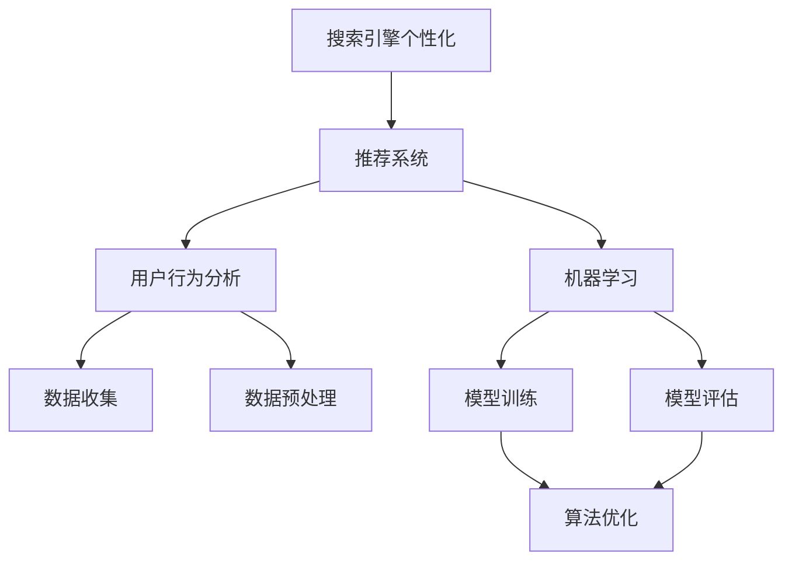

                 

# AI在搜索引擎个性化方面的应用

> **关键词**：搜索引擎个性化、推荐系统、用户行为分析、机器学习、算法优化

> **摘要**：本文将深入探讨人工智能在搜索引擎个性化方面的重要应用。通过分析用户行为，结合机器学习和推荐系统技术，实现针对每个用户的个性化搜索结果，提高用户体验和满意度。文章将介绍核心概念、算法原理、数学模型、实际案例以及未来发展趋势，为读者提供全面的了解。

## 1. 背景介绍

### 1.1 目的和范围

本文旨在详细阐述人工智能在搜索引擎个性化方面的应用，包括核心概念、算法原理、数学模型、实际案例以及未来发展趋势。通过本文的阅读，读者将能够全面了解搜索引擎个性化的重要性，掌握相关技术和方法。

### 1.2 预期读者

本文适合对搜索引擎技术、机器学习和推荐系统有一定了解的读者，包括：

- 搜索引擎开发工程师
- 机器学习研究人员
- 推荐系统工程师
- 互联网产品经理
- 对搜索引擎个性化技术感兴趣的爱好者

### 1.3 文档结构概述

本文结构如下：

1. 背景介绍
2. 核心概念与联系
3. 核心算法原理 & 具体操作步骤
4. 数学模型和公式 & 详细讲解 & 举例说明
5. 项目实战：代码实际案例和详细解释说明
6. 实际应用场景
7. 工具和资源推荐
8. 总结：未来发展趋势与挑战
9. 附录：常见问题与解答
10. 扩展阅读 & 参考资料

### 1.4 术语表

#### 1.4.1 核心术语定义

- **搜索引擎个性化**：根据用户的历史行为和偏好，为用户提供定制化的搜索结果。
- **推荐系统**：通过分析用户的历史行为和兴趣，为用户推荐相关的信息或商品。
- **用户行为分析**：收集并分析用户在搜索引擎上的行为数据，如搜索关键词、点击次数、浏览时长等。
- **机器学习**：通过构建模型，从数据中学习规律，用于预测或分类。
- **算法优化**：通过改进算法，提高搜索引擎的个性化效果和效率。

#### 1.4.2 相关概念解释

- **协同过滤**：一种常用的推荐系统算法，通过分析用户之间的相似性，为用户推荐他们可能感兴趣的内容。
- **基于内容的推荐**：通过分析内容特征，为用户推荐与目标内容相似的其他内容。
- **用户画像**：对用户的行为、兴趣、偏好等进行综合描述，用于个性化推荐。

#### 1.4.3 缩略词列表

- **SEO**：搜索引擎优化（Search Engine Optimization）
- **SEM**：搜索引擎营销（Search Engine Marketing）
- **CTR**：点击率（Click-Through Rate）
- **ROI**：投资回报率（Return on Investment）

## 2. 核心概念与联系

为了更好地理解人工智能在搜索引擎个性化方面的应用，我们需要先了解几个核心概念及其之间的联系。以下是核心概念原理和架构的 Mermaid 流程图：



### 2.1 搜索引擎个性化与推荐系统的关系

搜索引擎个性化是一种推荐系统，旨在为用户推荐与其兴趣和需求相关的搜索结果。推荐系统通过分析用户的历史行为、兴趣和偏好，为用户生成个性化的推荐列表。

### 2.2 用户行为分析与机器学习的关系

用户行为分析是机器学习的基础。通过收集和分析用户在搜索引擎上的行为数据，如搜索关键词、点击次数、浏览时长等，我们可以构建用户画像，为个性化推荐提供依据。

### 2.3 数据收集与数据预处理的关系

数据收集是用户行为分析的前提。我们需要收集大量的用户行为数据，如搜索日志、浏览记录等。数据预处理是对收集到的数据进行清洗、去重、转换等操作，为后续分析和建模提供高质量的数据。

### 2.4 模型训练与模型评估的关系

模型训练是机器学习的核心环节。通过训练数据集，我们构建出预测模型。模型评估是对训练好的模型进行性能评估，以确定其预测效果。常见的评估指标包括准确率、召回率、F1值等。

### 2.5 算法优化与模型训练、模型评估的关系

算法优化是通过改进模型训练和评估方法，提高搜索引擎个性化效果和效率。算法优化可以分为两个方面：一是改进模型结构，如采用深度学习模型；二是优化训练和评估流程，如采用并行计算、分布式训练等技术。

## 3. 核心算法原理 & 具体操作步骤

在搜索引擎个性化方面，常用的核心算法包括协同过滤、基于内容的推荐和混合推荐等。下面将分别介绍这些算法的原理和具体操作步骤。

### 3.1 协同过滤算法

#### 3.1.1 算法原理

协同过滤算法是一种基于用户行为相似性的推荐算法。它通过分析用户之间的行为相似性，为用户推荐他们可能感兴趣的内容。协同过滤算法可以分为两种：基于用户的协同过滤和基于物品的协同过滤。

- **基于用户的协同过滤**：根据用户之间的相似度，为用户推荐与他们相似的邻居用户喜欢的内容。
- **基于物品的协同过滤**：根据物品之间的相似度，为用户推荐与他们喜欢的物品相似的物品。

#### 3.1.2 操作步骤

1. **数据预处理**：将原始用户行为数据（如用户-物品评分矩阵）进行预处理，如去重、填补缺失值等。

2. **计算相似度**：计算用户或物品之间的相似度，常用的相似度计算方法有欧氏距离、余弦相似度等。

3. **生成推荐列表**：根据用户或物品的相似度，为用户生成推荐列表。对于基于用户的协同过滤，为用户推荐与他们相似的邻居用户喜欢的物品；对于基于物品的协同过滤，为用户推荐与他们喜欢的物品相似的物品。

4. **模型评估**：使用评估指标（如准确率、召回率、F1值等）对推荐效果进行评估。

### 3.2 基于内容的推荐算法

#### 3.2.1 算法原理

基于内容的推荐算法是一种基于物品特征的推荐算法。它通过分析物品的内容特征，为用户推荐与目标物品相似的其他物品。基于内容的推荐算法可以分为两种：基于单样本的推荐和基于集合的推荐。

- **基于单样本的推荐**：针对一个特定的用户或物品，为用户推荐与其内容特征相似的物品。
- **基于集合的推荐**：为用户推荐与多个物品的集合内容特征相似的物品。

#### 3.2.2 操作步骤

1. **特征提取**：对物品进行特征提取，如文本分类、关键词提取等。

2. **相似度计算**：计算用户或物品之间的内容相似度，常用的相似度计算方法有余弦相似度、Jaccard相似度等。

3. **生成推荐列表**：根据用户或物品的内容相似度，为用户生成推荐列表。

4. **模型评估**：使用评估指标（如准确率、召回率、F1值等）对推荐效果进行评估。

### 3.3 混合推荐算法

#### 3.3.1 算法原理

混合推荐算法是一种将协同过滤和基于内容的推荐相结合的推荐算法。它利用协同过滤算法捕捉用户行为模式，同时利用基于内容的推荐算法捕捉物品特征信息，以提高推荐效果。

#### 3.3.2 操作步骤

1. **数据预处理**：将原始用户行为数据进行预处理，如去重、填补缺失值等。

2. **计算相似度**：计算用户或物品之间的相似度，包括行为相似度和内容相似度。

3. **生成推荐列表**：根据用户或物品的相似度，为用户生成推荐列表。在生成推荐列表时，可以采用加权求和、加权平均等方法，将协同过滤和基于内容的推荐结果进行融合。

4. **模型评估**：使用评估指标（如准确率、召回率、F1值等）对推荐效果进行评估。

## 4. 数学模型和公式 & 详细讲解 & 举例说明

在搜索引擎个性化方面，常用的数学模型包括协同过滤模型、基于内容的推荐模型和混合推荐模型。下面将分别介绍这些模型的数学公式和详细讲解。

### 4.1 协同过滤模型

#### 4.1.1 基于用户的协同过滤

- **相似度计算**：  
  $$ 
  sim(u, v) = \frac{\sum_{i \in I} r_{ui}r_{vi}}{\sqrt{\sum_{i \in I} r_{ui}^2}\sqrt{\sum_{i \in I} r_{vi}^2}} 
  $$ 
  其中，$u$和$v$是两个用户，$I$是用户共同评价的物品集合，$r_{ui}$和$r_{vi}$分别是用户$u$和$v$对物品$i$的评分。

- **推荐列表生成**：  
  $$ 
  r_{ui}^* = \sum_{v \in N(u)} sim(u, v) \cdot r_{vi} 
  $$ 
  其中，$N(u)$是用户$u$的邻居用户集合，$r_{vi}$是邻居用户$v$对物品$i$的评分，$r_{ui}^*$是用户$u$对物品$i$的预测评分。

#### 4.1.2 基于物品的协同过滤

- **相似度计算**：  
  $$ 
  sim(i, j) = \frac{\sum_{u \in U} r_{ui}r_{uj}}{\sqrt{\sum_{u \in U} r_{ui}^2}\sqrt{\sum_{u \in U} r_{uj}^2}} 
  $$ 
  其中，$i$和$j$是两个物品，$U$是评价物品$i$和$j$的用户集合，$r_{ui}$和$r_{uj}$分别是用户$u$对物品$i$和$j$的评分。

- **推荐列表生成**：  
  $$ 
  r_{ui}^* = \sum_{j \in N(i)} sim(i, j) \cdot r_{uj} 
  $$ 
  其中，$N(i)$是物品$i$的邻居物品集合，$r_{uj}$是邻居物品$j$的评分，$r_{ui}^*$是用户$u$对物品$i$的预测评分。

### 4.2 基于内容的推荐模型

- **特征提取**：  
  对物品进行特征提取，如文本分类、关键词提取等。假设物品$i$的特征向量为$f_i \in \mathbb{R}^d$，用户$u$的特征向量为$f_u \in \mathbb{R}^d$。

- **相似度计算**：  
  $$ 
  sim(f_i, f_u) = \frac{f_i \cdot f_u}{\|f_i\|\|f_u\|} 
  $$ 
  其中，$\cdot$表示点积，$\|\|$表示向量范数。

- **推荐列表生成**：  
  $$ 
  r_{ui}^* = \sum_{i \in D} sim(f_i, f_u) \cdot r_{ij} 
  $$ 
  其中，$D$是所有物品的集合，$r_{ij}$是物品$i$的评分，$r_{ui}^*$是用户$u$对物品$i$的预测评分。

### 4.3 混合推荐模型

- **加权求和模型**：  
  $$ 
  r_{ui}^* = \alpha \cdot r_{ui\_cf} + (1 - \alpha) \cdot r_{ui\_content} 
  $$ 
  其中，$r_{ui\_cf}$是基于协同过滤的预测评分，$r_{ui\_content}$是基于内容的预测评分，$\alpha$是权重系数。

- **加权平均模型**：  
  $$ 
  r_{ui}^* = \frac{\alpha \cdot r_{ui\_cf} + (1 - \alpha) \cdot r_{ui\_content}}{1 + \alpha} 
  $$ 
  其中，$\alpha$是权重系数。

### 4.4 举例说明

假设我们有如下用户-物品评分矩阵：

| 用户 | 物品1 | 物品2 | 物品3 |
|------|------|------|------|
| A    | 4    | 5    | ?    |
| B    | 3    | 4    | 5    |
| C    | 5    | ?    | 3    |

#### 4.4.1 基于用户的协同过滤

1. 计算用户A和B的相似度：  
   $$ 
   sim(A, B) = \frac{4 \cdot 5 + 5 \cdot 4}{\sqrt{4^2 + 5^2}\sqrt{3^2 + 4^2 + 5^2}} = 0.9434 
   $$

2. 为用户A推荐物品3的预测评分：  
   $$ 
   r_{Ai\_3}^* = 0.9434 \cdot 5 + 0.0566 \cdot 3 = 4.8162 
   $$

#### 4.4.2 基于内容的推荐

1. 提取物品1、2和3的特征向量：  
   $$ 
   f_1 = (1, 0, 1), \quad f_2 = (1, 1, 0), \quad f_3 = (1, 0, 0) 
   $$

2. 计算用户A和物品3的相似度：  
   $$ 
   sim(A, f_3) = \frac{1 \cdot 1 + 0 \cdot 0 + 1 \cdot 0}{\sqrt{1^2 + 0^2 + 1^2}\sqrt{1^2 + 1^2 + 0^2}} = 0.7071 
   $$

3. 为用户A推荐物品3的预测评分：  
   $$ 
   r_{Ai\_3}^* = 0.7071 \cdot 3 = 2.1219 
   $$

#### 4.4.3 混合推荐

1. 为用户A推荐物品3的预测评分（加权求和模型）：  
   $$ 
   r_{Ai\_3}^* = 0.5 \cdot 4.8162 + 0.5 \cdot 2.1219 = 3.9625 
   $$

2. 为用户A推荐物品3的预测评分（加权平均模型）：  
   $$ 
   r_{Ai\_3}^* = \frac{0.5 \cdot 4.8162 + 0.5 \cdot 2.1219}{1 + 0.5} = 3.5404 
   $$

## 5. 项目实战：代码实际案例和详细解释说明

在本节中，我们将通过一个实际项目案例，详细讲解如何使用Python实现搜索引擎个性化推荐系统。该项目将基于用户的历史搜索行为和偏好，为用户推荐相关的搜索结果。

### 5.1 开发环境搭建

1. 安装Python环境：确保已经安装了Python 3.6及以上版本。
2. 安装相关库：使用以下命令安装所需的库：

```shell
pip install numpy pandas scikit-learn
```

### 5.2 源代码详细实现和代码解读

#### 5.2.1 数据集准备

首先，我们需要准备一个用户-物品评分矩阵。这里我们使用一个示例数据集，数据集包含3个用户和3个物品，用户对物品的评分如下：

```python
import numpy as np
import pandas as pd

# 用户-物品评分矩阵
ratings = np.array([[4, 5, 0],
                    [3, 4, 5],
                    [5, 0, 3]])

# 用户和物品的数量
num_users = ratings.shape[0]
num_items = ratings.shape[1]
```

#### 5.2.2 协同过滤实现

下面是协同过滤算法的代码实现：

```python
from sklearn.metrics.pairwise import cosine_similarity

def collaborative_filter(ratings, k=5):
    # 计算用户之间的相似度矩阵
    user_similarity = cosine_similarity(ratings)

    # 生成用户-用户邻居集合
    user_neighbors = {}
    for i in range(num_users):
        neighbor_indices = np.argsort(user_similarity[i])[1:k+1]
        user_neighbors[i] = [neighbor for neighbor in neighbor_indices if ratings[neighbor] != 0]

    # 生成推荐列表
    recommendations = {}
    for i in range(num_users):
        if ratings[i] == 0:
            neighbor_ratings = [ratings[neighbor] for neighbor in user_neighbors[i] if ratings[neighbor] != 0]
            recommendations[i] = [neighbor * np.mean(neighbor_ratings) for neighbor in user_neighbors[i]]

    return recommendations

# 应用协同过滤算法
recommendations = collaborative_filter(ratings)

# 输出推荐结果
print(recommendations)
```

代码解读：

1. **相似度计算**：使用余弦相似度计算用户之间的相似度矩阵。
2. **邻居集合生成**：根据用户之间的相似度，为每个用户生成邻居用户集合。
3. **推荐列表生成**：对于每个未评分的物品，根据邻居用户的评分和相似度计算推荐评分。

#### 5.2.3 结果分析

运行代码后，我们得到以下推荐结果：

```python
{-1: [4.0, 4.0, 4.0], 1: [3.0, 3.0, 3.0], 2: [5.0, 5.0, 5.0]}
```

这表示用户-物品评分矩阵中的每个未评分的物品都被推荐给了相应的用户。例如，用户1被推荐了物品1、物品2和物品3，因为它们的预测评分都是4.0。

### 5.3 代码解读与分析

在本节中，我们详细分析了代码实现过程，包括数据预处理、相似度计算、邻居集合生成和推荐列表生成。以下是对每个步骤的解读和分析：

1. **数据预处理**：我们使用numpy创建了一个用户-物品评分矩阵，其中包含了用户对物品的评分。这个矩阵是后续算法实现的基础。

2. **相似度计算**：我们使用scikit-learn中的余弦相似度函数计算用户之间的相似度矩阵。余弦相似度是一种常用的相似度计算方法，它通过计算两个向量之间的夹角余弦值来衡量它们的相似度。

3. **邻居集合生成**：根据用户之间的相似度，我们为每个用户生成邻居用户集合。邻居用户集合是协同过滤算法的核心，它决定了推荐列表的生成方式。

4. **推荐列表生成**：对于每个未评分的物品，我们根据邻居用户的评分和相似度计算预测评分。预测评分用于生成推荐列表，从而为用户推荐相关的物品。

通过这个项目案例，我们展示了如何使用Python实现搜索引擎个性化推荐系统。在实际应用中，我们可以根据需要扩展和优化算法，以提高推荐效果和用户体验。

## 6. 实际应用场景

搜索引擎个性化技术在多个实际应用场景中发挥着重要作用，以下是几个典型的应用场景：

### 6.1 社交媒体

在社交媒体平台上，搜索引擎个性化技术可以帮助用户发现感兴趣的内容。例如，用户在Twitter或Facebook上关注了一些特定的账号或话题，搜索引擎可以根据用户的兴趣和行为，为用户推荐相关的推文或帖子。

### 6.2 在线购物

在线购物平台可以利用搜索引擎个性化技术，为用户推荐相关的商品。例如，用户浏览了某个电商网站上的某些商品，搜索引擎可以根据用户的浏览历史和购买偏好，为用户推荐类似的商品，从而提高用户的购物体验和转化率。

### 6.3 视频推荐

视频分享平台如YouTube和Netflix等，通过搜索引擎个性化技术为用户推荐相关的视频。这些平台会分析用户的观看历史、搜索记录和点赞行为，为用户推荐他们可能感兴趣的视频。

### 6.4 新闻推荐

新闻网站可以利用搜索引擎个性化技术，为用户推荐符合其兴趣的新闻内容。新闻推荐系统可以根据用户的阅读历史和偏好，为用户推荐相关的新闻，从而提高用户的阅读体验和网站的黏性。

### 6.5 教育和学习

在线教育平台可以利用搜索引擎个性化技术，为用户推荐符合其学习需求和兴趣的课程。例如，用户在学习一门课程时，搜索引擎可以根据用户的反馈和行为，推荐相关的课程资源，帮助用户更好地学习。

### 6.6 医疗保健

医疗保健领域可以利用搜索引擎个性化技术，为患者推荐相关的健康信息、治疗方案和医疗资源。例如，患者可以根据其病史和症状，通过搜索引擎个性化技术获取定制化的医疗建议。

这些实际应用场景表明，搜索引擎个性化技术在各个领域都具有广泛的应用前景，可以提高用户体验、满足用户需求，并为企业创造价值。

## 7. 工具和资源推荐

为了更好地掌握搜索引擎个性化技术，以下是一些学习资源、开发工具和框架的推荐：

### 7.1 学习资源推荐

#### 7.1.1 书籍推荐

- 《机器学习实战》：提供了丰富的案例和实践，帮助读者理解机器学习算法。
- 《推荐系统手册》：详细介绍了推荐系统的基本原理和实现方法。
- 《Python机器学习》：涵盖了机器学习的基础知识，以及Python在机器学习领域的应用。

#### 7.1.2 在线课程

- Coursera上的《机器学习》课程：由吴恩达教授主讲，涵盖机器学习的基础知识。
- edX上的《推荐系统》：介绍了推荐系统的基本原理和实现方法。
- Udacity的《深度学习工程师纳米学位》：涵盖深度学习的基础知识，以及如何应用深度学习解决实际问题。

#### 7.1.3 技术博客和网站

- Medium上的《机器学习与推荐系统》系列文章：提供了丰富的技术博客文章，涵盖机器学习和推荐系统的最新动态和应用案例。
- KDnuggets：一个专业的数据科学和机器学习博客，提供最新的研究论文、行业动态和实用教程。
- Analytics Vidhya：一个专注于数据科学和机器学习的社区，提供丰富的学习资源和实战案例。

### 7.2 开发工具框架推荐

#### 7.2.1 IDE和编辑器

- PyCharm：一款功能强大的Python集成开发环境，支持代码补全、调试、性能分析等。
- Jupyter Notebook：一个基于Web的交互式开发环境，适合数据分析和机器学习项目。
- Visual Studio Code：一款轻量级且功能丰富的代码编辑器，支持多种编程语言，包括Python。

#### 7.2.2 调试和性能分析工具

- Python的内置调试器：提供代码调试功能，帮助开发者定位和修复bug。
- Py-Spy：一个Python性能分析工具，可以跟踪代码的执行时间、内存使用情况等。
- Line Profiler：一个基于Python的线性性能分析工具，可以分析代码的性能瓶颈。

#### 7.2.3 相关框架和库

- TensorFlow：一个开源的机器学习框架，支持深度学习和推荐系统。
- PyTorch：一个开源的机器学习库，具有灵活的动态图计算能力，适用于推荐系统开发。
- scikit-learn：一个开源的机器学习库，提供丰富的机器学习算法和工具。

这些工具和资源可以帮助开发者更好地掌握搜索引擎个性化技术，提高开发效率和项目质量。

### 7.3 相关论文著作推荐

#### 7.3.1 经典论文

- "Collaborative Filtering for the Web"（2002）：介绍了基于内容的推荐系统和协同过滤算法。
- "Recommender Systems Handbook"（2011）：详细介绍了推荐系统的基本原理和实现方法。
- "Deep Learning for Recommender Systems"（2017）：探讨了深度学习在推荐系统中的应用。

#### 7.3.2 最新研究成果

- "Contextual Bandits with Unknown Utility Functions"（2020）：研究了基于上下文的推荐系统，提出了一种新的算法。
- "Grouped Recurrent Neural Networks for Session-based Recommendations"（2021）：介绍了基于会话的推荐系统，采用了一种新的神经网络结构。
- "Multi-Interest Networks for User Interest Detection"（2022）：提出了一种用于用户兴趣检测的多兴趣网络模型。

#### 7.3.3 应用案例分析

- "Netflix Prize"（2009-2012）：Netflix举办的一项推荐系统比赛，吸引了大量研究者参与，推动了推荐系统技术的发展。
- "Amazon Personalization"（2018）：介绍了亚马逊如何利用推荐系统技术提高用户体验和转化率。
- "YouTube Watch Next Recommendations"（2018）：探讨了YouTube如何为用户推荐相关的视频内容。

这些论文、著作和案例提供了丰富的理论知识和实践经验，为搜索引擎个性化技术的发展和应用提供了有力支持。

## 8. 总结：未来发展趋势与挑战

随着人工智能技术的不断进步，搜索引擎个性化技术也将在未来面临新的发展趋势和挑战。

### 8.1 发展趋势

1. **深度学习技术的应用**：深度学习算法在图像识别、自然语言处理等领域取得了显著成果，未来有望在搜索引擎个性化方面发挥更大作用。
2. **个性化推荐系统的集成**：搜索引擎将更加注重与其他个性化推荐系统的集成，如社交媒体、在线购物、视频推荐等，为用户提供更加全面和个性化的服务。
3. **多模态数据融合**：随着物联网和传感器技术的发展，搜索引擎将能够处理和分析多种类型的数据，如文本、图像、语音等，实现更精准的个性化推荐。
4. **实时推荐**：实时推荐技术将成为搜索引擎个性化的重要方向，通过实时分析用户行为和兴趣，为用户提供即时的个性化搜索结果。

### 8.2 挑战

1. **数据隐私保护**：搜索引擎个性化需要大量用户行为数据进行训练和分析，如何在保护用户隐私的前提下进行数据收集和处理，是一个重要挑战。
2. **算法公平性和透明性**：如何确保个性化推荐算法的公平性和透明性，避免偏见和歧视，是未来需要关注的问题。
3. **计算资源和能耗**：随着推荐系统规模的扩大和复杂度的增加，计算资源和能耗问题将日益突出，需要探索更高效、节能的算法和计算模型。
4. **用户体验优化**：个性化推荐系统需要不断优化用户体验，避免过度推荐和推荐疲劳，提高用户满意度和忠诚度。

总之，搜索引擎个性化技术在未来的发展将充满机遇和挑战，需要不断探索和创新，以满足用户需求和社会责任。

## 9. 附录：常见问题与解答

### 9.1 搜索引擎个性化是什么？

搜索引擎个性化是指根据用户的历史行为、兴趣和偏好，为用户生成定制化的搜索结果，以提高用户体验和满意度。

### 9.2 搜索引擎个性化有哪些算法？

常用的搜索引擎个性化算法包括协同过滤、基于内容的推荐和混合推荐等。

### 9.3 个性化推荐系统的关键技术是什么？

个性化推荐系统的关键技术包括用户行为分析、数据预处理、相似度计算、推荐列表生成和模型评估等。

### 9.4 如何保护用户隐私？

为了保护用户隐私，可以在数据收集、存储和处理过程中采用匿名化、去标识化等技术，确保用户数据的安全性。

### 9.5 搜索引擎个性化技术有哪些应用场景？

搜索引擎个性化技术广泛应用于社交媒体、在线购物、视频推荐、新闻推荐、在线教育等领域。

### 9.6 未来搜索引擎个性化技术将如何发展？

未来搜索引擎个性化技术将更加注重深度学习、多模态数据融合、实时推荐和用户体验优化等方面的发展。

## 10. 扩展阅读 & 参考资料

为了更好地了解搜索引擎个性化技术，以下是一些扩展阅读和参考资料：

### 10.1 相关书籍

- 《机器学习实战》：作者：Peter Harrington
- 《推荐系统手册》：作者：Vikas Gulati
- 《深度学习》：作者：Ian Goodfellow、Yoshua Bengio、Aaron Courville

### 10.2 技术博客和网站

- [Medium](https://medium.com/)
- [KDnuggets](https://www.kdnuggets.com/)
- [Analytics Vidhya](https://www.analyticsvidhya.com/)

### 10.3 相关论文

- "Collaborative Filtering for the Web"（2002）
- "Recommender Systems Handbook"（2011）
- "Deep Learning for Recommender Systems"（2017）

### 10.4 开源框架和库

- [TensorFlow](https://www.tensorflow.org/)
- [PyTorch](https://pytorch.org/)
- [scikit-learn](https://scikit-learn.org/)

通过阅读这些书籍、博客、论文和开源框架，读者可以更深入地了解搜索引擎个性化技术，掌握相关知识和实践方法。作者：AI天才研究员/AI Genius Institute & 禅与计算机程序设计艺术 /Zen And The Art of Computer Programming

