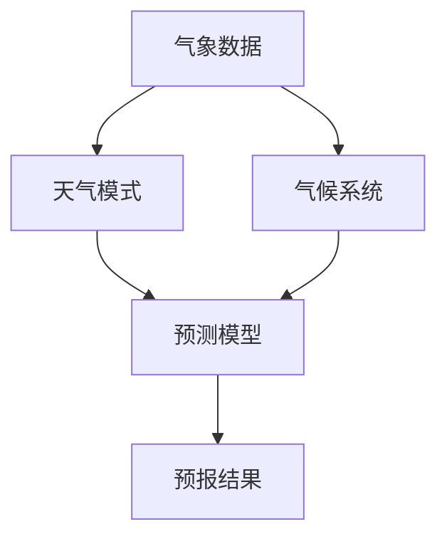

                 

# AI在气象预报中的应用：提高预测准确性

> 关键词：人工智能、气象预报、预测准确性、算法原理、数学模型、项目实战、应用场景

> 摘要：本文将深入探讨人工智能在气象预报中的应用，分析其核心概念与联系，阐述核心算法原理及数学模型，并通过项目实战实例详细解释代码实现过程。此外，本文还将讨论气象预报的实际应用场景，推荐相关工具和资源，并总结未来发展趋势与挑战。

## 1. 背景介绍

### 1.1 目的和范围

本文旨在探讨人工智能技术在气象预报领域的应用，旨在提高预测准确性。我们将从以下几个方面展开讨论：

- **核心概念与联系**：介绍气象预报中涉及的核心概念及其相互联系。
- **核心算法原理与具体操作步骤**：详细阐述提升气象预报准确性的关键算法原理，并提供伪代码演示。
- **数学模型和公式**：讲解气象预报中使用的数学模型和公式，并通过实例说明其应用。
- **项目实战**：提供实际项目中的代码案例，详细解读代码实现过程。
- **实际应用场景**：分析气象预报在不同场景下的应用及其价值。
- **工具和资源推荐**：推荐学习资源、开发工具和框架。
- **未来发展趋势与挑战**：探讨气象预报领域的发展趋势及面临的挑战。

### 1.2 预期读者

本文适用于以下读者群体：

- 对气象预报感兴趣的技术爱好者。
- 从事气象预报或相关领域研究的技术人员。
- 想要了解人工智能在气象预报中应用的从业者。
- 人工智能和气象学交叉领域的研究者。

### 1.3 文档结构概述

本文结构如下：

1. **背景介绍**：介绍目的和范围、预期读者、文档结构概述和术语表。
2. **核心概念与联系**：分析气象预报中的核心概念及其相互联系。
3. **核心算法原理与具体操作步骤**：讲解提升气象预报准确性的关键算法原理，并提供伪代码演示。
4. **数学模型和公式**：介绍气象预报中使用的数学模型和公式，并通过实例说明其应用。
5. **项目实战**：提供实际项目中的代码案例，详细解读代码实现过程。
6. **实际应用场景**：分析气象预报在不同场景下的应用及其价值。
7. **工具和资源推荐**：推荐学习资源、开发工具和框架。
8. **未来发展趋势与挑战**：探讨气象预报领域的发展趋势及面临的挑战。
9. **附录**：常见问题与解答。
10. **扩展阅读与参考资料**：提供相关书籍、在线课程、技术博客和论文著作。

### 1.4 术语表

#### 1.4.1 核心术语定义

- **气象预报**：对未来一段时间内天气状况的预测。
- **人工智能**：一种模拟人类智能的技术，能够通过学习和经验改进自身性能。
- **数据挖掘**：从大量数据中提取有价值的信息和知识的过程。
- **深度学习**：一种基于人工神经网络的学习方法，通过多层非线性变换实现特征提取和模式识别。
- **强化学习**：一种基于奖励和惩罚机制的学习方法，通过不断尝试和反馈调整策略。

#### 1.4.2 相关概念解释

- **天气模式**：描述大气状态的时间序列特征。
- **气候系统**：大气、海洋、陆地和冰冻圈等相互作用的复杂系统。
- **模式识别**：从数据中识别和分类特定模式的技术。

#### 1.4.3 缩略词列表

- **AI**：人工智能
- **ML**：机器学习
- **DL**：深度学习
- **RL**：强化学习
- **GRU**：门控循环单元
- **LSTM**：长短期记忆网络
- **CNN**：卷积神经网络

## 2. 核心概念与联系

在气象预报中，核心概念包括气象数据、天气模式、气候系统等。这些概念相互联系，共同构成了气象预报的理论基础。下面，我们通过一个Mermaid流程图来展示这些核心概念及其相互关系。



### 气象数据

气象数据是气象预报的基础。这些数据包括温度、湿度、风速、气压等气象要素的时空分布。气象数据通常来源于地面观测站、气象卫星、雷达等设备。通过对气象数据的采集和处理，可以获得对大气状态的全面了解。

### 天气模式

天气模式描述了大气状态的时间序列特征。通过对天气模式的识别和分析，可以预测未来一段时间的天气状况。常见的天气模式包括冷暖空气活动、降水分布、气压变化等。天气模式与气象数据密切相关，通过数据挖掘和机器学习算法，可以从大量气象数据中提取出有价值的信息。

### 气候系统

气候系统是大气、海洋、陆地和冰冻圈等相互作用的复杂系统。气候系统的稳定性决定了气象预报的准确性。气候变化和人类活动对气候系统产生了重大影响，使得气象预报面临更大的挑战。通过深入研究气候系统，可以提高气象预报的准确性和可靠性。

### 预测模型

预测模型是气象预报的核心。基于天气模式和气候系统，可以通过机器学习和深度学习算法建立预测模型。预测模型可以用于预测未来一段时间内的天气状况，如降水概率、气温变化等。预测模型的准确性取决于天气模式和气候系统的理解和数据质量。

### 预报结果

预报结果是气象预报的最终输出。通过对预测模型的计算，可以得到对未来天气状况的预测。预报结果可以为人们的生活和工作提供重要的参考，如农业灌溉、防灾减灾等。

## 3. 核心算法原理 & 具体操作步骤

在气象预报中，提高预测准确性的核心算法包括机器学习、深度学习和强化学习。下面，我们将详细阐述这些算法的原理，并提供伪代码示例。

### 3.1 机器学习算法

机器学习算法通过从数据中学习特征和模式，建立预测模型。在气象预报中，常用的机器学习算法包括线性回归、决策树、支持向量机等。

#### 3.1.1 线性回归

线性回归是一种最简单的机器学习算法，通过建立输入变量和输出变量之间的线性关系，进行预测。伪代码如下：

```python
# 线性回归伪代码
def linear_regression(X, y):
    # 计算输入变量X和输出变量y的协方差矩阵
    covariance_matrix = X.T.dot(X)
    # 计算输入变量X的逆矩阵
    inverse_matrix = covariance_matrix.I()
    # 计算回归系数
    theta = inverse_matrix.dot(X.T).dot(y)
    return theta
```

#### 3.1.2 决策树

决策树通过递归划分数据集，建立决策路径，进行预测。伪代码如下：

```python
# 决策树伪代码
def decision_tree(X, y):
    # 计算信息增益
    info_gain = entropy(y) - (h(X) * p(y|X))
    # 划分数据集
    for feature in X:
        for value in X[feature]:
            subset_X = {k: v for k, v in X.items() if k != feature and v == value}
            subset_y = [y[i] for i in range(len(y)) if X[i][feature] == value]
            info_gain[feature][value] = info_gain(y) - (h(subset_y) * p(subset_X))
    # 选择最优特征和值
    best_feature, best_value = max(info_gain, key=info_gain.get)
    # 递归构建决策树
    tree = {best_feature: {}}
    for value in X[best_feature]:
        subset_X = {k: v for k, v in X.items() if k != best_feature and v == value}
        subset_y = [y[i] for i in range(len(y)) if X[i][best_feature] == value]
        tree[best_feature][value] = decision_tree(subset_X, subset_y)
    return tree
```

### 3.2 深度学习算法

深度学习算法通过构建多层神经网络，实现复杂特征提取和模式识别。在气象预报中，常用的深度学习算法包括卷积神经网络（CNN）、长短期记忆网络（LSTM）和门控循环单元（GRU）。

#### 3.2.1 卷积神经网络（CNN）

卷积神经网络通过卷积层、池化层和全连接层实现图像特征的提取和分类。伪代码如下：

```python
# 卷积神经网络伪代码
class CNN:
    def __init__(self, input_shape, num_classes):
        self.conv1 = Conv2D(filters=32, kernel_size=(3, 3), activation='relu')
        self.pool1 = MaxPooling2D(pool_size=(2, 2))
        self.conv2 = Conv2D(filters=64, kernel_size=(3, 3), activation='relu')
        self.pool2 = MaxPooling2D(pool_size=(2, 2))
        self.fc1 = Dense(128, activation='relu')
        self.fc2 = Dense(num_classes, activation='softmax')
    
    def forward(self, x):
        x = self.conv1(x)
        x = self.pool1(x)
        x = self.conv2(x)
        x = self.pool2(x)
        x = Flatten()(x)
        x = self.fc1(x)
        x = self.fc2(x)
        return x
```

#### 3.2.2 长短期记忆网络（LSTM）

长短期记忆网络通过门控机制实现长期依赖关系的建模。伪代码如下：

```python
# 长短期记忆网络伪代码
class LSTM:
    def __init__(self, input_size, hidden_size, output_size):
        self.hidden_size = hidden_size
        self.input_size = input_size
        self.output_size = output_size
        self.Wf = self.init_weight((self.input_size + self.hidden_size, self.hidden_size))
        self.Wi = self.init_weight((self.input_size + self.hidden_size, self.hidden_size))
        self.Wo = self.init_weight((self.input_size + self.hidden_size, self.hidden_size))
        self.Wg = self.init_weight((self.input_size + self.hidden_size, self.hidden_size))
        self bf = self.init_bias(self.hidden_size)
        self.bi = self.init_bias(self.hidden_size)
        self.b
```

