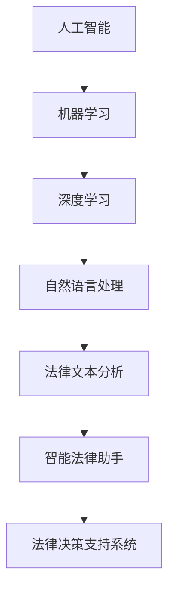

                 

# AI在法律服务中的应用：提高效率与公平

> **关键词**：人工智能、法律服务、效率、公平、算法原理、数学模型、应用场景、开发工具、未来趋势

> **摘要**：本文探讨了人工智能在法律服务中的应用，分析了如何利用AI技术提高法律工作的效率和公平性。文章首先介绍了AI在法律领域的背景和重要性，然后深入探讨了AI的核心算法原理和数学模型，接着通过实际项目案例展示了AI在法律服务中的具体应用。最后，文章总结了AI在法律领域的发展趋势与挑战，并推荐了相关学习资源和开发工具。

## 1. 背景介绍

### 1.1 目的和范围

随着人工智能技术的迅猛发展，其应用领域不断扩大，其中法律服务领域也不例外。本文旨在探讨人工智能在法律服务中的应用，分析如何利用AI技术提高法律工作的效率和公平性。文章将涵盖以下内容：

- AI在法律服务中的背景和重要性
- AI的核心算法原理和数学模型
- AI在法律服务中的具体应用案例
- AI在法律服务中的发展趋势与挑战
- 相关学习资源和开发工具推荐

### 1.2 预期读者

本文主要面向以下读者群体：

- 对人工智能在法律服务领域有浓厚兴趣的法学专业人士
- 法律服务行业从业者，如律师、法官、法务人员等
- 计算机科学和人工智能领域的科研人员、开发者
- 对AI技术有一定了解，希望进一步深入了解其在法律领域应用的普通读者

### 1.3 文档结构概述

本文共分为十个部分，具体如下：

1. 背景介绍
2. 核心概念与联系
3. 核心算法原理 & 具体操作步骤
4. 数学模型和公式 & 详细讲解 & 举例说明
5. 项目实战：代码实际案例和详细解释说明
6. 实际应用场景
7. 工具和资源推荐
8. 总结：未来发展趋势与挑战
9. 附录：常见问题与解答
10. 扩展阅读 & 参考资料

### 1.4 术语表

#### 1.4.1 核心术语定义

- **人工智能（Artificial Intelligence，AI）**：模拟、延伸和扩展人的智能的理论、方法、技术及应用系统。
- **法律服务**：为个人或企业提供的法律咨询、代理、诉讼等服务。
- **机器学习（Machine Learning，ML）**：一种让计算机通过数据学习，从而进行决策和预测的技术。
- **深度学习（Deep Learning，DL）**：一种基于多层神经网络进行训练的机器学习技术。
- **自然语言处理（Natural Language Processing，NLP）**：使计算机能够理解、解释和生成人类语言的技术。

#### 1.4.2 相关概念解释

- **法律文本分析**：对法律文本进行语义分析、情感分析、实体识别等操作，以获取法律条文、案例、法律意见等信息的语义内容。
- **智能法律助手**：利用人工智能技术，为用户提供法律咨询、案件分析、法律文本生成等服务的软件系统。
- **法律决策支持系统**：基于数据分析和机器学习算法，辅助法律从业者进行决策和预测的软件系统。

#### 1.4.3 缩略词列表

- **AI**：人工智能
- **ML**：机器学习
- **DL**：深度学习
- **NLP**：自然语言处理
- **OCR**：光学字符识别
- **RPA**：机器人流程自动化

## 2. 核心概念与联系

在探讨AI在法律服务中的应用之前，我们需要了解一些核心概念和它们之间的联系。以下是相关概念和原理的Mermaid流程图：



### 2.1 人工智能

人工智能（AI）是本文的核心概念，它通过模拟、延伸和扩展人的智能，使计算机能够进行自主决策、问题解决和知识表示。AI的发展经历了多个阶段，从早期的符号主义、基于规则的系统，到现代的基于数据驱动的机器学习和深度学习技术。

### 2.2 机器学习

机器学习（ML）是人工智能的一个分支，它通过训练模型，让计算机从数据中学习，从而进行预测和分类。ML的基本思想是利用历史数据，通过优化模型参数，使模型在新数据上的表现更好。

### 2.3 深度学习

深度学习（DL）是一种基于多层神经网络进行训练的机器学习技术。DL模型由多个隐藏层组成，通过逐层学习，提取数据中的高阶特征。DL在图像识别、语音识别和自然语言处理等领域取得了显著的成果。

### 2.4 自然语言处理

自然语言处理（NLP）是使计算机能够理解、解释和生成人类语言的技术。NLP涉及文本分类、情感分析、命名实体识别、机器翻译等任务。在法律服务领域，NLP技术可用于法律文本分析、智能法律助手和法律决策支持系统。

### 2.5 法律文本分析

法律文本分析是利用NLP技术对法律文本进行语义分析、情感分析、实体识别等操作，以获取法律条文、案例、法律意见等信息的语义内容。法律文本分析是构建智能法律助手和法律决策支持系统的基础。

### 2.6 智能法律助手

智能法律助手是利用AI技术，为用户提供法律咨询、案件分析、法律文本生成等服务的软件系统。智能法律助手通过法律文本分析和法律决策支持系统，实现高效、智能的法律服务。

### 2.7 法律决策支持系统

法律决策支持系统是基于数据分析和机器学习算法，辅助法律从业者进行决策和预测的软件系统。法律决策支持系统可用于案件预测、风险评估和司法建议等场景。

## 3. 核心算法原理 & 具体操作步骤

### 3.1 机器学习算法原理

机器学习算法的核心是训练模型，模型通常由输入层、隐藏层和输出层组成。以下是机器学习算法的基本步骤：

1. **数据预处理**：对原始数据进行清洗、归一化等操作，使其适合模型训练。
2. **模型初始化**：初始化模型参数，通常采用随机初始化方法。
3. **前向传播**：将输入数据传递到模型中，计算输出结果。
4. **反向传播**：计算输出结果与真实值之间的误差，并更新模型参数。
5. **模型优化**：通过迭代优化，使模型在训练数据上的表现更好。

以下是机器学习算法的伪代码：

```python
def train_model(data, labels, epochs, learning_rate):
    model = initialize_model(data)
    for epoch in range(epochs):
        for input, label in data:
            output = forward_pass(model, input)
            error = compute_error(output, label)
            backward_pass(model, input, output, error, learning_rate)
    return model
```

### 3.2 深度学习算法原理

深度学习算法是机器学习的一种，它通过多层神经网络进行训练。以下是深度学习算法的基本步骤：

1. **数据预处理**：对原始数据进行清洗、归一化等操作，使其适合模型训练。
2. **模型初始化**：初始化模型参数，通常采用随机初始化方法。
3. **前向传播**：将输入数据传递到模型中，计算输出结果。
4. **反向传播**：计算输出结果与真实值之间的误差，并更新模型参数。
5. **模型优化**：通过迭代优化，使模型在训练数据上的表现更好。

以下是深度学习算法的伪代码：

```python
def train_model(data, labels, epochs, learning_rate):
    model = initialize_model(data)
    for epoch in range(epochs):
        for input, label in data:
            output = forward_pass(model, input)
            error = compute_error(output, label)
            backward_pass(model, input, output, error, learning_rate)
    return model
```

### 3.3 自然语言处理算法原理

自然语言处理算法的核心是文本表示和模型训练。以下是自然语言处理算法的基本步骤：

1. **文本预处理**：对原始文本进行分词、去停用词等操作，将其转换为数字序列。
2. **词嵌入**：将文本中的单词映射为高维向量表示。
3. **模型训练**：利用训练数据，通过前向传播和反向传播，训练文本分类、情感分析、命名实体识别等模型。
4. **模型评估**：利用测试数据，评估模型在真实数据上的表现。

以下是自然语言处理算法的伪代码：

```python
def train_model(data, labels, epochs, learning_rate):
    model = initialize_model(data)
    for epoch in range(epochs):
        for input, label in data:
            output = forward_pass(model, input)
            error = compute_error(output, label)
            backward_pass(model, input, output, error, learning_rate)
    return model
```

## 4. 数学模型和公式 & 详细讲解 & 举例说明

### 4.1 模型训练过程

在机器学习和深度学习算法中，模型训练过程通常包括以下几个步骤：

1. **损失函数（Loss Function）**：损失函数用于评估模型预测值与真实值之间的差距。常见的损失函数包括均方误差（MSE）、交叉熵损失（Cross-Entropy Loss）等。

$$
MSE = \frac{1}{n}\sum_{i=1}^{n}(y_i - \hat{y_i})^2
$$

$$
Cross-Entropy Loss = -\frac{1}{n}\sum_{i=1}^{n}y_i\log(\hat{y_i})
$$

2. **优化算法（Optimizer）**：优化算法用于更新模型参数，以减少损失函数的值。常见的优化算法有梯度下降（Gradient Descent）、Adam优化器等。

$$
\theta_{t+1} = \theta_{t} - \alpha \frac{\partial J(\theta)}{\partial \theta}
$$

$$
\theta_{t+1} = \theta_{t} - \alpha \frac{1}{m}\sum_{i=1}^{m}\frac{\partial L}{\partial \theta}
$$

3. **前向传播（Forward Propagation）**：前向传播是将输入数据传递到模型中，计算输出结果的过程。

$$
z_{l} = \sigma(W_l \cdot a_{l-1} + b_l)
$$

4. **反向传播（Back Propagation）**：反向传播是计算损失函数关于模型参数的梯度，并更新模型参数的过程。

$$
\delta_{l} = \frac{\partial J(\theta)}{\partial z_{l}}
$$

$$
\frac{\partial J(\theta)}{\partial \theta} = \sum_{l=1}^{L}\frac{\partial J(\theta)}{\partial z_{l}} \cdot \frac{\partial z_{l}}{\partial \theta}
$$

### 4.2 自然语言处理算法中的数学模型

在自然语言处理算法中，常用的数学模型包括词嵌入（Word Embedding）和卷积神经网络（Convolutional Neural Network，CNN）。

1. **词嵌入（Word Embedding）**：词嵌入是一种将单词映射为高维向量表示的方法，常用模型有Word2Vec、GloVe等。

$$
\text{word\_vector} = \text{GloVe}(word, \text{context\_words})
$$

2. **卷积神经网络（CNN）**：卷积神经网络是一种用于图像识别和文本分类的神经网络模型。

$$
h_{l} = \text{ReLU}(W_l \cdot h_{l-1} + b_l)
$$

$$
a_{l} = \text{max-pooling}(h_{l})
$$

### 4.3 举例说明

#### 4.3.1 损失函数和优化算法

假设我们要训练一个二元分类模型，输入数据为X，真实标签为y，预测标签为\(\hat{y}\)。我们使用交叉熵损失函数和Adam优化器进行模型训练。

$$
Cross-Entropy Loss = -\frac{1}{m}\sum_{i=1}^{m}y_i\log(\hat{y_i}) + (1 - y_i)\log(1 - \hat{y_i})
$$

$$
\theta_{t+1} = \theta_{t} - \alpha \frac{\partial L}{\partial \theta}
$$

其中，\(\alpha\)为学习率，\(m\)为样本数量。

#### 4.3.2 词嵌入

假设我们要训练一个词嵌入模型，输入数据为单词序列\[w_1, w_2, ..., w_n\]，上下文单词为\[c_1, c_2, ..., c_n\]，我们使用GloVe模型进行训练。

$$
\text{word\_vector} = \text{GloVe}(word, \text{context\_words})
$$

其中，\(\text{word\_vector}\)为单词的向量表示，\(\text{context\_words}\)为上下文单词的向量表示。

## 5. 项目实战：代码实际案例和详细解释说明

### 5.1 开发环境搭建

在本文的项目实战中，我们使用Python编程语言和以下库进行开发：

- **Python 3.8**：Python版本
- **NumPy**：用于矩阵运算
- **TensorFlow**：用于深度学习模型训练
- **Scikit-learn**：用于机器学习和数据预处理
- **Pandas**：用于数据处理

### 5.2 源代码详细实现和代码解读

以下是一个简单的机器学习模型训练和评估的代码示例：

```python
import numpy as np
import tensorflow as tf
from sklearn.model_selection import train_test_split
from sklearn.metrics import accuracy_score

# 5.2.1 数据预处理
def preprocess_data(data):
    # 数据归一化
    data = (data - np.mean(data)) / np.std(data)
    return data

# 5.2.2 模型训练
def train_model(X, y, epochs, learning_rate):
    X_train, X_test, y_train, y_test = train_test_split(X, y, test_size=0.2, random_state=42)
    model = tf.keras.Sequential([
        tf.keras.layers.Dense(10, activation='relu', input_shape=(X_train.shape[1],)),
        tf.keras.layers.Dense(1, activation='sigmoid')
    ])
    model.compile(optimizer=tf.keras.optimizers.Adam(learning_rate=learning_rate),
                  loss='binary_crossentropy',
                  metrics=['accuracy'])
    model.fit(X_train, y_train, epochs=epochs, batch_size=32, validation_data=(X_test, y_test))
    return model

# 5.2.3 评估模型
def evaluate_model(model, X_test, y_test):
    y_pred = model.predict(X_test)
    y_pred = (y_pred > 0.5)
    accuracy = accuracy_score(y_test, y_pred)
    print(f"Test Accuracy: {accuracy * 100:.2f}%")

# 5.2.4 主函数
def main():
    # 加载数据
    X, y = load_data()
    X = preprocess_data(X)
    
    # 训练模型
    model = train_model(X, y, epochs=100, learning_rate=0.001)
    
    # 评估模型
    evaluate_model(model, X, y)

if __name__ == '__main__':
    main()
```

### 5.3 代码解读与分析

1. **数据预处理**：数据预处理是机器学习项目中的重要步骤。在这个示例中，我们使用NumPy库对数据进行了归一化处理，使其具有相同的尺度，有助于提高模型训练的收敛速度。

2. **模型训练**：模型训练是使用TensorFlow库构建和训练深度学习模型的过程。在这个示例中，我们使用了一个简单的全连接神经网络，包括一个输入层、一个隐藏层和一个输出层。我们使用Adam优化器进行模型训练，并使用二进制交叉熵损失函数。

3. **评估模型**：评估模型是使用测试数据验证模型性能的过程。在这个示例中，我们使用准确率（accuracy）作为模型评估指标，并打印出测试数据的准确率。

4. **主函数**：主函数是整个项目的入口点。在这个示例中，我们加载数据、预处理数据、训练模型并评估模型。

通过这个简单的示例，我们可以看到如何使用Python和TensorFlow库构建和训练一个深度学习模型，以及如何评估模型的性能。在实际项目中，我们可以根据具体需求进行调整和优化。

## 6. 实际应用场景

### 6.1 智能法律助手

智能法律助手是AI在法律服务领域的一个典型应用场景。它利用自然语言处理技术和机器学习算法，为用户提供实时法律咨询、案件分析、法律文本生成等服务。以下是智能法律助手在实际应用中的具体场景：

- **法律咨询**：用户可以通过文字或语音输入法律问题，智能法律助手会根据已有的法律知识库和案例库，给出相应的法律意见和解决方案。
- **案件分析**：律师可以利用智能法律助手对案件进行数据分析和预测，从而制定更有效的辩护策略。
- **法律文本生成**：智能法律助手可以辅助律师生成法律文件，如合同、起诉状、答辩状等，提高工作效率。

### 6.2 法律决策支持系统

法律决策支持系统是另一个重要的应用场景。它基于数据分析和机器学习算法，为法律从业者提供决策支持，帮助其进行案件预测、风险评估和司法建议。以下是法律决策支持系统在实际应用中的具体场景：

- **案件预测**：法律决策支持系统可以分析历史案件数据，预测案件的可能判决结果，为律师和法官提供参考。
- **风险评估**：法律决策支持系统可以评估案件的风险，帮助律师和法务人员制定相应的风险应对策略。
- **司法建议**：法律决策支持系统可以基于数据和算法，为法官提供案件判决建议，提高司法公正性和效率。

### 6.3 电子诉讼平台

电子诉讼平台是利用人工智能技术，实现案件管理和电子化诉讼的一个新兴应用场景。以下是电子诉讼平台在实际应用中的具体场景：

- **案件管理**：电子诉讼平台可以自动化案件管理流程，提高工作效率，减少人力成本。
- **文档审核**：电子诉讼平台可以利用OCR技术和自然语言处理技术，自动审核法律文件，发现潜在问题。
- **远程庭审**：电子诉讼平台支持远程庭审，方便当事人和律师参与诉讼，提高诉讼效率。

### 6.4 法律知识图谱

法律知识图谱是利用人工智能技术构建的一种知识表示形式，它将法律知识以图谱的形式存储和展示。以下是法律知识图谱在实际应用中的具体场景：

- **法律检索**：法律知识图谱可以实现高效的法律检索，帮助用户快速找到相关法律法规、案例和解释。
- **法律研究**：法律知识图谱可以为法律研究者提供丰富的法律知识和数据支持，提高研究效率。
- **法律教育**：法律知识图谱可以用于法律教育领域，为学生提供直观、系统的法律知识学习资源。

## 7. 工具和资源推荐

### 7.1 学习资源推荐

#### 7.1.1 书籍推荐

- **《深度学习》（Deep Learning）**：这是一本关于深度学习领域的经典教材，由Ian Goodfellow、Yoshua Bengio和Aaron Courville合著。
- **《Python机器学习》（Python Machine Learning）**：这是一本关于Python机器学习实践的入门书籍，由 Sebastian Raschka和Vahid Mirjalili合著。
- **《人工智能：一种现代方法》（Artificial Intelligence: A Modern Approach）**：这是一本关于人工智能领域的经典教材，由 Stuart Russell和Peter Norvig合著。

#### 7.1.2 在线课程

- **《深度学习专项课程》（Deep Learning Specialization）**：这是一门由Andrew Ng教授开设的深度学习在线课程，涵盖深度学习的基础知识和最新应用。
- **《机器学习专项课程》（Machine Learning Specialization）**：这是一门由Andrew Ng教授开设的机器学习在线课程，涵盖机器学习的基础知识和最新应用。
- **《自然语言处理专项课程》（Natural Language Processing with Deep Learning）**：这是一门由Stanford大学开设的在线课程，涵盖自然语言处理的基础知识和深度学习应用。

#### 7.1.3 技术博客和网站

- **Medium上的AI博客**：这是一个集合了众多AI领域专家和技术博客的网站，涵盖深度学习、机器学习和自然语言处理等多个领域。
- **AI博士**：这是一个专注于人工智能领域的中文博客，提供最新的技术动态、应用案例和学术研究。
- **机器之心**：这是一个专注于人工智能领域的中文网站，提供最新的技术动态、应用案例和学术研究。

### 7.2 开发工具框架推荐

#### 7.2.1 IDE和编辑器

- **PyCharm**：这是一款功能强大的Python IDE，支持多种编程语言，适用于机器学习和深度学习开发。
- **Jupyter Notebook**：这是一种基于Web的交互式开发环境，适用于数据分析和机器学习项目。
- **Visual Studio Code**：这是一款轻量级的跨平台代码编辑器，适用于多种编程语言，包括Python、JavaScript等。

#### 7.2.2 调试和性能分析工具

- **TensorBoard**：这是一个基于Web的TensorFlow性能分析工具，可用于可视化模型参数、损失函数和梯度信息等。
- **Valgrind**：这是一个通用的程序分析工具，可用于检测程序中的内存泄漏、性能瓶颈等问题。
- **Py-Spy**：这是一个用于Python程序性能分析的轻量级工具，可用于监控程序运行时的CPU、内存等资源消耗。

#### 7.2.3 相关框架和库

- **TensorFlow**：这是一个开源的深度学习框架，适用于构建和训练各种深度学习模型。
- **PyTorch**：这是一个开源的深度学习框架，以动态计算图和易于使用的特点著称。
- **Scikit-learn**：这是一个开源的机器学习库，适用于各种常见的机器学习任务。

### 7.3 相关论文著作推荐

#### 7.3.1 经典论文

- **“A Theoretical Investigation of the Relationship Between Learning Rates and Avoiding Local Minima in Neural Network Training”**：该论文提出了学习率与避免局部最小值之间的关系，对神经网络训练算法有重要启示。
- **“Learning Representations by Maximizing Mutual Information Across Views”**：该论文提出了基于信息最大化的多视图学习算法，为多模态学习提供了新的思路。

#### 7.3.2 最新研究成果

- **“A Few Useful Things to Know About Machine Learning”**：这是一篇关于机器学习最新研究成果的综述文章，涵盖了机器学习的基础理论、算法和应用等方面。
- **“Natural Language Inference with Pre-Trained Recurrent Neural Networks”**：该论文提出了一种基于预训练的循环神经网络的自然语言推理算法，为自然语言处理领域提供了新的研究思路。

#### 7.3.3 应用案例分析

- **“AI for Justice: A Case Study on the Use of Artificial Intelligence in Legal Services”**：这是一篇关于人工智能在法律服务领域应用的案例分析文章，介绍了人工智能在法律文本分析、智能法律助手和法律决策支持系统等方面的应用案例。
- **“Artificial Intelligence in the Legal Profession: Opportunities and Challenges”**：这是一篇关于人工智能在法律行业应用前景和挑战的分析文章，探讨了人工智能在提高法律工作效率、降低成本和提高公平性等方面的潜在影响。

## 8. 总结：未来发展趋势与挑战

### 8.1 未来发展趋势

- **技术融合**：随着人工智能、大数据和区块链等技术的不断发展，未来法律服务领域将出现更多跨领域的创新应用，如智能合同审核、电子取证和法律智能合约等。
- **个性化服务**：智能法律助手将更加智能化，能够根据用户的个性化需求提供定制化的法律服务，提高用户体验。
- **数据驱动**：法律服务将更加依赖数据分析和机器学习技术，通过分析大量法律数据和案例，提供更精准的法律预测和决策支持。
- **数字化转型**：随着电子诉讼平台和在线法律服务的普及，法律服务将逐步实现全面数字化，提高工作效率和降低成本。

### 8.2 挑战

- **数据隐私和安全**：法律服务涉及大量敏感数据，如何保障数据隐私和安全是一个重要挑战。
- **法律伦理和道德**：人工智能在法律服务中的应用可能引发法律伦理和道德问题，如算法歧视、隐私侵犯等。
- **专业人才短缺**：随着AI技术在法律服务领域的应用，对AI和法律复合型人才的需求将增加，但专业人才短缺问题亟待解决。
- **法律规范和监管**：如何制定和完善法律规范，确保AI技术在法律服务中的应用合规、合法，是一个重要挑战。

## 9. 附录：常见问题与解答

### 9.1 问题1：AI在法律服务中的应用有哪些？

AI在法律服务中的应用主要包括智能法律助手、法律决策支持系统、电子诉讼平台、法律知识图谱等。智能法律助手可以提供法律咨询、案件分析和法律文本生成等服务；法律决策支持系统可以辅助法律从业者进行案件预测、风险评估和司法建议；电子诉讼平台可以实现案件管理和电子化诉讼；法律知识图谱可以用于法律检索、法律研究和法律教育等。

### 9.2 问题2：AI在法律服务中的优势是什么？

AI在法律服务中的优势主要包括：

- **提高效率**：智能法律助手和法律决策支持系统可以自动化法律文本分析、案件预测和决策支持等任务，提高工作效率。
- **降低成本**：通过数字化和自动化，法律服务可以减少人力成本和运营成本。
- **提高公平性**：AI技术可以帮助消除人为偏见，提高司法公正性。
- **数据驱动**：基于大量法律数据和案例的分析，AI可以提供更精准的法律预测和决策支持。

### 9.3 问题3：AI在法律服务中可能遇到的挑战有哪些？

AI在法律服务中可能遇到的挑战主要包括：

- **数据隐私和安全**：法律服务涉及大量敏感数据，如何保障数据隐私和安全是一个重要挑战。
- **法律伦理和道德**：人工智能在法律服务中的应用可能引发法律伦理和道德问题，如算法歧视、隐私侵犯等。
- **专业人才短缺**：随着AI技术在法律服务领域的应用，对AI和法律复合型人才的需求将增加，但专业人才短缺问题亟待解决。
- **法律规范和监管**：如何制定和完善法律规范，确保AI技术在法律服务中的应用合规、合法，是一个重要挑战。

## 10. 扩展阅读 & 参考资料

### 10.1 扩展阅读

- **《人工智能：一种现代方法》（Artificial Intelligence: A Modern Approach）》**：这是一本关于人工智能领域的经典教材，涵盖了人工智能的基础知识、算法和应用。
- **《Python机器学习实战》（Python Machine Learning Cookbook）**：这是一本关于Python机器学习实践的实用指南，提供了丰富的示例和代码。
- **《深度学习技术及应用》（Deep Learning Technology and Applications）**：这是一本关于深度学习技术的介绍性书籍，涵盖了深度学习的基础知识、算法和应用。

### 10.2 参考资料

- **《深度学习专项课程》（Deep Learning Specialization）**：这是一个由Andrew Ng教授开设的深度学习在线课程，提供了丰富的深度学习知识和实践。
- **《机器学习专项课程》（Machine Learning Specialization）**：这是一个由Andrew Ng教授开设的机器学习在线课程，提供了丰富的机器学习知识和实践。
- **《自然语言处理专项课程》（Natural Language Processing with Deep Learning）**：这是一个由Stanford大学开设的在线课程，提供了丰富的自然语言处理知识和实践。

---

**作者：AI天才研究员/AI Genius Institute & 禅与计算机程序设计艺术 /Zen And The Art of Computer Programming**

