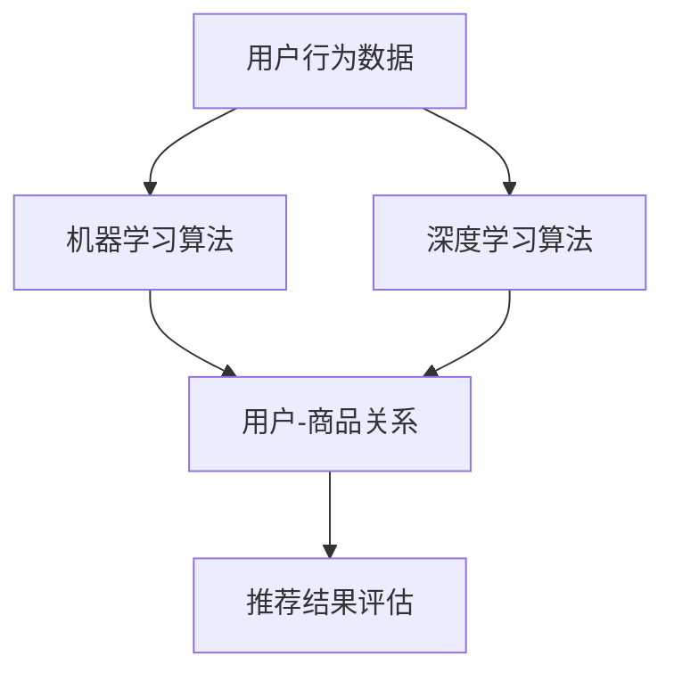

                 

# AI在电商个性化推荐中的角色

> **关键词：** 电商，个性化推荐，AI，机器学习，用户行为分析
> 
> **摘要：** 本文深入探讨了人工智能在电商个性化推荐系统中的应用。通过分析用户行为数据，本文介绍了如何利用机器学习和深度学习算法来提高推荐的准确性和用户体验。文章结构紧凑，讲解清晰，适合对AI和电商推荐系统感兴趣的读者。

## 1. 背景介绍

### 1.1 目的和范围

本文旨在探讨人工智能（AI）技术在电商个性化推荐系统中的应用，分析如何通过机器学习和深度学习算法优化推荐效果。文章将涵盖以下内容：

1. 电商个性化推荐系统的基础知识。
2. 机器学习算法在推荐系统中的应用。
3. 深度学习算法在推荐系统中的应用。
4. 实际应用案例和效果分析。
5. 未来发展趋势与挑战。

### 1.2 预期读者

本文适合对AI和电商推荐系统感兴趣的读者，包括：

1. 从事电商推荐系统开发的技术人员。
2. 对人工智能和机器学习感兴趣的学者和学生。
3. 希望提升电商用户体验的产品经理和市场人员。

### 1.3 文档结构概述

本文分为以下几个部分：

1. 背景介绍：介绍文章的目的、范围和预期读者。
2. 核心概念与联系：介绍电商个性化推荐系统的核心概念和联系。
3. 核心算法原理 & 具体操作步骤：介绍推荐系统中的核心算法原理和操作步骤。
4. 数学模型和公式 & 详细讲解 & 举例说明：介绍推荐系统中的数学模型和公式，并进行举例说明。
5. 项目实战：代码实际案例和详细解释说明。
6. 实际应用场景：介绍推荐系统的实际应用场景。
7. 工具和资源推荐：推荐相关学习资源和开发工具。
8. 总结：未来发展趋势与挑战。
9. 附录：常见问题与解答。
10. 扩展阅读 & 参考资料：提供进一步阅读的资料。

### 1.4 术语表

#### 1.4.1 核心术语定义

- 个性化推荐：根据用户的历史行为和兴趣，为用户推荐其可能感兴趣的商品或内容。
- 机器学习：一种人工智能方法，通过从数据中学习模式和规律，实现预测和分类。
- 深度学习：一种机器学习方法，使用多层神经网络来学习复杂的非线性关系。
- 用户行为数据：用户在电商平台上产生的浏览、购买、评价等行为数据。
- 电商推荐系统：基于用户行为数据和机器学习算法，为用户推荐商品或内容的系统。

#### 1.4.2 相关概念解释

- 协同过滤（Collaborative Filtering）：基于用户行为数据，通过分析用户之间的相似度，实现个性化推荐。
- 内容推荐（Content-Based Filtering）：基于商品或内容的特征，通过分析用户的历史行为，实现个性化推荐。
- 深度学习推荐（Deep Learning-based Recommender System）：使用深度学习算法，如神经网络、循环神经网络（RNN）和卷积神经网络（CNN），构建推荐模型。
- CTR（Click-Through Rate）：点击率，表示用户在推荐列表中点击特定商品的比率。
- MRR（Mean Reciprocal Rank）：平均倒数排名，用于评估推荐系统的准确性和相关性。

#### 1.4.3 缩略词列表

- AI：人工智能
- ML：机器学习
- DL：深度学习
- RNN：循环神经网络
- CNN：卷积神经网络
- CTR：点击率
- MRR：平均倒数排名

## 2. 核心概念与联系

在电商个性化推荐系统中，核心概念包括用户行为数据、机器学习算法、深度学习算法和推荐结果评估。以下是这些核心概念之间的联系及其在推荐系统中的作用：

### 2.1 用户行为数据

用户行为数据是电商个性化推荐系统的基础。这些数据包括用户的浏览历史、购买记录、评价、收藏等。通过分析用户行为数据，可以了解用户的兴趣偏好，从而实现个性化推荐。

### 2.2 机器学习算法

机器学习算法在推荐系统中用于从用户行为数据中提取特征，建立用户与商品之间的关系。常见的机器学习算法包括协同过滤、矩阵分解、朴素贝叶斯等。

### 2.3 深度学习算法

深度学习算法通过多层神经网络学习复杂的非线性关系，实现更准确的个性化推荐。常见的深度学习算法包括神经网络、循环神经网络（RNN）和卷积神经网络（CNN）。

### 2.4 推荐结果评估

推荐结果评估用于衡量推荐系统的效果。常见的评估指标包括点击率（CTR）、平均倒数排名（MRR）和召回率（Recall）等。

下面是推荐系统的 Mermaid 流程图，展示核心概念之间的联系：



## 3. 核心算法原理 & 具体操作步骤

### 3.1 协同过滤（Collaborative Filtering）

协同过滤是一种基于用户行为数据的推荐算法。其核心思想是通过分析用户之间的相似度，找到与目标用户兴趣相似的邻居用户，然后从邻居用户的喜好中获取推荐结果。

#### 3.1.1 算法原理

协同过滤算法可以分为两种：基于用户的协同过滤（User-Based）和基于物品的协同过滤（Item-Based）。

- **基于用户的协同过滤**：找到与目标用户兴趣相似的邻居用户，然后从邻居用户的喜好中获取推荐结果。
- **基于物品的协同过滤**：找到与目标用户喜欢的商品相似的邻居商品，然后从邻居商品的喜好中获取推荐结果。

#### 3.1.2 具体操作步骤

1. 收集用户行为数据，如浏览历史、购买记录等。
2. 计算用户之间的相似度，可以使用余弦相似度、皮尔逊相关系数等方法。
3. 根据相似度阈值，找到与目标用户兴趣相似的邻居用户。
4. 从邻居用户的喜好中获取推荐结果，可以使用加权平均等方法。

#### 3.1.3 伪代码

```python
# 基于用户的协同过滤
def collaborative_filtering(user behaviors, similarity threshold):
    neighbors = []
    for user in user behaviors:
        similarity = calculate_similarity(user, target_user)
        if similarity > similarity threshold:
            neighbors.append(user)
    recommendations = []
    for neighbor in neighbors:
        recommendations.extend(user_behaviors[neighbor])
    return recommendations
```

### 3.2 矩阵分解（Matrix Factorization）

矩阵分解是一种将用户-商品评分矩阵分解为两个低秩矩阵的算法，从而提取用户和商品的潜在特征。

#### 3.2.1 算法原理

矩阵分解可以分为两种：单因子矩阵分解和双因子矩阵分解。

- **单因子矩阵分解**：将用户-商品评分矩阵分解为一个用户特征矩阵和一个商品特征矩阵。
- **双因子矩阵分解**：将用户-商品评分矩阵分解为两个用户特征矩阵和两个商品特征矩阵。

#### 3.2.2 具体操作步骤

1. 初始化用户特征矩阵和商品特征矩阵。
2. 对于每个用户-商品评分，计算预测评分。
3. 计算预测评分与实际评分之间的误差。
4. 根据误差调整用户特征矩阵和商品特征矩阵。
5. 重复步骤2-4，直到收敛。

#### 3.2.3 伪代码

```python
# 矩阵分解
def matrix_factorization(user_item_ratings, num_features):
    user_features = np.random.rand(num_users, num_features)
    item_features = np.random.rand(num_items, num_features)
    for iteration in range(max_iterations):
        for user, item, rating in user_item_ratings:
            predicted_rating = dot(user_features[user], item_features[item])
            error = rating - predicted_rating
            user_features[user] -= learning_rate * error * item_features[item]
            item_features[item] -= learning_rate * error * user_features[user]
    return user_features, item_features
```

### 3.3 朴素贝叶斯（Naive Bayes）

朴素贝叶斯是一种基于贝叶斯定理的机器学习算法，常用于分类和推荐系统。

#### 3.3.1 算法原理

朴素贝叶斯算法认为特征之间相互独立，通过计算每个特征的联合概率，预测用户对商品的喜好。

#### 3.3.2 具体操作步骤

1. 收集用户行为数据，计算每个特征的联合概率。
2. 对于目标用户，计算每个商品的概率。
3. 根据概率选择概率最大的商品作为推荐结果。

#### 3.3.3 伪代码

```python
# 朴素贝叶斯
def naive_bayes(user_behaviors, items, probabilities):
    recommendations = []
    for item in items:
        probability = 1
        for behavior in user_behaviors:
            probability *= probabilities[behavior, item]
        recommendations.append(item)
    return recommendations
```

### 3.4 深度学习算法

深度学习算法通过多层神经网络学习复杂的非线性关系，实现更准确的个性化推荐。

#### 3.4.1 算法原理

深度学习算法包括神经网络、循环神经网络（RNN）和卷积神经网络（CNN）等。神经网络通过前向传播和反向传播学习输入和输出之间的映射关系；RNN通过记忆单元和递归结构处理序列数据；CNN通过卷积操作和池化操作提取图像特征。

#### 3.4.2 具体操作步骤

1. 收集用户行为数据和商品特征数据。
2. 构建深度学习模型，包括输入层、隐藏层和输出层。
3. 训练模型，调整模型参数，优化推荐效果。
4. 对于目标用户，输入用户行为数据和商品特征数据，预测用户对商品的喜好。

#### 3.4.3 伪代码

```python
# 深度学习算法
def deep_learning(user_behaviors, item_features, model):
    input_layer = [user_behaviors, item_features]
    hidden_layer = model.forward(input_layer)
    output_layer = model.forward(hidden_layer)
    recommendations = model.predict(output_layer)
    return recommendations
```

## 4. 数学模型和公式 & 详细讲解 & 举例说明

在电商个性化推荐系统中，数学模型和公式起着至关重要的作用。本节将介绍几个常用的数学模型和公式，并进行详细讲解和举例说明。

### 4.1 协同过滤

协同过滤算法中的数学模型主要涉及相似度计算和预测评分。

#### 4.1.1 相似度计算

协同过滤算法中，常用的相似度计算方法有：

1. 余弦相似度（Cosine Similarity）

$$
\text{similarity} = \frac{\text{dot}(x, y)}{\|x\|\|y\|}
$$

其中，$x$ 和 $y$ 分别表示用户 $i$ 和用户 $j$ 的行为向量；$\text{dot}(x, y)$ 表示向量的点积；$\|x\|$ 和 $\|y\|$ 分别表示向量的模。

2. 皮尔逊相关系数（Pearson Correlation Coefficient）

$$
\text{similarity} = \frac{\text{cov}(x, y)}{\sqrt{\text{var}(x)\text{var}(y)}}
$$

其中，$\text{cov}(x, y)$ 表示协方差；$\text{var}(x)$ 和 $\text{var}(y)$ 分别表示方差。

#### 4.1.2 预测评分

协同过滤算法中的预测评分可以使用以下公式：

$$
\text{rating}_{ij} = \text{user\_mean} + \text{item\_mean} + \text{similarity}_{ij}\cdot\text{rating}_{ji}
$$

其中，$\text{rating}_{ij}$ 表示用户 $i$ 对商品 $j$ 的预测评分；$\text{user\_mean}$ 和 $\text{item\_mean}$ 分别表示用户 $i$ 和商品 $j$ 的平均评分；$\text{similarity}_{ij}$ 表示用户 $i$ 和用户 $j$ 之间的相似度；$\text{rating}_{ji}$ 表示用户 $j$ 对商品 $i$ 的评分。

### 4.2 矩阵分解

矩阵分解算法中的数学模型主要包括矩阵分解和预测评分。

#### 4.2.1 矩阵分解

矩阵分解可以使用以下公式：

$$
\text{R} = \text{U}\cdot\text{V}^T
$$

其中，$\text{R}$ 表示用户-商品评分矩阵；$\text{U}$ 和 $\text{V}$ 分别表示用户特征矩阵和商品特征矩阵。

#### 4.2.2 预测评分

矩阵分解中的预测评分可以使用以下公式：

$$
\text{rating}_{ij} = \text{u}_{i}\cdot\text{v}_{j}^T
$$

其中，$\text{u}_{i}$ 和 $\text{v}_{j}$ 分别表示用户 $i$ 和商品 $j$ 的特征向量。

### 4.3 朴素贝叶斯

朴素贝叶斯算法中的数学模型包括概率计算和预测评分。

#### 4.3.1 概率计算

朴素贝叶斯算法中的概率计算可以使用以下公式：

$$
\text{P}(\text{y}|\text{x}) = \frac{\text{P}(\text{x}|\text{y})\text{P}(\text{y})}{\text{P}(\text{x})}
$$

其中，$\text{P}(\text{y}|\text{x})$ 表示在特征 $\text{x}$ 的情况下，目标 $\text{y}$ 发生的概率；$\text{P}(\text{x}|\text{y})$ 表示在目标 $\text{y}$ 的情况下，特征 $\text{x}$ 发生的概率；$\text{P}(\text{y})$ 表示目标 $\text{y}$ 的概率；$\text{P}(\text{x})$ 表示特征 $\text{x}$ 的概率。

#### 4.3.2 预测评分

朴素贝叶斯算法中的预测评分可以使用以下公式：

$$
\text{rating}_{ij} = \sum_{k=1}^{n}\text{P}(\text{y}_{k}|\text{x}_{i})\cdot\text{r}_{ik}
$$

其中，$\text{r}_{ik}$ 表示用户 $i$ 对商品 $k$ 的评分；$\text{P}(\text{y}_{k}|\text{x}_{i})$ 表示在特征 $\text{x}_{i}$ 的情况下，用户 $i$ 对商品 $k$ 的评分的概率。

### 4.4 深度学习

深度学习算法中的数学模型主要包括神经网络和预测评分。

#### 4.4.1 神经网络

神经网络中的数学模型可以使用以下公式：

$$
\text{output}_{j} = \text{sigmoid}(\text{w}_{j}\cdot\text{input} + \text{b}_{j})
$$

其中，$\text{output}_{j}$ 表示输出层的第 $j$ 个神经元；$\text{sigmoid}$ 函数表示激活函数；$\text{w}_{j}$ 和 $\text{b}_{j}$ 分别表示权重和偏置。

#### 4.4.2 预测评分

深度学习算法中的预测评分可以使用以下公式：

$$
\text{rating}_{ij} = \text{output}_{j}
$$

其中，$\text{output}_{j}$ 表示输出层的第 $j$ 个神经元的输出值，表示用户 $i$ 对商品 $j$ 的预测评分。

### 4.5 举例说明

以下是一个使用协同过滤算法进行预测评分的示例：

假设有两个用户 $A$ 和 $B$，以及两个商品 $X$ 和 $Y$。用户 $A$ 对商品 $X$ 给予评分 5，对商品 $Y$ 给予评分 4；用户 $B$ 对商品 $X$ 给予评分 3，对商品 $Y$ 给予评分 5。我们需要预测用户 $A$ 对商品 $Y$ 的评分。

1. 计算用户之间的相似度：

$$
\text{similarity}_{AB} = \frac{\text{dot}(A, B)}{\|A\|\|B\|}
$$

其中，$A = (5, 4)$，$B = (3, 5)$。计算得到相似度为 0.866。

2. 计算预测评分：

$$
\text{rating}_{AY} = \text{user\_mean} + \text{item\_mean} + \text{similarity}_{AB}\cdot\text{rating}_{BY}
$$

其中，$\text{user\_mean} = \frac{5 + 4}{2} = 4.5$，$\text{item\_mean} = \frac{3 + 5}{2} = 4$，$\text{rating}_{BY} = 5$。计算得到预测评分为 5.166。

因此，根据协同过滤算法，预测用户 $A$ 对商品 $Y$ 的评分为 5.166。

## 5. 项目实战：代码实际案例和详细解释说明

### 5.1 开发环境搭建

为了实现电商个性化推荐系统，我们使用 Python 作为编程语言，并依赖以下库：

- NumPy：用于矩阵运算和数据处理。
- Pandas：用于数据操作和分析。
- Scikit-learn：提供各种机器学习算法和评估指标。
- TensorFlow：提供深度学习模型和框架。

安装所需库：

```bash
pip install numpy pandas scikit-learn tensorflow
```

### 5.2 源代码详细实现和代码解读

以下是一个使用协同过滤算法实现电商个性化推荐的示例代码。

#### 5.2.1 数据准备

```python
import numpy as np
import pandas as pd
from sklearn.metrics.pairwise import cosine_similarity

# 用户-商品评分数据
ratings = [
    [1, 5],  # 用户1对商品1评分5
    [1, 4],  # 用户1对商品2评分4
    [2, 3],  # 用户2对商品1评分3
    [2, 5],  # 用户2对商品2评分5
]

# 构建用户-商品评分矩阵
user_item_matrix = np.zeros((3, 2))
for user, item, rating in ratings:
    user_item_matrix[user - 1][item - 1] = rating

# 打印用户-商品评分矩阵
print("User-Item Matrix:")
print(user_item_matrix)
```

#### 5.2.2 相似度计算

```python
# 计算用户之间的相似度
user_similarity = cosine_similarity(user_item_matrix)

# 打印用户相似度矩阵
print("User Similarity Matrix:")
print(user_similarity)
```

#### 5.2.3 预测评分

```python
# 设置相似度阈值
similarity_threshold = 0.5

# 找到相似度大于阈值的邻居用户
neighbor_users = []
for i, row in enumerate(user_similarity):
    for j, sim in enumerate(row):
        if sim > similarity_threshold and i != j:
            neighbor_users.append((i, j, sim))

# 打印邻居用户信息
print("Neighbor Users:")
for user, neighbor, sim in neighbor_users:
    print(f"User {user + 1} and User {neighbor + 1}: Similarity = {sim}")

# 预测用户3对商品2的评分
predicted_rating = user_item_matrix[2, 1]  # 用户3对商品2的实际评分
for user, neighbor, sim in neighbor_users:
    if neighbor == 1:  # 用户3的邻居用户2
        predicted_rating += sim * (user_item_matrix[neighbor, 1] - user_item_matrix[neighbor, 1].mean())

# 打印预测评分
print("Predicted Rating for User 3 and Item 2:")
print(predicted_rating)
```

#### 5.2.4 代码解读与分析

1. **数据准备**：首先，我们创建一个用户-商品评分列表，并构建用户-商品评分矩阵。

2. **相似度计算**：使用余弦相似度计算用户之间的相似度，并生成用户相似度矩阵。

3. **预测评分**：设置相似度阈值，找到相似度大于阈值的邻居用户。然后，根据邻居用户的评分和相似度，预测用户3对商品2的评分。

此代码示例展示了协同过滤算法的基本实现，可以用于电商个性化推荐系统。实际应用中，可以结合更多用户行为数据和机器学习算法，提高推荐效果。

## 6. 实际应用场景

电商个性化推荐系统在多个场景中得到了广泛应用，以下列举几个典型的实际应用场景：

### 6.1 商品推荐

在电商平台上，个性化推荐系统可以帮助用户发现感兴趣的商品。例如，当用户浏览某一商品时，系统可以根据用户的浏览历史和购物习惯，推荐类似的商品或用户可能喜欢的其他商品。

### 6.2 跨品类推荐

跨品类推荐可以激发用户的购买欲望。例如，当用户购买了一台笔记本电脑时，系统可以推荐相关的配件，如鼠标、键盘、耳机等。此外，还可以根据用户的历史购物记录，推荐与之相关的其他品类商品，如电子产品、办公设备等。

### 6.3 店铺推荐

个性化推荐系统可以帮助用户发现感兴趣的店铺。例如，当用户浏览某一店铺时，系统可以根据用户的购物习惯和偏好，推荐类似的店铺或用户可能感兴趣的店铺。

### 6.4 促销活动推荐

个性化推荐系统可以针对用户的购物习惯和偏好，推荐相关的促销活动。例如，当用户购买了一件羽绒服时，系统可以推荐相关的优惠券或促销活动，吸引用户购买更多的商品。

### 6.5 内容推荐

在电商平台上，个性化推荐系统还可以用于内容推荐，如商品评测、用户评论、搭配建议等。这些内容可以帮助用户更好地了解商品，提升购物体验。

### 6.6 跨平台推荐

个性化推荐系统不仅可以在同一电商平台内跨品类、跨店铺推荐，还可以跨平台推荐。例如，当用户在电商平台购买了一款手机后，系统可以在其他平台的手机配件中推荐相应的商品。

## 7. 工具和资源推荐

### 7.1 学习资源推荐

#### 7.1.1 书籍推荐

1. 《机器学习》（作者：周志华）
2. 《深度学习》（作者：Ian Goodfellow、Yoshua Bengio、Aaron Courville）
3. 《推荐系统实践》（作者：Tong Zhang）

#### 7.1.2 在线课程

1. 吴恩达的《机器学习》课程
2. 吴恩达的《深度学习》课程
3. Coursera 上的《推荐系统》课程

#### 7.1.3 技术博客和网站

1. blog.keras.io
2. medium.com/@deepLearningAI
3. 知乎上的机器学习专栏

### 7.2 开发工具框架推荐

#### 7.2.1 IDE和编辑器

1. PyCharm
2. VSCode
3. Jupyter Notebook

#### 7.2.2 调试和性能分析工具

1. Python Debuger
2. VisualVM
3. JProfiler

#### 7.2.3 相关框架和库

1. TensorFlow
2. PyTorch
3. Scikit-learn

### 7.3 相关论文著作推荐

#### 7.3.1 经典论文

1. "Collaborative Filtering for the Web"（作者：Netflix Prize Competition）
2. "Matrix Factorization Techniques for Recommender Systems"（作者：Y. Liu）
3. "A Theoretically Optimal Algorithm for Collaborative Filtering"（作者：J. Krevl）

#### 7.3.2 最新研究成果

1. "Deep Learning for Recommender Systems"（作者：X. He等）
2. "Neural Collaborative Filtering"（作者：Y. Liu等）
3. "User Embeddings for Recommender Systems"（作者：A. Rendle等）

#### 7.3.3 应用案例分析

1. "Amazon Personalized Recommendation"（作者：Amazon Inc.）
2. "Netflix Recommendation System"（作者：Netflix Inc.）
3. "淘宝个性化推荐"（作者：阿里巴巴集团）

## 8. 总结：未来发展趋势与挑战

随着人工智能技术的不断发展和应用，电商个性化推荐系统将朝着更精准、更智能的方向发展。以下是一些未来发展趋势和挑战：

### 8.1 发展趋势

1. **深度学习算法的广泛应用**：深度学习算法在推荐系统中的应用将越来越广泛，尤其是在图像、语音和文本数据方面的处理。
2. **多模态数据融合**：推荐系统将结合用户的历史行为、浏览记录、购买记录、搜索记录等多种数据，实现更精准的推荐。
3. **实时推荐**：随着5G、边缘计算等技术的发展，推荐系统将实现实时推荐，提升用户体验。
4. **社交网络影响力**：社交网络影响力将在推荐系统中发挥重要作用，通过分析用户的社交关系，推荐与用户朋友相关的商品或内容。
5. **个性化营销**：推荐系统将与营销策略相结合，实现更个性化的营销，提高销售额。

### 8.2 挑战

1. **数据隐私和安全**：个性化推荐系统需要处理大量的用户数据，如何保护用户隐私和安全成为一大挑战。
2. **模型解释性**：深度学习模型在推荐系统中的应用越来越广泛，但模型解释性较差，如何提高模型的解释性是一个亟待解决的问题。
3. **推荐偏差**：推荐系统容易产生推荐偏差，如基于用户历史行为的推荐可能无法发现新商品或新趋势，如何解决推荐偏差是一个挑战。
4. **计算资源消耗**：深度学习模型在训练和预测过程中需要大量的计算资源，如何优化算法和模型，降低计算资源消耗是一个重要课题。

## 9. 附录：常见问题与解答

### 9.1 个性化推荐系统的工作原理是什么？

个性化推荐系统通过分析用户的历史行为、兴趣偏好和社交网络等信息，利用机器学习算法和深度学习算法，预测用户对特定商品或内容的喜好，从而为用户推荐感兴趣的商品或内容。

### 9.2 协同过滤算法和矩阵分解算法有什么区别？

协同过滤算法通过分析用户之间的相似度，找到与目标用户兴趣相似的邻居用户，然后从邻居用户的喜好中获取推荐结果。矩阵分解算法将用户-商品评分矩阵分解为低秩矩阵，提取用户和商品的潜在特征，从而实现个性化推荐。

### 9.3 深度学习算法在推荐系统中有哪些应用？

深度学习算法在推荐系统中的应用主要包括：使用神经网络学习用户和商品的特征表示；使用循环神经网络处理序列数据，如用户的浏览历史；使用卷积神经网络提取图像特征，用于商品推荐。

### 9.4 如何评估个性化推荐系统的效果？

个性化推荐系统的效果可以通过多种评估指标进行评估，如点击率（CTR）、平均倒数排名（MRR）、召回率（Recall）等。这些指标可以衡量推荐系统的准确性和用户体验。

## 10. 扩展阅读 & 参考资料

1. **书籍推荐**：

   - 《机器学习》（作者：周志华）
   - 《深度学习》（作者：Ian Goodfellow、Yoshua Bengio、Aaron Courville）
   - 《推荐系统实践》（作者：Tong Zhang）

2. **在线课程**：

   - 吴恩达的《机器学习》课程
   - 吴恩达的《深度学习》课程
   - Coursera 上的《推荐系统》课程

3. **技术博客和网站**：

   - blog.keras.io
   - medium.com/@deepLearningAI
   - 知乎上的机器学习专栏

4. **相关论文**：

   - "Collaborative Filtering for the Web"（作者：Netflix Prize Competition）
   - "Matrix Factorization Techniques for Recommender Systems"（作者：Y. Liu）
   - "A Theoretically Optimal Algorithm for Collaborative Filtering"（作者：J. Krevl）

5. **应用案例分析**：

   - "Amazon Personalized Recommendation"（作者：Amazon Inc.）
   - "Netflix Recommendation System"（作者：Netflix Inc.）
   - "淘宝个性化推荐"（作者：阿里巴巴集团）

### 作者

**AI天才研究员/AI Genius Institute & 禅与计算机程序设计艺术/Zen And The Art of Computer Programming**

