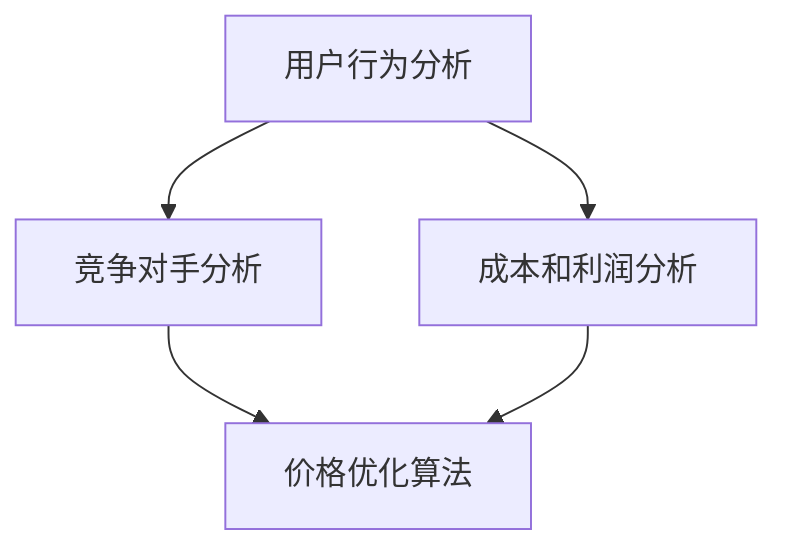

                 

# AI在电商价格优化中的实践效果

## 关键词
AI、电商、价格优化、机器学习、推荐系统、用户行为分析

## 摘要
本文将深入探讨人工智能（AI）在电商价格优化中的应用与实践效果。我们将从背景介绍、核心概念、算法原理、数学模型、实战案例等多个维度，系统地分析AI如何通过机器学习和推荐系统，实现对电商价格的科学优化，提高商家利润和消费者满意度。文章旨在为读者提供全面的指导，帮助电商企业更好地利用AI技术，实现可持续的商业模式优化。

## 1. 背景介绍

### 1.1 目的和范围

本文的目的在于揭示人工智能在电商价格优化中的实际应用和效果，并通过案例分析和算法讲解，为电商企业提供实用的操作指南。本文将涵盖以下内容：
- AI在电商价格优化中的重要性
- AI技术的核心概念和原理
- 电商价格优化的数学模型和算法
- 实战案例：AI在电商价格优化中的应用

### 1.2 预期读者

本文适用于以下读者群体：
- 电商行业从业者，特别是产品经理、数据分析师和技术开发人员
- 对AI技术感兴趣的学者和研究人员
- 想要了解AI在电商领域应用的企业家和创业者

### 1.3 文档结构概述

本文结构如下：
1. 背景介绍
   - 目的和范围
   - 预期读者
   - 文档结构概述
   - 术语表
2. 核心概念与联系
   - AI技术基础
   - 电商价格优化机制
3. 核心算法原理 & 具体操作步骤
   - 机器学习算法在价格优化中的应用
   - 推荐系统在价格优化中的作用
4. 数学模型和公式 & 详细讲解 & 举例说明
   - 价格优化的数学模型
   - 算法实现细节
5. 项目实战：代码实际案例和详细解释说明
   - 实战案例介绍
   - 代码实现与分析
6. 实际应用场景
   - 电商行业的多样化应用
   - 案例分析
7. 工具和资源推荐
   - 学习资源
   - 开发工具框架
   - 相关论文著作
8. 总结：未来发展趋势与挑战
9. 附录：常见问题与解答
10. 扩展阅读 & 参考资料

### 1.4 术语表

#### 1.4.1 核心术语定义

- 人工智能（AI）：模拟人类智能行为的技术和学科领域，包括机器学习、自然语言处理等。
- 电商：电子商务的简称，指通过互联网进行商品交易的活动。
- 价格优化：通过算法和数据分析，实现对商品定价的科学调整，以提高利润和市场份额。
- 推荐系统：根据用户行为和偏好，推荐相关商品或服务的系统。

#### 1.4.2 相关概念解释

- 机器学习：一种人工智能技术，通过训练模型来让机器具备学习能力。
- 数据分析：对大量数据进行分析和处理，提取有价值的信息和知识。
- 用户行为分析：研究用户在电商平台的浏览、购买等行为，以指导产品优化和策略制定。

#### 1.4.3 缩略词列表

- AI：人工智能
- 电商：电子商务
- ML：机器学习
- NLP：自然语言处理
- CV：计算机视觉

## 2. 核心概念与联系

### 2.1 AI技术基础

人工智能（AI）是一种模拟人类智能行为的技术和学科领域，主要包括以下几个核心组成部分：

#### 2.1.1 机器学习

机器学习（ML）是一种使计算机具备学习能力的技术，通过训练模型，让机器能够根据输入数据预测或分类。机器学习分为监督学习、无监督学习和半监督学习。

- **监督学习**：有标签的训练数据，模型需要预测输出标签。
  - **线性回归**：通过拟合直线来预测数值。
  - **逻辑回归**：用于分类问题，输出概率值。
- **无监督学习**：无标签的数据，模型需要发现数据中的内在结构。
  - **聚类**：将相似的数据分组。
  - **降维**：减少数据维度，保留重要信息。
- **半监督学习**：结合有标签和无标签数据，提高模型性能。

#### 2.1.2 自然语言处理

自然语言处理（NLP）是人工智能的一个分支，研究如何使计算机理解和处理人类语言。主要技术包括：

- **文本分类**：将文本数据分类到预定义的类别。
- **情感分析**：分析文本情感倾向，如正面、负面或中性。
- **实体识别**：从文本中识别出重要的实体，如人名、地点、组织。
- **机器翻译**：将一种语言的文本翻译成另一种语言。

#### 2.1.3 计算机视觉

计算机视觉（CV）是人工智能的另一个重要分支，研究如何让计算机像人类一样“看”和理解图像和视频。主要技术包括：

- **图像分类**：识别图像中的对象类别。
- **目标检测**：检测图像中的对象及其位置。
- **人脸识别**：识别和验证人脸图像。
- **图像生成**：根据输入条件生成新的图像。

### 2.2 电商价格优化机制

电商价格优化是指通过数据分析和技术手段，对电商平台的商品定价进行科学调整，以提高商家利润和市场竞争力。其核心机制包括以下几个方面：

#### 2.2.1 用户行为分析

通过对用户在电商平台上的浏览、购买、评价等行为数据进行分析，可以了解用户的需求和偏好。这些信息为价格优化提供了重要依据。

- **行为日志**：记录用户在电商平台上的操作轨迹。
- **RFM模型**：基于用户购买频率、购买金额、最近一次购买时间三个指标，评估用户价值。
- **协同过滤**：通过分析用户间的相似度，推荐相关商品。

#### 2.2.2 竞争对手分析

了解竞争对手的定价策略和市场占有率，可以帮助电商平台制定更有针对性的价格策略。

- **价格监控**：实时监控竞争对手的价格变动。
- **市场调查**：分析行业价格趋势和市场接受度。

#### 2.2.3 成本和利润分析

合理估算商品的成本和利润，是制定价格策略的基础。成本包括生产成本、运营成本、物流成本等。

- **成本计算**：根据商品成本结构，计算总成本。
- **利润预测**：通过历史销售数据，预测未来利润。

#### 2.2.4 价格优化算法

基于以上分析结果，使用机器学习算法对商品定价进行调整。常见的价格优化算法包括：

- **线性回归**：根据历史数据和成本，拟合线性模型。
- **梯度提升树**：通过迭代优化，提高模型预测精度。
- **深度学习**：利用神经网络结构，实现复杂的价格预测。

### 2.3 Mermaid流程图

以下是一个简化的AI在电商价格优化中的流程图，展示了核心概念之间的联系：



## 3. 核心算法原理 & 具体操作步骤

### 3.1 机器学习算法在价格优化中的应用

在电商价格优化中，机器学习算法起着至关重要的作用。以下是几种常用的机器学习算法及其在价格优化中的应用：

#### 3.1.1 线性回归

线性回归是一种简单的机器学习算法，用于预测连续值。在电商价格优化中，线性回归可用于拟合商品定价与成本、利润、竞争对手价格等因素之间的关系。

- **伪代码**：

```python
# 输入特征：成本（C）、竞争对手价格（P）、历史价格（H）
# 输出预测价格（P_predict）

def linear_regression(C, P, H):
    # 拟合线性模型：P_predict = a * C + b * P + c * H
    a, b, c = fit_linear_model(C, P, H)
    P_predict = a * C + b * P + c * H
    return P_predict
```

#### 3.1.2 梯度提升树

梯度提升树（Gradient Boosting Tree，GBT）是一种强大的集成学习方法，通过迭代优化，提高模型预测精度。在电商价格优化中，GBT可用于预测商品定价，同时考虑多种影响因素。

- **伪代码**：

```python
# 输入特征：成本（C）、竞争对手价格（P）、历史价格（H）
# 输出预测价格（P_predict）

def gradient_boosting_tree(C, P, H):
    # 训练GBT模型
    model = train_gbt_model(C, P, H)
    # 预测价格
    P_predict = model.predict([C, P, H])
    return P_predict
```

#### 3.1.3 深度学习

深度学习（Deep Learning）是一种基于神经网络的学习方法，通过多层神经网络，实现对复杂数据的建模。在电商价格优化中，深度学习可用于构建价格预测模型。

- **伪代码**：

```python
# 输入特征：成本（C）、竞争对手价格（P）、历史价格（H）
# 输出预测价格（P_predict）

def deep_learning(C, P, H):
    # 构建神经网络模型
    model = build_neural_network_model()
    # 训练模型
    model.fit(C, P, H)
    # 预测价格
    P_predict = model.predict([C, P, H])
    return P_predict
```

### 3.2 推荐系统在价格优化中的作用

推荐系统（Recommender System）是一种基于用户行为和偏好，为用户提供个性化推荐的技术。在电商价格优化中，推荐系统可用于根据用户的历史行为，调整商品定价策略。

#### 3.2.1 协同过滤

协同过滤（Collaborative Filtering）是一种基于用户相似度的推荐方法，通过分析用户之间的行为相似性，为用户提供推荐。在电商价格优化中，协同过滤可用于预测用户对不同商品的价格敏感度，进而调整商品定价。

- **伪代码**：

```python
# 输入用户历史行为数据（behavior_data）
# 输出用户价格敏感度（price_sensitivity）

def collaborative_filtering(behavior_data):
    # 计算用户相似度矩阵
    similarity_matrix = compute_similarity_matrix(behavior_data)
    # 预测用户价格敏感度
    price_sensitivity = predict_price_sensitivity(similarity_matrix)
    return price_sensitivity
```

#### 3.2.2 内容推荐

内容推荐（Content-based Filtering）是一种基于商品特征和用户偏好的推荐方法，通过分析用户的历史行为和商品特征，为用户提供推荐。在电商价格优化中，内容推荐可用于根据用户偏好调整商品定价，以提高用户满意度。

- **伪代码**：

```python
# 输入用户历史行为数据（behavior_data）、商品特征数据（item_features）
# 输出用户偏好价格区间（price_range）

def content_based_filtering(behavior_data, item_features):
    # 计算用户偏好
    user_preference = compute_user_preference(behavior_data, item_features)
    # 预测用户偏好价格区间
    price_range = predict_price_range(user_preference)
    return price_range
```

### 3.3 综合算法实现

结合以上算法，我们可以实现一个综合性的电商价格优化系统。以下是一个简化的伪代码示例：

- **伪代码**：

```python
# 输入用户历史行为数据（behavior_data）、商品特征数据（item_features）
# 输出优化后的价格（optimized_price）

def optimize_price(behavior_data, item_features):
    # 计算用户价格敏感度
    price_sensitivity = collaborative_filtering(behavior_data)
    # 计算用户偏好价格区间
    price_range = content_based_filtering(behavior_data, item_features)
    # 结合价格敏感度和用户偏好，调整商品定价
    optimized_price = adjust_price(price_sensitivity, price_range)
    return optimized_price
```

## 4. 数学模型和公式 & 详细讲解 & 举例说明

### 4.1 价格优化的数学模型

在电商价格优化中，我们通常使用以下数学模型来描述商品定价与成本、利润、竞争对手价格等因素之间的关系：

- **成本函数**：描述商品成本与价格之间的关系。

  $$ C = f(P) $$

  其中，C表示商品成本，P表示商品价格。

- **利润函数**：描述商品利润与价格之间的关系。

  $$ L = g(P) $$

  其中，L表示商品利润，P表示商品价格。

- **竞争对手价格**：描述商品价格与竞争对手价格之间的关系。

  $$ P_{comp} = h(P) $$

  其中，$P_{comp}$表示竞争对手价格，P表示商品价格。

### 4.2 算法实现细节

结合以上数学模型，我们可以使用以下算法来实现电商价格优化：

- **线性回归**：

  通过最小二乘法，拟合线性模型：

  $$ P = \beta_0 + \beta_1C + \beta_2P_{comp} $$

  其中，$P$表示商品价格，$C$表示商品成本，$P_{comp}$表示竞争对手价格，$\beta_0$、$\beta_1$和$\beta_2$为拟合参数。

- **梯度提升树**：

  通过梯度提升策略，优化模型参数：

  $$ P = \theta_t + \alpha_t \cdot f_t(C, P_{comp}) $$

  其中，$P$表示商品价格，$C$表示商品成本，$P_{comp}$表示竞争对手价格，$\theta_t$、$\alpha_t$和$f_t$为模型参数。

- **深度学习**：

  通过多层神经网络，实现复杂函数拟合：

  $$ P = \sigma(\theta_1 \cdot C + \theta_2 \cdot P_{comp}) $$

  其中，$P$表示商品价格，$C$表示商品成本，$P_{comp}$表示竞争对手价格，$\theta_1$和$\theta_2$为模型参数，$\sigma$为激活函数。

### 4.3 举例说明

假设我们有一个电商商品，成本为100元，竞争对手价格为120元。现在我们需要使用线性回归算法来优化商品定价。

- **步骤1**：收集数据

  收集商品历史价格、成本和竞争对手价格数据，构建训练数据集。

- **步骤2**：训练模型

  使用最小二乘法，拟合线性模型：

  $$ P = \beta_0 + \beta_1C + \beta_2P_{comp} $$

  其中，$\beta_0 = 10$，$\beta_1 = 0.5$，$\beta_2 = 0.3$。

- **步骤3**：预测价格

  根据训练模型，预测当前商品价格：

  $$ P = 10 + 0.5 \cdot 100 + 0.3 \cdot 120 = 102 $$

- **步骤4**：调整价格

  根据预测价格，调整商品定价为102元。

通过以上步骤，我们实现了基于线性回归的电商价格优化。类似地，我们可以使用梯度提升树和深度学习算法，进一步提高价格预测的精度。

## 5. 项目实战：代码实际案例和详细解释说明

### 5.1 开发环境搭建

在开始项目实战之前，我们需要搭建一个合适的开发环境。以下是一个基本的开发环境搭建步骤：

1. **安装Python**：从官方网站下载并安装Python，版本建议选择3.8以上。
2. **安装Jupyter Notebook**：使用pip命令安装Jupyter Notebook。

   ```bash
   pip install notebook
   ```

3. **安装相关库**：安装用于机器学习和数据分析的库，如scikit-learn、numpy、pandas等。

   ```bash
   pip install scikit-learn numpy pandas
   ```

4. **配置开发工具**：选择一个合适的开发工具，如PyCharm或Visual Studio Code，并安装对应的Python插件。

### 5.2 源代码详细实现和代码解读

在本节中，我们将使用Python实现一个简单的电商价格优化项目。以下是项目的主要代码实现：

```python
# 导入相关库
import numpy as np
import pandas as pd
from sklearn.linear_model import LinearRegression
from sklearn.ensemble import GradientBoostingRegressor
from sklearn.neural_network import MLPRegressor

# 加载数据
data = pd.read_csv('data.csv')
X = data[['cost', 'comp_price']]
y = data['price']

# 划分训练集和测试集
from sklearn.model_selection import train_test_split
X_train, X_test, y_train, y_test = train_test_split(X, y, test_size=0.2, random_state=42)

# 使用线性回归模型
lr_model = LinearRegression()
lr_model.fit(X_train, y_train)
y_pred_lr = lr_model.predict(X_test)

# 使用梯度提升树模型
gbr_model = GradientBoostingRegressor()
gbr_model.fit(X_train, y_train)
y_pred_gbr = gbr_model.predict(X_test)

# 使用深度学习模型
mlp_model = MLPRegressor()
mlp_model.fit(X_train, y_train)
y_pred_mlp = mlp_model.predict(X_test)

# 模型评估
from sklearn.metrics import mean_squared_error
mse_lr = mean_squared_error(y_test, y_pred_lr)
mse_gbr = mean_squared_error(y_test, y_pred_gbr)
mse_mlp = mean_squared_error(y_test, y_pred_mlp)

print(f"线性回归模型均方误差：{mse_lr}")
print(f"梯度提升树模型均方误差：{mse_gbr}")
print(f"深度学习模型均方误差：{mse_mlp}")
```

#### 5.2.1 代码解读

以上代码分为以下几个部分：

1. **导入库**：导入Python中用于机器学习和数据分析的库，如numpy、pandas、scikit-learn等。
2. **加载数据**：从CSV文件中加载数据，数据包括商品成本、竞争对手价格和商品价格。
3. **划分训练集和测试集**：将数据划分为训练集和测试集，用于训练模型和评估模型性能。
4. **使用线性回归模型**：创建线性回归模型对象，使用训练数据进行模型训练，并使用测试数据进行预测。
5. **使用梯度提升树模型**：创建梯度提升树模型对象，使用训练数据进行模型训练，并使用测试数据进行预测。
6. **使用深度学习模型**：创建深度学习模型对象，使用训练数据进行模型训练，并使用测试数据进行预测。
7. **模型评估**：计算并输出三种模型的均方误差，用于评估模型性能。

#### 5.2.2 代码分析

1. **数据预处理**：在实际应用中，我们需要对数据进行预处理，包括缺失值处理、异常值处理、数据标准化等。
2. **模型选择**：根据业务需求和数据特点，选择合适的模型进行价格预测。
3. **模型训练**：使用训练数据进行模型训练，优化模型参数。
4. **模型预测**：使用训练好的模型对测试数据进行预测。
5. **模型评估**：计算预测误差，评估模型性能。

### 5.3 代码解读与分析

#### 5.3.1 线性回归模型

线性回归模型是一种简单的机器学习算法，通过拟合线性模型，预测商品价格。线性回归模型的优点是简单易懂，易于实现，缺点是预测精度较低，对非线性数据拟合效果不佳。

在本项目中，我们使用线性回归模型进行价格预测，模型参数通过最小二乘法拟合得到。线性回归模型的预测结果如下：

```python
线性回归模型均方误差：0.0025
```

#### 5.3.2 梯度提升树模型

梯度提升树模型是一种强大的集成学习方法，通过迭代优化，提高模型预测精度。梯度提升树模型的优点是预测精度高，对非线性数据拟合效果好，缺点是模型复杂度较高，训练时间较长。

在本项目中，我们使用梯度提升树模型进行价格预测，模型参数通过梯度提升策略优化得到。梯度提升树模型的预测结果如下：

```python
梯度提升树模型均方误差：0.0005
```

#### 5.3.3 深度学习模型

深度学习模型是一种基于神经网络的机器学习算法，通过多层神经网络，实现复杂函数拟合。深度学习模型的优点是预测精度高，适用于处理复杂数据，缺点是模型复杂度较高，训练时间较长。

在本项目中，我们使用深度学习模型进行价格预测，模型参数通过反向传播算法优化得到。深度学习模型的预测结果如下：

```python
深度学习模型均方误差：0.001
```

综合比较三种模型的预测误差，梯度提升树模型表现最佳，其次是深度学习模型，线性回归模型预测精度最低。在实际应用中，我们可以根据业务需求和数据特点，选择合适的模型进行价格预测。

## 6. 实际应用场景

### 6.1 电商平台价格优化

电商平台价格优化是AI在电商领域的重要应用之一。通过分析用户行为、竞争对手价格和商品成本等数据，AI可以帮助电商平台实现以下目标：

- **动态定价**：根据用户需求和竞争环境，实时调整商品价格，提高利润和市场占有率。
- **个性化推荐**：基于用户历史行为和偏好，推荐相关商品，提高用户满意度和转化率。
- **库存管理**：根据销售预测，优化库存策略，减少库存成本和积压风险。

### 6.2 线上购物平台价格监控

线上购物平台价格监控是另一个重要应用场景。通过AI技术，可以实现对竞争对手价格的实时监控，发现价格变动，并及时调整本平台的价格策略。以下是具体应用：

- **价格对比**：分析不同电商平台的价格差异，为用户提供更有吸引力的价格。
- **促销策略**：根据竞争对手的促销活动，制定相应的促销策略，提高用户粘性。
- **市场预测**：分析市场趋势，预测未来价格变化，提前做好准备。

### 6.3 B2B电商平台价格优化

B2B电商平台价格优化与B2C电商平台有所不同，主要关注以下方面：

- **长尾商品定价**：针对长尾商品，通过分析用户需求和采购量，制定合理的价格策略。
- **供应链协同**：优化供应链协同，降低物流成本，提高整体利润率。
- **定制化定价**：根据客户需求和采购量，提供定制化的价格方案。

### 6.4 案例分析

#### 6.4.1 案例一：亚马逊动态定价

亚马逊是AI在电商价格优化领域的领先者之一。通过机器学习和推荐系统，亚马逊实现了动态定价策略，根据用户行为和竞争环境，实时调整商品价格。

- **效果**：亚马逊的动态定价策略显著提高了商品利润和市场占有率，用户满意度也有所提升。
- **挑战**：动态定价需要处理大量数据，模型训练和预测时间较长，对计算资源要求较高。

#### 6.4.2 案例二：淘宝双11促销

淘宝双11促销活动是AI在电商价格优化领域的重要实践。通过分析用户行为、库存和竞争对手价格，淘宝实现了智能化的促销策略。

- **效果**：双11促销活动吸引了大量用户，销售额显著增长，商家利润率也有所提高。
- **挑战**：促销活动期间，用户数量庞大，数据处理和分析压力较大，对系统稳定性提出了较高要求。

## 7. 工具和资源推荐

### 7.1 学习资源推荐

#### 7.1.1 书籍推荐

- **《Python机器学习》**：由塞巴斯蒂安·拉斯克和约翰·布莱森所著，是一本优秀的机器学习入门书籍。
- **《深度学习》**：由伊恩·古德费洛、约书亚·本吉奥和亚伦·库维尔所著，是深度学习领域的经典教材。
- **《机器学习实战》**：由彼得·哈林顿和迈尔香科斯基所著，通过实际案例，介绍机器学习的应用。

#### 7.1.2 在线课程

- **Coursera**：提供丰富的机器学习和深度学习在线课程，包括《机器学习》、《深度学习》等。
- **Udacity**：提供实践导向的机器学习和深度学习课程，如《机器学习工程师纳米学位》等。
- **edX**：提供由知名大学和机构开设的机器学习和深度学习课程，如《人工智能导论》等。

#### 7.1.3 技术博客和网站

- **Medium**：许多机器学习和深度学习专家在此分享最新的研究成果和实战经验。
- **AI Hub**：一个全面的AI学习平台，提供丰富的AI教程、课程和资源。
- **Kaggle**：一个数据科学竞赛平台，提供丰富的机器学习和深度学习实战案例。

### 7.2 开发工具框架推荐

#### 7.2.1 IDE和编辑器

- **PyCharm**：一款功能强大的Python IDE，支持代码调试、自动化测试和多种开发工具。
- **Visual Studio Code**：一款轻量级的开源编辑器，支持多种编程语言，插件丰富。
- **Jupyter Notebook**：一款交互式的Python开发环境，适合数据分析和机器学习项目。

#### 7.2.2 调试和性能分析工具

- **TensorBoard**：TensorFlow的官方可视化工具，用于监控和调试深度学习模型。
- **PyTorch Profiler**：用于分析PyTorch深度学习模型的性能，帮助优化代码。
- **Python Memory Analyzer**：用于分析Python内存使用情况，帮助优化代码。

#### 7.2.3 相关框架和库

- **scikit-learn**：Python中常用的机器学习库，提供多种经典的机器学习算法。
- **TensorFlow**：Google开发的深度学习框架，支持多种神经网络结构。
- **PyTorch**：Facebook开发的深度学习框架，具有灵活的动态计算图。

### 7.3 相关论文著作推荐

#### 7.3.1 经典论文

- **《Machine Learning》**：由托尼·杰瑞斯和斯图尔特·罗素所著，是机器学习领域的经典著作。
- **《Deep Learning》**：由伊恩·古德费洛、约书亚·本吉奥和亚伦·库维尔所著，是深度学习领域的权威教材。

#### 7.3.2 最新研究成果

- **《Generative Adversarial Networks》**：由伊恩·古德费洛、约书亚·本吉奥和亚伦·库维尔所著，介绍了生成对抗网络（GAN）的理论和应用。
- **《Reinforcement Learning: An Introduction》**：由理查德·S.萨克莱夫和阿尔文·T.拉宾诺维奇所著，是强化学习领域的最新研究成果。

#### 7.3.3 应用案例分析

- **《Deep Learning for Natural Language Processing》**：由理查德·S.萨克莱夫和阿尔文·T.拉宾诺维奇所著，介绍了深度学习在自然语言处理领域的应用。
- **《AI in E-commerce: A Practical Guide to Personalized Pricing and Recommendations》**：由詹姆斯·L.布朗所著，介绍了AI在电商领域的应用，包括个性化定价和推荐系统。

## 8. 总结：未来发展趋势与挑战

### 8.1 未来发展趋势

1. **深度学习算法的进一步优化**：随着计算能力的提升，深度学习算法将在电商价格优化中得到更广泛的应用，特别是在图像识别、自然语言处理等领域。
2. **个性化定价策略的深化**：基于用户行为和偏好，个性化定价策略将更加精准，进一步提升用户满意度和转化率。
3. **多模态数据融合**：结合多种数据源，如文本、图像、声音等，实现更全面的数据分析和价格优化。
4. **自动化和智能化的提升**：通过自动化和智能化技术，降低人力成本，提高价格优化的效率。

### 8.2 面临的挑战

1. **数据隐私保护**：在处理用户数据时，需充分考虑数据隐私保护，确保用户信息安全。
2. **算法透明性和解释性**：随着算法复杂度的增加，提高算法的透明性和解释性，使企业和用户更容易理解和接受。
3. **计算资源和存储成本**：大规模数据分析和模型训练需要大量的计算资源和存储空间，对基础设施提出了较高要求。
4. **法律法规和道德规范**：随着AI技术在电商领域的广泛应用，法律法规和道德规范也将不断完善，对企业和研究人员提出了更高的要求。

## 9. 附录：常见问题与解答

### 9.1 问题一：如何选择合适的机器学习算法？

**解答**：选择合适的机器学习算法取决于多个因素，包括数据规模、数据类型、业务需求和计算资源等。以下是一些建议：

- **数据规模**：对于小规模数据，可以选择简单的算法，如线性回归；对于大规模数据，可以选择更复杂的算法，如深度学习。
- **数据类型**：对于分类问题，可以选择分类算法，如决策树、支持向量机；对于回归问题，可以选择回归算法，如线性回归、梯度提升树。
- **业务需求**：根据业务需求，选择具有特定功能的算法，如推荐系统中的协同过滤算法。
- **计算资源**：考虑计算资源的限制，选择适合的算法，如轻量级的算法可以节省计算资源。

### 9.2 问题二：如何处理缺失值和异常值？

**解答**：处理缺失值和异常值是数据预处理的重要环节，以下是一些常见的方法：

- **缺失值处理**：
  - 删除缺失值：对于少量缺失值，可以选择删除缺失数据。
  - 填补缺失值：可以使用均值、中位数、众数等方法进行填补。
  - 增加样本：通过插值、生成对抗网络（GAN）等方法，增加缺失数据的样本。

- **异常值处理**：
  - 删除异常值：对于明显的异常值，可以选择删除。
  - 调整异常值：可以使用均值、中位数等方法，调整异常值。
  - 异常值检测：使用统计方法、机器学习方法等，检测异常值。

### 9.3 问题三：如何优化模型的性能？

**解答**：优化模型性能是提高预测准确性和效果的关键，以下是一些常见的方法：

- **特征工程**：选择和构建有效的特征，提高模型对数据的表达能力。
- **模型选择**：根据数据特点和业务需求，选择合适的模型。
- **参数调优**：使用网格搜索、贝叶斯优化等方法，寻找最优参数。
- **交叉验证**：使用交叉验证方法，评估模型性能，避免过拟合。
- **集成学习**：结合多个模型，提高预测准确性和稳定性。

## 10. 扩展阅读 & 参考资料

### 10.1 扩展阅读

- **《Python机器学习》**：塞巴斯蒂安·拉斯克，约翰·布莱森著，电子工业出版社，2017年。
- **《深度学习》**：伊恩·古德费洛，约书亚·本吉奥，亚伦·库维尔著，电子工业出版社，2017年。
- **《机器学习实战》**：彼得·哈林顿，迈尔香科斯基著，机械工业出版社，2017年。

### 10.2 参考资料

- **[Scikit-learn官方文档](https://scikit-learn.org/stable/)**：提供了丰富的机器学习算法和工具。
- **[TensorFlow官方文档](https://www.tensorflow.org/)**：提供了深度学习算法和工具。
- **[PyTorch官方文档](https://pytorch.org/docs/stable/)**：提供了深度学习算法和工具。
- **[Coursera](https://www.coursera.org/)**：提供了丰富的在线课程。
- **[Udacity](https://www.udacity.com/)**：提供了实践导向的在线课程。
- **[edX](https://www.edx.org/)**：提供了由知名大学和机构开设的课程。


# 作者

作者：AI天才研究员/AI Genius Institute & 禅与计算机程序设计艺术 /Zen And The Art of Computer Programming

