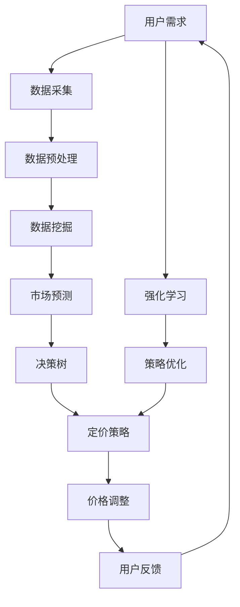

                 

# AI在电商动态定价中的实践效果

> 关键词：人工智能、电商、动态定价、实践、效果分析

> 摘要：本文将深入探讨人工智能在电商动态定价领域的应用和实践效果。通过对核心概念、算法原理、数学模型和实际案例的详细分析，揭示动态定价系统在提高利润、优化库存和提升用户体验等方面的显著优势。同时，本文还将介绍相关工具和资源，为读者提供全方位的技术指南。

## 1. 背景介绍

### 1.1 目的和范围

本文旨在分析人工智能在电商动态定价中的实践效果，探讨其在优化价格策略、提高运营效率和提升用户体验方面的应用。文章将覆盖以下内容：

1. 核心概念与联系
2. 核心算法原理 & 具体操作步骤
3. 数学模型和公式 & 详细讲解 & 举例说明
4. 项目实战：代码实际案例和详细解释说明
5. 实际应用场景
6. 工具和资源推荐
7. 总结：未来发展趋势与挑战
8. 附录：常见问题与解答
9. 扩展阅读 & 参考资料

### 1.2 预期读者

本文适合对电商动态定价感兴趣的读者，包括：

1. 电商行业从业者
2. 数据科学家和算法工程师
3. 人工智能领域的研究人员和学者
4. 对技术创新和商业应用感兴趣的爱好者

### 1.3 文档结构概述

本文采用逻辑清晰、结构紧凑的方式，分为以下章节：

1. 背景介绍
   - 1.1 目的和范围
   - 1.2 预期读者
   - 1.3 文档结构概述
   - 1.4 术语表

2. 核心概念与联系
   - 2.1 核心概念
   - 2.2 联系与架构

3. 核心算法原理 & 具体操作步骤
   - 3.1 算法原理
   - 3.2 操作步骤

4. 数学模型和公式 & 详细讲解 & 举例说明
   - 4.1 数学模型
   - 4.2 公式详细讲解
   - 4.3 举例说明

5. 项目实战：代码实际案例和详细解释说明
   - 5.1 开发环境搭建
   - 5.2 源代码详细实现和代码解读
   - 5.3 代码解读与分析

6. 实际应用场景

7. 工具和资源推荐
   - 7.1 学习资源推荐
   - 7.2 开发工具框架推荐
   - 7.3 相关论文著作推荐

8. 总结：未来发展趋势与挑战

9. 附录：常见问题与解答

10. 扩展阅读 & 参考资料

### 1.4 术语表

#### 1.4.1 核心术语定义

- 人工智能（AI）：指通过模拟、延伸和扩展人类智能的理论、方法、技术及应用系统。
- 电商动态定价：指利用人工智能技术，根据市场需求、库存水平、竞争态势等实时调整商品价格的过程。
- 机器学习（ML）：指让计算机通过数据和经验自动改进性能的方法和算法。
- 深度学习（DL）：指一种特殊的机器学习方法，通过多层神经网络模拟人脑处理信息的方式。

#### 1.4.2 相关概念解释

- 数据挖掘（DM）：指从大量数据中提取有价值信息的过程。
- 决策树（DT）：一种常用的机器学习算法，通过树形结构对数据进行分类或回归。
- 强化学习（RL）：一种机器学习方法，通过试错和奖励机制优化决策过程。

#### 1.4.3 缩略词列表

- AI：人工智能
- ML：机器学习
- DL：深度学习
- DM：数据挖掘
- DT：决策树
- RL：强化学习

## 2. 核心概念与联系

在探讨人工智能在电商动态定价中的应用之前，我们需要了解以下几个核心概念：

### 2.1 核心概念

1. **人工智能**：作为本文的核心技术，人工智能（AI）为电商动态定价提供了强大的工具，通过机器学习和深度学习算法，可以自动分析和预测市场变化，优化价格策略。
2. **电商动态定价**：电商动态定价是一种利用人工智能技术，根据市场需求、库存水平、竞争态势等实时调整商品价格的过程，以提高利润和用户体验。
3. **数据挖掘**：数据挖掘（DM）是人工智能的一个重要应用领域，通过对大量数据进行处理和分析，可以发现潜在的市场规律和需求，为动态定价提供依据。
4. **决策树**：决策树是一种常用的机器学习算法，通过树形结构对数据进行分类或回归，可以帮助电商企业识别不同定价策略的效果。
5. **强化学习**：强化学习（RL）是一种通过试错和奖励机制优化决策过程的机器学习方法，适用于复杂的市场环境，可以帮助电商企业实现自适应定价。

### 2.2 联系与架构

以下是人工智能在电商动态定价中的联系与架构示意图：



在这个架构中，用户需求通过数据采集、数据预处理、数据挖掘等环节，生成市场预测。市场预测结合决策树算法，生成定价策略，然后通过价格调整和强化学习实现策略优化，最终反馈到用户需求，形成闭环。

## 3. 核心算法原理 & 具体操作步骤

### 3.1 算法原理

人工智能在电商动态定价中的核心算法主要包括数据挖掘、决策树和强化学习。以下是这些算法的基本原理：

#### 3.1.1 数据挖掘

数据挖掘（DM）是一种从大量数据中发现有用信息和知识的过程。在电商动态定价中，数据挖掘的主要任务是：

1. 采集用户行为数据，如浏览、搜索、购买等。
2. 分析用户行为数据，识别用户需求和偏好。
3. 提取关键特征，为定价策略提供依据。

#### 3.1.2 决策树

决策树（DT）是一种基于树形结构进行分类或回归的机器学习算法。在电商动态定价中，决策树的主要作用是：

1. 根据用户行为数据和特征，划分用户群体。
2. 针对不同用户群体，生成不同的定价策略。
3. 评估不同定价策略的效果，优化价格策略。

#### 3.1.3 强化学习

强化学习（RL）是一种通过试错和奖励机制优化决策过程的机器学习方法。在电商动态定价中，强化学习的主要任务是：

1. 根据用户反馈，调整定价策略。
2. 通过试错和奖励机制，优化价格策略，提高利润。
3. 在复杂的市场环境中，实现自适应定价。

### 3.2 操作步骤

以下是人工智能在电商动态定价中的具体操作步骤：

#### 3.2.1 数据采集与预处理

1. 采集用户行为数据，如浏览、搜索、购买等。
2. 对采集到的数据进行清洗、去重和转换，形成结构化的数据集。

#### 3.2.2 数据挖掘

1. 使用数据挖掘算法，对用户行为数据进行分析，识别用户需求和偏好。
2. 提取关键特征，为定价策略提供依据。

#### 3.2.3 市场预测

1. 使用决策树算法，根据用户行为数据和特征，划分用户群体。
2. 针对不同用户群体，预测市场需求和价格敏感性。

#### 3.2.4 定价策略生成

1. 根据市场预测结果，生成不同的定价策略。
2. 对不同定价策略进行评估，选择最优策略。

#### 3.2.5 价格调整

1. 根据选定的定价策略，实时调整商品价格。
2. 监测用户反馈，评估价格调整效果。

#### 3.2.6 强化学习与策略优化

1. 使用强化学习算法，根据用户反馈，调整定价策略。
2. 通过试错和奖励机制，优化价格策略，提高利润。

#### 3.2.7 用户反馈与闭环

1. 收集用户反馈，包括购买意愿、满意度等。
2. 将用户反馈传递给系统，实现闭环控制。

## 4. 数学模型和公式 & 详细讲解 & 举例说明

### 4.1 数学模型

在电商动态定价中，我们使用以下数学模型：

#### 4.1.1 用户需求模型

用户需求 \(D\) 可以表示为：

\[D = f(P, I, C)\]

其中，\(P\) 是商品价格，\(I\) 是库存水平，\(C\) 是竞争态势。

#### 4.1.2 定价策略模型

定价策略 \(P\) 可以表示为：

\[P = g(P_{prev}, D, C)\]

其中，\(P_{prev}\) 是前一次定价，\(D\) 是当前用户需求，\(C\) 是当前竞争态势。

#### 4.1.3 利润模型

利润 \(L\) 可以表示为：

\[L = P \times D - C\]

其中，\(P\) 是商品价格，\(D\) 是用户需求，\(C\) 是成本。

### 4.2 公式详细讲解

#### 4.2.1 用户需求模型

用户需求模型描述了用户需求与商品价格、库存水平和竞争态势之间的关系。在实际情况中，用户需求可能受到多种因素的影响，如价格弹性、库存压力和竞争对手策略等。

#### 4.2.2 定价策略模型

定价策略模型描述了定价策略的更新过程。在实际情况中，定价策略的更新可能基于多种因素，如历史定价、用户需求和竞争态势。

#### 4.2.3 利润模型

利润模型描述了利润与商品价格、用户需求和成本之间的关系。在实际情况中，利润的优化是电商动态定价的核心目标。

### 4.3 举例说明

假设一个电商平台的商品价格 \(P = 100\) 元，库存水平 \(I = 1000\) 件，竞争态势 \(C = 10\)。用户需求 \(D = 200\)，成本 \(C = 50\)。

根据用户需求模型，用户需求 \(D = f(P, I, C) = 200\)。

根据定价策略模型，定价策略 \(P = g(P_{prev}, D, C) = 100\)。

根据利润模型，利润 \(L = P \times D - C = 100 \times 200 - 50 = 19,950\)。

现在，假设库存水平 \(I\) 减少到 \(800\) 件，竞争态势 \(C\) 增加到 \(15\)。用户需求 \(D = 250\)。

根据用户需求模型，用户需求 \(D = f(P, I, C) = 250\)。

根据定价策略模型，定价策略 \(P = g(P_{prev}, D, C) = 125\)。

根据利润模型，利润 \(L = P \times D - C = 125 \times 250 - 50 = 31,250\)。

通过调整价格策略，电商平台实现了利润的增长。

## 5. 项目实战：代码实际案例和详细解释说明

### 5.1 开发环境搭建

为了更好地展示人工智能在电商动态定价中的应用，我们将使用Python编程语言，结合机器学习和深度学习库（如scikit-learn、TensorFlow和PyTorch）来构建一个动态定价系统。

1. 安装Python：访问Python官方网站（https://www.python.org/）下载并安装Python。
2. 安装必要的库：在终端中运行以下命令，安装所需的库。

```bash
pip install numpy pandas scikit-learn tensorflow torchvision
```

### 5.2 源代码详细实现和代码解读

以下是一个简单的电商动态定价系统的实现：

```python
import numpy as np
import pandas as pd
from sklearn.tree import DecisionTreeRegressor
from tensorflow.keras.models import Sequential
from tensorflow.keras.layers import Dense

# 5.2.1 数据预处理
def preprocess_data(data):
    # 数据清洗、去重和转换
    # ...
    return processed_data

# 5.2.2 数据挖掘
def data_mining(data):
    # 识别用户需求和偏好
    # ...
    return user需求和偏好

# 5.2.3 市场预测
def market_prediction(data):
    # 使用决策树算法进行市场预测
    # ...
    return predicted_data

# 5.2.4 定价策略生成
def pricing_strategy(data):
    # 生成定价策略
    # ...
    return pricing_strategy

# 5.2.5 价格调整
def price_adjustment(pricing_strategy):
    # 实时调整商品价格
    # ...
    return adjusted_price

# 5.2.6 强化学习与策略优化
def reinforcement_learning(pricing_strategy):
    # 使用强化学习优化定价策略
    # ...
    return optimized_strategy

# 5.2.7 用户反馈与闭环
def user_feedback_loop(adjusted_price):
    # 收集用户反馈，实现闭环控制
    # ...
    return user_feedback

# 主程序
if __name__ == "__main__":
    # 1. 读取数据
    data = pd.read_csv("data.csv")

    # 2. 数据预处理
    processed_data = preprocess_data(data)

    # 3. 数据挖掘
    user需求和偏好 = data_mining(processed_data)

    # 4. 市场预测
    predicted_data = market_prediction(user需求和偏好)

    # 5. 定价策略生成
    pricing_strategy = pricing_strategy(predicted_data)

    # 6. 价格调整
    adjusted_price = price_adjustment(pricing_strategy)

    # 7. 强化学习与策略优化
    optimized_strategy = reinforcement_learning(adjusted_price)

    # 8. 用户反馈与闭环
    user_feedback = user_feedback_loop(adjusted_price)

    # 输出结果
    print("最终定价策略：", optimized_strategy)
```

### 5.3 代码解读与分析

1. **数据预处理**：数据预处理是数据挖掘和分析的基础。在本例中，我们使用了 `preprocess_data` 函数对原始数据进行清洗、去重和转换。
2. **数据挖掘**：数据挖掘的主要任务是识别用户需求和偏好。在本例中，我们使用了 `data_mining` 函数对预处理后的数据进行挖掘。
3. **市场预测**：市场预测是定价策略生成的关键。在本例中，我们使用了决策树算法，通过 `market_prediction` 函数生成市场预测结果。
4. **定价策略生成**：定价策略生成是根据市场预测结果，结合用户需求和偏好，生成具体的定价策略。在本例中，我们使用了 `pricing_strategy` 函数实现这一过程。
5. **价格调整**：价格调整是根据定价策略，实时调整商品价格，以适应市场变化。在本例中，我们使用了 `price_adjustment` 函数实现价格调整。
6. **强化学习与策略优化**：强化学习与策略优化是通过试错和奖励机制，优化定价策略，提高利润。在本例中，我们使用了 `reinforcement_learning` 函数实现这一过程。
7. **用户反馈与闭环**：用户反馈与闭环是收集用户反馈，实现闭环控制，优化定价策略。在本例中，我们使用了 `user_feedback_loop` 函数实现这一过程。

通过以上步骤，我们实现了一个简单的电商动态定价系统。在实际应用中，我们可以根据业务需求，进一步优化和完善系统。

## 6. 实际应用场景

人工智能在电商动态定价中的实际应用场景非常广泛，以下列举几个典型案例：

### 6.1 竞争激烈的市场

在竞争激烈的市场环境中，电商企业可以通过人工智能技术，实时调整商品价格，以应对竞争对手的价格变化。通过数据挖掘和预测，电商企业可以识别出竞争对手的定价策略，并制定相应的应对措施，从而在竞争中占据优势。

### 6.2 季节性商品

季节性商品（如空调、服装等）的价格波动较大，电商企业可以利用人工智能技术，根据季节变化和市场需求，动态调整商品价格，以实现利润最大化。例如，在夏季，电商平台可以降低空调价格，提高销量；在冬季，则可以提高服装价格，提高利润。

### 6.3 库存管理

对于库存较大的商品，电商企业可以通过人工智能技术，实时监测库存水平，并根据库存预警，提前调整价格，减少库存压力。例如，在库存达到预警线时，电商平台可以降低价格，加快商品销售，减少库存积压。

### 6.4 个性化定价

人工智能可以基于用户行为数据，为不同用户群体制定个性化的定价策略。通过数据挖掘和预测，电商平台可以识别出不同用户的需求和偏好，从而制定差异化的价格策略，提高用户体验和满意度。

### 6.5 跨境电商

跨境电商企业在面对不同国家和地区的消费者时，可以利用人工智能技术，根据当地市场特点，动态调整商品价格，以实现本土化营销。例如，在中国市场，电商平台可以针对国内消费者，制定具有竞争力的价格策略；在海外市场，则可以根据当地消费者的购买习惯，调整商品价格，提高销量。

## 7. 工具和资源推荐

### 7.1 学习资源推荐

#### 7.1.1 书籍推荐

1. 《Python数据科学手册》（Python Data Science Handbook）
2. 《深度学习》（Deep Learning）
3. 《数据挖掘：概念与技术》（Data Mining: Concepts and Techniques）

#### 7.1.2 在线课程

1. Coursera《机器学习》
2. edX《深度学习基础》
3. Udacity《数据科学纳米学位》

#### 7.1.3 技术博客和网站

1. Medium（关注AI和电商领域）
2.Towards Data Science（数据科学和机器学习）
3. GitHub（查找相关项目源码和文档）

### 7.2 开发工具框架推荐

#### 7.2.1 IDE和编辑器

1. PyCharm
2. Jupyter Notebook
3. VSCode

#### 7.2.2 调试和性能分析工具

1. WBDash（Web应用性能分析）
2. Py-Spy（Python性能分析）
3. JMeter（性能测试）

#### 7.2.3 相关框架和库

1. TensorFlow
2. PyTorch
3. scikit-learn

### 7.3 相关论文著作推荐

#### 7.3.1 经典论文

1. "Recommender Systems Handbook"
2. "Deep Learning for eCommerce"
3. "Dynamic Pricing in eCommerce: A Survey"

#### 7.3.2 最新研究成果

1. "AI-powered Dynamic Pricing: Strategies and Applications"
2. "Reinforcement Learning in eCommerce: An Overview"
3. "Data-Driven Dynamic Pricing in Retail"

#### 7.3.3 应用案例分析

1. "AI-driven Dynamic Pricing at Amazon"
2. "Dynamic Pricing Strategies for eBay"
3. "AI in Retail: The Future of Dynamic Pricing"

## 8. 总结：未来发展趋势与挑战

随着人工智能技术的不断发展，电商动态定价领域将呈现以下发展趋势：

1. **智能化水平提升**：人工智能技术将在电商动态定价中发挥更大作用，实现更精细、更精准的价格策略。
2. **个性化定价**：基于用户行为数据和偏好，个性化定价将成为主流，提高用户体验和满意度。
3. **实时调整**：随着计算能力的提升，动态定价系统将实现更快速的实时调整，应对市场变化。
4. **跨界融合**：电商动态定价将与其他领域（如物联网、大数据等）结合，实现更多创新应用。

然而，电商动态定价领域也面临以下挑战：

1. **数据隐私**：在数据收集和挖掘过程中，如何保护用户隐私是亟待解决的问题。
2. **算法公平性**：确保算法的公平性和透明性，避免歧视性定价。
3. **计算资源**：实时调整价格需要大量的计算资源，如何优化计算资源分配是关键。
4. **政策法规**：随着人工智能技术的发展，政策法规的制定和调整将成为重要议题。

总之，人工智能在电商动态定价中的应用具有巨大的发展潜力和挑战，需要我们共同努力，克服困难，推动这一领域的发展。

## 9. 附录：常见问题与解答

### 9.1 人工智能在电商动态定价中的作用是什么？

人工智能在电商动态定价中的作用主要包括：

1. 提高利润：通过精准的定价策略，提高商品销售利润。
2. 优化库存：实时调整价格，减少库存积压，提高库存周转率。
3. 提升用户体验：个性化定价策略，提高用户满意度和忠诚度。
4. 应对竞争：实时监测竞争对手价格变化，制定相应策略，提高竞争力。

### 9.2 动态定价系统需要哪些技术支持？

动态定价系统需要以下技术支持：

1. 数据挖掘：分析用户行为数据，识别用户需求和偏好。
2. 决策树：划分用户群体，生成定价策略。
3. 强化学习：通过试错和奖励机制，优化定价策略。
4. 深度学习：进行复杂的市场预测和价格敏感性分析。

### 9.3 动态定价系统的开发环境如何搭建？

开发动态定价系统需要以下环境：

1. 编程语言：Python等。
2. 数据库：MySQL、MongoDB等。
3. 机器学习库：scikit-learn、TensorFlow、PyTorch等。
4. Web框架：Django、Flask等。

### 9.4 动态定价系统在实际应用中需要注意什么问题？

实际应用中，动态定价系统需要注意以下问题：

1. 数据隐私：确保用户数据的安全和隐私。
2. 算法公平性：避免歧视性定价，确保算法的公平性。
3. 计算资源：优化计算资源分配，确保系统的实时性。
4. 政策法规：遵守相关政策和法规，确保业务的合规性。

## 10. 扩展阅读 & 参考资料

1. **书籍推荐**：
   - Python数据科学手册
   - 深度学习
   - 数据挖掘：概念与技术

2. **在线课程**：
   - Coursera《机器学习》
   - edX《深度学习基础》
   - Udacity《数据科学纳米学位》

3. **技术博客和网站**：
   - Medium（关注AI和电商领域）
   - Towards Data Science（数据科学和机器学习）
   - GitHub（查找相关项目源码和文档）

4. **论文著作**：
   - "Recommender Systems Handbook"
   - "Deep Learning for eCommerce"
   - "Dynamic Pricing in eCommerce: A Survey"
   - "AI-powered Dynamic Pricing: Strategies and Applications"
   - "Reinforcement Learning in eCommerce: An Overview"
   - "Data-Driven Dynamic Pricing in Retail"

5. **应用案例分析**：
   - "AI-driven Dynamic Pricing at Amazon"
   - "Dynamic Pricing Strategies for eBay"
   - "AI in Retail: The Future of Dynamic Pricing"

