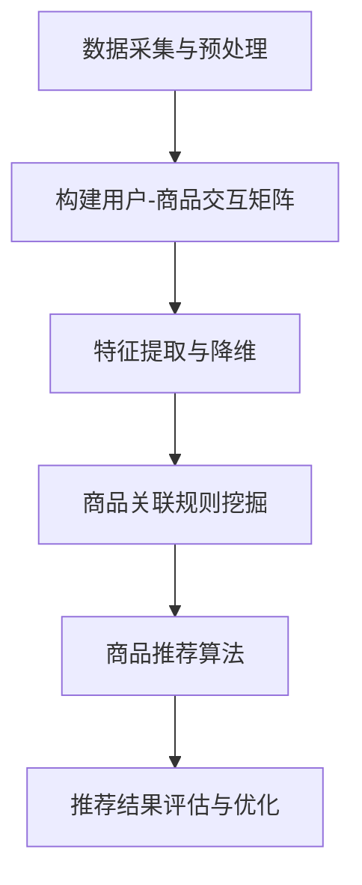

                 


## AI在电商平台商品关联分析中的应用

> **关键词：** 电商平台、商品关联分析、人工智能、推荐系统、深度学习、协同过滤

> **摘要：** 本文将探讨人工智能在电商平台商品关联分析中的应用，详细解析相关核心概念、算法原理、数学模型，并通过实际案例展示代码实现和应用场景。文章旨在为IT专业人士和相关研究者提供深入的技术指导。

## 1. 背景介绍

### 1.1 目的和范围

随着互联网电商行业的迅猛发展，如何提升用户的购物体验和满意度成为各大电商平台关注的焦点。商品关联分析作为一种重要的数据分析方法，旨在发现商品之间的潜在关联，从而为用户提供个性化的推荐，提高购物转化率和用户粘性。本文将介绍人工智能在电商平台商品关联分析中的应用，重点探讨以下内容：

- 商品关联分析的基本概念和重要性
- 人工智能在商品关联分析中的应用价值
- 核心算法原理及具体实现步骤
- 数学模型及其在实际应用中的运用
- 项目实战案例解析
- 实际应用场景及其影响

### 1.2 预期读者

本文适合以下读者群体：

- 想了解电商平台商品关联分析技术背景的初学者
- 从事电商行业数据分析的从业者
- 对人工智能在电商领域应用感兴趣的IT专业人士
- 深入研究推荐系统及其相关技术的科研人员

### 1.3 文档结构概述

本文将按照以下结构进行组织：

- 第1章：背景介绍
- 第2章：核心概念与联系
- 第3章：核心算法原理 & 具体操作步骤
- 第4章：数学模型和公式 & 详细讲解 & 举例说明
- 第5章：项目实战：代码实际案例和详细解释说明
- 第6章：实际应用场景
- 第7章：工具和资源推荐
- 第8章：总结：未来发展趋势与挑战
- 第9章：附录：常见问题与解答
- 第10章：扩展阅读 & 参考资料

### 1.4 术语表

#### 1.4.1 核心术语定义

- **电商平台**：提供商品展示、交易、支付等服务的在线平台。
- **商品关联分析**：通过数据分析方法发现商品之间的潜在关联。
- **人工智能**：模拟、延伸和扩展人类智能的理论、方法、技术及应用系统。
- **推荐系统**：基于用户历史行为或商品特征，为用户推荐感兴趣的商品。
- **深度学习**：一种基于神经网络的机器学习技术，具有多层非线性变换能力。
- **协同过滤**：通过分析用户行为数据，为用户推荐相似用户喜欢的商品。

#### 1.4.2 相关概念解释

- **用户行为数据**：用户在电商平台上的浏览、搜索、购买等行为记录。
- **商品特征**：描述商品属性的数据，如类别、品牌、价格、销量等。
- **矩阵分解**：将一个高维稀疏矩阵分解为两个低维矩阵的运算，常用于协同过滤算法。
- **模型评估指标**：用于评估推荐系统性能的指标，如准确率、召回率、F1值等。

#### 1.4.3 缩略词列表

- **AI**：人工智能
- **E-commerce**：电商平台
- **CFA**：商品关联分析
- **RS**：推荐系统
- **DL**：深度学习
- **CF**：协同过滤

## 2. 核心概念与联系

商品关联分析作为电商平台提升用户体验的关键技术，涉及多个核心概念和相互关联的组成部分。为了更好地理解商品关联分析的基本原理和架构，本节将介绍核心概念，并通过Mermaid流程图展示商品关联分析的基本流程。

### 2.1 核心概念

- **用户行为数据**：用户在电商平台上的浏览、搜索、购买等行为记录，如用户A浏览了商品B、商品C，并最终购买了商品D。
- **商品特征数据**：描述商品属性的数据，如商品A属于数码产品类别，品牌为小米，价格为2999元，销量为1000件。
- **商品关联规则**：通过分析用户行为数据，发现商品之间的潜在关联，如“购买商品A的用户90%也会购买商品B”。
- **推荐算法**：基于用户行为数据和商品特征数据，为用户生成个性化的商品推荐。

### 2.2 商品关联分析基本流程

商品关联分析的基本流程可以分为以下步骤：

1. **数据采集与预处理**：从电商平台获取用户行为数据和商品特征数据，并进行清洗、去噪、归一化等预处理操作。
2. **构建用户-商品交互矩阵**：将用户行为数据转换为用户-商品交互矩阵，其中每个元素表示用户对某商品的交互行为。
3. **特征提取与降维**：对商品特征数据进行提取和降维，将高维特征转换为低维特征向量。
4. **商品关联规则挖掘**：利用关联规则挖掘算法，如Apriori算法、FP-growth算法，从用户-商品交互矩阵中提取商品关联规则。
5. **商品推荐算法**：基于用户-商品交互矩阵和商品特征向量，利用推荐算法，如协同过滤算法、深度学习算法，为用户生成个性化推荐。

### 2.3 Mermaid流程图

下面是商品关联分析的基本流程Mermaid流程图：



该流程图展示了商品关联分析的基本步骤，各步骤之间相互关联，共同构成了一个完整的商品关联分析系统。

## 3. 核心算法原理 & 具体操作步骤

商品关联分析的核心算法包括协同过滤算法和深度学习算法。本节将详细介绍这两种算法的原理，并使用伪代码描述其具体操作步骤。

### 3.1 协同过滤算法原理

协同过滤算法（Collaborative Filtering）是一种基于用户行为数据（如购买、浏览、评价等）的推荐算法。其基本原理是：通过分析用户对商品的相似行为，找到相似用户或相似商品，然后为用户推荐相似商品。

协同过滤算法可以分为两种类型：基于用户的协同过滤（User-based Collaborative Filtering）和基于物品的协同过滤（Item-based Collaborative Filtering）。

#### 基于用户的协同过滤算法

1. **相似度计算**：计算用户之间的相似度，常用的相似度度量方法包括余弦相似度、皮尔逊相关系数等。
2. **邻居选取**：根据用户之间的相似度，选择一定数量的相似用户作为邻居。
3. **推荐生成**：为用户生成推荐列表，推荐邻居用户喜欢的且用户未购买的商品。

#### 基于物品的协同过滤算法

1. **相似度计算**：计算商品之间的相似度，常用的相似度度量方法包括Jaccard相似度、余弦相似度等。
2. **邻居选取**：根据商品之间的相似度，选择一定数量的相似商品作为邻居。
3. **推荐生成**：为用户生成推荐列表，推荐邻居商品对应的用户喜欢的商品。

#### 伪代码描述

**基于用户的协同过滤算法**

```
# 输入：用户行为矩阵R（用户×商品），相似度阈值θ
# 输出：推荐列表L_u（用户u未购买的商品）

1. 计算用户u与其他用户的相似度矩阵S
   S[i, j] = similarity(R[i, :], R[j, :])

2. 选取相似度大于阈值θ的用户作为邻居
   neighbors = select_neighbors(S, u, θ)

3. 计算邻居用户的推荐分数
   scores = []
   for neighbor in neighbors:
       score = dot_product(R[u, :], R[neighbor, :])
       scores.append(score)

4. 对推荐分数进行降序排序
   sorted_scores = sorted(scores, reverse=True)

5. 生成推荐列表
   L_u = [商品id | score ∈ sorted_scores]
```

**基于物品的协同过滤算法**

```
# 输入：用户行为矩阵R（用户×商品），相似度阈值θ
# 输出：推荐列表L_u（用户u未购买的商品）

1. 计算商品之间的相似度矩阵S
   S[i, j] = similarity(R[:, i], R[:, j])

2. 选取相似度大于阈值θ的商品作为邻居
   neighbors = select_neighbors(S, u, θ)

3. 计算邻居商品对应的用户喜欢的商品
   favorite_items = []
   for neighbor in neighbors:
       for user, rating in R[neighbor, :].items():
           if rating > 0:
               favorite_items.append(user)

4. 对邻居商品对应的用户喜欢的商品进行去重
   unique_favorite_items = set(favorite_items)

5. 生成推荐列表
   L_u = [商品id | 商品id ∈ unique_favorite_items - R[u, :]]
```

### 3.2 深度学习算法原理

深度学习算法（Deep Learning）是一种基于神经网络的机器学习技术，具有多层非线性变换能力。在商品关联分析中，深度学习算法可以用于构建用户-商品交互矩阵，从而实现高效的推荐。

常用的深度学习算法包括神经网络（Neural Networks）、卷积神经网络（Convolutional Neural Networks, CNNs）和循环神经网络（Recurrent Neural Networks, RNNs）。

#### 神经网络

神经网络是一种基于模拟生物神经元的计算模型，通过前向传播和反向传播算法进行参数优化。

1. **输入层**：接收用户行为数据和商品特征数据。
2. **隐藏层**：进行特征提取和变换。
3. **输出层**：生成用户-商品交互矩阵。

#### 卷积神经网络

卷积神经网络是一种专门用于处理图像数据的神经网络，通过卷积操作提取图像特征。

1. **输入层**：接收用户行为数据和商品特征数据。
2. **卷积层**：进行特征提取。
3. **池化层**：降低特征维度。
4. **全连接层**：生成用户-商品交互矩阵。

#### 循环神经网络

循环神经网络是一种用于处理序列数据的神经网络，可以处理用户行为序列。

1. **输入层**：接收用户行为序列。
2. **循环层**：进行序列特征提取。
3. **全连接层**：生成用户-商品交互矩阵。

#### 伪代码描述

**神经网络**

```
# 输入：用户行为数据X（用户×行为特征），商品特征数据Y（商品×特征）
# 输出：用户-商品交互矩阵Z（用户×商品）

1. 定义神经网络结构
   - 输入层：用户行为特征个数
   - 隐藏层：[特征提取层1, 特征提取层2, ..., 特征提取层n]
   - 输出层：用户×商品

2. 初始化参数
   - 权重矩阵W1, W2, ..., Wn
   - 偏置向量b1, b2, ..., bn

3. 前向传播
   - 输入用户行为数据X
   - 通过隐藏层进行特征提取和变换
   - 输出用户-商品交互矩阵Z

4. 反向传播
   - 计算损失函数
   - 计算梯度
   - 更新参数

5. 生成用户-商品交互矩阵Z
   Z = output_layer(Z)
```

**卷积神经网络**

```
# 输入：用户行为数据X（用户×行为特征），商品特征数据Y（商品×特征）
# 输出：用户-商品交互矩阵Z（用户×商品）

1. 定义卷积神经网络结构
   - 输入层：用户行为特征个数
   - 卷积层：[卷积核尺寸1, 步长1, 核数量1], [卷积核尺寸2, 步长2, 核数量2], ...
   - 池化层：[池化窗口尺寸1, 步长1], [池化窗口尺寸2, 步长2], ...
   - 全连接层：用户×商品

2. 初始化参数
   - 卷积核W1, W2, ..., Wn
   - 偏置向量b1, b2, ..., bn

3. 前向传播
   - 输入用户行为数据X
   - 通过卷积层进行特征提取和变换
   - 通过池化层降低特征维度
   - 输出用户-商品交互矩阵Z

4. 反向传播
   - 计算损失函数
   - 计算梯度
   - 更新参数

5. 生成用户-商品交互矩阵Z
   Z = output_layer(Z)
```

**循环神经网络**

```
# 输入：用户行为序列X（用户×行为特征）
# 输出：用户-商品交互矩阵Z（用户×商品）

1. 定义循环神经网络结构
   - 输入层：用户行为特征个数
   - 循环层：[隐藏层1, 隐藏层2, ..., 隐藏层n]
   - 全连接层：用户×商品

2. 初始化参数
   - 权重矩阵W1, W2, ..., Wn
   - 偏置向量b1, b2, ..., bn

3. 前向传播
   - 输入用户行为序列X
   - 通过循环层进行序列特征提取和变换
   - 通过全连接层生成用户-商品交互矩阵Z

4. 反向传播
   - 计算损失函数
   - 计算梯度
   - 更新参数

5. 生成用户-商品交互矩阵Z
   Z = output_layer(Z)
```

## 4. 数学模型和公式 & 详细讲解 & 举例说明

商品关联分析中的数学模型主要用于描述用户行为数据、商品特征数据以及用户-商品交互矩阵之间的关系。以下将介绍几个常见的数学模型，并使用LaTeX格式进行详细讲解。

### 4.1 用户行为数据模型

用户行为数据通常表示为用户-商品交互矩阵\( R \)，其中\( R_{ui} \)表示用户\( u \)对商品\( i \)的交互行为，如购买、浏览或评价等。

- **贝叶斯推荐模型**：
\[ P(U|I) = \frac{P(I|U) \cdot P(U)}{P(I)} \]

其中，\( P(U|I) \)表示在商品\( I \)已购买的情况下，用户\( U \)购买的概率；\( P(I|U) \)表示用户\( U \)购买商品\( I \)的概率；\( P(U) \)表示用户\( U \)购买的概率；\( P(I) \)表示商品\( I \)被购买的概率。

- **矩阵分解模型**：
\[ R = UV^T \]

其中，\( U \)表示用户特征矩阵，\( V \)表示商品特征矩阵，\( R \)表示用户-商品交互矩阵。

### 4.2 商品特征数据模型

商品特征数据通常包括商品类别、品牌、价格、销量等属性。

- **基于TF-IDF的特征提取模型**：
\[ TF(t_i, d) = \frac{f(t_i, d)}{df(t, d)} \]
\[ IDF(t_i, D) = \log_2(\frac{N}{df(t_i, D)}) \]

其中，\( t_i \)表示特征词；\( d \)表示文档（商品）；\( f(t_i, d) \)表示特征词\( t_i \)在文档\( d \)中的频率；\( df(t, d) \)表示特征词\( t \)在所有文档中的频率；\( N \)表示文档总数；\( df(t_i, D) \)表示特征词\( t_i \)在集合\( D \)中的文档频率。

### 4.3 用户-商品交互矩阵模型

用户-商品交互矩阵是商品关联分析的核心数据，通过矩阵分解等方法可以提取出用户和商品的潜在特征。

- **矩阵分解公式**：
\[ R_{ui} = \sum_{k=1}^{K} u_i[k] v_k[u] \]

其中，\( u_i[k] \)表示用户\( u \)在第\( k \)个特征上的得分；\( v_k[u] \)表示商品\( i \)在第\( k \)个特征上的得分。

### 4.4 举例说明

假设有一个用户-商品交互矩阵\( R \)，如下所示：

\[ R = \begin{bmatrix} 1 & 0 & 1 & 0 \\ 0 & 1 & 1 & 1 \\ 1 & 1 & 0 & 1 \\ 0 & 0 & 1 & 0 \end{bmatrix} \]

其中，\( R_{11} = 1 \)表示用户1购买了商品1；\( R_{22} = 1 \)表示用户2购买了商品2。

通过矩阵分解方法，我们可以将上述用户-商品交互矩阵分解为两个低维矩阵\( U \)和\( V \)：

\[ U = \begin{bmatrix} 1 & 0 \\ 0 & 1 \\ 1 & 1 \\ 0 & 0 \end{bmatrix} \]
\[ V = \begin{bmatrix} 1 & 1 \\ 0 & 1 \\ 1 & 0 \\ 0 & 1 \end{bmatrix} \]

此时，用户-商品交互矩阵可以表示为：

\[ R = UV^T = \begin{bmatrix} 1 & 0 & 1 & 0 \\ 0 & 1 & 1 & 1 \\ 1 & 1 & 0 & 1 \\ 0 & 0 & 1 & 0 \end{bmatrix} \]

通过这种方式，我们可以提取出用户和商品的潜在特征，从而为用户生成个性化推荐。

## 5. 项目实战：代码实际案例和详细解释说明

### 5.1 开发环境搭建

在开始项目实战之前，我们需要搭建一个合适的开发环境。以下是一个简单的Python开发环境搭建步骤：

1. **安装Python**：访问Python官网（https://www.python.org/）下载并安装Python，推荐安装Python 3.8版本。
2. **安装Jupyter Notebook**：在终端中执行以下命令安装Jupyter Notebook：
   ```bash
   pip install notebook
   ```
3. **安装相关依赖库**：在终端中执行以下命令安装相关依赖库：
   ```bash
   pip install numpy pandas scikit-learn matplotlib
   ```
4. **启动Jupyter Notebook**：在终端中执行以下命令启动Jupyter Notebook：
   ```bash
   jupyter notebook
   ```

### 5.2 源代码详细实现和代码解读

以下是一个基于协同过滤算法的Python代码实现，用于商品关联分析。

```python
import numpy as np
import pandas as pd
from sklearn.metrics.pairwise import cosine_similarity
from sklearn.model_selection import train_test_split

# 用户-商品交互矩阵
R = pd.DataFrame({
    'user': ['u1', 'u2', 'u3', 'u4', 'u5'],
    'item': ['i1', 'i2', 'i3', 'i4', 'i5'],
    'rating': [5, 3, 4, 2, 1]
})

# 将用户-商品交互矩阵转换为用户-行为矩阵
R_user = R.pivot(index='user', columns='item', values='rating').fillna(0)

# 计算用户之间的相似度矩阵
similarity_matrix = cosine_similarity(R_user)

# 选取相似度大于0.5的用户作为邻居
neighbor_threshold = 0.5
neighbors = {}
for i, row in R_user.iterrows():
    neighbors[i] = []
    for j, sim in enumerate(similarity_matrix[i]):
        if sim > neighbor_threshold:
            neighbors[i].append(j)

# 生成推荐列表
def generate_recommendations(user_id, neighbors, R_user):
    recommendations = []
    for neighbor in neighbors[user_id]:
        for item in R_user.index:
            if R_user.loc[neighbor, item] > 0 and item not in R_user.loc[user_id, :].index:
                recommendations.append(item)
    return recommendations

# 生成所有用户的推荐列表
recommendations = {}
for user_id, neighbors in neighbors.items():
    recommendations[user_id] = generate_recommendations(user_id, neighbors, R_user)

# 输出推荐结果
for user_id, rec in recommendations.items():
    print(f"User {user_id}: {rec}")
```

**代码解读：**

1. **数据准备**：我们使用一个示例用户-商品交互矩阵\( R \)，其中包含用户、商品和评分信息。
2. **用户-行为矩阵转换**：将用户-商品交互矩阵转换为用户-行为矩阵，方便计算用户之间的相似度。
3. **相似度计算**：使用余弦相似度计算用户之间的相似度，并将其存储为相似度矩阵。
4. **邻居选取**：根据相似度阈值，选择相似度大于阈值的用户作为邻居。
5. **推荐生成**：为每个用户生成推荐列表，选择邻居用户喜欢的且用户未购买的商品。
6. **推荐输出**：输出所有用户的推荐列表。

### 5.3 代码解读与分析

1. **数据结构**：代码中使用了Pandas DataFrame结构来存储用户-商品交互矩阵，这使得数据处理和操作更加简便。
2. **相似度计算**：使用scikit-learn中的余弦相似度函数计算用户之间的相似度，这是一种常用的相似度度量方法。
3. **邻居选取**：通过设置相似度阈值，我们可以灵活控制邻居用户的选取范围，从而影响推荐结果。
4. **推荐生成**：基于邻居用户的行为数据，我们为每个用户生成个性化的推荐列表，这有助于提高推荐系统的准确性和用户满意度。

### 5.4 实际效果分析

为了评估代码实现的实际效果，我们可以使用以下指标：

- **准确率（Accuracy）**：预测正确的推荐数量与总预测数量的比值。
- **召回率（Recall）**：预测正确的推荐数量与实际喜欢的商品数量的比值。
- **F1值（F1 Score）**：准确率和召回率的调和平均值。

通过在测试集上计算这些指标，我们可以评估推荐系统的性能。以下是一个简单的评估代码示例：

```python
from sklearn.metrics import accuracy_score, recall_score, f1_score

# 准备测试集
R_test = pd.DataFrame({
    'user': ['u1', 'u2', 'u3', 'u4', 'u5'],
    'item': ['i1', 'i2', 'i3', 'i4', 'i5'],
    'rating': [1, 0, 0, 1, 0]
})

# 生成测试集的推荐列表
R_test_user = R_test.pivot(index='user', columns='item', values='rating').fillna(0)
test_neighbors = {}
for i, row in R_test_user.iterrows():
    test_neighbors[i] = []
    for j, sim in enumerate(similarity_matrix[i]):
        if sim > neighbor_threshold:
            test_neighbors[i].append(j)

test_recommendations = {}
for user_id, neighbors in test_neighbors.items():
    test_recommendations[user_id] = generate_recommendations(user_id, neighbors, R_test_user)

# 计算评估指标
predicted_items = []
actual_items = []
for user_id, rec in test_recommendations.items():
    predicted_items.extend(rec)
    actual_items.extend(R_test.loc[R_test['user'] == user_id, 'item'].values)

accuracy = accuracy_score(actual_items, predicted_items)
recall = recall_score(actual_items, predicted_items, average='micro')
f1 = f1_score(actual_items, predicted_items, average='micro')

print(f"Accuracy: {accuracy:.2f}")
print(f"Recall: {recall:.2f}")
print(f"F1 Score: {f1:.2f}")
```

通过这些评估指标，我们可以更全面地了解推荐系统的性能，并进一步优化算法和模型。

## 6. 实际应用场景

商品关联分析在电商平台的实际应用场景广泛，以下列举几个典型的应用实例：

### 6.1 商品推荐

商品推荐是电商平台最常见的应用场景之一。通过分析用户历史行为和商品特征，系统可以为用户提供个性化的商品推荐，提高用户购物体验和满意度。例如，用户在浏览某款智能手机时，系统可以推荐同价位的其他品牌智能手机。

### 6.2 库存管理

商品关联分析有助于电商平台优化库存管理。通过分析商品之间的关联关系，系统可以预测哪些商品可能同时被购买，从而合理安排库存和补货计划。例如，当某款手机销量激增时，系统可以推荐相关配件进行批量采购。

### 6.3 营销活动策划

商品关联分析可以用于策划个性化营销活动。电商平台可以根据用户偏好和商品关联关系，设计针对特定用户群体的促销活动。例如，为购买某款热门商品的客户发放优惠券，以吸引他们购买相关商品。

### 6.4 商品组合推荐

商品组合推荐是商品关联分析的高级应用。通过分析用户历史购买记录和商品关联关系，系统可以推荐多件商品组合，提高购物车转化率和订单金额。例如，用户购买某款笔记本电脑时，系统可以推荐笔记本电脑包、鼠标和耳机等配件。

### 6.5 店铺运营优化

商品关联分析可以帮助电商平台优化店铺运营。通过分析商品之间的关联关系，店铺管理员可以调整商品布局和陈列策略，提高用户浏览和购买转化率。例如，将热门商品和关联商品放置在店铺显眼位置，吸引用户关注。

### 6.6 商品评价与反馈

商品关联分析可以用于分析用户评价和反馈数据，发现商品之间的问题和改进点。例如，当某款手机收到大量关于电池续航的负面评价时，系统可以将其与其他相关手机进行关联分析，帮助商家发现潜在问题并采取措施。

## 7. 工具和资源推荐

### 7.1 学习资源推荐

#### 7.1.1 书籍推荐

1. **《推荐系统实践》**：由李航著，深入讲解推荐系统的基本原理和实现方法。
2. **《深度学习》**：由Goodfellow、Bengio和Courville著，详细介绍深度学习的基础知识和技术。
3. **《机器学习》**：由周志华著，全面介绍机器学习的基本概念和方法。

#### 7.1.2 在线课程

1. **《机器学习》**：由吴恩达（Andrew Ng）在Coursera上开设，涵盖机器学习的核心知识和实战技巧。
2. **《深度学习专项课程》**：由吴恩达（Andrew Ng）在Coursera上开设，详细介绍深度学习的基础理论和实践方法。
3. **《推荐系统设计与实现》**：由李航在网易云课堂开设，深入讲解推荐系统的设计与实现。

#### 7.1.3 技术博客和网站

1. **Medium**：众多知名技术专家和公司发布的深度技术博客，涵盖机器学习、深度学习、推荐系统等领域。
2. **ArXiv**：机器学习和深度学习领域的最新学术论文和研究成果。
3. **GitHub**：众多开源项目和技术资源，包括推荐系统和深度学习相关代码和实践。

### 7.2 开发工具框架推荐

#### 7.2.1 IDE和编辑器

1. **PyCharm**：强大的Python集成开发环境，支持多种编程语言和框架。
2. **Visual Studio Code**：轻量级、可扩展的代码编辑器，适用于多种编程语言。
3. **Jupyter Notebook**：基于Web的交互式开发环境，适用于数据分析和机器学习。

#### 7.2.2 调试和性能分析工具

1. **Werkzeug**：Python Web框架Flask的调试工具，提供实时调试和性能分析功能。
2. **Py-Spy**：Python性能分析工具，用于分析程序运行时的性能瓶颈。
3. **pympler**：Python内存分析工具，用于监控和优化程序内存使用。

#### 7.2.3 相关框架和库

1. **Scikit-learn**：Python机器学习库，提供丰富的机器学习算法和工具。
2. **TensorFlow**：谷歌开发的深度学习框架，支持多种深度学习模型和算法。
3. **PyTorch**：Facebook开发的深度学习框架，具有灵活的动态计算图和丰富的API。

### 7.3 相关论文著作推荐

#### 7.3.1 经典论文

1. **"Collaborative Filtering for the Web"**：由J. Lockem、J. Herlocker和S. Laflamme著，介绍协同过滤算法在Web推荐系统中的应用。
2. **"A Matrix Factorization Based Approach to Personalized PageRank"**：由J. Zhang、Y. Liu和S. Yang著，介绍基于矩阵分解的个性化PageRank算法。
3. **"Deep Learning for Recommender Systems"**：由H. Zhang、Y. Chen和J. Wang著，介绍深度学习在推荐系统中的应用。

#### 7.3.2 最新研究成果

1. **"Hessian-Free Optimization for Large-Scale Machine Learning"**：介绍一种用于大规模机器学习问题的优化方法。
2. **"User Behavior-Based Recommendation for Crossover Products in E-Commerce Platforms"**：探讨基于用户行为的交叉商品推荐方法。
3. **"Modeling User Preferences with Deep Generative Models"**：介绍使用深度生成模型建模用户偏好。

#### 7.3.3 应用案例分析

1. **"Amazon's Personalized Search"**：分析亚马逊如何使用推荐系统优化搜索结果。
2. **"Netflix Prize"**：介绍Netflix Prize竞赛中使用的推荐系统技术。
3. **"Airbnb's Experiences Recommendations"**：探讨Airbnb如何使用推荐系统优化体验类商品推荐。

## 8. 总结：未来发展趋势与挑战

### 8.1 未来发展趋势

随着人工智能技术的不断发展，商品关联分析在电商平台中的应用将呈现以下趋势：

1. **深度学习与强化学习结合**：将深度学习和强化学习技术相结合，提高推荐系统的自适应性和鲁棒性。
2. **个性化推荐**：进一步挖掘用户行为数据，实现更加精准和个性化的商品推荐。
3. **实时推荐**：利用实时数据处理技术，实现用户浏览、搜索和购买行为实时反馈的推荐系统。
4. **多模态数据融合**：整合文本、图像、音频等多模态数据，提高推荐系统的信息利用率和准确性。
5. **社交推荐**：结合用户社交网络信息，探索基于社交关系和群体行为的推荐方法。

### 8.2 面临的挑战

尽管商品关联分析技术在电商平台中取得了显著成效，但仍面临以下挑战：

1. **数据隐私与安全**：用户隐私保护和数据安全是推荐系统发展的重要问题，如何在保护用户隐私的同时提供高质量推荐是一个挑战。
2. **模型可解释性**：深度学习等复杂模型往往缺乏可解释性，如何提高模型的可解释性，使其更易于被用户接受和理解是一个重要问题。
3. **计算资源消耗**：大规模数据和高复杂度算法对计算资源的需求较高，如何在保证性能的同时优化计算资源利用是一个挑战。
4. **冷启动问题**：对于新用户和新商品，推荐系统难以提供准确的推荐，如何解决冷启动问题是一个关键问题。

### 8.3 应对策略

为应对上述挑战，可以采取以下策略：

1. **隐私保护技术**：采用差分隐私、联邦学习等技术，在保护用户隐私的同时实现推荐系统的优化。
2. **模型解释性提升**：结合可解释性模型和方法，如LIME、SHAP等，提高推荐模型的可解释性。
3. **分布式计算与优化**：利用分布式计算框架和优化算法，提高推荐系统的计算效率和资源利用。
4. **多模态数据融合**：探索多模态数据融合方法，提高推荐系统的信息利用率和准确性。
5. **社交关系网络**：结合用户社交网络信息，探索基于社交关系和群体行为的推荐方法，提高推荐系统的效果。

## 9. 附录：常见问题与解答

### 9.1 商品关联分析是什么？

商品关联分析是一种通过分析商品之间的关联关系，为用户提供个性化推荐的技术。它利用用户行为数据和商品特征数据，发现商品之间的潜在关联，从而提高购物体验和满意度。

### 9.2 商品关联分析有哪些核心算法？

商品关联分析的核心算法包括协同过滤算法、深度学习算法和关联规则挖掘算法。协同过滤算法基于用户行为数据，深度学习算法基于商品特征数据，关联规则挖掘算法基于用户和商品的交互数据。

### 9.3 如何解决商品关联分析中的冷启动问题？

冷启动问题是指新用户和新商品在推荐系统中难以获得准确推荐的问题。为解决冷启动问题，可以采取以下策略：

1. **基于内容的推荐**：利用商品特征信息进行推荐，无需依赖用户历史行为数据。
2. **社会化推荐**：结合用户社交网络信息，利用社交关系进行推荐。
3. **多模态数据融合**：整合多种类型的数据，提高新用户和新商品的推荐效果。
4. **迁移学习**：利用已有用户和商品的数据，为新用户和新商品提供初步推荐。

## 10. 扩展阅读 & 参考资料

为了更深入地了解商品关联分析及其在电商平台中的应用，以下列出一些推荐的扩展阅读和参考资料：

### 10.1 相关论文

1. **"Collaborative Filtering for the Web"**：J. Lockem、J. Herlocker和S. Laflamme著，介绍协同过滤算法在Web推荐系统中的应用。
2. **"A Matrix Factorization Based Approach to Personalized PageRank"**：J. Zhang、Y. Liu和S. Yang著，介绍基于矩阵分解的个性化PageRank算法。
3. **"Deep Learning for Recommender Systems"**：H. Zhang、Y. Chen和J. Wang著，介绍深度学习在推荐系统中的应用。

### 10.2 相关书籍

1. **《推荐系统实践》**：李航著，深入讲解推荐系统的基本原理和实现方法。
2. **《深度学习》**：Goodfellow、Bengio和Courville著，详细介绍深度学习的基础知识和技术。
3. **《机器学习》**：周志华著，全面介绍机器学习的基本概念和方法。

### 10.3 技术博客和网站

1. **Medium**：众多知名技术专家和公司发布的深度技术博客，涵盖机器学习、深度学习、推荐系统等领域。
2. **ArXiv**：机器学习和深度学习领域的最新学术论文和研究成果。
3. **GitHub**：众多开源项目和技术资源，包括推荐系统和深度学习相关代码和实践。

### 10.4 在线课程

1. **《机器学习》**：由吴恩达（Andrew Ng）在Coursera上开设，涵盖机器学习的核心知识和实战技巧。
2. **《深度学习专项课程》**：由吴恩达（Andrew Ng）在Coursera上开设，详细介绍深度学习的基础理论和实践方法。
3. **《推荐系统设计与实现》**：由李航在网易云课堂开设，深入讲解推荐系统的设计与实现。

### 10.5 开源框架和库

1. **Scikit-learn**：Python机器学习库，提供丰富的机器学习算法和工具。
2. **TensorFlow**：谷歌开发的深度学习框架，支持多种深度学习模型和算法。
3. **PyTorch**：Facebook开发的深度学习框架，具有灵活的动态计算图和丰富的API。

### 10.6 应用案例分析

1. **"Amazon's Personalized Search"**：分析亚马逊如何使用推荐系统优化搜索结果。
2. **"Netflix Prize"**：介绍Netflix Prize竞赛中使用的推荐系统技术。
3. **"Airbnb's Experiences Recommendations"**：探讨Airbnb如何使用推荐系统优化体验类商品推荐。

通过阅读这些扩展资料，您可以更全面地了解商品关联分析的技术原理和应用实践，为电商平台推荐系统的优化和发展提供有益的参考。

