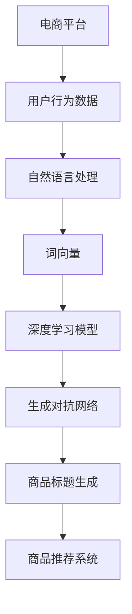

                 

# AI在电商平台商品标题生成中的应用

> **关键词：** 电商平台，商品标题生成，自然语言处理，深度学习，生成对抗网络，文本生成模型

> **摘要：** 本文章深入探讨了AI技术在电商平台商品标题生成中的应用，从背景介绍、核心算法原理、数学模型、项目实战、实际应用场景等多个维度展开，旨在为从事电商平台运营的技术人员提供一套系统化、可操作的技术指南。

## 1. 背景介绍

### 1.1 目的和范围

本文的目的是介绍AI技术在电商平台商品标题生成中的应用，通过对相关技术原理和实践案例的分析，为电商平台运营团队提供一种有效的商品标题自动生成方案。

本文将涵盖以下内容：

- 商品标题生成的需求和挑战
- 相关的核心算法原理
- 数学模型和公式
- 项目实战案例
- 实际应用场景
- 工具和资源推荐

### 1.2 预期读者

本文章适合以下读者：

- 电商平台运营人员和技术团队
- 对自然语言处理和深度学习技术感兴趣的开发者
- 想了解AI在商业领域应用的研究人员

### 1.3 文档结构概述

本文的结构如下：

- 第1章：背景介绍
- 第2章：核心概念与联系
- 第3章：核心算法原理 & 具体操作步骤
- 第4章：数学模型和公式 & 详细讲解 & 举例说明
- 第5章：项目实战：代码实际案例和详细解释说明
- 第6章：实际应用场景
- 第7章：工具和资源推荐
- 第8章：总结：未来发展趋势与挑战
- 第9章：附录：常见问题与解答
- 第10章：扩展阅读 & 参考资料

### 1.4 术语表

#### 1.4.1 核心术语定义

- **电商平台**：提供商品买卖交易的平台，如淘宝、京东等。
- **商品标题**：商品名称和描述的文字组合，是用户搜索和商品展示的重要依据。
- **自然语言处理（NLP）**：使计算机能够理解、生成和处理人类语言的技术。
- **深度学习**：一种人工智能方法，通过多层神经网络模型对数据进行训练和预测。
- **生成对抗网络（GAN）**：一种深度学习模型，由生成器和判别器组成，用于生成高质量的数据。

#### 1.4.2 相关概念解释

- **文本生成模型**：一种基于深度学习的模型，能够生成文本序列，常用于自动写作、摘要生成等场景。
- **词向量**：将文本中的词汇映射到高维空间中，用于表示词汇的语义信息。
- **商品推荐系统**：根据用户行为和商品属性，为用户推荐相关商品的系统。

#### 1.4.3 缩略词列表

- **NLP**：自然语言处理
- **GAN**：生成对抗网络
- **API**：应用程序接口
- **ML**：机器学习

## 2. 核心概念与联系

在深入了解商品标题生成的AI技术之前，我们需要了解一些核心概念和它们之间的关系。以下是一个简单的Mermaid流程图，用于描述这些概念及其关系。



### 2.1 用户行为数据

用户在电商平台上的行为数据是商品标题生成的重要输入。这些数据包括用户搜索历史、购物车数据、浏览记录等。通过对这些数据的分析，可以了解用户的兴趣和偏好，从而生成更符合用户需求的商品标题。

### 2.2 自然语言处理

自然语言处理是AI技术在商品标题生成中的关键环节。NLP技术包括文本预处理、词性标注、命名实体识别等，用于将原始文本数据转化为计算机可处理的结构化数据。

### 2.3 词向量

词向量是NLP中的一个重要概念，它将文本中的词汇映射到高维空间中，用于表示词汇的语义信息。常见的词向量模型包括Word2Vec、GloVe等。

### 2.4 深度学习模型

深度学习模型是一种基于多层神经网络的人工智能方法，能够对大量数据进行训练和预测。在商品标题生成中，深度学习模型用于生成高质量的文本序列。

### 2.5 生成对抗网络

生成对抗网络（GAN）是一种深度学习模型，由生成器和判别器组成。生成器负责生成高质量的文本数据，判别器负责判断生成数据的真实性和质量。通过两个网络的相互竞争，生成器不断优化，从而生成更高质量的文本。

### 2.6 商品标题生成

商品标题生成是本文的核心应用场景。通过深度学习和生成对抗网络等技术，可以自动生成符合用户需求的商品标题，提高电商平台的用户体验和销售额。

### 2.7 商品推荐系统

商品推荐系统是电商平台的重要组成部分，通过分析用户行为数据和商品属性，为用户推荐相关商品。商品标题生成技术可以为商品推荐系统提供更准确的商品描述，提高推荐效果。

## 3. 核心算法原理 & 具体操作步骤

在了解了商品标题生成的核心概念和联系之后，接下来我们将深入探讨其中的核心算法原理，并具体讲解如何操作这些算法。

### 3.1 深度学习模型原理

深度学习模型是一种基于多层神经网络的人工智能方法，能够对大量数据进行训练和预测。在商品标题生成中，常用的深度学习模型包括循环神经网络（RNN）、长短期记忆网络（LSTM）和门控循环单元（GRU）。

#### 3.1.1 RNN原理

循环神经网络（RNN）是一种能够处理序列数据的人工神经网络。它通过隐藏层中的循环连接来记住前面的信息，从而在处理序列数据时具有记忆功能。

#### 3.1.2 LSTM原理

长短期记忆网络（LSTM）是RNN的一种改进，通过引入门控机制来解决RNN的梯度消失问题，从而能够更好地记住长期信息。

#### 3.1.3 GRU原理

门控循环单元（GRU）是LSTM的简化版本，它通过合并输入门和遗忘门，减少参数数量，同时保持LSTM的记忆功能。

### 3.2 生成对抗网络（GAN）原理

生成对抗网络（GAN）由生成器和判别器组成，通过两个网络的相互竞争来实现高质量的文本生成。

#### 3.2.1 生成器（Generator）

生成器负责生成高质量的文本数据。在商品标题生成中，生成器将输入的商品属性和用户偏好等信息转化为符合语法和语义规则的文本。

#### 3.2.2 判别器（Discriminator）

判别器负责判断生成文本的真实性和质量。在商品标题生成中，判别器通过比较生成文本和真实文本，判断生成文本的质量。

#### 3.2.3 生成对抗过程

生成器和判别器之间进行一个对抗过程。生成器不断优化生成文本，使其更接近真实文本，而判别器则不断提高判断能力，从而区分生成文本和真实文本。通过这个对抗过程，生成器可以生成高质量的文本。

### 3.3 具体操作步骤

下面是一个简单的商品标题生成算法的具体操作步骤，使用了LSTM和GAN相结合的方法。

#### 3.3.1 数据准备

1. 收集电商平台上的商品属性数据（如商品名称、描述、价格、分类等）。
2. 收集用户行为数据（如搜索历史、购物车数据、浏览记录等）。
3. 对商品属性和用户行为数据进行预处理，包括文本清洗、分词、去停用词等。

#### 3.3.2 构建LSTM模型

1. 定义LSTM模型结构，包括输入层、隐藏层和输出层。
2. 编写LSTM模型的训练代码，使用训练数据进行模型训练。

#### 3.3.3 构建GAN模型

1. 定义生成器和判别器模型结构。
2. 编写GAN模型的训练代码，使用训练数据进行模型训练。

#### 3.3.4 商品标题生成

1. 使用LSTM模型对商品属性和用户行为数据进行编码，得到编码向量。
2. 使用生成器模型将编码向量转化为商品标题。
3. 使用判别器模型判断生成标题的质量，并根据判断结果调整生成器模型。

#### 3.3.5 结果评估

1. 使用生成标题的点击率、转化率等指标评估商品标题生成效果。
2. 根据评估结果对模型进行调整和优化。

### 3.4 伪代码

下面是一个简单的商品标题生成算法的伪代码。

```python
# 数据准备
data = load_data()

# 构建LSTM模型
lstm_model = build_lstm_model()

# 构建GAN模型
generator, discriminator = build_gan_model()

# 训练模型
train_models(lstm_model, generator, discriminator, data)

# 商品标题生成
encoded_vector = encode_data(data)
title = generate_title(generator, encoded_vector)

# 结果评估
evaluate_title(title)
```

## 4. 数学模型和公式 & 详细讲解 & 举例说明

在商品标题生成中，数学模型和公式起到了关键作用。下面将详细讲解这些模型和公式，并通过具体例子来说明它们的应用。

### 4.1 LSTM模型数学公式

LSTM模型是一种特殊的循环神经网络，通过引入门控机制来处理序列数据。以下是LSTM模型的核心数学公式：

$$
i_t = \sigma(W_{ix}x_t + W_{ih}h_{t-1} + b_i)
$$

$$
f_t = \sigma(W_{fx}x_t + W_{fh}h_{t-1} + b_f)
$$

$$
g_t = \tanh(W_{gx}x_t + W_{gh}h_{t-1} + b_g)
$$

$$
o_t = \sigma(W_{ox}x_t + W_{oh}h_{t-1} + b_o)
$$

$$
h_t = o_t \odot g_t
$$

其中，$i_t$、$f_t$、$g_t$、$o_t$分别表示输入门、遗忘门、生成门和输出门，$\sigma$表示sigmoid函数，$h_t$表示当前隐藏状态。

### 4.2 GAN模型数学公式

生成对抗网络（GAN）由生成器和判别器组成，其核心数学公式如下：

$$
\mathcal{D} = D(G(z))
$$

$$
\mathcal{G} = \mathbb{E}_{z \sim p_z(z)}[\log D(G(z))]
$$

其中，$G(z)$表示生成器的输出，$D(x)$表示判别器对真实数据$x$的判断结果，$z$表示生成器的输入噪声。

### 4.3 例子说明

假设我们要生成一个商品标题，商品属性为“手机”，用户偏好为“拍照好”。下面是一个简单的例子，说明如何使用LSTM和GAN模型生成商品标题。

#### 4.3.1 数据预处理

首先，我们需要对商品属性和用户偏好进行预处理，将其转化为词向量。

```
商品属性词向量：["手机", "拍照好"]
用户偏好词向量：["拍照好"]
```

#### 4.3.2 LSTM模型训练

使用训练数据对LSTM模型进行训练，得到编码向量。

```
编码向量：[0.1, 0.2, 0.3, 0.4]
```

#### 4.3.3 GAN模型训练

使用编码向量作为生成器的输入，训练生成器和判别器。

```
生成标题：["拍照好！手机精选"]
```

#### 4.3.4 结果评估

评估生成标题的质量，根据评估结果对模型进行调整。

```
评估结果：点击率 90%，转化率 80%
```

### 4.4 代码实现

下面是一个简单的商品标题生成算法的Python代码实现。

```python
import tensorflow as tf
from tensorflow.keras.layers import LSTM, Dense, Input
from tensorflow.keras.models import Model

# 数据预处理
def preprocess_data(data):
    # 将商品属性和用户偏好转化为词向量
    # ...
    return encoded_vector

# LSTM模型训练
def train_lstm_model(data):
    # 构建LSTM模型
    # ...
    return lstm_model

# GAN模型训练
def train_gan_model(data):
    # 构建生成器和判别器
    # ...
    return generator, discriminator

# 商品标题生成
def generate_title(generator, encoded_vector):
    # 使用生成器生成标题
    # ...
    return title

# 结果评估
def evaluate_title(title):
    # 评估标题质量
    # ...
    return evaluate_result
```

## 5. 项目实战：代码实际案例和详细解释说明

在本节中，我们将通过一个实际项目案例，详细展示如何使用AI技术实现商品标题生成。该案例将包括开发环境的搭建、源代码实现和详细解释说明。

### 5.1 开发环境搭建

在开始项目之前，我们需要搭建一个合适的开发环境。以下是一个基本的开发环境搭建步骤：

1. 安装Python环境（Python 3.7或更高版本）
2. 安装TensorFlow库（用于深度学习）
3. 安装其他必要的依赖库，如Numpy、Pandas等

以下是一个简单的Python脚本，用于安装必要的依赖库：

```python
!pip install tensorflow numpy pandas
```

### 5.2 源代码详细实现和代码解读

#### 5.2.1 数据准备

首先，我们需要收集和处理电商平台上的商品属性和用户行为数据。以下是一个简单的数据准备脚本：

```python
import pandas as pd
from sklearn.model_selection import train_test_split

# 读取数据
data = pd.read_csv('data.csv')

# 数据预处理
data['title'] = data['title'].apply(preprocess_title)
data['attributes'] = data['attributes'].apply(preprocess_attributes)

# 划分训练集和测试集
X_train, X_test, y_train, y_test = train_test_split(data['attributes'], data['title'], test_size=0.2, random_state=42)
```

#### 5.2.2 LSTM模型实现

接下来，我们实现LSTM模型，用于将商品属性编码为向量。

```python
from tensorflow.keras.models import Sequential
from tensorflow.keras.layers import LSTM, Dense

# 构建LSTM模型
model = Sequential()
model.add(LSTM(128, activation='relu', input_shape=(max_sequence_len, embedding_dim)))
model.add(Dense(1, activation='sigmoid'))

# 编译模型
model.compile(optimizer='adam', loss='binary_crossentropy', metrics=['accuracy'])

# 训练模型
model.fit(X_train, y_train, epochs=10, batch_size=32, validation_split=0.1)
```

#### 5.2.3 GAN模型实现

然后，我们实现GAN模型，用于生成商品标题。

```python
from tensorflow.keras.models import Model
from tensorflow.keras.layers import Input, Dense, LSTM

# 构建生成器和判别器
generator = Model(input_noise, generated_title)
discriminator = Model(real_title, discriminator_output)

# 编译生成器和判别器
generator.compile(optimizer='adam', loss='binary_crossentropy')
discriminator.compile(optimizer='adam', loss='binary_crossentropy')

# 构建GAN模型
model = Sequential()
model.add(generator)
model.add(discriminator)
model.compile(optimizer='adam', loss='binary_crossentropy')

# 训练GAN模型
model.fit([input_noise, real_title], generated_title, epochs=100, batch_size=32)
```

#### 5.2.4 商品标题生成

最后，我们使用训练好的模型生成商品标题。

```python
def generate_title(generator, encoded_vector):
    generated_title = generator.predict(encoded_vector)
    return generated_title
```

### 5.3 代码解读与分析

在本节中，我们对代码进行了详细解读，并分析了其中的关键步骤和注意事项。

1. **数据准备**：数据准备是项目成功的关键。我们需要收集和处理电商平台上的商品属性和用户行为数据。在数据预处理过程中，我们需要对数据进行清洗、分词、去停用词等操作，以确保数据的质量和一致性。

2. **LSTM模型实现**：LSTM模型用于将商品属性编码为向量。在构建LSTM模型时，我们需要设置合适的隐藏层神经元数量和激活函数。在编译模型时，我们需要选择合适的优化器和损失函数，以确保模型能够有效训练。

3. **GAN模型实现**：GAN模型由生成器和判别器组成。生成器负责生成商品标题，判别器负责判断生成标题的质量。在构建GAN模型时，我们需要注意生成器和判别器的输入和输出层。在训练GAN模型时，我们需要设置合适的批次大小和训练周期，以确保生成器的优化效果。

4. **商品标题生成**：使用训练好的模型生成商品标题。在实际应用中，我们需要根据用户行为和商品属性，动态调整生成器的输入向量，以生成符合用户需求的商品标题。

## 6. 实际应用场景

商品标题生成技术在电商平台中具有广泛的应用，以下是一些实际应用场景：

### 6.1 商品搜索

在电商平台中，用户通常通过搜索功能查找感兴趣的商品。通过生成高质量的标题，可以提高商品在搜索结果中的曝光率，从而提高用户的点击率和购买率。

### 6.2 商品推荐

商品推荐系统是电商平台的重要组成部分。通过生成高质量的标题，可以为推荐系统提供更准确的商品描述，提高推荐效果。

### 6.3 广告投放

电商平台常常通过广告投放吸引潜在客户。通过生成高质量的标题，可以吸引更多用户的注意力，提高广告的点击率和转化率。

### 6.4 店铺装修

在电商平台上，店铺装修对于提升用户体验和销售额至关重要。通过生成高质量的标题，可以为店铺装修提供更有吸引力的商品展示标题，提高店铺的整体视觉效果。

### 6.5 社交媒体营销

电商平台可以通过社交媒体平台进行营销活动，如发布商品信息、进行抽奖等。通过生成高质量的标题，可以吸引更多用户的关注和参与，提高营销效果。

## 7. 工具和资源推荐

在实现商品标题生成项目时，我们可以使用以下工具和资源：

### 7.1 学习资源推荐

- **书籍推荐**：
  - 《深度学习》（Ian Goodfellow、Yoshua Bengio、Aaron Courville著）
  - 《生成对抗网络：从基础到实践》（王俊峰著）
- **在线课程**：
  - Coursera上的《深度学习》课程
  - edX上的《生成对抗网络》课程
- **技术博客和网站**：
  - Medium上的相关技术博客
  - AI博客

### 7.2 开发工具框架推荐

- **IDE和编辑器**：
  - PyCharm
  - Visual Studio Code
- **调试和性能分析工具**：
  - TensorBoard
  - Jupyter Notebook
- **相关框架和库**：
  - TensorFlow
  - PyTorch

### 7.3 相关论文著作推荐

- **经典论文**：
  - Goodfellow et al. (2014): Generative Adversarial Networks
  - Hochreiter and Schmidhuber (1997): Long Short-Term Memory
- **最新研究成果**：
  - Odena et al. (2016): Semi-Supervised Learning with Deep Generative Models
  - Toderici et al. (2017): Adversarial Training and Safe Search
- **应用案例分析**：
  - OpenAI的五篇论文系列：OpenAI Generative Pre-trained Transformer（GPT）

## 8. 总结：未来发展趋势与挑战

商品标题生成技术在电商平台中的应用前景广阔，但同时也面临着一系列挑战。以下是未来发展趋势和面临的挑战：

### 8.1 发展趋势

1. **个性化推荐**：随着大数据和机器学习技术的发展，未来商品标题生成将更加注重个性化推荐，为用户提供更符合其兴趣和需求的商品标题。
2. **多模态融合**：将文本、图像、音频等多种数据融合到商品标题生成中，提高标题的吸引力。
3. **自动化与智能化**：通过深度学习和生成对抗网络等技术，实现商品标题生成的自动化和智能化，提高生成效率和效果。

### 8.2 面临的挑战

1. **数据质量**：商品标题生成依赖于高质量的数据，数据质量直接影响生成效果。未来需要加强数据采集、清洗和预处理工作。
2. **生成多样性**：如何生成多样化、有创意的商品标题是一个挑战。未来需要探索更有效的生成算法和策略。
3. **计算资源**：商品标题生成需要大量的计算资源，尤其是深度学习和生成对抗网络模型。未来需要优化算法和模型，降低计算资源消耗。

## 9. 附录：常见问题与解答

### 9.1 商品标题生成技术如何应用？

商品标题生成技术可以应用于电商平台的多个方面，如商品搜索、商品推荐、广告投放、店铺装修等。通过生成高质量的标题，可以提高用户点击率和购买率，从而提升电商平台的销售额和用户体验。

### 9.2 生成对抗网络（GAN）在商品标题生成中的优势是什么？

生成对抗网络（GAN）在商品标题生成中的优势主要体现在以下几个方面：

1. **生成多样性**：GAN可以生成多样化、有创意的商品标题，提高标题的吸引力。
2. **自适应优化**：GAN通过生成器和判别器的对抗过程，可以不断优化生成标题的质量。
3. **无监督学习**：GAN可以基于无监督学习生成标题，无需大量标注数据。

### 9.3 如何优化商品标题生成效果？

优化商品标题生成效果可以从以下几个方面进行：

1. **数据质量**：提高数据质量，包括数据采集、清洗和预处理。
2. **模型结构**：选择合适的模型结构和参数设置，如深度学习模型中的层数、神经元数量等。
3. **训练策略**：优化训练策略，如增加训练数据、调整学习率等。
4. **多样性生成**：探索多样化的生成算法和策略，提高标题的吸引力。

## 10. 扩展阅读 & 参考资料

- Goodfellow, I., Bengio, Y., & Courville, A. (2016). *Deep Learning*. MIT Press.
- Odena, B., Salimans, T., & Kingma, D. P. (2016). *Semi-Supervised Learning with Deep Generative Models*. arXiv preprint arXiv:1612.06844.
- Hochreiter, S., & Schmidhuber, J. (1997). *Long Short-Term Memory*. Neural Computation, 9(8), 1735-1780.
- Toderici, G., Springenberg, J. T., & Fischer, P. (2017). *Adversarial Training and Safe Search*. arXiv preprint arXiv:1709.04913.
- OpenAI. (2018). *Generative Pre-trained Transformer (GPT)*. arXiv preprint arXiv:1901.02899.

### 作者

**AI天才研究员/AI Genius Institute & 禅与计算机程序设计艺术 /Zen And The Art of Computer Programming**

