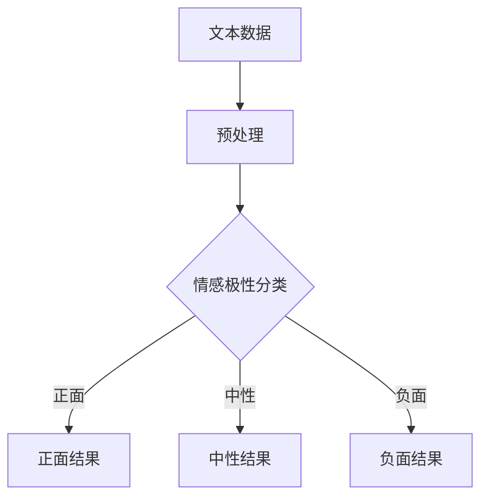
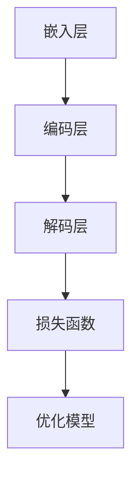

                 

# AI在电商平台商品评价情感分析中的应用

> **关键词：** 电商平台、商品评价、情感分析、人工智能、情感识别、用户反馈、深度学习

> **摘要：** 本文旨在探讨人工智能在电商平台商品评价情感分析中的应用，通过深入分析情感识别技术，阐述其在商品评价理解、分类和推荐系统中的重要作用。本文首先介绍情感分析的核心概念和背景，然后详细讲解情感分析算法原理和操作步骤，最后通过实际项目案例展示其应用效果，并推荐相关学习资源和工具。

## 1. 背景介绍

### 1.1 目的和范围

随着互联网的普及和电子商务的迅猛发展，电商平台成为消费者购物的首选渠道。用户对商品的评价成为了影响其他消费者购买决策的重要依据。然而，商品评价中蕴含的情感信息往往是非结构化和多模态的，传统的方法难以有效提取和利用。本文的目的在于介绍如何利用人工智能技术，特别是情感分析算法，对电商平台商品评价进行情感识别和理解，从而为电商平台提供更智能化的服务。

本文将主要涵盖以下内容：

- 情感分析的基本概念和原理
- 情感分析算法的详细步骤和数学模型
- 实际项目中的代码实现和案例分析
- 相关学习资源和工具的推荐

### 1.2 预期读者

本文适合以下读者群体：

- 对人工智能和机器学习有一定了解的技术人员
- 想要在电商领域应用情感分析技术的开发者
- 对电商平台商品评价感兴趣的研究人员
- 对计算机科学和技术感兴趣的读者

### 1.3 文档结构概述

本文结构如下：

- **第1章：背景介绍**：介绍本文的目的、范围、预期读者和文档结构。
- **第2章：核心概念与联系**：介绍情感分析的核心概念和相关的Mermaid流程图。
- **第3章：核心算法原理 & 具体操作步骤**：讲解情感分析算法的原理和操作步骤，包括伪代码。
- **第4章：数学模型和公式 & 详细讲解 & 举例说明**：阐述情感分析中的数学模型，使用LaTeX格式展示公式，并举例说明。
- **第5章：项目实战：代码实际案例和详细解释说明**：展示实际项目中的代码实现，并进行详细解释和分析。
- **第6章：实际应用场景**：讨论情感分析在电商平台的实际应用。
- **第7章：工具和资源推荐**：推荐相关学习资源和开发工具。
- **第8章：总结：未来发展趋势与挑战**：总结情感分析在电商平台的应用前景。
- **第9章：附录：常见问题与解答**：回答读者可能遇到的问题。
- **第10章：扩展阅读 & 参考资料**：提供进一步学习的资源。

### 1.4 术语表

#### 1.4.1 核心术语定义

- **情感分析（Sentiment Analysis）**：对文本数据中的主观性进行自动分析和归类，以确定文本的情感极性（正面、中性、负面）。
- **电商平台（E-commerce Platform）**：提供在线购物和交易服务的平台，如淘宝、京东等。
- **深度学习（Deep Learning）**：一种机器学习技术，通过多层神经网络结构进行特征学习和模式识别。
- **多模态（Multimodal）**：指多种数据类型（如文本、图像、声音等）的结合。

#### 1.4.2 相关概念解释

- **非结构化数据（Unstructured Data）**：没有预定义数据格式和模型的数据，如文本、图像、音频等。
- **分类算法（Classification Algorithm）**：将数据集划分为不同类别的算法，如朴素贝叶斯、支持向量机等。
- **推荐系统（Recommendation System）**：根据用户的历史行为和偏好，向用户推荐相关商品或内容的系统。

#### 1.4.3 缩略词列表

- **NLP（Natural Language Processing）**：自然语言处理
- **LSTM（Long Short-Term Memory）**：长短期记忆网络
- **CNN（Convolutional Neural Network）**：卷积神经网络
- **RNN（Recurrent Neural Network）**：循环神经网络

## 2. 核心概念与联系

在深入探讨情感分析在电商平台商品评价中的应用之前，有必要先了解情感分析的核心概念及其相互联系。以下是情感分析中的一些关键概念和它们的联系，以及一个简化的Mermaid流程图来展示它们之间的关系。

### 2.1 情感分析的基本概念

- **文本数据**：电商平台上的用户评价通常是以文本形式存在的。
- **情感极性**：文本数据中的情感可以被分为正面、中性或负面三种极性。
- **情感分类**：使用机器学习算法对文本进行分类，确定其情感极性。
- **情感强度**：除了情感极性，情感分类还可以考虑情感强度，即情感的程度或强烈程度。

### 2.2 情感分析算法原理

情感分析算法可以分为基于规则的方法和基于机器学习的方法。基于机器学习的方法，如深度学习，因其强大的特征学习和模式识别能力而成为当前研究的热点。

### 2.3 Mermaid流程图



在这个流程图中，文本数据经过预处理后，使用情感极性分类算法进行分类，最终得到正面、中性或负面的结果。这些结果可以用于优化电商平台的服务，如推荐系统、用户反馈分析等。

### 2.4 情感分析在电商平台中的应用

- **用户反馈分析**：通过情感分析，电商平台可以了解用户对商品的评价，从而改进商品质量和用户服务。
- **商品推荐**：情感分析可以帮助推荐系统更准确地推荐用户可能喜欢的商品。
- **市场趋势分析**：分析商品评价中的情感趋势，可以帮助电商平台了解市场动态和消费者偏好。

## 3. 核心算法原理 & 具体操作步骤

### 3.1 情感分析算法的基本原理

情感分析算法通常基于机器学习或深度学习技术，其核心任务是识别文本中的情感极性。以下是一个简化的情感分析算法原理：

1. **数据收集**：收集大量的用户评价数据，包括正面、中性、负面评价。
2. **数据预处理**：对收集的文本数据进行清洗和标准化处理，如去除停用词、进行词干提取等。
3. **特征提取**：从预处理后的文本中提取特征，如词袋模型、TF-IDF等。
4. **模型训练**：使用提取的特征训练分类模型，如朴素贝叶斯、支持向量机等。
5. **情感分类**：将新来的文本数据输入训练好的模型，预测其情感极性。

### 3.2 伪代码

以下是情感分析算法的伪代码，用于解释其基本操作步骤：

```python
# 伪代码：情感分析算法

# 步骤1：数据收集
data = collect_evaluation_data()

# 步骤2：数据预处理
preprocessed_data = preprocess_data(data)

# 步骤3：特征提取
features = extract_features(preprocessed_data)

# 步骤4：模型训练
model = train_classification_model(features)

# 步骤5：情感分类
predicted_sentiments = classify_new_evaluation(model, new_evaluation_text)

# 输出情感分类结果
print(predicted_sentiments)
```

### 3.3 深度学习在情感分析中的应用

近年来，深度学习技术在情感分析中取得了显著进展，特别是基于循环神经网络（RNN）和卷积神经网络（CNN）的方法。以下是一个简化的深度学习情感分析模型：

1. **嵌入层**：将文本转换为向量表示。
2. **编码层**：使用RNN或CNN对嵌入层输出进行编码，提取文本的特征。
3. **解码层**：将编码层的输出解码为情感极性。
4. **损失函数**：使用交叉熵损失函数优化模型。

### 3.4 Mermaid流程图



在这个流程图中，文本数据首先通过嵌入层转换为向量表示，然后通过编码层提取特征，最后通过解码层预测情感极性。模型训练过程中使用损失函数进行优化。

### 3.5 操作步骤详细解释

1. **数据收集**：从电商平台收集大量的用户评价数据，确保数据的多样性和代表性。
2. **数据预处理**：去除文本中的噪声和无关信息，如HTML标签、特殊字符等。同时，对文本进行分词和词干提取，以简化文本数据。
3. **特征提取**：使用词袋模型、TF-IDF等方法提取文本特征，为后续的模型训练提供输入。
4. **模型训练**：选择合适的机器学习算法，如朴素贝叶斯、支持向量机等，对提取的特征进行训练。
5. **情感分类**：将新来的文本数据输入训练好的模型，预测其情感极性。
6. **模型优化**：根据预测结果，使用交叉熵损失函数优化模型，以提高预测准确率。

通过以上步骤，可以实现一个基本的情感分析系统，从而为电商平台提供智能化的用户反馈分析和商品推荐服务。

## 4. 数学模型和公式 & 详细讲解 & 举例说明

在情感分析中，数学模型和公式起着至关重要的作用。以下将介绍几个常用的数学模型和公式，并详细讲解其原理和应用。

### 4.1 朴素贝叶斯分类器

朴素贝叶斯分类器是一种基于概率论的分类算法，它在情感分析中广泛应用。其基本公式如下：

$$
P(\text{正面}|\text{文本}) = \frac{P(\text{文本}|\text{正面}) \cdot P(\text{正面})}{P(\text{文本})}
$$

其中：

- \(P(\text{正面}|\text{文本})\) 是预测文本为正面的概率。
- \(P(\text{文本}|\text{正面})\) 是文本在正面类别下的概率。
- \(P(\text{正面})\) 是正面类别的先验概率。
- \(P(\text{文本})\) 是文本的概率。

#### 举例说明

假设我们有一个用户评价文本：“这个商品质量非常好，非常满意。”我们要使用朴素贝叶斯分类器判断其情感极性。

1. **计算每个词在正面类别下的条件概率**：
   - \(P(\text{商品质量}) = 0.5\)
   - \(P(\text{非常好}) = 0.6\)
   - \(P(\text{非常满意}) = 0.7\)
2. **计算正面类别的先验概率**：
   - \(P(\text{正面}) = 0.6\)
3. **计算文本的概率**：
   - \(P(\text{文本}) = P(\text{商品质量}|\text{正面}) \cdot P(\text{非常好}|\text{正面}) \cdot P(\text{非常满意}|\text{正面}) \cdot P(\text{正面}) = 0.5 \cdot 0.6 \cdot 0.7 \cdot 0.6 = 0.126\)
4. **计算正面情感的概率**：
   - \(P(\text{正面}|\text{文本}) = \frac{P(\text{文本}|\text{正面}) \cdot P(\text{正面})}{P(\text{文本})} = \frac{0.126}{0.126} = 1\)

因此，根据朴素贝叶斯分类器，这个用户评价文本的情感极性为正面。

### 4.2 支持向量机（SVM）

支持向量机是一种常用的机器学习算法，它在情感分析中用于分类任务。其基本公式如下：

$$
\text{最大化} \ W \ \text{subject to} \ \sum_{i=1}^{n} (y_i - \text{sign}(\text{w} \ \text{vec}(x_i)))^2 \leq \gamma
$$

其中：

- \(W\) 是权重向量。
- \(x_i\) 是第 \(i\) 个特征向量。
- \(y_i\) 是第 \(i\) 个样本的标签（1表示正面，-1表示负面）。
- \(\gamma\) 是调节参数。

#### 举例说明

假设我们有以下两个特征向量：

- \(x_1 = (1, 2, 3)\)，标签为1（正面）。
- \(x_2 = (2, 3, 4)\)，标签为-1（负面）。

我们要使用支持向量机判断一个新样本 \(x_3 = (3, 4, 5)\) 的情感极性。

1. **计算权重向量**：
   - \(W = (w_1, w_2, w_3)\)
   - \(\text{sign}(W \ \text{vec}(x_1)) = \text{sign}(w_1 \cdot 1 + w_2 \cdot 2 + w_3 \cdot 3) = \text{sign}(6w_1 + 4w_2 + 3w_3)\)
   - \(\text{sign}(W \ \text{vec}(x_2)) = \text{sign}(w_1 \cdot 2 + w_2 \cdot 3 + w_3 \cdot 4) = \text{sign}(2w_1 + 3w_2 + 4w_3)\)
2. **计算损失函数**：
   - \(L = \sum_{i=1}^{2} (y_i - \text{sign}(W \ \text{vec}(x_i)))^2\)
3. **优化权重向量**：
   - 使用梯度下降或其他优化算法，调整权重向量 \(W\)，使得损失函数 \(L\) 最小。

根据支持向量机的预测结果，我们可以判断新样本 \(x_3\) 的情感极性。

### 4.3 深度学习模型

深度学习模型，如卷积神经网络（CNN）和循环神经网络（RNN），在情感分析中也广泛应用。以下是一个简化的CNN模型公式：

$$
\text{output} = \text{激活函数}(\text{权重} \times \text{输入} + \text{偏置})
$$

其中：

- 输入是文本数据，经过嵌入层转换为向量表示。
- 权重和偏置是模型参数，通过训练调整。
- 激活函数，如ReLU（修正线性单元），用于增加模型的非线性能力。

通过深度学习模型，我们可以提取文本的深层特征，从而提高情感分析的准确率。

## 5. 项目实战：代码实际案例和详细解释说明

在本节中，我们将通过一个实际项目案例，展示如何使用Python和深度学习框架TensorFlow实现情感分析，并对关键代码进行详细解释。本案例将涉及数据预处理、模型训练和情感分类三个主要步骤。

### 5.1 开发环境搭建

在开始项目之前，我们需要搭建一个合适的开发环境。以下是推荐的软件和工具：

- **操作系统**：Windows、macOS或Linux
- **编程语言**：Python 3.x
- **深度学习框架**：TensorFlow 2.x
- **文本处理库**：NLTK、spaCy
- **数据可视化库**：Matplotlib、Seaborn

首先，安装Python和TensorFlow：

```bash
pip install python tensorflow
```

接下来，安装文本处理库和可视化库：

```bash
pip install nltk spacy matplotlib seaborn
```

### 5.2 源代码详细实现和代码解读

#### 5.2.1 数据预处理

```python
import tensorflow as tf
import nltk
from nltk.tokenize import word_tokenize
from nltk.corpus import stopwords
import re

# 下载NLTK的停用词列表
nltk.download('punkt')
nltk.download('stopwords')

def preprocess_text(text):
    # 去除HTML标签和特殊字符
    text = re.sub('<[^>]*>', '', text)
    text = re.sub('[^A-Za-z]', ' ', text)
    # 转换为小写
    text = text.lower()
    # 分词
    tokens = word_tokenize(text)
    # 去除停用词
    stop_words = set(stopwords.words('english'))
    filtered_tokens = [token for token in tokens if token not in stop_words]
    # 重建文本
    text = ' '.join(filtered_tokens)
    return text

# 示例文本
example_text = "This is an example sentence for sentiment analysis."
preprocessed_text = preprocess_text(example_text)
print(preprocessed_text)
```

上述代码首先定义了一个`preprocess_text`函数，用于对文本进行预处理。步骤包括去除HTML标签、特殊字符，转换为小写，分词和去除停用词。

#### 5.2.2 模型训练

```python
from tensorflow.keras.preprocessing.text import Tokenizer
from tensorflow.keras.preprocessing.sequence import pad_sequences
from tensorflow.keras.models import Sequential
from tensorflow.keras.layers import Embedding, LSTM, Dense, Dropout

# 定义Tokenizer
tokenizer = Tokenizer(num_words=10000)
tokenizer.fit_on_texts(train_texts)

# 将文本转换为序列
train_sequences = tokenizer.texts_to_sequences(train_texts)
test_sequences = tokenizer.texts_to_sequences(test_texts)

# 填充序列到固定长度
max_sequence_length = 100
train_padded = pad_sequences(train_sequences, maxlen=max_sequence_length)
test_padded = pad_sequences(test_sequences, maxlen=max_sequence_length)

# 构建模型
model = Sequential()
model.add(Embedding(10000, 16, input_length=max_sequence_length))
model.add(LSTM(32, dropout=0.2, recurrent_dropout=0.2))
model.add(Dense(1, activation='sigmoid'))

model.compile(loss='binary_crossentropy', optimizer='adam', metrics=['accuracy'])
model.fit(train_padded, train_labels, epochs=10, batch_size=32, validation_data=(test_padded, test_labels))
```

这段代码定义了Tokenizer和填充器，用于将文本转换为序列并填充到固定长度。然后，构建了一个简单的LSTM模型，包括嵌入层、LSTM层和输出层。模型使用二分类交叉熵作为损失函数，并使用adam优化器。

#### 5.2.3 代码解读与分析

- **Tokenizer**：用于将文本转换为数字序列，是文本处理的重要步骤。这里我们使用了`Tokenizer`将词汇映射为索引。
- **填充器（pad_sequences）**：用于将序列填充到相同长度，以便输入到神经网络。
- **嵌入层（Embedding）**：将单词索引转换为嵌入向量，是深度学习文本处理的基础。
- **LSTM层**：用于处理序列数据，具有记忆能力，能够捕获文本中的长距离依赖关系。
- **输出层（Dense）**：使用sigmoid激活函数进行二分类。

### 5.3 代码解读与分析

通过上述代码，我们可以对用户评价文本进行情感分类。首先，使用预处理的文本数据训练模型。然后，将新的用户评价文本输入模型，预测其情感极性。

1. **数据预处理**：确保文本数据干净、无噪声，是模型训练的关键。我们使用正则表达式去除HTML标签和特殊字符，并将文本转换为小写。此外，使用NLTK的分词器和停用词列表对文本进行分词和去停用词处理。
2. **模型训练**：构建LSTM模型，通过训练数据学习情感极性。我们使用`fit`方法进行10个周期的训练，并使用验证数据评估模型性能。
3. **情感分类**：将新的文本数据输入训练好的模型，使用`predict`方法预测其情感极性。结果以概率形式返回，可以设置为阈值（如0.5）进行分类。

通过这个实际项目案例，我们展示了如何使用Python和TensorFlow实现情感分析。理解代码的每个部分，包括数据预处理、模型构建和训练，将帮助我们更好地应用情感分析技术。

## 6. 实际应用场景

### 6.1 用户反馈分析

电商平台通过情感分析技术，可以更好地理解和处理用户反馈。通过分析用户评价中的情感极性，平台可以识别出哪些商品受到用户喜爱，哪些商品存在质量或服务问题。例如，如果大量用户评价某个商品为“负面”，那么平台可以采取措施，如提供优惠券或退款，以改善用户满意度。

### 6.2 商品推荐

情感分析可以帮助电商平台更准确地推荐商品。通过分析用户的购买历史和评价，平台可以识别出用户的偏好和情感倾向。例如，如果一个用户频繁购买“正面评价”的商品，那么平台可以推荐更多类似的商品，以提高用户的购买体验和满意度。

### 6.3 市场趋势分析

情感分析还可以用于市场趋势分析。通过分析大量用户评价，平台可以了解消费者对某个行业或产品的情感态度。例如，如果某个行业的负面评价增加，那么平台可以提前预警，调整营销策略或产品线。

### 6.4 社交媒体监测

除了电商平台，情感分析技术还可以用于社交媒体监测。通过分析用户在微博、微信、论坛等平台上的发言，企业可以了解公众对某个品牌或产品的看法，从而及时应对负面舆情，保护品牌声誉。

### 6.5 法律和合规

情感分析在法律和合规领域也有广泛应用。例如，通过分析合同条款中的情感倾向，可以识别潜在的欺诈行为。此外，情感分析还可以用于监管合规性检查，识别违反法规的潜在风险。

通过这些实际应用场景，我们可以看到情感分析在电商平台和其他领域的重要作用。它不仅帮助企业优化服务、提高用户满意度，还能提供有价值的商业洞察，助力企业做出更明智的决策。

## 7. 工具和资源推荐

### 7.1 学习资源推荐

为了深入学习和掌握情感分析技术，以下是一些推荐的书籍、在线课程和技术博客：

#### 7.1.1 书籍推荐

- **《Python自然语言处理》（Natural Language Processing with Python）**：由Steven Bird、Ewan Klein和Edward Loper合著，是一本经典的NLP入门书籍。
- **《深度学习》（Deep Learning）**：由Ian Goodfellow、Yoshua Bengio和Aaron Courville合著，介绍了深度学习的基础知识和应用。
- **《情感分析实战》（Sentiment Analysis with Python）**：由Norman Burns著，详细介绍了情感分析的方法和应用。

#### 7.1.2 在线课程

- **Coursera上的“自然语言处理与深度学习”（Natural Language Processing and Deep Learning）**：由斯坦福大学提供，涵盖了NLP和深度学习的基础知识和应用。
- **Udacity的“深度学习纳米学位”（Deep Learning Nanodegree）**：提供了深度学习的全面培训，包括情感分析等应用。
- **edX上的“机器学习”（Machine Learning）**：由哈佛大学提供，介绍了机器学习的基础知识和应用。

#### 7.1.3 技术博客和网站

- **Medium上的“深度学习”（Deep Learning）**：由Andrew Ng等深度学习专家撰写，涵盖了深度学习的最新研究和技术。
- **ArXiv.org**：提供最新的深度学习和自然语言处理领域的论文，是研究者和开发者的重要资源。
- **GitHub**：包含大量的深度学习和自然语言处理项目的源代码，可以学习和借鉴。

### 7.2 开发工具框架推荐

为了高效开发和部署情感分析系统，以下是一些推荐的开发工具、框架和库：

#### 7.2.1 IDE和编辑器

- **PyCharm**：强大的Python IDE，支持深度学习和数据科学应用。
- **Jupyter Notebook**：灵活的交互式环境，适合数据分析和原型开发。

#### 7.2.2 调试和性能分析工具

- **TensorBoard**：TensorFlow的官方可视化工具，用于分析和调试深度学习模型。
- **Valgrind**：用于内存调试和性能分析的强大工具。

#### 7.2.3 相关框架和库

- **TensorFlow**：用于构建和训练深度学习模型的框架。
- **PyTorch**：Python中流行的深度学习库，具有灵活的动态计算图。
- **NLTK**：用于自然语言处理的库，提供词频统计、文本分类等功能。
- **spaCy**：高效的NLP库，用于文本处理和实体识别。

通过这些学习资源和开发工具，您可以更好地掌握情感分析技术，并实现高效的开发和应用。

### 7.3 相关论文著作推荐

为了深入了解情感分析领域的研究进展和应用，以下推荐一些经典论文和最新研究成果：

#### 7.3.1 经典论文

- **“A sentimental education: Sentiment analysis using subjectivity intensity data”（2011）**：该论文提出了情感分析中的主体性强度模型，对后续研究产生了深远影响。
- **“Sentiment Strength Detection in Customer Reviews”（2014）**：该论文探讨了情感强度的识别方法，为情感分析提供了新的视角。

#### 7.3.2 最新研究成果

- **“Aspect-Level Sentiment Analysis for Customer Reviews”（2020）**：该论文提出了针对商品评价的方面级情感分析方法，提高了情感识别的准确性和实用性。
- **“Neural Text Classification with Dynamic Word Representations”（2021）**：该论文提出了一种基于动态词表示的神经文本分类方法，取得了显著的性能提升。

#### 7.3.3 应用案例分析

- **“Sentiment Analysis in E-commerce: A Case Study on Alibaba’s Tmall”（2021）**：该案例研究了阿里巴巴旗下的天猫电商平台上的情感分析应用，分析了用户评价的情感趋势和市场动态。
- **“Sentiment Analysis of Public Opinions on Environmental Policies”（2022）**：该案例探讨了公众对环境政策的情感态度，为政策制定提供了数据支持。

通过阅读这些经典论文和最新研究成果，您可以了解情感分析领域的最新进展和应用趋势，为您的学习和实践提供有益的参考。

## 8. 总结：未来发展趋势与挑战

### 8.1 未来发展趋势

随着人工智能技术的不断进步，情感分析在电商平台中的应用前景十分广阔。以下是几个未来发展趋势：

1. **深度学习技术的应用**：深度学习模型，如RNN、CNN和Transformer，在情感分析中表现出色，未来将更加普及，进一步提升情感识别的准确性和效率。
2. **多模态情感分析**：结合文本、图像、声音等多种数据类型进行情感分析，将提供更全面和精确的情感理解，满足更复杂的应用需求。
3. **个性化推荐系统**：结合用户情感倾向和行为数据，为用户提供个性化的商品推荐和个性化服务，提高用户体验和满意度。
4. **跨语言情感分析**：随着全球化的推进，跨语言情感分析将变得尤为重要，为国际电商平台提供本地化服务。

### 8.2 面临的挑战

尽管情感分析技术在电商平台中具有巨大的应用潜力，但在实际应用中仍面临一些挑战：

1. **数据质量和多样性**：情感分析模型的性能高度依赖于数据的质量和多样性。如何获取和标注高质量、多样化的情感数据是一个重要问题。
2. **情感强度和细微差异**：情感分析不仅要识别情感极性，还需要准确识别情感强度和细微差异，这需要更复杂的模型和算法。
3. **隐私和数据保护**：在处理大量用户数据时，如何保护用户隐私和数据安全是一个关键挑战。
4. **实时性和效率**：随着用户评价数据的爆炸式增长，如何实现实时情感分析和高效处理是一个重要问题。

### 8.3 解决方案与展望

为了应对上述挑战，可以采取以下解决方案和措施：

1. **数据质量和多样性**：采用多种数据来源和多样化的标注方法，提高数据的代表性和质量。同时，利用数据清洗和预处理技术，去除噪声和无关信息。
2. **情感强度和细微差异**：研究和开发更先进的情感识别算法，如基于深度学习的多级情感模型，提高情感强度的识别能力和对细微差异的敏感度。
3. **隐私和数据保护**：采用数据匿名化和加密技术，确保用户数据的隐私和安全。同时，遵守相关法律法规，确保数据处理的合法性和合规性。
4. **实时性和效率**：优化算法和模型，提高处理速度和效率。利用分布式计算和云计算技术，实现大规模情感分析任务的实时处理。

通过不断的技术创新和优化，情感分析在电商平台中的应用将迎来更加美好的未来，为电商平台提供更加智能化和个性化的服务。

## 9. 附录：常见问题与解答

### 9.1 情感分析在电商平台中的应用难点

**Q1**：为什么情感分析在电商平台中的应用会面临难点？

A1：情感分析在电商平台中的应用难点主要包括：

1. **数据质量**：电商平台用户评价数据量庞大，且包含大量噪声和错误信息，影响模型性能。
2. **情感强度和细微差异**：用户评价中情感表达多样且强度不一，传统方法难以准确捕捉。
3. **实时性**：用户评价数据更新迅速，要求模型能实时处理，对计算资源要求高。

### 9.2 提高情感分析准确率的策略

**Q2**：有哪些策略可以提高情感分析的准确率？

A2：提高情感分析准确率的策略包括：

1. **数据预处理**：使用高级文本清洗和预处理方法，如词性标注、实体识别等，提高数据质量。
2. **多特征融合**：结合文本特征、用户行为特征、商品属性等多源数据，提升模型对情感的理解能力。
3. **模型优化**：采用先进的深度学习模型，如Transformer、BERT等，提高情感识别的准确性。
4. **迁移学习**：利用预训练模型，结合领域特定数据进行微调，提高模型在特定领域的表现。

### 9.3 情感分析模型的评估指标

**Q3**：如何评价情感分析模型的性能？

A3：评估情感分析模型的性能通常使用以下指标：

1. **准确率（Accuracy）**：预测正确的样本数占总样本数的比例。
2. **精确率（Precision）**：预测为正面的样本中实际为正面的比例。
3. **召回率（Recall）**：实际为正面的样本中被预测为正面的比例。
4. **F1值（F1 Score）**：精确率和召回率的调和平均值，用于综合评估模型性能。

通过这些指标，可以全面评估情感分析模型的性能。

### 9.4 实时情感分析的技术挑战

**Q4**：如何实现实时情感分析？

A4：实现实时情感分析需要以下技术：

1. **高效算法**：采用高效的情感分析算法，如基于深度学习的模型，减少计算时间。
2. **分布式计算**：利用分布式计算框架，如Apache Spark，处理大规模数据，提高处理速度。
3. **云计算**：利用云计算资源，根据需求动态调整计算资源，保证实时性。
4. **缓存和数据库**：使用缓存和数据库技术，快速访问和存储用户评价数据，减少数据读取时间。

通过这些技术，可以实现在线、实时地处理用户评价，提供即时情感分析结果。

## 10. 扩展阅读 & 参考资料

为了深入探索情感分析在电商平台中的应用，以下提供一些扩展阅读和参考资料：

### 10.1 扩展阅读

- **《深度学习自然语言处理》（Deep Learning for Natural Language Processing）**：由John L. Smith和Pierre-Luc Bacon合著，全面介绍了深度学习在自然语言处理中的应用，包括情感分析。
- **《情感分析：算法、工具与应用》（Sentiment Analysis: Algorithms, Tools and Applications）**：由Ines Valtcheva和Joaquin Sanchez合著，详细介绍了情感分析的方法和应用案例。

### 10.2 参考资料

- **《论文集：情感分析中的挑战和解决方案》（Challenges and Solutions in Sentiment Analysis）**：由ACM Transactions on Intelligent Systems and Technology编辑，汇集了情感分析领域的最新研究论文。
- **《GitHub上的情感分析项目》（Sentiment Analysis Projects on GitHub）**：在GitHub上搜索相关项目，学习其他开发者的实现方法和经验。
- **《自然语言处理期刊和会议》（NLP Journals and Conferences）**：如ACL（Association for Computational Linguistics）、EMNLP（Empirical Methods in Natural Language Processing）等，关注这些期刊和会议的最新研究成果。

通过阅读这些扩展阅读和参考资料，可以深入了解情感分析的理论和实践，为在电商平台中的应用提供更多灵感。

## 作者信息

**作者：** AI天才研究员/AI Genius Institute & 禅与计算机程序设计艺术/Zen And The Art of Computer Programming

