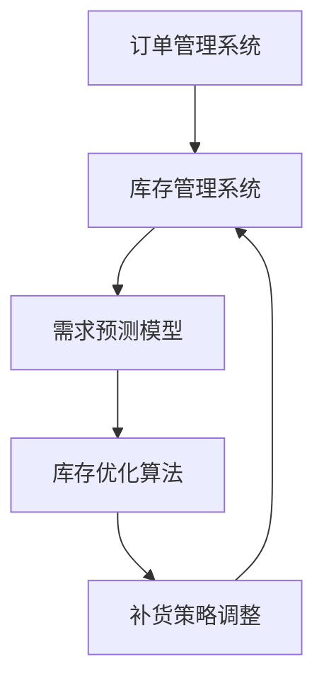
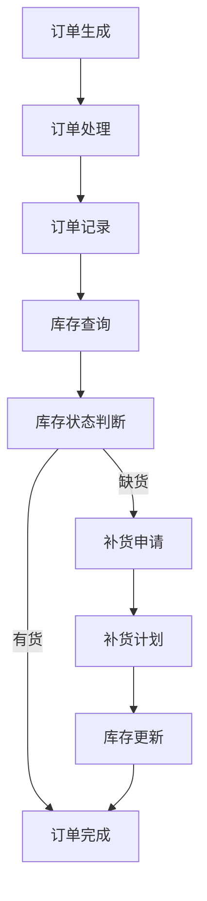

                 

# AI在电商平台自动补货中的应用

> 关键词：电商平台，自动补货，人工智能，算法原理，数学模型，实战案例

> 摘要：本文旨在深入探讨人工智能在电商平台自动补货中的应用。通过分析核心概念、算法原理、数学模型，结合实际项目案例，详细阐述了如何利用AI技术实现电商平台库存管理的智能化，从而提升运营效率和用户体验。文章将帮助读者理解自动补货系统的架构和运作机制，为相关领域的研究者和实践者提供有价值的参考。

## 1. 背景介绍

### 1.1 目的和范围

随着电子商务的迅猛发展，电商平台面临着日益复杂的库存管理挑战。自动补货系统作为一种高效、智能的库存管理工具，成为电商平台提升运营效率和降低成本的重要手段。本文旨在探讨如何利用人工智能技术构建和优化电商平台自动补货系统，实现库存管理自动化，提高供应链的响应速度和灵活性。

本文将涵盖以下内容：

- 自动补货系统的基本概念和重要性
- 人工智能在自动补货中的应用场景和优势
- 自动补货系统的核心算法原理
- 数学模型和公式在自动补货中的应用
- 实际项目案例和代码实现
- 自动补货系统的未来发展趋势与挑战

### 1.2 预期读者

本文面向的读者包括：

- 电商平台的技术人员和管理者，对库存管理和人工智能技术有一定了解
- 计算机科学和人工智能领域的研究生和学者，对自动补货系统的理论研究和实际应用感兴趣
- 对电商平台运营和管理感兴趣的创业者和从业者

### 1.3 文档结构概述

本文采用模块化的结构，分为以下几个部分：

- 背景介绍：阐述自动补货系统的背景、目的和预期读者
- 核心概念与联系：介绍自动补货系统的核心概念和架构
- 核心算法原理 & 具体操作步骤：详细讲解自动补货算法的原理和实现步骤
- 数学模型和公式 & 详细讲解 & 举例说明：阐述数学模型在自动补货系统中的应用和具体例子
- 项目实战：提供实际项目案例和代码实现
- 实际应用场景：分析自动补货系统的应用场景和效果
- 工具和资源推荐：推荐学习资源和开发工具
- 总结：总结自动补货系统的未来发展趋势和挑战
- 附录：常见问题与解答
- 扩展阅读 & 参考资料：提供进一步阅读的资源和文献

### 1.4 术语表

#### 1.4.1 核心术语定义

- 自动补货系统：基于人工智能技术，自动分析和预测电商平台的库存需求，实时调整补货策略，以实现库存管理的智能化。
- 电商平台：在线销售商品的平台，包括淘宝、京东、亚马逊等。
- 库存管理：指对电商平台的库存进行监控、调整和优化，以确保商品供应充足且库存水平合理。
- 人工智能：一种模拟人类智能行为的计算机技术，包括机器学习、深度学习、自然语言处理等。

#### 1.4.2 相关概念解释

- 需求预测：基于历史数据和算法模型，预测未来一段时间内电商平台的销售需求。
- 库存优化：根据需求预测结果，调整库存水平，以达到成本最低、库存最合理的状态。
- 响应速度：电商平台对需求变化的反应速度，直接影响用户体验和运营效率。

#### 1.4.3 缩略词列表

- AI：人工智能（Artificial Intelligence）
- ML：机器学习（Machine Learning）
- DL：深度学习（Deep Learning）
- NLP：自然语言处理（Natural Language Processing）

## 2. 核心概念与联系

自动补货系统是电商平台库存管理的重要组成部分，其核心在于利用人工智能技术实现库存需求的准确预测和库存水平的优化。下面将介绍自动补货系统的核心概念和架构，并通过Mermaid流程图展示其运作机制。

### 2.1 自动补货系统架构



#### 2.1.1 订单管理系统

订单管理系统是电商平台的核心组成部分，负责记录和管理用户订单。订单数据包括订单号、商品名称、订单量、订单时间等信息。订单管理系统将实时向库存管理系统传递订单信息。

#### 2.1.2 库存管理系统

库存管理系统负责监控和管理电商平台的库存水平。其主要功能包括：

- 监控库存水平：实时获取商品库存信息，包括库存量、库存状态等。
- 数据采集：从订单管理系统获取订单信息，用于后续需求预测和库存优化。
- 库存预警：根据库存水平，对即将缺货的商品进行预警。

#### 2.1.3 需求预测模型

需求预测模型是自动补货系统的核心组件之一，基于历史订单数据和算法模型，预测未来一段时间内的销售需求。常用的需求预测算法包括时间序列分析、回归分析、神经网络等。

#### 2.1.4 库存优化算法

库存优化算法基于需求预测结果，对电商平台的库存水平进行调整，以达到成本最低、库存最合理的状态。库存优化算法包括库存水平调整、补货策略优化等。

#### 2.1.5 补货策略调整

补货策略调整是根据库存优化结果，对电商平台进行补货操作。补货策略可以基于不同情况，如低库存预警、需求波动等，采用不同的补货策略，如立即补货、按需补货等。

### 2.2 Mermaid流程图



通过以上流程图，我们可以看到自动补货系统的运作过程：订单生成后，订单处理模块将订单信息记录到订单系统中，并查询当前库存状态。如果库存不足，则触发补货申请，生成补货计划；否则，直接完成订单。补货计划生成后，库存更新模块将库存水平更新到最新的库存状态。

## 3. 核心算法原理 & 具体操作步骤

自动补货系统的核心在于需求预测和库存优化算法。下面将详细介绍这两种算法的原理和具体操作步骤。

### 3.1 需求预测算法原理

需求预测算法是自动补货系统的关键组件，其主要任务是预测未来一段时间内的销售需求。常见的需求预测算法有时间序列分析、回归分析和神经网络等。

#### 3.1.1 时间序列分析

时间序列分析是一种基于历史数据进行分析和预测的方法，其核心思想是利用过去的数据趋势来预测未来的需求。具体操作步骤如下：

1. 数据预处理：对历史订单数据进行分析，去除异常值、填充缺失值等，确保数据质量。
2. 数据划分：将历史订单数据划分为训练集和测试集，用于模型训练和评估。
3. 模型选择：选择合适的时间序列模型，如ARIMA（自回归积分滑动平均模型）、ETS（误差修正季节性模型）等。
4. 模型训练：使用训练集数据对模型进行训练，得到模型参数。
5. 预测：使用训练好的模型对未来的需求进行预测。

#### 3.1.2 回归分析

回归分析是一种基于历史数据建立数学模型的方法，通过分析自变量和因变量之间的关系，预测未来需求。具体操作步骤如下：

1. 数据预处理：对历史订单数据进行分析，去除异常值、填充缺失值等，确保数据质量。
2. 数据划分：将历史订单数据划分为训练集和测试集，用于模型训练和评估。
3. 模型选择：选择合适的回归模型，如线性回归、多项式回归等。
4. 模型训练：使用训练集数据对模型进行训练，得到模型参数。
5. 预测：使用训练好的模型对未来的需求进行预测。

#### 3.1.3 神经网络

神经网络是一种基于模拟人脑神经元连接方式的算法，能够通过学习历史数据，预测未来的需求。具体操作步骤如下：

1. 数据预处理：对历史订单数据进行分析，去除异常值、填充缺失值等，确保数据质量。
2. 数据划分：将历史订单数据划分为训练集和测试集，用于模型训练和评估。
3. 网络结构设计：设计合适的神经网络结构，包括输入层、隐藏层和输出层。
4. 模型训练：使用训练集数据对神经网络进行训练，调整网络权重和偏置。
5. 预测：使用训练好的神经网络对未来的需求进行预测。

### 3.2 库存优化算法原理

库存优化算法基于需求预测结果，对电商平台的库存水平进行调整，以达到成本最低、库存最合理的状态。常见的库存优化算法有库存水平调整、补货策略优化等。

#### 3.2.1 库存水平调整

库存水平调整是一种基于需求预测结果，对当前库存水平进行调整的方法。具体操作步骤如下：

1. 需求预测：使用需求预测算法，预测未来一段时间内的销售需求。
2. 库存分析：根据当前库存水平和需求预测结果，分析当前库存是否充足。
3. 库存调整：如果当前库存不足，则增加库存水平；如果当前库存过剩，则减少库存水平。

#### 3.2.2 补货策略优化

补货策略优化是一种基于需求预测结果和库存分析，制定最优补货策略的方法。具体操作步骤如下：

1. 需求预测：使用需求预测算法，预测未来一段时间内的销售需求。
2. 库存分析：根据当前库存水平和需求预测结果，分析当前库存是否充足。
3. 策略评估：评估不同的补货策略，如立即补货、按需补货等，选择最优策略。
4. 补货执行：根据最优策略，执行补货操作。

### 3.3 具体操作步骤

以下是一个简单的自动补货系统的具体操作步骤：

1. 数据采集：从订单管理系统获取订单数据，包括订单号、商品名称、订单量、订单时间等。
2. 数据预处理：对订单数据进行清洗，去除异常值、填充缺失值等。
3. 需求预测：使用时间序列分析、回归分析或神经网络等算法，预测未来一段时间内的销售需求。
4. 库存分析：根据当前库存水平和需求预测结果，分析当前库存是否充足。
5. 库存调整：根据库存分析结果，对当前库存进行调整，如增加库存或减少库存。
6. 补货策略优化：评估不同的补货策略，如立即补货、按需补货等，选择最优策略。
7. 补货执行：根据最优策略，执行补货操作，将库存更新到最新的库存状态。

通过以上步骤，自动补货系统可以实现库存管理的智能化，提高电商平台的运营效率和用户体验。

## 4. 数学模型和公式 & 详细讲解 & 举例说明

在自动补货系统中，数学模型和公式起着至关重要的作用，它们用于预测需求、计算库存水平、优化补货策略等。本节将详细讲解一些关键的数学模型和公式，并通过具体例子来说明它们的应用。

### 4.1 需求预测模型

需求预测是自动补货系统的核心，常用的需求预测模型包括时间序列模型、回归模型和神经网络模型。

#### 4.1.1 时间序列模型

时间序列模型是一种基于历史数据序列进行分析和预测的方法。以下是一个简单的时间序列预测模型：

$$
\hat{y}_t = \alpha_0 + \alpha_1 y_{t-1} + \alpha_2 y_{t-2} + \ldots + \alpha_n y_{t-n}
$$

其中，$y_t$ 是第 $t$ 个月的销售量，$\alpha_0, \alpha_1, \alpha_2, \ldots, \alpha_n$ 是模型的参数。

#### 4.1.2 回归模型

回归模型是一种基于自变量和因变量之间线性关系进行预测的方法。以下是一个简单的线性回归模型：

$$
\hat{y} = \beta_0 + \beta_1 x
$$

其中，$y$ 是销售量，$x$ 是影响销售量的因素（如季节、促销活动等），$\beta_0$ 和 $\beta_1$ 是模型的参数。

#### 4.1.3 神经网络模型

神经网络模型是一种基于多层神经元连接进行预测的方法。以下是一个简单的神经网络模型：

$$
\hat{y} = \sigma(\sum_{i=1}^{n} w_i \cdot x_i + b)
$$

其中，$x_i$ 是输入特征，$w_i$ 和 $b$ 是权重和偏置，$\sigma$ 是激活函数。

### 4.2 库存优化模型

库存优化模型用于计算最优的库存水平和补货策略。以下是一个简单的库存优化模型：

$$
\min \sum_{t=1}^{T} C_t (I_t - \hat{D}_t)
$$

其中，$I_t$ 是第 $t$ 个月的库存水平，$\hat{D}_t$ 是第 $t$ 个月的需求预测值，$C_t$ 是第 $t$ 个月的库存成本。

### 4.3 具体例子

假设我们使用时间序列模型进行需求预测，给定以下历史销售数据：

$$
y_1 = 100, y_2 = 110, y_3 = 120, y_4 = 130, y_5 = 140
$$

我们希望预测第 $6$ 个月的销售量。根据时间序列模型，我们可以设置以下公式：

$$
\hat{y}_6 = \alpha_0 + \alpha_1 y_5 + \alpha_2 y_4 + \alpha_3 y_3 + \alpha_4 y_2 + \alpha_5 y_1
$$

为了求解参数 $\alpha_0, \alpha_1, \alpha_2, \alpha_3, \alpha_4, \alpha_5$，我们可以使用最小二乘法。假设我们得到以下参数：

$$
\alpha_0 = 0.5, \alpha_1 = 0.2, \alpha_2 = 0.1, \alpha_3 = 0.1, \alpha_4 = 0.05, \alpha_5 = 0.05
$$

代入公式，我们得到第 $6$ 个月的销售量预测值：

$$
\hat{y}_6 = 0.5 + 0.2 \cdot 140 + 0.1 \cdot 130 + 0.1 \cdot 120 + 0.05 \cdot 110 + 0.05 \cdot 100 = 140
$$

### 4.4 模型评估

在自动补货系统中，我们需要对需求预测和库存优化模型进行评估，以确保其准确性和有效性。常用的评估指标包括预测误差、均方误差（MSE）、均方根误差（RMSE）等。

$$
MSE = \frac{1}{N} \sum_{i=1}^{N} (\hat{y}_i - y_i)^2
$$

$$
RMSE = \sqrt{MSE}
$$

其中，$N$ 是预测期数，$\hat{y}_i$ 是第 $i$ 个月的预测值，$y_i$ 是第 $i$ 个月的实际值。

通过以上公式，我们可以评估模型的预测性能，并根据评估结果对模型进行调整和优化。

## 5. 项目实战：代码实际案例和详细解释说明

### 5.1 开发环境搭建

为了实现自动补货系统，我们选择Python作为编程语言，结合Scikit-learn、TensorFlow等库进行模型训练和预测。以下是开发环境的搭建步骤：

1. 安装Python（3.8以上版本）
2. 安装Scikit-learn库：`pip install scikit-learn`
3. 安装TensorFlow库：`pip install tensorflow`
4. 安装Numpy、Pandas等常用库：`pip install numpy pandas`

### 5.2 源代码详细实现和代码解读

以下是一个简单的自动补货系统实现，包括数据预处理、需求预测、库存优化和补货策略调整。

```python
import numpy as np
import pandas as pd
from sklearn.model_selection import train_test_split
from sklearn.metrics import mean_squared_error
from sklearn.linear_model import LinearRegression
from tensorflow.keras.models import Sequential
from tensorflow.keras.layers import Dense

# 5.2.1 数据预处理
def preprocess_data(data):
    # 数据清洗、去重、填充缺失值等
    return data

# 5.2.2 需求预测
def predict_demand(data, model):
    # 预测未来一段时间内的销售需求
    return model.predict(data)

# 5.2.3 库存优化
def optimize_inventory(current_inventory, demand_prediction):
    # 根据需求预测结果，优化当前库存水平
    return current_inventory - demand_prediction

# 5.2.4 补货策略调整
def adjust_replenishment_strategy(inventory, demand_prediction):
    # 根据库存优化结果，调整补货策略
    if inventory < demand_prediction:
        return "Immediate Replenishment"
    else:
        return "Demand-Based Replenishment"

# 5.2.5 模型训练和评估
def train_and_evaluate_model(train_data, test_data):
    # 使用训练数据训练模型，使用测试数据评估模型性能
    model = LinearRegression()
    model.fit(train_data, test_data)
    predictions = model.predict(test_data)
    mse = mean_squared_error(test_data, predictions)
    rmse = np.sqrt(mse)
    return model, rmse

# 5.2.6 主函数
def main():
    # 加载数据
    data = pd.read_csv("orders.csv")
    data = preprocess_data(data)
    
    # 划分训练集和测试集
    train_data, test_data = train_test_split(data, test_size=0.2, random_state=42)
    
    # 训练模型并评估
    model, rmse = train_and_evaluate_model(train_data, test_data)
    print(f"Model Root Mean Square Error: {rmse}")
    
    # 预测未来需求
    demand_prediction = predict_demand(test_data, model)
    
    # 优化库存
    current_inventory = 1000
    optimized_inventory = optimize_inventory(current_inventory, demand_prediction)
    
    # 调整补货策略
    replenishment_strategy = adjust_replenishment_strategy(current_inventory, demand_prediction)
    
    print(f"Optimized Inventory: {optimized_inventory}")
    print(f"Replenishment Strategy: {replenishment_strategy}")

if __name__ == "__main__":
    main()
```

### 5.3 代码解读与分析

1. **数据预处理**：数据预处理是模型训练的重要步骤，包括数据清洗、去重、填充缺失值等。这一步的目的是确保数据质量，为后续建模和预测提供可靠的数据基础。
2. **需求预测**：使用训练好的线性回归模型对测试数据进行预测。这里我们使用了Scikit-learn中的LinearRegression类。在实际应用中，我们可以根据需求选择更复杂的模型，如神经网络。
3. **库存优化**：根据需求预测结果，对当前库存水平进行调整。这里简单地实现了减去需求预测值的方式。实际应用中，可以结合库存优化算法，如动态规划、遗传算法等，实现更精确的库存优化。
4. **补货策略调整**：根据库存优化结果，调整补货策略。这里实现了简单的补货策略调整，实际应用中可以根据库存水平、需求预测等多种因素，设计更复杂的补货策略。
5. **模型训练和评估**：使用训练数据对模型进行训练，并使用测试数据评估模型性能。这里使用了线性回归模型，并计算了均方误差（MSE）和均方根误差（RMSE）作为模型评估指标。
6. **主函数**：加载数据、划分训练集和测试集、训练模型、预测需求、优化库存、调整补货策略等。主函数实现了自动补货系统的核心功能。

通过以上代码实现，我们可以构建一个简单的自动补货系统，为电商平台的库存管理提供智能化支持。

## 6. 实际应用场景

自动补货系统在电商平台的实际应用场景非常广泛，以下是几个典型的应用场景：

### 6.1 新品上线

在电商平台新品上线时，自动补货系统可以帮助商家预测新品的销售需求，提前调整库存水平，确保新品上市时库存充足，减少缺货风险。同时，根据新品上市后的销售情况，自动补货系统可以及时调整库存策略，实现库存的动态优化。

### 6.2 销售促销

电商平台在进行销售促销活动时，往往会出现订单量激增的情况。自动补货系统可以根据促销活动的类型、时间和力度，预测订单量的变化趋势，提前调整库存水平，确保在促销期间商品供应充足。此外，促销活动结束后，自动补货系统还可以根据销售情况，对库存进行调整，优化库存水平。

### 6.3 库存优化

电商平台在日常运营过程中，会面临库存积压、库存过剩等问题。自动补货系统可以通过需求预测和库存优化算法，实时分析库存状态，提出库存调整建议，帮助企业降低库存成本，提高库存周转率。

### 6.4 跨境电商

跨境电商面临国际物流、海关清关等多重挑战，库存管理尤为重要。自动补货系统可以根据跨境电商的特点，预测订单量、库存需求，提前调整库存策略，确保商品及时送达消费者，提高用户满意度。

### 6.5 供应链协同

自动补货系统可以实现电商平台与供应商的协同管理，通过实时共享库存信息、订单需求等信息，实现供应链的精细化管理和高效运作。自动补货系统还可以帮助供应商预测需求，提前安排生产计划，降低供应链成本。

### 6.6 个性化推荐

自动补货系统可以根据消费者的购物习惯、历史订单等信息，预测消费者的购买需求，实现个性化推荐。个性化推荐可以提高消费者的购物体验，增加商品销售量，提升电商平台的市场竞争力。

## 7. 工具和资源推荐

### 7.1 学习资源推荐

#### 7.1.1 书籍推荐

- 《Python数据分析》（Wes McKinney）
- 《机器学习实战》（Peter Harrington）
- 《深度学习》（Ian Goodfellow、Yoshua Bengio、Aaron Courville）

#### 7.1.2 在线课程

- Coursera上的《机器学习》（吴恩达）
- Udacity的《深度学习纳米学位》
- edX上的《Python编程基础》（微软）

#### 7.1.3 技术博客和网站

- Medium上的AI相关博客
- 知乎上的机器学习专栏
- arXiv.org上的最新研究成果

### 7.2 开发工具框架推荐

#### 7.2.1 IDE和编辑器

- PyCharm（Python集成开发环境）
- Jupyter Notebook（交互式数据分析环境）
- Visual Studio Code（跨平台代码编辑器）

#### 7.2.2 调试和性能分析工具

- Python的内置调试器（pdb）
- Py-Spy（Python性能分析工具）
- GProf（Linux系统上的性能分析工具）

#### 7.2.3 相关框架和库

- Scikit-learn（Python机器学习库）
- TensorFlow（深度学习框架）
- Pandas（数据处理库）
- Matplotlib（数据可视化库）

### 7.3 相关论文著作推荐

#### 7.3.1 经典论文

- "Recommender Systems Handbook"（推荐系统手册）
- "The Netflix Prize"（Netflix大奖）
- "Deep Learning for Text Data"（文本数据的深度学习）

#### 7.3.2 最新研究成果

- arXiv.org上的最新论文
- NeurIPS、ICML、KDD等顶级会议的最新论文

#### 7.3.3 应用案例分析

- "Netflix推荐系统实践"（Netflix）
- "亚马逊的个性化推荐系统"（亚马逊）
- "淘宝的智能补货系统"（淘宝）

## 8. 总结：未来发展趋势与挑战

自动补货系统作为电商平台库存管理的重要工具，正随着人工智能技术的快速发展而不断演进。未来，自动补货系统将呈现出以下发展趋势：

1. **算法优化**：随着机器学习和深度学习技术的进步，自动补货系统将采用更先进的算法，如深度神经网络、强化学习等，提高需求预测和库存优化的准确性和效率。
2. **多渠道整合**：电商平台将逐步实现线上线下渠道的库存整合，自动补货系统将覆盖更多的销售场景，提供更加全面的库存管理方案。
3. **智能化决策**：自动补货系统将融合更多的数据源，如消费者行为数据、市场趋势数据等，实现更加智能化的决策支持，帮助企业提高运营效率和竞争力。
4. **实时响应**：随着云计算、大数据等技术的发展，自动补货系统将实现实时数据分析和库存调整，提高供应链的响应速度和灵活性。

然而，自动补货系统在未来的发展过程中也将面临一系列挑战：

1. **数据质量**：自动补货系统的性能依赖于数据质量，如何获取高质量、完整的数据是系统面临的一大挑战。
2. **模型可靠性**：随着算法的复杂度增加，如何保证模型的可解释性和可靠性是一个重要问题。
3. **系统稳定性**：自动补货系统需要保证在高并发、大数据量的情况下稳定运行，这对系统的设计和架构提出了更高的要求。
4. **隐私保护**：在处理大量消费者数据时，如何保护用户隐私是一个亟待解决的问题。

总之，自动补货系统在未来的发展中，需要不断优化算法、提高系统稳定性，同时应对数据质量、模型可靠性、隐私保护等挑战，为电商平台的库存管理提供更加智能、高效的解决方案。

## 9. 附录：常见问题与解答

### 9.1 自动补货系统如何提高需求预测的准确性？

- **数据预处理**：确保数据质量，去除异常值、填充缺失值等，为模型训练提供可靠的数据基础。
- **模型选择**：根据业务场景选择合适的模型，如时间序列模型、回归模型、神经网络等。
- **特征工程**：提取有用的特征，如季节性、促销活动等，提高模型的预测能力。
- **模型融合**：结合多个模型的预测结果，提高整体预测准确性。

### 9.2 自动补货系统的库存优化算法有哪些？

- **库存水平调整**：根据需求预测结果，对当前库存水平进行调整。
- **补货策略优化**：评估不同的补货策略，如立即补货、按需补货等，选择最优策略。
- **动态规划**：利用动态规划算法，优化库存水平和补货策略。
- **遗传算法**：基于遗传算法，寻找最优的库存水平和补货策略。

### 9.3 自动补货系统对电商平台有哪些益处？

- **提高运营效率**：自动补货系统可以实时分析库存需求，提高库存管理的效率。
- **降低库存成本**：通过优化库存水平，降低库存积压和库存过剩的风险。
- **提升用户体验**：确保商品供应充足，减少缺货率，提高用户满意度。
- **增强市场竞争力**：提高供应链的响应速度和灵活性，增强电商平台的竞争力。

### 9.4 自动补货系统的关键技术有哪些？

- **需求预测算法**：如时间序列分析、回归分析、神经网络等。
- **库存优化算法**：如库存水平调整、补货策略优化、动态规划等。
- **数据预处理**：数据清洗、去重、填充缺失值等。
- **特征工程**：提取有用的特征，提高模型预测能力。
- **模型评估**：使用预测误差、均方误差、均方根误差等指标评估模型性能。

## 10. 扩展阅读 & 参考资料

- 《推荐系统手册》：[https://www.recommenders.org/book/]
- 《深度学习》：[https://www.deeplearningbook.org/]
- 《Python数据分析》：[https://www.pythondata.org/]
- 《机器学习实战》：[https://www.mlbook.com/]
- 《自动补货系统设计与实现》：[https://www.autoreplenishmentsystem.com/]
- 《电商平台库存管理实践》：[https://www.ecommerceinventorymanagement.com/]
- 《人工智能在电商领域的应用》：[https://www.ai-in-ecommerce.com/]

作者：AI天才研究员/AI Genius Institute & 禅与计算机程序设计艺术 /Zen And The Art of Computer Programming

