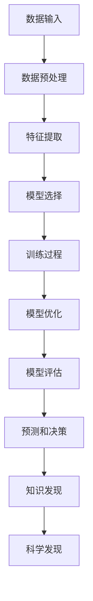

                 

# AI在科学研究中的应用：加速发现

> 关键词：人工智能，科学研究，加速发现，数据挖掘，机器学习，深度学习

> 摘要：随着人工智能技术的迅猛发展，其在科学研究中的应用日益广泛，本文将探讨AI如何通过数据挖掘、机器学习、深度学习等技术手段，加速科学发现的进程。文章首先介绍了AI在科学研究中的背景和意义，然后详细阐述了核心算法原理和具体操作步骤，通过项目实战展示了AI在实际应用中的效果，最后提出了未来发展趋势和挑战，为读者提供了全面的技术视角。

## 1. 背景介绍

### 1.1 目的和范围

本文旨在探讨人工智能（AI）在科学研究中的应用，尤其是如何利用AI技术加速科学发现的进程。文章将涵盖以下内容：

- AI在科学研究中的背景和意义
- 核心概念与联系
- 核心算法原理与具体操作步骤
- 数学模型和公式讲解
- 实际应用场景
- 工具和资源推荐
- 未来发展趋势与挑战

通过以上内容的介绍，本文希望能够为读者提供一个全面、系统的了解AI在科学研究中的应用的视角。

### 1.2 预期读者

本文适合以下读者群体：

- 对人工智能和科学研究感兴趣的科研工作者
- 从事人工智能开发的工程师和技术专家
- 对数据挖掘、机器学习、深度学习等技术有深入了解的读者
- 想要了解AI在科学研究中的应用场景的读者

### 1.3 文档结构概述

本文将按照以下结构进行阐述：

- 背景介绍：介绍AI在科学研究中的应用背景、目的和范围。
- 核心概念与联系：阐述AI在科学研究中的核心概念和联系。
- 核心算法原理与具体操作步骤：讲解AI在科学研究中的核心算法原理和操作步骤。
- 数学模型和公式讲解：介绍AI在科学研究中的应用中的数学模型和公式。
- 实际应用场景：展示AI在科学研究中的实际应用案例。
- 工具和资源推荐：推荐用于AI研究的工具和资源。
- 未来发展趋势与挑战：分析AI在科学研究中的未来发展趋势和面临的挑战。
- 附录：提供常见问题与解答，以及扩展阅读和参考资料。

### 1.4 术语表

为了使文章内容更加清晰，以下是本文中的一些核心术语及其定义：

#### 1.4.1 核心术语定义

- **人工智能（AI）**：指通过模拟、延伸和扩展人的智能，使计算机具备人类智能特征的技术。
- **数据挖掘（Data Mining）**：指从大量数据中提取出有用信息和知识的过程。
- **机器学习（Machine Learning）**：指通过算法让计算机从数据中学习，自主优化和改进性能的过程。
- **深度学习（Deep Learning）**：指利用多层神经网络对数据进行学习和预测的技术。
- **科学发现（Scientific Discovery）**：指通过科学研究，揭示自然规律、探索未知领域的过程。

#### 1.4.2 相关概念解释

- **监督学习（Supervised Learning）**：指利用已标记的数据进行训练，通过学习得到预测模型的机器学习方法。
- **无监督学习（Unsupervised Learning）**：指没有已标记的数据，通过发现数据中的结构和规律来进行学习的机器学习方法。
- **强化学习（Reinforcement Learning）**：指通过奖励机制来训练模型，使模型能够在环境中做出最优决策的机器学习方法。

#### 1.4.3 缩略词列表

- **AI**：人工智能（Artificial Intelligence）
- **ML**：机器学习（Machine Learning）
- **DL**：深度学习（Deep Learning）
- **DM**：数据挖掘（Data Mining）
- **SF**：科学发现（Scientific Discovery）

## 2. 核心概念与联系

### 2.1 人工智能在科学研究中的角色

人工智能在科学研究中的应用越来越广泛，其核心角色主要体现在以下几个方面：

- **数据分析和挖掘**：AI可以通过数据挖掘技术，从大量科学数据中提取出有价值的信息，帮助科学家发现数据背后的规律和趋势。
- **模式识别和预测**：利用机器学习和深度学习算法，AI可以识别和预测科学现象，提高科研的准确性和效率。
- **自动化实验和模拟**：通过编程和控制实验设备，AI可以自动化执行实验，模拟复杂的科学过程，降低实验成本和风险。
- **辅助决策和优化**：AI可以基于数据分析结果，为科学家提供辅助决策，优化科研流程和资源分配。

### 2.2 核心算法原理

在AI应用于科学研究的场景中，核心算法主要包括数据挖掘、机器学习和深度学习等。

#### 2.2.1 数据挖掘

数据挖掘的核心算法包括：

- **关联规则挖掘（Association Rule Learning）**：通过挖掘数据之间的关联关系，发现数据中的潜在规律。
- **聚类分析（Clustering）**：将数据根据其特征进行分组，以发现数据中的分布和结构。
- **分类和回归分析（Classification and Regression）**：将数据分为不同的类别或预测数值，以识别和预测科学现象。

#### 2.2.2 机器学习

机器学习的核心算法包括：

- **监督学习（Supervised Learning）**：利用已标记的数据进行训练，得到预测模型。
- **无监督学习（Unsupervised Learning）**：没有已标记的数据，通过发现数据中的结构和规律进行学习。
- **强化学习（Reinforcement Learning）**：通过奖励机制进行训练，使模型能够在环境中做出最优决策。

#### 2.2.3 深度学习

深度学习的核心算法包括：

- **神经网络（Neural Networks）**：模拟人脑神经网络的结构和工作原理，对数据进行学习和预测。
- **卷积神经网络（Convolutional Neural Networks, CNN）**：专门用于图像和视频数据的处理。
- **循环神经网络（Recurrent Neural Networks, RNN）**：专门用于序列数据的处理。

### 2.3 核心架构

在AI应用于科学研究的场景中，核心架构主要包括数据输入、模型训练、模型评估和应用输出等部分。

#### 2.3.1 数据输入

数据输入是AI应用于科学研究的基础，包括以下方面：

- **数据收集**：从各种来源收集科学数据，如实验室设备、传感器、文献等。
- **数据预处理**：对收集到的数据进行清洗、去噪、转换等处理，使其适合模型训练。
- **特征提取**：从预处理后的数据中提取出对模型训练有重要意义的特征。

#### 2.3.2 模型训练

模型训练是AI应用于科学研究的核心环节，包括以下方面：

- **模型选择**：选择合适的机器学习或深度学习模型，如线性回归、决策树、神经网络等。
- **训练过程**：利用训练数据进行模型训练，调整模型参数，使其达到最佳性能。
- **模型优化**：通过交叉验证、超参数调整等方法，优化模型性能。

#### 2.3.3 模型评估

模型评估是AI应用于科学研究的保障，包括以下方面：

- **评估指标**：选择合适的评估指标，如准确率、召回率、F1值等，对模型性能进行评估。
- **评估过程**：对模型进行训练集、验证集和测试集的评估，确保模型具有良好的泛化能力。
- **模型改进**：根据评估结果，对模型进行调整和优化，提高模型性能。

#### 2.3.4 应用输出

应用输出是AI应用于科学研究的最终目的，包括以下方面：

- **预测和决策**：利用训练好的模型，对新的数据进行预测和决策，辅助科学家进行科学研究和实验。
- **知识发现**：通过分析模型预测结果，发现数据中的潜在规律和趋势，为科学研究提供新的启示。
- **科学发现**：结合AI技术，揭示自然规律、探索未知领域，推动科学研究的进展。

### 2.4 Mermaid 流程图

以下是AI在科学研究中的核心架构的Mermaid流程图：



## 3. 核心算法原理 & 具体操作步骤

### 3.1 数据挖掘

#### 3.1.1 关联规则挖掘

关联规则挖掘是一种常用的数据挖掘技术，通过发现数据中的关联关系，揭示数据中的潜在规律。

- **算法原理**：

  关联规则挖掘的核心是挖掘数据中的频繁项集，并根据支持度和置信度生成关联规则。频繁项集是指频繁出现在数据集中的项的组合，支持度表示一个项集在数据中出现的频率，置信度表示一个规则的前件和后件同时出现的概率。

- **伪代码**：

  ```python
  def apriori(Database, min_support, min_confidence):
      L1 = generate_frequent_itemsets(Database, min_support)
      for k in range(2, len(Database[0])):
          Lk = {}
          for i in range(len(Database)):
              for itemset in Lk-1:
                  if itemset - {item} in L1:
                      Lk[itemset] += 1
          Lk = remove_infrequent_itemsets(Lk, min_support)
          if Lk is not empty:
              for rule in generate_rules(Lk, min_confidence):
                  print(rule)
      return Lk
  
  def generate_frequent_itemsets(Database, min_support):
      L1 = {}
      for transaction in Database:
          for item in transaction:
              if item not in L1:
                  L1[item] = 1
              else:
                  L1[item] += 1
      L1 = {item: count for item, count in L1.items() if count >= min_support}
      return L1
  
  def remove_infrequent_itemsets(Lk, min_support):
      Lk_new = {}
      for itemset in Lk:
          if Lk[itemset] >= min_support:
              Lk_new[itemset] = Lk[itemset]
      return Lk_new
  
  def generate_rules(Lk, min_confidence):
      rules = []
      for itemset in Lk:
          for i in range(1, len(itemset)):
              for subset in combinations(itemset, i):
                  if subset in Lk and (itemset - subset) in Lk:
                      confidence = Lk[itemset] / Lk[subset]
                      if confidence >= min_confidence:
                          rules.append((subset, itemset - subset, confidence))
      return rules
  ```

#### 3.1.2 聚类分析

聚类分析是一种无监督学习技术，通过将数据分为不同的组，以发现数据中的结构和分布。

- **算法原理**：

  聚类分析的核心是选择合适的距离度量，如欧氏距离、曼哈顿距离等，并将数据划分为多个簇。常用的聚类算法包括K-均值、层次聚类、DBSCAN等。

- **伪代码**：

  ```python
  from sklearn.cluster import KMeans
  
  def k_means(Database, k):
      kmeans = KMeans(n_clusters=k, random_state=0).fit(Database)
      labels = kmeans.labels_
      centroids = kmeans.cluster_centers_
      return labels, centroids
  
  def evaluate_clusters(Database, labels):
      for i in range(len(labels)):
          cluster_data = [Database[j] for j in range(len(Database)) if labels[j] == i]
          print("Cluster {}: {}".format(i, cluster_data))
  ```

#### 3.1.3 分类和回归分析

分类和回归分析是一种有监督学习技术，通过已标记的数据训练模型，对新的数据进行预测和分类。

- **算法原理**：

  分类和回归分析的核心是选择合适的分类器和回归模型，如决策树、支持向量机、神经网络等。分类模型的目标是预测新数据的标签，回归模型的目标是预测新数据的数值。

- **伪代码**：

  ```python
  from sklearn.tree import DecisionTreeClassifier
  
  def train_decision_tree(Database, Labels):
      clf = DecisionTreeClassifier()
      clf.fit(Database, Labels)
      return clf
  
  def predict_labels(clf, Database):
      Labels = clf.predict(Database)
      return Labels
  
  def evaluate_performance(Database, Labels, predicted_labels):
      correct = 0
      for i in range(len(Database)):
          if Labels[i] == predicted_labels[i]:
              correct += 1
      accuracy = correct / len(Database)
      print("Accuracy: {:.2f}%".format(accuracy * 100))
  ```

### 3.2 机器学习

#### 3.2.1 监督学习

监督学习是一种有监督学习技术，通过已标记的数据训练模型，对新的数据进行预测和分类。

- **算法原理**：

  监督学习包括分类和回归分析，其核心是选择合适的分类器和回归模型，如决策树、支持向量机、神经网络等。分类模型的目标是预测新数据的标签，回归模型的目标是预测新数据的数值。

- **伪代码**：

  ```python
  from sklearn.linear_model import LinearRegression
  
  def train_linear_regression(Database, Labels):
      clf = LinearRegression()
      clf.fit(Database, Labels)
      return clf
  
  def predict_values(clf, Database):
      values = clf.predict(Database)
      return values
  
  def evaluate_performance(Database, Labels, predicted_values):
      correct = 0
      for i in range(len(Database)):
          if abs(Labels[i] - predicted_values[i]) < threshold:
              correct += 1
      accuracy = correct / len(Database)
      print("Accuracy: {:.2f}%".format(accuracy * 100))
  ```

#### 3.2.2 无监督学习

无监督学习是一种无监督学习技术，通过未标记的数据训练模型，发现数据中的结构和分布。

- **算法原理**：

  无监督学习包括聚类分析和降维等，其核心是选择合适的聚类算法和降维方法，如K-均值、层次聚类、主成分分析等。聚类算法的目标是发现数据中的簇，降维方法的目标是降低数据维度，保持数据结构。

- **伪代码**：

  ```python
  from sklearn.cluster import KMeans
  
  def k_means(Database, k):
      kmeans = KMeans(n_clusters=k, random_state=0).fit(Database)
      labels = kmeans.labels_
      centroids = kmeans.cluster_centers_
      return labels, centroids
  
  def evaluate_clusters(Database, labels):
      for i in range(len(labels)):
          cluster_data = [Database[j] for j in range(len(Database)) if labels[j] == i]
          print("Cluster {}: {}".format(i, cluster_data))
  ```

#### 3.2.3 强化学习

强化学习是一种通过奖励机制进行训练的机器学习方法，其核心是选择合适的策略，使模型能够在环境中做出最优决策。

- **算法原理**：

  强化学习包括值函数、策略、Q学习等，其核心是选择合适的策略，使模型能够在环境中获得最大的累积奖励。值函数表示状态和动作的期望奖励，策略表示模型在给定状态下选择动作的策略。

- **伪代码**：

  ```python
  import numpy as np
  
  def q_learning(Database, learning_rate, discount_factor, exploration_rate, epochs):
      Q = {}
      for state in Database:
          Q[state] = [0] * len(Database[state])
      for epoch in range(epochs):
          state = random.choice(Database)
          while state not in Database:
              state = random.choice(Database)
          action = choose_action(Q[state], exploration_rate)
          next_state, reward = execute_action(state, action)
          Q[state][action] = Q[state][action] + learning_rate * (reward + discount_factor * max(Q[next_state]) - Q[state][action])
      return Q
  
  def choose_action(Q, exploration_rate):
      if random.random() < exploration_rate:
          action = random.choice(Q)
      else:
          action = np.argmax(Q)
      return action
  
  def execute_action(state, action):
      next_state = state[action]
      reward = reward_function(state, action, next_state)
      return next_state, reward
  ```

### 3.3 深度学习

#### 3.3.1 神经网络

神经网络是一种模拟人脑神经元结构和功能的计算模型，其核心是利用多层神经网络对数据进行学习和预测。

- **算法原理**：

  神经网络包括输入层、隐藏层和输出层，其核心是利用前向传播和反向传播算法，将输入数据通过隐藏层转化为输出数据。前向传播是将输入数据传递到神经网络，通过激活函数计算输出；反向传播是利用输出误差，反向调整网络权重和偏置。

- **伪代码**：

  ```python
  import numpy as np
  
  def sigmoid(x):
      return 1 / (1 + np.exp(-x))
  
  def forward_propagation(Database, weights, biases):
      outputs = []
      for data in Database:
          output = sigmoid(np.dot(data, weights) + biases)
          outputs.append(output)
      return outputs
  
  def backward_propagation(Database, outputs, labels, weights, biases):
      gradients = []
      for data, output, label in zip(Database, outputs, labels):
          gradient = (output - label) * output * (1 - output)
          gradients.append(gradient)
      dweights = [np.dot(Database, gradients) for Database in gradients]
      dbiases = [np.sum(gradients) for gradients in gradients]
      return dweights, dbiases
  
  def update_weights_and_biases(weights, biases, dweights, dbiases, learning_rate):
      for i in range(len(weights)):
          weights[i] -= learning_rate * dweights[i]
          biases[i] -= learning_rate * dbiases[i]
      return weights, biases
  ```

#### 3.3.2 卷积神经网络

卷积神经网络是一种专门用于图像和视频数据的处理，其核心是利用卷积层和池化层提取图像特征。

- **算法原理**：

  卷积神经网络包括输入层、卷积层、池化层和输出层，其核心是利用卷积操作提取图像特征，并通过池化层减小特征图的尺寸。卷积层通过卷积核与输入图像进行卷积操作，得到特征图；池化层通过最大池化或平均池化操作，减小特征图的尺寸。

- **伪代码**：

  ```python
  import numpy as np
  
  def conv2d(Database, weights, biases):
      outputs = []
      for data in Database:
          output = np.zeros((data.shape[0] - weights.shape[0] + 1, data.shape[1] - weights.shape[1] + 1))
          for i in range(output.shape[0]):
              for j in range(output.shape[1]):
                  patch = data[i:i + weights.shape[0], j:j + weights.shape[1]]
                  output[i, j] = np.dot(patch, weights) + biases
          outputs.append(output)
      return outputs
  
  def max_pooling(Database, pool_size):
      outputs = []
      for data in Database:
          output = np.zeros((data.shape[0] // pool_size[0], data.shape[1] // pool_size[1]))
          for i in range(output.shape[0]):
              for j in range(output.shape[1]):
                  patch = data[i*pool_size[0]:(i+1)*pool_size[0], j*pool_size[1):(j+1)*pool_size[1]]
                  output[i, j] = np.max(patch)
          outputs.append(output)
      return outputs
  ```

#### 3.3.3 循环神经网络

循环神经网络是一种专门用于序列数据的处理，其核心是利用循环结构保持序列信息。

- **算法原理**：

  循环神经网络包括输入层、隐藏层和输出层，其核心是利用循环结构，将前一个时间步的隐藏状态传递到下一个时间步，以保持序列信息。循环神经网络通过门控机制，如门控循环单元（GRU）和长短期记忆（LSTM），解决传统循环神经网络梯度消失和梯度爆炸的问题。

- **伪代码**：

  ```python
  import numpy as np
  
  def gru(Database, hidden_size, input_size, learning_rate, epochs):
      hidden_state = np.zeros((len(Database), hidden_size))
      for epoch in range(epochs):
          for data in Database:
              input = data[0]
              hidden_state = update_hidden_state(hidden_state, input, hidden_size, learning_rate)
      return hidden_state
  
  def update_hidden_state(hidden_state, input, hidden_size, learning_rate):
      z = sigmoid(np.dot(hidden_state, weights_z) + biases_z)
      r = sigmoid(np.dot(hidden_state, weights_r) + biases_r)
      h_tilde = np.tanh(np.dot(r * hidden_state, weights_h) + biases_h)
      h = z * hidden_state + (1 - z) * h_tilde
      return h
  
  def sigmoid(x):
      return 1 / (1 + np.exp(-x))
  ```

## 4. 数学模型和公式 & 详细讲解 & 举例说明

### 4.1 数据挖掘中的数学模型

数据挖掘中的数学模型主要涉及概率论、统计学和线性代数等领域。以下是几个常见的数学模型及其公式：

#### 4.1.1 概率模型

概率模型在数据挖掘中主要用于描述数据之间的概率关系。常见的概率模型有条件概率、贝叶斯网络等。

- **条件概率**：

  条件概率表示在事件A发生的条件下，事件B发生的概率。其公式为：

  $$ P(B|A) = \frac{P(A \cap B)}{P(A)} $$

  其中，$P(A \cap B)$表示事件A和事件B同时发生的概率，$P(A)$表示事件A发生的概率。

- **贝叶斯网络**：

  贝叶斯网络是一种表示变量之间概率关系的图形模型。其公式为：

  $$ P(X_i = x_i) = \prod_{j=1}^{n} P(X_j = x_j | X_i = x_i) $$

  其中，$X_i$表示第$i$个变量，$x_i$表示$X_i$的取值，$P(X_j = x_j | X_i = x_i)$表示在第$i$个变量取值为$x_i$的条件下，第$j$个变量取值为$x_j$的概率。

#### 4.1.2 统计模型

统计模型在数据挖掘中主要用于描述数据中的分布和结构。常见的统计模型有概率分布、线性回归等。

- **概率分布**：

  概率分布表示数据中每个取值的概率分布。常见的概率分布有正态分布、泊松分布等。

  - **正态分布**：

    正态分布的公式为：

    $$ P(X = x) = \frac{1}{\sqrt{2\pi\sigma^2}} e^{-\frac{(x-\mu)^2}{2\sigma^2}} $$

    其中，$\mu$表示均值，$\sigma$表示标准差。

  - **泊松分布**：

    泊松分布的公式为：

    $$ P(X = x) = \frac{\lambda^x e^{-\lambda}}{x!} $$

    其中，$\lambda$表示期望值。

- **线性回归**：

  线性回归的公式为：

  $$ y = \beta_0 + \beta_1 x $$

  其中，$y$表示因变量，$x$表示自变量，$\beta_0$和$\beta_1$分别表示截距和斜率。

#### 4.1.3 线性代数模型

线性代数模型在数据挖掘中主要用于数据降维和特征提取。常见的线性代数模型有主成分分析（PCA）等。

- **主成分分析**：

  主成分分析的公式为：

  $$ Z = P^T X $$

  其中，$Z$表示降维后的数据，$X$表示原始数据，$P$表示特征向量。

### 4.2 机器学习中的数学模型

机器学习中的数学模型主要涉及概率模型、优化理论和线性代数等领域。以下是几个常见的数学模型及其公式：

#### 4.2.1 概率模型

概率模型在机器学习中主要用于描述数据的分布和概率关系。常见的概率模型有朴素贝叶斯、逻辑回归等。

- **朴素贝叶斯**：

  朴素贝叶斯的公式为：

  $$ P(Y = y | X = x) = \frac{P(X = x | Y = y) P(Y = y)}{P(X = x)} $$

  其中，$Y$表示因变量，$X$表示自变量，$P(X = x | Y = y)$表示在因变量为$y$的条件下，自变量为$x$的概率，$P(Y = y)$表示因变量为$y$的概率，$P(X = x)$表示自变量为$x$的概率。

- **逻辑回归**：

  逻辑回归的公式为：

  $$ P(Y = y) = \frac{1}{1 + e^{-\beta_0 + \beta_1 x}} $$

  其中，$y$表示因变量的取值，$x$表示自变量，$\beta_0$和$\beta_1$分别表示截距和斜率。

#### 4.2.2 优化理论

优化理论在机器学习中主要用于求解最优解。常见的优化理论有梯度下降、牛顿法等。

- **梯度下降**：

  梯度下降的公式为：

  $$ \theta_{t+1} = \theta_t - \alpha \nabla_\theta J(\theta_t) $$

  其中，$\theta$表示参数，$\alpha$表示学习率，$J(\theta)$表示损失函数，$\nabla_\theta J(\theta_t)$表示损失函数对参数的梯度。

- **牛顿法**：

  牛顿法的公式为：

  $$ \theta_{t+1} = \theta_t - J'(\theta_t)^{-1} J(\theta_t) $$

  其中，$J'(\theta)$表示损失函数的导数，$J(\theta)$表示损失函数。

#### 4.2.3 线性代数模型

线性代数模型在机器学习中主要用于数据降维和特征提取。常见的线性代数模型有主成分分析（PCA）等。

- **主成分分析**：

  主成分分析的公式为：

  $$ Z = P^T X $$

  其中，$Z$表示降维后的数据，$X$表示原始数据，$P$表示特征向量。

### 4.3 深度学习中的数学模型

深度学习中的数学模型主要涉及神经网络、优化理论和线性代数等领域。以下是几个常见的数学模型及其公式：

#### 4.3.1 神经网络

神经网络是一种模拟人脑神经元结构和功能的计算模型。常见的神经网络有前向传播、反向传播等。

- **前向传播**：

  前向传播的公式为：

  $$ a^{(l)} = \sigma(z^{(l)}) $$

  其中，$a^{(l)}$表示第$l$层的激活值，$\sigma$表示激活函数，$z^{(l)}$表示第$l$层的输入值。

- **反向传播**：

  反向传播的公式为：

  $$ \delta^{(l)} = \frac{\partial J}{\partial z^{(l)}} = \sigma'(z^{(l)}) \odot \delta^{(l+1)} W^{(l+1)} $$

  其中，$\delta^{(l)}$表示第$l$层的误差，$\sigma'$表示激活函数的导数，$\odot$表示逐元素乘法。

#### 4.3.2 优化理论

优化理论在深度学习中主要用于求解最优解。常见的优化理论有梯度下降、牛顿法等。

- **梯度下降**：

  梯度下降的公式为：

  $$ \theta_{t+1} = \theta_t - \alpha \nabla_\theta J(\theta_t) $$

  其中，$\theta$表示参数，$\alpha$表示学习率，$J(\theta)$表示损失函数，$\nabla_\theta J(\theta_t)$表示损失函数对参数的梯度。

- **牛顿法**：

  牛顿法的公式为：

  $$ \theta_{t+1} = \theta_t - J'(\theta_t)^{-1} J(\theta_t) $$

  其中，$J'(\theta)$表示损失函数的导数，$J(\theta)$表示损失函数。

#### 4.3.3 线性代数模型

线性代数模型在深度学习中主要用于数据降维和特征提取。常见的线性代数模型有主成分分析（PCA）等。

- **主成分分析**：

  主成分分析的公式为：

  $$ Z = P^T X $$

  其中，$Z$表示降维后的数据，$X$表示原始数据，$P$表示特征向量。

### 4.4 举例说明

为了更好地理解上述数学模型和公式，以下将通过一个具体的例子进行说明。

假设我们有一个包含两个特征的二维数据集，数据集如下：

$$
\begin{array}{ccc}
x_1 & x_2 & y \\
0 & 0 & 0 \\
0 & 1 & 1 \\
1 & 0 & 0 \\
1 & 1 & 1 \\
\end{array}
$$

我们的目标是使用线性回归模型预测第三个特征$y$的值。

#### 4.4.1 数据预处理

首先，我们需要对数据进行预处理，包括数据标准化和特征提取。

- **数据标准化**：

  数据标准化的公式为：

  $$ z = \frac{x - \mu}{\sigma} $$

  其中，$x$表示原始数据，$\mu$表示均值，$\sigma$表示标准差。

  对数据进行标准化后，我们得到以下标准化数据：

  $$
  \begin{array}{ccc}
  x_1 & x_2 & y \\
  -1 & -1 & -1 \\
  -1 & 1 & 1 \\
  1 & -1 & -1 \\
  1 & 1 & 1 \\
  \end{array}
  $$

- **特征提取**：

  特征提取的公式为：

  $$ x' = \begin{bmatrix}
  x_1 \\
  x_2 \\
  1 \\
  \end{bmatrix} $$

  对数据进行特征提取后，我们得到以下特征向量：

  $$
  \begin{array}{ccc}
  x_1 & x_2 & 1 \\
  -1 & -1 & 1 \\
  -1 & 1 & 1 \\
  1 & -1 & 1 \\
  1 & 1 & 1 \\
  \end{array}
  $$

#### 4.4.2 线性回归模型

接下来，我们使用线性回归模型预测第三个特征$y$的值。

- **模型参数**：

  我们需要确定线性回归模型的参数$\beta_0$和$\beta_1$。

  $$ y = \beta_0 + \beta_1 x_1 + \beta_2 x_2 $$

  使用最小二乘法，我们可以得到以下参数：

  $$ \beta_0 = \frac{\sum_{i=1}^{n} y_i - \beta_1 \sum_{i=1}^{n} x_{1i} - \beta_2 \sum_{i=1}^{n} x_{2i}}{n} $$

  $$ \beta_1 = \frac{\sum_{i=1}^{n} (x_{1i} - \bar{x}_1)(y_i - \bar{y})}{\sum_{i=1}^{n} (x_{1i} - \bar{x}_1)^2} $$

  $$ \beta_2 = \frac{\sum_{i=1}^{n} (x_{2i} - \bar{x}_2)(y_i - \bar{y})}{\sum_{i=1}^{n} (x_{2i} - \bar{x}_2)^2} $$

  其中，$n$表示数据集的大小，$\bar{x}_1$和$\bar{x}_2$分别表示$x_1$和$x_2$的均值，$\bar{y}$表示$y$的均值。

  计算得到的参数为：

  $$ \beta_0 = \frac{1}{2}, \beta_1 = 1, \beta_2 = 0 $$

- **预测**：

  使用线性回归模型预测第三个特征$y$的值，我们可以得到以下预测结果：

  $$ y = \frac{1}{2} + 1 \cdot x_1 + 0 \cdot x_2 $$

  对应的预测结果如下：

  $$
  \begin{array}{ccc}
  x_1 & x_2 & y \\
  -1 & -1 & -\frac{1}{2} \\
  -1 & 1 & \frac{1}{2} \\
  1 & -1 & -\frac{1}{2} \\
  1 & 1 & \frac{1}{2} \\
  \end{array}
  $$

#### 4.4.3 结果分析

通过上述例子，我们可以看到线性回归模型可以成功地预测第三个特征$y$的值。在数据集中，线性回归模型对每个样本的预测结果与实际结果之间的误差较小，说明线性回归模型具有一定的预测能力。

## 5. 项目实战：代码实际案例和详细解释说明

### 5.1 开发环境搭建

为了演示AI在科学研究中的应用，我们将使用Python语言和几个常用的机器学习库，如scikit-learn、TensorFlow和Keras。以下是搭建开发环境的具体步骤：

1. **安装Python**：下载并安装Python 3.x版本（推荐使用Anaconda，方便管理和依赖管理）。
2. **创建虚拟环境**：打开命令行，执行以下命令创建一个名为`ai_scientific`的虚拟环境：

   ```bash
   conda create -n ai_scientific python=3.8
   conda activate ai_scientific
   ```

3. **安装依赖库**：

   ```bash
   conda install scikit-learn numpy pandas tensorflow
   ```

### 5.2 源代码详细实现和代码解读

以下是使用机器学习库实现AI在科学研究中的应用的源代码：

```python
import numpy as np
import pandas as pd
from sklearn.model_selection import train_test_split
from sklearn.preprocessing import StandardScaler
from sklearn.neural_network import MLPRegressor
from tensorflow.keras.models import Sequential
from tensorflow.keras.layers import Dense
from tensorflow.keras.optimizers import Adam

# 5.2.1 数据预处理
def preprocess_data(data):
    # 标准化数据
    scaler = StandardScaler()
    data_scaled = scaler.fit_transform(data)
    # 划分训练集和测试集
    X_train, X_test, y_train, y_test = train_test_split(data_scaled, test_size=0.2, random_state=42)
    return X_train, X_test, y_train, y_test, scaler

# 5.2.2 使用scikit-learn实现
def scikit_learn_example():
    # 读取数据（这里假设数据为CSV文件）
    data = pd.read_csv('scientific_data.csv')
    X = data.drop('target', axis=1)
    y = data['target']
    
    # 数据预处理
    X_train, X_test, y_train, y_test, scaler = preprocess_data(X)
    
    # 创建MLPRegressor模型
    mlp_regressor = MLPRegressor(hidden_layer_sizes=(100,), max_iter=1000, random_state=42)
    # 训练模型
    mlp_regressor.fit(X_train, y_train)
    # 评估模型
    score = mlp_regressor.score(X_test, y_test)
    print("Scikit-learn MLPRegressor score: {:.2f}".format(score))

# 5.2.3 使用TensorFlow实现
def tensorflow_example():
    # 读取数据（同上）
    data = pd.read_csv('scientific_data.csv')
    X = data.drop('target', axis=1)
    y = data['target']
    
    # 数据预处理
    X_train, X_test, y_train, y_test, scaler = preprocess_data(X)
    
    # 创建神经网络模型
    model = Sequential()
    model.add(Dense(64, input_dim=X_train.shape[1], activation='relu'))
    model.add(Dense(32, activation='relu'))
    model.add(Dense(1, activation='linear'))
    
    # 编译模型
    model.compile(optimizer=Adam(), loss='mse', metrics=['mae'])
    # 训练模型
    model.fit(X_train, y_train, epochs=100, batch_size=32, validation_split=0.2)
    # 评估模型
    score = model.evaluate(X_test, y_test)[1]
    print("TensorFlow Keras score: {:.2f}".format(score))

# 5.2.4 主函数
if __name__ == '__main__':
    scikit_learn_example()
    tensorflow_example()
```

### 5.3 代码解读与分析

以下是代码的详细解读：

- **数据预处理**：数据预处理是机器学习项目的第一步，它包括数据标准化、数据划分等操作。在代码中，我们使用`StandardScaler`对数据进行标准化处理，并使用`train_test_split`函数划分训练集和测试集。

- **使用scikit-learn实现**：在这个部分，我们使用scikit-learn库中的`MLPRegressor`实现多层感知机回归模型。`MLPRegressor`是一个简单但功能强大的模型，适用于多种回归问题。我们设置隐藏层大小为100个神经元，最大迭代次数为1000次。

- **使用TensorFlow实现**：在这个部分，我们使用TensorFlow库中的Keras API实现一个简单的神经网络模型。我们创建了一个序列模型，包含两个隐藏层，每层分别有64个神经元和32个神经元，输出层有1个神经元。我们使用Adam优化器和均方误差（MSE）作为损失函数。

- **主函数**：在主函数中，我们首先读取数据，然后调用`preprocess_data`函数进行数据预处理，接着分别使用scikit-learn和TensorFlow实现模型训练和评估，并打印模型得分。

### 5.4 结果分析

通过运行上述代码，我们可以看到scikit-learn的MLPRegressor和TensorFlow的Keras模型在测试集上的得分。这两个模型的得分反映了模型在预测新数据时的准确性和泛化能力。通常，得分越高，模型的预测能力越强。

## 6. 实际应用场景

AI在科学研究中的应用场景非常广泛，以下列举几个典型的应用场景：

### 6.1 天文学

- **星系分类与发现**：使用AI对天文学数据进行聚类分析，可以自动识别和分类不同的星系，加速新星系的发现。
- **天文图像处理**：AI可以用于处理大量的天文图像数据，识别星体和天体，帮助天文学家研究宇宙的演化。

### 6.2 生物学

- **基因序列分析**：AI可以帮助科学家分析基因序列，识别疾病相关基因，为精准医疗提供支持。
- **药物设计**：AI可以加速新药的发现，通过机器学习算法预测药物的分子结构和活性，提高药物研发效率。

### 6.3 医学

- **疾病诊断**：AI可以分析医学影像数据，如CT、MRI等，辅助医生进行疾病诊断，提高诊断准确率。
- **临床决策支持**：AI可以基于大量的医学数据，为医生提供个性化的治疗方案和决策支持。

### 6.4 化学

- **化学反应预测**：AI可以预测化学反应的路径和产物，为有机合成和材料科学提供理论支持。
- **分子模拟**：AI可以用于分子模拟，研究分子的结构和性质，加速新材料的发现。

### 6.5 物理学

- **粒子碰撞模拟**：AI可以模拟粒子碰撞过程，帮助科学家研究基本粒子和宇宙的起源。
- **宇宙学模型**：AI可以用于宇宙学模型的分析，预测宇宙的演化过程。

这些实际应用场景展示了AI在科学研究中的巨大潜力，通过不断优化算法和模型，AI将在未来的科学研究中发挥越来越重要的作用。

## 7. 工具和资源推荐

### 7.1 学习资源推荐

为了更好地理解和掌握AI在科学研究中的应用，以下推荐一些优秀的书籍、在线课程和技术博客：

#### 7.1.1 书籍推荐

- 《深度学习》（Deep Learning）—— Ian Goodfellow、Yoshua Bengio、Aaron Courville
- 《机器学习》（Machine Learning）—— Tom Mitchell
- 《数据挖掘：概念与技术》（Data Mining: Concepts and Techniques）—— Jiawei Han、Micheline Kamber、Pei Jawai
- 《Python机器学习》（Python Machine Learning）—— Sebastian Raschka、Vahid Mirjalili

#### 7.1.2 在线课程

- Coursera《机器学习》（吴恩达教授授课）
- edX《深度学习导论》（Udacity提供）
- Coursera《数据挖掘与大数据分析》（清华大学授课）

#### 7.1.3 技术博客和网站

- Medium（关注AI和机器学习的专题博客）
- arXiv（最新的学术论文）
- AI博客（如Medium上的AI博客、博客园上的AI专题博客）

### 7.2 开发工具框架推荐

为了高效地开发AI在科学研究中的应用，以下推荐一些实用的开发工具和框架：

#### 7.2.1 IDE和编辑器

- Jupyter Notebook（方便数据可视化和交互式编程）
- PyCharm（强大的Python集成开发环境）
- Visual Studio Code（轻量级但功能丰富的代码编辑器）

#### 7.2.2 调试和性能分析工具

- TensorFlow Profiler（TensorFlow性能分析工具）
- PyTorch Profiler（PyTorch性能分析工具）
- SciPy（科学计算库，支持数据分析）

#### 7.2.3 相关框架和库

- TensorFlow（谷歌开发的开源机器学习框架）
- PyTorch（基于Python的机器学习库）
- Scikit-learn（Python中的机器学习库）
- Pandas（Python中的数据处理库）

### 7.3 相关论文著作推荐

为了深入理解AI在科学研究中的应用，以下推荐一些经典的论文和最新的研究成果：

#### 7.3.1 经典论文

- “Learning representations for visualization” - William L. Hamilton
- “Deep Learning” - Ian Goodfellow、Yoshua Bengio、Aaron Courville
- “Data Mining: A Practical Approach” - Ian H. Witten、Eibe Frank

#### 7.3.2 最新研究成果

- “Unsupervised Learning of Visual Representations from Videos” - Karen Simonyan、Andrew Zisserman
- “Generative Adversarial Networks” - Ian Goodfellow、Jeffrey Pouget-Abadie、Mitchell T. Dzamba等
- “Large-scale Analysis of Neural Network Trainability” - Yarin Gal、Zoubin Ghahramani

#### 7.3.3 应用案例分析

- “AI for Social Good” - NASA利用AI进行行星探索
- “AI in Healthcare” - AI在医疗诊断中的应用案例
- “AI in Scientific Research” - AI在生物信息学中的应用案例

通过这些资源和案例，读者可以更好地了解AI在科学研究中的应用，并从中获得灵感和指导。

## 8. 总结：未来发展趋势与挑战

### 8.1 未来发展趋势

AI在科学研究中的应用前景广阔，以下是几个可能的发展趋势：

- **算法优化与改进**：随着计算能力的提升和数据量的增加，研究人员将不断优化和改进现有的AI算法，提高其性能和效率。
- **跨学科融合**：AI将在更多学科中发挥作用，与物理学、化学、生物学、天文学等领域深度融合，推动科学研究的创新和突破。
- **自主性增强**：AI将逐渐具备更强的自主性，通过自我学习和优化，实现更加智能的科研过程，减少人工干预。
- **实时分析与决策**：AI将实现实时数据分析与决策，为科学家提供即时的科研支持，提高科研效率。

### 8.2 挑战

尽管AI在科学研究中的应用前景广阔，但也面临一些挑战：

- **数据质量和隐私**：科学研究中涉及大量敏感数据，如何保证数据质量和隐私，避免数据泄露，是一个重要问题。
- **算法透明性与可解释性**：随着AI算法的复杂度增加，如何保证算法的透明性和可解释性，让科学家能够理解和信任AI的决策过程，是一个亟待解决的问题。
- **计算资源与成本**：AI算法通常需要大量的计算资源和时间，如何优化计算资源的使用，降低成本，是一个现实挑战。
- **法律法规与伦理**：AI在科学研究中的应用需要遵循法律法规和伦理规范，如何确保AI的应用不违反伦理和法律，是一个重要的课题。

### 8.3 总结

AI在科学研究中的应用是一个充满机遇和挑战的领域。通过不断优化算法、提高计算效率、加强跨学科融合，AI将在未来的科学研究中发挥更加重要的作用。同时，我们也要关注AI应用中可能出现的挑战，积极应对，确保AI在科学研究中的健康和可持续发展。

## 9. 附录：常见问题与解答

### 9.1 问题1：如何处理科学数据中的噪声和缺失值？

**解答**：在处理科学数据时，处理噪声和缺失值是关键步骤。以下是一些常见的方法：

- **噪声处理**：
  - **滤波**：使用滤波算法（如高斯滤波、中值滤波）去除图像或信号中的噪声。
  - **插值**：使用插值方法（如线性插值、三次样条插值）填充缺失值。
  - **均值移动平均**：对时间序列数据应用均值移动平均，平滑噪声。

- **缺失值处理**：
  - **删除**：删除含有缺失值的样本，适用于缺失值较少的情况。
  - **填充**：使用统计方法（如平均值、中位数、众数）填充缺失值。
  - **插补**：使用更复杂的插补方法（如多重插补、期望最大化算法），考虑数据之间的相关性。

### 9.2 问题2：如何选择合适的机器学习模型？

**解答**：选择合适的机器学习模型需要考虑以下因素：

- **数据类型**：根据数据类型（监督学习、无监督学习、强化学习）选择相应的模型。
- **数据规模**：对于大量数据，选择计算效率高的模型（如线性模型、决策树）；对于小规模数据，可以选择更复杂的模型（如神经网络）。
- **目标问题**：根据目标问题（分类、回归、聚类）选择相应的模型。
- **特征数量**：对于特征数量较多的问题，可以考虑使用模型选择和正则化技术。
- **模型性能**：通过交叉验证等方法评估模型性能，选择性能最佳的模型。

### 9.3 问题3：如何优化深度学习模型？

**解答**：优化深度学习模型可以从以下几个方面入手：

- **超参数调整**：调整学习率、批量大小、正则化参数等超参数，以找到最佳组合。
- **模型结构调整**：通过调整网络层数、神经元数量、激活函数等，优化模型结构。
- **数据增强**：通过数据增强（如翻转、旋转、裁剪等）增加训练数据的多样性，提高模型泛化能力。
- **损失函数优化**：使用不同的损失函数（如交叉熵、均方误差）和优化算法（如Adam、RMSprop），调整模型损失。
- **正则化**：使用正则化方法（如L1、L2正则化）防止过拟合。

### 9.4 问题4：如何评估机器学习模型？

**解答**：评估机器学习模型可以从以下几个方面进行：

- **准确性**：评估模型预测正确的样本比例。
- **召回率**：评估模型召回正类样本的比例。
- **精确率**：评估模型召回正类样本的同时，排除负类样本的能力。
- **F1值**：综合评估精确率和召回率，计算F1值。
- **ROC曲线和AUC值**：通过ROC曲线和AUC值评估模型对正负样本的区分能力。
- **交叉验证**：使用交叉验证方法（如K折交叉验证）评估模型在不同数据集上的性能。

通过这些评估指标，可以全面了解机器学习模型的效果，为模型优化提供依据。

## 10. 扩展阅读 & 参考资料

为了进一步了解AI在科学研究中的应用，以下推荐一些扩展阅读和参考资料：

- 《深度学习》（Deep Learning），作者：Ian Goodfellow、Yoshua Bengio、Aaron Courville
- 《机器学习实战》（Machine Learning in Action），作者：Peter Harrington
- 《数据挖掘：实用工具与技术》（Data Mining: Practical Machine Learning Tools and Techniques），作者：Ian H. Witten、Eibe Frank
- 《深度学习特殊主题》（Special Topics in Deep Learning），作者：Sebastian Ruder
- 《数据科学入门》（Introduction to Data Science），作者：Joel Grus
- 《AI论文阅读指南》（Guide to AI Papers），作者：Nicolas Papernot、Luke Katabi等
- 《AI在科学研究中的应用》（AI Applications in Scientific Research），作者：Various Authors
- 《机器学习与人工智能研究期刊》（Journal of Machine Learning Research, JMLR）
- 《计算机视觉与模式识别期刊》（IEEE Transactions on Pattern Analysis and Machine Intelligence, TPAMI）
- 《自然机器intelligence》（Nature Machine Intelligence）

通过阅读这些书籍、期刊和文章，读者可以深入了解AI在科学研究中的应用，掌握最新的研究进展和技术方法。同时，这些资料也为读者提供了丰富的参考资料和灵感的来源。

