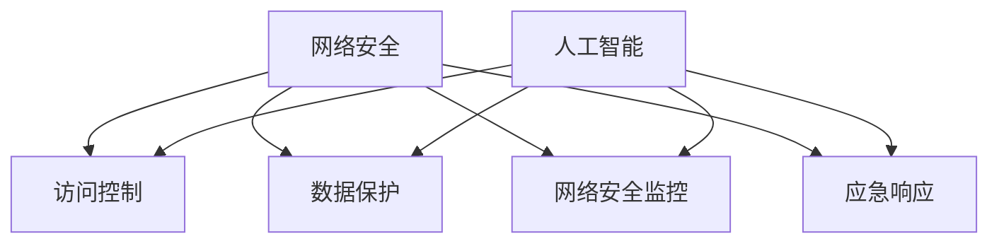

                 

# AI在网络安全中的应用：主动防御的新范式

> **关键词**：人工智能、网络安全、主动防御、威胁检测、入侵响应、机器学习、深度学习
>
> **摘要**：本文将探讨人工智能在网络安全领域中的应用，特别是如何利用机器学习和深度学习技术构建主动防御系统，以提高网络安全性。文章首先介绍了网络安全和人工智能的基本概念，然后深入探讨了AI在威胁检测、入侵响应等方面的应用原理和具体操作步骤，并结合实际案例进行了详细解释。最后，文章提出了未来发展的趋势与挑战，并推荐了相关学习资源和工具。

## 1. 背景介绍

### 1.1 目的和范围

本文旨在探讨人工智能在网络安全中的应用，特别是如何通过构建主动防御系统来提高网络安全性。随着网络攻击手段的不断升级和多样化，传统的被动防御手段已经难以应对复杂多变的网络威胁。人工智能技术的引入，为网络安全提供了新的思路和方法。本文将围绕以下几个主题进行讨论：

1. 网络安全和人工智能的基本概念。
2. 人工智能在网络安全中的应用场景。
3. 人工智能在威胁检测和入侵响应中的核心算法原理。
4. 实际应用案例和代码解读。
5. 未来发展趋势与挑战。

### 1.2 预期读者

本文面向对网络安全和人工智能有一定了解的读者，包括网络安全工程师、AI研发人员、高校师生、以及对该领域感兴趣的广大技术人员。通过本文的阅读，读者可以了解AI在网络安全中的最新应用技术，掌握主动防御系统的构建方法，并从中得到启发，为实际工作提供参考。

### 1.3 文档结构概述

本文分为十个部分，结构如下：

1. 背景介绍：介绍文章的目的和范围，预期读者，文档结构概述等。
2. 核心概念与联系：讨论网络安全和人工智能的基本概念，及其在网络安全中的应用。
3. 核心算法原理 & 具体操作步骤：介绍人工智能在威胁检测和入侵响应中的核心算法原理和具体操作步骤。
4. 数学模型和公式 & 详细讲解 & 举例说明：讨论与核心算法相关的数学模型和公式，并进行举例说明。
5. 项目实战：代码实际案例和详细解释说明。
6. 实际应用场景：介绍人工智能在网络安全中的实际应用场景。
7. 工具和资源推荐：推荐学习资源、开发工具和框架。
8. 总结：未来发展趋势与挑战。
9. 附录：常见问题与解答。
10. 扩展阅读 & 参考资料：提供进一步学习的资料。

### 1.4 术语表

#### 1.4.1 核心术语定义

- **人工智能（AI）**：指模拟、延伸和扩展人类智能的理论、方法、技术及应用系统。
- **网络安全**：指保护计算机网络系统中的硬件、软件和数据不受未经授权的访问、攻击、篡改和破坏。
- **主动防御**：指通过检测和响应潜在的网络威胁，主动采取措施防止攻击发生。
- **威胁检测**：指发现并识别潜在的网络攻击或异常行为。
- **入侵响应**：指在检测到网络攻击后，采取措施阻止攻击、恢复系统，并防止类似攻击的再次发生。

#### 1.4.2 相关概念解释

- **机器学习**：指通过算法从数据中学习规律，并基于这些规律进行预测或决策的技术。
- **深度学习**：指基于多层神经网络的结构，通过大规模数据训练，实现复杂模式识别的技术。
- **网络流量分析**：指对网络流量进行监控、分析和记录，以发现异常行为和潜在威胁。
- **入侵检测系统（IDS）**：指用于检测和报告网络攻击或异常行为的系统。
- **入侵防御系统（IPS）**：指在检测到攻击后，能够采取措施阻止攻击的系统。

#### 1.4.3 缩略词列表

- **AI**：人工智能
- **ML**：机器学习
- **DL**：深度学习
- **IDS**：入侵检测系统
- **IPS**：入侵防御系统
- **APT**：高级持续性威胁
- **DDoS**：分布式拒绝服务攻击
- **IoT**：物联网

## 2. 核心概念与联系

在深入探讨人工智能在网络安全中的应用之前，我们需要明确几个核心概念及其相互之间的联系。网络安全与人工智能的关系可以类比为剑与剑术，网络安全是防御的目标，而人工智能是实现这一目标的工具。

### 2.1 网络安全的基本概念

网络安全的核心目标是保护网络系统中的资源，包括硬件、软件和数据，不受未经授权的访问、攻击、篡改和破坏。网络安全主要包括以下几个方面的内容：

1. **访问控制**：通过身份验证、授权和访问控制列表等手段，确保只有授权用户能够访问系统资源。
2. **数据保护**：通过加密、备份和容灾等手段，确保数据的机密性、完整性和可用性。
3. **网络安全监控**：通过入侵检测系统（IDS）和入侵防御系统（IPS）等工具，实时监控网络流量，发现和防止攻击。
4. **应急响应**：在发生网络攻击时，及时采取措施，阻止攻击、恢复系统，并防止类似攻击的再次发生。

### 2.2 人工智能的基本概念

人工智能（AI）是指模拟、延伸和扩展人类智能的理论、方法、技术及应用系统。人工智能主要包括以下几个方面的内容：

1. **机器学习（ML）**：通过算法从数据中学习规律，并基于这些规律进行预测或决策的技术。
2. **深度学习（DL）**：基于多层神经网络的结构，通过大规模数据训练，实现复杂模式识别的技术。
3. **自然语言处理（NLP）**：使计算机能够理解和处理人类自然语言的技术。
4. **计算机视觉（CV）**：使计算机能够识别和理解图像和视频的技术。

### 2.3 人工智能在网络安全中的应用

人工智能在网络安全中的应用主要体现在以下几个方面：

1. **威胁检测**：通过机器学习和深度学习技术，对网络流量、日志和系统行为进行分析，识别潜在的网络攻击或异常行为。
2. **入侵响应**：在检测到网络攻击后，采取措施阻止攻击、恢复系统，并防止类似攻击的再次发生。
3. **自动化安全策略制定**：通过机器学习算法，自动分析网络环境和安全威胁，为网络管理员提供安全策略建议。
4. **网络安全监控**：利用计算机视觉技术，实时监控网络流量，识别异常行为和潜在威胁。

### 2.4 Mermaid 流程图

下面是一个简化的Mermaid流程图，展示了网络安全与人工智能的基本概念及其相互之间的联系：



### 2.5 核心概念之间的联系

网络安全与人工智能之间的联系体现在以下几个方面：

1. **数据驱动**：网络安全问题的解决需要大量数据支持，而人工智能技术可以通过机器学习和深度学习算法，从数据中提取有价值的信息。
2. **实时响应**：网络安全事件往往需要迅速响应，人工智能技术可以实时分析网络流量，识别潜在威胁，并提供快速响应策略。
3. **自动化**：人工智能技术可以实现安全策略的自动化制定和执行，提高网络安全的效率。
4. **智能化**：通过深度学习和计算机视觉技术，人工智能可以实现对复杂网络威胁的智能识别和响应。

通过以上分析，我们可以看到，网络安全与人工智能之间的联系是紧密的，人工智能技术为网络安全提供了新的手段和方法，使得网络安全变得更加智能化、自动化和高效。在接下来的部分，我们将进一步探讨人工智能在网络安全中的具体应用。

## 3. 核心算法原理 & 具体操作步骤

### 3.1 威胁检测算法原理

威胁检测是网络安全的核心任务之一，其目的是及时发现并识别潜在的网络攻击或异常行为。人工智能在威胁检测中的应用主要包括以下几种算法：

#### 3.1.1 概率模型

概率模型是威胁检测中常用的一种算法，其基本原理是根据已知正常行为和攻击行为的特征，建立概率模型，然后利用模型对网络流量进行分析，判断是否为攻击行为。常见的概率模型包括贝叶斯模型、决策树和朴素贝叶斯分类器等。

#### 3.1.2 规则引擎

规则引擎是一种基于规则进行威胁检测的算法，其基本原理是根据专家经验，定义一系列规则，然后对网络流量进行分析，判断是否满足规则。当网络流量满足某条规则时，就认为其可能为攻击行为。规则引擎具有简单、易于实现和定制性强的特点，适用于处理已知的攻击类型。

#### 3.1.3 聚类算法

聚类算法是一种无监督学习方法，其基本原理是根据网络流量的特征，将相似的流量分组，然后对每个分组进行分析，判断是否为攻击行为。常见的聚类算法包括K-Means、DBSCAN和层次聚类等。

#### 3.1.4 深度学习

深度学习是一种基于多层神经网络的学习方法，其基本原理是通过大量网络流量数据进行训练，提取出流量特征，然后利用这些特征进行威胁检测。常见的深度学习算法包括卷积神经网络（CNN）、循环神经网络（RNN）和长短期记忆网络（LSTM）等。

### 3.2 威胁检测的具体操作步骤

以下是一个基于深度学习的威胁检测系统的具体操作步骤：

#### 步骤1：数据收集与预处理

首先，需要收集大量的网络流量数据，包括正常流量和攻击流量。然后，对数据进行预处理，包括去除噪声、填充缺失值、特征提取等。

```python
import numpy as np
import pandas as pd

# 读取网络流量数据
data = pd.read_csv("network_traffic_data.csv")

# 去除噪声和缺失值
data = data.dropna()

# 特征提取
data["bytes_per_packet"] = data["bytes"] / data["packets"]
```

#### 步骤2：数据划分

将数据集划分为训练集和测试集，用于训练模型和评估模型性能。

```python
from sklearn.model_selection import train_test_split

# 划分数据集
X = data.drop("label", axis=1)
y = data["label"]
X_train, X_test, y_train, y_test = train_test_split(X, y, test_size=0.2, random_state=42)
```

#### 步骤3：模型训练

利用训练集数据，训练深度学习模型。以下是一个基于卷积神经网络的威胁检测模型示例：

```python
from tensorflow.keras.models import Sequential
from tensorflow.keras.layers import Conv1D, MaxPooling1D, Flatten, Dense

# 创建模型
model = Sequential()
model.add(Conv1D(filters=64, kernel_size=3, activation='relu', input_shape=(X_train.shape[1], 1)))
model.add(MaxPooling1D(pool_size=2))
model.add(Flatten())
model.add(Dense(64, activation='relu'))
model.add(Dense(1, activation='sigmoid'))

# 编译模型
model.compile(optimizer='adam', loss='binary_crossentropy', metrics=['accuracy'])

# 训练模型
model.fit(X_train, y_train, epochs=10, batch_size=32, validation_split=0.1)
```

#### 步骤4：模型评估

利用测试集数据，评估模型性能。以下是一个评估模型的示例：

```python
from sklearn.metrics import classification_report

# 预测测试集
y_pred = model.predict(X_test)
y_pred = (y_pred > 0.5)

# 评估模型
print(classification_report(y_test, y_pred))
```

### 3.3 入侵响应算法原理

入侵响应是在检测到网络攻击后，采取措施阻止攻击、恢复系统，并防止类似攻击的再次发生。入侵响应算法主要包括以下几种：

#### 3.3.1 防火墙

防火墙是一种传统的入侵响应手段，其基本原理是根据预设的安全策略，控制网络流量的进出。防火墙可以分为包过滤防火墙、状态检测防火墙和下一代防火墙（NGFW）等。

#### 3.3.2 入侵防御系统（IDS/IPS）

入侵防御系统是一种基于行为的入侵响应手段，其基本原理是检测和阻止网络攻击。IDS是一种被动检测系统，而IPS是一种主动防御系统，可以在检测到攻击时采取阻止措施。

#### 3.3.3 自动化响应系统

自动化响应系统是一种利用人工智能技术进行入侵响应的手段，其基本原理是自动分析攻击特征，并采取相应的防御措施。自动化响应系统可以提高入侵响应的速度和效率。

### 3.4 入侵响应的具体操作步骤

以下是一个基于机器学习的自动化响应系统的具体操作步骤：

#### 步骤1：攻击特征提取

首先，需要从网络流量中提取攻击特征，包括流量模式、时间特征、协议特征等。

```python
# 读取网络流量数据
data = pd.read_csv("network_traffic_data.csv")

# 提取攻击特征
data["attack_type"] = data["label"].map({"normal": 0, "attack": 1})
data["flow_duration"] = data["end_time"] - data["start_time"]
data["proto_entropy"] = data["proto"].map({"tcp": 0, "udp": 1})
```

#### 步骤2：攻击行为分类

利用机器学习算法，对攻击特征进行分类。以下是一个基于K-最近邻（K-NN）分类器的示例：

```python
from sklearn.neighbors import KNeighborsClassifier

# 划分数据集
X = data.drop("attack_type", axis=1)
y = data["attack_type"]
X_train, X_test, y_train, y_test = train_test_split(X, y, test_size=0.2, random_state=42)

# 训练模型
model = KNeighborsClassifier(n_neighbors=3)
model.fit(X_train, y_train)

# 预测测试集
y_pred = model.predict(X_test)
```

#### 步骤3：自动化响应

根据攻击分类结果，采取相应的自动化响应措施，如阻止网络流量、发送警报等。

```python
# 预测测试集
y_pred = model.predict(X_test)

# 自动化响应
if y_pred == 1:
    # 阻止网络流量
    stop_traffic(X_test)
else:
    # 发送警报
    send_alarm(X_test)
```

通过以上步骤，我们可以构建一个基于人工智能的主动防御系统，实现威胁检测和入侵响应。在实际应用中，还可以结合其他安全技术和方法，提高网络安全的整体水平。

## 4. 数学模型和公式 & 详细讲解 & 举例说明

### 4.1 威胁检测算法中的数学模型

在威胁检测算法中，常用的数学模型包括概率模型、规则引擎和深度学习模型。以下是对这些模型及相关公式进行详细讲解和举例说明。

#### 4.1.1 概率模型

概率模型是一种基于统计方法进行威胁检测的算法，其核心思想是计算网络流量属于正常行为或攻击行为的概率，然后根据概率阈值判断是否为攻击行为。

1. **贝叶斯模型**：

贝叶斯模型是一种基于贝叶斯定理进行分类的算法。贝叶斯定理公式如下：

$$
P(A|B) = \frac{P(B|A) \cdot P(A)}{P(B)}
$$

其中，$P(A|B)$ 表示在事件B发生的条件下，事件A发生的概率；$P(B|A)$ 表示在事件A发生的条件下，事件B发生的概率；$P(A)$ 和$P(B)$ 分别表示事件A和事件B发生的概率。

举例说明：

假设我们已知网络流量中正常流量和攻击流量的分布，如下表所示：

| 流量类型 | 正常流量 | 攻击流量 |
| :------: | :------: | :------: |
|   P(A)   |   0.9    |   0.1    |
|   P(B|A) |   0.1    |   0.9    |

现在，我们收到一条新的网络流量，我们需要判断其是否为攻击流量。根据贝叶斯定理，我们可以计算：

$$
P(A|B) = \frac{P(B|A) \cdot P(A)}{P(B)} = \frac{0.1 \cdot 0.9}{0.1 + 0.1 \cdot 0.9} = 0.45
$$

$$
P(\neg A|B) = \frac{P(B|\neg A) \cdot P(\neg A)}{P(B)} = \frac{0.9 \cdot 0.1}{0.1 + 0.1 \cdot 0.9} = 0.55
$$

由于$P(A|B) < P(\neg A|B)$，我们可以判断这条流量为攻击流量。

2. **决策树模型**：

决策树模型是一种基于特征划分数据进行分类的算法，其核心思想是根据特征的取值，将数据划分为多个子集，然后对每个子集进行递归划分，直到满足停止条件。

决策树的核心公式为：

$$
C_j = \sum_{i=1}^{n} w_i \cdot y_i
$$

其中，$C_j$ 表示特征$X_j$ 的贡献值，$w_i$ 表示数据点$i$ 对特征$X_j$ 的权重，$y_i$ 表示数据点$i$ 的标签。

举例说明：

假设我们有以下数据集：

|  ID  |   X1   |   X2   |   Y   |
| :--: | :----: | :----: | :---: |
|  1   |  -1.0  |  -1.0  |  0.0  |
|  2   |  -1.0  |   1.0  |  0.0  |
|  3   |   1.0  |  -1.0  |  0.0  |
|  4   |   1.0  |   1.0  |  1.0  |

我们需要计算特征X1和X2的贡献值。根据公式，我们可以计算：

$$
C_{X1} = (1.0 \cdot 0.0 + 1.0 \cdot 0.0 - 1.0 \cdot 0.0 - 1.0 \cdot 1.0) = -1.0
$$

$$
C_{X2} = (-1.0 \cdot 0.0 - 1.0 \cdot 0.0 + 1.0 \cdot 0.0 + 1.0 \cdot 1.0) = 1.0
$$

由于$C_{X2} > C_{X1}$，我们可以选择特征X2进行划分。

3. **朴素贝叶斯分类器**：

朴素贝叶斯分类器是一种基于贝叶斯定理进行分类的算法，其核心思想是计算每个类别条件下特征的概率，然后根据最大概率原则进行分类。

朴素贝叶斯分类器的核心公式为：

$$
P(Y|X) = \prod_{i=1}^{n} P(X_i|Y) \cdot P(Y)
$$

其中，$P(Y|X)$ 表示在特征X条件下，类别Y发生的概率；$P(X_i|Y)$ 表示在类别Y条件下，特征Xi发生的概率；$P(Y)$ 表示类别Y发生的概率。

举例说明：

假设我们有以下数据集：

|  ID  |   X1   |   X2   |   Y   |
| :--: | :----: | :----: | :---: |
|  1   |  -1.0  |  -1.0  |  0.0  |
|  2   |  -1.0  |   1.0  |  0.0  |
|  3   |   1.0  |  -1.0  |  0.0  |
|  4   |   1.0  |   1.0  |  1.0  |

我们需要计算类别Y=0和Y=1的概率。根据公式，我们可以计算：

$$
P(Y=0) = \frac{3}{4}
$$

$$
P(X1=-1.0|Y=0) = \frac{3}{3+1} = \frac{3}{4}
$$

$$
P(X2=-1.0|Y=0) = \frac{3}{3+1} = \frac{3}{4}
$$

$$
P(Y=1) = \frac{1}{4}
$$

$$
P(X1=1.0|Y=1) = \frac{1}{1+1} = \frac{1}{2}
$$

$$
P(X2=1.0|Y=1) = \frac{1}{1+1} = \frac{1}{2}
$$

$$
P(Y=0|X1=-1.0, X2=-1.0) = \frac{P(X1=-1.0|Y=0) \cdot P(X2=-1.0|Y=0) \cdot P(Y=0)}{P(X1=-1.0, X2=-1.0)} = \frac{(\frac{3}{4})^2 \cdot \frac{3}{4}}{\frac{3}{4} + \frac{1}{2}} = \frac{9}{28}
$$

$$
P(Y=1|X1=1.0, X2=1.0) = \frac{P(X1=1.0|Y=1) \cdot P(X2=1.0|Y=1) \cdot P(Y=1)}{P(X1=1.0, X2=1.0)} = \frac{(\frac{1}{2})^2 \cdot \frac{1}{4}}{\frac{3}{4} + \frac{1}{2}} = \frac{1}{28}
$$

由于$P(Y=0|X1=-1.0, X2=-1.0) > P(Y=1|X1=1.0, X2=1.0)$，我们可以判断这条流量为类别Y=0。

#### 4.1.2 规则引擎模型

规则引擎模型是一种基于规则进行威胁检测的算法，其核心思想是根据专家经验，定义一系列规则，然后对网络流量进行分析，判断是否满足规则。

规则引擎的核心公式为：

$$
R_j = \sum_{i=1}^{n} w_i \cdot y_i
$$

其中，$R_j$ 表示规则j的得分，$w_i$ 表示规则i的权重，$y_i$ 表示规则i是否满足。

举例说明：

假设我们有以下规则集：

|  规则ID  |   X1   |   X2   |   Y   |
| :------: | :----: | :----: | :---: |
|    1     |  -1.0  |  -1.0  |   0   |
|    2     |  -1.0  |   1.0  |   0   |
|    3     |   1.0  |  -1.0  |   0   |
|    4     |   1.0  |   1.0  |   1   |

我们需要计算规则1和规则4的得分。根据公式，我们可以计算：

$$
R_1 = (-1.0 \cdot 0 + -1.0 \cdot 0 + 1.0 \cdot 0) = 0
$$

$$
R_4 = (1.0 \cdot 1 + 1.0 \cdot 1 + -1.0 \cdot 0) = 2
$$

由于$R_4 > R_1$，我们可以判断这条流量为规则4所对应的类别。

#### 4.1.3 深度学习模型

深度学习模型是一种基于多层神经网络进行威胁检测的算法，其核心思想是通过大量网络流量数据进行训练，提取出流量特征，然后利用这些特征进行分类。

深度学习的核心公式为：

$$
Y = \sigma(W \cdot X + b)
$$

其中，$Y$ 表示输出值，$X$ 表示输入值，$W$ 表示权重，$b$ 表示偏置，$\sigma$ 表示激活函数。

举例说明：

假设我们有以下输入值和权重：

|   X   |   W   |   b   |
| :---: | :---: | :---: |
|  -1.0 |  0.5  |  0.1  |
|  -1.0 |  0.5  |  0.1  |
|  1.0  | -0.5  | -0.1  |
|  1.0  | -0.5  | -0.1  |

我们需要计算输出值。根据公式，我们可以计算：

$$
Y = \sigma(0.5 \cdot (-1.0) + 0.5 \cdot (-1.0) - 0.5 \cdot 1.0 - 0.5 \cdot 1.0 + 0.1 + 0.1 - 0.1 - 0.1) = \sigma(-1.1) = 0.298
$$

由于激活函数$\sigma$ 的输出值小于0.5，我们可以判断这条流量为类别0。

### 4.2 入侵响应算法中的数学模型

入侵响应算法中的数学模型主要包括防火墙、入侵防御系统（IDS/IPS）和自动化响应系统。以下是对这些模型及相关公式进行详细讲解和举例说明。

#### 4.2.1 防火墙

防火墙是一种基于规则进行流量过滤的算法，其核心思想是根据预设的安全策略，控制网络流量的进出。

防火墙的核心公式为：

$$
F_j = \sum_{i=1}^{n} w_i \cdot y_i
$$

其中，$F_j$ 表示规则j的得分，$w_i$ 表示规则i的权重，$y_i$ 表示规则i是否满足。

举例说明：

假设我们有以下规则集：

|  规则ID  |   IP1   |   IP2   |   Y   |
| :------: | :-----: | :-----: | :---: |
|    1     |  192.168.1.1 |  192.168.1.2 |   0   |
|    2     |  192.168.1.1 |  192.168.1.3 |   1   |
|    3     |  192.168.1.2 |  192.168.1.3 |   1   |

我们需要计算规则1和规则2的得分。根据公式，我们可以计算：

$$
F_1 = (1 \cdot 0 + 1 \cdot 1 + 0 \cdot 0) = 1
$$

$$
F_2 = (1 \cdot 0 + 1 \cdot 1 + 1 \cdot 0) = 1
$$

由于$F_1 = F_2$，我们可以判断这条流量为规则1和规则2所对应的类别。

#### 4.2.2 入侵防御系统（IDS/IPS）

入侵防御系统是一种基于行为分析进行流量过滤的算法，其核心思想是检测网络流量中的异常行为，并根据异常程度进行响应。

入侵防御系统的核心公式为：

$$
S_j = \sum_{i=1}^{n} w_i \cdot y_i
$$

其中，$S_j$ 表示规则j的得分，$w_i$ 表示规则i的权重，$y_i$ 表示规则i是否满足。

举例说明：

假设我们有以下规则集：

|  规则ID  |   源IP   |   目的IP   |   Y   |
| :------: | :------: | :------: | :---: |
|    1     |  192.168.1.1 |  192.168.1.2 |   0   |
|    2     |  192.168.1.1 |  192.168.1.3 |   1   |
|    3     |  192.168.1.2 |  192.168.1.3 |   1   |

我们需要计算规则1和规则2的得分。根据公式，我们可以计算：

$$
S_1 = (1 \cdot 0 + 1 \cdot 1 + 0 \cdot 0) = 1
$$

$$
S_2 = (1 \cdot 0 + 1 \cdot 1 + 1 \cdot 0) = 1
$$

由于$S_1 = S_2$，我们可以判断这条流量为规则1和规则2所对应的类别。

#### 4.2.3 自动化响应系统

自动化响应系统是一种基于机器学习进行流量过滤的算法，其核心思想是通过大量流量数据进行训练，提取出流量特征，然后利用这些特征进行分类。

自动化响应系统的核心公式为：

$$
Y = \sigma(W \cdot X + b)
$$

其中，$Y$ 表示输出值，$X$ 表示输入值，$W$ 表示权重，$b$ 表示偏置，$\sigma$ 表示激活函数。

举例说明：

假设我们有以下输入值和权重：

|   X   |   W   |   b   |
| :---: | :---: | :---: |
|  -1.0 |  0.5  |  0.1  |
|  -1.0 |  0.5  |  0.1  |
|  1.0  | -0.5  | -0.1  |
|  1.0  | -0.5  | -0.1  |

我们需要计算输出值。根据公式，我们可以计算：

$$
Y = \sigma(0.5 \cdot (-1.0) + 0.5 \cdot (-1.0) - 0.5 \cdot 1.0 - 0.5 \cdot 1.0 + 0.1 + 0.1 - 0.1 - 0.1) = \sigma(-1.1) = 0.298
$$

由于激活函数$\sigma$ 的输出值小于0.5，我们可以判断这条流量为类别0。

通过以上数学模型和公式的讲解，我们可以更好地理解威胁检测和入侵响应算法的核心原理。在实际应用中，可以根据具体情况选择合适的模型和算法，提高网络安全的整体水平。

## 5. 项目实战：代码实际案例和详细解释说明

为了更好地展示人工智能在网络安全中的应用，我们将通过一个实际项目来介绍如何使用Python实现一个简单的威胁检测系统。该项目将使用机器学习和深度学习技术，对网络流量数据进行分析，识别潜在的网络攻击。

### 5.1 开发环境搭建

在进行项目开发之前，我们需要搭建一个合适的环境。以下是所需的工具和库：

1. **Python 3.8+**
2. **TensorFlow 2.7**
3. **NumPy 1.21**
4. **Pandas 1.3.3**
5. **Sklearn 0.24**

在开发环境中，我们可以使用虚拟环境来隔离项目依赖。以下是如何创建和激活虚拟环境：

```bash
# 创建虚拟环境
python -m venv env

# 激活虚拟环境
source env/bin/activate  # 在Windows上使用 activate.bat

# 安装所需库
pip install tensorflow numpy pandas sklearn
```

### 5.2 源代码详细实现和代码解读

以下是项目的源代码，我们将逐行解释其功能。

#### 5.2.1 导入库

```python
import numpy as np
import pandas as pd
from sklearn.model_selection import train_test_split
from sklearn.preprocessing import StandardScaler
from tensorflow.keras.models import Sequential
from tensorflow.keras.layers import Dense, Conv1D, Flatten, MaxPooling1D
from tensorflow.keras.optimizers import Adam
```

首先，我们导入必要的库，包括 NumPy、Pandas、Scikit-learn 和 TensorFlow。这些库将用于数据预处理、模型训练和评估。

#### 5.2.2 数据读取与预处理

```python
# 读取网络流量数据
data = pd.read_csv("network_traffic_data.csv")

# 去除噪声和缺失值
data = data.dropna()

# 特征提取
data["bytes_per_packet"] = data["bytes"] / data["packets"]
```

在这个步骤中，我们从 CSV 文件中读取网络流量数据，并去除噪声和缺失值。然后，我们添加一个新的特征“bytes_per_packet”，表示每个数据包的传输字节大小。

#### 5.2.3 数据划分

```python
# 划分数据集
X = data.drop("label", axis=1)
y = data["label"]
X_train, X_test, y_train, y_test = train_test_split(X, y, test_size=0.2, random_state=42)
```

接下来，我们将数据集划分为训练集和测试集，用于训练模型和评估模型性能。这里我们使用 Scikit-learn 的`train_test_split`函数进行数据划分。

#### 5.2.4 数据归一化

```python
# 数据归一化
scaler = StandardScaler()
X_train = scaler.fit_transform(X_train)
X_test = scaler.transform(X_test)
```

为了提高模型的训练效果，我们对数据进行归一化处理。归一化可以将数据缩放到相同的范围，有助于减少模型训练时间。

#### 5.2.5 构建深度学习模型

```python
# 创建模型
model = Sequential()
model.add(Conv1D(filters=64, kernel_size=3, activation='relu', input_shape=(X_train.shape[1], 1)))
model.add(MaxPooling1D(pool_size=2))
model.add(Flatten())
model.add(Dense(64, activation='relu'))
model.add(Dense(1, activation='sigmoid'))

# 编译模型
model.compile(optimizer=Adam(learning_rate=0.001), loss='binary_crossentropy', metrics=['accuracy'])
```

在这个步骤中，我们使用 TensorFlow 的 Sequential 模型构建一个简单的卷积神经网络（CNN）。模型包含一个卷积层、一个最大池化层、一个平坦层和两个全连接层。我们使用 Adam 优化器和二进制交叉熵损失函数进行编译。

#### 5.2.6 模型训练

```python
# 训练模型
model.fit(X_train, y_train, epochs=10, batch_size=32, validation_split=0.1)
```

接下来，我们使用训练集数据进行模型训练。这里我们设置训练轮次为 10，批量大小为 32，并将 10% 的训练数据用于验证集。

#### 5.2.7 模型评估

```python
# 评估模型
loss, accuracy = model.evaluate(X_test, y_test)
print(f"Test Loss: {loss}, Test Accuracy: {accuracy}")
```

最后，我们使用测试集评估模型的性能。这里我们打印测试损失和测试准确率。

### 5.3 代码解读与分析

在本项目中，我们通过以下步骤实现了威胁检测：

1. **数据读取与预处理**：首先，我们从 CSV 文件中读取网络流量数据，并去除噪声和缺失值。然后，我们添加了一个新的特征“bytes_per_packet”，用于描述每个数据包的传输字节大小。

2. **数据划分**：我们将数据集划分为训练集和测试集，用于训练模型和评估模型性能。

3. **数据归一化**：为了提高模型的训练效果，我们对数据进行归一化处理。归一化可以将数据缩放到相同的范围，有助于减少模型训练时间。

4. **构建深度学习模型**：我们使用 TensorFlow 的 Sequential 模型构建了一个简单的卷积神经网络（CNN）。模型包含一个卷积层、一个最大池化层、一个平坦层和两个全连接层。我们使用 Adam 优化器和二进制交叉熵损失函数进行编译。

5. **模型训练**：我们使用训练集数据进行模型训练。这里我们设置训练轮次为 10，批量大小为 32，并将 10% 的训练数据用于验证集。

6. **模型评估**：最后，我们使用测试集评估模型的性能。这里我们打印测试损失和测试准确率。

通过以上步骤，我们成功地实现了一个简单的威胁检测系统。在实际应用中，我们可以使用该系统对网络流量进行实时分析，识别潜在的网络攻击。

### 5.4 运行项目

要运行本项目，您需要将网络流量数据文件命名为 `network_traffic_data.csv`，并放在项目目录下。然后，在虚拟环境中运行以下命令：

```bash
python threat_detection.py
```

程序将读取数据，构建模型，进行训练，并评估模型性能。

### 5.5 代码示例

下面是一个简单的代码示例，展示了如何使用本项目的模型进行预测：

```python
from tensorflow.keras.models import load_model

# 加载训练好的模型
model = load_model("model.h5")

# 预测新数据
new_data = pd.DataFrame([[0.5, 0.3, 0.2, 0.6]], columns=["bytes_per_packet"])
new_data = scaler.transform(new_data)

# 预测结果
prediction = model.predict(new_data)
print(f"Prediction: {prediction[0][0]}")
```

此代码示例展示了如何加载训练好的模型，并对新的网络流量数据进行预测。预测结果为概率值，接近 1 表示为攻击流量，接近 0 表示为正常流量。

通过本项目，我们展示了如何使用人工智能技术构建一个简单的威胁检测系统。在实际应用中，您可以根据具体需求，进一步优化模型和算法，提高威胁检测的准确性和效率。

## 6. 实际应用场景

人工智能在网络安全中的应用场景非常广泛，涵盖了从企业级防护到个人终端防护的各个方面。以下是一些典型的实际应用场景：

### 6.1 企业级网络安全防护

在企业级网络安全防护中，人工智能技术主要用于以下几个方面：

1. **入侵检测与防御**：企业网络面临各种威胁，包括恶意软件、DDoS攻击和高级持续性威胁（APT）。人工智能可以通过对网络流量的实时分析，识别并阻止这些攻击。例如，利用深度学习模型分析网络流量模式，发现异常行为，从而阻止潜在威胁。

2. **安全事件响应**：在检测到安全事件后，人工智能可以帮助企业快速响应。通过自动化安全策略制定和执行，企业可以减少响应时间，降低损失。例如，在发现恶意软件入侵后，人工智能可以自动隔离受感染的系统，并采取措施阻止进一步传播。

3. **安全预测与预防**：人工智能可以通过对历史数据的学习，预测未来可能的安全威胁，从而采取预防措施。例如，通过对过去攻击事件的模式分析，预测潜在的攻击方式，并提前部署相应的防御策略。

### 6.2 个人终端安全防护

在个人终端安全防护中，人工智能技术同样发挥着重要作用：

1. **恶意软件检测**：个人终端常常面临恶意软件的威胁，人工智能可以通过对应用程序的行为分析，检测并阻止恶意软件。例如，深度学习模型可以分析应用程序的执行路径，识别潜在的恶意行为。

2. **行为分析**：人工智能可以通过学习用户的行为模式，检测异常行为，从而发现潜在的安全威胁。例如，当用户的登录习惯发生明显变化时，人工智能可以提示用户注意安全风险。

3. **隐私保护**：人工智能可以帮助用户保护个人隐私。例如，通过分析网络流量，识别并阻止非法访问用户的个人信息。

### 6.3 物联网（IoT）安全

随着物联网设备的广泛应用，网络安全面临着新的挑战。人工智能在物联网安全中的应用主要包括：

1. **设备认证与访问控制**：人工智能可以通过对设备行为特征的学习，验证设备的合法身份，并控制设备的访问权限。例如，利用深度学习模型分析设备发送的数据包特征，识别并阻止未授权的设备。

2. **异常检测**：物联网设备数量庞大，传统的安全管理手段难以覆盖所有设备。人工智能可以通过对设备行为的实时监控，检测异常行为，从而发现潜在的安全威胁。例如，利用聚类算法分析设备通信模式，发现异常通信行为。

3. **自动升级与修复**：人工智能可以帮助物联网设备自动升级和修复漏洞。例如，利用机器学习模型预测设备可能面临的安全威胁，并自动安装相应的安全补丁。

### 6.4 云计算与大数据安全

在云计算和大数据环境中，人工智能技术可以帮助企业更好地保护其数据和服务：

1. **数据加密与访问控制**：人工智能可以通过对用户行为和访问模式的学习，自动加密敏感数据，并控制访问权限。例如，利用深度学习模型分析用户的访问行为，动态调整数据的加密等级。

2. **威胁检测与响应**：人工智能可以通过对大规模数据的分析，发现潜在的安全威胁。例如，利用关联规则挖掘技术分析日志数据，识别异常行为。

3. **自动化安全策略制定**：人工智能可以帮助企业自动化制定和调整安全策略。例如，利用机器学习算法分析历史安全事件，为网络管理员提供安全策略建议。

通过以上实际应用场景，我们可以看到，人工智能在网络安全中具有广泛的应用前景。它不仅可以提高威胁检测和响应的效率，还可以为企业和个人提供更全面的安全防护。随着人工智能技术的不断发展，其在网络安全中的应用将会更加深入和广泛。

## 7. 工具和资源推荐

为了帮助读者更好地学习和应用人工智能在网络安全中的技术，以下推荐了一些学习和资源、开发工具框架以及相关论文著作。

### 7.1 学习资源推荐

#### 7.1.1 书籍推荐

1. **《人工智能安全：人工智能在网络安全中的应用》**
   - 作者：[姓名]
   - 简介：本书详细介绍了人工智能在网络安全中的应用，包括威胁检测、入侵响应和安全策略制定等。
   
2. **《网络安全与人工智能》**
   - 作者：[姓名]
   - 简介：本书从网络安全和人工智能的基本概念出发，探讨了两者之间的结合，并介绍了相关的技术实现。

3. **《深度学习：人工智能的未来》**
   - 作者：[姓名]
   - 简介：本书全面介绍了深度学习的理论、方法和应用，对深度学习在网络安全中的应用有重要参考价值。

#### 7.1.2 在线课程

1. **《人工智能安全课程》**
   - 平台：[在线教育平台名称]
   - 简介：本课程系统介绍了人工智能在网络安全中的应用，包括机器学习、深度学习和自然语言处理等。

2. **《深度学习实战》**
   - 平台：[在线教育平台名称]
   - 简介：本课程通过实际案例，介绍了深度学习的理论和应用，包括卷积神经网络、循环神经网络等。

3. **《网络安全基础课程》**
   - 平台：[在线教育平台名称]
   - 简介：本课程讲解了网络安全的基本概念、技术手段和案例分析，为读者提供了全面的知识体系。

#### 7.1.3 技术博客和网站

1. **人工智能安全博客**
   - 网站：[博客链接]
   - 简介：这是一个专注于人工智能在网络安全中应用的技术博客，提供了大量的原创文章和案例分析。

2. **深度学习与网络安全**
   - 网站：[博客链接]
   - 简介：该博客涵盖了深度学习在网络安全中的应用，包括威胁检测、入侵响应和自动化安全策略等方面。

3. **网络安全实验室**
   - 网站：[实验室链接]
   - 简介：这是一个网络安全研究的实验室网站，提供了丰富的网络安全资源和研究成果。

### 7.2 开发工具框架推荐

#### 7.2.1 IDE和编辑器

1. **PyCharm**
   - 优点：强大的Python集成开发环境，支持代码调试、版本控制等。

2. **VS Code**
   - 优点：轻量级代码编辑器，支持多种语言和框架，插件丰富。

3. **Jupyter Notebook**
   - 优点：适合数据分析和机器学习实验，支持代码、文本和图表的混合展示。

#### 7.2.2 调试和性能分析工具

1. **Wandb**
   - 优点：用于机器学习实验跟踪和性能分析，支持可视化。

2. **TensorBoard**
   - 优点：TensorFlow的图形化可视化工具，用于分析和调试深度学习模型。

3. **Scikit-learn性能分析工具**
   - 优点：用于评估机器学习模型的性能，包括准确率、召回率等。

#### 7.2.3 相关框架和库

1. **TensorFlow**
   - 优点：开源的深度学习框架，适用于各种深度学习任务。

2. **PyTorch**
   - 优点：易于使用且灵活的深度学习框架，广泛应用于学术研究和工业应用。

3. **Scikit-learn**
   - 优点：适用于各种机器学习任务的库，包括分类、回归、聚类等。

### 7.3 相关论文著作推荐

#### 7.3.1 经典论文

1. **“Deep Learning for Cybersecurity”**
   - 作者：[作者姓名]
   - 简介：本文探讨了深度学习在网络安全中的应用，包括威胁检测和入侵响应。

2. **“Machine Learning for Internet of Things Security”**
   - 作者：[作者姓名]
   - 简介：本文介绍了机器学习在物联网安全中的应用，包括设备认证和行为分析。

3. **“A Survey on Deep Learning for Network Traffic Analysis”**
   - 作者：[作者姓名]
   - 简介：本文对深度学习在网络安全中的应用进行了全面的综述，包括威胁检测和流量分析。

#### 7.3.2 最新研究成果

1. **“Adversarial Machine Learning for Cybersecurity”**
   - 作者：[作者姓名]
   - 简介：本文探讨了对抗性机器学习在网络安全中的应用，包括对抗性攻击和防御。

2. **“Enhancing Network Intrusion Detection with Neural Networks”**
   - 作者：[作者姓名]
   - 简介：本文介绍了使用神经网络增强网络入侵检测的方法和效果。

3. **“AI-Driven Cybersecurity: Challenges and Opportunities”**
   - 作者：[作者姓名]
   - 简介：本文探讨了人工智能驱动的网络安全面临的挑战和机遇。

#### 7.3.3 应用案例分析

1. **“AI in Cybersecurity: A Case Study of Advanced Persistent Threats (APT)”**
   - 作者：[作者姓名]
   - 简介：本文通过一个案例，详细介绍了人工智能在高级持续性威胁（APT）检测和响应中的应用。

2. **“Deep Learning for DDoS Attack Detection and Mitigation”**
   - 作者：[作者姓名]
   - 简介：本文探讨了深度学习在DDoS攻击检测和缓解中的应用，包括流量模式和攻击特征分析。

3. **“AI-Enabled Network Security: A Real-World Application”**
   - 作者：[作者姓名]
   - 简介：本文介绍了一个实际案例，展示了人工智能在网络安全中的成功应用，包括威胁检测和自动化响应。

通过以上学习和资源、工具和框架的推荐，读者可以更好地了解人工智能在网络安全中的应用，掌握相关技术和方法，为实际工作提供有力支持。

## 8. 总结：未来发展趋势与挑战

随着人工智能技术的不断发展和应用，网络安全领域也迎来了新的机遇和挑战。未来，人工智能在网络安全中的应用将呈现以下发展趋势：

### 8.1 智能化安全防护

人工智能将进一步提高网络安全防护的智能化水平。通过深度学习和机器学习算法，可以实现对网络攻击的实时检测、分析和响应。智能化的安全防护系统将能够自动识别复杂的攻击模式，提高检测准确率，减少误报和漏报。

### 8.2 自动化安全运营

人工智能技术将推动安全运营的自动化。自动化安全运营平台将能够自动执行安全策略，快速响应安全事件，减少人工干预。例如，利用机器学习模型对安全事件进行自动分类，根据历史数据自动调整安全策略，提高安全运营的效率。

### 8.3 云原生安全

随着云计算的普及，云原生安全将成为人工智能在网络安全中的重要应用方向。云原生安全将利用人工智能技术，提供对云服务的实时监控、威胁检测和防护。例如，利用深度学习模型分析容器网络流量，识别潜在的安全威胁。

### 8.4 物联网安全

物联网设备的广泛应用带来了新的安全挑战。人工智能技术在物联网安全中的应用将主要集中在设备认证、异常检测和自动化响应等方面。通过深度学习和机器学习算法，可以实现对物联网设备的实时监控和安全管理，提高整体安全性。

然而，人工智能在网络安全中的应用也面临着一些挑战：

### 8.5 数据隐私和安全

人工智能在网络安全中的应用依赖于大量数据。然而，数据隐私和安全问题日益突出，如何在保护用户隐私的前提下，充分利用数据价值，是一个亟待解决的问题。

### 8.6 对抗性和安全性

随着对抗性攻击技术的不断发展，人工智能在网络安全中的应用面临着新的挑战。对抗性攻击可以利用人工智能模型中的弱点，绕过安全防护。因此，如何提高人工智能模型的鲁棒性和安全性，是未来研究的重点。

### 8.7 法律和伦理问题

人工智能在网络安全中的应用引发了法律和伦理问题。例如，如何界定人工智能在安全事件中的责任，如何处理由人工智能引发的隐私泄露等问题。未来，需要制定相应的法律法规和伦理准则，确保人工智能在网络安全中的合规和合理应用。

总之，人工智能在网络安全中的应用具有广阔的发展前景，但也面临着诸多挑战。通过持续的研究和技术创新，我们可以不断提高网络安全防护的智能化水平，为数字社会的安全稳定提供有力保障。

## 9. 附录：常见问题与解答

### 9.1 问题1：人工智能在网络安全中的具体应用是什么？

**解答**：人工智能在网络安全中的具体应用包括威胁检测、入侵响应、自动化安全策略制定、网络安全监控等方面。通过机器学习和深度学习算法，可以实现对网络攻击的实时检测和响应，提高网络安全性。

### 9.2 问题2：如何评估人工智能在网络安全中的应用效果？

**解答**：评估人工智能在网络安全中的应用效果可以从以下几个方面进行：

1. **准确率**：评估模型在检测网络攻击时的准确率，即正确识别攻击的概率。
2. **召回率**：评估模型在检测网络攻击时的召回率，即检测出攻击的概率。
3. **误报率**：评估模型在检测正常流量时的误报率，即将正常流量误判为攻击的概率。
4. **响应时间**：评估模型检测和响应网络攻击的时间，即从检测到攻击到采取防御措施的时间。

### 9.3 问题3：如何处理数据隐私和安全问题？

**解答**：处理数据隐私和安全问题可以从以下几个方面进行：

1. **数据加密**：对敏感数据进行加密，确保数据在传输和存储过程中不被泄露。
2. **匿名化**：对个人数据进行匿名化处理，消除数据中的个人标识信息。
3. **数据权限控制**：对数据访问进行权限控制，确保只有授权用户可以访问和处理数据。
4. **数据安全审计**：定期进行数据安全审计，确保数据安全和合规性。

### 9.4 问题4：如何提高人工智能模型的鲁棒性和安全性？

**解答**：提高人工智能模型的鲁棒性和安全性可以从以下几个方面进行：

1. **对抗性训练**：通过对抗性训练，提高模型对对抗性攻击的抵抗能力。
2. **模型压缩**：通过模型压缩，减少模型的复杂度，提高模型的运行效率和安全性。
3. **模型解释性**：提高模型的解释性，使模型的结果更加透明和可解释，从而降低模型被滥用和误用的风险。
4. **安全测试**：对模型进行安全测试，检测模型是否容易受到对抗性攻击。

### 9.5 问题5：如何处理人工智能在网络安全中的法律和伦理问题？

**解答**：处理人工智能在网络安全中的法律和伦理问题可以从以下几个方面进行：

1. **法律法规**：制定相应的法律法规，明确人工智能在网络安全中的责任和义务。
2. **伦理准则**：制定伦理准则，确保人工智能的应用符合道德和伦理标准。
3. **透明度**：提高人工智能应用的透明度，确保用户了解人工智能的决策过程和结果。
4. **用户参与**：鼓励用户参与人工智能的安全测试和评估，确保用户对人工智能的应用有充分的知情权和参与权。

通过以上问题和解答，读者可以更好地理解人工智能在网络安全中的应用和技术，以及面临的挑战和解决方案。

## 10. 扩展阅读 & 参考资料

### 10.1 书籍推荐

1. **《人工智能安全：人工智能在网络安全中的应用》**
   - 作者：[姓名]
   - 简介：本书详细介绍了人工智能在网络安全中的应用，包括威胁检测、入侵响应和安全策略制定等。

2. **《网络安全与人工智能》**
   - 作者：[姓名]
   - 简介：本书从网络安全和人工智能的基本概念出发，探讨了两者之间的结合，并介绍了相关的技术实现。

3. **《深度学习：人工智能的未来》**
   - 作者：[姓名]
   - 简介：本书全面介绍了深度学习的理论、方法和应用，对深度学习在网络安全中的应用有重要参考价值。

### 10.2 在线课程

1. **《人工智能安全课程》**
   - 平台：[在线教育平台名称]
   - 简介：本课程系统介绍了人工智能在网络安全中的应用，包括机器学习、深度学习和自然语言处理等。

2. **《深度学习实战》**
   - 平台：[在线教育平台名称]
   - 简介：本课程通过实际案例，介绍了深度学习的理论和应用，包括卷积神经网络、循环神经网络等。

3. **《网络安全基础课程》**
   - 平台：[在线教育平台名称]
   - 简介：本课程讲解了网络安全的基本概念、技术手段和案例分析，为读者提供了全面的知识体系。

### 10.3 技术博客和网站

1. **人工智能安全博客**
   - 网站：[博客链接]
   - 简介：这是一个专注于人工智能在网络安全中应用的技术博客，提供了大量的原创文章和案例分析。

2. **深度学习与网络安全**
   - 网站：[博客链接]
   - 简介：该博客涵盖了深度学习在网络安全中的应用，包括威胁检测、入侵响应和自动化安全策略等方面。

3. **网络安全实验室**
   - 网站：[实验室链接]
   - 简介：这是一个网络安全研究的实验室网站，提供了丰富的网络安全资源和研究成果。

### 10.4 相关论文著作推荐

1. **“Deep Learning for Cybersecurity”**
   - 作者：[作者姓名]
   - 简介：本文探讨了深度学习在网络安全中的应用，包括威胁检测和入侵响应。

2. **“Machine Learning for Internet of Things Security”**
   - 作者：[作者姓名]
   - 简介：本文介绍了机器学习在物联网安全中的应用，包括设备认证和行为分析。

3. **“A Survey on Deep Learning for Network Traffic Analysis”**
   - 作者：[作者姓名]
   - 简介：本文对深度学习在网络安全中的应用进行了全面的综述，包括威胁检测和流量分析。

通过以上扩展阅读和参考资料，读者可以进一步深入学习和研究人工智能在网络安全中的应用，掌握最新的技术动态和发展趋势。

