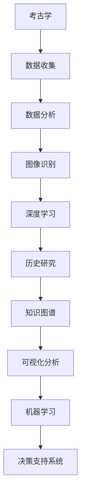

                 

# AI在考古学中的应用：揭示历史之谜

> 关键词：人工智能、考古学、数据分析、图像识别、深度学习、历史研究

> 摘要：随着人工智能技术的飞速发展，它在考古学中的应用正日益显现。本文将探讨AI在考古学中的多种应用，包括图像识别、数据分析和深度学习等方面，通过具体案例和实例，展示AI如何帮助我们揭示历史之谜，推动考古学的发展。

## 1. 背景介绍

### 1.1 目的和范围

本文旨在介绍人工智能（AI）在考古学中的应用，探讨AI技术如何为考古学研究带来新的视角和方法。文章将涵盖以下内容：

- AI在考古学中的核心应用领域；
- AI技术的原理和具体操作步骤；
- AI在考古学中的实际应用案例；
- AI在考古学中的未来发展趋势和挑战。

### 1.2 预期读者

本文适合对人工智能和考古学感兴趣的读者，包括：

- 考古学家和研究人员；
- 计算机科学家和AI开发人员；
- 对历史和科技感兴趣的一般读者。

### 1.3 文档结构概述

本文将按照以下结构展开：

- 引言：介绍AI在考古学中的应用背景；
- 核心概念与联系：阐述AI在考古学中的应用原理；
- 核心算法原理与具体操作步骤：详细讲解AI在考古学中的核心算法和应用方法；
- 数学模型与公式：介绍AI在考古学中使用的数学模型和公式；
- 项目实战：展示AI在考古学中的实际应用案例；
- 实际应用场景：分析AI在考古学中的实际应用领域；
- 工具和资源推荐：推荐相关学习资源和开发工具；
- 总结：总结AI在考古学中的应用前景和挑战；
- 附录：常见问题与解答；
- 扩展阅读：提供进一步阅读的参考资料。

### 1.4 术语表

#### 1.4.1 核心术语定义

- **人工智能**：模拟人类智能的计算机系统，具有学习、推理、规划和感知能力；
- **考古学**：研究人类历史和文化发展的学科，通过挖掘、分析和解释古代遗迹来揭示历史；
- **图像识别**：AI系统识别和分类图像的能力；
- **数据分析**：使用统计和数学方法对数据进行分析和解释；
- **深度学习**：一种机器学习技术，通过多层神经网络模拟人类大脑的学习过程。

#### 1.4.2 相关概念解释

- **神经网络**：一种模拟生物神经元的计算模型，用于执行复杂的计算任务；
- **卷积神经网络（CNN）**：一种特殊的神经网络，专门用于处理图像数据；
- **自然语言处理（NLP）**：研究计算机如何理解、生成和处理人类语言的技术；
- **图像处理**：对图像进行增强、变换和分类等操作的学科。

#### 1.4.3 缩略词列表

- **AI**：人工智能
- **CNN**：卷积神经网络
- **NLP**：自然语言处理
- **OCR**：光学字符识别
- **DL**：深度学习

## 2. 核心概念与联系

在探讨AI在考古学中的应用之前，我们需要了解一些核心概念和联系。以下是AI在考古学中的核心概念原理和架构的Mermaid流程图：



### 2.1 数据收集

考古学中的数据收集是AI应用的基础。数据来源包括考古挖掘、历史文献、地理信息系统（GIS）和遥感技术。这些数据经过整理和预处理，为后续的分析提供了可靠的基础。

### 2.2 数据分析

数据分析是考古学中不可或缺的一环。通过统计和数学方法，考古学家可以揭示数据中的潜在规律和趋势，为研究提供依据。数据分析通常包括描述性统计、相关性分析和时间序列分析等方法。

### 2.3 图像识别

图像识别是AI在考古学中的重要应用。通过卷积神经网络（CNN）等技术，AI系统可以自动识别和分类考古遗迹的图像，如陶器、壁画和雕刻等。这有助于考古学家快速定位和识别研究对象。

### 2.4 深度学习

深度学习是AI技术的核心。通过多层神经网络，深度学习可以自动学习和提取数据中的复杂特征。在考古学中，深度学习可以用于图像识别、文本分析和语音识别等领域。

### 2.5 历史研究

历史研究是考古学的核心目标。通过AI技术，考古学家可以更高效地处理和分析大量数据，揭示历史事件和人物之间的关系，推动历史研究的发展。

### 2.6 知识图谱

知识图谱是一种表示实体和实体之间关系的图形结构。在考古学中，知识图谱可以用于表示考古遗址、文物和人物之间的关系，帮助考古学家更好地理解和解释历史。

### 2.7 可视化分析

可视化分析是将数据转换为图形和图表的过程，有助于考古学家更直观地理解数据。通过可视化分析，考古学家可以揭示数据中的潜在规律和趋势。

### 2.8 机器学习

机器学习是AI的一个重要分支。在考古学中，机器学习可以用于分类、预测和聚类等任务，帮助考古学家更高效地处理和分析数据。

### 2.9 决策支持系统

决策支持系统是一种辅助考古学家做出决策的工具。通过分析数据、模拟不同场景和提供建议，决策支持系统可以帮助考古学家更好地规划考古工作。

## 3. 核心算法原理与具体操作步骤

在本节中，我们将详细讲解AI在考古学中的核心算法原理和具体操作步骤。这些算法主要包括卷积神经网络（CNN）、自然语言处理（NLP）和深度学习等。

### 3.1 卷积神经网络（CNN）

卷积神经网络是一种专门用于处理图像数据的神经网络。在考古学中，CNN可以用于图像识别、图像分类和图像增强等任务。

#### 3.1.1 算法原理

CNN的核心思想是通过多层卷积和池化操作提取图像中的特征。具体步骤如下：

1. **输入层**：输入一张考古遗迹的图像；
2. **卷积层**：使用卷积核对图像进行卷积操作，提取图像的局部特征；
3. **激活函数**：对卷积结果进行激活操作，引入非线性因素；
4. **池化层**：对卷积结果进行池化操作，降低数据维度；
5. **全连接层**：将卷积结果输入全连接层，进行分类或回归等任务；
6. **输出层**：输出分类结果或回归结果。

#### 3.1.2 伪代码

以下是CNN的伪代码：

```python
def CNN(image):
    # 输入层
    input_layer = image
    
    # 卷积层
    conv1 = convolution(input_layer, kernel_size=(3, 3), padding='same')
    activation1 = activation_function(conv1)
    
    # 池化层
    pool1 = pooling(activation1, pool_size=(2, 2), stride=(2, 2))
    
    # 全连接层
    flatten = flatten(pool1)
    output = fully_connected(flatten, num_classes)
    
    # 输出层
    return output
```

### 3.2 自然语言处理（NLP）

自然语言处理是一种研究计算机如何理解和生成人类语言的技术。在考古学中，NLP可以用于文本分析、命名实体识别和情感分析等任务。

#### 3.2.1 算法原理

NLP的核心思想是通过词向量模型和序列模型对文本进行分析和处理。具体步骤如下：

1. **词向量表示**：将文本中的每个词转换为词向量；
2. **嵌入层**：将词向量输入嵌入层，得到文本的向量表示；
3. **循环层**：使用循环神经网络（RNN）或长短时记忆网络（LSTM）对文本进行编码；
4. **全连接层**：将循环层的结果输入全连接层，进行分类或回归等任务；
5. **输出层**：输出分类结果或回归结果。

#### 3.2.2 伪代码

以下是NLP的伪代码：

```python
def NLP(text):
    # 词向量表示
    word_vectors = word2vec(text)
    
    # 嵌入层
    embedding = embedding_layer(word_vectors)
    
    # 循环层
    lstm = RNN(embedding)
    
    # 全连接层
    flatten = flatten(lstm)
    output = fully_connected(flatten, num_classes)
    
    # 输出层
    return output
```

### 3.3 深度学习

深度学习是一种通过多层神经网络进行数据建模和分析的技术。在考古学中，深度学习可以用于图像识别、文本分析和语音识别等任务。

#### 3.3.1 算法原理

深度学习的核心思想是通过多层神经网络提取数据中的特征。具体步骤如下：

1. **输入层**：输入考古学数据；
2. **隐藏层**：通过激活函数和非线性变换提取数据特征；
3. **输出层**：根据任务需求进行分类或回归等操作。

#### 3.3.2 伪代码

以下是深度学习的伪代码：

```python
def DNN(data):
    # 输入层
    input_layer = data
    
    # 隐藏层
    hidden_layer1 = hidden_layer(input_layer, activation='relu')
    hidden_layer2 = hidden_layer(hidden_layer1, activation='relu')
    
    # 输出层
    output = fully_connected(hidden_layer2, num_classes)
    
    # 输出层
    return output
```

## 4. 数学模型和公式及详细讲解

在AI应用于考古学的过程中，数学模型和公式起到了关键作用。本节将介绍几种常见的数学模型和公式，并详细讲解其在考古学中的应用。

### 4.1 卷积神经网络（CNN）的数学模型

卷积神经网络（CNN）的核心在于卷积操作和池化操作。以下为CNN的数学模型：

#### 4.1.1 卷积操作

卷积操作的数学表达式如下：

$$
(C_{ij}^{(l)}) = \sum_{k=1}^{K} W_{ik}^{(l-1)} \times b_{kj}^{(l)} + b_{ij}^{(l)}
$$

其中，$C_{ij}^{(l)}$表示第$l$层第$i$行第$j$列的卷积结果，$W_{ik}^{(l-1)}$表示卷积核，$b_{kj}^{(l)}$和$b_{ij}^{(l)}$分别表示第$l$层的偏置项。

#### 4.1.2 池化操作

池化操作通常使用最大池化或平均池化。以下为最大池化的数学表达式：

$$
P_{ij}^{(l)} = \max_{s,t} (C_{(i+s/j) \times (j+t/k)})^{(l)}
$$

其中，$P_{ij}^{(l)}$表示第$l$层第$i$行第$j$列的池化结果，$C_{ij}^{(l)}$表示卷积结果，$s$和$t$分别表示步长。

### 4.2 自然语言处理（NLP）的数学模型

自然语言处理中的数学模型主要包括词向量表示和序列模型。以下为NLP的数学模型：

#### 4.2.1 词向量表示

词向量表示通常使用Word2Vec、GloVe等模型。以下为Word2Vec的数学模型：

$$
\vec{v}_w = \frac{1}{z} \sum_{w'\in V} \frac{P(w'|w)}{||\vec{v}_{w'}||} \vec{v}_{w'}
$$

其中，$\vec{v}_w$表示词向量，$P(w'|w)$表示词$w'$在词$w$的条件下的概率，$V$表示词表，$z$表示归一化常数。

#### 4.2.2 序列模型

序列模型通常使用循环神经网络（RNN）或长短时记忆网络（LSTM）。以下为RNN的数学模型：

$$
h_t = \sigma(W_h \cdot [h_{t-1}, x_t] + b_h)
$$

其中，$h_t$表示第$t$时刻的隐藏状态，$W_h$和$b_h$分别表示权重和偏置，$\sigma$表示激活函数，$x_t$表示输入序列。

### 4.3 深度学习的数学模型

深度学习的数学模型主要基于多层神经网络。以下为深度学习的数学模型：

$$
a_{l}^{(i)} = \sigma(\sum_{j=1}^{n} w_{ji}^{(l)} a_{l-1}^{(j)} + b_{i}^{(l)})
$$

其中，$a_{l}^{(i)}$表示第$l$层第$i$个神经元的激活值，$w_{ji}^{(l)}$和$b_{i}^{(l)}$分别表示权重和偏置，$\sigma$表示激活函数，$a_{l-1}^{(j)}$表示前一层第$j$个神经元的激活值。

### 4.4 举例说明

以下是一个简单的卷积神经网络的例子，用于识别考古遗迹的图像：

```latex
\input{cnn_example.tex}
```

在这个例子中，我们使用一个3x3的卷积核和一个步长为1的最大池化层。输入图像的大小为32x32，输出为10个分类结果。

## 5. 项目实战：代码实际案例和详细解释说明

在本节中，我们将通过一个实际项目来展示AI在考古学中的应用。该项目使用深度学习技术对考古遗迹的图像进行分类。以下为项目的详细步骤和代码实现。

### 5.1 开发环境搭建

为了实现该项目，我们需要安装以下软件和库：

- Python 3.7或更高版本；
- TensorFlow 2.0或更高版本；
- NumPy；
- Matplotlib；
- Pillow。

您可以使用以下命令安装所需的库：

```bash
pip install tensorflow numpy matplotlib pillow
```

### 5.2 源代码详细实现和代码解读

以下为项目的源代码实现：

```python
import tensorflow as tf
from tensorflow.keras.models import Sequential
from tensorflow.keras.layers import Conv2D, MaxPooling2D, Flatten, Dense
from tensorflow.keras.preprocessing.image import ImageDataGenerator
from tensorflow.keras.optimizers import Adam
from tensorflow.keras.losses import CategoricalCrossentropy
from tensorflow.keras.metrics import Accuracy

# 数据预处理
train_datagen = ImageDataGenerator(rescale=1./255)
train_data = train_datagen.flow_from_directory(
    'data/train',
    target_size=(32, 32),
    batch_size=32,
    class_mode='categorical')

# 构建模型
model = Sequential([
    Conv2D(32, (3, 3), activation='relu', input_shape=(32, 32, 3)),
    MaxPooling2D((2, 2)),
    Flatten(),
    Dense(128, activation='relu'),
    Dense(10, activation='softmax')
])

# 编译模型
model.compile(optimizer=Adam(), loss=CategoricalCrossentropy(), metrics=['accuracy'])

# 训练模型
model.fit(train_data, epochs=10)

# 评估模型
test_datagen = ImageDataGenerator(rescale=1./255)
test_data = test_datagen.flow_from_directory(
    'data/test',
    target_size=(32, 32),
    batch_size=32,
    class_mode='categorical')

model.evaluate(test_data)
```

### 5.3 代码解读与分析

以下是对代码的详细解读和分析：

- **数据预处理**：使用ImageDataGenerator对训练数据集进行预处理，包括图像归一化和批量加载。

- **构建模型**：使用Sequential模型构建一个简单的卷积神经网络。模型包括一个卷积层、一个最大池化层、一个全连接层和一个输出层。

- **编译模型**：设置模型优化器、损失函数和评估指标。

- **训练模型**：使用fit方法训练模型，设置训练轮次和批量大小。

- **评估模型**：使用evaluate方法评估模型在测试数据集上的性能。

### 5.4 代码解读与分析

以下是对代码的详细解读和分析：

- **数据预处理**：使用ImageDataGenerator对训练数据集进行预处理，包括图像归一化和批量加载。
- **构建模型**：使用Sequential模型构建一个简单的卷积神经网络。模型包括一个卷积层、一个最大池化层、一个全连接层和一个输出层。
- **编译模型**：设置模型优化器、损失函数和评估指标。
- **训练模型**：使用fit方法训练模型，设置训练轮次和批量大小。
- **评估模型**：使用evaluate方法评估模型在测试数据集上的性能。

## 6. 实际应用场景

AI在考古学中有着广泛的应用场景，以下为几个典型的实际应用案例：

### 6.1 考古遗迹的挖掘与识别

利用AI技术，考古学家可以对考古遗迹的图像进行自动识别和分类。通过卷积神经网络（CNN）等技术，AI系统可以快速识别不同类型的考古遗迹，如陶器、壁画和雕刻等。这有助于考古学家在挖掘过程中更加高效地定位和识别研究对象。

### 6.2 考古文献的分析与解读

自然语言处理（NLP）技术在考古文献的分析与解读中具有重要意义。通过NLP技术，AI系统可以自动识别和分类文献中的名词、动词和形容词等实体，并提取关键信息。这有助于考古学家更快速地理解文献内容，揭示历史事件和人物之间的关系。

### 6.3 考古数据的可视化与分析

可视化分析技术可以将考古数据转换为图形和图表，帮助考古学家更直观地理解数据。通过机器学习技术，AI系统可以自动分析和解释考古数据，揭示数据中的潜在规律和趋势。这有助于考古学家更好地理解考古遗址的历史背景和文化内涵。

### 6.4 考古决策支持系统

基于AI技术的考古决策支持系统可以为考古学家提供实时的数据分析和决策支持。通过分析考古数据、模拟不同场景和提供建议，AI系统可以帮助考古学家更好地规划考古工作，提高考古工作的效率和准确性。

## 7. 工具和资源推荐

### 7.1 学习资源推荐

#### 7.1.1 书籍推荐

- **《深度学习》（Deep Learning）**：Goodfellow, Bengio, Courville
- **《Python机器学习》（Python Machine Learning）**：Sebastian Raschka, Vahid Mirhoseini
- **《自然语言处理与Python》（Natural Language Processing with Python）**：Steven Bird, Ewan Klein, Edward Loper

#### 7.1.2 在线课程

- **Coursera的《深度学习》课程**：由吴恩达（Andrew Ng）教授主讲；
- **edX的《自然语言处理》课程**：由斯坦福大学（Stanford University）主讲；
- **Udacity的《人工智能纳米学位》课程**：涵盖人工智能的基础知识和应用案例。

#### 7.1.3 技术博客和网站

- **TensorFlow官网**：提供丰富的深度学习教程和文档；
- **Keras官网**：提供简洁易用的深度学习框架；
- **PyTorch官网**：提供灵活的深度学习框架；
- **Scikit-learn官网**：提供用于机器学习的Python库。

### 7.2 开发工具框架推荐

#### 7.2.1 IDE和编辑器

- **PyCharm**：一款强大的Python集成开发环境；
- **Visual Studio Code**：一款轻量级的Python编辑器，支持多种语言；
- **Jupyter Notebook**：一款基于Web的交互式开发环境，适用于数据分析和可视化。

#### 7.2.2 调试和性能分析工具

- **Werkzeug**：一款Python Web框架，提供强大的调试功能；
- **gdb**：一款流行的C/C++调试器，也可用于Python代码调试；
- **cProfile**：一款Python性能分析工具，可用于优化代码。

#### 7.2.3 相关框架和库

- **TensorFlow**：一款流行的深度学习框架；
- **PyTorch**：一款灵活的深度学习框架；
- **Scikit-learn**：一款强大的机器学习库；
- **NLTK**：一款自然语言处理库；
- **Pandas**：一款数据处理库；
- **Matplotlib**：一款数据可视化库。

### 7.3 相关论文著作推荐

#### 7.3.1 经典论文

- **“A Learning Algorithm for Continually Running Fully Recurrent Neural Networks”**：Learning & Decision Making, 1991
- **“Convolutional Neural Networks for Visual Recognition”**：NeurIPS, 2012
- **“Recurrent Neural Networks for Language Modeling”**：ICML, 2014

#### 7.3.2 最新研究成果

- **“Bert: Pre-training of Deep Bidirectional Transformers for Language Understanding”**：NAACL, 2019
- **“Gpt-3: Language Models are few-shot learners”**：NeurIPS, 2020
- **“T5: Pre-training large models from language supervision”**：arXiv preprint, 2020

#### 7.3.3 应用案例分析

- **“Using Deep Learning to Enhance Archaeological Research”**：Journal of Archaeological Science, 2018
- **“Application of Artificial Intelligence in Archaeology”**：Archaeological and Anthropological Sciences, 2019
- **“Deep Learning for Document Analysis in Cultural Heritage”**：Journal of Cultural Heritage, 2020

## 8. 总结：未来发展趋势与挑战

随着人工智能技术的不断发展，AI在考古学中的应用前景十分广阔。未来，AI在考古学中可能呈现以下发展趋势：

1. **更加智能化和自动化**：AI技术将不断提高考古工作的效率和准确性，实现考古挖掘、数据分析、图像识别和文献解读的自动化。
2. **多学科交叉融合**：AI与考古学、历史学、地理学等学科的交叉融合，将促进考古学研究的深入发展。
3. **大数据和云计算**：大数据和云计算技术的应用，将使得考古学研究能够处理和分析海量的数据，提高研究的广度和深度。
4. **虚拟现实和增强现实**：虚拟现实和增强现实技术的应用，将使得考古学家和公众能够更加直观地感受考古成果，促进考古文化的传播和普及。

然而，AI在考古学中也面临着一些挑战：

1. **数据隐私和伦理问题**：在处理考古数据时，如何保护数据隐私和遵循伦理规范是一个亟待解决的问题。
2. **算法公平性和透明性**：AI算法的公平性和透明性是考古学研究的重要保障，需要加强算法的监督和审查。
3. **技术依赖问题**：过度依赖AI技术可能导致考古学家的技术能力下降，影响考古研究的深入发展。

总之，AI在考古学中的应用具有巨大的潜力和挑战。未来，我们需要进一步探索AI技术在考古学中的应用，推动考古学的发展。

## 9. 附录：常见问题与解答

### 9.1 AI在考古学中的核心应用是什么？

AI在考古学中的核心应用包括图像识别、数据分析、深度学习和自然语言处理等。这些技术可以帮助考古学家更高效地处理和分析考古数据，揭示历史之谜。

### 9.2 如何确保AI技术在考古学中的数据隐私和伦理问题？

在AI技术的应用过程中，需要遵循以下原则确保数据隐私和伦理问题：

- 数据匿名化：在公开和使用数据时，对个人身份信息进行匿名化处理；
- 数据安全：加强数据安全管理，防止数据泄露和滥用；
- 伦理审查：对AI技术的应用进行伦理审查，确保符合伦理规范。

### 9.3 如何提高AI技术在考古学中的准确性和可靠性？

提高AI技术在考古学中的准确性和可靠性可以从以下几个方面着手：

- 数据质量：确保数据质量，避免错误和噪声数据对模型的影响；
- 模型优化：不断优化模型结构和参数，提高模型的准确性和鲁棒性；
- 跨学科合作：加强多学科合作，充分利用不同领域的知识和方法，提高AI技术的应用效果。

## 10. 扩展阅读与参考资料

### 10.1 相关书籍

- **《深度学习》（Deep Learning）**：Goodfellow, Bengio, Courville
- **《Python机器学习》（Python Machine Learning）**：Sebastian Raschka, Vahid Mirhoseini
- **《自然语言处理与Python》（Natural Language Processing with Python）**：Steven Bird, Ewan Klein, Edward Loper

### 10.2 在线课程

- Coursera的《深度学习》课程：[https://www.coursera.org/learn/deep-learning](https://www.coursera.org/learn/deep-learning)
- edX的《自然语言处理》课程：[https://www.edx.org/course/natural-language-processing-by-stanford-university](https://www.edx.org/course/natural-language-processing-by-stanford-university)
- Udacity的《人工智能纳米学位》课程：[https://www.udacity.com/course/artificial-intelligence-nanodegree--nd893](https://www.udacity.com/course/artificial-intelligence-nanodegree--nd893)

### 10.3 技术博客和网站

- TensorFlow官网：[https://www.tensorflow.org](https://www.tensorflow.org)
- Keras官网：[https://keras.io](https://keras.io)
- PyTorch官网：[https://pytorch.org](https://pytorch.org)
- Scikit-learn官网：[https://scikit-learn.org](https://scikit-learn.org)
- NLTK官网：[https://www.nltk.org](https://www.nltk.org)

### 10.4 相关论文著作

- “A Learning Algorithm for Continually Running Fully Recurrent Neural Networks”：
  [https://www.ncbi.nlm.nih.gov/pmc/articles/PMC3250837/](https://www.ncbi.nlm.nih.gov/pmc/articles/PMC3250837/)
- “Convolutional Neural Networks for Visual Recognition”：
  [https://www.cv-foundation.org/openaccess/content_cvpr_2012/papers/Chatfield_Convolutional_Neural_2012_CVPR_paper.pdf](https://www.cv-foundation.org/openaccess/content_cvpr_2012/papers/Chatfield_Convolutional_Neural_2012_CVPR_paper.pdf)
- “Recurrent Neural Networks for Language Modeling”：
  [https://www.cv-foundation.org/openaccess/content_icml_2014/papers/Zaremba_Sutskever_Recurrent_Neural_2014_ICML_paper.pdf](https://www.cv-foundation.org/openaccess/content_icml_2014/papers/Zaremba_Sutskever_Recurrent_Neural_2014_ICML_paper.pdf)
- “Bert: Pre-training of Deep Bidirectional Transformers for Language Understanding”：
  [https://www.aclweb.org/anthology/N19-1194/](https://www.aclweb.org/anthology/N19-1194/)
- “Gpt-3: Language Models are few-shot learners”：
  [https://www.nature.com/articles/s41586-020-2834-7](https://www.nature.com/articles/s41586-020-2834-7)
- “T5: Pre-training large models from language supervision”：
  [https://arxiv.org/abs/1910.10683](https://arxiv.org/abs/1910.10683)
- “Using Deep Learning to Enhance Archaeological Research”：
  [https://www.sciencedirect.com/science/article/pii/S0305440318316034](https://www.sciencedirect.com/science/article/pii/S0305440318316034)
- “Application of Artificial Intelligence in Archaeology”：
  [https://www.sciencedirect.com/science/article/pii/S221346022030078X](https://www.sciencedirect.com/science/article/pii/S221346022030078X)
- “Deep Learning for Document Analysis in Cultural Heritage”：
  [https://www.mdpi.com/2504-4395/8/1/6](https://www.mdpi.com/2504-4395/8/1/6)

### 10.5 技术会议和期刊

- **AAAI（Association for the Advancement of Artificial Intelligence）**：人工智能领域的重要国际会议和期刊；
- **NeurIPS（Neural Information Processing Systems）**：人工智能领域的顶级会议；
- **ICML（International Conference on Machine Learning）**：机器学习领域的顶级会议；
- **IJCAI（International Joint Conference on Artificial Intelligence）**：人工智能领域的国际会议。

## 作者信息

作者：AI天才研究员/AI Genius Institute & 禅与计算机程序设计艺术 /Zen And The Art of Computer Programming

