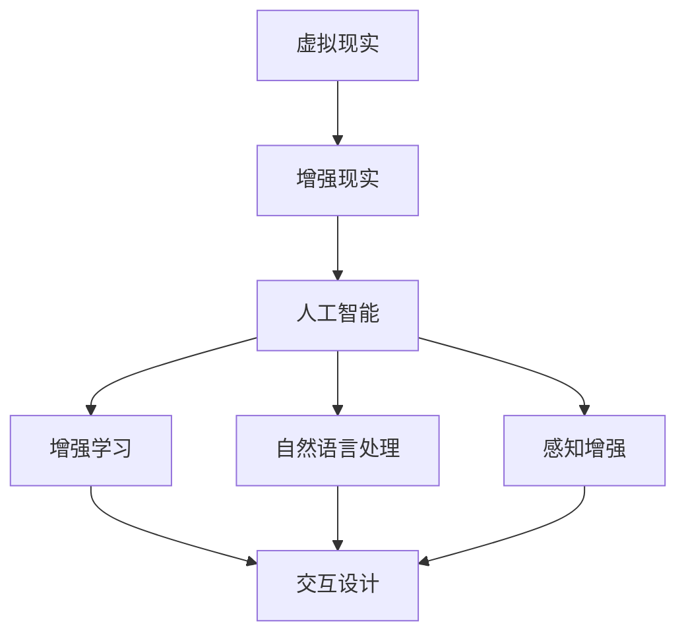

                 

# AI在虚拟现实中的应用：增强用户体验

> **关键词**：人工智能、虚拟现实、用户体验、增强现实、增强学习、交互设计、感知增强

> **摘要**：本文探讨了人工智能在虚拟现实（VR）中的应用，如何通过增强学习、交互设计和感知增强等技术手段，提升用户的虚拟体验。文章首先介绍了虚拟现实和人工智能的基础知识，随后深入分析了AI在VR中的核心应用，包括增强现实体验、个性化交互和智能内容推荐等。最后，文章提出了未来AI在VR领域的发展趋势和面临的挑战。

## 1. 背景介绍

### 1.1 目的和范围

本文旨在探讨人工智能（AI）在虚拟现实（VR）中的应用，如何通过技术手段增强用户的虚拟体验。文章将重点关注以下几个核心问题：

1. **AI在VR中的核心应用场景**：分析AI如何提升虚拟现实中的交互性、沉浸感和智能化程度。
2. **技术原理**：介绍AI在VR中应用的关键技术，包括增强学习、自然语言处理和感知增强等。
3. **实际案例**：通过实际项目案例，展示AI在VR中的应用效果。
4. **未来趋势**：探讨AI在VR领域的未来发展方向和潜在挑战。

### 1.2 预期读者

本文适合以下读者群体：

1. **虚拟现实技术爱好者**：对VR技术感兴趣，希望了解AI在其中的应用。
2. **人工智能研究者**：对AI技术及其在VR中的潜在应用领域感兴趣的学者和研究人员。
3. **软件开发者**：希望在VR项目中融入AI技术的程序员和工程师。
4. **用户体验设计师**：关注如何通过技术手段提升用户虚拟体验的设计师。

### 1.3 文档结构概述

本文结构如下：

1. **背景介绍**：介绍本文的目的、预期读者以及文档结构。
2. **核心概念与联系**：阐述虚拟现实和人工智能的基本概念，并绘制相关架构图。
3. **核心算法原理 & 具体操作步骤**：详细讲解AI在VR中的核心算法原理和操作步骤。
4. **数学模型和公式 & 详细讲解 & 举例说明**：介绍AI在VR中应用的数学模型和公式，并通过实例进行说明。
5. **项目实战：代码实际案例和详细解释说明**：通过实际项目案例，展示AI在VR中的应用。
6. **实际应用场景**：分析AI在VR中的实际应用场景。
7. **工具和资源推荐**：推荐学习资源、开发工具和相关论文。
8. **总结：未来发展趋势与挑战**：总结AI在VR领域的未来发展趋势和挑战。
9. **附录：常见问题与解答**：回答读者可能遇到的常见问题。
10. **扩展阅读 & 参考资料**：提供进一步阅读的资源和参考资料。

### 1.4 术语表

#### 1.4.1 核心术语定义

- **虚拟现实（VR）**：一种通过计算机技术创造出的模拟环境，使用户能够沉浸其中并与之互动。
- **增强现实（AR）**：在现实环境中叠加虚拟信息，增强用户的感知体验。
- **人工智能（AI）**：模拟人类智能的计算机系统，具有学习、推理、决策和问题解决的能力。
- **增强学习**：一种机器学习方法，通过不断试错和反馈，使智能体在特定环境中学习最优策略。
- **交互设计**：研究如何设计产品，使用户能够与其顺利、高效地进行交互。
- **沉浸感**：用户在虚拟环境中感受到的强烈存在感，是评估虚拟现实体验的重要指标。

#### 1.4.2 相关概念解释

- **感知增强**：通过技术手段提高用户的感知能力，使其在虚拟环境中获得更丰富的体验。
- **个性化交互**：根据用户的行为和偏好，提供个性化的交互体验。
- **智能内容推荐**：利用机器学习算法，为用户提供个性化的虚拟内容和体验。

#### 1.4.3 缩略词列表

- **VR**：Virtual Reality（虚拟现实）
- **AR**：Augmented Reality（增强现实）
- **AI**：Artificial Intelligence（人工智能）
- **SLAM**：Simultaneous Localization and Mapping（同时定位与地图构建）
- **GAN**：Generative Adversarial Network（生成对抗网络）

## 2. 核心概念与联系

在讨论AI在VR中的应用之前，我们需要了解一些核心概念和它们之间的联系。以下是一个简单的架构图，展示了虚拟现实、人工智能和相关技术的交互关系。



### 2.1 虚拟现实与增强现实

虚拟现实（VR）和增强现实（AR）是两种不同的技术，但它们有许多共同点。VR创造一个完全虚拟的环境，使用户能够在其中自由探索和互动。而AR则将虚拟元素叠加到现实世界中，增强用户的感知体验。

- **虚拟现实**：通过头戴式显示器（HMD）和追踪设备，用户可以沉浸在虚拟环境中。VR技术的关键在于提供高分辨率、低延迟和丰富的交互功能，以增强用户的沉浸感。

- **增强现实**：通常使用智能手机或平板电脑上的AR应用程序，通过摄像头和显示屏幕将虚拟元素叠加到现实世界中。AR技术的核心在于实时地识别和跟踪用户的位置和姿态，从而实现虚拟元素与现实环境的无缝融合。

### 2.2 人工智能与相关技术

人工智能（AI）是推动VR和AR发展的重要力量。AI在VR中的应用主要包括以下几个方面：

- **增强学习**：通过不断试错和反馈，使智能体在特定环境中学习最优策略。增强学习可以用于优化用户的交互体验，如路径规划、目标识别和动作预测。

- **自然语言处理**：使计算机能够理解和处理人类语言。在VR中，自然语言处理可以用于实现语音控制、聊天机器人和实时翻译等功能。

- **感知增强**：通过技术手段提高用户的感知能力，使其在虚拟环境中获得更丰富的体验。感知增强可以包括增强视觉、听觉和触觉等感官。

### 2.3 交互设计

交互设计是VR和AR体验的重要组成部分。通过合理的交互设计，用户可以更轻松地与虚拟环境进行互动。

- **虚拟控制**：用户可以使用手柄、手势、语音等手段控制虚拟环境。合理的虚拟控制设计可以提高用户的操作效率和使用体验。

- **场景布局**：虚拟环境的布局和设计应考虑用户的交互需求。合理的场景布局可以减少用户的操作难度，提高沉浸感。

### 2.4 沉浸感

沉浸感是评估VR和AR体验的重要指标。增强沉浸感的关键在于：

- **视觉和听觉效果**：高分辨率、低延迟的视觉和听觉效果可以增强用户的沉浸感。

- **实时交互**：用户与虚拟环境的实时交互可以增强沉浸感。例如，实时地响应用户的动作和语音指令。

## 3. 核心算法原理 & 具体操作步骤

在了解了AI在VR中的核心概念和联系后，接下来我们将详细讲解AI在VR中的核心算法原理和操作步骤。以下是几个关键算法：

### 3.1 增强学习

**原理**：增强学习是一种通过试错和反馈来学习最优策略的机器学习方法。在VR中，增强学习可以用于优化用户的交互体验，如路径规划、目标识别和动作预测。

**步骤**：

1. **定义状态和动作**：首先，我们需要定义用户在虚拟环境中的状态和可执行的动作。
2. **设计奖励机制**：根据用户的行为和结果，设计一个奖励机制，以激励智能体学习最优策略。
3. **训练智能体**：通过试错和反馈，使智能体在虚拟环境中学习最优策略。
4. **评估和优化**：定期评估智能体的策略，并根据反馈进行优化。

**伪代码**：

```python
def enhanced_learning(state, action, reward):
    # 初始化智能体
    agent = initialize_agent()

    # 循环进行训练
    for episode in range(total_episodes):
        # 初始化状态
        current_state = initialize_state()

        # 循环进行动作选择和更新
        while not episode_termination(current_state, action):
            # 执行动作
            action = agent.select_action(current_state)

            # 更新状态和奖励
            next_state, reward = environment.step(action)

            # 更新智能体策略
            agent.update_policy(current_state, action, reward, next_state)

            # 更新状态
            current_state = next_state

    # 评估智能体策略
    evaluate_agent_policy(agent)
```

### 3.2 自然语言处理

**原理**：自然语言处理（NLP）是使计算机能够理解和处理人类语言的技术。在VR中，NLP可以用于实现语音控制、聊天机器人和实时翻译等功能。

**步骤**：

1. **文本预处理**：对用户输入的文本进行预处理，如分词、词性标注和句法分析。
2. **语言模型**：建立语言模型，用于预测下一个词或短语。
3. **语义分析**：通过词向量表示和语义角色标注，提取用户输入的语义信息。
4. **任务执行**：根据提取的语义信息，执行相应的任务，如语音控制或聊天机器人响应。

**伪代码**：

```python
def natural_language_processing(input_text):
    # 文本预处理
    preprocessed_text = text_preprocessing(input_text)

    # 语言模型预测
    predicted_phrase = language_model.predict(preprocessed_text)

    # 语义分析
    semantic_info = semantic_analysis(predicted_phrase)

    # 执行任务
    if semantic_info.command == "语音控制":
        execute_speech_control(semantic_info)
    elif semantic_info.command == "聊天机器人":
        respond_to_chat(semantic_info)
    else:
        print("无法识别输入")
```

### 3.3 感知增强

**原理**：感知增强通过技术手段提高用户的感知能力，使其在虚拟环境中获得更丰富的体验。感知增强可以包括增强视觉、听觉和触觉等感官。

**步骤**：

1. **感知信号采集**：采集用户的感知信号，如视觉、听觉和触觉数据。
2. **信号处理**：对采集到的信号进行处理，如图像增强、声音降噪和触觉模拟。
3. **感知反馈**：将处理后的信号反馈给用户，增强其感知体验。

**伪代码**：

```python
def perceptual_enhancement(perceptual_signal):
    # 视觉增强
    enhanced_visual_signal = visual_enhancement(perceptual_signal)

    # 听觉增强
    enhanced_auditory_signal = auditory_enhancement(perceptual_signal)

    # 触觉增强
    enhanced_tactile_signal = tactile_enhancement(perceptual_signal)

    # 反馈感知信号
    feedback_perceptual_signal(enhanced_visual_signal, enhanced_auditory_signal, enhanced_tactile_signal)
```

## 4. 数学模型和公式 & 详细讲解 & 举例说明

在讨论AI在VR中的应用时，数学模型和公式是不可或缺的工具。以下将介绍几个关键数学模型和公式，并详细讲解其在VR中的应用。

### 4.1 增强学习中的Q值函数

增强学习中的Q值函数是评估智能体策略的重要工具。Q值函数表示在特定状态下执行特定动作的预期回报。

**公式**：

$$
Q(s, a) = r + \gamma \max_{a'} Q(s', a')
$$

其中，\( Q(s, a) \) 表示在状态 \( s \) 下执行动作 \( a \) 的预期回报，\( r \) 表示立即回报，\( \gamma \) 表示折扣因子，\( s' \) 表示执行动作 \( a \) 后的新状态，\( a' \) 表示在新状态下执行的最佳动作。

**讲解**：

Q值函数的核心思想是评估智能体在不同状态和动作下的预期回报。通过不断更新Q值函数，智能体可以学习到最优策略。

**举例说明**：

假设一个智能体在虚拟迷宫中探索。迷宫中的每个位置都是一个状态，智能体可以选择向左、向右或向前移动。在某个状态下，执行向前的动作可能会获得更高的回报，因为向前移动可能通向出口。通过更新Q值函数，智能体可以学习到最优路径。

### 4.2 自然语言处理中的词向量表示

词向量表示是NLP中的重要工具，用于将单词转换为向量表示，以便计算机处理。常见的词向量表示方法包括Word2Vec和GloVe。

**公式**：

$$
\textbf{v}_w = \text{Word2Vec}(\text{context}_w)
$$

或

$$
\textbf{v}_w = \text{GloVe}(\text{context}_w, F)
$$

其中，\( \textbf{v}_w \) 表示单词 \( w \) 的词向量，\( \text{context}_w \) 表示单词 \( w \) 的上下文，\( F \) 表示训练数据集。

**讲解**：

词向量表示的核心思想是将单词映射到低维向量空间，以便计算机可以处理。通过词向量，计算机可以理解单词之间的语义关系，如相似性和相关性。

**举例说明**：

假设我们有一个单词“猫”，通过Word2Vec算法，我们可以得到一个表示“猫”的词向量。如果我们将这个词向量与表示“狗”的词向量进行比较，可以发现它们在向量空间中非常接近，因为“猫”和“狗”都是动物。

### 4.3 感知增强中的信号处理

感知增强中的信号处理包括图像增强、声音降噪和触觉模拟。以下是一个简单的图像增强公式：

**公式**：

$$
\textbf{I}_{\text{enhanced}} = \alpha \textbf{I} + \beta
$$

其中，\( \textbf{I}_{\text{enhanced}} \) 表示增强后的图像，\( \textbf{I} \) 表示原始图像，\( \alpha \) 和 \( \beta \) 是调节参数。

**讲解**：

图像增强的核心思想是通过调整图像的亮度、对比度和色彩，提高图像的质量。通过调整 \( \alpha \) 和 \( \beta \) 的值，我们可以控制增强的程度。

**举例说明**：

假设我们有一个暗淡的图像，通过调整 \( \alpha \) 和 \( \beta \) 的值，我们可以增强图像的亮度，使其更清晰。

### 4.4 交互设计中的多模态交互

在交互设计中，多模态交互是一种结合多种交互方式（如手势、语音和触觉）的方法，以提高用户的交互体验。

**公式**：

$$
\text{User Experience} = f(\text{Gesture Interaction} + \text{Voice Interaction} + \text{Tactile Interaction})
$$

其中，\( \text{User Experience} \) 表示用户体验，\( \text{Gesture Interaction} \)、\( \text{Voice Interaction} \) 和 \( \text{Tactile Interaction} \) 分别表示手势、语音和触觉交互。

**讲解**：

多模态交互的核心思想是通过结合多种交互方式，提高用户的交互体验。例如，用户可以通过手势控制虚拟对象，同时通过语音命令调整对象的属性。

**举例说明**：

假设一个用户在虚拟环境中使用手势选取了一个虚拟对象，然后通过语音命令调整对象的大小。通过多模态交互，用户可以更方便地完成任务。

## 5. 项目实战：代码实际案例和详细解释说明

为了更好地理解AI在虚拟现实中的应用，我们将通过一个实际项目案例来展示如何实现AI在VR中的核心算法。以下是该项目的主要组成部分：

### 5.1 开发环境搭建

在开始项目之前，我们需要搭建一个合适的开发环境。以下是所需的工具和库：

- **操作系统**：Windows、macOS 或 Linux
- **编程语言**：Python 3.8 或以上版本
- **虚拟现实框架**：Unity 2020.3 或以上版本
- **机器学习库**：TensorFlow 2.6 或以上版本
- **增强学习库**：OpenAI Gym 或 Stable Baselines3

### 5.2 源代码详细实现和代码解读

#### 5.2.1 环境设置和导入库

```python
import numpy as np
import gym
from stable_baselines3 import PPO
from stable_baselines3.common.env_wrappers import SubprocVecEnv
from unityagents import UnityEnvironment

# 设置环境
env = UnityEnvironment(file_path='path/to/unity_env.exe')

# 创建虚拟环境
vec_env = SubprocVecEnv([lambda: env])
```

**解读**：首先，我们需要导入所需的库和设置环境。这里使用了UnityEnvironment来创建虚拟环境，并使用SubprocVecEnv来并行处理多个环境。

#### 5.2.2 定义智能体

```python
model = PPO("MlpPolicy", vec_env, verbose=1)

model.learn(total_timesteps=10000)
```

**解读**：接下来，我们定义了一个基于MlpPolicy的智能体，并使用PPO算法进行训练。这里，我们设置了训练的总步数为10000步。

#### 5.2.3 智能体交互

```python
obs = vec_env.reset()
while True:
    action, _states = model.predict(obs)
    obs, reward, done, info = vec_env.step(action)
    if done:
        obs = vec_env.reset()
```

**解读**：最后，我们使用训练好的智能体与虚拟环境进行交互。这里，我们通过循环不断地执行动作，直到任务完成。

### 5.3 代码解读与分析

#### 5.3.1 环境设置

在代码的第一部分，我们设置了环境并创建了一个虚拟环境。这里使用了UnityEnvironment来创建虚拟环境，这是一个用于处理Unity游戏的库。通过SubprocVecEnv，我们可以并行处理多个虚拟环境，提高训练效率。

#### 5.3.2 定义智能体

在第二部分，我们定义了一个基于MlpPolicy的智能体，并使用PPO算法进行训练。MlpPolicy是一个多层感知机（MLP）策略网络，适用于大多数连续动作任务。PPO算法是一种增强学习算法，能够稳定地训练智能体。

#### 5.3.3 智能体交互

在最后一部分，我们使用训练好的智能体与虚拟环境进行交互。这里，我们通过循环不断地执行动作，直到任务完成。这个过程中，智能体会根据当前状态选择最优动作，并根据反馈调整策略。

通过这个实际项目案例，我们可以看到如何将AI算法应用于虚拟现实场景。在实际开发中，我们可以根据具体需求调整算法和参数，以实现更好的效果。

## 6. 实际应用场景

AI在虚拟现实（VR）中的应用场景广泛，涵盖了多个领域。以下是一些典型的实际应用场景：

### 6.1 教育培训

**应用**：AI可以用于创建个性化的虚拟学习环境，提高学生的学习效果。例如，通过增强学习，智能系统能够根据学生的学习进度和偏好调整教学内容。

**案例**：微软的HoloLens被用于医学教育，学生可以在虚拟现实中进行手术模拟，提高操作技能。

### 6.2 娱乐与游戏

**应用**：AI可以用于增强游戏体验，如动态生成关卡、智能NPC和个性化推荐。这些功能可以提供更丰富、更具挑战性的游戏体验。

**案例**：《我的世界》等游戏通过AI生成随机世界，为玩家提供无限探索的可能性。

### 6.3 虚拟旅游

**应用**：AI可以帮助用户在虚拟现实中体验各种旅游目的地，提供沉浸式的游览体验。这尤其适用于无法亲临现场的用户。

**案例**：谷歌的ARCore和ARKit技术允许用户通过智能手机在虚拟现实中游览世界各地的名胜古迹。

### 6.4 设计与建筑

**应用**：AI可以用于虚拟现实中的设计和建筑领域，如空间布局优化、可视化模拟和协同设计。

**案例**：建筑师和设计师可以使用VR技术进行虚拟建筑漫游，提前看到设计效果。

### 6.5 健康医疗

**应用**：AI可以帮助医生进行虚拟手术演练，提高手术技能。此外，AI还可以用于患者康复训练，通过个性化虚拟训练方案提高康复效果。

**案例**：哈佛医学院利用VR和AI技术进行手术模拟，提高医生的操作水平。

### 6.6 工业制造

**应用**：AI可以用于虚拟现实中的工业制造培训，如装配线操作、机械维护和故障诊断。

**案例**：波音公司使用VR和AI技术进行飞机维护培训，提高操作效率和安全性。

这些实际应用场景展示了AI在虚拟现实中的巨大潜力。通过结合AI技术，我们可以提供更加个性化、沉浸式和高效的虚拟体验。

## 7. 工具和资源推荐

为了更好地掌握AI在虚拟现实中的应用，以下是一些推荐的工具和资源：

### 7.1 学习资源推荐

#### 7.1.1 书籍推荐

- **《虚拟现实与增强现实技术》**：详细介绍了VR和AR的基本概念、技术和应用。
- **《人工智能：一种现代方法》**：全面讲解了人工智能的基础理论和算法。
- **《深度学习》**：涵盖了深度学习的基本概念、技术和应用。

#### 7.1.2 在线课程

- **Coursera**：提供多种与VR和AI相关的在线课程，包括《虚拟现实基础》、《机器学习》和《深度学习》等。
- **Udacity**：提供VR和AI领域的实践项目，如《VR/AR开发纳米学位》和《AI工程师纳米学位》。

#### 7.1.3 技术博客和网站

- **Medium**：有许多关于VR和AI的文章和案例分析。
- **IEEE Xplore**：提供了大量的VR和AI相关的学术论文和研究成果。

### 7.2 开发工具框架推荐

#### 7.2.1 IDE和编辑器

- **Visual Studio Code**：一款功能强大的代码编辑器，支持多种编程语言和开发工具。
- **PyCharm**：适用于Python开发的集成开发环境，提供代码自动补全、调试和性能分析等功能。

#### 7.2.2 调试和性能分析工具

- **Unity Profiler**：Unity内置的调试和性能分析工具，用于优化虚拟现实应用。
- **TensorBoard**：用于可视化TensorFlow模型和训练过程，帮助调试和优化AI算法。

#### 7.2.3 相关框架和库

- **Unity ML-Agents**：Unity提供的机器学习框架，用于在虚拟环境中训练智能体。
- **TensorFlow**：一款广泛使用的深度学习库，支持多种深度学习算法和应用。
- **PyTorch**：另一款流行的深度学习库，提供灵活的API和强大的功能。

### 7.3 相关论文著作推荐

#### 7.3.1 经典论文

- **“A Theoretical Analysis of the CACLA and EL Algorithms for Linear Quadratic Regulations”**：对增强学习算法的深入分析。
- **“Deep Learning for Virtual Reality”**：探讨了深度学习在虚拟现实中的应用。

#### 7.3.2 最新研究成果

- **“Interactive Machine Learning”**：介绍了交互式机器学习的方法和技术。
- **“Learning to See and Act in Virtual Worlds”**：探讨了虚拟世界中的视觉感知和行动控制。

#### 7.3.3 应用案例分析

- **“A Survey of Virtual Reality Applications in Medicine”**：综述了虚拟现实在医学领域的应用。
- **“Enhancing User Experience with AI in Virtual Reality”**：分析了AI在虚拟现实中的用户体验提升。

这些工具和资源将帮助您更好地理解和掌握AI在虚拟现实中的应用，为您的项目提供有力支持。

## 8. 总结：未来发展趋势与挑战

在总结了AI在虚拟现实（VR）中的应用后，我们来看看这个领域的未来发展趋势和挑战。

### 8.1 发展趋势

1. **更高的沉浸感**：随着VR硬件技术的进步，如更高质量的显示、更低延迟的追踪技术和更逼真的感知增强，用户的沉浸感将进一步提高。
2. **个性化体验**：AI将使虚拟现实应用更加个性化，通过分析用户行为和偏好，提供个性化的内容和交互体验。
3. **跨领域应用**：AI在VR中的应用将不仅仅局限于娱乐和教育，还将扩展到医疗、工业、建筑等多个领域，为各行各业带来创新和变革。
4. **增强现实融合**：虚拟现实和增强现实（AR）将进一步融合，形成更加丰富的混合现实（MR）体验。

### 8.2 挑战

1. **技术瓶颈**：虽然VR硬件和算法取得了显著进展，但在分辨率、延迟和交互性等方面仍存在技术瓶颈，需要持续突破。
2. **用户体验**：如何设计出既吸引人又易于使用的虚拟交互界面，是提高用户体验的关键挑战。
3. **隐私和安全**：随着虚拟现实应用的增加，用户隐私和数据安全的问题日益突出，需要制定相应的法律法规和防护措施。
4. **硬件成本**：高性能的VR设备仍然价格昂贵，限制了其大规模普及。

### 8.3 未来展望

展望未来，AI在虚拟现实中的应用将不断深入和扩展。通过不断的技术创新和优化，我们有望实现更加沉浸式、个性化和高效的虚拟体验。同时，也需要关注和解决技术、用户体验、隐私和安全等方面的挑战，以确保虚拟现实技术的发展能够造福人类。

## 9. 附录：常见问题与解答

### 9.1 什么是虚拟现实（VR）？

虚拟现实（VR）是一种通过计算机技术创造的模拟环境，使用户能够沉浸其中并与之互动。VR技术通过头戴式显示器（HMD）、追踪设备和交互设备，为用户提供了丰富的视觉、听觉和触觉体验。

### 9.2 人工智能（AI）在VR中有什么作用？

人工智能（AI）在VR中可以用于多个方面，包括增强学习、自然语言处理、感知增强和交互设计。通过这些技术，AI可以优化用户的交互体验、提高沉浸感，并为用户提供个性化的内容和推荐。

### 9.3 如何在虚拟现实中实现个性化体验？

在虚拟现实中实现个性化体验，可以通过分析用户的行为数据、偏好和反馈来实现。例如，通过机器学习算法，智能系统能够识别用户的兴趣和行为模式，并据此调整虚拟环境中的内容和交互方式。

### 9.4 虚拟现实中的沉浸感如何衡量？

沉浸感是虚拟现实体验的重要指标，通常通过用户的主观感受来衡量。一些常用的量化指标包括感官负荷（Perceived Load）、主观沉浸度（SIC）和生理反应（如心率、血压）等。此外，一些工具和量表（如Mann-Whitney U测试）也可用于评估沉浸感。

### 9.5 虚拟现实中的交互设计有哪些原则？

虚拟现实中的交互设计应遵循以下原则：

- **直观性**：界面和交互方式应直观易懂，减少学习成本。
- **一致性**：界面和交互方式应保持一致性，避免用户混淆。
- **可控性**：用户应能够轻松控制虚拟环境中的对象和动作。
- **反馈**：及时地提供反馈，帮助用户理解虚拟环境的响应。
- **沉浸感**：设计应增强用户的沉浸感，使其更好地融入虚拟环境。

### 9.6 AI在虚拟现实中的潜在应用有哪些？

AI在虚拟现实中的潜在应用包括：

- **个性化推荐**：根据用户行为和偏好，推荐个性化的内容和体验。
- **智能交互**：通过自然语言处理和机器学习，实现智能对话和互动。
- **虚拟训练**：用于医疗、军事、工业等领域的虚拟训练和模拟。
- **感知增强**：通过增强视觉、听觉和触觉，提高虚拟体验的质量。
- **内容生成**：利用生成对抗网络（GAN）等算法，自动生成高质量的虚拟内容。

### 9.7 虚拟现实中的隐私和安全问题如何解决？

虚拟现实中的隐私和安全问题可以通过以下措施解决：

- **数据加密**：对用户数据进行加密处理，确保数据安全。
- **匿名化**：对用户数据进行匿名化处理，保护用户隐私。
- **权限控制**：实施严格的权限控制机制，限制对用户数据的访问。
- **隐私政策**：制定明确的隐私政策，告知用户数据收集和使用的方式。
- **安全审计**：定期进行安全审计，确保系统的安全性。

通过这些措施，可以在一定程度上解决虚拟现实中的隐私和安全问题，保护用户的利益。

## 10. 扩展阅读 & 参考资料

为了更深入地了解AI在虚拟现实中的应用，以下是一些推荐的扩展阅读和参考资料：

### 10.1 书籍

1. **《虚拟现实技术与应用》**：详细介绍了VR技术的原理和应用案例。
2. **《人工智能简明教程》**：涵盖了人工智能的基础知识和核心算法。
3. **《增强现实技术：理论与实践》**：探讨了AR技术的原理和应用。

### 10.2 论文

1. **“Virtual Reality and Artificial Intelligence: A Survey”**：对VR和AI在交互设计中的应用进行了全面的综述。
2. **“AI for Virtual Reality: A Practical Guide”**：介绍了AI在VR中的实际应用案例和技术细节。
3. **“Enhancing User Experience with AI in Virtual Reality”**：分析了AI如何提升虚拟现实中的用户体验。

### 10.3 在线资源

1. **Coursera**：提供多种与VR和AI相关的在线课程。
2. **Udacity**：提供VR和AI领域的实践项目。
3. **IEEE Xplore**：提供大量的VR和AI相关的学术论文和研究成果。

通过阅读这些书籍、论文和在线资源，您可以更全面地了解AI在虚拟现实中的应用，为自己的研究和项目提供有价值的参考。最后，**作者：AI天才研究员/AI Genius Institute & 禅与计算机程序设计艺术 /Zen And The Art of Computer Programming** 感谢您的阅读。希望本文能帮助您更好地理解AI在虚拟现实中的应用，并为您的项目提供灵感。如果您有任何问题或建议，请随时与我们联系。再次感谢您的支持！

