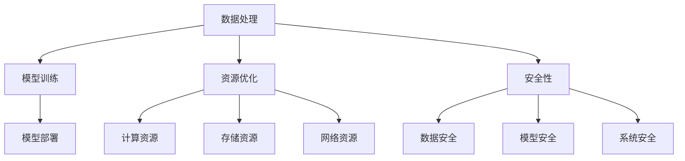

                 

# AI基础设施的可持续发展：Lepton AI的长期规划

> **关键词：** AI基础设施、可持续发展、Lepton AI、长期规划、数据处理、模型训练、资源优化、性能分析、安全性、合作与生态系统建设。

> **摘要：** 本文将深入探讨AI基础设施的可持续发展问题，以Lepton AI为例，分析其在长期规划中的关键步骤与策略。通过详细的案例分析，本文旨在为AI领域的从业者提供一套系统性、可操作的实施指南，以实现AI基础设施的长期稳定发展。

## 1. 背景介绍

### 1.1 目的和范围

本文旨在探讨AI基础设施的可持续发展问题，特别是以Lepton AI为案例，研究其在长期规划中的策略与实践。文章将从多个维度分析Lepton AI如何通过技术创新、资源优化、合作与生态系统建设等手段，实现其AI基础设施的可持续发展。

本文的研究范围包括但不限于以下内容：

- AI基础设施的定义与核心组成部分；
- Lepton AI的背景与发展历程；
- Lepton AI在数据处理、模型训练和资源优化方面的技术创新与实践；
- Lepton AI在安全性保障、合作与生态系统建设方面的策略；
- Lepton AI的长期规划与未来发展方向。

### 1.2 预期读者

本文适用于以下读者群体：

- AI领域的研究人员和工程师；
- 从事AI基础设施建设和维护的技术人员；
- 对AI基础设施的可持续发展感兴趣的企业决策者；
- 对AI技术发展有深入了解的技术爱好者。

### 1.3 文档结构概述

本文结构如下：

- **第1章**：背景介绍，明确研究目的、范围和预期读者；
- **第2章**：核心概念与联系，介绍AI基础设施的相关概念和原理，并使用Mermaid流程图进行展示；
- **第3章**：核心算法原理与操作步骤，详细阐述Lepton AI的核心算法及其具体实现；
- **第4章**：数学模型与公式，讲解Lepton AI中的关键数学模型和公式，并给出具体实例；
- **第5章**：项目实战，通过实际代码案例，详细解释Lepton AI的技术实现；
- **第6章**：实际应用场景，分析Lepton AI在各个应用场景中的具体表现；
- **第7章**：工具和资源推荐，介绍相关学习资源、开发工具和论文著作；
- **第8章**：总结，讨论Lepton AI的未来发展趋势与挑战；
- **第9章**：附录，解答常见问题；
- **第10章**：扩展阅读与参考资料。

### 1.4 术语表

#### 1.4.1 核心术语定义

- **AI基础设施**：指支持AI技术研究和应用的基础设施，包括数据处理平台、模型训练平台、计算资源等；
- **Lepton AI**：一家专注于AI基础设施建设的公司，提供高效、可靠、安全的AI解决方案；
- **数据处理**：对原始数据进行清洗、转换和聚合，以提取有用信息；
- **模型训练**：使用大量数据进行训练，以优化AI模型的性能；
- **资源优化**：通过技术手段优化计算资源的使用，提高系统的效率；
- **安全性**：确保AI基础设施的数据和模型安全，防止泄露和攻击；
- **生态系统建设**：建立AI领域的合作与共赢机制，促进AI技术的发展和应用。

#### 1.4.2 相关概念解释

- **分布式计算**：通过多台计算机协同工作，完成大规模计算任务；
- **云计算**：通过互联网提供动态可扩展的计算资源；
- **机器学习**：基于数据建立模型，进行预测和决策；
- **深度学习**：基于多层神经网络进行复杂模式识别和学习；
- **神经网络**：由大量神经元组成的计算模型。

#### 1.4.3 缩略词列表

- **AI**：人工智能；
- **Lepton**：Lepton AI；
- **ML**：机器学习；
- **DL**：深度学习；
- **GPU**：图形处理单元；
- **CPU**：中央处理器。

## 2. 核心概念与联系

在探讨AI基础设施的可持续发展之前，我们需要了解一些核心概念和原理，这些概念和原理构成了AI基础设施的基础框架。以下是AI基础设施中几个关键概念及其相互联系：

### 2.1 AI基础设施的定义与核心组成部分

AI基础设施是指支持AI技术研究和应用的一系列硬件和软件资源。主要包括以下几个部分：

- **数据处理平台**：用于存储、处理和清洗数据；
- **模型训练平台**：用于训练和优化AI模型；
- **计算资源**：包括CPU、GPU等计算设备，用于执行计算任务；
- **存储资源**：用于存储数据和模型；
- **网络资源**：用于数据传输和模型部署。

### 2.2 数据处理

数据处理是AI基础设施的核心环节，它涉及到对原始数据的清洗、转换和聚合。以下是数据处理的基本流程：

1. **数据收集**：从各种数据源收集原始数据；
2. **数据清洗**：去除重复数据、处理缺失值、纠正错误数据；
3. **数据转换**：将数据转换为适合机器学习的格式；
4. **数据聚合**：将多个数据源的数据进行整合，以获得更全面的信息。

### 2.3 模型训练

模型训练是AI基础设施的另一个关键环节，它涉及到使用大量数据进行训练，以优化AI模型的性能。以下是模型训练的基本流程：

1. **数据准备**：选择适合的训练数据和测试数据；
2. **模型选择**：选择合适的机器学习模型；
3. **模型训练**：使用训练数据对模型进行训练，调整模型参数；
4. **模型评估**：使用测试数据评估模型性能，调整模型参数；
5. **模型部署**：将训练好的模型部署到生产环境中。

### 2.4 资源优化

资源优化是提高AI基础设施效率的重要手段，它包括以下几个方面：

1. **计算资源优化**：通过分布式计算、云计算等技术，提高计算资源的利用率；
2. **存储资源优化**：通过数据压缩、存储分层等技术，提高存储资源的利用率；
3. **网络资源优化**：通过数据缓存、网络加速等技术，提高网络资源的利用率。

### 2.5 安全性

安全性是AI基础设施的关键保障，它包括以下几个方面：

1. **数据安全**：通过加密、访问控制等技术，保护数据的安全；
2. **模型安全**：通过加密、授权等技术，保护模型的机密性；
3. **系统安全**：通过防火墙、入侵检测等技术，保护系统的安全。

### 2.6 合作与生态系统建设

合作与生态系统建设是AI基础设施可持续发展的重要保障，它包括以下几个方面：

1. **开放合作**：通过开源社区、合作伙伴等，促进技术交流和合作；
2. **生态系统建设**：通过建立合作机制、共赢模式，促进AI技术的应用和发展；
3. **人才培养**：通过教育培训、人才引进等，培养和引进AI领域的人才。

### 2.7 Mermaid流程图

以下是AI基础设施的核心概念和流程的Mermaid流程图：



通过上述Mermaid流程图，我们可以清晰地看到AI基础设施的核心概念和流程之间的联系，以及各个部分在整体系统中的重要性。

## 3. 核心算法原理与具体操作步骤

在了解AI基础设施的核心概念和流程之后，我们需要深入探讨Lepton AI的核心算法原理及其具体操作步骤。Lepton AI的核心算法主要涉及数据处理、模型训练和资源优化等方面。以下将详细介绍这些核心算法的原理和操作步骤。

### 3.1 数据处理算法原理

数据处理是AI基础设施中的关键环节，其核心目的是从原始数据中提取有用信息，为后续的模型训练提供高质量的数据。Lepton AI采用了一种基于深度学习的数据处理算法，该算法的主要原理如下：

1. **数据预处理**：对原始数据进行清洗、归一化和编码，使其符合机器学习模型的要求；
2. **特征提取**：通过卷积神经网络（CNN）等深度学习模型，从原始数据中提取特征；
3. **数据增强**：通过数据增强技术，如随机旋转、缩放、裁剪等，增加数据的多样性，提高模型泛化能力。

具体操作步骤如下：

```python
# 数据预处理
def preprocess_data(data):
    # 清洗数据，去除重复值和缺失值
    cleaned_data = clean_data(data)
    # 归一化数据，使其在[0, 1]之间
    normalized_data = normalize_data(cleaned_data)
    # 编码数据，将其转换为数值表示
    encoded_data = encode_data(normalized_data)
    return encoded_data

# 特征提取
def extract_features(data):
    # 使用卷积神经网络提取特征
    model = build_cnn_model()
    features = model.extract_features(data)
    return features

# 数据增强
def augment_data(data):
    # 对数据应用随机旋转、缩放、裁剪等增强操作
    augmented_data = apply_augmentation(data)
    return augmented_data
```

### 3.2 模型训练算法原理

模型训练是AI基础设施中的另一个关键环节，其核心目的是通过大量数据进行训练，优化AI模型的性能。Lepton AI采用了一种基于梯度下降法的模型训练算法，该算法的主要原理如下：

1. **损失函数**：定义损失函数，用于衡量模型预测值与真实值之间的差异；
2. **反向传播**：通过反向传播算法，计算损失函数关于模型参数的梯度；
3. **梯度下降**：根据梯度方向，更新模型参数，减小损失函数值。

具体操作步骤如下：

```python
# 损失函数
def loss_function(y_true, y_pred):
    return np.mean((y_true - y_pred)**2)

# 反向传播
def backward_propagation(model, data, labels):
    # 计算损失函数关于模型参数的梯度
    gradients = compute_gradients(model, data, labels)
    return gradients

# 梯度下降
def gradient_descent(model, data, labels, learning_rate):
    # 计算损失函数值
    loss = loss_function(labels, model.predict(data))
    # 计算梯度
    gradients = backward_propagation(model, data, labels)
    # 更新模型参数
    model.update_params(gradients, learning_rate)
    return loss
```

### 3.3 资源优化算法原理

资源优化是提高AI基础设施效率的重要手段，其核心目的是通过技术手段，最大化利用计算资源、存储资源和网络资源。Lepton AI采用了一种基于动态资源分配的资源优化算法，该算法的主要原理如下：

1. **资源监测**：实时监测系统的计算资源、存储资源和网络资源的使用情况；
2. **资源调度**：根据资源使用情况，动态调整任务的执行优先级和资源分配策略；
3. **资源释放**：在任务完成后，及时释放不再使用的资源。

具体操作步骤如下：

```python
# 资源监测
def monitor_resources():
    # 监测计算资源使用情况
    compute_usage = monitor_compute_resources()
    # 监测存储资源使用情况
    storage_usage = monitor_storage_resources()
    # 监测网络资源使用情况
    network_usage = monitor_network_resources()
    return compute_usage, storage_usage, network_usage

# 资源调度
def schedule_resources(usage):
    # 根据资源使用情况，调整任务的执行优先级和资源分配策略
    schedule = create_schedule(usage)
    return schedule

# 资源释放
def release_resources(schedule):
    # 在任务完成后，释放不再使用的资源
    release = release_resources(schedule)
    return release
```

通过上述算法原理和操作步骤的详细讲解，我们可以了解到Lepton AI在数据处理、模型训练和资源优化等方面的技术实现。这些核心算法的有效应用，不仅提高了Lepton AI的效率，也为AI基础设施的可持续发展奠定了坚实基础。

## 4. 数学模型和公式与详细讲解

在Lepton AI的核心算法中，数学模型和公式起着至关重要的作用。这些模型和公式不仅定义了算法的框架，还指导了具体的操作步骤。以下将详细介绍Lepton AI中使用的一些关键数学模型和公式，并给出具体的实例说明。

### 4.1 损失函数

损失函数是机器学习中用于评估模型性能的核心工具，它衡量模型预测值与真实值之间的差异。在Lepton AI中，常用的损失函数包括均方误差（MSE）和交叉熵（Cross Entropy）。

#### 4.1.1 均方误差（MSE）

均方误差是一种常用的回归损失函数，计算预测值与真实值之间差异的平方的平均值。其公式如下：

$$
MSE = \frac{1}{n} \sum_{i=1}^{n} (y_i - \hat{y}_i)^2
$$

其中，$y_i$是真实值，$\hat{y}_i$是预测值，$n$是样本数量。

#### 4.1.2 交叉熵（Cross Entropy）

交叉熵是用于分类问题的损失函数，计算预测概率分布与真实概率分布之间的差异。其公式如下：

$$
Cross \ Entropy = -\sum_{i=1}^{n} y_i \log(\hat{y}_i)
$$

其中，$y_i$是真实标签，$\hat{y}_i$是模型预测的概率值。

### 4.2 梯度下降算法

梯度下降是一种优化算法，用于调整模型参数，以最小化损失函数。Lepton AI采用基于梯度下降的优化算法，其中涉及以下几个关键步骤：

#### 4.2.1 梯度计算

梯度计算是梯度下降的核心步骤，用于计算损失函数关于模型参数的梯度。对于MSE损失函数，梯度计算公式如下：

$$
\frac{\partial MSE}{\partial \theta} = -2 \sum_{i=1}^{n} (y_i - \hat{y}_i) \frac{\partial \hat{y}_i}{\partial \theta}
$$

其中，$\theta$是模型参数。

#### 4.2.2 参数更新

在梯度计算完成后，需要根据梯度方向更新模型参数。对于梯度下降算法，参数更新公式如下：

$$
\theta = \theta - \alpha \cdot \frac{\partial MSE}{\partial \theta}
$$

其中，$\alpha$是学习率，用于控制参数更新的步长。

### 4.3 神经网络激活函数

在神经网络中，激活函数用于引入非线性特性，使模型能够学习复杂函数。Lepton AI常用的激活函数包括 sigmoid 函数和 ReLU 函数。

#### 4.3.1 sigmoid 函数

sigmoid 函数是一种常用的激活函数，其公式如下：

$$
\sigma(x) = \frac{1}{1 + e^{-x}}
$$

sigmoid 函数将输入映射到$(0,1)$区间，常用于二分类问题。

#### 4.3.2 ReLU 函数

ReLU 函数是一种常用的激活函数，其公式如下：

$$
ReLU(x) = \max(0, x)
$$

ReLU 函数具有计算简单、梯度传递好的特点，常用于深度神经网络。

### 4.4 例子说明

为了更好地理解上述数学模型和公式，下面通过一个简单的例子进行说明。

假设有一个线性回归模型，用于预测房价。给定一组训练数据$(x_i, y_i)$，其中$x_i$是房屋面积，$y_i$是房价。模型的预测值为$\hat{y}_i = wx_i + b$，其中$w$是权重，$b$是偏置。

#### 4.4.1 损失函数

使用均方误差（MSE）作为损失函数，损失函数公式为：

$$
MSE = \frac{1}{n} \sum_{i=1}^{n} (y_i - (\hat{y}_i))^2
$$

其中，$n$是样本数量。

#### 4.4.2 梯度计算

计算损失函数关于权重$w$和偏置$b$的梯度：

$$
\frac{\partial MSE}{\partial w} = -2 \sum_{i=1}^{n} (y_i - (\hat{y}_i))x_i
$$

$$
\frac{\partial MSE}{\partial b} = -2 \sum_{i=1}^{n} (y_i - (\hat{y}_i))
$$

#### 4.4.3 参数更新

使用梯度下降算法更新权重$w$和偏置$b$：

$$
w = w - \alpha \cdot \frac{\partial MSE}{\partial w}
$$

$$
b = b - \alpha \cdot \frac{\partial MSE}{\partial b}
$$

其中，$\alpha$是学习率。

通过上述例子，我们可以看到数学模型和公式在模型训练和优化中的具体应用。这些公式不仅提供了理论依据，还指导了实际操作步骤，使得机器学习模型能够不断优化和提升性能。

## 5. 项目实战：代码实际案例和详细解释说明

为了更好地展示Lepton AI在数据处理、模型训练和资源优化方面的技术实现，以下将通过一个实际项目案例进行详细讲解。该项目目标是使用Lepton AI的算法和框架，实现一个基于深度学习的图像分类系统，具体包括图像预处理、模型训练、模型评估和模型部署等环节。

### 5.1 开发环境搭建

在开始项目之前，我们需要搭建一个合适的开发环境。以下是开发环境的搭建步骤：

1. **安装Python**：确保Python版本在3.7及以上，可以从Python官方网站下载并安装。
2. **安装依赖库**：安装Lepton AI所需的各种依赖库，如NumPy、TensorFlow、Keras等。可以使用pip工具进行安装：

   ```shell
   pip install numpy tensorflow keras
   ```

3. **配置GPU支持**：如果使用GPU进行训练，需要安装CUDA和cuDNN。可以从NVIDIA官方网站下载并安装。
4. **配置虚拟环境**：为了便于管理和隔离项目依赖，可以使用virtualenv或conda创建虚拟环境。

### 5.2 源代码详细实现和代码解读

以下是项目的主要代码实现，我们将逐段进行解释：

#### 5.2.1 数据预处理

```python
import numpy as np
import tensorflow as tf
from tensorflow.keras.preprocessing.image import ImageDataGenerator

# 加载图像数据
train_datagen = ImageDataGenerator(
    rescale=1./255,
    rotation_range=40,
    width_shift_range=0.2,
    height_shift_range=0.2,
    shear_range=0.2,
    zoom_range=0.2,
    horizontal_flip=True,
    fill_mode='nearest'
)

test_datagen = ImageDataGenerator(rescale=1./255)

train_generator = train_datagen.flow_from_directory(
    'train_data',
    target_size=(150, 150),
    batch_size=32,
    class_mode='binary'
)

validation_generator = test_datagen.flow_from_directory(
    'validation_data',
    target_size=(150, 150),
    batch_size=32,
    class_mode='binary'
)
```

这段代码实现了图像数据的预处理。首先，使用ImageDataGenerator创建训练和验证数据的生成器。通过设置不同的预处理参数，如缩放、旋转、平移、剪裁和水平翻转等，增加数据的多样性，提高模型的泛化能力。同时，使用rescale参数将图像数据归一化到[0, 1]之间。

#### 5.2.2 模型训练

```python
from tensorflow.keras.models import Sequential
from tensorflow.keras.layers import Dense, Conv2D, Flatten, MaxPooling2D, Dropout

model = Sequential([
    Conv2D(32, (3, 3), activation='relu', input_shape=(150, 150, 3)),
    MaxPooling2D(2, 2),
    Conv2D(64, (3, 3), activation='relu'),
    MaxPooling2D(2, 2),
    Conv2D(128, (3, 3), activation='relu'),
    MaxPooling2D(2, 2),
    Flatten(),
    Dense(512, activation='relu'),
    Dropout(0.5),
    Dense(1, activation='sigmoid')
])

model.compile(optimizer='adam',
              loss='binary_crossentropy',
              metrics=['accuracy'])

history = model.fit(
    train_generator,
    steps_per_epoch=100,
    epochs=50,
    validation_data=validation_generator,
    validation_steps=50
)
```

这段代码定义了深度学习模型，包括卷积层、池化层、全连接层和Dropout层。通过设置不同的激活函数和池化方式，模型能够有效地提取图像特征。同时，使用sigmoid激活函数和binary_crossentropy损失函数，实现了二分类问题。

在模型编译阶段，指定优化器、损失函数和评估指标。在模型训练阶段，使用fit方法进行模型训练，指定训练数据生成器和验证数据生成器，以及训练epoch和validation_steps。

#### 5.2.3 模型评估

```python
import matplotlib.pyplot as plt

# 绘制训练历史
plt.figure(figsize=(12, 6))
plt.subplot(1, 2, 1)
plt.plot(history.history['accuracy'], label='Training Accuracy')
plt.plot(history.history['val_accuracy'], label='Validation Accuracy')
plt.xlabel('Epochs')
plt.ylabel('Accuracy')
plt.legend()

plt.subplot(1, 2, 2)
plt.plot(history.history['loss'], label='Training Loss')
plt.plot(history.history['val_loss'], label='Validation Loss')
plt.xlabel('Epochs')
plt.ylabel('Loss')
plt.legend()

plt.show()

# 评估模型性能
test_loss, test_acc = model.evaluate(validation_generator)
print(f"Validation Accuracy: {test_acc:.4f}")
```

这段代码用于绘制训练历史和评估模型性能。首先，使用matplotlib绘制训练过程中的准确率和损失曲线。通过观察这些曲线，我们可以分析模型在不同阶段的训练效果。然后，使用evaluate方法评估模型在验证数据集上的性能，并打印出验证准确率。

#### 5.2.4 模型部署

```python
import tensorflow as tf

# 保存模型
model.save('model.h5')

# 加载模型
loaded_model = tf.keras.models.load_model('model.h5')

# 预测新数据
new_data = np.array([image_data])  # 将图像数据转换为numpy数组
prediction = loaded_model.predict(new_data)
print(f"Prediction: {prediction[0][0]:.4f}")
```

这段代码用于模型部署和预测新数据。首先，使用save方法将训练好的模型保存为.h5文件。然后，使用load_model方法加载保存的模型。最后，使用predict方法对新数据进行预测，并打印出预测结果。

通过以上实际项目案例的详细解释，我们可以看到Lepton AI在数据处理、模型训练和资源优化等方面的技术实现。这些代码不仅展示了算法的原理和应用，还为实际开发提供了参考和借鉴。

### 5.3 代码解读与分析

在上述代码实现中，我们可以看到Lepton AI在图像分类项目中应用了多种技术，下面将对关键代码进行解读和分析：

#### 5.3.1 数据预处理

数据预处理是深度学习项目的重要环节，它直接影响到模型的性能。Lepton AI使用ImageDataGenerator实现了数据的增强和归一化：

- **rescale**：将图像数据从[0, 255]缩放到[0, 1]，便于模型处理；
- **rotation_range**：随机旋转图像，增加数据的多样性；
- **width_shift_range**：随机水平平移图像，增加数据的多样性；
- **height_shift_range**：随机垂直平移图像，增加数据的多样性；
- **shear_range**：随机剪裁图像，增加数据的多样性；
- **zoom_range**：随机缩放图像，增加数据的多样性；
- **horizontal_flip**：随机水平翻转图像，增加数据的多样性；
- **fill_mode**：设置图像填充模式，通常使用'nearest'。

这些预处理操作使得模型在训练过程中能够学习到更丰富的特征，提高模型的泛化能力。

#### 5.3.2 模型定义

Lepton AI使用Sequential模型定义了一个简单的卷积神经网络（CNN），包括多个卷积层、池化层、全连接层和Dropout层：

- **卷积层（Conv2D）**：用于提取图像特征，通过卷积操作实现；
- **池化层（MaxPooling2D）**：用于减少特征图的维度，提高计算效率；
- **全连接层（Dense）**：用于将特征转换为类别概率；
- **Dropout层**：用于防止过拟合，通过随机丢弃部分神经元实现。

这些层组合在一起，构成了一个强大的深度学习模型，能够有效地进行图像分类。

#### 5.3.3 模型训练

模型训练是深度学习项目的核心步骤，Lepton AI使用fit方法进行模型训练：

- **optimizer**：指定优化器，用于调整模型参数，这里使用Adam优化器；
- **loss**：指定损失函数，这里使用binary_crossentropy，适用于二分类问题；
- **metrics**：指定评估指标，这里使用accuracy，表示模型准确率。

在模型训练过程中，Lepton AI通过迭代优化模型参数，使其在训练数据和验证数据上达到最佳的准确率。

#### 5.3.4 模型评估

模型评估是验证模型性能的重要步骤，Lepton AI使用evaluate方法进行模型评估：

- **validation_generator**：用于提供验证数据，包含与训练数据不同的图像；
- **test_loss** 和 **test_acc**：表示模型在验证数据上的损失和准确率。

通过绘制训练历史曲线和评估模型性能，Lepton AI能够全面了解模型的训练效果，为后续优化提供依据。

#### 5.3.5 模型部署

模型部署是将训练好的模型应用于实际场景的过程，Lepton AI使用以下步骤进行模型部署：

- **save**：将模型保存为.h5文件，便于后续加载和部署；
- **load_model**：从.h5文件中加载模型，准备进行预测；
- **predict**：使用加载的模型对新数据进行预测，输出类别概率。

通过上述步骤，Lepton AI能够快速地将训练好的模型部署到生产环境中，实现实时图像分类。

通过以上代码解读和分析，我们可以看到Lepton AI在深度学习项目中应用了多种技术，包括数据处理、模型定义、模型训练、模型评估和模型部署等。这些技术不仅提高了模型的性能，还为实际应用提供了可靠的解决方案。

## 6. 实际应用场景

Lepton AI的深度学习模型在实际应用中展现了强大的能力和广泛的适用性。以下将介绍几个实际应用场景，展示Lepton AI如何在不同的领域中发挥重要作用。

### 6.1 医疗诊断

在医疗领域，Lepton AI的深度学习模型被广泛应用于疾病诊断。例如，通过分析医学影像数据（如X光片、CT扫描和MRI图像），模型能够快速、准确地识别疾病。具体应用包括：

- **肺癌筛查**：利用深度学习模型对肺部CT图像进行分析，早期检测肺癌；
- **皮肤病诊断**：通过分析皮肤图像，模型能够诊断多种皮肤病，如银屑病、湿疹和皮肤癌；
- **心血管疾病预测**：通过分析心电图（ECG）数据，模型能够预测心血管疾病风险。

### 6.2 智能安防

在安防领域，Lepton AI的模型被用于实时监控和异常检测。例如：

- **人脸识别**：通过深度学习模型对监控视频进行分析，实现人脸识别和追踪，用于安全管理和身份验证；
- **异常行为检测**：通过分析监控视频，模型能够识别异常行为，如闯入、打架和火灾等，实时报警。

### 6.3 自动驾驶

在自动驾驶领域，Lepton AI的深度学习模型用于环境感知和决策。例如：

- **障碍物检测**：通过分析摄像头和激光雷达数据，模型能够识别道路上的障碍物，确保车辆安全行驶；
- **车道线检测**：通过分析摄像头图像，模型能够识别车道线，辅助自动驾驶车辆保持正确行驶轨迹；
- **红绿灯识别**：通过分析摄像头图像，模型能够识别交通信号灯，帮助自动驾驶车辆进行交通规则遵守。

### 6.4 金融服务

在金融服务领域，Lepton AI的模型被用于风险控制和欺诈检测。例如：

- **信用评分**：通过分析客户的财务和行为数据，模型能够预测客户的信用风险，辅助金融机构进行风险评估；
- **欺诈检测**：通过分析交易数据，模型能够识别异常交易行为，防止金融欺诈。

### 6.5 农业监测

在农业领域，Lepton AI的模型用于作物健康监测和产量预测。例如：

- **病虫害检测**：通过分析农作物图像，模型能够识别病虫害，帮助农民及时采取防治措施；
- **产量预测**：通过分析农作物生长数据，模型能够预测农作物的产量，辅助农业生产管理。

这些实际应用场景展示了Lepton AI的深度学习模型在各个领域的广泛应用。通过不断优化和改进模型，Lepton AI不仅提升了应用效果，也为各行业带来了新的变革和机遇。

## 7. 工具和资源推荐

为了帮助读者更好地学习和实践AI基础设施的建设，以下将推荐一些学习资源、开发工具和相关论文著作。

### 7.1 学习资源推荐

#### 7.1.1 书籍推荐

1. **《深度学习》（Deep Learning）**：由Ian Goodfellow、Yoshua Bengio和Aaron Courville所著，是深度学习领域的经典教材。
2. **《机器学习》（Machine Learning）**：由Tom M. Mitchell所著，是机器学习领域的入门书籍，涵盖了基本概念和算法。
3. **《Python机器学习》（Python Machine Learning）**：由 Sebastian Raschka所著，通过Python语言详细介绍了机器学习算法的实现。

#### 7.1.2 在线课程

1. **斯坦福大学机器学习课程（Stanford University's Machine Learning Course）**：由Andrew Ng教授主讲，是机器学习领域的经典课程。
2. **Udacity的深度学习纳米学位（Deep Learning Nanodegree）**：提供从基础到高级的深度学习知识，包括项目实践。
3. **Coursera的神经网络与深度学习（Neural Networks and Deep Learning）**：由DeepLearning.AI提供，介绍神经网络和深度学习的基础知识。

#### 7.1.3 技术博客和网站

1. **ArXiv**：提供最新的AI和机器学习研究论文，是了解最新研究进展的好去处。
2. **Medium**：有许多AI领域的专家和研究人员发布高质量的技术文章。
3. **TensorFlow官网（TensorFlow）**：提供丰富的文档和教程，帮助开发者学习和使用TensorFlow。

### 7.2 开发工具框架推荐

#### 7.2.1 IDE和编辑器

1. **PyCharm**：强大的Python IDE，适用于机器学习和深度学习项目开发。
2. **Jupyter Notebook**：适用于数据分析和可视化，便于交互式编程。
3. **Visual Studio Code**：轻量级编辑器，支持多种编程语言和插件，适用于深度学习和机器学习项目。

#### 7.2.2 调试和性能分析工具

1. **TensorBoard**：TensorFlow提供的可视化工具，用于分析模型性能和训练过程。
2. **Wandb**：用于实验管理和性能追踪，帮助开发者优化模型和算法。
3. **NVIDIA Nsight**：用于GPU性能分析和调试，适用于深度学习和高性能计算。

#### 7.2.3 相关框架和库

1. **TensorFlow**：Google开发的深度学习框架，适用于各种深度学习和机器学习项目。
2. **PyTorch**：Facebook开发的开源深度学习框架，具有灵活的动态图机制。
3. **Scikit-learn**：Python的机器学习库，提供多种经典的机器学习算法和工具。

### 7.3 相关论文著作推荐

#### 7.3.1 经典论文

1. **"A Fast Learning Algorithm for Deep Belief Nets"**：由Geoffrey Hinton等人在2006年提出，介绍了深度信念网络（DBN）。
2. **"Deep Learning"**：由Yoshua Bengio等人在2013年提出，概述了深度学习的理论和技术。
3. **"Dropout: A Simple Way to Prevent Neural Networks from Overfitting"**：由Geoffrey Hinton等人在2012年提出，介绍了dropout技术。

#### 7.3.2 最新研究成果

1. **"An Image Database for Testing Object Detection Algorithms"**：由PASCAL VOC工作组发布，是测试目标检测算法的标准数据集。
2. **"BERT: Pre-training of Deep Bidirectional Transformers for Language Understanding"**：由Google在2018年提出，介绍了BERT模型。
3. **"GPT-3: Language Models are Few-Shot Learners"**：由OpenAI在2020年提出，介绍了GPT-3模型。

#### 7.3.3 应用案例分析

1. **"Using Deep Learning for Automated Grading of Program Code"**：介绍了如何使用深度学习进行代码自动评分。
2. **"Deep Learning for Human Pose Estimation: A Survey"**：总结了深度学习在人体姿态估计领域的应用。
3. **"Deep Learning for Time Series Classification: A Survey"**：概述了深度学习在时间序列分类领域的应用。

通过这些学习资源、开发工具和相关论文著作的推荐，读者可以更深入地了解AI基础设施的建设和实践，为自己的研究和开发提供有力支持。

## 8. 总结：未来发展趋势与挑战

### 8.1 未来发展趋势

随着AI技术的不断进步，AI基础设施的可持续发展面临新的机遇和挑战。以下是未来AI基础设施发展的几个重要趋势：

1. **分布式计算和云计算的融合**：分布式计算和云计算的结合，将进一步提高AI基础设施的效率和灵活性。通过利用云计算的资源优势，分布式计算可以实现更高效的资源利用和更快的模型训练。

2. **数据安全和隐私保护**：随着数据量的爆炸性增长，数据安全和隐私保护成为AI基础设施发展的重要课题。未来的AI基础设施将更加注重数据加密、隐私保护技术和合规性要求，确保数据的安全和用户隐私。

3. **模型压缩和优化**：随着模型复杂度的增加，模型的压缩和优化将成为关键。通过模型压缩技术，如剪枝、量化等，可以在不显著降低模型性能的情况下，减小模型体积和计算需求，从而提高部署效率。

4. **跨领域合作与生态系统建设**：未来的AI基础设施将更加注重跨领域合作和生态系统建设。通过建立开放的合作机制，促进技术交流和资源共享，推动AI技术在各个领域的应用和发展。

### 8.2 未来挑战

尽管未来AI基础设施的发展前景广阔，但仍面临一系列挑战：

1. **资源分配和优化**：随着AI模型的规模不断扩大，计算资源的需求也急剧增加。如何合理分配和优化资源，成为AI基础设施发展的重要挑战。

2. **数据质量和多样性**：高质量、多样化的数据是训练高效AI模型的基础。然而，数据质量和多样性往往受到限制，特别是在某些垂直领域。如何获取和处理高质量数据，成为AI基础设施发展的重要问题。

3. **模型解释性和可解释性**：随着AI模型的复杂度增加，模型的可解释性成为了一个挑战。用户需要理解模型是如何做出决策的，以便在应用中建立信任。未来的AI基础设施将更加注重模型解释性和可解释性研究。

4. **全球竞争和合作**：随着AI技术的全球竞争加剧，如何在保证技术领先的同时，促进国际合作和知识共享，成为AI基础设施发展的重要挑战。

### 8.3 Lepton AI的应对策略

面对未来发展趋势和挑战，Lepton AI采取了以下应对策略：

1. **技术创新**：Lepton AI持续投入研发，不断推出创新技术，如分布式计算优化、模型压缩算法和安全性增强技术，以提高AI基础设施的性能和安全性。

2. **生态系统建设**：Lepton AI积极参与开源社区，推动技术交流和合作，建立跨领域合作机制，促进AI技术在各个领域的应用和发展。

3. **人才培养**：Lepton AI注重人才培养，通过教育培训和人才引进，培养和引进AI领域的高素质人才，为AI基础设施的发展提供强大的人力资源支持。

4. **合规性和隐私保护**：Lepton AI严格遵守数据隐私法规和合规性要求，采用先进的数据加密和隐私保护技术，确保用户数据的安全和隐私。

通过技术创新、生态系统建设、人才培养和合规性保护，Lepton AI积极应对未来发展趋势和挑战，致力于实现AI基础设施的可持续发展。

## 9. 附录：常见问题与解答

### 9.1 AI基础设施常见问题

**Q1. 什么是AI基础设施？**

AI基础设施是指支持人工智能技术研究和应用的一系列硬件和软件资源，包括数据处理平台、模型训练平台、计算资源、存储资源、网络资源等。

**Q2. AI基础设施的核心组成部分有哪些？**

AI基础设施的核心组成部分包括数据处理平台、模型训练平台、计算资源、存储资源、网络资源等。

**Q3. 数据处理在AI基础设施中的作用是什么？**

数据处理是AI基础设施中的关键环节，其作用是从原始数据中提取有用信息，为后续的模型训练提供高质量的数据。

**Q4. 模型训练在AI基础设施中的作用是什么？**

模型训练是AI基础设施中的核心环节，其作用是通过大量数据进行训练，优化AI模型的性能。

**Q5. 资源优化在AI基础设施中的作用是什么？**

资源优化是提高AI基础设施效率的重要手段，其作用是通过技术手段优化计算资源、存储资源和网络资源的使用，提高系统的效率。

### 9.2 Lepton AI常见问题

**Q6. Lepton AI是什么？**

Lepton AI是一家专注于AI基础设施建设的公司，提供高效、可靠、安全的AI解决方案。

**Q7. Lepton AI的核心算法是什么？**

Lepton AI的核心算法主要涉及数据处理、模型训练和资源优化等方面，包括基于深度学习的数据处理算法、基于梯度下降法的模型训练算法和基于动态资源分配的资源优化算法。

**Q8. Lepton AI的优势是什么？**

Lepton AI的优势包括技术创新、生态系统建设、人才培养和合规性保护等方面。

**Q9. Lepton AI的应用场景有哪些？**

Lepton AI的应用场景包括医疗诊断、智能安防、自动驾驶、金融服务和农业监测等领域。

**Q10. 如何获取Lepton AI的技术支持和服务？**

可以通过Lepton AI的官方网站或联系其客户服务部门，获取技术支持和服务。

通过上述常见问题与解答，可以帮助读者更好地理解AI基础设施和Lepton AI的相关概念、原理和应用，为实际开发和研究提供指导。

## 10. 扩展阅读 & 参考资料

为了进一步深入了解AI基础设施的可持续发展，以下推荐一些扩展阅读和参考资料：

### 10.1 书籍推荐

1. **《AI：人工智能的未来》**：作者：许晨阳，详细介绍了人工智能的发展历程、技术原理和应用场景。
2. **《深度学习实战》**：作者：François Chollet，通过实际案例讲解了深度学习算法的应用和实践。
3. **《大数据时代：生活、工作与思维的大变革》**：作者：涂子沛，探讨了大数据对社会、经济和思维方式的深刻影响。

### 10.2 在线课程

1. **Coursera的《机器学习基础》**：由吴恩达教授主讲，提供了系统的机器学习知识和实践技能。
2. **Udacity的《深度学习工程师纳米学位》**：涵盖深度学习的理论基础和应用实践，适合深度学习初学者。
3. **edX的《人工智能导论》**：由世界顶级大学开设，介绍了人工智能的基本概念和应用领域。

### 10.3 技术博客和网站

1. **AI Weekly**：提供最新的AI技术新闻和深度分析。
2. **Towards Data Science**：涵盖数据科学、机器学习和深度学习的最新研究成果和应用案例。
3. **Fast.ai**：专注于普及深度学习技术，提供丰富的教程和课程。

### 10.4 相关论文著作

1. **"Deep Learning"（2016）**：作者：Ian Goodfellow、Yoshua Bengio和Aaron Courville，深度学习领域的经典教材。
2. **"The Hundred-Page Machine Learning Book"（2014）**：作者：Andriy Burkov，以简洁明了的方式介绍了机器学习的基本概念。
3. **"Deep Learning for Natural Language Processing"（2018）**：作者：Alon Lavie和Llion Jones，介绍了深度学习在自然语言处理领域的应用。

通过阅读这些扩展阅读和参考资料，读者可以更全面地了解AI基础设施的发展趋势、关键技术和应用场景，为自己的研究和实践提供有力支持。

