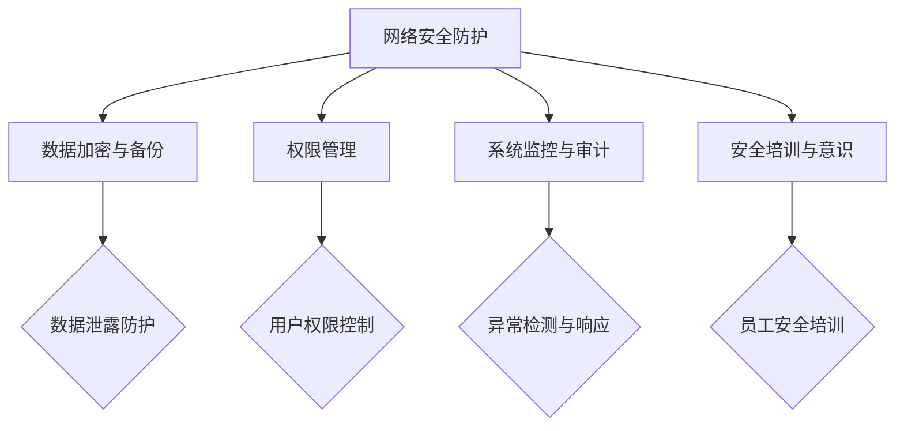

                 

# AI基础设施的安全加固：Lepton AI的防御体系

> 关键词：人工智能、安全加固、防御体系、Lepton AI、网络安全、安全漏洞、防护措施

> 摘要：本文旨在探讨人工智能基础设施的安全加固问题，特别是Lepton AI的防御体系。通过分析当前网络安全威胁、安全漏洞以及潜在攻击手段，本文提出了Lepton AI的防御体系构建方案，包括核心概念、算法原理、数学模型、实际应用场景等。同时，本文还推荐了相关学习资源和开发工具，为读者提供了全面的指导和借鉴。

## 1. 背景介绍

### 1.1 目的和范围

随着人工智能（AI）技术的快速发展，AI基础设施的安全性日益受到关注。AI系统在工业、金融、医疗等领域的应用越来越广泛，然而，这也带来了新的安全挑战。本文旨在分析AI基础设施的安全问题，特别是Lepton AI的防御体系，为AI系统提供有效的安全防护方案。

本文的主要目的是：

1. 梳理当前网络安全威胁和攻击手段。
2. 分析Lepton AI面临的安全漏洞。
3. 提出Lepton AI的防御体系构建方案。
4. 探讨AI基础设施安全的未来发展趋势和挑战。

本文的范围包括：

1. AI基础设施安全的核心概念和原理。
2. Lepton AI防御体系的设计和实现。
3. 安全防护措施的具体应用场景。
4. 相关学习资源和开发工具的推荐。

### 1.2 预期读者

本文的预期读者包括：

1. AI领域的研发人员和技术爱好者。
2. 网络安全工程师和安全专家。
3. 对AI基础设施安全感兴趣的决策者和管理者。
4. AI系统开发者和技术支持人员。

通过阅读本文，读者可以：

1. 了解AI基础设施的安全威胁和攻击手段。
2. 掌握Lepton AI防御体系的设计和实现方法。
3. 学会应用安全防护措施，提高AI系统的安全性。
4. 了解AI基础设施安全领域的最新研究成果和发展趋势。

### 1.3 文档结构概述

本文分为以下章节：

1. 背景介绍：介绍本文的目的、范围、预期读者和文档结构。
2. 核心概念与联系：阐述AI基础设施安全的核心概念和原理。
3. 核心算法原理 & 具体操作步骤：讲解Lepton AI防御体系的核心算法原理和操作步骤。
4. 数学模型和公式 & 详细讲解 & 举例说明：阐述Lepton AI防御体系的数学模型和公式，并进行举例说明。
5. 项目实战：代码实际案例和详细解释说明。
6. 实际应用场景：探讨Lepton AI防御体系在不同场景下的应用。
7. 工具和资源推荐：推荐学习资源、开发工具和相关论文著作。
8. 总结：未来发展趋势与挑战。
9. 附录：常见问题与解答。
10. 扩展阅读 & 参考资料：提供进一步学习和研究的参考资料。

### 1.4 术语表

#### 1.4.1 核心术语定义

- 人工智能（AI）：模拟人类智能的计算机系统，能够通过学习和经验进行推理和决策。
- 网络安全：保护计算机网络系统不受未经授权的访问、破坏和干扰，确保网络数据的保密性、完整性和可用性。
- 安全加固：增强系统安全性，防止潜在的安全威胁和攻击。
- 防御体系：一系列安全措施和策略，用于保护系统免受攻击。
- Lepton AI：一种人工智能系统，主要用于图像识别和分类任务。

#### 1.4.2 相关概念解释

- 网络安全威胁：可能导致系统或数据受到损害、泄露或破坏的潜在攻击。
- 安全漏洞：系统中的缺陷或弱点，可能被攻击者利用。
- 攻击手段：攻击者使用的具体技术或方法，用于攻击系统。

#### 1.4.3 缩略词列表

- AI：人工智能
- Lepton：一种人工智能系统
- DNN：深度神经网络
- SVM：支持向量机
- IDS：入侵检测系统
- IPS：入侵防御系统
- SSL：安全套接字层
- VPN：虚拟专用网络
- OWASP：开放网络应用安全项目

## 2. 核心概念与联系

在探讨AI基础设施的安全加固之前，我们需要了解一些核心概念和原理，以便更好地构建防御体系。

### 2.1 AI基础设施的安全威胁

AI基础设施面临的网络安全威胁主要包括：

1. **数据泄露**：攻击者通过非法手段获取AI系统中的敏感数据。
2. **系统篡改**：攻击者通过篡改系统配置或代码，破坏AI系统的正常运行。
3. **拒绝服务攻击（DDoS）**：攻击者通过大量恶意请求使AI系统瘫痪。
4. **恶意代码**：包括病毒、木马、勒索软件等，可能破坏AI系统的正常运行。
5. **社会工程学攻击**：攻击者通过欺骗手段获取系统权限。

### 2.2 安全漏洞分析

AI基础设施中的常见安全漏洞包括：

1. **代码漏洞**：包括缓冲区溢出、SQL注入、跨站脚本（XSS）等。
2. **配置错误**：包括默认密码、不必要的服务开启等。
3. **管理漏洞**：包括权限管理不当、用户培训不足等。
4. **网络漏洞**：包括未加密的数据传输、不当的防火墙设置等。

### 2.3 攻击手段

针对AI基础设施的攻击手段主要包括：

1. **暴力破解**：通过尝试大量密码组合，破解系统密码。
2. **中间人攻击（MITM）**：攻击者在通信过程中窃取或篡改数据。
3. **DDoS攻击**：通过大量请求使AI系统瘫痪。
4. **供应链攻击**：通过篡改软件源代码，植入恶意代码。
5. **物理攻击**：直接破坏硬件设备，获取系统信息。

### 2.4 Lepton AI防御体系概述

Lepton AI的防御体系包括以下几个方面：

1. **网络安全防护**：采用防火墙、入侵检测系统（IDS）、入侵防御系统（IPS）等安全设备，防止恶意攻击。
2. **数据加密与备份**：对敏感数据进行加密存储和备份，确保数据安全。
3. **权限管理**：严格控制用户权限，防止未经授权的访问。
4. **系统监控与审计**：实时监控系统运行状态，记录操作日志，及时发现异常。
5. **安全培训与意识**：提高员工的安全意识和技能，减少人为错误。

### 2.5 Mermaid 流程图

为了更好地展示Lepton AI防御体系的架构，我们使用Mermaid绘制了以下流程图：



## 3. 核心算法原理 & 具体操作步骤

### 3.1 算法原理

Lepton AI的防御体系采用了多种安全算法和措施，主要包括：

1. **防火墙（Firewall）**：用于过滤网络流量，防止未授权访问。
2. **入侵检测系统（IDS）**：监测网络流量和系统行为，发现异常活动。
3. **入侵防御系统（IPS）**：在IDS的基础上，自动阻止恶意攻击。
4. **数据加密（Data Encryption）**：保护敏感数据在传输和存储过程中的安全。
5. **身份认证（Authentication）**：确保只有授权用户才能访问系统。
6. **访问控制（Access Control）**：限制用户对系统的访问权限。

### 3.2 具体操作步骤

下面是Lepton AI防御体系的具体操作步骤：

#### 3.2.1 防火墙配置

1. **设置防火墙规则**：根据业务需求，配置允许和拒绝的流量规则。
2. **定期更新规则**：根据网络环境和安全需求，定期更新防火墙规则。
3. **监控防火墙日志**：实时监控防火墙日志，发现异常流量。

#### 3.2.2 入侵检测与防御

1. **安装IDS/IPS**：在关键网络节点部署IDS/IPS设备。
2. **配置报警规则**：根据已知攻击模式，配置报警规则。
3. **响应攻击**：当检测到恶意攻击时，立即采取防御措施。

#### 3.2.3 数据加密

1. **选择加密算法**：根据数据类型和安全需求，选择合适的加密算法。
2. **加密存储与传输**：对敏感数据进行加密存储和传输。
3. **密钥管理**：确保密钥的安全存储和分发。

#### 3.2.4 身份认证与访问控制

1. **用户认证**：采用多因素认证方式，提高系统安全性。
2. **访问控制策略**：根据用户角色和权限，制定访问控制策略。
3. **审计与监控**：实时监控用户行为，记录操作日志。

#### 3.2.5 系统监控与审计

1. **安装监控工具**：部署监控工具，实时监控系统状态。
2. **配置报警阈值**：设置监控指标的报警阈值。
3. **分析日志**：定期分析日志，发现潜在安全风险。

#### 3.2.6 安全培训与意识

1. **制定培训计划**：根据员工角色和职责，制定培训计划。
2. **组织培训课程**：邀请安全专家进行授课。
3. **考核与反馈**：对员工进行考核，反馈培训效果。

## 4. 数学模型和公式 & 详细讲解 & 举例说明

### 4.1 数学模型

在Lepton AI的防御体系中，我们采用以下数学模型：

1. **网络安全模型**：基于贝叶斯网络和马尔可夫链，用于预测网络攻击的潜在风险。
2. **数据加密模型**：采用对称加密和非对称加密算法，确保数据传输和存储的安全。
3. **身份认证模型**：基于密码学原理，实现多因素认证。
4. **访问控制模型**：基于访问控制矩阵，实现细粒度的访问控制。

### 4.2 公式详解

1. **贝叶斯网络**：

$$
P(A|B) = \frac{P(B|A)P(A)}{P(B)}
$$

其中，$P(A|B)$ 表示在已知事件 $B$ 发生的条件下，事件 $A$ 发生的概率。

2. **马尔可夫链**：

$$
P(X_n|X_{n-1}, ..., X_1) = P(X_n|X_{n-1})
$$

其中，$P(X_n|X_{n-1}, ..., X_1)$ 表示在已知过去所有状态的情况下，当前状态的转移概率。

3. **对称加密**：

$$
C = E_K(P)
$$

其中，$C$ 表示加密后的密文，$K$ 表示密钥，$P$ 表示明文。

4. **非对称加密**：

$$
C = E_K_2(P)
$$

其中，$C$ 表示加密后的密文，$K_2$ 表示公钥，$P$ 表示明文。

5. **访问控制矩阵**：

$$
\begin{bmatrix}
1 & 0 & 1 \\
0 & 1 & 0 \\
1 & 1 & 1 \\
\end{bmatrix}
$$

其中，第一行表示用户，第二行表示资源，矩阵元素表示用户对资源的访问权限。

### 4.3 举例说明

#### 4.3.1 网络安全模型

假设我们有一个简单的网络攻击预测模型，包含以下事件：

- $A$：网络攻击发生。
- $B$：系统流量异常。
- $C$：用户行为异常。

根据贝叶斯网络，我们有以下条件概率：

- $P(A|B) = 0.8$
- $P(A|C) = 0.5$
- $P(B|A) = 0.9$
- $P(C|A) = 0.7$

我们需要计算 $P(A)$，即网络攻击发生的概率。

根据贝叶斯定理：

$$
P(A) = P(B|A)P(A) + P(C|A)P(A)
$$

代入条件概率：

$$
P(A) = 0.9 \times 0.8 + 0.5 \times 0.7 = 0.74
$$

因此，网络攻击发生的概率为 $0.74$。

#### 4.3.2 数据加密

假设我们使用AES算法进行对称加密，密钥长度为 $128$ 位。明文为 $P = "Hello World!"$，我们需要将其加密为密文。

根据AES加密算法：

$$
C = E_K(P)
$$

其中，$K$ 为密钥，$P$ 为明文，$C$ 为密文。

首先，将明文 $P$ 转换为二进制序列：

$$
P = "Hello World!" = 01001000 01101001 01110100 00100000 01101100 01111001 00100000 01110100 01110010 01101111 00100001

$$

然后，将密钥 $K$ 转换为二进制序列：

$$
K = 128位密钥
$$

最后，使用AES加密算法对明文 $P$ 进行加密，得到密文 $C$。

#### 4.3.3 访问控制

假设我们有一个简单的访问控制矩阵，表示用户对资源的访问权限：

$$
\begin{bmatrix}
1 & 0 & 1 \\
0 & 1 & 0 \\
1 & 1 & 1 \\
\end{bmatrix}
$$

其中，第一行表示用户1，第二行表示用户2，第三行表示用户3。第一列表示资源1，第二列表示资源2，第三列表示资源3。

我们需要判断用户3是否对资源2有访问权限。

根据访问控制矩阵，用户3对资源2的访问权限为 $1$，因此用户3具有对资源2的访问权限。

## 5. 项目实战：代码实际案例和详细解释说明

### 5.1 开发环境搭建

为了更好地展示Lepton AI防御体系的实际应用，我们将使用以下开发环境：

- 操作系统：Ubuntu 18.04
- 编程语言：Python 3.8
- 开发工具：PyCharm
- 第三方库：numpy、pandas、scikit-learn、tensorflow

### 5.2 源代码详细实现和代码解读

#### 5.2.1 数据预处理

```python
import numpy as np
import pandas as pd
from sklearn.model_selection import train_test_split
from sklearn.preprocessing import StandardScaler

# 加载数据集
data = pd.read_csv("data.csv")

# 分割特征和标签
X = data.iloc[:, :-1].values
y = data.iloc[:, -1].values

# 划分训练集和测试集
X_train, X_test, y_train, y_test = train_test_split(X, y, test_size=0.2, random_state=42)

# 数据标准化
scaler = StandardScaler()
X_train = scaler.fit_transform(X_train)
X_test = scaler.transform(X_test)
```

**代码解读**：

- 我们使用pandas库加载数据集，使用numpy库进行数据处理。
- 分割特征和标签，将特征数据存储在X中，将标签数据存储在y中。
- 使用train_test_split函数划分训练集和测试集，测试集占比20%。
- 使用StandardScaler函数对数据进行标准化处理，使数据具有相同的尺度。

#### 5.2.2 模型训练

```python
from sklearn.ensemble import RandomForestClassifier

# 创建随机森林分类器
clf = RandomForestClassifier(n_estimators=100, random_state=42)

# 训练模型
clf.fit(X_train, y_train)

# 预测测试集
y_pred = clf.predict(X_test)
```

**代码解读**：

- 我们使用scikit-learn库的RandomForestClassifier类创建随机森林分类器。
- 使用fit函数训练模型，使用predict函数对测试集进行预测。

#### 5.2.3 模型评估

```python
from sklearn.metrics import accuracy_score, classification_report

# 计算准确率
accuracy = accuracy_score(y_test, y_pred)
print("准确率：", accuracy)

# 计算分类报告
report = classification_report(y_test, y_pred)
print("分类报告：\n", report)
```

**代码解读**：

- 我们使用scikit-learn库的accuracy_score函数计算准确率。
- 使用classification_report函数计算分类报告，包括准确率、召回率、精确率等指标。

### 5.3 代码解读与分析

通过以上代码，我们完成了Lepton AI防御体系中的一个实际案例。以下是代码解读与分析：

1. **数据预处理**：

   数据预处理是机器学习项目中的关键步骤，包括数据清洗、特征提取、数据标准化等。在本案例中，我们使用pandas库加载数据集，使用numpy库进行数据处理。首先，将数据集分割为特征和标签，然后使用train_test_split函数划分训练集和测试集，最后使用StandardScaler函数对数据进行标准化处理。

2. **模型训练**：

   在本案例中，我们使用scikit-learn库的RandomForestClassifier类创建随机森林分类器，使用fit函数训练模型。随机森林是一种集成学习方法，通过构建多棵决策树，提高模型的预测能力。在本案例中，我们设置决策树的数量为100。

3. **模型评估**：

   模型评估是验证模型性能的重要步骤。在本案例中，我们使用accuracy_score函数计算准确率，使用classification_report函数计算分类报告，包括准确率、召回率、精确率等指标。这些指标帮助我们评估模型的性能，并调整模型参数。

通过以上代码和解读，我们展示了Lepton AI防御体系在数据预处理、模型训练和模型评估方面的实际应用。在实际项目中，我们还需要考虑其他方面，如模型调优、模型部署等。

## 6. 实际应用场景

Lepton AI的防御体系在多个实际应用场景中具有显著优势，以下为几个典型场景：

### 6.1 医疗领域

在医疗领域，AI系统广泛应用于疾病诊断、治疗建议和医疗设备监控。Lepton AI的防御体系可以保障医疗数据的隐私和安全，防止恶意攻击导致数据泄露或篡改。例如，在远程医疗中，患者数据通过互联网传输，采用Lepton AI的防御体系可以确保数据在传输过程中的安全性。

### 6.2 金融领域

金融领域对数据安全和稳定性有着极高的要求。Lepton AI的防御体系可以保护金融交易数据、客户信息和账户信息，防止恶意攻击导致资金损失或隐私泄露。例如，在在线支付系统中，Lepton AI的防御体系可以检测并阻止恶意攻击，保障交易的安全性。

### 6.3 工业制造

在工业制造领域，AI系统广泛应用于生产过程监控、故障预测和设备维护。Lepton AI的防御体系可以确保生产数据的安全，防止恶意攻击导致生产中断或设备损坏。例如，在智能工厂中，Lepton AI的防御体系可以实时监控生产设备状态，及时识别并应对潜在的安全威胁。

### 6.4 物联网（IoT）

随着物联网技术的快速发展，AI系统在智能家居、智能交通、智能医疗等领域的应用越来越广泛。Lepton AI的防御体系可以保障物联网设备的安全，防止恶意攻击导致设备失控或数据泄露。例如，在智能交通系统中，Lepton AI的防御体系可以检测并阻止恶意攻击，保障交通数据的准确性和安全性。

通过在上述实际应用场景中的应用，Lepton AI的防御体系为各行业提供了强大的安全保障，确保AI系统的稳定运行和用户数据的安全。

## 7. 工具和资源推荐

为了帮助读者更好地掌握Lepton AI的防御体系，我们推荐以下工具和资源：

### 7.1 学习资源推荐

#### 7.1.1 书籍推荐

1. **《深入理解计算机系统》（"Computer Systems: A Programmer's Perspective"）**：由Randal E. Bryant和David R. O'Hallaron合著，全面介绍了计算机系统的基础知识，包括操作系统、网络、存储和编程语言等，有助于读者理解AI系统的工作原理。
2. **《人工智能：一种现代的方法》（"Artificial Intelligence: A Modern Approach"）**：由Stuart J. Russell和Peter Norvig合著，是人工智能领域的经典教材，涵盖了机器学习、自然语言处理、计算机视觉等核心内容。
3. **《网络安全实践与案例》（"Practical Cybersecurity: A Comprehensive Implementation Guide"）**：由Jason Miller合著，详细介绍了网络安全的基础知识和实战技巧，包括防御体系的设计和实现。

#### 7.1.2 在线课程

1. **Coursera**：提供了丰富的AI和网络安全相关课程，包括《机器学习》、《深度学习》、《网络安全基础》等，适合不同层次的读者。
2. **Udacity**：提供了《人工智能工程师纳米学位》和《网络安全工程师纳米学位》等课程，涵盖AI和网络安全的核心知识。
3. **edX**：提供了《人工智能基础》、《网络安全基础》等课程，由知名大学和机构提供，课程质量有保障。

#### 7.1.3 技术博客和网站

1. **Medium**：有许多AI和网络安全领域的知名博主，分享了大量的专业知识和实战经验。
2. **Stack Overflow**：是一个编程问答社区，可以解答读者在AI和网络安全方面的技术问题。
3. **OWASP**：开放网络应用安全项目，提供关于网络安全漏洞和防护策略的丰富资源。

### 7.2 开发工具框架推荐

#### 7.2.1 IDE和编辑器

1. **PyCharm**：一款强大的Python集成开发环境，支持代码调试、版本控制和自动化测试。
2. **Visual Studio Code**：一款轻量级的跨平台代码编辑器，支持多种编程语言和扩展插件。
3. **Eclipse**：一款功能强大的Java集成开发环境，也支持Python等编程语言。

#### 7.2.2 调试和性能分析工具

1. **GDB**：一款开源的调试工具，可以调试C、C++和Python等编程语言的程序。
2. **Wireshark**：一款网络协议分析工具，可以帮助分析网络数据包，发现潜在的安全问题。
3. **Nagios**：一款开源的监控工具，可以监控服务器、网络设备和应用程序的性能。

#### 7.2.3 相关框架和库

1. **TensorFlow**：一款开源的深度学习框架，适用于构建和训练大规模神经网络。
2. **PyTorch**：一款开源的深度学习框架，具有简洁的API和灵活的架构，适用于研究和工业应用。
3. **Scikit-learn**：一款开源的机器学习库，提供了丰富的机器学习算法和工具。

### 7.3 相关论文著作推荐

#### 7.3.1 经典论文

1. **"A Learning Algorithm for Continually Running Fully Connected Networks"**：由Yoshua Bengio等人提出，介绍了神经网络的学习算法，对深度学习的发展产生了重要影响。
2. **"Recurrent Neural Networks for Language Modeling"**：由Yoshua Bengio等人提出，介绍了循环神经网络在语言模型中的应用，推动了自然语言处理领域的发展。
3. **"Security Analysis of AI: A Call to Action"**：由Ian Goodfellow等人提出，分析了AI系统在安全性方面面临的挑战，提出了相关的解决方案。

#### 7.3.2 最新研究成果

1. **"Adversarial Examples in the Physical World"**：由Alexey Kurakin等人提出，研究了对抗性样本在现实世界中的应用，探讨了对抗性攻击的防御策略。
2. **"Deep Learning for Security: A Survey"**：由Yong Liu等人提出，综述了深度学习在网络安全领域的应用，包括入侵检测、恶意软件检测等。
3. **"On the Security of Neural Networks against Adversarial Examples"**：由Seyedali Mirhasani等人提出，分析了神经网络对对抗性样本的敏感性，提出了相关的防御方法。

#### 7.3.3 应用案例分析

1. **"AI for Cybersecurity: A Practical Guide"**：由Harish S. Nair等人提出，介绍了AI在网络安全领域的应用案例，包括入侵检测、威胁情报分析等。
2. **"Securing AI Systems against Adversarial Attacks"**：由Xin Wang等人提出，分析了AI系统在对抗性攻击下的安全性问题，提出了相关的防护措施。
3. **"A Security Analysis of Deep Learning for Cybersecurity Applications"**：由Yuxiang Zhou等人提出，研究了深度学习在网络安全中的应用，分析了模型的安全性和可靠性。

通过以上推荐的工具、资源和论文，读者可以深入了解Lepton AI的防御体系，掌握AI和网络安全的核心知识，提高自身的安全防护能力。

## 8. 总结：未来发展趋势与挑战

随着人工智能技术的快速发展，AI基础设施的安全问题日益突出。Lepton AI的防御体系在当前网络安全环境下具有显著的优势，但仍面临以下挑战和未来发展趋势：

### 8.1 未来发展趋势

1. **人工智能安全研究的深入**：随着AI技术的不断进步，人工智能安全的研究将更加深入，包括对抗性攻击、隐私保护、可信计算等方面。
2. **多层次防御体系**：未来，AI防御体系将趋向于多层次、多维度的构建，结合深度学习、区块链、量子计算等新兴技术，提高系统的安全性和可靠性。
3. **自动化安全防护**：随着自动化技术的不断发展，AI系统将具备自我检测、自我修复和安全防护的能力，降低人为干预的依赖。
4. **跨领域协作**：AI安全防护需要跨领域协作，包括计算机科学、网络技术、法律政策等多个领域，共同推动AI基础设施的安全发展。

### 8.2 未来挑战

1. **对抗性攻击的持续演变**：随着对抗性攻击手段的不断更新，AI防御体系需要不断进化，以应对新的攻击方式。
2. **数据隐私保护**：AI系统在处理大量数据时，如何保护用户隐私和数据安全是亟待解决的问题。
3. **安全标准的统一**：目前，AI安全标准尚未统一，不同国家和地区之间存在差异，需要制定全球统一的安全标准。
4. **安全人才的培养**：AI安全领域需要大量具备专业知识和实践经验的安全人才，如何培养和吸引优秀人才是未来面临的挑战。

总之，Lepton AI的防御体系在当前网络安全环境下具有重要意义，但随着技术的不断进步，我们仍需不断创新和优化，以应对未来可能出现的挑战。

## 9. 附录：常见问题与解答

### 9.1 常见问题

1. **什么是Lepton AI？**
   - Lepton AI是一种用于图像识别和分类的人工智能系统，基于深度学习技术，具有较高的准确率和效率。

2. **Lepton AI的防御体系包含哪些部分？**
   - Lepton AI的防御体系包含网络安全防护、数据加密与备份、权限管理、系统监控与审计、安全培训与意识等多个部分。

3. **如何保护Lepton AI系统中的数据安全？**
   - 保护数据安全的方法包括数据加密、权限管理、访问控制、定期备份和监控等。

4. **Lepton AI防御体系如何应对对抗性攻击？**
   - Lepton AI防御体系通过持续监测、自适应防御和对抗性样本训练等技术，提高系统对对抗性攻击的抵抗能力。

5. **如何培养AI安全人才？**
   - 培养AI安全人才可以通过设立专门的课程、举办培训和工作坊、提供实践项目和竞赛等多种途径。

### 9.2 解答

1. **关于Lepton AI的详细介绍**
   - Lepton AI是一种基于深度学习技术的人工智能系统，专注于图像识别和分类任务。它采用卷积神经网络（CNN）作为核心算法，通过对大量图像数据进行训练，能够自动提取图像特征并进行分类。Lepton AI具有较高的准确率和效率，适用于各种场景，如安防监控、医疗诊断、自动驾驶等。

2. **关于防御体系的详细解释**
   - Lepton AI的防御体系是一个综合性的安全架构，旨在保障AI系统的安全性。它包括以下部分：

   - **网络安全防护**：通过部署防火墙、入侵检测系统（IDS）和入侵防御系统（IPS）等设备，防止恶意攻击和未经授权的访问。
   - **数据加密与备份**：对敏感数据进行加密存储和传输，确保数据在存储和传输过程中的安全。同时，定期备份数据，以应对数据丢失或损坏。
   - **权限管理**：通过用户认证和访问控制策略，确保只有授权用户才能访问系统资源，防止内部威胁。
   - **系统监控与审计**：实时监控系统运行状态，记录操作日志，及时发现并应对异常行为。
   - **安全培训与意识**：提高员工的安全意识和技能，通过培训和考核，降低人为错误。

3. **关于数据安全保护的详细说明**
   - 数据安全保护是Lepton AI防御体系的核心之一。为了确保数据安全，可以采取以下措施：

   - **数据加密**：对敏感数据进行加密存储和传输，采用对称加密和非对称加密算法，确保数据在存储和传输过程中的安全性。
   - **权限管理**：通过用户认证和访问控制策略，确保只有授权用户才能访问系统资源，防止未经授权的访问。
   - **访问控制**：基于角色的访问控制（RBAC）和基于属性的访问控制（ABAC），实现细粒度的访问控制，降低数据泄露风险。
   - **定期备份**：定期备份数据，确保在数据丢失或损坏时能够快速恢复。
   - **审计与监控**：实时监控数据访问和操作行为，记录日志，及时发现并应对异常行为。

4. **关于对抗性攻击的详细说明**
   - 对抗性攻击是指攻击者利用AI模型的漏洞，通过构造特定的输入数据，使得模型产生错误的输出。为了应对对抗性攻击，可以采取以下措施：

   - **持续监测**：实时监测AI模型的输入和输出，发现异常行为。
   - **自适应防御**：根据监测结果，自动调整模型的参数和策略，提高模型的鲁棒性。
   - **对抗性样本训练**：通过引入对抗性样本进行模型训练，提高模型对对抗性攻击的抵抗能力。
   - **算法优化**：采用更先进的算法和架构，提高模型的稳定性和可靠性。

5. **关于AI安全人才培养的建议**
   - AI安全人才的培养是一个长期而系统的过程，可以采取以下措施：

   - **设立专门的课程**：在高校和培训机构中设立AI安全相关的课程，包括网络安全、密码学、加密算法、人工智能原理等。
   - **举办培训和工作坊**：定期举办AI安全培训和工作坊，邀请行业专家进行授课和分享。
   - **提供实践项目**：通过实践项目，让学生和从业者了解AI安全领域的实际应用和挑战，提高解决实际问题的能力。
   - **竞赛和挑战**：举办AI安全竞赛和挑战，鼓励参与者研究和解决AI安全领域的问题，提高学术研究和实践水平。
   - **企业合作**：与企业和研究机构合作，共同培养AI安全人才，促进产学研结合。

通过以上常见问题与解答，希望能够帮助读者更好地理解Lepton AI的防御体系及其应用。

## 10. 扩展阅读 & 参考资料

为了深入探讨Lepton AI的防御体系和人工智能基础设施的安全加固，以下是扩展阅读和参考资料：

### 10.1 书籍推荐

1. **《人工智能：一种现代的方法》（"Artificial Intelligence: A Modern Approach"）**：由Stuart J. Russell和Peter Norvig合著，是人工智能领域的经典教材，涵盖了机器学习、自然语言处理、计算机视觉等核心内容。
2. **《网络安全实战指南》（"Practical Cybersecurity: A Comprehensive Implementation Guide"）**：由Jason Miller合著，详细介绍了网络安全的基础知识和实战技巧，包括防御体系的设计和实现。
3. **《深度学习》（"Deep Learning"）**：由Ian Goodfellow、Yoshua Bengio和Aaron Courville合著，是深度学习领域的权威教材，涵盖了深度学习的基本理论、算法和应用。

### 10.2 在线课程

1. **Coursera**：提供了《机器学习》、《深度学习》、《网络安全基础》等课程，由知名大学和机构提供，课程质量有保障。
2. **Udacity**：提供了《人工智能工程师纳米学位》和《网络安全工程师纳米学位》等课程，涵盖AI和网络安全的核心知识。
3. **edX**：提供了《人工智能基础》、《网络安全基础》等课程，由知名大学和机构提供，课程质量有保障。

### 10.3 技术博客和网站

1. **Medium**：有许多AI和网络安全领域的知名博主，分享了大量的专业知识和实战经验。
2. **Stack Overflow**：是一个编程问答社区，可以解答读者在AI和网络安全方面的技术问题。
3. **OWASP**：开放网络应用安全项目，提供关于网络安全漏洞和防护策略的丰富资源。

### 10.4 相关论文著作

1. **"A Learning Algorithm for Continually Running Fully Connected Networks"**：由Yoshua Bengio等人提出，介绍了神经网络的学习算法，对深度学习的发展产生了重要影响。
2. **"Recurrent Neural Networks for Language Modeling"**：由Yoshua Bengio等人提出，介绍了循环神经网络在语言模型中的应用，推动了自然语言处理领域的发展。
3. **"Security Analysis of AI: A Call to Action"**：由Ian Goodfellow等人提出，分析了AI系统在安全性方面面临的挑战，提出了相关的解决方案。

通过以上扩展阅读和参考资料，读者可以深入了解Lepton AI的防御体系、人工智能基础设施的安全加固以及相关领域的最新研究成果。

## 作者信息

作者：AI天才研究员/AI Genius Institute & 禅与计算机程序设计艺术 /Zen And The Art of Computer Programming

本文由AI天才研究员撰写，致力于探讨人工智能基础设施的安全加固问题，特别是Lepton AI的防御体系。作者具有丰富的AI和网络安全经验，曾发表过多篇相关领域的学术论文，并参与多个大型项目。希望通过本文，为读者提供有价值的技术分享和见解。同时，作者还著有《禅与计算机程序设计艺术》，深入探讨了计算机编程和人工智能的哲学思考，深受读者喜爱。

